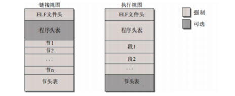
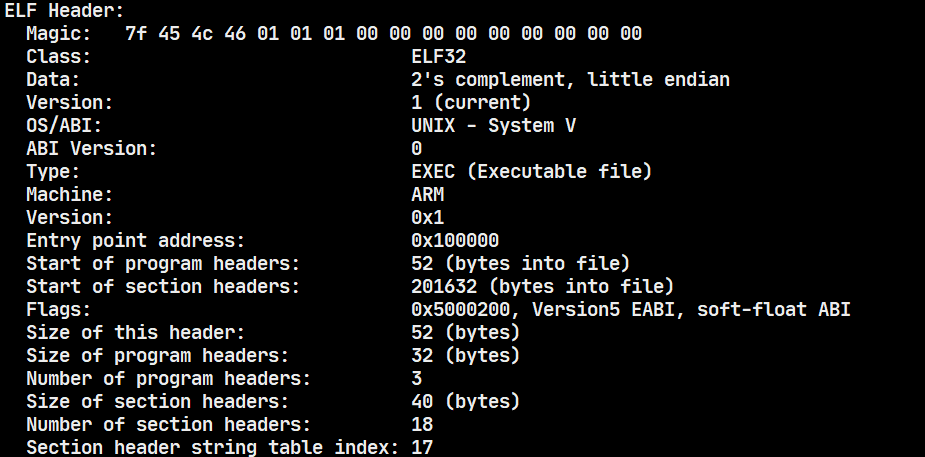
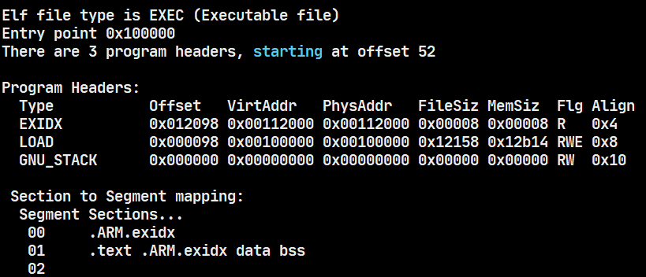
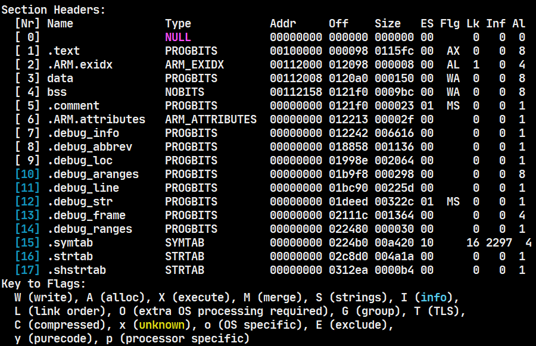

# RT-Smart应用程序(.elf)文件加载

[RT-Thread-RT-Smart ELF 应用程序加载运行过程分析RT-Thread问答社区 - RT-Thread](https://club.rt-thread.org/ask/article/8fd18929073be592.html)

以下面hello.elf为例：

```shell
msh /root_demo/bin>hello.elf
```

## 1 msh线程处理

首先RT-Thread的MSH首先会想办法得到"hello.elf"字符串，然后执行msh_exec函数，传入参数即跟得到的"hello.elf"字符串相关：

```c
void finsh_thread_entry(void *parameter)
{
    ...
    while(1)
    {
        ... // 获取
        msh_exec()
    }
}
```

## 2 msh_exec

其中msh_exec函数主要是为了解析"hello.elf"字符串：

```c
int msh_exec(char *cmd, rt_size_t length)
{
    ...
#ifdef RT_USING_LWP
    /* exec from msh_exec , debug = 0*/
    /* _msh_exec_lwp return is pid , <= 0 means failed */
    if (_msh_exec_lwp(0, cmd, length) > 0)
    {
        return 0;
    }
#endif
    ...
}
```

## 3 _msh_exec_lwp

```c
int _msh_exec_lwp(int debug, char *cmd, rt_size_t length)
{
    int argc;
    int cmd0_size = 0;
    char *argv[FINSH_ARG_MAX];
    char *pg_name;
    int ret;
    rt_kprintf("%s(%s<%d>)\r\n", __func__, cmd, length);
    /* find the size of first command */
    while ((cmd[cmd0_size] != ' ' && cmd[cmd0_size] != '\t') && cmd0_size < length)
        cmd0_size ++;
    if (cmd0_size == 0)
        return -1;

    /* split arguments */
    rt_memset(argv, 0x00, sizeof(argv));
    argc = msh_split(cmd, length, argv);
    if (argc == 0)
        return -1;

    /* try to find program in working directory */
    pg_name = _msh_exec_search_path("", argv[0]);
    if (pg_name)
    {
        goto found_program;
    }

    /* only check these paths when the first argument doesn't contain path 
       seperator */
    if (strstr(argv[0], "/"))
    {
        return -1;
    }

    /* try to find program in /bin */
    pg_name = _msh_exec_search_path("/bin", argv[0]);
    if (pg_name)
    {
        goto found_program;
    }

    /* try to find program in dirs registered to env path */
    pg_name = _msh_exec_search_env(argv[0]);
    if (pg_name)
    {
        goto found_program;
    }

    /* not found in anywhere */
    return -1;

    /* found program */
found_program:
    ret = exec(pg_name, debug, argc, argv);
    rt_free(pg_name);

    return ret;
}
```

主要流程如下：

- 解析出可执行文件和相关参数。
- 在当前路径下查找是否有可执行文件(可包含路径)。
  - 能找到：
    - 直接执行exec函数。
  - 不能找到：
    - 在"/bin"目录下查找可执行文件(不能包含路径"/")。
    - 在环境变量PATH里面查找可执行文件(不能包含路径"/")。
    - 直接执行exec函数。

## 4 exec

exec主要是调用lwp_execve函数：

```c
pid_t exec(char *filename, int debug, int argc, char **argv)
{
    return lwp_execve(filename, debug, argc, argv, __environ);
}
```

其中有几个参数介绍一下：

- filename：程序的名字。
- debug：运行在msh_exec 的时候，debug = 0。
- argc：参数个数。
- argv：参数内容。
- __environ：环境变量。

```c
pid_t lwp_execve(char *filename, int debug, int argc, char **argv, char **envp)
{
    int result;
    rt_base_t level;
    struct rt_lwp *lwp;
    char *thread_name;
    char *argv_last = argv[argc - 1];
    int bg = 0;
    struct process_aux *aux;
    int tid = 0;
    rt_kprintf("%s\r\n", filename);
    if (filename == RT_NULL)
    {
        return -RT_ERROR;
    }
    // 分配lwp内存并且初始化(重要的是进程ID pid)
    lwp = lwp_new();

    ...
    // 获取线程ID tid
    if ((tid = lwp_tid_get()) == 0)
    {
        lwp_ref_dec(lwp);
        return -ENOMEM;
    }
#ifdef RT_USING_USERSPACE
    // 用户空间初始化，主要实现功能如下：
    // 1. 分配4K*4的应用程序mmu_table
    // 2. 复制系统初始化创建的MMU_Table到应用程序的mmu_table
    // 3. 清楚应用程序空间的mmu_table，也就是前三个page 3M。
    // 4. 初始化lwp->mmu_info:
    //    a. lwp->mmu_info->vtable = mmu_table;
    //    b. lwp->mmu_info->vstart = USER_VADDR_START >> ARCH_SECTION_SHIFT = 0x001UL;
    //    c. lwp->mmu_info->vend = USER_VADDR_TOP >> ARCH_SECTION_SHIFT = 0xC00UL;
    //    d. lwp->mmu_info->pv_off = PV_OFFSET;
    if (lwp_user_space_init(lwp) != 0)
    {
        lwp_tid_put(tid);
        lwp_ref_dec(lwp);
        return -ENOMEM;
    }
#endif
    
    // 判断是否是后台运行，如果是，参数应该减少一个，并且设置bg=1
    if (argv_last[0] == '&' && argv_last[1] == '\0')
    {
        argc--;
        bg = 1;
    }
    
    // 这个函数为给定的轻量级进程复制了参数和环境变量，并将它们组织成一个特定的内存布局，这通常用于在进程创建时传递给新的进程。
    // 这样的布局允许新的进程在不需要重新分配内存的情况下直接访问这些参数和环境变量。
    // 保存在lwp->args里面。
    if ((aux = lwp_argscopy(lwp, argc, argv, envp)) == RT_NULL)
    {
        lwp_tid_put(tid);
        lwp_ref_dec(lwp);
        return -ENOMEM;
    }

    result = lwp_load(filename, lwp, RT_NULL, 0, aux);
#ifdef ARCH_MM_MMU
    if (result == 1)
    {
        /* dynmaic */
        lwp_unmap_user(lwp, (void *)(USER_VADDR_TOP - ARCH_PAGE_SIZE));
        result = load_ldso(lwp, filename, argv, envp);
    }
#endif /* ARCH_MM_MMU */
    if (result == RT_EOK)
    {
        rt_thread_t thread = RT_NULL;
        rt_uint32_t priority = 25, tick = 200;

        lwp_copy_stdio_fdt(lwp);

        /* obtain the base name */
        thread_name = strrchr(filename, '/');
        thread_name = thread_name ? thread_name + 1 : filename;
#ifndef ARCH_MM_MMU
        struct lwp_app_head *app_head = lwp->text_entry;
        if (app_head->priority)
        {
            priority = app_head->priority;
        }
        if (app_head->tick)
        {
            tick = app_head->tick;
        }
#endif /* not defined ARCH_MM_MMU */
        thread = rt_thread_create(thread_name, lwp_thread_entry, RT_NULL,
                LWP_TASK_STACK_SIZE, priority, tick);
        if (thread != RT_NULL)
        {
            struct rt_lwp *self_lwp;

            thread->tid = tid;
            lwp_tid_set_thread(tid, thread);
            LOG_D("lwp kernel => (0x%08x, 0x%08x)\n", (rt_uint32_t)thread->stack_addr,
                    (rt_uint32_t)thread->stack_addr + thread->stack_size);
            level = rt_hw_interrupt_disable();
            self_lwp = lwp_self();
            if (self_lwp)
            {
                //lwp->tgroup_leader = &thread; //add thread group leader for lwp
                lwp->__pgrp = tid;
                lwp->session = self_lwp->session;
                /* lwp add to children link */
                lwp->sibling = self_lwp->first_child;
                self_lwp->first_child = lwp;
                lwp->parent = self_lwp;
            }
            else
            {
                //lwp->tgroup_leader = &thread; //add thread group leader for lwp
                lwp->__pgrp = tid;
            }
            if (!bg)
            {
                if (lwp->session == -1)
                {
                    struct tty_struct *tty = RT_NULL;
                    tty = (struct tty_struct *)console_tty_get();
                    lwp->tty = tty;
                    lwp->tty->pgrp = lwp->__pgrp;
                    lwp->tty->session = lwp->session;
                    lwp->tty->foreground = lwp;
                    tcgetattr(1, &stdin_termios);
                    old_stdin_termios = stdin_termios;
                    stdin_termios.c_lflag |= ICANON | ECHO | ECHOCTL;
                    tcsetattr(1, 0, &stdin_termios);
                }
                else
                {
                    if (self_lwp != RT_NULL)
                    {
                        lwp->tty = self_lwp->tty;
                        lwp->tty->pgrp = lwp->__pgrp;
                        lwp->tty->session = lwp->session;
                        lwp->tty->foreground = lwp;
                    }
                    else
                    {
                        lwp->tty = RT_NULL;
                    }

                }
            }
            thread->lwp = lwp;
#ifndef ARCH_MM_MMU
            struct lwp_app_head *app_head = (struct lwp_app_head*)lwp->text_entry;
            thread->user_stack = app_head->stack_offset ?
                              (void *)(app_head->stack_offset -
                                       app_head->data_offset +
                                       (uint32_t)lwp->data_entry) : RT_NULL;
            thread->user_stack_size = app_head->stack_size;
            /* init data area */
            rt_memset(lwp->data_entry, 0, lwp->data_size);
            /* init user stack */
            rt_memset(thread->user_stack, '#', thread->user_stack_size);
#endif /* not defined ARCH_MM_MMU */
            rt_list_insert_after(&lwp->t_grp, &thread->sibling);

            if (debug && rt_dbg_ops)
            {
                lwp->debug = debug;
                rt_thread_control(thread, RT_THREAD_CTRL_BIND_CPU, (void*)0);
            }
            rt_hw_interrupt_enable(level);

            rt_thread_startup(thread);
            return lwp_to_pid(lwp);
        }
    }

    lwp_tid_put(tid);
    lwp_ref_dec(lwp);

    return -RT_ERROR;
}
```

### 4.1 lwp_user_space_init

```c
#define USER_VADDR_TOP    0xC0000000UL
#define USER_HEAP_VEND    0xB0000000UL
#define USER_HEAP_VADDR   0x80000000UL
#define USER_STACK_VSTART 0x70000000UL
#define USER_STACK_VEND   USER_HEAP_VADDR
#define LDSO_LOAD_VADDR   0x60000000UL
#define USER_VADDR_START  0x00100000UL
#define USER_LOAD_VADDR   USER_VADDR_START

int lwp_user_space_init(struct rt_lwp *lwp)
{
    return arch_user_space_init(lwp);
}

int arch_user_space_init(struct rt_lwp *lwp)
{
    size_t *mmu_table;

    mmu_table = (size_t*)rt_pages_alloc(2);
    if (!mmu_table)
    {
        return -1;
    }

    lwp->end_heap = USER_HEAP_VADDR;
    rt_memcpy(mmu_table + (KERNEL_VADDR_START >> ARCH_SECTION_SHIFT), MMUTable + (KERNEL_VADDR_START >> ARCH_SECTION_SHIFT), ARCH_PAGE_SIZE);
    rt_memset(mmu_table, 0, 3 * ARCH_PAGE_SIZE);
    rt_hw_cpu_dcache_ops(RT_HW_CACHE_FLUSH, mmu_table, 4 * ARCH_PAGE_SIZE);
    rt_hw_mmu_map_init(&lwp->mmu_info, (void*)USER_VADDR_START, USER_VADDR_TOP - USER_VADDR_START, mmu_table, PV_OFFSET);

    return 0;
}
```

### 4.2 lwp_argscopy

```c
static struct process_aux *lwp_argscopy(struct rt_lwp *lwp, int argc, char **argv, char **envp)
{
    int size = sizeof(int) * 5; /* store argc, argv, envp, aux, NULL */
    struct process_aux *aux;

    int *args;
    char *str;
    char **new_argve;
    int i;
    int len;

    // 代码首先计算了存储所有参数、环境变量和辅助结构体process_aux所需的内存大小。
    // 这包括每个字符串的长度、指向这些字符串的整数指针以及process_aux结构体本身的大小。
    for (i = 0; i < argc; i++)
    {
        size += (rt_strlen(argv[i]) + 1);
    }
    size += (sizeof(int) * argc);

    i = 0;
    if (envp)
    {
        while (envp[i] != 0)
        {
            size += (rt_strlen(envp[i]) + 1);
            size += sizeof(int);
            i++;
        }
    }

    /* for aux */
    size += sizeof(struct process_aux);

    args = (int *)rt_malloc(size);
    if (args == RT_NULL)
    {
        return RT_NULL;
    }

    /* argc, argv[], 0, envp[], 0 */
    str = (char *)((size_t)args + (argc + 2 + i + 1 + AUX_ARRAY_ITEMS_NR * 2 + 1) * sizeof(int));


    new_argve = (char **)&args[1];
    args[0] = argc;

    for (i = 0; i < argc; i++)
    {
        len = rt_strlen(argv[i]) + 1;
        new_argve[i] = str;
        rt_memcpy(str, argv[i], len);
        str += len;
    }
    new_argve[i] = 0;
    i++;

    new_argve[i] = 0;
    if (envp)
    {
        int j;
        for (j = 0; envp[j] != 0; j++)
        {
            len = rt_strlen(envp[j]) + 1;
            new_argve[i] = str;
            rt_memcpy(str, envp[j], len);
            str += len;
            i++;
        }
        new_argve[i] = 0;
    }
    /* aux */
    aux = (struct process_aux *)(new_argve + i);
    aux->item[0].key = AT_EXECFN;
    aux->item[0].value = (uint32_t)(size_t)new_argve[0];
    i += AUX_ARRAY_ITEMS_NR * 2;
    new_argve[i] = 0;

    lwp->args = args;

    return aux;
}
```

### 4.3 lwp_load

```c
RT_WEAK int lwp_load(const char *filename, struct rt_lwp *lwp, uint8_t *load_addr, size_t addr_size, struct process_aux *aux)
{
    uint8_t *ptr;
    int ret = -1;
    int len;
    int fd = -1;

    /* check file name */
    RT_ASSERT(filename != RT_NULL);
    /* check lwp control block */
    RT_ASSERT(lwp != RT_NULL);

    /* copy file name to process name */
    rt_strncpy(lwp->cmd, filename, RT_NAME_MAX);

    if (load_addr != RT_NULL)
    {
        lwp->lwp_type = LWP_TYPE_FIX_ADDR;
        ptr = load_addr;
    }
    else
    {
        lwp->lwp_type = LWP_TYPE_DYN_ADDR;
        ptr = RT_NULL;
    }

    fd = open(filename, O_BINARY | O_RDONLY, 0);
    if (fd < 0)
    {
        LOG_E("ERROR: Can't open elf file %s!", filename);
        goto out;
    }
    len = lseek(fd, 0, SEEK_END);
    if (len < 0)
    {
        LOG_E("ERROR: File %s size error!", filename);
        goto out;
    }

    lseek(fd, 0, SEEK_SET);

    ret = load_elf(fd, len, lwp, ptr, aux);
    if ((ret != RT_EOK) && (ret != 1))
    {
        LOG_E("lwp load ret = %d", ret);
    }

out:
    if (fd > 0)
    {
        close(fd);
    }
    return ret;
}
```

#### 4.3.1 load_elf

##### elf文件

在Linux下，可执行文件/动态库文件/目标文件（可重定向文件）都是同一种文件格式，我们把它称之为ELF文件格式。虽然它们三个都是ELF文件格式但都各有不同。以下文件的格式信息可以通过 `file` 命令来查看。

- 可重定位（relocatable）目标文件：通常是`.o`文件。包含二进制代码和数据，其形式可以再编译时与其他可重定位目标文件合并起来，创建一个可执行目标文件。
- 可执行（executable）目标文件：是完全链接的可执行文件，即静态链接的可执行文件。包含二进制代码和数据，其形式可以被直接复制到内存并执行。
- 共享（shared）目标文件：通常是`.so`动态链接库文件或者动态链接生成的可执行文件。一种特殊类型的可重定位目标文件，可以在加载或者运行时被动态地加载进内存并链接。注意动态库文件和动态链接生成的可执行文件都属于这一类。会在最后一节辨析时详细区分。

##### 节头部表和程序头表和ELF头

在我们的ELF文件中，有两张重要的表：节头部表（Section Tables）和程序头表（Program Headers）。可以通过`readelf -l [fileName]`和`readelf -S [fileName]`来查看。但并不是所有以上三种ELF的形式都有这两张表：

- 如果用于编译和链接（可重定位目标文件），则编译器和链接器将把elf文件看作是节头表描述的节的集合，程序头表可选。
- 如果用于加载执行（可执行目标文件），则加载器则将把elf文件看作是程序头表描述的段的集合，一个段可能包含多个节，节头部表可选。
- 如果是共享目标文件，则两者都含有。因为链接器在链接的时候需要节头部表来查看目标文件各个 section 的信息然后对各个目标文件进行链接；而加载器在加载可执行程序的时候需要程序头表 ,它需要根据这个表把相应的段加载到进程自己的的虚拟内存（虚拟地址空间）中。

此外，整个ELF文件的前64个字节，成为ELF头，可以通过`readelf -h [fileName]`来查看。我们也会在后面详细介绍。

##### 文件布局



上图展示了 elf 文件的重要组成部分：

- elf 文件头，除了用于标识ELF文件的几个字节之外，ELF头还包含了有关文件类型和大小的有关信息，及文件加载后程序执行的入口点信息。
- 程序头表（program header table）向系统提供了可执行文件的数据在进程虚拟地址空间中组织方式的相关信息。它还表示了文件可能包含的段数目、段的位置和用途。
- 各个段保存了与文件相关的各种形式的数据。例如，符号表、实际的二进制码、固定值(如字符串)或程序使用的数值常数。
- 节头表（section header table）包含了与各段相关的附加信息。

使用 readelf 工具可以读取该类型文件中的各种数据结构。

[ELF文件解析（二）：ELF header详解 - JollyWing - 博客园 (cnblogs.com)](https://www.cnblogs.com/jiqingwu/p/elf_explore_2.html)

##### 数据结构

1、elf 头表



```c
typedef struct
{
    unsigned char e_ident[EI_NIDENT]; /* 前四个字节为 0x7f E L F，其他的字节位置都有特定的语义 */
    Elf64_Half    e_type;             /* 用于区分 ELF 的文件类型，例如可重定位、可执行、动态库、core dump 文件 */
    Elf64_Half    e_machine;          /* 指定了文件所需的体系结构 */
    Elf64_Word    e_version;          /* 保存了版本信息，用于区分不同的 ELF 变体，目前该规范只定义了版本 1 */
    Elf64_Addr    e_entry;            /* 程序入口点 */
    Elf64_Off     e_phoff;            /* 程序头表在二进制文件中的偏移量 */
    Elf64_Off     e_shoff;            /* 节头表所在的偏移量 */
    Elf64_Word    e_flags;            /* 特定于处理器的标志 */
    Elf64_Half    e_ehsize;           /* 指定了ELF头的长度，单位为字节 */
    Elf64_Half    e_phentsize;        /* 指定了程序头表中一项的长度，单位为字节（所有项的长度都相同） */
    Elf64_Half    e_phnum;            /* 指定了程序头表中项的数目 */
    Elf64_Half    e_shentsize;        /* 指定节头表中一项的长度，单位为字节（所有项的长度都相同） */
    Elf64_Half    e_shnum;            /* 指定节头表中项的数目 */
    Elf64_Half    e_shstrndx;         /* 包含各节名称的字符串表在节头表中的索引位置 */
} Elf64_Ehdr;
```

2、程序头表



```c
typedef struct
{
    Elf64_Word    p_type;             /* 当前项描述的段的种类，例如可装载段、动态链接、程序解释等段类型 */
    Elf64_Word    p_flags;            /* 保存了标志信息，定义了该段的访问权限，RWX */
    Elf64_Off     p_offset;           /* 给出了所描述段在文件中的偏移量（从二进制文件起始处开始计算，单位为字节） */
    Elf64_Addr    p_vaddr;            /* 给出了段的数据映射到虚拟地址空间中的位置（对于可装载段类型） */
    Elf64_Addr    p_paddr;            /* 只支持物理寻址，不支持虚拟寻址的系统，将使用 p_paddr 保存信息 */
    Elf64_Xword   p_filesz;           /* 指定了段在二进制文件中的长度 */
    Elf64_Xword   p_memsz;            /* 制定了段在虚拟地址空间中的长度（单位为字节），与文件中物理的长度差值可通过阶段数据或者填充 0 字节来补偿 */
    Elf64_Xword   p_align;            /* 指定了段在内存和二进制文件中对其的方式（p_vaddr 和 p_offset 地址必须是模 p_align 的，也就是 p_align 的倍数），例如 p_align 的值为 0x1000 = 4096，这意味着段必须对其到 4KB 页 */
} Elf64_Phdr;
```

3、节头表



```c
typedef struct
{
    Elf64_Word    sh_name;            /* 指定了节的名称，其值不是字符串本身，而是字符串表的一个索引 */
    Elf64_Word    sh_type;            /* 指定了节的类型，例如不可用、保存程序相关信息、符号表、包含字符串表的节、重定位信息、散列表、动态链接信息等类型 */
    Elf64_Xword   sh_flags;           /* 节是否可写（SHF_WRITE），是否将为其分配虚拟内存（SHF_ALLOC），节是否包含可执行的机器代码（SHF_EXECINSTR） */
    Elf64_Addr    sh_addr;            /* 指定节映射到虚拟地址空间中的位置 */
    Elf64_Off     sh_offset;          /* 指定了节在文件中的开始位置 */
    Elf64_Xword   sh_size;            /* 指定了节的长度，单位为字节 */
    Elf64_Word    sh_link;            /* 引用另一个节头表项，可能根据节类型而进行不同的解释 */
    Elf64_Word    sh_info;            /* 与上一项联用 */
    Elf64_Xword   sh_addralign;       /* 指定了节数据在内存中对齐的方式 */
    Elf64_Xword   sh_entsize;         /* 指定了节中各数据项的长度，前提是这些数据项的长度都相同，例如字符串表 */
} Elf64_Shdr;
```

在 rt-smart 实际编码实现的过程中，为了方便数据传递，设计了一个包含上述三种数据类型的结构，利用该数据结构可以使加载过程实现更加简洁易懂，如下所示：

```c
struct elf_load_context
{
    int fd;                     /* 应用程序文件 fd */
    int len;                    /* 用于临时使用的 len */
    uint8_t *load_addr;         /* 用于临时使用的加载地址 */
    struct rt_lwp *lwp;         /* 进程句柄 */
    struct process_aux *aux;    /* 进程辅助信息句柄*/
    rt_mmu_info *m_info;        /* 进程 mmu 信息 */
    Elf_Ehdr eheader;           /* elf 头表 */
    Elf_Phdr pheader;           /* 程序头表 */
    Elf_Shdr sheader;           /* 节头表   */
    struct map_range user_area[2]; /* 在用户空间需要映射的地址空间，0 用于代码段，1 用于数据段 */
};
```

4、标准节

ELF 标准定义了若干固定名称的节。这些用于执行大多数目标文件所需的标准任务。所有名称都从点开始，以便与用户定义节或非标准节相区分，最重要的标准节如下所示：

| **标准节名称**    | **功能**                                                     |
| ----------------- | ------------------------------------------------------------ |
| .bss              | 保存程序未初始化的数据节，在程序开始运行前填充 0 字节。      |
| .data             | 包含已经初始化的程序数据。例如，预先初始化的结构，其中在编译时填充了静态数据，这些数据可以在程序运行期间更改。 |
| .rodata           | 保存了程序使用的只读数据，不能修改，例如字符串。             |
| .dynamic和.dynstr | 保存了动态信息。                                             |
| .interp           | 保存了程序解释器的名称，形式为字符串。                       |
| .shstrtab         | 包含了一个字符串表，定义了节名称。                           |
| .strtab           | 保存了一个字符串表，主要包含了符号表需要的各个字符串。       |
| .symtab           | 保存了二进制文件的符号表。                                   |
| .init和.fini      | 保存了程序初始化和结束时执行的机器指令。这两个节的内容通常是由编译器及其辅助工具自动创建的，主要是为程序建立一个适当的运行时环境。 |
| .text             | 保存了主要的机器指令。                                       |

**代码实现：**

```c
static int load_elf(int fd, int len, struct rt_lwp *lwp, uint8_t *load_addr, struct process_aux *aux)
{
    ...
    rt_mmu_info *m_info = &lwp->mmu_info;

    ...
    // 1. 检查 elf 头，判断其魔数、架构类型、版本号等是否符合要求
    // 1.1 检查头部Magic
    lseek(fd, 0, SEEK_SET);
    read_len = load_fread(&magic, 1, sizeof magic, fd);
    check_read(read_len, sizeof magic);

    if (memcmp(elf_magic, &magic, 4) != 0)
    {
        return -RT_ERROR;
    }
    
    // 1.2 检查ELF文件类型是否和系统一致。比如，都必须保证32位或者保证64位。
    //  e_ident:
    //      -> 前4个字节是ELF的Magic Number，固定为7f 45 4c 46。
    //      -> 第5个字节指明ELF文件是32位还是64位的。
    //      -> 第6个字节指明了数据的编码方式，即我们通常说的little endian或是big endian。little endian我喜欢称作小头在前，低位字节在前，或者直接说低位字节在低位地址，
    //         比如0x7f454c46，存储顺序就是46 4c 45 7f。big endian就是大头在前，高位字节在前，直接说就是高位字节在低位地址，比如0x7f454c46，在文件中的存储顺序是7f 45 4c 46。
    //      -> 第7个字节指明了ELF header的版本号，目前值都是1。
    //      -> 第8-16个字节，都填充为0。
    lseek(fd, off, SEEK_SET);
    read_len = load_fread(&eheader, 1, sizeof eheader, fd);
    check_read(read_len, sizeof eheader);
    
    if (eheader.e_ident[4] != 1)
    { /* not 32bit */
        return -RT_ERROR;
    }
    
    ...
    // 1.3 ELF header的版本号，目前值都是1
    if (eheader.e_ident[6] != 1)
    { /* ver not 1 */
        return -RT_ERROR;
    }
    
    // 1.4 判断是否是共享库文件和可执行文件
    //      -> ET_NONE, 0, No file type
    //      -> ET_REL, 1, Relocatable file（可重定位文件，通常是文件名以.o结尾，目标文件）
    //      -> ET_EXEC, 2, Executable file （可执行文件）
    //      -> ET_DYN, 3, Shared object file （动态库文件，你用gcc编译出的二进制往往也属于这种类型，惊讶吗？）
    //      -> ET_CORE, 4, Core file （core文件，是core dump生成的吧？）
    //      -> ET_NUM, 5，表示已经定义了5种文件类型
    //      -> ET_LOPROC, 0xff00, Processor-specific
    //      -> ET_HIPROC, 0xffff, Processor-specific
    if ((eheader.e_type != ET_DYN)
        && (eheader.e_type != ET_EXEC)
    )
    {
        /* not pie or exec elf */
        return -RT_ERROR;
    }
    
    // 2. 静态加载还是动态加载，静态加载继续执行，动态加载返回1。
    {
        off = eheader.e_phoff;
        for (i = 0; i < eheader.e_phnum; i++, off += sizeof pheader)
        {
            check_off(off, len);
            lseek(fd, off, SEEK_SET);
            read_len = load_fread(&pheader, 1, sizeof pheader, fd);
            check_read(read_len, sizeof pheader);

            if (pheader.p_type == PT_DYNAMIC)
            {
                /* load ld.so */
                return 1; /* 1 means dynamic */
            }
        }
    }
    
    // 3. 判断入口地址
    if (eheader.e_entry != 0)
    {
        if ((eheader.e_entry != USER_LOAD_VADDR)
                && (eheader.e_entry != LDSO_LOAD_VADDR))
        {
            /* the entry is invalidate */
            return -RT_ERROR;
        }
    }
    
    { /* load aux */
        uint8_t *process_header;
        size_t process_header_size;
        
        // 计算process_header_size，程序头表结构体所占的内存大小
        off = eheader.e_phoff;// 程序头表在二进制文件中的偏移量
        process_header_size = eheader.e_phnum * sizeof pheader;// 程序头表的数量*程序头表结构体的大小

        if (process_header_size > ARCH_PAGE_SIZE - sizeof(char[16]))// ARCH_PAGE_SIZE=1M
        {
            return -RT_ERROR;
        }
        // lwp_map_user(lwp, 0xC0000000UL - 2*4K, process_header_size, 0)
        va = (uint8_t *)lwp_map_user(lwp, (void *)(USER_VADDR_TOP - ARCH_PAGE_SIZE * 2), process_header_size, 0);
        if (!va)
        {
            return -RT_ERROR;
        }
        pa = rt_hw_mmu_v2p(m_info, va);
        process_header = (uint8_t *)pa - PV_OFFSET;

        check_off(off, len);
        lseek(fd, off, SEEK_SET);
        read_len = load_fread(process_header, 1, process_header_size, fd);
        check_read(read_len, process_header_size);

        rt_hw_cpu_dcache_ops(RT_HW_CACHE_FLUSH, process_header, process_header_size);

        aux->item[1].key = AT_PAGESZ;

        aux->item[1].value = ARCH_PAGE_SIZE;

        aux->item[2].key = AT_RANDOM;
        {
            uint32_t random_value = rt_tick_get();
            uint8_t *random;

            uint8_t *krandom;

            random = (uint8_t *)(USER_VADDR_TOP - ARCH_PAGE_SIZE - sizeof(char[16]));

            krandom = (uint8_t *)rt_hw_mmu_v2p(m_info, random);
            krandom = (uint8_t *)krandom - PV_OFFSET;
            rt_memcpy(krandom, &random_value, sizeof random_value);

            aux->item[2].value = (size_t)random;
        }
        aux->item[3].key = AT_PHDR;
        aux->item[3].value = (size_t)va;
        aux->item[4].key = AT_PHNUM;
        aux->item[4].value = eheader.e_phnum;
        aux->item[5].key = AT_PHENT;
        aux->item[5].value = sizeof pheader;
        rt_hw_cpu_dcache_ops(RT_HW_CACHE_FLUSH, aux, sizeof *aux);
    }
}
```

**主要做的事情：**

