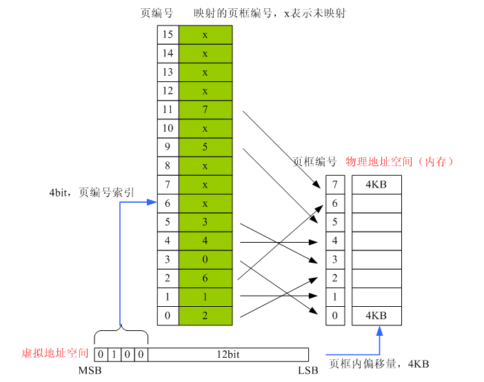
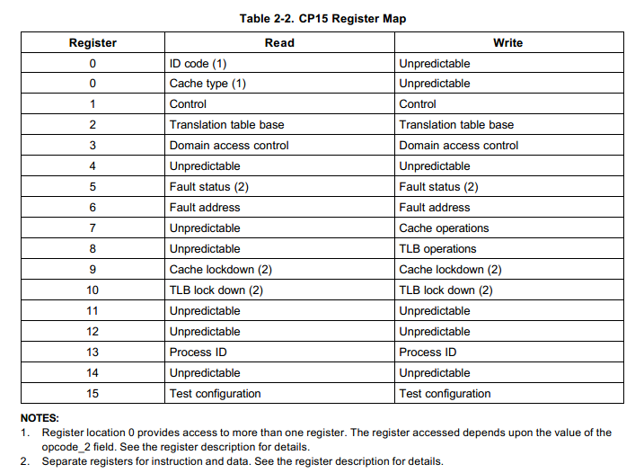

# 虚拟内存和MMU

## 1 引入

早期的计算机PC，或者现在使用8位/16位MCU（单片机）的嵌入式设备，程序是直接运行在物理内存上的（SDRAM或者NOR Flash）。所谓直接运行在物理内存上，是指程序在运行时所访问的地址都是物理地址。例如，程序计数器PC中的值就是预取指令所在的物理内存的地址值。

这种程序直接运行在物理内存上的方式简单，但是并不适应于复杂的系统，尤其是拥有多任务的OS。我们首先看看原来的方式有哪些不足和缺陷。

- 物理内存不足。例如，某个程序运行需要64K的内存，而机器上只有32K的物理内存。
- 程序运行的地址不确定。同一个程序，每次被装载到内存的地址可能不一样。
- 内存使用率低。需要运行某个程序，就需要将整个程序装入内存才能够运行。
- 对于多任务OS，存在进程间地址空间不隔离的问题。这样一个任务失败了，可能会导致整个系统宕机。

于是人们就引入了虚拟内存管理（Virtual Memory Management）技术。有关虚拟内存管理（Virtual Memory Management）技术在下面会有详细的介绍。需要说明的是，上面的几点缺陷除了第一点之外，其它都是针对有OS的系统而言的。 虚拟内存管理技术的出现和操作系统的发展有本质的联系。 本节可以参考《程序员的自我修养-链接、装载与库》第1章 1.5 内存不够怎么办。

## 2 虚拟内存管理技术

随着计算机的发展，应用程序的规模逐渐增大，一个难题出现在程序员的面前，那就是应用程序太大以至于内存容纳不下该程序，通常解决的办法是把程序分割成许多称为覆盖块（overlay）的片段。覆盖块0首先运行，结束时他将调用另一个覆盖块。虽然覆盖块的交换是由OS完成的，但是必须先由程序员把程序先进行分割，这是一个费时费力的工作，而且相当枯燥。人们必须找到更好的办法从根本上解决这个问题。

人们找到了另外一个办法，这就是虚拟内存管理（Virtual Memory Management）技术。虚拟内存管理技术的基本思想是程序，数据，堆栈的总的大小可以超过物理存储器的大小，操作系统把当前使用的部分保留在内存中，而把其他未被使用的部分保存在磁盘上。比如对一个16MB的程序和一个内存只有4MB的机器，OS通过选择，可以决定各个时刻将哪4M的内容保留在内存中，并在需要时在内存和磁盘间交换程序片段，这样就可以把这个16M的程序运行在一个只具有4M内存机器上了。而这个16M的程序在运行前不必由程序员进行分割。需要说明的一点，操作系统的内核是常驻内存的。

围绕着虚拟内存管理（Virtual Memory Management）技术，就产生了**分页技术，虚拟地址，地址空间，TLB，MMU**等概念。

### 2.1 分页技术

虚拟内存管理技术中最常见的是分页（paging）技术，MMU就是该技术的硬件实现。虚拟地址空间划分成称为页（page）的单位，而相应的物理地址空间也被进行划分，单位是页框(frame)，页和页框的大小必须相同。接下来配合图片以一个例子说明页与页框之间在MMU的调度下是如何进行映射。

在这个例子中我们有一台可以生成16位地址的机器，它的虚拟地址范围从0x0000~0xFFFF(64K)，而这台机器只有32K的物理内存。它可以运行64K的程序，但该程序不能一次性调入内存运行。这台机器必须有一个达到可以存放64K程序的外部存储器（例如磁盘或是FLASH），以保证程序片段在需要时可以被调用。在这个例子中，页的大小为4K，页框大小与页相同（这点是必须保证的，内存和外围存储器之间的传输总是以页为单位的），对应64K的虚拟地址和32K的物理内存，他们分别包含了16个页和8个页框。

我们执行下面这些指令（本例子的指令不针对任何特定机型，都是伪指令）

**例1：MOVE REG,0 //将地址0x0000的值传递进寄存器REG.**

虚拟地址0将被送往MMU，MMU看到该虚地址落在页0范围内（页0范围是0到4095），从上图我们看到页0所映射的页框为2（页框2的地址范围是8192到12287），因此MMU将该虚拟地址转化为物理地址8192，并把地址8192送到地址总线上。内存对MMU的映射一无所知，它只看到一个对地址8192的读请求并执行它。MMU从而把0到4096的虚拟地址映射到8192到12287的物理地址。

**例2：MOVE REG,20500 //将地址20500的值传递进寄存器REG.**

虚拟地址20500在虚页5（虚拟地址范围是20480到24575）距开头20个字节处，虚页5映射到页框3（页框3的地址范围是 12288到16383），于是被映射到物理地址12288+20=12308。

通过适当的设置MMU，可以把16个页隐射到8个页框中的任何一个，这可以解决上面提到的第二个问题程序运行的地址不确定，但是这个方法并没有有效的解决虚拟地址空间比物理地址空间大的问题。从上图中我们可以看到，我们只有8个页框（物理地址），但我们有16个页（虚拟地址），所以我们只能把16个页中的8个进行有效的映射。我们看看下面发生什么情况。

**例3：MOV REG,32780//将地址32780的值传递进寄存器REG.**

虚拟地址32780落在页8的范围内，从上图中我们看到页8没有被有效的进行映射（该页被打上X），这是又会发生什么？MMU注意到这个页没有被映射，于是通知CPU发生一个 **缺页故障（page fault）** 。这种情况下操作系统必须处理这个页故障，它必须从8个物理页框中找到1个当前很少被使用的页框并把该页框的内容写入外围存储器（这个动作被称为page copy），把对应虚拟地址处的程序从外围存储器拷贝到刚才腾空的页框中，随后把需要引用的页（页8）映射到刚才释放的页框中（这个动作称为修改映射关系），然后从新执行产生故障的指令（MOV REG,32780）。假设操作系统决定释放页框1，那么它将把页8装入物理地址的4-8K，并做两处修改：首先把标记页1未被映射（原来虚页1是被影射到页框1的），以使以后任何对虚拟地址4K到8K的访问都引起页故障而使操作系统做出适当的动作（这个动作正是我们现在在讨论的），其次把页8对应的页框号由X变为1，因此重新执行MOV REG,32780时，MMU将把32780映射为4108。

###  2.2 虚拟内存管理与OS

要理解内存在程序中是如何分配的，首先需要理解操作系统如何将内存分配给程序。计算机上的每一个进程都认为自己可以访问所有的物理内存。显然，由于同时在运行多个程序，所以每个进程不可能拥有全部内存。实际上，这些进程使用的是**虚拟内存**。

举个例子，让我们假定您的程序正在访问地址为 629 的内存。不过，虚拟内存系统不需要将其存储在位置为 629 的 RAM 中。实际上，它甚至可以不在 RAM 中 ―― 如果物理RAM已经满了，它甚至可能已经被转移到硬盘上！由于这类地址不必反映内存所在的物理位置，所以它们被称为虚拟内存。操作系统维持着一个虚拟地址到物理地址的转换的表，以便计算机硬件可以正确地响应地址请求。如果地址在硬盘上而不是在RAM中，那么操作系统将暂时停止您的进程，将其他内存转存到硬盘中，从硬盘上加载被请求的内存， 然后再重新启动您的进程。这样，每个进程都获得了自己可以使用的地址空间，可以访问比您物理上安装的内存更多的内存。

在32-位的x86系统上，每一个进程可以访问4GB内存。现在，大部分人的系统上并没有4GB内存，即使您将swap也算上， 每个进程所使用的内存也肯定少于 4 GB。因此，当加载一个进程时， 它会得到一个取决于某个称为系统中断点（system break）的特定地址的初始内存分配。该地址之后是未被映射的内存 ――用于在RAM或者硬盘中没有分配相应物理位置的内存。因此，如果一个进程运行超出了它初始分配的内存，那么它必须请求操作系统“映射进来（map in）”更多的内存。（映射是一个表示一一对应关系的数学术语 ―― 当内存的虚拟地址有一个对应的物理地址来存储内存内容时，该内存将被映射。）

基于UNIX的系统有两个可映射到物理内存中的基本系统调用：

- brk： brk() 是一个非常简单的系统调用。 还记得系统中断点吗？该位置是进程映射的内存边界。 brk() 只是简单地 将这个位置向前或者向后移动，就可以向进程添加内存或者从进程取走内存。
- mmap： mmap()，或者说是“内存映像”，类似于 brk()，但是更为灵活。首先，它可以映射任何位置的内存， 而不单单只局限于进程。其次，它不仅可以将虚拟地址映射到物理的 RAM 或者 swap，它还可以将 它们映射到文件和文件位置，这样，读写内存将对文件中的数据进行读写。不过，在这里，我们只关心 mmap 向进程添加被映射的内存的能力。 munmap() 所做的事情与 mmap() 相反。

如您所见， brk() 或者 mmap() 都可以用来向我们的 进程添加额外的虚拟内存。在我们的例子中将使用 brk()，因为它更简单，更通用。

摘自Jonathan Bartlett《内存管理内幕-动态分配的选择、折衷和实现》。

#### 2.2.1 虚拟/物理地址空间

地址空间是一个抽象的概念，由CPU体系架构的地址总线决定，一般等同于CPU的寻址范围、x位处理器中的x。地址空间一般分为 **虚拟地址空间** 和 **物理地址空间** 。

任何时候，计算机上都存在一个程序能够访问的地址集合，我们称之为地址空间。这个空间的大小由CPU的位数决定，例如一个32位的CPU，它的地址范围是0~0xFFFFFFFF (4G)，而对于一个64位的CPU，它的地址范围为0~0xFFFFFFFFFFFFFFFF (64T)。这个空间就是我们的程序能够产生的地址范围，我们把这个地址范围称为 **虚拟地址空间** ，该空间中的某一个地址我们称之为虚拟地址。与虚拟地址空间和虚拟地址相对应的则是物理地址空间和物理地址，大多数时候我们的系统所具备的物理地址空间只是虚拟地址空间的一个子集，这里举一个最简单的例子直观地说明这两者，对于一台内存为256MB的32bit x86主机来说，它的虚拟地址空间范围是0~0xFFFFFFFF（4G）,而物理地址空间范围是0x000000000~0x0FFFFFFF（256MB）。

虚拟地址又被简称为虚地址，物理地址又被称为实地址。虚拟地址和物理地址之间的转换，又称为虚实地址转化。

在没有使用的虚拟内存管理（Virtual Memory Management）技术机器上，虚拟地址被直接送到内存总线上，使具有相同地址的物理存储器被读写。而在使用了虚拟存储器的情况下，虚拟地址不是被直接送到内存地址总线上，而是送到内存管理单元MMU。他由一个或一组芯片组成，一般存在与协处理器中，其功能是把虚拟地址映射为物理地址。

下面这张图就是描述虚拟地址/物理地址和CPU核、MMU、内存之间的关系。

### 2.3 虚拟内存管理与TLB/MMU

虚拟内存管理（Virtual Memory Management）技术中重要的一点，就是将地址空间分成了虚拟地址和物理地址，在CPU核和内存之间的地址总线上增加了一层。首先需要指出的是，TLB和MMU只是实现虚拟地址到物理地址转化最为常见的一种办法，还有另外的方法，如下文所描述。

为了区分不同进程的存储空间，现在多任务的操作系统以及处理器都需要支持虚拟地址（Virtual Address, VA）物理地址（Physical Address, PA）转化，地址转换主要分为两种：

- 由于整个系统的进程数不定，每个进程所需要的内存不定，以及进程切换的不确定性，因此，虚实地址转化不能简单的将某个连续大内存块映射到某个进程（Coarse-grained），必须采取更细粒度（Final-grained）的映射，即将一些可能不连续的小内存块（比如4K大小）一起映射到进程，形成一块连续的虚拟地址。为了记录这些映射信息，需要页表（Page）。但是页表的导入引入了新的问题，那就是每次访存变成了两次，一次查询页表，得到物理地址，第二次通过物理地址取数（事实上有办法把这两个过程部分并行起来）。为了提高查询页表的速度，现在的处理器都为页表做了一个小Cache，叫做旁路转换缓冲(Translation lookaside buffer, TLB)。
- 直接映射，比如直接将64位的虚拟地址高位抹去，得到物理地址。这主要用于操作系统启动时的那块内存区域。主要是由于系统刚启动时，第1种转化所需要的页表，TLB没有初始化（页表，TLB其实都是操作系统管理的，倘若还用第一种，就陷入了鸡生蛋，蛋生鸡的死循环了），只能用这种最简单粗暴的办法。

摘自《处理器的存储子系统》by Sigma。直接映射的方式在MIPS内存模型中的kseg0和kseg1就是使用的这种办法，直接将虚拟地址的高1位或者3位去掉，转化成物理地址。参考和《See MIPS Run》p47。

下面我们只介绍使用MMU和TLB的映射原理。

#### 2.3.1 MMU工作原理

MMU是如何把VA映射成PA的呢？内存中保存一张VA转PA的表，MMU被配置为指向该表的开始的物理地址，给一个VA通过MMU查表就可以查到PA，这是从简单处理解。实际上并不是这么简单，通常要有一个多级的查表过程，对于ARM体系结构是两级查表，对于一些64位体系结构则需要更多级。MMU的工作原理和机制，参考下面的各处理器架构MMU实例章节。

###  2.4 X86的MMU实例

以32位的x86系统为例。

x86采用两级页表结构，第一级称为页目录表，第二级称为页表。

| 名称     | 类型 | VA索引bit位  | 页表项 | 存储大小/KB | 默认页大小 | 支持的页大小 |
| -------- | ---- | ------------ | ------ | ----------- | ---------- | ------------ |
| 页目录表 | L1   | 10位 [31:22] | 1024   | 4           | xxx        | xxx          |
| 页表     | L2   | 10位 [21:12] | 1024   | 4           | 4KB        | xxx          |

页表目录的起始物理地址由CPU中的CR3寄存器指定。

### 2.5 ARM920T的MMU实例

重点参考《ARM嵌入式系统开发-软件设计与优化》第14章 存储管理单元。下面的使用的截图是三星公司的S3C2410，这款芯片是一种很常见的采用ARM920T的芯片。

ARM920T的MMU和Cache都集成在CP15协处理器中，MMU和Cache的联系非常密切。

下面是CP15协处理器的寄存器列表，和CPU核的r0到r15寄存器一样，协处理器寄存器也是用0到15来编号，在指令中用4个bit来表示寄存器编号，有些协处理器寄存器有影子寄存器。

CP15:c2寄存器保存转化表基地址TTB（Translation Table Base address）――指向L1主页表在物理内存中的位置。TTB地址必须与存储器的16KB边界对齐（寄存器的bit0 - bit13 为0，should be zero）。

对CP15协处理器的操作使用mcr和mrc两条协处理器指令，这两条指令的记法是从后往前看：mcr是把r（CPU核寄存器）中的数据传送到c（协处理器寄存器）中，mrc则是把c（协处理器寄存器）中的数据传送到r（CPU核寄存器）中。对CP15协处理器的所有操作都是通过CPU核寄存器和CP15寄存器之间交换数据来完成的。

#### 2.5.1 Translation Table Walk

这个过程称为Translation Table Walk，Walk这个词用得非常形象。从TTB走到一级页表，又走到二级页表，又走到物理页面， **一次寻址其实是三次访问物理内存。** 注意这个“走”的过程完全是硬件做的，每次CPU寻址时MMU就自动完成以上四步，不需要编写指令指示MMU去做，前提是操作系统要维护页表项的正确性，每次分配内存时填写相应的页表项，每次释放内存时清除相应的页表项，在必要的时候分配或释放整个页表。

### 2.6 ARM的MMU实例

ARM MMU硬件采用2级页表结构：一级页表（L1）和二级页表（L2）。

L1页表只有一个主页表，也称为L1主页表（L1 master page table）或者段页表（section page table）。使用VA的高12bit位索引该表，所以该表有2的12次方（4K）个页表项（PTE，page table entry），每个页表项4个字节，一共需要占去内存16KB。

有两种类型的L2页表，分别是L2粗页表（coarse page table）和L2细页表（fine page table）。对于L2粗页表，使用VA的次高8bit索引该表，所以该表有2的8次方（256）个页表项（PTE，page table entry），每个页表项4个字节，一共需要占去内存1KB。对于L2细页表，使用VA的次高10bit索引该表，所以该表有2的10次方（1024）个页表项（PTE，page table entry），每个页表项4个字节，一共需要占去内存4KB。

| 名称          | 类型 | VA索引bit位  | 页表项 | 存储大小/KB | 默认页大小 | 支持的页大小 |
| ------------- | ---- | ------------ | ------ | ----------- | ---------- | ------------ |
| 主页表/段页表 | L1   | 12位 [31:20] | 4096   | 16          | 1MB        | 1MB          |
| 细页表        | L2   | 10位 [19:10] | 1024   | 4           | 1KB        | 1/4/64KB     |
| 粗页表        | L2   | 8位 [19:12]  | 256    | 1           | 4KB        | 4/64KB       |

下图是使用L1主页表和粗页表实现的一个简单VA到PA的转化示意图：

### 2.7 多级页表的意义

对于OS来说，页表是进程私有的，因此各个进程的页表被放置在不同的物理内存中。在进程启动或者切换时，都必须把进程的页表的起始物理地址告诉MMU，也就是上面提到的TTB值（CP15:c2寄存器）。下面看采用单级页表的情况。假设页的大小为4KB，那么对于页表的索引就需要使用VA的[31:12]，也就有1M个页表项，一个页表项4字节，可以算的页表的大小为4M。 **这意味着这4M空间必须作为进程的必备资源在启动的时候一次分配，而且这4M的内存必须在物理地址上连续。** 这和虚拟内存设计的理念（小内存系统上运行尽量多的程序）不相符合。解决的办法就是采用多级页表。

多级页表是如何解决单级页表存在的问题呢？考虑到一个进程不需要同时访问到4GB的内存，因此把页表也分散开来，一级页表必须分配，二级页表像物理页面那样在需要的时候再分配映射。当然，多级页表需要MMU硬件支持。