# Armv7 MMU

## 0 参考链接

[ARMv7 MMU多级页表_mmu二级页表应用-CSDN博客](https://blog.csdn.net/qq_33854057/article/details/126198155)

[ARMv7-A 处理器窥探(5) —— MMU/TLB_armv7多进程基础之mmu篇-CSDN博客](https://blog.csdn.net/zhoutaopower/article/details/114293357)

## 1 MMU/TLB/Cache概述

**MMU：完成的工作就是虚拟地址到物理地址的转换，**可以让系统中的多个程序跑在自己独立的虚拟地址空间中，相互不会影响。程序可以对底层的物理内存一无所知，物理地址可以是不连续的，但是不妨碍映射连续的虚拟地址空间。

**TLB：MMU工作的过程就是查询页表的过程，页表放置在内存中时查询开销太大，因此专门有一小片访问更快的区域用于存放地址转换条目，用于提高查找效率。**当页表内容有变化的时候，需要清除TLB，以防止地址映射出错。

**Cache：处理器和存储器之间的缓存机制，用于提高访问速率，**在ARMv7上会存在多级Cache，其中L1 Cache分为指令Cache和数据Cache，在CPU Core的内部，支持虚拟地址寻址；L2 Cache容量更大，同时存储指令和数据，为多个CPU Core共用，这多个CPU Core也就组成了一个Cluster。

他们之间的关系如下：

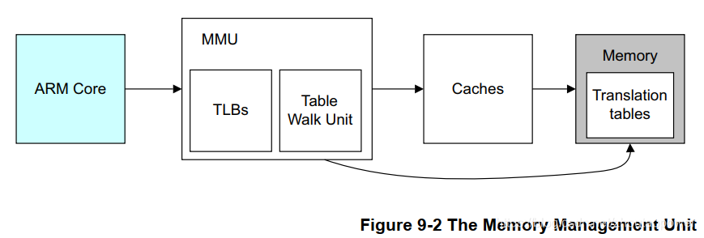

- ARM 处理器发出地址访问（虚拟地址），首先过 MMU 地址翻译单元的 TLB，如果 TLB 命中，那么直接返回真实的物理地址；
- 如果 TLB Miss，那么就要靠 Table Walk 单元去主存中查找表，以获取物理地址，然后通过 Cache，去访问；
- Cache 如果命中，那么直接返回实际物理地址的数据，否则，也就是最糟糕的情况，会去访问主存的数据；

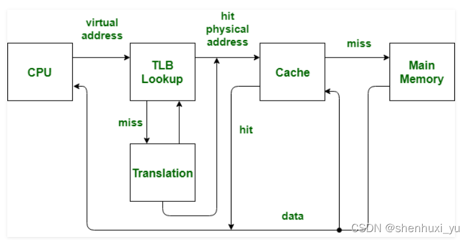

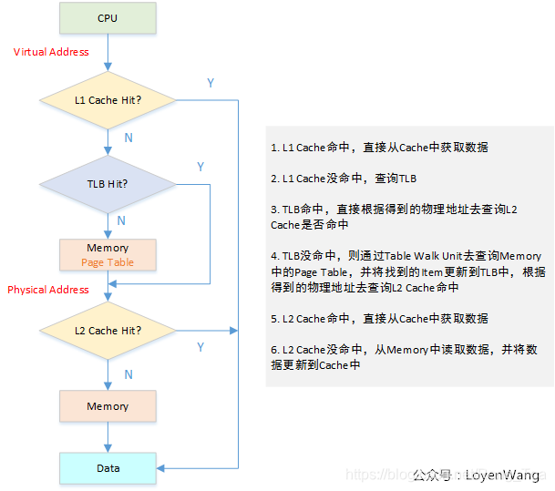

上面的过程呢，软件要做的，只有配置并放好这个 **Transliation Tables**，其他的过程，全部是硬件行为；下面马上仔细的过这部分的细节；

使能 MMU 的参考代码（因为是 CP15 的系统控制寄存器，所以使用 MRC/MCR 指令）：

```assembly
MRC p15, 0, R1, c1, C0, 0 ;Read control register
ORR R1, #0x1 ;Set M bit
MCR p15, 0,R1,C1, C0,0 ;Write control register and enable MMU
```

这里要注意的一点是，可能要用到内存屏障指令，因为这里就开启了 MMU，即将进入虚拟内存的世界，要确保在这之前，流水线干净，所以执行已经完毕；

## 2 TLB

TLB 的全称是：Translation Lookaside Buffer；从第一节的那个图可以看出来，MMU 做 Table Walk 的这个 Transliation Tables 是放到主存中，主存访问速度很慢（加 Cache 的根本原因），所以，这里每次都去再主存中做 Table Walk，显然效率非常低，所以，这里就为这个 Table Walk 定制了一个属于他的 “Cache”，称之为 TLB；

> [!NOTE]
>
> 但是与 真是的 Cache 不一样（详见《[ARMv7-A 处理器窥探(4) —— Cache](https://blog.csdn.net/zhoutaopower/article/details/114261961)》），这个 TLB 是专门缓存 Transliation Tables 的。

典型的情况，他的组成如下：

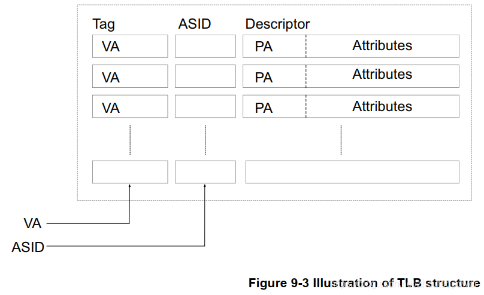

由 VA、ASID、PA、Attributes 组成，即：

- **VA**：虚拟地址；
- **PA**：物理地址；
- **ASID**：Address Space ID；
- **Attributes**：属性；

## 3 MMU

这里，抛开大物理地址扩展和 section 和 supersection 的分析，暂时就看最最常用的两段查找；两段页表查找，我们称第一级页表为 L1，第二级为 L2；

### 3.1 TTBR0、TTBR1、TTBCR

前面知道，软件需要负责构建这个虚拟地址到物理地址的转换表：Transliation Tables，当软件构件完毕这个表后，**只需要告诉硬件，这个 Transliation Tables 放到了那个首地址即可**，这个配置通过写 ARM 的 TTBR 寄存器实现（Translation Table Base Address ）；这里其实有两个 TTBR 寄存器，分别叫 TTBR0 和 TTBR1，为啥两个，后面解释；

#### 3.1.1 TTBCR

和这个 TTBR0、TTBR1 勾肩搭背的，还有一个 TTBCR 寄存器，他们直接什么关系呢，看寄存器说明：

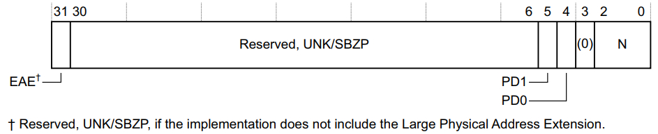

主要关注这里的 N[2:0]，指示TTBR0页表基址寄存器基址位宽，同时指示使用 TTBR0 还是 TTBR1 作为页表基址寄存器，以及 TTBR0 页表尺寸：

- 如果 N = 0 的话，则在做 Table Walk 的时候使用 TTBR0 指定的基地址作为 Transliation Tables 入口的地址；
- 如果 N > 0 的话：指示TTBR0页表基址寄存器基址位宽，同时指示使用 TTBR0 还是 TTBR1 作为页表基址寄存器，以及 TTBR0 页表尺寸；

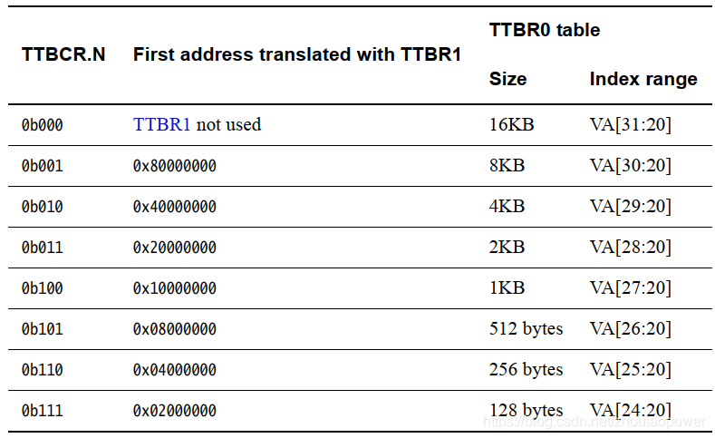

根据上图的得出下面结果：

如果 N==0，也就是 系统中没有配置 TTBCR的默认值，那么 ARM 总是使用 TTBR0来翻译虚拟地址 ， 所以默认情况下，TTBR1是没有用的。

如果 N==1， 那么当 ARM 遇到大于等于0x80000000的地址时，就 需要使 用 TTBR1寄存器指向的映射表来转换虚拟地址 ，相应地 落在[0x0000000, 0x8000000]范围内的虚拟地址需要使用TTBR0映射表来翻译。

如果 N==2， 临界地址是0x40000000，其余临界地址请参阅下表。

| N    | 使用TTBR0的地址范围       | 使用TTBR1的地址范围       | TTBR0的size |
| ---- | ------------------------- | ------------------------- | ----------- |
| 000  | [0x0000_0000~0xFFFF_FFFF] | ----                      | 16KB        |
| 001  | [0x0000_0000~0x8000_0000] | [0x8000_0000~0xFFFF_FFFF] | 8KB         |
| 002  | [0x0000_0000~0x4000_0000] | [0x4000_0000~0xFFFF_FFFF] | 4KB         |
| 003  | [0x0000_0000~0x2000_0000] | [0x2000_0000~0xFFFF_FFFF] | 2KB         |
| 004  | [0x0000_0000~0x1000_0000] | [0x1000_0000~0xFFFF_FFFF] | 1KB         |
| 005  | [0x0000_0000~0x0800_0000] | [0x0800_0000~0xFFFF_FFFF] | 512bytes    |
| 006  | [0x0000_0000~0x0400_0000] | [0x0400_0000~0xFFFF_FFFF] | 256bytes    |
| 007  | [0x0000_0000~0x0200_0000] | [0x0200_0000~0xFFFF_FFFF] | 128bytes    |

ARM 官方举了个例子，当 TTBCR.N=3b111 的时候，VA [31:25] 全部为 0 的时候，使用 TTBR0，按照地址空间来划分就是：

- 0x0000_0000 ~ 0x01FF_FFFF 这段区间使用 TTBR0 作为 Transliation Tables 入口的地址；
- 0x0200_0000 ~ 0xFFFF_FFFF 这段区间使用 TTBR1 作为 Transliation Tables 入口的地址；

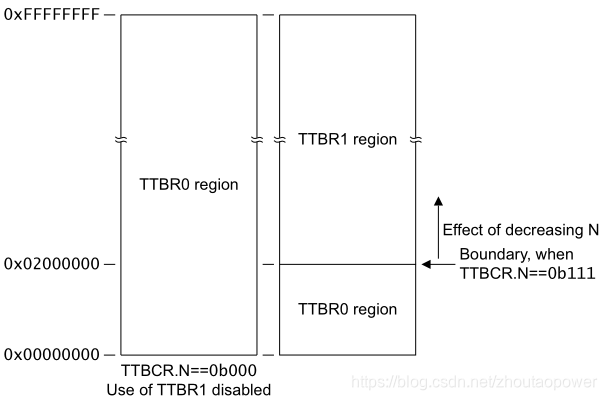

OK，现在可以理解为，配置 TTBCR.N 这个值，可以实现将虚拟地址切割成为两部分，一部分使用 TTBR0 指定的 Transliation Tables 进行 Table Walk，另一部分使用 TTBR1 指定的 Transliation Tables 进行 Table Walk，这个有什么好处呢？

比如，内核的页表，是不会改变的，而进程上下文的页表是会改变的，有了这个的话，就可以考虑用一个 TTBR 来专门为内核服务，另一个 TTBR 为进程服务，**这样避免进程和内核使用同一个页表，每次都要进行内核页表的拷贝；**

由于 TTBCR 是 CP15 的寄存器，访问 TTBCR 的指令为：

```assembly
MRC p15, 0, <Rt>, c2, c0, 2 ; Read TTBCR into Rt
MCR p15, 0, <Rt>, c2, c0, 2 ; Write RT to TTBCR
```

#### 3.1.2 TTBR0、TTBR1

上面说了 TTBCR，下面来看 TTRB0、TTRB1 寄存器描述：

**TTBR0**

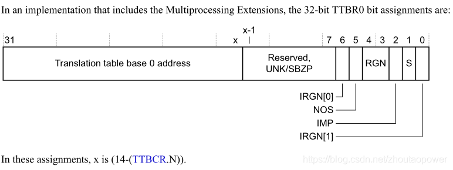

在带有多核处理器扩展的情况下 TTBR0 由一个可变的长度构成 Transliation Tables Base Address，这个 x 就是上面的 (14 - (TTBCR.N))；

- **Bits[31:x]**：x=(14-(TTBCR.N))。一级页表地址；
- **Bits[x-1:7]**：Reserved；
- **NOS**：Not Outer Shareable bit，指示了做 Table walk 的那个内存的属性，是 Outer Shareable 还是 Inner Shareable；TTBR0.S == 0 时，该bit无效；
  - **0** ：Outer Shareable.
  - **1** ：Inner Shareable.
- **S**：Shareable bit. 指示内存共享属性与页表转换的关系；
  - **0** ：Non-shareable.
  - **1** ：Shareable.
- **RNG**：Region bits，指示 Outer Cache 属性与页表转换的关系；
  - 0b00：Normal memory, Outer Non-cacheable.
  - 0b01：Normal memory, Outer Write-Back Write-Allocate Cacheable.
  - 0b10：Normal memory, Outer Write-Through Cacheable.
  - 0b11：Normal memory, Outer Write-Back no Write-Allocate Cacheable.
- **IRGN[6，0]**：Inner region bits，指示 Inner Cache 属性与页表转换的关系；
  - 0b00：Normal memory, Inner Non-cacheable.
  - 0b01：Normal memory, Inner Write-Back Write-Allocate Cacheable.
  - 0b10：Normal memory, Inner Write-Through Cacheable.
  - 0b11：Normal memory, Inner Write-Back no Write-Allocate Cacheable.

访问 TTBR0 的指令为：

```assembly
MRC p15, 0, <Rt>, c2, c0, 0 ; Read 32-bit TTBR0 into Rt
MCR p15, 0, <Rt>, c2, c0, 0 ; Write Rt to 32-bit TTBR0
```

**TTBR1**

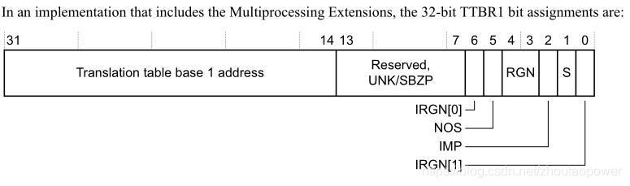

它的位域和 TTBR0 几乎一样，唯一不一样的地方在于，配置的地址区间在于 bit[31:14]，这意味着，配置进 TTBR1 的 Transliation Tables Base Address 的物理地址，必须 16KB 对齐；

```assembly
MRC p15, 0, <Rt>, c2, c0, 1 ; Read 32-bit TTBR1 into Rt
MCR p15, 0, <Rt>, c2, c0, 1 ; Write Rt to 32-bit TTBR1
```

### 3.2 Translation Table

现在我们知道了合理的配置 TTBCR/TTBR0/TTBR1 可以分配并指定 Transliation Tables，而这个 Transliation Tables 位于内存中，用作 MMU 来做 Table Walk；那么接下来我们需要知道页表的结构，这样我们才能够在内存中创建页表，并将页表配置给 TTBR 寄存器，完成 MMU 的配置；

不考虑大地址扩展和 SuperSection 以及 Section 的情况下，针对 Transliation Tables，ARMv7-A 的手册给出了如下的图解

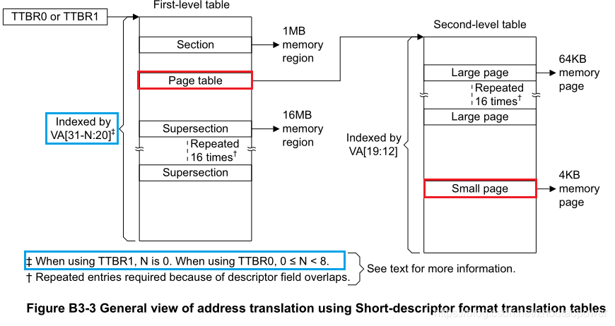

图中，我们暂时只考虑 Page Table 的情况，即红色部分（其余的可以照着推）；

蓝色的部分，可以理解为之前寄存器里面配置的那个 N 值；这里为了说明情况，**我们暂时将 N 定为 0**；

#### 3.2.1 L1 Address Translation

我们先暂时不管使用 TTBR0 还是 TTBR1，其实过程是一样的；此刻当 N = 0 的时候，一级页表以虚拟地址（后面简称 VA，即 Virtual Address）VA[31:20] 作为 L1 Index，一共 12bits，最大能够表征 4K 的 Index：

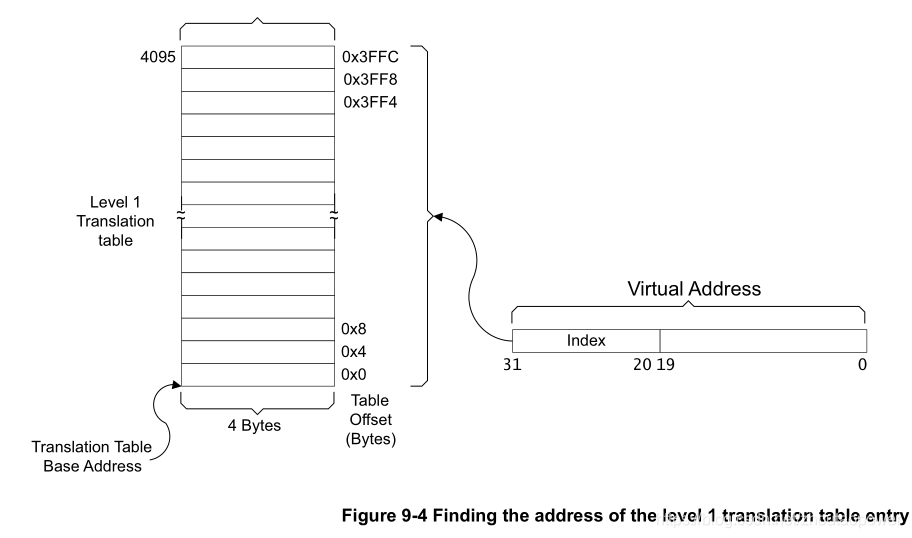

每个入口是 4 Bytes 也就是一个 Word，32bits 的入口，L1 Index 从 0~4095，一共 4K，在内存上，每个入口 4Bytes，那么 **L1 页表占用内存 4K x 4 Bytes = 16KB**；

每一个入口是什么样子的呢，我们放大来看：

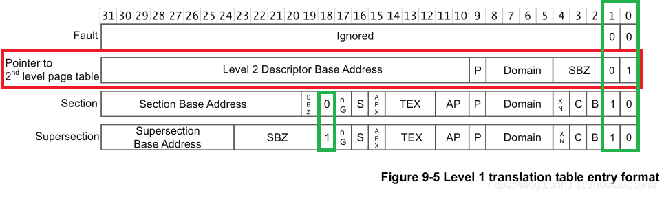

可以看到，这个入口，根据不同的配置，内容有所区别，一共有 4 种类型，这 4 种类型，通过 32bits 的尾部 2 bits 来区分，即，绿色部分（Section 和 SuperSection 的区分，还靠 bit[18]）；

这里我们暂时不关心 Section 和 SuperSection，关注于红色部分和那个 Fault；

Level 2 Descriptor Base Address：指向的是 L2 页表的物理地址的基地址；可以看到他是 bit[31:10]，**是 1KB 边界对齐的**；

这个 Domain 指的是 ARM 支持将内存标记为最多 16 个 domain，并以 Domain ID 作为区分，每个 Domain 可以支持配置成为不同的访问权限（通过配置 CP15 的 C3 的 Domain Access Control Register (DACR) 寄存器）：

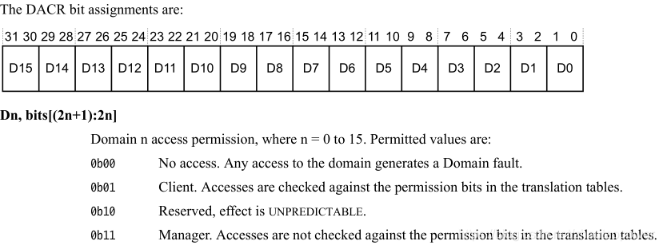

总结一下，一级转换表有下面的一些细节：

- 转换表的地址必须按照16KB对齐（因为MMU的寄存器问题，只记录转换表地址的高18位）。
- 每个Entry长度为32，也就是一个word的长度。
- Entry最低两位表示Entry的类型，这表明不同类型的Entry可以同时存在，软件可以自由选择是否使用二级转换表。
- 将4G空间划分为4096个1M的section，也就是一级转换表一共有4096个entry.
- 关于supercetion，需要特别强调的是，相当于16个普通的section，需要16个完全相同的Entry，但是MMU中可以识别这是同一个supersection，这样能够加速MMU地址转换的过程(TLB hit)，但对软件来说并不会节省管理内存。

配置指令为：

```assembly
MRC p15, 0, <Rt>, c3, c0, 0 ; Read DACR into Rt
MCR p15, 0, <Rt>, c3, c0, 0 ; Write Rt to DACR
```

针对这个 DACR 寄存器，ARM 官方建议配置成为 Client；

#### 3.2.2 L2 Address Translation

介绍完 L1 Address Translation 后，下面是二级页表！与 L1 页表不一样，二级页表不和 N 值挂钩，它直接采用 VA[19:12] 作为 L2 Index 索引，一共 8 bits，最大能够表征 256 的 L2 Index；

加入 L2 页表后结合 L1，通过一个给定的 VA 进行索引的第二步为（图中表示的 N 值为 0）：

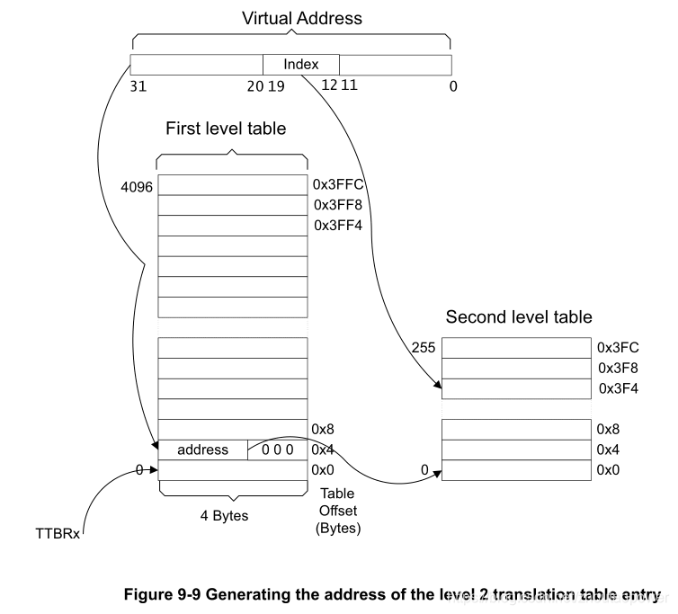

这样，一个 VA 通过高地址部分[31:20] 索引到了 L1，再从 L1 指向的 L2 加上 VA[19:12] 作为 L2 Index，索引到 L2 表的固定位置；

L2 也是每条由 4 Bytes 构成，即一个 32bits 的数，那么一个 L2 表大小为 256 x 4 Bytes = 1024 Bytes = 1KB；一共有 4096 个这样的 L2，那么 **L2 表总的大小为：4096 x 1KB = 4MB**；

我们放大每一条 L2 的入口：

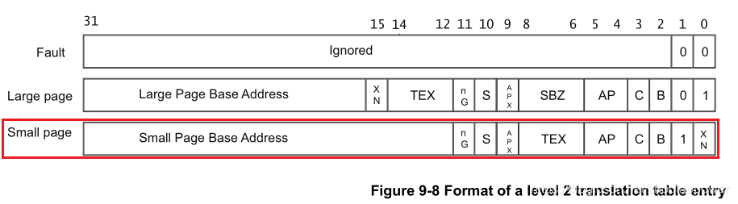

我们只关心红色部分！可以看到，这个 Small Page Base Address 有 bit[31:12] 也就是 **4KB 边界对齐**！接下来我们看剩余几个位的含义：

- **AP/APX**：Access Permission 即访问权限，每个内存区域 都有自己的权限，不符合访问权限的 内存访问都会引发 异常。如果是 数据访问 则引发 数据异常。如果是 指令访问，且该指令在执行前没有被 flush，将引发 预取指异常。引发的 异常原因将会被设置在 CP15 的 the fault address and fault status registers；
  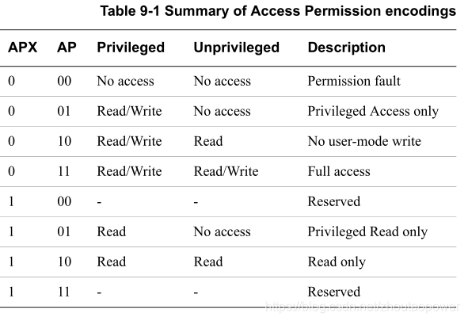
- **内存区域类型** 可以通过 **TEX字段**、**C字段** 和 **B字段** 来进行设置：
  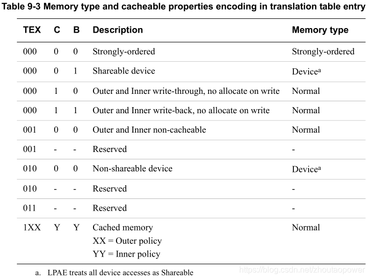
- **XN**：指的是 Execute Never，不允许执行，如果往这里取地址执行，那么会导致异常发生；通常，Device memory 类型的区域会配置成为 XN；
- **S**：指的是是否具有 Shareable 属性；
- **nG**：non-Global，这个标记告诉 MMU，这个页表是否是一个全局的，什么意思呢？看下面：
  - 当 nG 为 0 的时候，说明此区域是全局可见的，换句话来说，就是任何时候都生效；
  - 当 nG 为 1 的时候，说明此区域不是全局的，要联合这个 ASID 来确认；
    - 每一个 nG=1 的区域，都会和 ASID 来关联，ASID （Address Space Identifier），这代表，TLB 可以存在多个不同进程的页表缓存，后面说 ASID 的时候会仔细说；

总结一下，二级转换表有下面细节：

- 二级转换表（页表）是有很多个的，每个一级页表都对应一个二级页表数组。
- 二级页表的每个entry为1个word，也就4字节。
- 每个二级页表都有256个entry（无论是large page还是small page），也就是说每个二级页表都占1KB内存。
- Large Page与前文的Super Section一样，同样需要占用多个entry，这里是16个二级页表的entry. 这样能够使得MMU TLB hit概率变大，加速地址转换过程，并不会节省页表大小。

#### 3.2.3 仅使用1st Translation Table映射过程

当entry的格式为section格式时，也就是低2位为10时，就发生如图的过程。图中TB时Taslation Table的缩写。整体过程再简单描述一下：

- 需要将一级转换表的基地址告诉给MMU的对应寄存器（需要软件显示操作MMU寄存器），应为这个寄存器只保留高18位，所有转换表的起始地址必须是16K对齐的。
- 转换时，拿到虚拟地址的高12位，作为index，找到对应的entry：l1_mmu_tt[index].
- 对应的entry如果最低2位为10，表示是section格式，也就是说直接替换虚拟地址的高12位即可得到物理地址。
- 从entry中取出对应的高12位，替换。

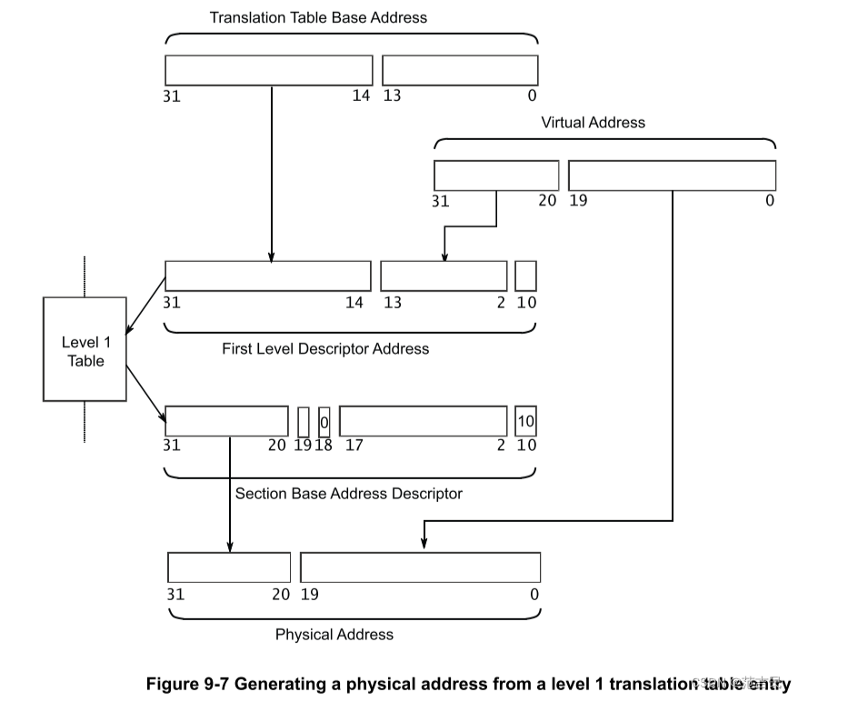

#### 3.2.4 使用两级Translation Table映射过程

要使用2级Translation，也就是常说的2级页表，需要第一级对应的entry的最低2位为01，表示entry指向一个2级页表的描述符。整体过程再简单描述一下：

- 首先将一级页表的基地址告诉MMU的寄存器TTBR（需要软件显示操作MMU寄存器），注意一级页表需要按照16KB对齐，原因已经阐述过。
- 通过虚拟地址的高12位作为index，找到对应的L1 entry: l1_mmu_tt[index]，对应的entry最低2位为01.
- 从L1 entry的高22位拿到对应的L2 Translation Table基地址.。因此L2 Table必须是按照4KB对齐的，因为L1 entry只记录其地址的高22位。
- 通过虚拟地址的中间10位作为index，找到对应的L2 entry.
- 将虚拟地址的高22位替换成为L2 entry的高22位即得到物理地址（如果是small page，entry的最低两位为1x(11或10）。large page类似，替换高16位即可。

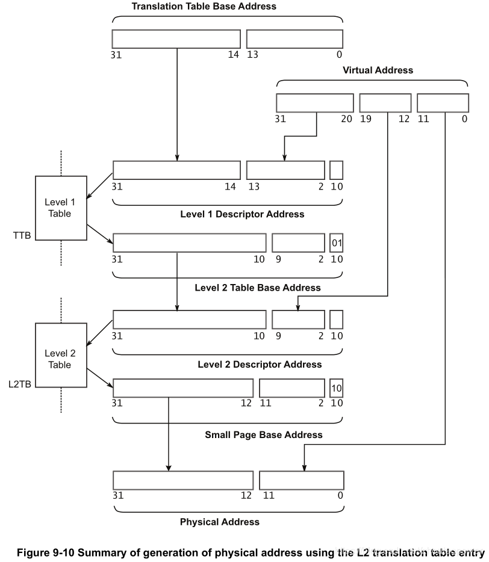

VA 的 4K 页内偏移，直接对应到 PA 的 4KB 页内偏移；

## 4 OS Usage Of Translation Tables

通常情况下，在使用 Cortex-A 系列处理器的时候，典型场景是跑多任务 OS；每一个任务（或者成为应用），都有它独立的虚拟地址空间，以及他的独立的 Translation Table；但是对于 OS 来说，Kernel 的 Translation Tables 其实是固定的，只是进程之间的 Translation Tables 不一样而已；

当一个进程启动的时候，OS 负责为他 code 和 data 段建立映射表（Translation Tables）；当进程调用诸如 malloc 之类分配内存的行为，OS 负责修改 Translation Tables（Linux 中，实际访问分配的内存的时候，才去修改页表），进程生命周期消亡，OS 负责回收它的资源和页表，并可以为下一个新的进程提供资源；每一个进程都有自己的独立的页表，这便可以保证进程之间不会相互干扰；

### 4.1 Address Space ID（ASID）

在操作系统中，多进程是一种常态。那么多进程 的情况下，每次切换进程都需要进行 TLB 清理。这样会导致切换的效率变低。为了解决问题，TLB 引入了 ASID(Address Space ID) 。ASID 的范围是 0-255。ASID 由操作系统分配，当前进程的ASID值 被写在 ASID 寄存器 (使用CP15 c3访问)。TLB 在更新页表项时也会将 ASID 写入 TLB。

如果设置了如果 当前进程的ASID，那么 MMU 在查找 TLB 时， 只会查找 TLB 中具有 相同ASID值 的 TLB行。且在切换进程是，TLB 中被设置了 ASID 的 TLB行 不会被清理掉，当下次切换回来的时候还在。所以ASID 的出现使得切换进程时不需要清理 TLB 中的所有数据，可以大大减少切换开销。

有了这个 ASID + nG 的机制，那么 TLB 中就可以缓存不同进程的页表，不用每次都去 flush TLB，导致性能的损失：

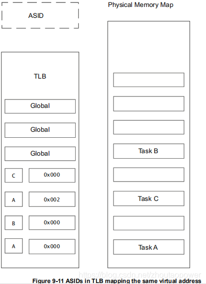

### 4.2 TTBR0、TTBR1

前面我们说了 TTBR0、TTBR1 是根据 TTBCR.N 来进行划分的，典型场景下 OS 跑多任务，如果处理器只能够支持一个 TTBR 的话，也就意味着用户空间和内核空间使用同一个 TTBR，由于内核空间的 code 和 data 几乎是不变的，但是多任务的用户空间都是不一样的，这样就会存在两个问题：

- 多个任务的页表里面，都有同样一部分内核映射的拷贝副本；
- 要修改内核映射的时候，所有任务的页表都要修改；

加入两个 TTBR 的原因，是因为希望内核和用户空间使用两套 TTBR，这样就可以避免上面的尴尬；内核空间固定使用一组，用户空间不断的切换（比如，配合 TTBR0 + ASID 进行性能的提升）
