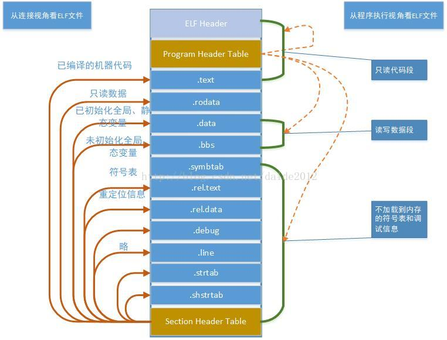

# ELF文件分析

## 1 ELF文件

目标文件再不同的系统或平台上具有不同的命名格式，在Unix和X86-64 Linux上称为ELF(Executable and Linkable Format, ELF)。

ELF文件格式提供了两种不同的视角：

- 在汇编器和链接器看来，ELF文件是由Section Header Table描述的一系列Section的集合。
- 而执行一个ELF文件时，在加载器（Loader）看来它是由Program Header Table描述的一系列Segment的集合。



左边是从汇编器和链接器的视角来看这个文件，开头的ELF Header描述了体系结构和操作系统等基本信息，并指出Section Header Table和Program Header Table在文件中的什么位置，Program Header Table在汇编和链接过程中没有用到，所以是可有可无的，Section Header Table中保存了所有Section的描述信息。

右边是从加载器的视角来看这个文件，开头是ELF Header，Program Header Table中保存了所有Segment的描述信息，Section Header Table在加载过程中没有用到，所以是可有可无的。注意Section Header Table和Program Header Table并不是一定要位于文件开头和结尾的，其位置由ELF Header指出，上图这么画只是为了清晰。

我们在汇编程序中用.section声明的Section会成为目标文件中的Section，此外汇编器还会自动添加一些Section（比如符号表）。**Segment**是指在程序运行时加载到内存的具有相同属性的区域，由一个或多个Section组成，比如有两个Section都要求加载到内存后可读可写，就属于同一个Segment。有些Section只对汇编器和链接器有意义，在运行时用不到，也不需要加载到内存，那么就不属于任何Segment。

- 目标文件需要链接器做进一步处理，所以一定有Section Header Table；
- 可执行文件需要加载运行，所以一定有Program Header Table；
- 而共享库既要加载运行，又要在加载时做动态链接，所以既有Section Header Table又有Program Header Table。

下面用`readelf`工具读出目标文件`max.o`的ELF Header和Section Header Table，然后我们逐段分析。

```
ELF Header:
  Magic:   7f 45 4c 46 01 01 01 00 00 00 00 00 00 00 00 00
  Class:                             ELF32
  Data:                              2's complement, little endian
  Version:                           1 (current)
  OS/ABI:                            UNIX - System V
  ABI Version:                       0
  Type:                              EXEC (Executable file)
  Machine:                           ARM
  Version:                           0x1
  Entry point address:               0x100000
  Start of program headers:          52 (bytes into file)
  Start of section headers:          197700 (bytes into file)
  Flags:                             0x5000200, Version5 EABI, soft-float ABI
  Size of this header:               52 (bytes)
  Size of program headers:           32 (bytes)
  Number of program headers:         3
  Size of section headers:           40 (bytes)
  Number of section headers:         20
  Section header string table index: 19

```

