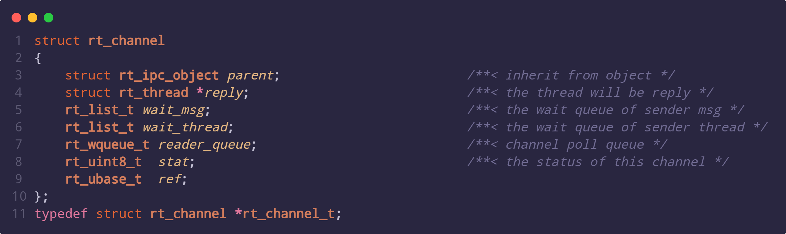

# RT-Smart 进程通信机制

## 1 数据结构解析

### 1.1 struct channel




假设定义一个struct channel变量：

```c
struct channel ch;
```

下面对该结构体中重要的成员变量进行说明：

- ch.parent.suspend_thread：线程在执行rt_channel_recv这样的函数时，如果ch->wait_msg上没有数据，那么就会将调用函数的线程挂起，并记录在ch->parent.suspend_thread中。
- ch.reply：rt_channel_reply需要回复的线程，在该函数内，会重新恢复ch.reply线程的调度。并且将msg消息放在这个线程的msg_ret变量里面。
- ch.wait_msg：当线程往channel里面send的msg，将会记录在ch->wait_msg中。
- wait_thread：线程只要需要其他线程回复，那么就会把自己添加到ch->wait_thread中来等待回复到来。
- stat：通道的状态，ipc根据这几个状态的转换来保证通信流程的准确性。
  - RT_IPC_STAT_IDLE：空闲状态。
  - RT_IPC_STAT_WAIT：当线程需要接收msg，但是channel上目前并没有msg的时候，会进入此状态。
  - RT_IPC_STAT_ACTIVE：当线程需要回复msg的时候，会进入此状态。

## 2 不考虑timeout的情况

### _rt_raw_channel_recv_timeout

流程图如下：


### rt_raw_channel_reply

流程图如下：


### _rt_raw_channel_send_recv_timeout

流程图如下：


### 官网ping/pong示例解释


**rt_channel_recv(pong)**:pong进程首先想要在channel上获取msg数据，但是此时由于ping进程并没有往channel上发送msg，所以此时会把pong进程将自己挂起在**ch.parent.suspend_thread**中。并且将ch.stat设置为**RT_IPC_STAT_WAIT**。然后就调用**rt_schedule()**来让出CPU。

**rt_channel_send_recv(ping)**:此时ping进程往channel上发送msg。由于目前ch.stat为**RT_IPC_STAT_WAIT**，并且ping进程也是需要pong进程的回复的；所以ping进程需要将自己挂起在**ch.wait_thread**中来等待pong进程的回复。同时把channel上的**ch.reply**(需要回复的进程)设置为自己(ping)，将ch.stat设置为**RT_IPC_STAT_ACTIVE**。这个时候channel上面已经有ping进程的msg了，所以pong进程就可以从**ch.parent.suspend_thread**中唤醒了，同时将pong进程的**thread->msg_ret**设置为ping进程发送的msg。然后就调用**rt_schedule()**来让出CPU。注意，此时pong进程已经恢复运行了，将会接着rt_channel_recv(pong)的rt_schedule()后面运行，也就是拿到channel中的数据，将数据返回给pong进程。

**rt_channel_reply(pong)**:pong进程开始回复ping进程。pong进程从channel中得出**ch.reply**进程，也就是ping进程；然后将回复的msg赋值给ping进程的**thread->msg_ret**。这样就可以唤醒ping进程了，并且将ch.stat设置为**RT_IPC_STAT_IDLE**。然后就调用**rt_schedule()**来让出CPU。同样，这个时候ping进程接着rt_channel_send_recv(ping)的rt_schedule()后面运行，也就是拿到channel中的数据，将数据返回给ping进程。

