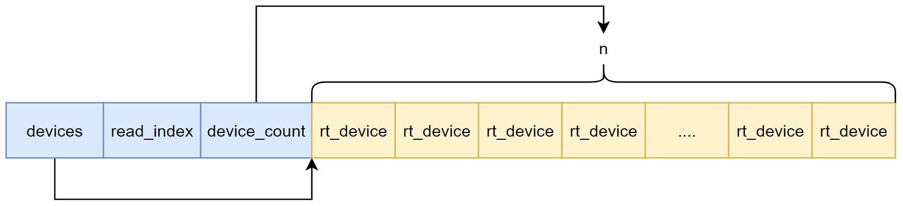

## sys_open

```c
int sys_open(const char *name, int flag, ...)
{
    lwp_get_from_user(kname, (void *)name, len + 1);
    //  open(kname, flag, 0); start
    //      int fd = fd_new(); start
    //          struct dfs_fdtable *fdt dfs_fdtable_get(); start
    struct dfs_fdtable *fdt = &(struct rt_lwp *)rt_thread_self()->lwp->fdt;
    //          struct dfs_fdtable *fdt dfs_fdtable_get(); end
    //          int fd fdt_fd_new(fdt); start
    //              int fd = fd_alloc(fdt, DFS_STDIO_OFFSET);
    int idx = fd_slot_alloc(fdt, startfd);
    struct dfs_fd *fd = (struct dfs_fd *)rt_calloc(1, sizeof(struct dfs_fd));
    fd->ref_count = 1;
    fd->magic = DFS_FD_MAGIC;
    fd->fnode = NULL;
    fdt->fds[idx] = fd;
    int fd = idx;
    //              int fd = fd_alloc(fdt, DFS_STDIO_OFFSET);
    //          int fd fdt_fd_new(fdt); end
    //      int fd = fd_new(); end
    //      struct dfs_fd *d = fd_get(fd); start
    struct dfs_fd *d = fdt_fd_get(fdt, fd) = fdt->fds[fd];;
    //      struct dfs_fd *d = fd_get(fd); end
    dfs_file_open(d, file, flags);
    //  open(kname, flag, 0); end
}
```

## dfs_file_open详解

```c
int dfs_file_open(struct dfs_fd *fd, const char *path, int flags)
{
    struct dfs_filesystem *fs;
    char *fullpath;
    int result;
    struct dfs_fnode *fnode = NULL;
    rt_list_t *hash_head;

    /* parameter check */
    if (fd == NULL)
        return -EINVAL;

    /* make sure we have an absolute path */
    fullpath = dfs_normalize_path(NULL, path);
    if (fullpath == NULL)
    {
        return -ENOMEM;
    }

    LOG_D("open file:%s", fullpath);

    dfs_fm_lock();
    /* fnode find */
    fnode = dfs_fnode_find(fullpath, &hash_head);
    if (fnode)
    {
        fnode->ref_count++;
        fd->pos   = 0;
        fd->fnode = fnode;
        dfs_fm_unlock();
        rt_free(fullpath); /* release path */
    }
    else
    {
        /* find filesystem */
        fs = dfs_filesystem_lookup(fullpath);
        if (fs == NULL)
        {
            dfs_fm_unlock();
            rt_free(fullpath); /* release path */
            return -ENOENT;
        }

        fnode = rt_calloc(1, sizeof(struct dfs_fnode));
        if (!fnode)
        {
            dfs_fm_unlock();
            rt_free(fullpath); /* release path */
            return -ENOMEM;
        }
        fnode->ref_count = 1;

        LOG_D("open in filesystem:%s", fs->ops->name);
        fnode->fs    = fs;             /* set file system */
        fnode->fops  = fs->ops->fops;  /* set file ops */

        /* initialize the fd item */
        fnode->type  = FT_REGULAR;
        fnode->flags = 0;

        if (!(fs->ops->flags & DFS_FS_FLAG_FULLPATH))
        {
            if (dfs_subdir(fs->path, fullpath) == NULL)
                fnode->path = rt_strdup("/");
            else
                fnode->path = rt_strdup(dfs_subdir(fs->path, fullpath));
            LOG_D("Actual file path: %s", fnode->path);
        }
        else
        {
            fnode->path = fullpath;
        }
        fnode->fullpath = fullpath;

        /* specific file system open routine */
        if (fnode->fops->open == NULL)
        {
            dfs_fm_unlock();
            /* clear fd */
            if (fnode->path != fnode->fullpath)
            {
                rt_free(fnode->fullpath);
            }
            rt_free(fnode->path);
            rt_free(fnode);

            return -ENOSYS;
        }

        fd->pos   = 0;
        fd->fnode = fnode;

        /* insert fnode to hash */
        rt_list_insert_after(hash_head, &fnode->list);
    }

    fd->flags = flags;

    if ((result = fnode->fops->open(fd)) < 0)
    {
        fnode->ref_count--;
        if (fnode->ref_count == 0)
        {
            /* remove from hash */
            rt_list_remove(&fnode->list);
            /* clear fd */
            if (fnode->path != fnode->fullpath)
            {
                rt_free(fnode->fullpath);
            }
            rt_free(fnode->path);
            fd->fnode = NULL;
            rt_free(fnode);
        }

        dfs_fm_unlock();
        LOG_D("%s open failed", fullpath);

        return result;
    }

    fd->flags |= DFS_F_OPEN;
    if (flags & O_DIRECTORY)
    {
        fd->fnode->type = FT_DIRECTORY;
        fd->flags |= DFS_F_DIRECTORY;
    }
    dfs_fm_unlock();

    LOG_D("open successful");
    return 0;
}
```

建设打开的设备名字是/dev/key0，关键代码解释如下：

024行：对于一个从没打开过的设备，dfs_fnode_find的调用返回结果肯定是NULL。所以会执行else分支。

036行：根据路径的名字来判断是什么文件系统，根据filesystem_table[DFS_FILESYSTEMS_MAX]里面保存的信息来查找(自己的调试信息)：

| index | device  | dev_id(rt_device_find(device)) | name  | path |
| ----- | ------- | ------------------------------ | ----- | ---- |
| 0     | virtual | 0                              | devfs | /dev |
| 1     | sd0     | 0xC0148E74                     | elm   | /    |
| 2     | -       | 0                              | null  | null |
| 3     | -       | 0                              | null  | null |

所以根据打开的设备名字/dev/key0，可以判断出来文件系统为devfs，并且将相关信息保存在struct dfs_filesystem *fs成员里面：

```c
struct dfs_file_ops
{
    int (*open)     (struct dfs_fd *fd);
    int (*close)    (struct dfs_fd *fd);
    int (*ioctl)    (struct dfs_fd *fd, int cmd, void *args);
    int (*read)     (struct dfs_fd *fd, void *buf, size_t count);
    int (*write)    (struct dfs_fd *fd, const void *buf, size_t count);
    int (*flush)    (struct dfs_fd *fd);
    int (*lseek)    (struct dfs_fd *fd, off_t offset);
    int (*getdents) (struct dfs_fd *fd, struct dirent *dirp, uint32_t count);

    int (*poll)     (struct dfs_fd *fd, struct rt_pollreq *req);
};

struct dfs_filesystem_ops
{
    char *name;
    uint32_t flags;      /* flags for file system operations */

    /* operations for file */
    const struct dfs_file_ops *fops;

    /* mount and unmount file system */
    int (*mount)    (struct dfs_filesystem *fs, unsigned long rwflag, const void *data);
    int (*unmount)  (struct dfs_filesystem *fs);

    /* make a file system */
    int (*mkfs)     (rt_device_t dev_id, const char *fs_name);
    int (*statfs)   (struct dfs_filesystem *fs, struct statfs *buf);

    int (*unlink)   (struct dfs_filesystem *fs, const char *pathname);
    int (*stat)     (struct dfs_filesystem *fs, const char *filename, struct stat *buf);
    int (*rename)   (struct dfs_filesystem *fs, const char *oldpath, const char *newpath);
};

struct dfs_filesystem
{
    rt_device_t dev_id;     /* Attached device */

    char *path;             /* File system mount point */
    const struct dfs_filesystem_ops *ops; /* Operations for file system type */

    void *data;             /* Specific file system data */
};
```

至于fs成员里面的成员变量可查看devfs虚拟文件系统的初始化部分代码：

```c
int dfs_init(void)
{
    ...
    {
        extern int devfs_init(void);

        /* if enable devfs, initialize and mount it as soon as possible */
        devfs_init();

        dfs_mount(NULL, "/dev", "devfs", 0, 0);
    }
    ...
}
```

其中devfs_init函数主要是为了注册一个devfs虚拟文件系统。详细代码如下：

```c
static const struct dfs_file_ops _device_fops =
{
    dfs_device_fs_open,
    dfs_device_fs_close,
    dfs_device_fs_ioctl,
    dfs_device_fs_read,
    dfs_device_fs_write,
    RT_NULL,                    /* flush */
    RT_NULL,                    /* lseek */
    dfs_device_fs_getdents,
    dfs_device_fs_poll,
};

static const struct dfs_filesystem_ops _device_fs =
{
    "devfs",
    DFS_FS_FLAG_DEFAULT,
    &_device_fops,

    dfs_device_fs_mount,
    RT_NULL,
    RT_NULL,
    RT_NULL,

    RT_NULL,
    dfs_device_fs_stat,
    RT_NULL,
};

int devfs_init(void)
{
    /* register rom file system */
    dfs_register(&_device_fs);

    return 0;
}
```

对于dfs_mount函数代码比较多，这里精简后的代码如下：

```c
int dfs_mount(const char   *device_name,
              const char   *path,
              const char   *filesystemtype,
              unsigned long rwflag,
              const void   *data)
{
    const struct dfs_filesystem_ops **ops;
    struct dfs_filesystem *iter;
    struct dfs_filesystem *fs = NULL;
    char *fullpath = NULL;
    rt_device_t dev_id;

    /* device_name = NULL */
    dev_id = NULL;

    /* ops = &_device_fs */
    for (ops = &filesystem_operation_table[0];
            ops < &filesystem_operation_table[DFS_FILESYSTEM_TYPES_MAX]; ops++)
        if ((*ops != NULL) && (strncmp((*ops)->name, filesystemtype, strlen((*ops)->name)) == 0))
            break;

    /* make full path for special file */
    fullpath = dfs_normalize_path(NULL, path);

    /* Check if the path exists or not, raw APIs call, fixme */
    if ((strcmp(fullpath, "/") != 0) && (strcmp(fullpath, "/dev") != 0))
    {
        struct dfs_fd fd;

        fd_init(&fd);
        if (dfs_file_open(&fd, fullpath, O_RDONLY | O_DIRECTORY) < 0)
        {
            rt_free(fullpath);
            rt_set_errno(-ENOTDIR);

            return -1;
        }
        dfs_file_close(&fd);
    }

    /* check whether the file system mounted or not  in the filesystem table
     * if it is unmounted yet, find out an empty entry */

    for (iter = &filesystem_table[0];
            iter < &filesystem_table[DFS_FILESYSTEMS_MAX]; iter++)
    {
        /* check if it is an empty filesystem table entry? if it is, save fs */
        if (iter->ops == NULL)
            (fs == NULL) ? (fs = iter) : 0;
        /* check if the PATH is mounted */
        else if (strcmp(iter->path, path) == 0)
        {
            rt_set_errno(-EINVAL);
            goto err1;
        }
    }

    /* register file system */
    fs->path   = fullpath;
    fs->ops    = *ops;
    fs->dev_id = dev_id;
    /* For UFS, record the real filesystem name */
    fs->data = (void *) filesystemtype;

    /* call mount of this filesystem */
    (*ops)->mount(fs, rwflag, data);
    return 0;
}
```

通过上面的代码我们大致描述一下dfs_filesystem_lookup获取到的fs成员信息：

```c
fs = &filesystem_table[0];
fs->dev_id = 0;
fs->path = "/dev";
fs->ops = &_device_fs;
fs->data = (void *)"devfs";
fs->ops->name = "devfs";
fs->ops->flags = DFS_FS_FLAG_DEFAULT;
fs->ops->fops = &_device_fops;
fs->ops->mount = dfs_device_fs_mount;
fs->ops->stat = dfs_device_fs_stat;
fs->ops->fops->open = dfs_device_fs_open;
fs->ops->fops->close = dfs_device_fs_close;
fs->ops->fops->ioctl = dfs_device_fs_ioctl;
fs->ops->fops->read = dfs_device_fs_read;
fs->ops->fops->write = dfs_device_fs_write;
fs->ops->fops->getdents = dfs_device_fs_getdents;
fs->ops->fops->poll = dfs_device_fs_poll;
```

044行：为struct dfs_fnode *fnode分配内存。

051~073行：主要是在初始化fnode的内容：

```c
fnode->ref_count = 1;
fnode->fs    = fs = &filesystem_table[0];;
fnode->fops  = fs->ops->fops = &_device_fops;
fnode->type  = FT_REGULAR;
fnode->flags = 0;
fnode->path = "/key0";
fnode->fullpath = "/dev/key0";
```

090~091行：初始化struct dfs_fd *fd的成员变量。

```c
struct dfs_fd
{
    uint16_t magic;              /* file descriptor magic number */
    uint32_t flags;              /* Descriptor flags */
    int ref_count;               /* Descriptor reference count */
    off_t    pos;                /* Current file position */
    struct dfs_fnode *fnode;     /* file node struct */
    void *data;                  /* Specific fd data */
};
```

主要初始化内容：

```c
fd->pos   = 0;
fd->fnode = fnode;
```

根据这部分代码可以发现，如果直接通过dfs_fnode_find查找fnode成功也主要是初始化上面的这两个值。

后面的代码就是设置fd->flags，然后执行fnode->fops->open(fd)函数了；如果成功执行就最后在给fd->flags添加一个已经打开的标志。

## fnode->fops成员详解

前面已经提到将fnode->fops设置为了&_device_fops，也正是这个变量让我们用户态的程序最终能调用驱动程序的代码。

```c
static const struct dfs_file_ops _device_fops =
{
    dfs_device_fs_open,
    dfs_device_fs_close,
    dfs_device_fs_ioctl,
    dfs_device_fs_read,
    dfs_device_fs_write,
    RT_NULL,                    /* flush */
    RT_NULL,                    /* lseek */
    dfs_device_fs_getdents,
    dfs_device_fs_poll,
};
```

### dfs_device_fs_open

```c
int dfs_device_fs_open(struct dfs_fd *file)
{
    rt_err_t result;
    rt_device_t device;
    rt_base_t level;

    RT_ASSERT(file->fnode->ref_count > 0);
    if (file->fnode->ref_count > 1)
    {
        file->pos = 0;
        return 0;
    }
    /* open root directory */
    if ((file->fnode->path[0] == '/') && (file->fnode->path[1] == '\0') &&
        (file->flags & O_DIRECTORY))
    {
        struct rt_object *object;
        struct rt_list_node *node;
        struct rt_object_information *information;
        struct device_dirent *root_dirent;
        rt_uint32_t count = 0;

        /* disable interrupt */
        level = rt_hw_interrupt_disable();

        /* traverse device object */
        information = rt_object_get_information(RT_Object_Class_Device);
        RT_ASSERT(information != RT_NULL);
        for (node = information->object_list.next; node != &(information->object_list); node = node->next)
        {
            count ++;
        }

        root_dirent = (struct device_dirent *)rt_malloc(sizeof(struct device_dirent) +
                      count * sizeof(rt_device_t));
        if (root_dirent != RT_NULL)
        {
            root_dirent->devices = (rt_device_t *)(root_dirent + 1);
            root_dirent->read_index = 0;
            root_dirent->device_count = count;
            count = 0;
            /* get all device node */
            for (node = information->object_list.next; node != &(information->object_list); node = node->next)
            {
                object = rt_list_entry(node, struct rt_object, list);
                root_dirent->devices[count] = (rt_device_t)object;
                count ++;
            }
        }
        rt_hw_interrupt_enable(level);

        /* set data */
        file->fnode->data = root_dirent;

        return RT_EOK;
    }

    device = rt_device_find(&file->fnode->path[1]);
    if (device == RT_NULL)
    {
        return -ENODEV;
    }

#ifdef RT_USING_POSIX
    if (device->fops)
    {
        /* use device fops */
        file->fnode->fops = device->fops;
        file->fnode->data = (void *)device;

        /* use fops */
        if (file->fnode->fops->open)
        {
            result = file->fnode->fops->open(file);
            if (result == RT_EOK || result == -RT_ENOSYS)
            {
                file->fnode->type = FT_DEVICE;
                return 0;
            }
        }
    }
    else
#endif
    {
        result = rt_device_open(device, RT_DEVICE_OFLAG_RDWR);
        if (result == RT_EOK || result == -RT_ENOSYS)
        {
            file->fnode->data = device;
            file->fnode->type = FT_DEVICE;
            return RT_EOK;
        }
    }

    file->fnode->data = RT_NULL;
    /* open device failed. */
    return -EIO;
}
```

13~56行的意思就是用户打开的文件为/dev的时候，需要将所有RT_Object_Class_Device的device信息保存在root_dirent变量里面。然后再将fd->fnode->data赋值为root_dirent。



这个主要是用于ls这样的命令，比如执行`ls /dev`命令的时候，会有如下的代码：

```c
void ls(const char *pathname)
{
    if (dfs_file_open(&fd, path, O_DIRECTORY) == 0)
    {
            ...
            memset(&dirent, 0, sizeof(struct dirent));
            length = dfs_file_getdents(&fd, &dirent, sizeof(struct dirent));
            ...
    }
}
```

这里dfs_file_open传入的参数path的值也就是/dev，所以目的就是在fd->fnode->data把所有的device数据保存下来，然后可以调用dfs_file_getdents函数去得到每一个device的信息，这样就可以实现ls /dev命令的打印，如：

```shell
msh />ls /dev
Directory /dev:
urandom             0
random              0
zero                0
null                0
ptmx                0
wdt2                0
wdt1                0
winusb              0
usbd                0
gt911               0
emmc1               0
emmc0               0
emmc                0
sd1                 0
sd0                 0
sd                  0
rtc                 0
pwm1                0
lcd                 0
i2c4                0
i2c3                0
e1                  0
console             0
uart0               0
pin                 0
```


