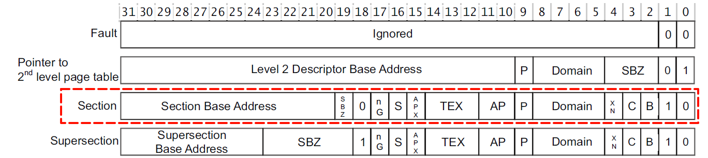
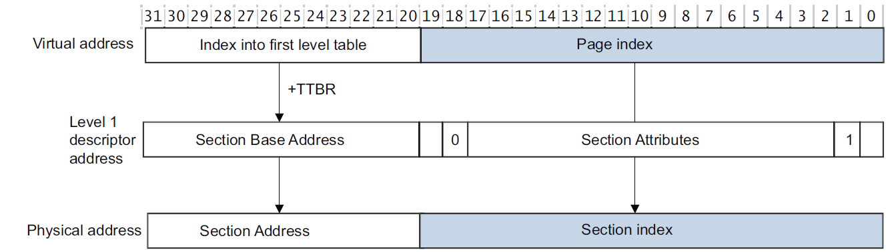
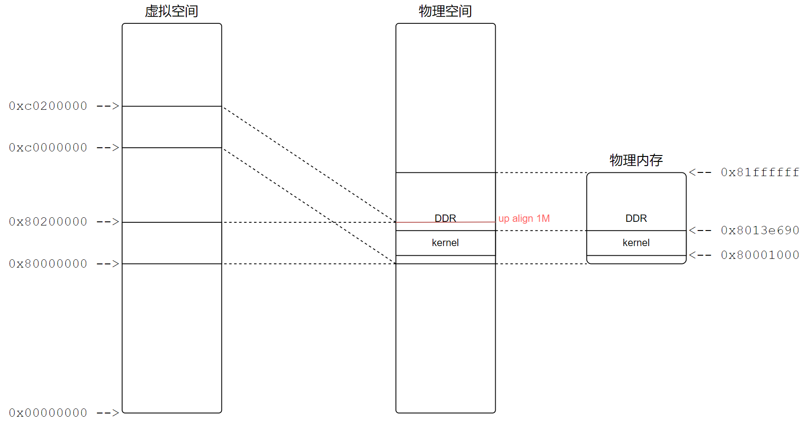
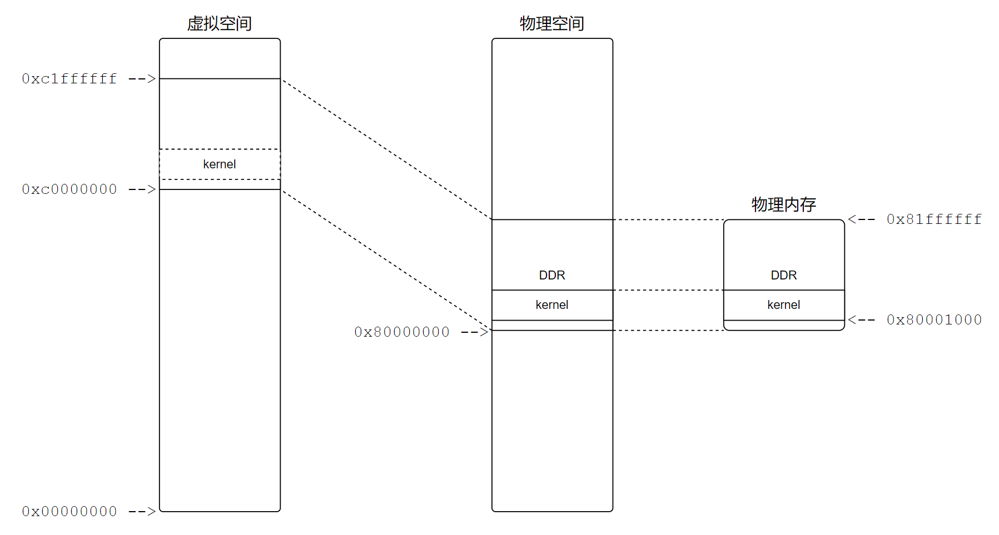
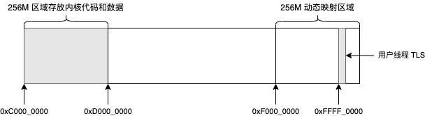

## 1 入口函数

要知道入口函数是什么，我们首先得知道程序的入口地址，以及入口地址上放了什么东西。这些东西我们可以从链接脚本中得到：

```
SECTIONS
{
    . = 0xc0001000;
    . = ALIGN(4096);
    .text :
    {
        KEEP(*(.text.entrypoint))       /* The entry point */
        *(.vectors)
        *(.text)                        /* remaining code */
        *(.text.*)                      /* remaining code */
        ...
    }
    ...
}
```

从该脚本的内容可以知道，程序的入口地址是0xc0001000，依次放的内容是.text.entrypoint、.vectors、.text、.text.*、...段。程序中并没有发现有.text.entrypoint段，但是.vectors段中有内容，内容如下：

```assembly
.section .vectors, "ax"
.code 32

.globl system_vectors
system_vectors:
#ifdef RT_USING_USERSPACE
    b _reset
#else
    ldr pc, _vector_reset
#endif
    ldr pc, _vector_undef
    ldr pc, _vector_swi
    ldr pc, _vector_pabt
    ldr pc, _vector_dabt
    ldr pc, _vector_resv
    ...
```

所以猜测应该是将.vectors段的内容放到了程序的入口地址上，也就是说b _reset这条指令应该在程序的入口地址0xc0000000上。具体是不是我们可以通过反汇编来验证一下，在工程目录执行scons --dump即可获取到反汇编后的代码rtt.asm，如下：

```assembly
.globl system_vectors
system_vectors:
#ifdef RT_USING_USERSPACE
    b _reset
c0001000:       ea00e08d        b       c003923c <_reset>
#else
    ldr pc, _vector_reset
#endif
    ldr pc, _vector_undef
c0001004:       e59ff018        ldr     pc, [pc, #24]   ; c0001024 <_vector_undef>
    ldr pc, _vector_swi
c0001008:       e59ff018        ldr     pc, [pc, #24]   ; c0001028 <_vector_swi>
    ldr pc, _vector_pabt
c000100c:       e59ff018        ldr     pc, [pc, #24]   ; c000102c <_vector_pabt>
    ldr pc, _vector_dabt
c0001010:       e59ff018        ldr     pc, [pc, #24]   ; c0001030 <_vector_dabt>
......
```

我们可以看到程序的入口地址确实在0xc0000000上，所以猜测是正确的。

## 2 程序启动

### 2.1 第一阶段_reset(汇编)

在程序的入口地址0xc0000000处执行的指令是b _reset，所以程序的启动是从_reset函数开始的，下面对_reset函数进行简化并调整部分顺序(不影响功能)，代码如下：

```assembly
.data
.align 14
init_mtbl:
    .space 16*1024

.text
/* reset entry */
.globl _reset
_reset:
    /* invalid tlb before enable mmu */
    mrc p15, 0, r0, c1, c0, 0
    bic r0, #1
    mcr p15, 0, r0, c1, c0, 0
    dsb
    isb
    mov r0, #0
    mcr p15, 0, r0, c8, c7, 0
    mcr p15, 0, r0, c7, c5, 0    /* iciallu */
    mcr p15, 0, r0, c7, c5, 6    /* bpiall */
    dsb
    isb

    ldr r5, =PV_OFFSET
    ldr r9, =KERNEL_VADDR_START

    mov r7, #0x100000
    sub r7, #1
    mvn r8, r7
    ldr r6, =__bss_end
    add r6, r7
    and r6, r8    /* r6 end vaddr align up to 1M */
    sub r6, r9    /* r6 is size */

    ldr sp, =svc_stack_n_limit
    add sp, r5    /* use paddr */

    ldr r0, =init_mtbl
    add r0, r5
    mov r1, r6
    mov r2, r5
    bl init_mm_setup

    ldr lr, =after_enable_mmu
    ldr r0, =init_mtbl
    add r0, r5
    b enable_mmu

after_enable_mmu:

    /* disable the data alignment check */
    mrc p15, 0, r1, c1, c0, 0
    bic r1, #(1<<1)
    mcr p15, 0, r1, c1, c0, 0

    /* setup stack */
    bl  stack_setup

    /* clear .bss */
    mov r0,#0                   /* get a zero                       */
    ldr r1,=__bss_start         /* bss start                        */
    ldr r2,=__bss_end           /* bss end                          */

bss_loop:
    cmp r1,r2                   /* check if data to clear           */
    strlo r0,[r1],#4            /* clear 4 bytes                    */
    blo bss_loop                /* loop until done                  */

    /* initialize the mmu table and enable mmu */
    ldr r0, =platform_mem_desc
    ldr r1, =platform_mem_desc_size
    ldr r1, [r1]
    bl rt_hw_init_mmu_table

    ldr r0, =MMUTable     /* vaddr    */
    add r0, r5            /* to paddr */
    bl  switch_mmu

    /* call C++ constructors of global objects */
    ldr     r0, =__ctors_start__
    ldr     r1, =__ctors_end__

ctor_loop:
    cmp     r0, r1
    beq     ctor_end
    ldr     r2, [r0], #4
    stmfd   sp!, {r0-r1}
    mov     lr, pc
    bx      r2
    ldmfd   sp!, {r0-r1}
    b       ctor_loop
ctor_end:

    /* start RT-Thread Kernel */
    ldr     pc, _rtthread_startup
_rtthread_startup:
    .word rtthread_startup
```

这段代码里面还是有几个重要知识点的，这里将代码拆出来分别讲解。

对于ART-PI这个板子，使用的是IMX6ULL芯片，对于DDR内存的起始地址为0x80000000，而且我们是将程序烧写在0x80001000这个位置的，那么就会存在一个问题，程序的链接地址为0xC0001000，但是程序又是烧写在0x80001000这个位置，那么程序的运行不会出错吗？答案是肯定的，会出错；但是如果能保证程序开头的代码仅仅只是一些指令，不涉及到内存访问，也不存在绝对地址访问的话，也还是可以运行的，所以对于RT-Smart来说，前面运行的代码基本上都是与位置无关的；这里还隐藏了一个很严重的问题，就是我要保证MMU能成功初始化，那我肯定要初始化页表啊，而页表又是保存在内存上面的，这里我还必须要访问内存，那怎么办呢？其实解决方法很简单，如前面所说，我们知道内核代码的烧录地址和链接地址，那我们可以得出两个地址的offset(paddr-vaddr)值，那么，我们访问某个变量的时候，如果能将变量的链接地址加上一个offset，是不是就能正确的访问到变量真实存在的物理地址，然后在进行访问，就可以解决这个问题了。

**在启用mmu之前失能的TLB**

```assembly
	mrc p15, 0, r0, c1, c0, 0
    bic r0, #1
    mcr p15, 0, r0, c1, c0, 0
    dsb
    isb
    mov r0, #0
    mcr p15, 0, r0, c8, c7, 0
    mcr p15, 0, r0, c7, c5, 0    /* iciallu */
    mcr p15, 0, r0, c7, c5, 6    /* bpiall */
    dsb
    isb
```

**保存虚拟地址的起始值以及物理地址和虚拟地址的偏移值**

```assembly
    ldr r5, =PV_OFFSET
    ldr r9, =KERNEL_VADDR_START
```

**计算程序的大小**

```assembly
	mov r7, #0x100000
    sub r7, #1
    mvn r8, r7
    ldr r6, =__bss_end
    add r6, r7
    and r6, r8    /* r6 end vaddr align up to 1M */
    sub r6, r9    /* r6 is size */
```

首先r6等于_bss_end也就是程序的最后地址，然后在对r6向上1M取整，r9为虚拟地址的起始地址0xC0000000，最终的出来的值r6=r6-r9，r6也就是虚拟地址到程序末尾所占的空间大小，对于这一段内存是需要建立页表映射的。

**建立页表内存映射**

```c
    ldr sp, =svc_stack_n_limit
    add sp, r5    /* use paddr */

    ldr r0, =init_mtbl
    add r0, r5
    mov r1, r6
    mov r2, r5
    bl init_mm_setup
```

因为下面会调用init_mm_setup函数(c函数)，所以必须设置栈，这里的栈是在内存上面，而svc_stack_n_limit在链接的时候地址肯定是大于0xC0001000的，所以需要通过访问0xC0001000+offset来访问到真正的内存。

在内核最开始初始化MMU的时候，我们只需要保证cpu发出的地址能准确访问到内存即可，不需要什么内存管理，所以我们可以直接使用段映射来完成这个功能。



下图为段映射的示例图：



要映射4GB的空间，段映射是以2^20=1M空间进行映射的，并且有2^12=4096个。所以我们需要一个大小为4096*4(32bit)字节容量来保存页表。代码如下：

```assembly
.data
.align 14
init_mtbl:
    .space 16*1024
```

然后我们看一下init_mm_setup函数是如何进行映射的。

```c
void init_mm_setup(unsigned int *mtbl, unsigned int size, unsigned int pv_off) {
    unsigned int va;

    for (va = 0; va < 0x1000; va++) {
        unsigned int vaddr = (va << 20);
        if (vaddr >= KERNEL_VADDR_START && vaddr - KERNEL_VADDR_START < size) {
            mtbl[va] = ((va << 20) + pv_off) | NORMAL_MEM;
        } else if (vaddr >= (KERNEL_VADDR_START + pv_off) && vaddr - (KERNEL_VADDR_START + pv_off) < size) {
            mtbl[va] = (va << 20) | NORMAL_MEM;
        } else {
            mtbl[va] = 0;
        }
    }
}
```

这里将映射后的示意图展示一下，方便理解：



解释一下这里为什么要进行两段映射，首先0xC0000000~0xC0012b14这段内存能保证在初始化MMU后，cpu发出的地址就能准确的访问到实际的物理内存了。0x80000000~0x80012b14这段内存映射的主要目的后面再讲。

**使能mmu**

建立好内存映射就可以使能MMU了。

```assembly
    ldr lr, =after_enable_mmu
    ldr r0, =init_mtbl
    add r0, r5
    b enable_mmu

after_enable_mmu:
```

首先将lr寄存器的值保存为after_enable_mmu标号地址，这里的地址应该是链接地址，然后把init_mtbl页表(已经通过+offset转化为真实的物理地址)作为参数执行enable_mmu函数。

```assembly
.align 2
.global enable_mmu
enable_mmu:
    orr r0, #0x18
    mcr p15, 0, r0, c2, c0, 0    /* ttbr0 */

    mov r0, #(1 << 5)            /* PD1=1 */
    mcr p15, 0, r0, c2, c0, 2    /* ttbcr */

    mov r0, #1
    mcr p15, 0, r0, c3, c0, 0    /* dacr */

    /* invalid tlb before enable mmu */
    mov r0, #0
    mcr p15, 0, r0, c8, c7, 0
    mcr p15, 0, r0, c7, c5, 0    /* iciallu */
    mcr p15, 0, r0, c7, c5, 6    /* bpiall */

    mrc p15, 0, r0, c1, c0, 0
    orr r0, #((1 << 12) | (1 << 11))    /* instruction cache, branch prediction */
    orr r0, #((1 << 2) | (1 << 0))      /* data cache, mmu enable */
    mcr p15, 0, r0, c1, c0, 0
    dsb
    isb
    mov pc, lr
```

里面就是初始化MMU的代码，详细内容这里就不做分析了，最后通过mv pc, lr就可以实现跳转到after_enable_mmu函数了，并且此时已经是使用的链接地址了。后面就进入MMU管理的世界了。

**设置栈清除BSS段**

```c
    /* setup stack */
    bl  stack_setup

    /* clear .bss */
    mov r0,#0                   /* get a zero                       */
    ldr r1,=__bss_start         /* bss start                        */
    ldr r2,=__bss_end           /* bss end                          */

bss_loop:
    cmp r1,r2                   /* check if data to clear           */
    strlo r0,[r1],#4            /* clear 4 bytes                    */
    blo bss_loop                /* loop until done                  */
```

**重新初始化页表并使能MMU**

```assembly
    /* initialize the mmu table and enable mmu */
    ldr r0, =platform_mem_desc
    ldr r1, =platform_mem_desc_size
    ldr r1, [r1]
    bl rt_hw_init_mmu_table

    ldr r0, =MMUTable     /* vaddr    */
    add r0, r5            /* to paddr */
    bl  switch_mmu
```

先看一下是如何重新初始化页表的：

```c
struct mem_desc platform_mem_desc[] = {  /* 100ask_imx6ull ddr 512M */
    {KERNEL_VADDR_START, KERNEL_VADDR_START + 0x1FFFFFFF, KERNEL_VADDR_START + PV_OFFSET, NORMAL_MEM}
};

void rt_hw_init_mmu_table(struct mem_desc *mdesc, rt_uint32_t size)
{
    /* set page table */
    for(; size > 0; size--)
    {
        rt_hw_mmu_setmtt(mdesc->vaddr_start, mdesc->vaddr_end,
                mdesc->paddr_start, mdesc->attr);
        mdesc++;
    }
    rt_hw_cpu_dcache_clean((void*)MMUTable, sizeof MMUTable);
}

volatile unsigned long MMUTable[4*1024] __attribute__((aligned(16*1024)));
void rt_hw_mmu_setmtt(rt_uint32_t vaddrStart,
                      rt_uint32_t vaddrEnd,
                      rt_uint32_t paddrStart,
                      rt_uint32_t attr)
{
    volatile rt_uint32_t *pTT;
    volatile int i, nSec;
    pTT  = (rt_uint32_t *)MMUTable + (vaddrStart >> 20);
    nSec = (vaddrEnd >> 20) - (vaddrStart >> 20);
    for(i = 0; i <= nSec; i++)
    {
        *pTT = attr | (((paddrStart >> 20) + i) << 20);
        pTT++;
    }
}
```

主要是建立物理内存在虚拟地址之间的映射关系；示意图如下：



这里的页表为MMUTable，后面调用switch_mmu来切换页表。

```assembly
    ldr r0, =MMUTable     /* vaddr    */
    add r0, r5            /* to paddr */
    bl  switch_mmu
```

根据前面的分析，使用init_mtbl页表来初始化MMU，其中init_mtbl里面对虚拟内存进行了双映射，虚拟地址映射到物理地址，是比较容易理解的，因为我程序本身就运行在虚拟地址上，但是对于原地址映射，为什么？其实也就是保证这个switch_mmu函数的准确运行。

在当前运行环境下，我们已经使能了MMU，那么CPU发出的地址就会经过MMU转换为物理地址，对于上面的代码，我们得到了MMUTable在内核空间的虚拟地址，并且我们还要使用这个MMUTable对应的物理地址去重新初始化MMU(switch_mmu函数)，这里执行的add r0, r5实际就是将MMUTable的虚拟地址+offset来得到物理地址。如果我们不对init_mtbl页表进行原地址映射，会出现什么问题呢？CPU发出的地址为实际的物理地址(虚拟地址+offset)，而这个地址在init_mtbl页表中的页表项保存的段基地址为0(未映射)，那我访问的这个地址岂不是直接变成了0(段基地址)+段内偏移。然后用这个地址初始化MMU那不存在大问题了！所以需要第二段的原地址映射存在。

举个例子，在没有第二段原地址映射的情况下，MMUTable假设分配的地址是0xC0001234，我们实际需要配置在MMU的页表基地址是0x80001234，但是init_mtbl页表里面第0x800项里面保存的段基地址为0x00000000，那0xC0001234地址经过MMU后变成了0x00001234，如果把这个地址配置到MMU，那就完蛋了。但是如果存在原地址映射，那么init_mtbl页表里面第0x800项里面保存的段基地址为0x80000000，那么0xC0001234地址经过MMU后变成了0x80001234，把这个地址配置到MMU，就不会出现任何问题了。

为什么要搞的这么繁琐？先要用init_mtbl使能MMU，然后又要用MMUTable切换MMU，直接一步到位不好吗？......，如果说我一开始就知道DDR的地址起始和大小的话，我觉得应该可以，但是我们是不知道的，我们需要从platform_mem_desc变量里面去获取，既然要获取它里面的值，总得访问它吧，老用虚拟地址加offset的方式访问总归是不合理的，我们可以先用init_mtbl这个临时页表使能一下MMU，负责去把MMUTable这个真正要用的页表初始化好，然后切换到MMUTable这个页表，这样虽然初始化了两次MMU，但是至少效率提高了。而且代码容错率也更低了。

后面那段更c++相关的不做分析了。然后就跳转到rtthread的c入口函数rtthread_startup了。

### 2.2 第二阶段rtthread_startup(c语言)

这个函数起始跟rtthread标准版的流程差不多，功能也差不多，可以查看官方文档学习：[内核基础 (rt-thread.org)](https://www.rt-thread.org/document/site/#/rt-thread-version/rt-thread-standard/programming-manual/basic/basic?id=rt-thread-启动流程)

不一样的应该是rt_hw_board_init这个函数，所以我们着重分析一下这个函数即可。

```c
void rt_hw_board_init(void)
{
    rt_hw_mmu_map_init(&mmu_info, (void*)0xf0000000, 0x10000000, MMUTable, PV_OFFSET);

    rt_page_init(init_page_region);
    rt_hw_mmu_ioremap_init(&mmu_info, (void*)0xf0000000, 0x10000000);

    arch_kuser_init(&mmu_info, (void*)0xffff0000);

    /* initialize hardware interrupt */
    rt_hw_interrupt_init();

    /* initialize system heap */
    rt_system_heap_init(HEAP_BEGIN, HEAP_END);

    SystemAddressMapping();
    SystemClockInit();

    rt_components_board_init();
    rt_console_set_device(RT_CONSOLE_DEVICE_NAME);

    rt_thread_idle_sethook(idle_wfi);
    rt_assert_set_hook(assert_handler);
}
```

重要的函数有：

rt_hw_mmu_map_init()函数主要是为了初始化动态映射区，内核地址空间的映射一经建立便不再改变，且对所有的进程保持一致，即在所有进程的地址空间中，相同的内核线性地址映射到相同的物理地址。[smart进程概述 (rt-thread.org) - 内核地址空间映射](https://www.rt-thread.org/document/site/#/rt-thread-version/rt-thread-smart/introduction/rt-smart-lwp/rt-smart-lwp?id=内核地址空间映射)

内核空间的可动态映射区域管理的地址范围为 0xF000_0000 - 0xFFFF_FFFF, 主要用来映射设备 IO 寄存器和用户线程的 TLS 数据。此外，由于这些地址可由用户态进程直接访问，它还被用来映射可由用户态访问的平台相关系统信息和特定于进程的数据。

| mmu_info | value      | 描述                            |
| -------- | ---------- | ------------------------------- |
|  vtable  | MMUTable   |                                 |
|  vstart  | 0xf00      | 0xf0000000 >> 20                |
|  vend    | 0xfff      | (0xf0000000+0x10000000-1) >> 20 |
|  pv_off  | 0xc0000000 | PV_OFFSET                       |

rt_page_init()函数主要是为了初始化rtsmart的page内存管理[smart进程概述 (rt-thread.org) - 内存管理](https://www.rt-thread.org/document/site/#/rt-thread-version/rt-thread-smart/introduction/rt-smart-lwp/rt-smart-lwp?id=内存管理)。

rt_hw_mmu_ioremap_init()

arch_kuser_init()主要是在内核地址空间调用rt_hw_mmu_map_auto函数来建立地址0xffff0000的映射，并且将__kuser_helper_start标号和__kuser_helper_end标号之间的代码段映射到地址0xffff0000。

```assembly
.align  5
.globl  __kuser_helper_start
__kuser_helper_start:
__kuser_cmpxchg64:              @ 0xffff0f60
    stmfd   sp!, {r4, r5, r6, lr}
    ldmia   r0, {r4, r5}            @ load old val
    ldmia   r1, {r6, lr}            @ load new val
1:  ldmia   r2, {r0, r1}            @ load current val
    eors    r3, r0, r4          @ compare with oldval (1)
    eorseq  r3, r1, r5          @ compare with oldval (2)
2:  stmiaeq r2, {r6, lr}            @ store newval if eq
    rsbs    r0, r3, #0          @ set return val and C flag
    ldmfd   sp!, {r4, r5, r6, pc}

    kuser_pad __kuser_cmpxchg64, 64

__kuser_memory_barrier:             @ 0xffff0fa0
    dmb
    mov pc, lr

    kuser_pad __kuser_memory_barrier, 32

__kuser_cmpxchg:                @ 0xffff0fc0
1:  ldr r3, [r2]            @ load current val
    subs    r3, r3, r0          @ compare with oldval
2:  streq   r1, [r2]            @ store newval if eq
    rsbs    r0, r3, #0          @ set return val and C flag
    mov pc, lr

kuser_pad __kuser_cmpxchg, 32

__kuser_get_tls:                @ 0xffff0fe0
    mrc p15, 0, r0, c13, c0, 3  @ 0xffff0fe8 hardware TLS code
    mov pc, lr
    ldr r0, [pc, #(16 - 8)] @ read TLS, set in kuser_get_tls_init

    kuser_pad __kuser_get_tls, 16

    .rep    3
    .word   0           @ 0xffff0ff0 software TLS value, then
    .endr               @ pad up to __kuser_helper_version

__kuser_helper_version:             @ 0xffff0ffc
    .word   ((__kuser_helper_end - __kuser_helper_start) >> 5)

    .globl  __kuser_helper_end
__kuser_helper_end:
```

__kuser_helper_start标号和__kuser_helper_end标号之间定义了一些内核用户空间帮助器函数，这些函数在内核与用户空间之间交换数据时很有用。这里，我们看到一些用于原子操作、内存屏障和获取线程本地存储（TLS）的函数。

总之，rt_hw_mmu_map_init函数和arch_kuser_init函数就是在建立下图所示的映射关系：



大概完成的内容就是这么多，相比于标准版，也就是多了这个内存映射的建立过程。毕竟使用了MMU。

