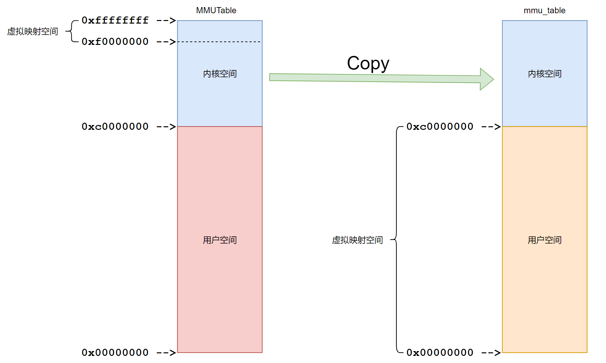
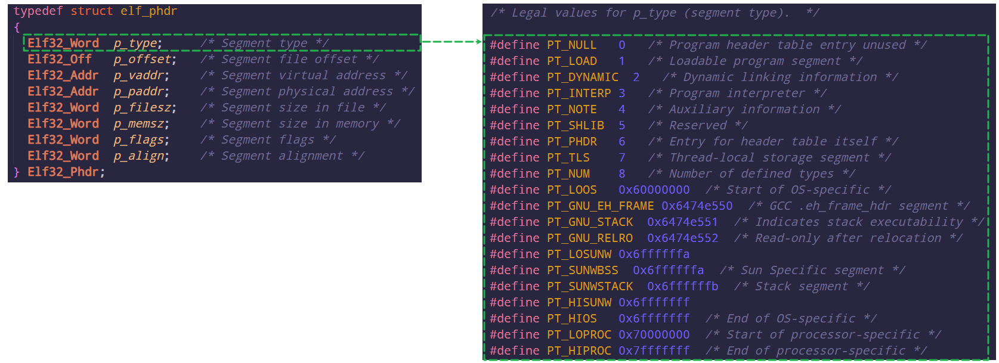

# RT-Smart应用程序(.elf)文件加载

[RT-Thread-RT-Smart ELF 应用程序加载运行过程分析RT-Thread问答社区 - RT-Thread](https://club.rt-thread.org/ask/article/8fd18929073be592.html)

以下面hello.elf为例：

```shell
msh /root_demo/bin>hello.elf
```

## 1 msh线程处理

首先RT-Thread的MSH首先会想办法得到"hello.elf"字符串，然后执行msh_exec函数，传入参数即跟得到的"hello.elf"字符串相关：

```c
void finsh_thread_entry(void *parameter)
{
    ...
    while(1)
    {
        ... // 获取
        msh_exec()
    }
}
```

### 1.1 msh_exec

```c
int msh_exec(char *cmd, rt_size_t length)
{
    ...
    
    /* strim the beginning of command */
    // 去除命令行首的空格或者制表符
    while (*cmd  == ' ' || *cmd == '\t')
    {
        cmd++;
        length--;
    }

#ifdef RT_USING_LWP
    /* exec from msh_exec , debug = 0*/
    /* _msh_exec_lwp return is pid , <= 0 means failed */
    if (_msh_exec_lwp(0, cmd, length) > 0)
    {
        return 0;
    }
#endif
    ...
}
```

主要处理进程的函数是_msh_exec_lwp函数。

### 1.2 _msh_exec_lwp

```c
int _msh_exec_lwp(int debug, char *cmd, rt_size_t length)
{
    int argc;
    int cmd0_size = 0;
    char *argv[FINSH_ARG_MAX];
    char *pg_name;
    int ret;

    // 获取命令行首的命令名 hello.elf
    while ((cmd[cmd0_size] != ' ' && cmd[cmd0_size] != '\t') && cmd0_size < length)
        cmd0_size ++;
    if (cmd0_size == 0)
        return -1;

    // 分割所有参数，这里没有参数argc = 1， argv[0] = "hello.elf"
    rt_memset(argv, 0x00, sizeof(argv));
    argc = msh_split(cmd, length, argv);
    if (argc == 0)
        return -1;

    // 在工作目录下查找文件是否存在，可以包含路径(hello.elf  /bin/hello.elf)
    pg_name = _msh_exec_search_path("", argv[0]);
    if (pg_name)
    {
        goto found_program;
    }

    // 确保程序名里面没有路径
    if (strstr(argv[0], "/"))
    {
        return -1;
    }

    // 在bin目录下查找文件是否存在
    pg_name = _msh_exec_search_path("/bin", argv[0]);
    if (pg_name)
    {
        goto found_program;
    }

    // 在环境变量的PATH路径下查找是否存在
    pg_name = _msh_exec_search_env(argv[0]);
    if (pg_name)
    {
        goto found_program;
    }

    /* not found in anywhere */
    return -1;

    /* found program */
found_program:
    ret = exec(pg_name, debug, argc, argv);
    rt_free(pg_name);

    return ret;
}
```

主要流程如下：

- 解析出可执行文件和相关参数。
- 在当前路径下查找是否有可执行文件(可包含路径)。
  - 能找到：
    - 直接执行exec函数。
  - 不能找到：
    - 在"/bin"目录下查找可执行文件(不能包含路径"/")。
    - 在环境变量PATH里面查找可执行文件(不能包含路径"/")。
    - 直接执行exec函数。

总之，只要能找到对应的文件，都会执行exec函数。

### 1.3 exec

exec主要是调用lwp_execve函数：

```c
pid_t exec(char *filename, int debug, int argc, char **argv)
{
    return lwp_execve(filename, debug, argc, argv, __environ);
}
```

其中有几个参数介绍一下：

- filename：程序的名字。
- debug：运行在msh_exec 的时候，debug = 0。
- argc：参数个数。
- argv：参数内容。
- __environ：环境变量。

核心是执行lwp_execve函数：

## 2 lwp_execve

```c
pid_t lwp_execve(char *filename, int debug, int argc, char **argv, char **envp)
{
    int result;
    rt_base_t level;
    struct rt_lwp *lwp;
    char *thread_name;
    char *argv_last = argv[argc - 1];
    int bg = 0;
    struct process_aux *aux;
    int tid = 0;

    struct rt_lwp *lwp = lwp_new();
    int tid = lwp_tid_get();
    lwp_user_space_init(lwp);

    if (argv_last[0] == '&' && argv_last[1] == '\0')
    {
        argc--;
        bg = 1;
    }

    struct process_aux *aux = lwp_argscopy(lwp, argc, argv, envp);

    result = lwp_load(filename, lwp, RT_NULL, 0, aux);
    if (result == 1)
    {
        /* dynmaic */
        lwp_unmap_user(lwp, (void *)(USER_VADDR_TOP - ARCH_PAGE_SIZE));
        result = load_ldso(lwp, filename, argv, envp);
    }
    if (result == RT_EOK)
    {
        rt_thread_t thread = RT_NULL;
        rt_uint32_t priority = 25, tick = 200;

        lwp_copy_stdio_fdt(lwp);

        /* obtain the base name */
        thread_name = strrchr(filename, '/');
        thread_name = thread_name ? thread_name + 1 : filename;
        thread = rt_thread_create(thread_name, lwp_thread_entry, RT_NULL,
                LWP_TASK_STACK_SIZE, priority, tick);
        if (thread != RT_NULL)
        {
            struct rt_lwp *self_lwp;

            thread->tid = tid;
            lwp_tid_set_thread(tid, thread);
            LOG_D("lwp kernel => (0x%08x, 0x%08x)\n", (rt_uint32_t)thread->stack_addr,
                    (rt_uint32_t)thread->stack_addr + thread->stack_size);
            level = rt_hw_interrupt_disable();
            self_lwp = lwp_self();
            if (self_lwp)
            {
                //lwp->tgroup_leader = &thread; //add thread group leader for lwp
                lwp->__pgrp = tid;
                lwp->session = self_lwp->session;
                /* lwp add to children link */
                lwp->sibling = self_lwp->first_child;
                self_lwp->first_child = lwp;
                lwp->parent = self_lwp;
            }
            else
            {
                //lwp->tgroup_leader = &thread; //add thread group leader for lwp
                lwp->__pgrp = tid;
            }
            if (!bg)
            {
                if (lwp->session == -1)
                {
                    struct tty_struct *tty = RT_NULL;
                    tty = (struct tty_struct *)console_tty_get();
                    lwp->tty = tty;
                    lwp->tty->pgrp = lwp->__pgrp;
                    lwp->tty->session = lwp->session;
                    lwp->tty->foreground = lwp;
                    tcgetattr(1, &stdin_termios);
                    old_stdin_termios = stdin_termios;
                    stdin_termios.c_lflag |= ICANON | ECHO | ECHOCTL;
                    tcsetattr(1, 0, &stdin_termios);
                }
                else
                {
                    if (self_lwp != RT_NULL)
                    {
                        lwp->tty = self_lwp->tty;
                        lwp->tty->pgrp = lwp->__pgrp;
                        lwp->tty->session = lwp->session;
                        lwp->tty->foreground = lwp;
                    }
                    else
                    {
                        lwp->tty = RT_NULL;
                    }

                }
            }
            thread->lwp = lwp;

            rt_list_insert_after(&lwp->t_grp, &thread->sibling);

            if (debug && rt_dbg_ops)
            {
                lwp->debug = debug;
                rt_thread_control(thread, RT_THREAD_CTRL_BIND_CPU, (void*)0);
            }
            rt_hw_interrupt_enable(level);

            rt_thread_startup(thread);
            return lwp_to_pid(lwp);
        }
    }

    lwp_tid_put(tid);
    lwp_ref_dec(lwp);

    return -RT_ERROR;
}
```

### 2.1 lwp_execve(1)

```c
pid_t lwp_execve(char *filename, int debug, int argc, char **argv, char **envp)
{
    lwp = lwp_new();
}
```

对于一个进程的运行，首先需要分配一个进程描述结构体，lwp_new()函数就是为了完成这个任务。该函数主要完成的任务是：

- 分配一个struct rt_lwp结构体，用于描述一个进程。
- 初始化相关成员变量。
- 分配一个空闲的进程pid。
- pid与进程绑定。
  - lwp->pid = pid;
  - pid_to_lwp(pid) = lwp;

主要是第四点，进程里面记录pid是很好理解的，这里说一下pid的管理方式，看看pid号是如何记录进程的。这种方式在RT-Smart的lwp管理里面也是经常用到。

#### 2.1.1 pid的管理

利用了数据结构里面平衡二叉树(AVL)，具体二叉树的知识可以随便找个视频学一下，AVL树具有以下特性：

- 每个节点都存储一个关键字值。
- 对于任意节点，它的左子树和右子树都是AVL树。
- 对于任意节点，其左子树中的关键字值小于等于节点的关键字值，而其右子树中的关键字值大于等于节点的关键字值。
- 每个节点都有一个平衡因子（Balance Factor），它表示其左子树的高度减去右子树的高度。平衡因子可以是 -1、0 或 1。
- 对于AVL树中的每个节点，其平衡因子必须为 -1、0 或 1。如果一个节点的平衡因子不在这个范围内，那么它就不是AVL树，需要进行平衡操作以恢复平衡性。

使用AVL树的目的只是为了提高数据的访问效率。下面看一下tree node的数据结构：

##### struct lwp_avl_struct

```c
struct lwp_avl_struct
{
    struct lwp_avl_struct *avl_left;  // 指向左子树的指针
    struct lwp_avl_struct *avl_right; // 指向右子树的指针
    int avl_height;                   // 节点的高度
    avl_key_t avl_key;                // 节点的键值
    void *data;                       // 节点关联的数据，类型为void指针，可以指向任意类型的数据
};
```

#####  lwp_avl.h 的 api

rtthread为AVL树定义了以下操作：

```c
// 从AVL树中删除一个节点
void lwp_avl_remove(struct lwp_avl_struct *node_to_delete, struct lwp_avl_struct **ptree);

// 向AVL树中插入一个新节点
void lwp_avl_insert(struct lwp_avl_struct *new_node, struct lwp_avl_struct **ptree);

// 在AVL树中查找具有给定键值的节点
struct lwp_avl_struct *lwp_avl_find(avl_key_t key, struct lwp_avl_struct *ptree);

// 遍历AVL树，并对每个节点执行给定的函数
int lwp_avl_traversal(struct lwp_avl_struct *ptree, int (*fun)(struct lwp_avl_struct *, void *), void *arg);

// 查找AVL树中的第一个节点（最小键值节点）
struct lwp_avl_struct *lwp_map_find_first(struct lwp_avl_struct *ptree);
```

### 2.2 lwp_execve(2)

```c
pid_t lwp_execve(char *filename, int debug, int argc, char **argv, char **envp)
{
    if ((tid = lwp_tid_get()) == 0)
    {
        lwp_ref_dec(lwp);
        return -ENOMEM;
    }
}
```

lwp_tid_get获取线程id。

后面肯定会跟进程进行对应的绑定。

### 2.3 lwp_execve(3)

```c
pid_t lwp_execve(char *filename, int debug, int argc, char **argv, char **envp)
{
    if (lwp_user_space_init(lwp) != 0)
    {
        lwp_tid_put(tid);
        lwp_ref_dec(lwp);
        return -ENOMEM;
    }
}
```

lwp_user_space_init主要为了初始化用户进程的mmu_info，记录页表和可映射区间等信息。



### 2.4 lwp_execve(4)

```c
pid_t lwp_execve(char *filename, int debug, int argc, char **argv, char **envp)
{
    if (argv_last[0] == '&' && argv_last[1] == '\0')
    {
        argc--;
        bg = 1;
    }
}
```

根据输入命令的最后一个参数是不是$来判断是否需要后台运行。如果需要后台运行，对应参数需要减少一个，并且将后台运行标志位置1。

### 2.5 lwp_execve(5)

保存参数和环境变量等信息到hello.elf进程的用户空间lwp->args=args。

```c
pid_t lwp_execve(char *filename, int debug, int argc, char **argv, char **envp)
{
    if ((aux = lwp_argscopy(lwp, argc, argv, envp)) == RT_NULL)
    {
        lwp_tid_put(tid);
        lwp_ref_dec(lwp);
        return -ENOMEM;
    }
}
```


### 2.6 lwp_execve(6)

```c
pid_t lwp_execve(char *filename, int debug, int argc, char **argv, char **envp)
{
    result = lwp_load(filename, lwp, RT_NULL, 0, aux);
    if (result == 1)    // 表示是动态的elf文件
    {
        /* dynmaic */
        lwp_unmap_user(lwp, (void *)(USER_VADDR_TOP - ARCH_PAGE_SIZE));
        result = load_ldso(lwp, filename, argv, envp);
    }
    if (result == RT_EOK)
    {
        ......
    }
}
```

lwp_load函数的实现如下：

```c
RT_WEAK int lwp_load(const char *filename, struct rt_lwp *lwp, uint8_t *load_addr, size_t addr_size, struct process_aux *aux)
{
    rt_strncpy(lwp->cmd, filename, RT_NAME_MAX);

    // if (load_addr != RT_NULL)
    // {
    //     lwp->lwp_type = LWP_TYPE_FIX_ADDR;
    //     ptr = load_addr;
    // }
    // else
    {
        lwp->lwp_type = LWP_TYPE_DYN_ADDR;
        ptr = RT_NULL;
    }
    
    // open hello.elf
    fd = open(filename, O_BINARY | O_RDONLY, 0);
    len = lseek(fd, 0, SEEK_END);

    ret = load_elf(fd, len, lwp, ptr, aux); // ret 的返回值须为0或者1
}
```

重要的是load_elf，elf文件相关内容大致如下：


#### 2.6.1 load_elf(1)

```c
static int load_elf(int fd, int len, struct rt_lwp *lwp, uint8_t *load_addr, struct process_aux *aux)
{
    check_read(read_len, sizeof magic);
    if (memcmp(elf_magic, &magic, 4) != 0)
    {
        return -RT_ERROR;
    }

    check_read(read_len, sizeof eheader);
    if (eheader.e_ident[4] != 1)
    { /* not 32bit */
        return -RT_ERROR;
    }
    if (eheader.e_ident[6] != 1)
    { /* ver not 1 */
        return -RT_ERROR;
    }
    if ((eheader.e_type != ET_DYN) && (eheader.e_type != ET_EXEC))
    {
        /* not pie or exec elf */
        return -RT_ERROR;
    }
    
    {
        off = eheader.e_phoff;
        for (i = 0; i < eheader.e_phnum; i++, off += sizeof pheader)
        {
            check_off(off, len);
            lseek(fd, off, SEEK_SET);
            read_len = load_fread(&pheader, 1, sizeof pheader, fd);
            check_read(read_len, sizeof pheader);

            if (pheader.p_type == PT_DYNAMIC)
            {
                /* load ld.so */
                return 1; /* 1 means dynamic */
            }
        }
    }

    if (eheader.e_entry != 0)
    {
        if ((eheader.e_entry != USER_LOAD_VADDR)
                && (eheader.e_entry != LDSO_LOAD_VADDR))
        {
            /* the entry is invalidate */
            return -RT_ERROR;
        }
    }
}
```

前面会做一系列检查，如果检查不通过，则返回-RT_ERROR。或者返回1(表示动态文件)




#### 2.6.2 load_elf(2)

```c
static int load_elf(int fd, int len, struct rt_lwp *lwp, uint8_t *load_addr, struct process_aux *aux)
{
    { /* load aux */
        off = eheader.e_phoff;
        process_header_size = eheader.e_phnum * sizeof pheader;

        va = (uint8_t *)lwp_map_user(lwp, (void *)(USER_VADDR_TOP - ARCH_PAGE_SIZE * 2), process_header_size, 0); // 0xC0000000UL - 4k * 2
        pa = rt_hw_mmu_v2p(m_info, va);
        process_header = (uint8_t *)pa - PV_OFFSET;

        lseek(fd, off, SEEK_SET);
        read_len = load_fread(process_header, 1, process_header_size, fd);

        aux->item[1].key = AT_PAGESZ;
        aux->item[1].value = ARCH_PAGE_SIZE;
        aux->item[2].key = AT_RANDOM;
        aux->item[2].value = (size_t)random;
        aux->item[3].key = AT_PHDR;
        aux->item[3].value = (size_t)va;
        aux->item[4].key = AT_PHNUM;
        aux->item[4].value = eheader.e_phnum;
        aux->item[5].key = AT_PHENT;
        aux->item[5].value = sizeof pheader;
    }
}
```


#### 2.6.3 load_elf(3)

```c
static int load_elf(int fd, int len, struct rt_lwp *lwp, uint8_t *load_addr, struct process_aux *aux)
{
    // if (load_addr)
    // {
    //     load_off = (size_t)load_addr;
    // }
    // else
    {
        off = eheader.e_shoff;
        for (i = 0; i < eheader.e_shnum; i++, off += sizeof sheader)
        {
            lseek(fd, off, SEEK_SET);
            read_len = load_fread(&sheader, 1, sizeof sheader, fd);

            // 只处理包含标志SHF_ALLOC的section
            if ((sheader.sh_flags & SHF_ALLOC) == 0)
            {
                continue;
            }

            switch (sheader.sh_type)
            {
            case SHT_PROGBITS:
                if ((sheader.sh_flags & SHF_WRITE) == 0)
                {
                    expand_map_range(&user_area[0], (void *)sheader.sh_addr, sheader.sh_size);
                }
                else
                {
                    expand_map_range(&user_area[1], (void *)sheader.sh_addr, sheader.sh_size);
                }
                break;
            case SHT_NOBITS:
                expand_map_range(&user_area[1], (void *)sheader.sh_addr, sheader.sh_size);
                break;
            default:
                expand_map_range(&user_area[1], (void *)sheader.sh_addr, sheader.sh_size);
                break;
            }
        }

        for (i = 0; i < 2; i++)
        {
            if (user_area[i].size != 0)
            {
                va = lwp_map_user(lwp, user_area[i].start, user_area[i].size, (int)(i == 0));
            }
        }
        lwp->text_size = user_area[0].size;
    }
    lwp->text_entry = (void *)(eheader.e_entry + load_off);
}
```


#### 2.6.4 load_elf(4)

```c
static int load_elf(int fd, int len, struct rt_lwp *lwp, uint8_t *load_addr, struct process_aux *aux)
{
    off = eheader.e_phoff;
    for (i = 0; i < eheader.e_phnum; i++, off += sizeof pheader)
    {
        lseek(fd, off, SEEK_SET);
        read_len = load_fread(&pheader, 1, sizeof pheader, fd);
        if (pheader.p_type == PT_LOAD)
        {
            lseek(fd, pheader.p_offset, SEEK_SET);
            {
                uint32_t size = pheader.p_filesz;
                size_t tmp_len = 0;

                va = (void *)(pheader.p_vaddr + load_addr);
                read_len = 0;
                while (size)
                {
                    pa = rt_hw_mmu_v2p(m_info, va);
                    va_self = (void *)((char *)pa - PV_OFFSET);
                    LOG_D("va_self = %p pa = %p", va_self, pa);
                    tmp_len = (size < ARCH_PAGE_SIZE) ? size : ARCH_PAGE_SIZE;
                    tmp_len = load_fread(va_self, 1, tmp_len, fd);
                    rt_hw_cpu_dcache_ops(RT_HW_CACHE_FLUSH, va_self, tmp_len);
                    read_len += tmp_len;
                    size -= tmp_len;
                    va = (void *)((char *)va + ARCH_PAGE_SIZE);
                }
            }
            if (pheader.p_filesz < pheader.p_memsz)
            {
                // 从elf文件看出来.text .ARM.exidx data大小是p_filesz->0x12158
                // .text .ARM.exidx data bss的大小是p_memsz->0x12b14
                uint32_t size = pheader.p_memsz - pheader.p_filesz;

                off = pheader.p_filesz & ARCH_PAGE_MASK;
                va = (void *)((pheader.p_vaddr + pheader.p_filesz + load_off) & ~ARCH_PAGE_MASK);
                while (size)
                {
                    size_s = (size < ARCH_PAGE_SIZE - off) ? size : ARCH_PAGE_SIZE - off;
                    pa = rt_hw_mmu_v2p(m_info, va);
                    va_self = (void *)((char *)pa - PV_OFFSET);
                    memset((void *)((char *)va_self + off), 0, size_s);
                    rt_hw_cpu_dcache_ops(RT_HW_CACHE_FLUSH, (void *)((char *)va_self + off), size_s);
                    off = 0;
                    size -= size_s;
                    va = (void *)((char *)va + ARCH_PAGE_SIZE);
                }
            }
        }
    }
}
```


#### 2.6.5 load_elf(5)

可执行文件为动态链接库，才执行下面代码。这里我么不看。

```c
static int load_elf(int fd, int len, struct rt_lwp *lwp, uint8_t *load_addr, struct process_aux *aux)
{
    if (eheader.e_type == ET_DYN)
    {
        ....
    }
}
```

### 2.7 lwp_execve(7)

```c
pid_t lwp_execve(char *filename, int debug, int argc, char **argv, char **envp)
{
    if (result == RT_EOK)
    {
        lwp_copy_stdio_fdt(lwp);
        thread_name = strrchr(filename, '/');
        thread_name = thread_name ? thread_name + 1 : filename;
        thread = rt_thread_create(thread_name, lwp_thread_entry, RT_NULL,
                LWP_TASK_STACK_SIZE, priority, tick);
        if (thread != RT_NULL)
        {
            thread->tid = tid;
            lwp_tid_set_thread(tid, thread);
            struct rt_lwp *self_lwp = lwp_self();

            if (self_lwp)
            {
                //lwp->tgroup_leader = &thread; //add thread group leader for lwp
                lwp->__pgrp = tid;
                lwp->session = self_lwp->session;
                /* lwp add to children link */
                lwp->sibling = self_lwp->first_child;
                self_lwp->first_child = lwp;
                lwp->parent = self_lwp;
            }
            else
            {
                //lwp->tgroup_leader = &thread; //add thread group leader for lwp
                lwp->__pgrp = tid;
            }
            
            if (!bg)
            {
                if (lwp->session == -1)
                {
                    struct tty_struct *tty = RT_NULL;
                    tty = (struct tty_struct *)console_tty_get();
                    lwp->tty = tty;
                    lwp->tty->pgrp = lwp->__pgrp;
                    lwp->tty->session = lwp->session;
                    lwp->tty->foreground = lwp;
                    tcgetattr(1, &stdin_termios);
                    old_stdin_termios = stdin_termios;
                    stdin_termios.c_lflag |= ICANON | ECHO | ECHOCTL;
                    tcsetattr(1, 0, &stdin_termios);
                }
                else
                {
                    if (self_lwp != RT_NULL)
                    {
                        lwp->tty = self_lwp->tty;
                        lwp->tty->pgrp = lwp->__pgrp;
                        lwp->tty->session = lwp->session;
                        lwp->tty->foreground = lwp;
                    }
                    else
                    {
                        lwp->tty = RT_NULL;
                    }

                }
            }

            thread->lwp = lwp;
            rt_list_insert_after(&lwp->t_grp, &thread->sibling);

            if (debug && rt_dbg_ops)
            {
                lwp->debug = debug;
                rt_thread_control(thread, RT_THREAD_CTRL_BIND_CPU, (void*)0);
            }
            rt_hw_interrupt_enable(level);

            rt_thread_startup(thread);
            return lwp_to_pid(lwp);
        }
    }
}
```

进程之间的管理方式：


进程与线程之间的管理方式(加载elf文件的第一个线程)


往进程里面添加线程情景分析如下：

```c
rt_thread_t sys_thread_create(void *arg[])
{
    rt_base_t level = 0;
    void *user_stack = 0;
    struct rt_lwp *lwp = 0;
    rt_thread_t thread = RT_NULL;
    int tid = 0;

    lwp = rt_thread_self()->lwp;
    lwp_ref_inc(lwp);
    user_stack  = lwp_map_user(lwp, 0, (size_t)arg[3], 0);
    if (!user_stack)
    {
        goto fail;
    }
    if ((tid = lwp_tid_get()) == 0)
    {
        goto fail;
    }
    thread = rt_thread_create((const char *)arg[0],
            lwp_user_thread,
            (void *)arg[2],
            ALLOC_KERNEL_STACK_SIZE,
            (rt_uint8_t)(size_t)arg[4],
            (rt_uint32_t)(rt_size_t)arg[5]);
    if (!thread)
    {
        goto fail;
    }
    thread->cleanup = lwp_cleanup;
    thread->user_entry = (void (*)(void *))arg[1];
    thread->user_stack = (void *)user_stack;
    thread->user_stack_size = (rt_size_t)arg[3];
    thread->lwp = (void*)lwp;
    thread->tid = tid;
    lwp_tid_set_thread(tid, thread);

    if (lwp->debug)
    {
        rt_thread_control(thread, RT_THREAD_CTRL_BIND_CPU, (void*)0);
    }

    level = rt_hw_interrupt_disable();
    rt_list_insert_after(&lwp->t_grp, &thread->sibling);
    rt_hw_interrupt_enable(level);

    return thread;
}
```


## 3 lwp_thread_entry

```c
static void lwp_thread_entry(void *parameter)
{
    rt_thread_t tid;
    struct rt_lwp *lwp;

    tid = rt_thread_self();
    lwp = (struct rt_lwp *)tid->lwp;
    tid->cleanup = lwp_cleanup;
    tid->user_stack = RT_NULL;

    if (lwp->debug)
    {
        lwp->bak_first_ins = *(uint32_t *)lwp->text_entry;
        *(uint32_t *)lwp->text_entry = dbg_get_ins();
        rt_hw_cpu_dcache_ops(RT_HW_CACHE_FLUSH, lwp->text_entry, sizeof(uint32_t));
        icache_invalid_all();
    }

    lwp_user_entry(lwp->args, lwp->text_entry, (void *)USER_STACK_VEND, tid->stack_addr + tid->stack_size);
}
```

### 3.1 lwp_user_entry

```assembly
/*
 * void lwp_user_entry(args, text, ustack, kstack);
 */
.global lwp_user_entry
.type lwp_user_entry, % function
lwp_user_entry:
    mrs     r9, cpsr
    bic     r9, #0x1f
    orr     r9, #Mode_USR
    cpsid i
    msr     spsr, r9
    mov     sp, r3

    mov     r3, r2 ;/* user stack top */
    /* set data address. */
    movs    pc, r1
```

在执行 movs pc, r1之后，处理器会跳转到 r1寄存器所指向的地址，这个地址通常是用户空间代码的开始位置。当处理器开始执行这个地址上的指令时，它会根据 SPSR 寄存器中先前保存的状态来恢复其模式。如果 SPSR 中保存的是用户模式的标志，那么处理器就会进入用户模式。

这里会有一个困惑，貌似并没有设置用户态的sp，而只是把用户态的sp地址写入了r3寄存器；其实用户态的sp更新是在用户程序里面完成的：


## 4 lwp_user_thread

```c
static void lwp_user_thread(void *parameter)
{
    rt_thread_t tid;
    rt_size_t user_stack;

    tid = rt_thread_self();

    user_stack = (rt_size_t)tid->user_stack + tid->user_stack_size;
    user_stack &= ~7; //align 8
    lwp_user_thread_entry(parameter, tid->user_entry, (void *)user_stack, tid->stack_addr + tid->stack_size);
}
```

### 4.1 lwp_user_thread_entry

```assembly
/*
 * void lwp_user_thread_entry(args, text, ustack, kstack);
 */
.global lwp_user_thread_entry
.type lwp_user_thread_entry, % function
lwp_user_thread_entry:
    cps #Mode_SYS
    sub sp, r2, #16
    ldr r2, =lwp_thread_return
    ldr r4, [r2]
    str r4, [sp]
    ldr r4, [r2, #4]
    str r4, [sp, #4]
    ldr r4, [r2, #8]
    str r4, [sp, #8]

    mov r4, sp
    mcr p15, 0, r4, c7, c11, 1   ;//dc cmvau
    add r4, #4
    mcr p15, 0, r4, c7, c11, 1   ;//dc cmvau
    add r4, #4
    mcr p15, 0, r4, c7, c11, 1   ;//dc cmvau
    dsb
    isb
    mcr p15, 0, r4, c7, c5, 0   ;//iciallu
    dsb
    isb

    mov lr, sp
    cps #Mode_SVC

    mrs     r9, cpsr
    bic     r9, #0x1f
    orr     r9, #Mode_USR
    cpsid i
    msr     spsr, r9
    mov     sp, r3

    /* set data address. */
    movs    pc, r1
```

