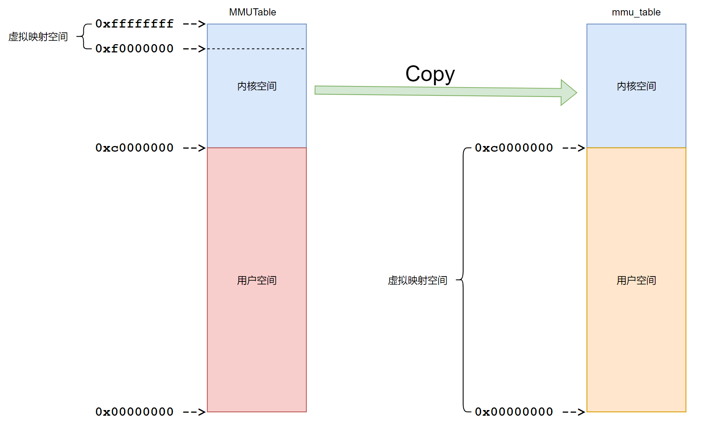
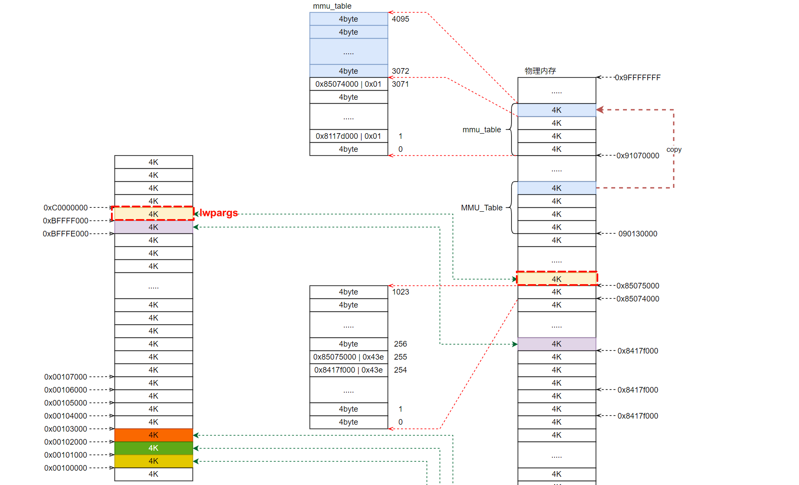

# RT-Smart应用程序(.elf)文件加载

[RT-Thread-RT-Smart ELF 应用程序加载运行过程分析RT-Thread问答社区 - RT-Thread](https://club.rt-thread.org/ask/article/8fd18929073be592.html)

以下面hello.elf为例：

```shell
msh /root_demo/bin>hello.elf
```

## 1 msh线程处理

首先RT-Thread的MSH首先会想办法得到"hello.elf"字符串，然后执行msh_exec函数，传入参数即跟得到的"hello.elf"字符串相关：

```c
void finsh_thread_entry(void *parameter)
{
    ...
    while(1)
    {
        ... // 获取
        msh_exec()
    }
}
```

### 1.1 msh_exec

```c
int msh_exec(char *cmd, rt_size_t length)
{
    ...
    
    /* strim the beginning of command */
    // 去除命令行首的空格或者制表符
    while (*cmd  == ' ' || *cmd == '\t')
    {
        cmd++;
        length--;
    }

#ifdef RT_USING_LWP
    /* exec from msh_exec , debug = 0*/
    /* _msh_exec_lwp return is pid , <= 0 means failed */
    if (_msh_exec_lwp(0, cmd, length) > 0)
    {
        return 0;
    }
#endif
    ...
}
```

主要处理进程的函数是_msh_exec_lwp函数。

### 1.2 _msh_exec_lwp

```c
int _msh_exec_lwp(int debug, char *cmd, rt_size_t length)
{
    int argc;
    int cmd0_size = 0;
    char *argv[FINSH_ARG_MAX];
    char *pg_name;
    int ret;

    // 获取命令行首的命令名 hello.elf
    while ((cmd[cmd0_size] != ' ' && cmd[cmd0_size] != '\t') && cmd0_size < length)
        cmd0_size ++;
    if (cmd0_size == 0)
        return -1;

    // 分割所有参数，这里没有参数argc = 1， argv[0] = "hello.elf"
    rt_memset(argv, 0x00, sizeof(argv));
    argc = msh_split(cmd, length, argv);
    if (argc == 0)
        return -1;

    // 在工作目录下查找文件是否存在，可以包含路径(hello.elf  /bin/hello.elf)
    pg_name = _msh_exec_search_path("", argv[0]);
    if (pg_name)
    {
        goto found_program;
    }

    // 确保程序名里面没有路径
    if (strstr(argv[0], "/"))
    {
        return -1;
    }

    // 在bin目录下查找文件是否存在
    pg_name = _msh_exec_search_path("/bin", argv[0]);
    if (pg_name)
    {
        goto found_program;
    }

    // 在环境变量的PATH路径下查找是否存在
    pg_name = _msh_exec_search_env(argv[0]);
    if (pg_name)
    {
        goto found_program;
    }

    /* not found in anywhere */
    return -1;

    /* found program */
found_program:
    ret = exec(pg_name, debug, argc, argv);
    rt_free(pg_name);

    return ret;
}
```

主要流程如下：

- 解析出可执行文件和相关参数。
- 在当前路径下查找是否有可执行文件(可包含路径)。
  - 能找到：
    - 直接执行exec函数。
  - 不能找到：
    - 在"/bin"目录下查找可执行文件(不能包含路径"/")。
    - 在环境变量PATH里面查找可执行文件(不能包含路径"/")。
    - 直接执行exec函数。

总之，只要能找到对应的文件，都会执行exec函数。

### 1.3 exec

exec主要是调用lwp_execve函数：

```c
pid_t exec(char *filename, int debug, int argc, char **argv)
{
    return lwp_execve(filename, debug, argc, argv, __environ);
}
```

其中有几个参数介绍一下：

- filename：程序的名字。
- debug：运行在msh_exec 的时候，debug = 0。
- argc：参数个数。
- argv：参数内容。
- __environ：环境变量。

核心是执行lwp_execve函数：

## 2 lwp_execve

```c
pid_t lwp_execve(char *filename, int debug, int argc, char **argv, char **envp)
{
    int result;
    rt_base_t level;
    struct rt_lwp *lwp;
    char *thread_name;
    char *argv_last = argv[argc - 1];
    int bg = 0;
    struct process_aux *aux;
    int tid = 0;

    struct rt_lwp *lwp = lwp_new();
    int tid = lwp_tid_get();
    lwp_user_space_init(lwp);

    if (argv_last[0] == '&' && argv_last[1] == '\0')
    {
        argc--;
        bg = 1;
    }

    struct process_aux *aux = lwp_argscopy(lwp, argc, argv, envp);

    result = lwp_load(filename, lwp, RT_NULL, 0, aux);
    if (result == 1)
    {
        /* dynmaic */
        lwp_unmap_user(lwp, (void *)(USER_VADDR_TOP - ARCH_PAGE_SIZE));
        result = load_ldso(lwp, filename, argv, envp);
    }
    if (result == RT_EOK)
    {
        rt_thread_t thread = RT_NULL;
        rt_uint32_t priority = 25, tick = 200;

        lwp_copy_stdio_fdt(lwp);

        /* obtain the base name */
        thread_name = strrchr(filename, '/');
        thread_name = thread_name ? thread_name + 1 : filename;
        thread = rt_thread_create(thread_name, lwp_thread_entry, RT_NULL,
                LWP_TASK_STACK_SIZE, priority, tick);
        if (thread != RT_NULL)
        {
            struct rt_lwp *self_lwp;

            thread->tid = tid;
            lwp_tid_set_thread(tid, thread);
            LOG_D("lwp kernel => (0x%08x, 0x%08x)\n", (rt_uint32_t)thread->stack_addr,
                    (rt_uint32_t)thread->stack_addr + thread->stack_size);
            level = rt_hw_interrupt_disable();
            self_lwp = lwp_self();
            if (self_lwp)
            {
                //lwp->tgroup_leader = &thread; //add thread group leader for lwp
                lwp->__pgrp = tid;
                lwp->session = self_lwp->session;
                /* lwp add to children link */
                lwp->sibling = self_lwp->first_child;
                self_lwp->first_child = lwp;
                lwp->parent = self_lwp;
            }
            else
            {
                //lwp->tgroup_leader = &thread; //add thread group leader for lwp
                lwp->__pgrp = tid;
            }
            if (!bg)
            {
                if (lwp->session == -1)
                {
                    struct tty_struct *tty = RT_NULL;
                    tty = (struct tty_struct *)console_tty_get();
                    lwp->tty = tty;
                    lwp->tty->pgrp = lwp->__pgrp;
                    lwp->tty->session = lwp->session;
                    lwp->tty->foreground = lwp;
                    tcgetattr(1, &stdin_termios);
                    old_stdin_termios = stdin_termios;
                    stdin_termios.c_lflag |= ICANON | ECHO | ECHOCTL;
                    tcsetattr(1, 0, &stdin_termios);
                }
                else
                {
                    if (self_lwp != RT_NULL)
                    {
                        lwp->tty = self_lwp->tty;
                        lwp->tty->pgrp = lwp->__pgrp;
                        lwp->tty->session = lwp->session;
                        lwp->tty->foreground = lwp;
                    }
                    else
                    {
                        lwp->tty = RT_NULL;
                    }

                }
            }
            thread->lwp = lwp;

            rt_list_insert_after(&lwp->t_grp, &thread->sibling);

            if (debug && rt_dbg_ops)
            {
                lwp->debug = debug;
                rt_thread_control(thread, RT_THREAD_CTRL_BIND_CPU, (void*)0);
            }
            rt_hw_interrupt_enable(level);

            rt_thread_startup(thread);
            return lwp_to_pid(lwp);
        }
    }

    lwp_tid_put(tid);
    lwp_ref_dec(lwp);

    return -RT_ERROR;
}
```

### 2.1 lwp_new

对于一个进程的运行，首先需要分配一个进程描述结构体，lwp_new()函数就是为了完成这个任务。该函数主要完成的任务是：

- 分配一个struct rt_lwp结构体，用于描述一个进程。
- 初始化相关成员变量。
- 分配一个空闲的进程pid。
- pid与进程绑定。
  - lwp->pid = pid;
  - pid_to_lwp(pid) = lwp;

主要是第四点，进程里面记录pid是很好理解的，这里说一下pid的管理方式，看看pid号是如何记录进程的。这种方式在RT-Smart的lwp管理里面也是经常用到。

#### 2.1.1 pid的管理

利用了数据结构里面平衡二叉树(AVL)，具体二叉树的知识可以随便找个视频学一下，AVL树具有以下特性：

- 每个节点都存储一个关键字值。
- 对于任意节点，它的左子树和右子树都是AVL树。
- 对于任意节点，其左子树中的关键字值小于等于节点的关键字值，而其右子树中的关键字值大于等于节点的关键字值。
- 每个节点都有一个平衡因子（Balance Factor），它表示其左子树的高度减去右子树的高度。平衡因子可以是 -1、0 或 1。
- 对于AVL树中的每个节点，其平衡因子必须为 -1、0 或 1。如果一个节点的平衡因子不在这个范围内，那么它就不是AVL树，需要进行平衡操作以恢复平衡性。

使用AVL树的目的只是为了提高数据的访问效率。下面看一下tree node的数据结构：

##### struct lwp_avl_struct

```c
struct lwp_avl_struct
{
    struct lwp_avl_struct *avl_left;  // 指向左子树的指针
    struct lwp_avl_struct *avl_right; // 指向右子树的指针
    int avl_height;                   // 节点的高度
    avl_key_t avl_key;                // 节点的键值
    void *data;                       // 节点关联的数据，类型为void指针，可以指向任意类型的数据
};
```

#####  lwp_avl.h 的 api

rtthread为AVL树定义了以下操作：

```c
// 从AVL树中删除一个节点
void lwp_avl_remove(struct lwp_avl_struct *node_to_delete, struct lwp_avl_struct **ptree);

// 向AVL树中插入一个新节点
void lwp_avl_insert(struct lwp_avl_struct *new_node, struct lwp_avl_struct **ptree);

// 在AVL树中查找具有给定键值的节点
struct lwp_avl_struct *lwp_avl_find(avl_key_t key, struct lwp_avl_struct *ptree);

// 遍历AVL树，并对每个节点执行给定的函数
int lwp_avl_traversal(struct lwp_avl_struct *ptree, int (*fun)(struct lwp_avl_struct *, void *), void *arg);

// 查找AVL树中的第一个节点（最小键值节点）
struct lwp_avl_struct *lwp_map_find_first(struct lwp_avl_struct *ptree);
```

### 2.2 lwp_tid_get

获取线程id。

后面肯定会跟进程进行对应的绑定。

### 2.3 lwp_user_space_init

主要为了初始化用户进程的mmu_info，记录页表和可映射区间等信息。



### 2.4 判断是否后台运行

根据输入命令的最后一个参数是不是$来判断是否需要后台运行。如果需要后台运行，对应参数需要减少一个，并且将后台运行标志位置1。

### 2.5 lwp_argscopy

保存参数和环境变量等信息到hello.elf进程的用户空间lwp->args=args。



