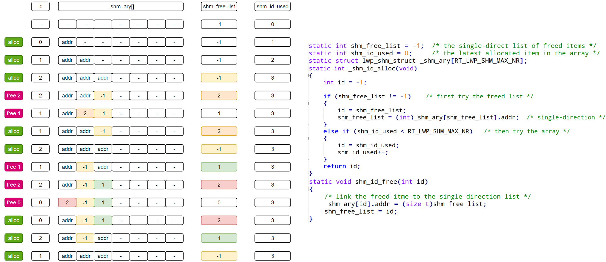
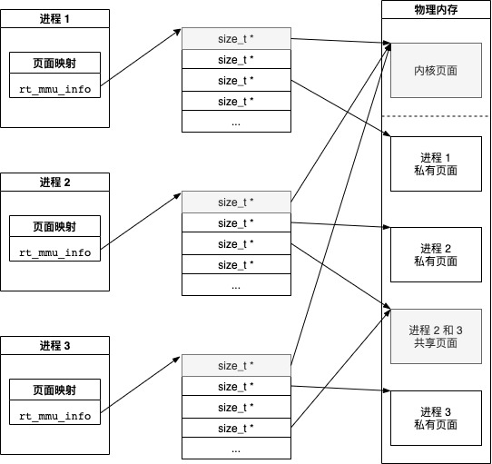

# RT-Smart共享内存机制

## 1 共享内存控制块id管理

### 1.1 数据结构和重要成员

共享内存的描述结构体如下：

```c
struct lwp_shm_struct
{
    size_t addr; /* 当未使用时，指向空闲列表中的下一个共享内存区域 */
    size_t size; /* 共享内存区域的大小 */
    int ref;     /* 共享内存区域的引用计数 */
    size_t key;  /* 共享内存区域的键值，可能用于查找或标识 */
};
```

首先根据第四个成员key的值，可以看出肯定是基于AVL树进行管理的。addr表示共享内存的物理地址，并且用size记录共享内存的大小。ref表示共享内存的引用计数。

RT-Smart定义了如下的一个数组来管理共享内存：

```c
static struct lwp_shm_struct _shm_ary[RT_LWP_SHM_MAX_NR];
```

可以看出，RT-Smart支持管理最多为RT_LWP_SHM_MAX_NR个共享内存区域。

### 1.2 共享内存区域id分配

RT-Smart使用下面函数来从共享内存管理数组里面获得一个空闲的共享内存区域，并且将该共享内存区域在数组中的索引作为id值返回：

```c
static int _shm_id_alloc(void)
{
    int id = -1;

    // 首先尝试从空闲列表中分配
    if (shm_free_list != -1)
    {
        id = shm_free_list;                     /* 获取空闲列表的头节点ID */
        shm_free_list = (int)_shm_ary[id].addr; /* 更新空闲列表的头节点为下一个空闲项 */
    }
    // 如果空闲列表为空，则尝试从数组中分配
    else if (shm_id_used < RT_LWP_SHM_MAX_NR)
    {
        id = shm_id_used; /* 使用数组中的下一个位置 */
        shm_id_used++;    /* 更新已使用的最后一个ID */
    }
    return id; /* 返回分配的ID */
}
```

### 1.3 共享内存区域id释放

```c
static void shm_id_free(int id)
{
    // 将释放的共享内存区域链接到空闲列表的开头
    _shm_ary[id].addr = (size_t)shm_free_list; /* 将当前空闲列表的头节点地址保存到addr字段 */
    shm_free_list = id;                        /* 更新空闲列表的头节点为刚释放的共享内存区域ID */
}
```

具体的分配释放管理这里用一张图来演示：



## 2 获取共享内存区域

```c
static int _lwp_shmget(size_t key, size_t size, int create)
```

观察该函数的参数，可以发现有一个create参数，该参数表示是否创建共享内存区域。也就是说在，共享内存管理的AVL树中，根据key的值若是没有查找到共享内存区域，则根据create参数来决定是否创建共享内存区域。

### 2.1 创建共享内存区域

这里我们先看一下创建共享内存区域的过程：

```c
static int _lwp_shmget(size_t key, size_t size, int create)
{
    ...

    if (create)
    {
        struct lwp_shm_struct *p;

        // 分配一个共享内存区域的ID
        id = _shm_id_alloc();

        // 根据所需大小分配页面，页面大小是2的指数倍
        bit = rt_page_bits(size);
        page_addr = rt_pages_alloc(bit); // 分配虚拟地址
        page_addr_p = (void *)((char *)page_addr + PV_OFFSET);

        p = _shm_ary + id;
        p->addr = (size_t)page_addr_p;
        p->size = (1UL << (bit + ARCH_PAGE_SHIFT)); // 设置大小
        p->ref = 0;                                 // 初始化引用计数为0
        p->key = key;                               // 设置键值

        // 为键值AVL树和物理地址AVL树分配节点
        node_key = (struct lwp_avl_struct *)rt_malloc(sizeof(struct lwp_avl_struct) * 2);

        // 第一个节点，用于键值AVL树
        node_key->avl_key = p->key;
        node_key->data = (void *)p;
        lwp_avl_insert(node_key, &shm_tree_key);    // 将节点插入键值的AVL树

        // 第二个节点，用于物理地址AVL树
        node_pa = node_key + 1;
        node_pa->avl_key = p->addr;
        node_pa->data = (void *)p;
        lwp_avl_insert(node_pa, &shm_tree_pa);      // 将节点插入物理地址的AVL树
    }
}
```

创建一个共享内存区域，首先需要分配一个共享内存区域的ID，然后根据所需大小分配页面，页面大小是2的指数倍，接着为键值和物理地址分别创建一个节点，并插入到AVL树中。

这里创建两个AVL节点进行管理是为了方便用户通过键值和物理地址来查找共享内存区域。

### 2.2 查找共享内存区域

```c
static int _lwp_shmget(size_t key, size_t size, int create)
{
    int id = -1; 

    node_key = lwp_avl_find(key, shm_tree_key);
    if (node_key)
    {
        return (struct lwp_shm_struct *)node_key->data - _shm_ary;
    }

    return id;
}
```

## 3 删除共享内存区域

```c
static int _lwp_shmrm(int id)
{
    struct lwp_avl_struct *node_key = RT_NULL; // 存储键值的AVL树节点的指针
    struct lwp_avl_struct *node_pa = RT_NULL;  // 存储物理地址的AVL树节点的指针
    struct lwp_shm_struct *p = RT_NULL;        // 存储共享内存区域结构体的指针
    uint32_t bit = 0;                          // 存储页面大小的位数

    // 调用shm_id_to_node函数获取键值的AVL树节点
    node_key = shm_id_to_node(id);
    if (!node_key)
    {
        return -1; // 如果没有找到节点，则返回错误码-1
    }
    p = (struct lwp_shm_struct *)node_key->data; // 获取共享内存区域结构体的指针
    if (p->ref)
    {
        return 0; // 如果共享内存区域还在被引用，则直接返回0（可能表示删除操作被推迟）
    }
    bit = rt_page_bits(p->size); // 根据共享内存区域的大小计算页面大小的位数
    // 释放虚拟地址对应的物理页面
    rt_pages_free((void *)((char *)p->addr - PV_OFFSET), bit);
    // 从键值的AVL树中删除节点
    lwp_avl_remove(node_key, &shm_tree_key);
    // 获取物理地址的AVL树节点
    node_pa = node_key + 1;
    // 从物理地址的AVL树中删除节点
    lwp_avl_remove(node_pa, &shm_tree_pa);
    // 释放键值的AVL树节点所占用的内存
    rt_free(node_key);
    // 释放共享内存区域的ID
    shm_id_free(id);
    return 0; // 删除操作成功，返回0
}
```

函数首先调用shm_id_to_node，去将用户传进来的id给转换为一个键值的AVL树节点。将其从两个AVL树中删除，然后将这个节点的相关数据全部free掉就行了。

## 4 映射虚拟地址到共享内存块

```c
static void *_lwp_shmat(int id, void *shm_vaddr)
{
    struct rt_lwp *lwp = RT_NULL;              // 当前线程的指针
    struct lwp_avl_struct *node_key = RT_NULL; // 键值的AVL树节点的指针
    struct lwp_shm_struct *p = RT_NULL;        // 共享内存区域结构体的指针
    void *va = RT_NULL;                        // 映射后的虚拟地址

    /* 使用ID在二叉树中定位node_key，然后通过node_key获取关联的共享内存结构体。
     * 我们不直接使用ID来引用共享内存结构体，因为二叉树用于验证该结构体是否确实在使用中。
     */
    node_key = shm_id_to_node(id); // 根据ID获取键值的AVL树节点
    if (!node_key)
    {
        return RT_NULL; // 如果没有找到节点，则返回空指针
    }
    p = (struct lwp_shm_struct *)node_key->data; // 获取共享内存区域结构体的指针

    /* 将共享内存映射到当前线程的地址空间中 */
    lwp = lwp_self(); // 获取当前线程的指针
    if (!lwp)
    {
        return RT_NULL; // 如果无法获取当前线程，则返回空指针
    }
    // 将共享内存映射到虚拟地址shm_vaddr，映射大小为p->size，并且指定为共享内存区域类型
    va = lwp_map_user_type(lwp, shm_vaddr, (void *)p->addr, p->size, 1, MM_AREA_TYPE_SHM);
    if (va)
    {
        p->ref++; // 如果映射成功，则增加共享内存区域的引用计数
    }
    return va; // 返回映射后的虚拟地址
}
```

首先，还是根据用户的id转换为键值的AVL树节点，然后通过这个节点获取对应的共享内存区域结构体。然后再进程的地址空间中映射这个共享内存区域。

## 5 解除映射

```c
int _lwp_shmdt(void *shm_vaddr)
{
    struct rt_lwp *lwp = RT_NULL; // 当前线程的指针
    int ret = 0;                  // 函数返回值

    // 获取当前线程的指针
    lwp = lwp_self();
    if (!lwp)
    {
        return -1; // 如果无法获取当前线程，返回错误码-1
    }

    // 减少共享内存的引用计数
    ret = _lwp_shm_ref_dec(lwp, shm_vaddr);
    if (ret >= 0)
    {
        // 如果引用计数减少成功（即没有因为引用计数已经为零而失败），则解除映射
        lwp_unmap_user_phy(lwp, shm_vaddr); // 解除虚拟地址与物理地址的映射关系
        return 0;                           // 返回成功码0
    }
    return -1; // 如果引用计数减少失败，返回错误码-1
}
```

## 6 图示


