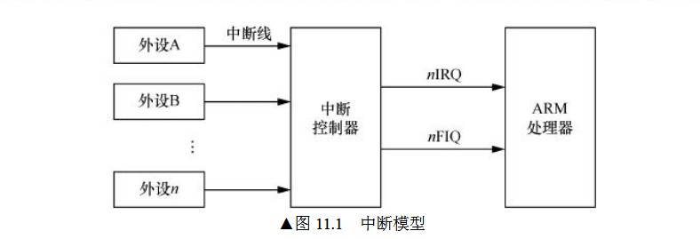
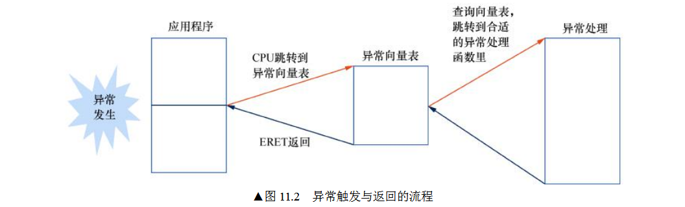

# 异常处理

## 1 基本概念

### 1.1 异常类型

- 中断

  - FIQ：快速中断请求
  - IRQ：普通中断请求

  

- 中止

  - 指令中止
  - 数据中止

- 复位

- 系统调用

  - SVC
  - HVC
  - SMC

### 1.2 异常等级

- EL0：非特权模式，用于运行应用程序
- EL1：特权模式，用于运行操作系统内核
- EL2：用于运行虚拟化管理程序
- EL3：用于运行安全世界管理程序。

### 1.3 同步异常和异步异常

- 同步异常：处理器执行某条指令直接导致的，需要在异常处理函数中处理该异常后，处理器才能运行，常见的同步异常有：
  - 尝试访问一个异常等级不恰当的寄存器
  - 尝试执行关闭或者没有定义的指令
  - 使用没有对齐的SP
  - 尝试执行没有与PC指针对齐的指令
  - 软件产生的异常，如SVC、HVC、SMC指令
  - 地址翻译或者权限等导致的数据/指令异常
  - 调试导致的异常
- 异步异常：异常触发的原因与处理器当前执行的指令无关，中断也属于异步异常的一种，常见的异步异常有：
  - 物理中断：SError、IRQ、FIQ
  - 虚拟中断：VSError、VIRQ。VFIQ

## 2 异常处理与返回

### 2.1 异常入口

当异常发生的时候，CPU能感知异常的发生，并且生成一个**目标异常等级**(target excepetion level)，CPU会执行如下事情：

- 保存[PSTATE](https://www.cnblogs.com/zhangzhiwei122/p/15967235.html)寄存器到相应异常等级的SPSR_ELx中。
- 保存程序的返回指定到相应异常等级的ELR_ELx中。
- 把PSTATE寄存器中的D、A、I、F标志都设置为11，相当与把调试异常、SError、IRQ、FIQ都关闭。
  - D：Debug mask bit [AArch64 only] 
  - A：SError interrupt mask bit 
  - I：IRQ mask bit 
  - F：FIQ mask bit 
- 对于同步异常，需要分析原因，并且把基于原因写入ESR_ELx中
- 切换SP寄存器为目标异常等级的SP_ELx或者SP_EL0寄存器。
- 从异常发生现场的异常等级切换到对应的目标异常等级，然后跳转到异常向量表中

### 2.2 异常返回

当操作系统的异常处理完后，执行一条ERET指令即可从异常返回，这条指令会完成如下工作：

- 从ELR_ELx寄存器中恢复PC指针
- 从SPSR_ELx寄存器中恢复PSTATE寄存器的值

> [!NOTE]
>
> 中断处理是在中断关闭的情况下进行的，那么中断处理完成后在什么时候将中断打开呢？
>
> 当中断发生时，CPU 会把 PSTATE 寄存器的值保存到对应目标异常等级的 SPSR_ELx 中，并且把 PSTATE 寄存器里的 D、A、I、F 标志位都设置为 1，这相当于把本地 CPU 的中断关闭。  
>
> 当中断处理完成后，操作系统调用 ERET 指令返回中断现场，并且会把 SPSR_ELx 恢复到  PSTATE 寄存器中，这相当于把中断打开。

### 2.3 异常返回地址

以下两个寄存器存放了不同的返回地址：

- X30(LR)：存放的是子函数的返回地址，一般用于完成函数调用的，可以用RET指令返回父函数。
- ELR_ELx：存放的是异常返回地址，中断发生的一瞬间，可能在内核空间，也可能在用户空间，无论是在哪，只要执行ERET指令，就可以返回异常现场。

> [!NOTE]
>
> ELR_ELx保存的是发生异常时候的指令还是下一条指令呢？
>
> - 对于异步异常，返回的地址是第一条还没有执行或由于中断没能成功执行的指令。
> - 对于同步异常，分两种情况：
>   - 不是系统调用：比如数据异常、访问了没有映射的地址等，返回的是触发  同步异常的那条指令。例如，通过 LDR 指令访问一个地址，这个地址没有建立地址映射。CPU  访问这个地址时触发了一个数据异常，陷入内核态。在内核态里，操作系统把这个地址映射建  立起来，然后再返回异常现场。此时，CPU 会继续执行这条 LDR 指令。刚才因为地址没有映  射而触发异常，异常处理中修复了这个映射关系，所以 LDR 可以访问这个地址。
>   - 是系统调用：下一条指令。

### 2.4 异常处理路由

异常处理路由是指当发生异常的时候应该在哪个异常等级处理

- 当异常发生的时候，可以根据系统的配置，例如SCR_EL3以及HCR_EL2里面的相应字段，异常可以在当前异常等级进行处理，也可以陷入更高优先级的异常等级里并处理。
- EL0不能用来处理异常，EL0是最低权限的异常等级，一般用来运行用户应用程序。