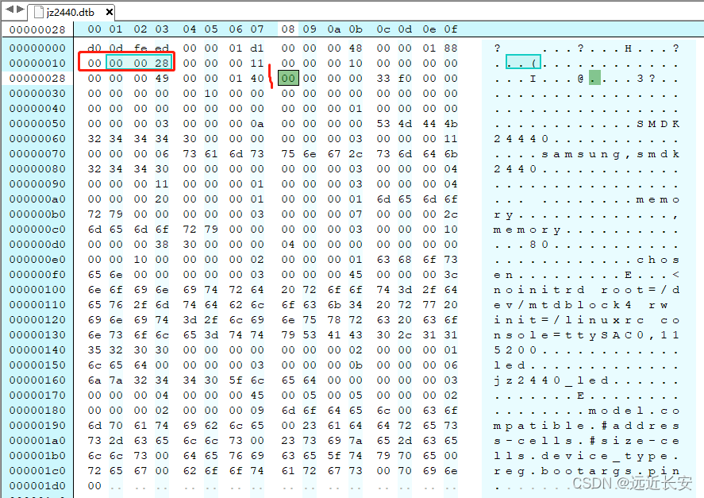
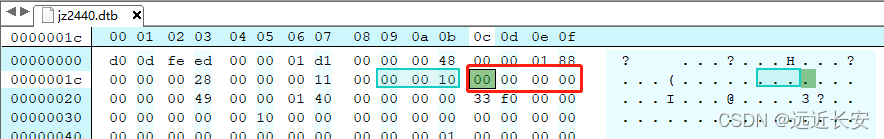

# 设备树的规范

## 1 DTS格式

使用设备树时，需要编写dts文件，然后使用dtc编译dts文件，生成**dtb**文件。

所以本节分为两部分，**第一部分讲解dts格式，第二部分讲解dtb格式**。

首先看一下dts文件的布局。

```dtd
DTS文件布局（layout）:
/dts-v1/;                         // 表示DTS文件的版本
[memory reservations]             // 保存的内存区域 格式为： /memreserve/ <address> <length>;
/ {
    [property definitions]
    [child nodes]
};
```

第一行 /dts-v1/; 表示的是DTS文件的**版本**。

第二行 [memory reservations] 表示保留的内存区域，假设有64MB内存，如果希望保留4MB内存，只提供60MB内存供内核使用，那么就可以设置这个选项，如果不设置则认为内核使用全部的内存。

接下来是 / { ... };，其中 / 是**根**，是**设备树的起点**。

对于每一个设备树，我们需要一些**属性**来描述这颗树，就是 **[property definitions]**；同样，一颗树有很多树干，很多分支，一颗设备树同样也有很多**子节点**，子节点中又可以包含子节点，就是 **[child nodes]**。

那么**属性**和**设备节点**是如何定义的呢？

### 1.1 属性

属性的格式有两种，一种是**没有值的空属性**，一种是**有值的属性**。

```dtd
Property格式1:
[label:] property-name = value;
 
Property格式2(没有值):
[label:] property-name;
```

下面就是有值的属性，除了**特殊规定的属性**，比如bootargs是用来设置启动指令，其他没**有特殊规定的属性**，属性名是可以**自由定义**的，比如pin，就是我们自己定义的属性。

```dtd
chosen {
    bootargs = "noinitrd root=/dev/mtdblock4 rw init=/linuxrc console=ttySAC0,115200";
};


led {
    compatible = "jz2440_led";
    pin = <S3C2410_GPF(5)>;
};
```

**属性值**的写法有**三种**：

- 用**尖括号**括起来 <xx xx xx ...>，例如<1 0x3 0x123>，每个成员都是**32bit**数据，称为**arrays of cells**；
- 用**双引号**括起来的字符串 "..."，例如上面bootargs的字符串；
- 用**中括号**括起来的字节序列（byte string）[xx xx xx ...]，使用16进制表示1个/多个byte，需要注意的是，byte string中，一个byte必须用**2位16进制数**来表示，例如[00 11 22]，其中00不能简写为0，但是**byte之间的空格可以省略**，也就是[00 11 22]和[001122]是一样的；

value的取值类型只有上述三种，但是这三种取值类型可以叠加，不过一般不会这么做。

```dtd
示例: 
a. Arrays of cells : cell就是一个32位的数据
interrupts = <17 0xc>;
 
b. 64bit数据使用2个cell来表示:
clock-frequency = <0x00000001 0x00000000>;
 
c. A null-terminated string (有结束符的字符串):
compatible = "simple-bus";
 
d. A bytestring(字节序列) :
local-mac-address = [00 00 12 34 56 78];  // 每个byte使用2个16进制数来表示
local-mac-address = [000012345678];       // 每个byte使用2个16进制数来表示
 
e. 可以是各种值的组合, 用逗号隔开:
compatible = "ns16550", "ns8250";
example = <0xf00f0000 19>, "a strange property format";
```

### 1.2 设备节点

下面就是设备树中节点的格式。

```dtd
[label:] node-name[@unit-address] {
    [properties definitions]
    [child nodes]
};
```

第一行的 **label 可加可不加**，node-name是**节点名字**；@unit-address是**地址**，可以用来**区分内存节点**，比如memory@30000000和memory@0，分别表示起始地址为0x3000 0000和0的两块内存；

```dtd
led {
    compatible = "jz2440_led";
	pin = <S3C2410_GPF(5)>;
};
memory@30000000 {  /* /memory/memory@30000000 */
	device_type = "memory";
	reg =  <0x30000000 0x4000000>;		
};
 
memory@0 {  /* /memory/memory@0 */
	device_type = "memory";
	reg =  <0 4096>;		
};
```

其中led就是node-name。memory@30000000和memory@0就是两块不同起始地址的内存空间。

### 1.3 特殊节点

dts文件中有一些**默认的属性名字**，比如model，compatible，#address-cells，#size-cells，这些是**根节点必须有的属性**，它们代表的含义都是默认的，是事先约定好的。

#### / 节点

| **属性**       | **含义**                                                     |
| -------------- | ------------------------------------------------------------ |
| #address-cells | 在它的子节点的reg属性中，使用多少个u32整数来描述地址（address)。 |
| #size-cells    | 在它的子节点的reg属性中，使用多少个u32整数来描述大小(size)。 |
| compatible     | 定义一系列的字符串，用来指定内核中哪个machine_dese可以支持本设备，即这个板子兼容哪些平台。 |
| model          | 咱这个板子是什么，比如有2款板子配置基本一致，它们的compatible是一样的，那么就通过mode1来分辨这2款板子。 |

#### /memory 节点

| **属性**    | **含义**                   |
| ----------- | -------------------------- |
| device_type | device_type = "memory";    |
| reg         | 用来指定内存的地址、大小。 |

#### /chosen 节点

| **属性** | **含义**                                                 |
| -------- | -------------------------------------------------------- |
| bootargs | 内核command line参数，跟u-boot中设置的bootargs作用一样。 |

#### /cpus 节点

/cpus 节点下有1个或多个cpu子节点，cpu子节点中用reg属性用来标明自己是哪一个cpu，所以/cpus 中有以下2个属性：

| **属性**       | **含义**                                                     |
| -------------- | ------------------------------------------------------------ |
| #address-cells | 在它的子节点的reg属性中，使用多少个u32整数来描述地址（address)。 |
| #size-cells    | 在它的子节点的reg属性中，使用多少个u32整数来描述大小(size)，必须设置为0。 |

#### /cpus/cpu* 节点

| **属性**    | **含义**              |
| ----------- | --------------------- |
| device_type | device_type = "cpu";  |
| reg         | 表明自己是哪一个cpu。 |

### 1.4 引用其他节点

#### phandle

节点中的phandle属性，它的取值必须是唯一的(不要跟其他的phandle值一样)。

```dtd
pic@10000000{
    phandle = <1>;
    interrupt-controller;
};
another-device-node {
    interrupt-parent = <1>;  // 使用phandle值为1来引用上述节点
};
```

#### label

```dtd
PIC:pic@10000000{
    interrupt-controller;
};
another-device-node {
    interrupt-parent =<&PIC>;       //使用label来引用上述节点，
                                    //使用lable时实际上也是使用phandle来引用，
                                    //在编译dts文件为dtb文件时，编译器dtc会在dtb中插入phandle属性
};
```

## 2 DTB格式

回顾上节，在dts文件和dtsi文件中，可以使用**C**语言的define和include，使用方法和作用也同C语言相同。

编写dts文件后，需要使用**dtc**工具将dts文件编译成dtb文件。dtc工具可以检查dts文件是否存在**语法或格式错误**，如果发现语法或格式上有错误，那么就会提示修改这些错误。

在dts文件中，可以包含一个或多个**dtsi**文件，通过dtc工具将这些文件编译得到一个dtb文件。同时，可以在dts文件中重新定义**覆盖**dtsi文件中设置的节点属性。

下图是dtb文件的布局，从上往下（开始到结束）依次是：

- 头部（struct ftd_header）：用来表明各个部分的偏移地址，整个文件的大小，版本号等等；
- 内存的保留信息块（memory reservation block）：存放dts文件中申明的需要预留的内存的信息；
- 节点块（structure block）：各个节点的信息将放在structure block中；
- 字符串块（strings block）：存放字符串信息；


下面对示例dts文件进行分析：

```dtd
// SPDX-License-Identifier: GPL-2.0
/*
 * SAMSUNG SMDK2440 board device tree source
 *
 * Copyright (c) 2018 weidongshan@qq.com
 * dtc -I dtb -O dts -o jz2440.dts jz2440.dtb
 */
 
#define S3C2410_GPA(_nr)	((0<<16) + (_nr))
#define S3C2410_GPB(_nr)	((1<<16) + (_nr))
#define S3C2410_GPC(_nr)	((2<<16) + (_nr))
#define S3C2410_GPD(_nr)	((3<<16) + (_nr))
#define S3C2410_GPE(_nr)	((4<<16) + (_nr))
#define S3C2410_GPF(_nr)	((5<<16) + (_nr))
#define S3C2410_GPG(_nr)	((6<<16) + (_nr))
#define S3C2410_GPH(_nr)	((7<<16) + (_nr))
#define S3C2410_GPJ(_nr)	((8<<16) + (_nr))
#define S3C2410_GPK(_nr)	((9<<16) + (_nr))
#define S3C2410_GPL(_nr)	((10<<16) + (_nr))
#define S3C2410_GPM(_nr)	((11<<16) + (_nr))
 
/dts-v1/;
 
/memreserve/ 0x33f00000 0x100000;
 
/ {
	model = "SMDK24440";
	compatible = "samsung,smdk2440";
 
	#address-cells = <1>;
	#size-cells = <1>;
		
	memory {  /* /memory */
		device_type = "memory";
		reg =  <0x30000000 0x4000000 0 4096>;		
	};
 
	
/*
	cpus {
		cpu {
			compatible = "arm,arm926ej-s";
		};
	};
*/	
	chosen {
		bootargs = "noinitrd root=/dev/mtdblock4 rw init=/linuxrc console=ttySAC0,115200";
	};
 
	
	led {
		compatible = "jz2440_led";
		pin = <S3C2410_GPF(5)>;
	};
};
```

然后编译这个dts文件，将生成的dtb文件拉到windows下，再使用Hex Editor Neo/UE打开，分析dtb文件。


### 2.1 fdt_header

#### magic

fdt_header的第一个成员是magic，用于**校验是否为dtb文件**，按照大字节序排列，文件中为0xd00dfeed，即fdt_header.magic=0xd00dfeed，符合设备树的magic要求，说明这是一个dtb文件。


#### totalsize

然后是第二个成员totalsize，记录的是**该dtb文件的大小**，fdt_header.totalsize=0x1d1=465，也就是说dtb文件的总大小为465字节。


#### of_dt_struct

储存的是**structure block相对于dtb起始位置的偏移**。fdt_header.off_dt_struct=0x48=72。


#### off_dt_strings

储存的是**string block相对于起始地址的偏移。**fdt_header.off_dt_strings=0x188=392。


#### off_mem_rsvmap

off_mem_rsvmap ，储存的是memory reservation block相对于起始位置的偏移。fdt_header.off_mem_rsvmap=0x28=40。



#### version

储存的是**设备树数据结构的版本**。fdt_header.version=0x11=17。


#### last_comp_version

last_comp_version，储存的是**所用版本向后兼容的最低版本的设备树数据结构，**如本版本使用的是17版本，17版本兼容16版本，但不兼容16版本之前的版本，则该成员应该为0x10=16。


#### boot_cpuid_phys

boot_cpuid_phys，储存的是**系统引导CPU的物理ID，**它的值应该与设备树文件中**CPU节点**下的**reg**属性值相等。

由于CPU节点被注释了，所以这里为全0。fdt_header.boot_cpuid_phys=0。



#### size_dt_strings

存储的是**string block**的**长度**。fdt_header.size_dt_strings=0x49=73。string block的偏移地址是0x188，加上长度0x49，刚好等于0x1D1，和dtb大小相等。


#### size_dt_struct

储存的是**structure block**的**长度**。fdt_header.size_dt_struct=0x140=320。根据off_dt_struct可以知道，structure block的偏移地址为0x48，0x48+0x140=0x188，所以从0x48开始到0x188结束，中间的部分都是structure block。


最后总结一下jz2440.dtb文件中，fdt_header各个成员的值：

- fdt_header.magic=0xd00dfeed;
- fdt_header.totalsize=0x1d1;
- fdt_header.off_dt_struct=0x48;
- fdt_header.off_dt_strings=0x188;
- fdt_header.off_mem_rsvmap=0x28;
- fdt_header.version=0x11;
- fdt_header.last_comp_version=0x10;
- fdt_header.boot_cpuid_phys=0;
- fdt_header.size_dt_strings=0x49;
- fdt_header.size_dt_struct=0x140;

所以dtb文件的结构如下所示:

- 0 ~ 0x28 -- ftd_header
- 0x28 ~ 0x48 -- memory_reservation_block
- 0x48 ~ 0x188 -- structure block
- 0x188 ~ 0x1D1 -- string block


### 2.2 Memory Reservation Block

memory reservation blcok，储存的是dts文件中，**指定的需要保留的内存的物理地址和大小**。在jz2440.dts文件中，指定了保留起始地址为0x33F00000，大小为0x100000的内存空间。

```dtd
/memreserve/ 0x33f00000 0x100000;
```

下面是memory reservation blcok的格式说明：

- memory reservation blcok，保存的也是一个C结构体，这个结构体只有两个成员address和size，分别对应起始地址和大小；
- 不论CPU是32位还是64位，address 和 size都是 64位 的，且按大字节序排列，如果CPU是32位，那么高的32位将被丢弃，只使用低32bit；
- 块的结尾固定是一个address和size全0的结构体；

根据ftd_header信息可知，memory reservation blcok的起始地址为0x28，struct block的起始地址为0x48，所以0x28到0x48中间的部分都为memory reservation blcok。

jz2440的CPU是32bit的，所以高32位丢弃。如图可见，第一个保留的内存块，address为0x33f00000，size为0x100000，与jz2440.dts文件中描述的一致；第二个保留的内存块信息为全0，说明memory reservation blcok到此结束。


### 2.3 Struct Block

Struct Block是由**一系列连续的片**组成的，每个片的以一个**32位token**开始，token按照**大字节序**存储，某些token后面还会接着**额外的数据（extra data）**。所有的token都是**32位对齐**的，不满32位的会在前面补0。

以下是五种token：

#### FDT_BEGIN_NODE(0x00000001) 

FDT_BEGIN_NODE 表示节点的开始，说明后面的内容都是节点信息 。FDT_BEGIN_NODE后接节点名字，节点名字是以NULL结尾的字符串，如果名字中包含地址，则该字符串中也应该包含地址。

#### FDT_END_NODE (0x00000002) 

FDT_END_NODE 表示节点的结束。FDT_END_NODE 没有额外的信息，所以它后面马上接着下一个除FDT_PROP之外的token。

#### FDT_PROP (0x00000003)

FDT_PROP 表示属性的开始，后接描述该属性信息的extra data，它的extra data是按以下C结构体存储的：

```c
struct {
    uint32_t len;        //以字节为单位记录了属性值的长度（长度可能为0，表示一个空值）；
    uint32_t nameoff;    //表示属性名在string block中的偏移位置；
}
```

这两个成员的数据类型都是32bit的整型，按照大字节序存储。

在这个结构体后面，存储的就是属性的值。属性值被储存为长度为len的字符串。如有必要，这个值可以按32bit对齐存储（不足32bit补0）。

#### FDT_NOP (0x00000004) 

FDT_NOP 会 被解析程序忽略，这个token 没有extra data，所以它后面紧接下一个token。一个属性或节点可以通过FDT_NOP token来覆盖，从而将其从删除，而不需要修改树的其他部分。

#### FDT_END (0x00000009)

FDT_END 表示struct block结束，一个dtb文件中应该只包含一个FDT_END token，并且FDT_END token应该是 最后一个token。它没有extra data，因此它后面直接接string block的内容。

以LED节点为例，说明一下设备节点的存储：

```dtd
led {
	compatible = "jz2440_led";
	pin = <S3C2410_GPF(5)>;
};
```

其他节点的分析也与LED节点相似，以**FDT_BEGIN_NODE**+节点名称开始，然后是**FDT_PROP**描述节点的属性，然后是struct（len+nameoff）+val，该节点的属性描述完成后，使用**FDT_END_NODE**表示节点结束；最后，当所有节点描述完毕后，使用**FDT_END**结束struct block。


如果将两块内存分为两个节点，在节点中加入内存的起始地址来区分，则设备如下：


