# 内核对设备树的处理

## 1 内核head.S对dtb的简单处理

设备树文件里面描述的信息可以分为以下三部分：

- platform identification（**平台信息**）；
- runtime configuration（**运行时的配置信息**）；
- device population（**设备的特性**）；

bootloader在启动内核时，会设置r0，r1，r2三个寄存器，通过这三个寄存器将一些参数传递给内核。其中：

- **r0**一般设置为0；
- **r1**一般设置为**machine id**（**在使用设备树时该参数没有用到**）；
- **r2**一般设置为**ATAGS**或**DTB的开始地址**；

> [!NOTE]
>
> **machine id的作用是什么呢？**
>
> 一个内核镜像uImage通常可以支持多种单板，如smdk2410，smdk2440，jz2440，这三种单板之间都有一些微小的差别，也就是说它们**分别需要不同的初始化函数**。
>
> 在内核代码中，它们都有一个用于描述自己的machine_desc结构体，里面有对应的初始化函数，还有一个nr（number）。
>
> 那么，当内核启动时，内核怎么知道它在哪个板子上运行，需要调用哪个初始化参数呢？
>
> 这就需要用uboot了，uboot需要把machine id传给内核，内核再根据uboot传入的machine id来匹配machine_desc结构体中的nr，如果两者相等就是匹配成功，就会调用对应machine_desc结构体中的初始化函数。
>
> 上面是没有使用设备树时的情况，在使用设备树时，r1可以不设置了，也就是不传入machine id，此时，r1可以随便设置。
>
> r2是设备树或ATAGS的起始地址，ATAGS就是之前说的uboot向内核传参数的tag的起始地址。这里需要注意的就是，r2传入的可能是设备树的起始地址，也可能是tag的起始地址。
>
> tag就是uboot对内核传入的启动参数。

下面大致看一下head.S。

首先会获取processor id（r9 = processor id），然后跳到__lookup_processor_type，看看内核能不能支持这款CPU。

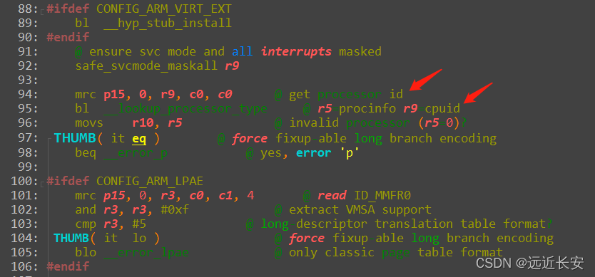

如果内核能够支持这款CPU的话，r5会返回一个用于描述处理器的结构体（proc_info_list）的地址，否则，r5=0。

在代码里面，有很多.S文件，这些文件里面包含proc_info_list结构体(里面含有这类CPU的初始化函数、信息)，也包含cpu id。

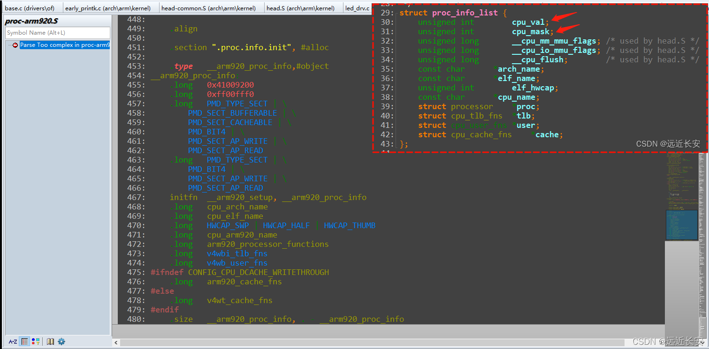

将读到的cpu id与cpu_mask与，然后再与.S文件中的cpu_val对比，相等说明匹配成功。

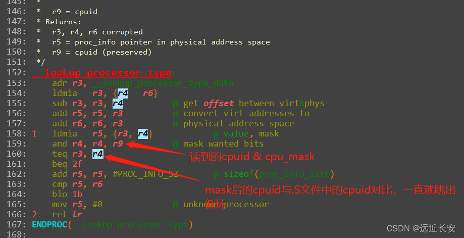

然后往下执行，有一个__vet_atags函数，这个函数就会判断r2传入的是tag的首地址还是dtb文件的首地址。

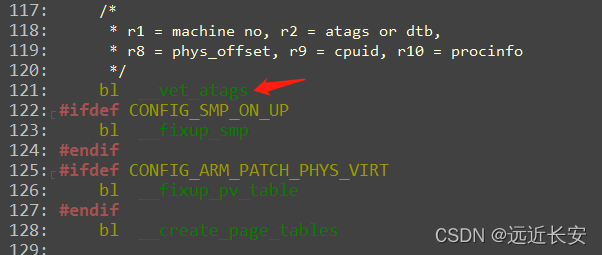

然后是__create_page_tables，这个主要是创建页表，也就是创建虚拟地址与物理地址的映射关系，这个先不深入。

继续向下，会使能MMU，使能MMU之后就要使用虚拟地址了。

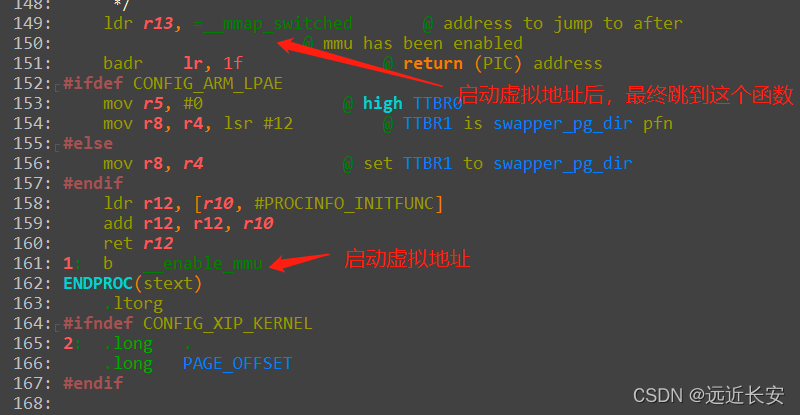

进入__mmap_switched。

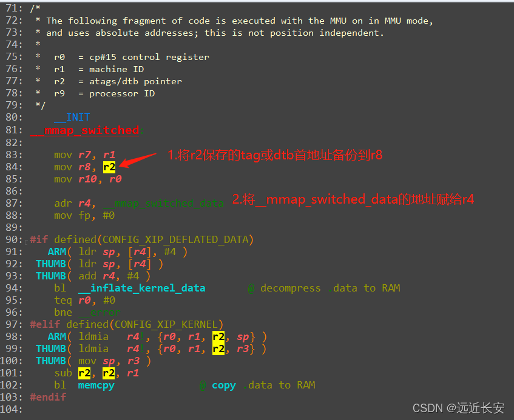

进入 __mmap_switched_data，可以看到里面都是一些变量和段的地址（C变量在汇编文件中出现时，变量名表示的该变量的地址）。


继续往下，会从\_\_mmap_switched_data中读值，经过第4步后会将C变量\_\_atags_pointer的地址读到r2。

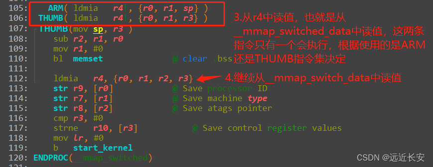

最后，再将之前保存到r8的tag或dtb首地址赋给地址为r2的内存空间，即将tag或dtb首地址赋给__atags_pointer变量。

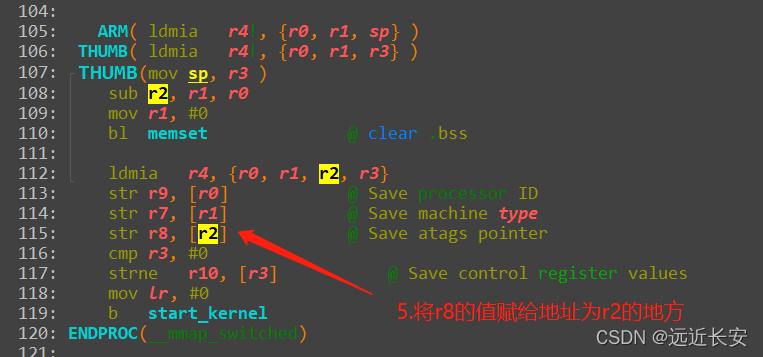

综上所述，在__mmap_switched中，经过一系列的汇编操作，最终会将：

- 把bootloader传来的r1值, 赋给了C变量: __machine_arch_type
- 把bootloader传来的r2值, 赋给了C变量: __atags_pointer     // dtb首地址

整个head.S的大致流程如下：

- __lookup_processor_type : 使用汇编指令读取CPU ID, 根据该ID找到对应的proc_info_list结构体(里面含有这类CPU的初始化函数、信息)
- __vet_atags             : 判断是否存在可用的ATAGS或DTB
- __create_page_tables    : 创建页表, 即创建虚拟地址和物理地址的映射关系
- __enable_mmu            : 使能MMU, 以后就要使用虚拟地址了
- \_\_mmap_switched         : 上述函数里将会调用\_\_mmap_switched
- 把bootloader传入的r2参数, 保存到变量__atags_pointer中
- 调用C函数start_kernel

总的来说，head.S中所做的操作就是，将r2中保存的tag或dtb的首地址赋给了C变量__atags_pointer。

## 2 对设备树中平台信息的处理

当使用dtb给内核传递参数的时候，使用设备树根节点下面的compatible属性值来匹配对应的machine desc结构体。

该属性值是由**一个或多个字符串**组成的**，** 在**dts**文件中**声明匹配的machine desc，**这个匹配的machine desc可以按**匹配等级**分为多个**，**比如最好，次好，最不匹配等等**。**

比如下图，表示的就是**最好的匹配项**是"samsung, smdk2440"，**次好的匹配项**是"samsung, smdk2410"，**最差的匹配项**则是"samsung, smdk24xx"。

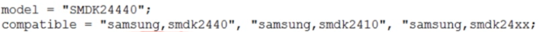

综上，通过**根节点下的compatible属性**，我们在设备树中列出了一个清单，在内核中比对我们想要的machine desc结构体。

以smdk2440为例，在mach-smdk2440.c文件中，有定义smdk2440的machine_desc结构体。

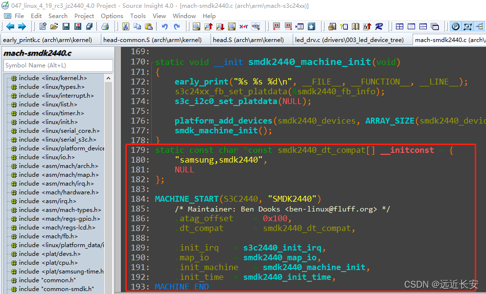

每个**machine_desc**结构体中都应该有一个**dt_compat**成员，表示**支持哪些单板**。

通过**MACHINE_START(_type,_name)**和**MACHINE_END**宏，定义了一个放在**.arch.info.init**段的结构体，其中.nr为MACH_TYPE_SMDK2440，.name为"SMDK2440"。

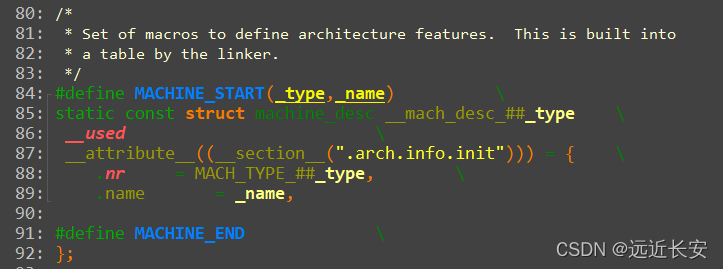

**compatible**属性的值是**一个或多个字符串**，那么就可能与多个machine_desc结构体匹配。此时，**会使用最优的machine desc结构体。**

假设dts文件如下：

```dtd
/ {
    ...
    
    compatible = "xxx", "yyy", "zzz";
    
    ...
}
```

那么会将**compatible属性值**跟**machine_desc.dt_compat**比较**，根据吻合的compatible取值的位置**，成绩依次为1,2,3（xxx,yyy,zzz）。**成绩越低，匹配度越高**。

函数的调用过程如下：

```c
start_kernel // init/main.c
    setup_arch(&command_line);  // arch/arm/kernel/setup.c
        mdesc = setup_machine_fdt(__atags_pointer);  // arch/arm/kernel/devtree.c
                    early_init_dt_verify(phys_to_virt(dt_phys)  // 判断是否有效的dtb, drivers/of/ftd.c
                                    initial_boot_params = params;
                    mdesc = of_flat_dt_match_machine(mdesc_best, arch_get_next_mach);  // 找到最匹配的machine_desc, drivers/of/ftd.c
                                    while ((data = get_next_compat(&compat))) {
                                        score = of_flat_dt_match(dt_root, compat);
                                        if (score > 0 && score < best_score) {
                                            best_data = data;
                                            best_score = score;
                                        }
                                    }
                    
        machine_desc = mdesc;
```

前面提到：**head.S**会将**tag或者dtb的起始地址**赋给C变量**__atags_pointer**。

在**setup_arch**函数中，先调用**setup_machine_fdt**函数，**将__atags_pointer当做dtb的首地址处理，如果出错则再当做tag首地址处理**。

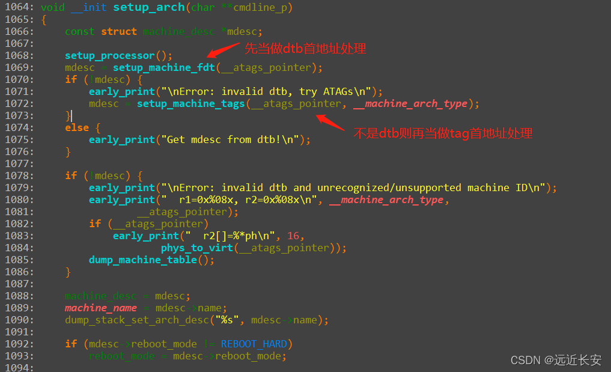

然后，setup_machine_fdt函数会调用early_init_dt_verify函数，early_init_dt_verify函数中再调用fdt_check_header函数，需要注意这里调用了phys_to_virt函数，会将tag或设备树的起始地址由物理地址转换为虚拟地址。

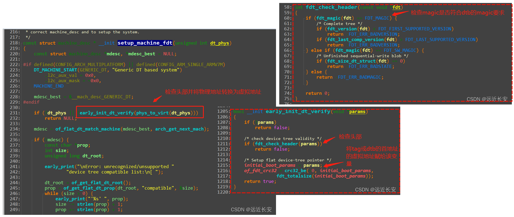

在early_init_dt_verify函数中再调用fdt_check_header函数。在fdt_check_header函数中，会检验\_\_atags_pointer的magic信息是否符合dts的magic要求，如果符合才认为\_\_atags_pointer是dtb的首地址，否则是tag的首地址（检测是否满足tag的magic要求）。

之后，会将**设备树起始地址**的**虚拟地址**保存到**initial_boot_params**变量中，该变量后续会使用。

通过**头部校验**之后，再通过**of_flat_dt_match_machine**函数找到**最匹配的machine_desc结构体**。

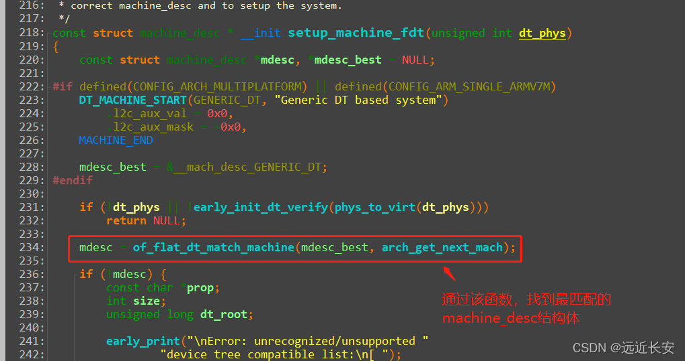

在定义**machine_desc**结构体时，会将**段属性**定义为**.arch.info.init**。所以在**编译时**，所有的machine_desc结构体就会被统一放在**.arch.info.init**段上，从\_\_arch_info_begin开始，到\_\_arch_info_end结束。

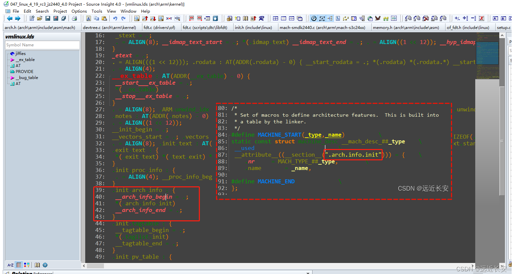

而**arch_get_next_mach**函数，就是**取出machine_desc中的dt_compat**，然后将取出的**dt_compat**用来与**设备树中的compatible属性值**比较。

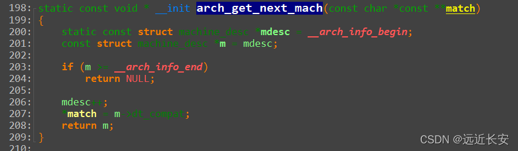

下面再来看一下比较函数，通过一系列函数调用，最终会调用**of_fdt_is_compatible**函数，其中**compat**就是通过arch_get_next_mach函数从machine_desc中取出的**dt_compat**，score就是成绩，最初是0。

**of_fdt_is_compatible**函数中，先获取**设备树根节点下的compatible属性值**，然后与machine_desc中的**dt_compat**比较，如果**匹配则返回score**，**不匹配则score++**，直到**比对完全部compatible属性值**或**匹配到符合的属性值**。

所以，**越先匹配到，成绩越低，匹配度越高。**

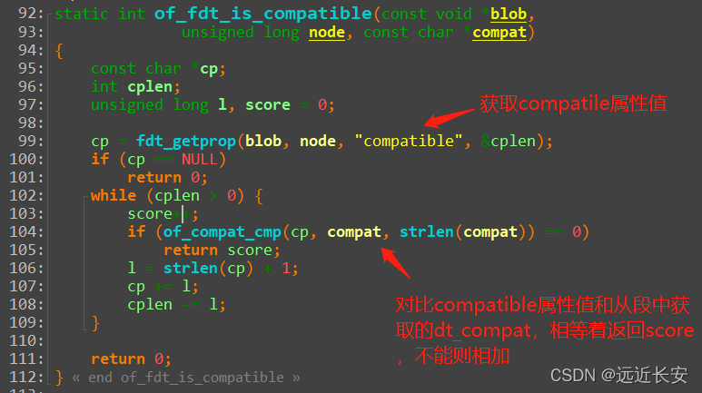

通过取出每一个**machine_desc**结构体的**dt_compat**并比对，最终使用成绩最低的那个**machine_desc**结构体。

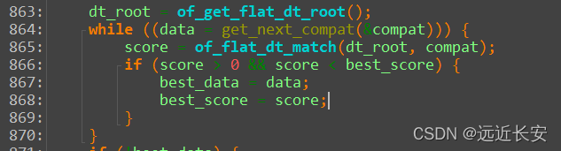

总结如下：

- 设备树根节点的compatible属性列出了一系列的字符串，表示它兼容的单板名，从"最兼容"到次之；
- 内核中有多个machine_desc，其中有dt_compat成员, 它指向一个字符串数组, 里面表示该machine_desc支持哪些单板；
- 使用compatile属性的值，跟每一个machine_desc.dt_compat比较，成绩为"吻合的compatile属性值的位置"，成绩越低，匹配度越高，成绩最低的machine_desc会被选中；

## 3 对设备树中运行时配置信息的处理

**设备树主要是做一些信息的传递，简单的说就是将信息从设备树中读出出来，再赋给内核中的某个变量。**

以下面设备树文件为例：

```dtd
// SPDX-License-Identifier: GPL-2.0
/*
 * SAMSUNG SMDK2440 board device tree source
 *
 * Copyright (c) 2018 weidongshan@qq.com
 * dtc -I dtb -O dts -o jz2440.dts jz2440.dtb
 */
 
#define S3C2410_GPA(_nr)	((0<<16) + (_nr))
#define S3C2410_GPB(_nr)	((1<<16) + (_nr))
#define S3C2410_GPC(_nr)	((2<<16) + (_nr))
#define S3C2410_GPD(_nr)	((3<<16) + (_nr))
#define S3C2410_GPE(_nr)	((4<<16) + (_nr))
#define S3C2410_GPF(_nr)	((5<<16) + (_nr))
#define S3C2410_GPG(_nr)	((6<<16) + (_nr))
#define S3C2410_GPH(_nr)	((7<<16) + (_nr))
#define S3C2410_GPJ(_nr)	((8<<16) + (_nr))
#define S3C2410_GPK(_nr)	((9<<16) + (_nr))
#define S3C2410_GPL(_nr)	((10<<16) + (_nr))
#define S3C2410_GPM(_nr)	((11<<16) + (_nr))
 
/dts-v1/;
 
/memreserve/ 0x33f00000 0x100000;
 
/ {
	model = "SMDK24440";
	compatible = "samsung,smdk2440";
 
	#address-cells = <1>;
	#size-cells = <1>;
		
	memory {  /* /memory */
		device_type = "memory";
		reg =  <0x30000000 0x4000000 0 4096>;		
	};
 
	
/*
	cpus {
		cpu {
			compatible = "arm,arm926ej-s";
		};
	};
*/	
	chosen {
		bootargs = "noinitrd root=/dev/mtdblock4 rw init=/linuxrc console=ttySAC0,115200";
	};
 
	
	led {
		compatible = "jz2440_led";
		pin = <S3C2410_GPF(5)>;
	};
};
```

根节点下面设置了一个**chosen**子节点，**chosen**子节点里有一个属性叫**bootargs**，这个就是**内核启动时的命令行参数**。

根节点下面还有**memory**子节点，**memory**子节点则是**将内存的起始地址和大小告诉内核**。起始地址和大小都保存在memory节点的**reg**属性中。

> [!NOTE]
>
> **起始地址和大小，分别用几个32bit的数值来说明呢**？
>
> 这就要看根节点下的#address-cells和#size-cells的大小，设为1表示1个32bit的数值，2表示2个32bit的数值，以此类推。所以，在解析memory节点之前，要先解析#address-cells和#size-cells这两个属性。
>
> 显然，上面的dts文件中，内存的起始地址和大小分别为1个32bit的数值，共两块内存，第一块内存的起始地址和大小分别为0x30000000和0x4000000，第二块内存的起始地址和大小分别为0和4096。
>

从之前分析得出，**head.S**首先会调用**init**路径下的**main.c**文件中的**start_kernel**函数，然后在**start_kernel**函数中调用**setup_arch**函数，在**setup_arch**函数中再调用**setup_machine_fdt**函数，使用dtb文件来设置板子。

通过**of_flat_dt_match_machine**函数，选择最合适的**machine_desc**结构体之后，会调用**early_init_dt_scan_nodes**函数，函数名意为**早期的设备树扫描节点**。

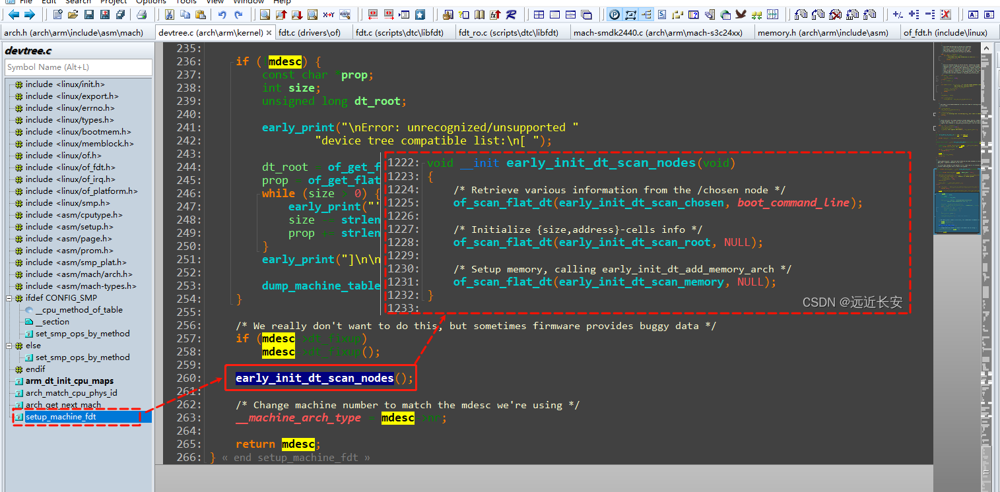

**early_init_dt_scan_nodes**根据注释可以知道，分别是处理chosen节点中的bootargs属性，#address-cells和#size-cells，memory。

这三个处理过程都是调用了同一个函数，**of_scan_flat_dt**，只不过是传入的值不同。

查看**of_scan_flat_dt**函数，**it**是一个**函数指针**，**data**主要是用来**配合it使用的**。

根据注释，**这个函数的主要作用是扫描dtb文件，提取内存信息的。**

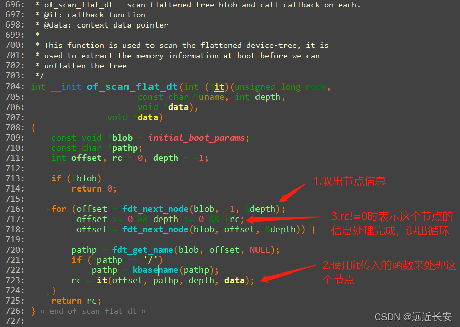

所以，对于**of_scan_flat_dt**函数，我们**主要关心it传入的callback函数**即可。

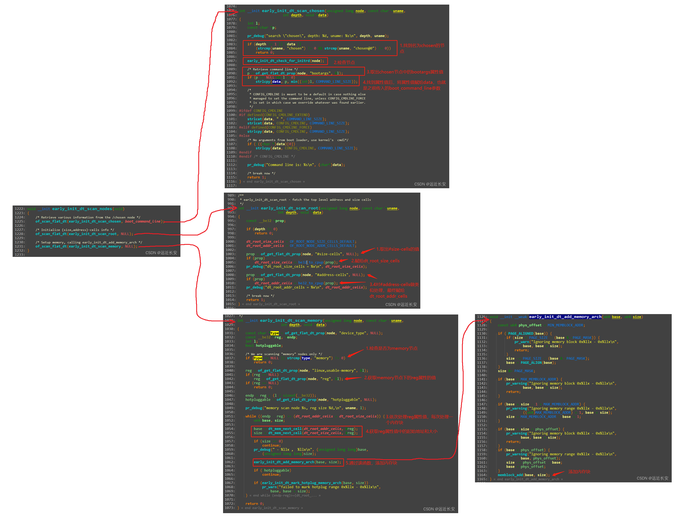

early_init_dt_scan_chosen函数的分析如下，最终就是**将chosen节点的bootargs属性值赋给boot_command_line变量**。

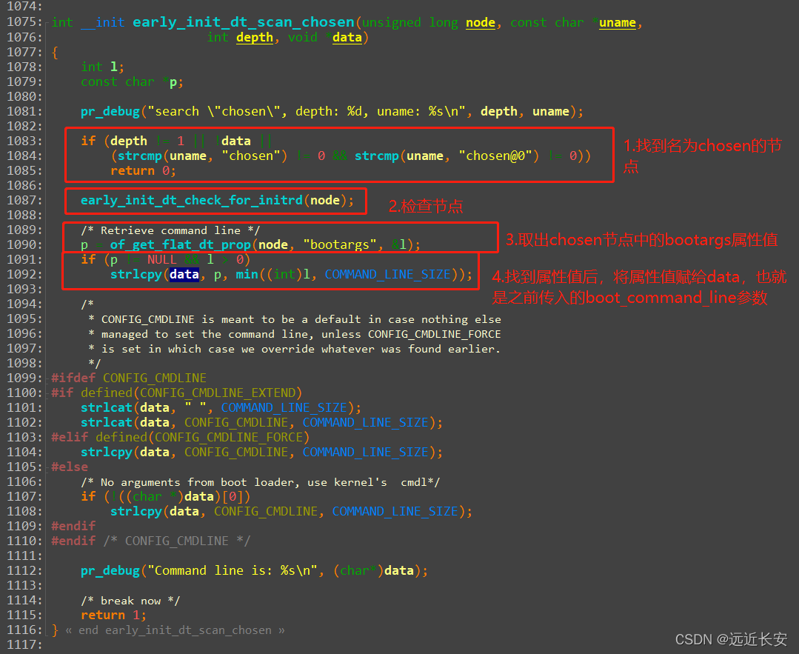

再看early_init_dt_scan_root函数，它主要是处理根节点下的#address-cells和#size-cells，分析过程如下图所示，处理的过程比较简单，就是取值后赋值。需要注意的是，dtb文件中是按大端字节序存储的数值信息，要先通过be32_to_cpup转换成小端字节序再赋值。
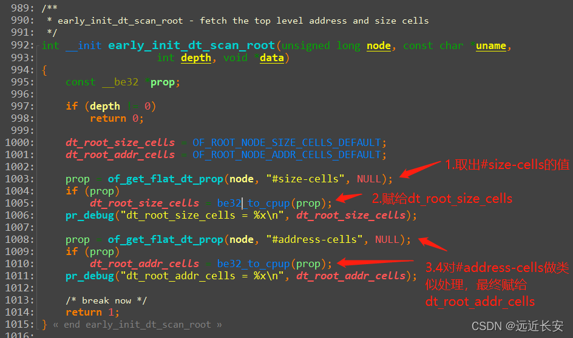

最后是对**memory**的处理，分析如下：

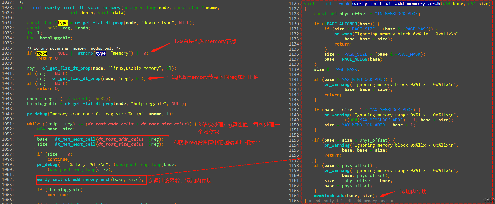

从dtb中读出内存信息后，调用**early_init_dt_add_memory_arch**函数，在**early_init_dt_add_memory_arch**函数中再调用**memblock_add**，这个函数就是用来**添加内存块**的。

函数调用过程如下：

```c
start_kernel // init/main.c
    setup_arch(&command_line);  // arch/arm/kernel/setup.c
        mdesc = setup_machine_fdt(__atags_pointer);  // arch/arm/kernel/devtree.c
                    early_init_dt_scan_nodes();      // drivers/of/ftd.c
                        /* Retrieve various information from the /chosen node */
                        of_scan_flat_dt(early_init_dt_scan_chosen, boot_command_line);
 
                        /* Initialize {size,address}-cells info */
                        of_scan_flat_dt(early_init_dt_scan_root, NULL);
 
                        /* Setup memory, calling early_init_dt_add_memory_arch */
                        of_scan_flat_dt(early_init_dt_scan_memory, NULL);
```

三个函数的作用如下：

- 解析得到根节点下的chosen节点中bootargs属性的值, 存入全局变量： boot_command_line
- 确定根节点的这两个属性的值: #address-cells, #size-cells存入全局变量: dt_root_addr_cells, dt_root_size_cells
- 解析根节点下memory节点中的reg属性, 提取出"base, size", 最终调用memblock_add(base, size)添加内存块；

## 4 dtb转换为device_node(unflatten)

