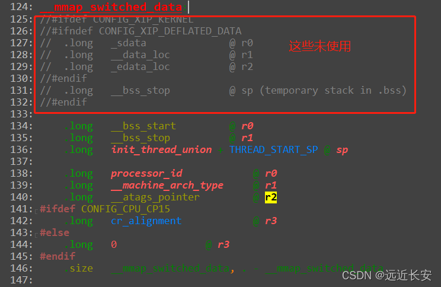
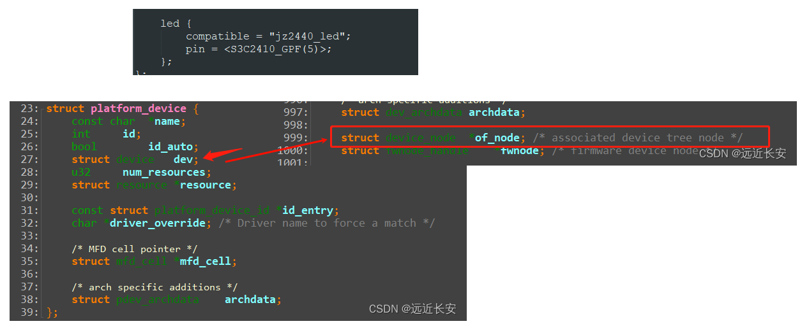
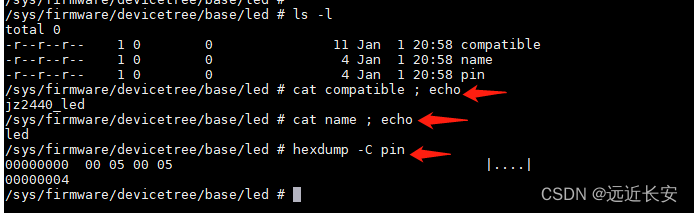

# 内核对设备树的处理

## 1 内核head.S对dtb的简单处理

设备树文件里面描述的信息可以分为以下三部分：

- platform identification（**平台信息**）；
- runtime configuration（**运行时的配置信息**）；
- device population（**设备的特性**）；

bootloader在启动内核时，会设置r0，r1，r2三个寄存器，通过这三个寄存器将一些参数传递给内核。其中：

- **r0**一般设置为0；
- **r1**一般设置为**machine id**（**在使用设备树时该参数没有用到**）；
- **r2**一般设置为**ATAGS**或**DTB的开始地址**；

> [!NOTE]
>
> **machine id的作用是什么呢？**
>
> 一个内核镜像uImage通常可以支持多种单板，如smdk2410，smdk2440，jz2440，这三种单板之间都有一些微小的差别，也就是说它们**分别需要不同的初始化函数**。
>
> 在内核代码中，它们都有一个用于描述自己的machine_desc结构体，里面有对应的初始化函数，还有一个nr（number）。
>
> 那么，当内核启动时，内核怎么知道它在哪个板子上运行，需要调用哪个初始化参数呢？
>
> 这就需要用uboot了，uboot需要把machine id传给内核，内核再根据uboot传入的machine id来匹配machine_desc结构体中的nr，如果两者相等就是匹配成功，就会调用对应machine_desc结构体中的初始化函数。
>
> 上面是没有使用设备树时的情况，在使用设备树时，r1可以不设置了，也就是不传入machine id，此时，r1可以随便设置。
>
> r2是设备树或ATAGS的起始地址，ATAGS就是之前说的uboot向内核传参数的tag的起始地址。这里需要注意的就是，r2传入的可能是设备树的起始地址，也可能是tag的起始地址。
>
> tag就是uboot对内核传入的启动参数。

下面大致看一下head.S。

首先会获取processor id（r9 = processor id），然后跳到__lookup_processor_type，看看内核能不能支持这款CPU。


如果内核能够支持这款CPU的话，r5会返回一个用于描述处理器的结构体（proc_info_list）的地址，否则，r5=0。

在代码里面，有很多.S文件，这些文件里面包含proc_info_list结构体(里面含有这类CPU的初始化函数、信息)，也包含cpu id。


将读到的cpu id与cpu_mask与，然后再与.S文件中的cpu_val对比，相等说明匹配成功。


然后往下执行，有一个__vet_atags函数，这个函数就会判断r2传入的是tag的首地址还是dtb文件的首地址。


然后是__create_page_tables，这个主要是创建页表，也就是创建虚拟地址与物理地址的映射关系，这个先不深入。

继续向下，会使能MMU，使能MMU之后就要使用虚拟地址了。


进入__mmap_switched。


进入 __mmap_switched_data，可以看到里面都是一些变量和段的地址（C变量在汇编文件中出现时，变量名表示的该变量的地址）。



继续往下，会从\_\_mmap_switched_data中读值，经过第4步后会将C变量\_\_atags_pointer的地址读到r2。


最后，再将之前保存到r8的tag或dtb首地址赋给地址为r2的内存空间，即将tag或dtb首地址赋给__atags_pointer变量。


综上所述，在__mmap_switched中，经过一系列的汇编操作，最终会将：

- 把bootloader传来的r1值, 赋给了C变量: __machine_arch_type
- 把bootloader传来的r2值, 赋给了C变量: __atags_pointer     // dtb首地址

整个head.S的大致流程如下：

- __lookup_processor_type : 使用汇编指令读取CPU ID, 根据该ID找到对应的proc_info_list结构体(里面含有这类CPU的初始化函数、信息)
- __vet_atags             : 判断是否存在可用的ATAGS或DTB
- __create_page_tables    : 创建页表, 即创建虚拟地址和物理地址的映射关系
- __enable_mmu            : 使能MMU, 以后就要使用虚拟地址了
- \_\_mmap_switched         : 上述函数里将会调用\_\_mmap_switched
- 把bootloader传入的r2参数, 保存到变量__atags_pointer中
- 调用C函数start_kernel

总的来说，head.S中所做的操作就是，将r2中保存的tag或dtb的首地址赋给了C变量__atags_pointer。

## 2 对设备树中平台信息的处理

当使用dtb给内核传递参数的时候，使用设备树根节点下面的compatible属性值来匹配对应的machine desc结构体。

该属性值是由**一个或多个字符串**组成的**，** 在**dts**文件中**声明匹配的machine desc，**这个匹配的machine desc可以按**匹配等级**分为多个**，**比如最好，次好，最不匹配等等**。**

比如下图，表示的就是**最好的匹配项**是"samsung, smdk2440"，**次好的匹配项**是"samsung, smdk2410"，**最差的匹配项**则是"samsung, smdk24xx"。


综上，通过**根节点下的compatible属性**，我们在设备树中列出了一个清单，在内核中比对我们想要的machine desc结构体。

以smdk2440为例，在mach-smdk2440.c文件中，有定义smdk2440的machine_desc结构体。


每个**machine_desc**结构体中都应该有一个**dt_compat**成员，表示**支持哪些单板**。

通过**MACHINE_START(_type,_name)**和**MACHINE_END**宏，定义了一个放在**.arch.info.init**段的结构体，其中.nr为MACH_TYPE_SMDK2440，.name为"SMDK2440"。


**compatible**属性的值是**一个或多个字符串**，那么就可能与多个machine_desc结构体匹配。此时，**会使用最优的machine desc结构体。**

假设dts文件如下：

```dtd
/ {
    ...
    
    compatible = "xxx", "yyy", "zzz";
    
    ...
}
```

那么会将**compatible属性值**跟**machine_desc.dt_compat**比较**，根据吻合的compatible取值的位置**，成绩依次为1,2,3（xxx,yyy,zzz）。**成绩越低，匹配度越高**。

函数的调用过程如下：

```c
start_kernel // init/main.c
    setup_arch(&command_line);  // arch/arm/kernel/setup.c
        mdesc = setup_machine_fdt(__atags_pointer);  // arch/arm/kernel/devtree.c
                    early_init_dt_verify(phys_to_virt(dt_phys)  // 判断是否有效的dtb, drivers/of/ftd.c
                                    initial_boot_params = params;
                    mdesc = of_flat_dt_match_machine(mdesc_best, arch_get_next_mach);  // 找到最匹配的machine_desc, drivers/of/ftd.c
                                    while ((data = get_next_compat(&compat))) {
                                        score = of_flat_dt_match(dt_root, compat);
                                        if (score > 0 && score < best_score) {
                                            best_data = data;
                                            best_score = score;
                                        }
                                    }
                    
        machine_desc = mdesc;
```

前面提到：**head.S**会将**tag或者dtb的起始地址**赋给C变量**__atags_pointer**。

在**setup_arch**函数中，先调用**setup_machine_fdt**函数，**将__atags_pointer当做dtb的首地址处理，如果出错则再当做tag首地址处理**。


然后，setup_machine_fdt函数会调用early_init_dt_verify函数，early_init_dt_verify函数中再调用fdt_check_header函数，需要注意这里调用了phys_to_virt函数，会将tag或设备树的起始地址由物理地址转换为虚拟地址。


在early_init_dt_verify函数中再调用fdt_check_header函数。在fdt_check_header函数中，会检验\_\_atags_pointer的magic信息是否符合dts的magic要求，如果符合才认为\_\_atags_pointer是dtb的首地址，否则是tag的首地址（检测是否满足tag的magic要求）。

之后，会将**设备树起始地址**的**虚拟地址**保存到**initial_boot_params**变量中，该变量后续会使用。

通过**头部校验**之后，再通过**of_flat_dt_match_machine**函数找到**最匹配的machine_desc结构体**。


在定义**machine_desc**结构体时，会将**段属性**定义为**.arch.info.init**。所以在**编译时**，所有的machine_desc结构体就会被统一放在**.arch.info.init**段上，从\_\_arch_info_begin开始，到\_\_arch_info_end结束。


而**arch_get_next_mach**函数，就是**取出machine_desc中的dt_compat**，然后将取出的**dt_compat**用来与**设备树中的compatible属性值**比较。


下面再来看一下比较函数，通过一系列函数调用，最终会调用**of_fdt_is_compatible**函数，其中**compat**就是通过arch_get_next_mach函数从machine_desc中取出的**dt_compat**，score就是成绩，最初是0。

**of_fdt_is_compatible**函数中，先获取**设备树根节点下的compatible属性值**，然后与machine_desc中的**dt_compat**比较，如果**匹配则返回score**，**不匹配则score++**，直到**比对完全部compatible属性值**或**匹配到符合的属性值**。

所以，**越先匹配到，成绩越低，匹配度越高。**


通过取出每一个**machine_desc**结构体的**dt_compat**并比对，最终使用成绩最低的那个**machine_desc**结构体。


总结如下：

- 设备树根节点的compatible属性列出了一系列的字符串，表示它兼容的单板名，从"最兼容"到次之；
- 内核中有多个machine_desc，其中有dt_compat成员, 它指向一个字符串数组, 里面表示该machine_desc支持哪些单板；
- 使用compatile属性的值，跟每一个machine_desc.dt_compat比较，成绩为"吻合的compatile属性值的位置"，成绩越低，匹配度越高，成绩最低的machine_desc会被选中；

## 3 对设备树中运行时配置信息的处理

**设备树主要是做一些信息的传递，简单的说就是将信息从设备树中读出出来，再赋给内核中的某个变量。**

以下面设备树文件为例：

```dtd
// SPDX-License-Identifier: GPL-2.0
/*
 * SAMSUNG SMDK2440 board device tree source
 *
 * Copyright (c) 2018 weidongshan@qq.com
 * dtc -I dtb -O dts -o jz2440.dts jz2440.dtb
 */
 
#define S3C2410_GPA(_nr)	((0<<16) + (_nr))
#define S3C2410_GPB(_nr)	((1<<16) + (_nr))
#define S3C2410_GPC(_nr)	((2<<16) + (_nr))
#define S3C2410_GPD(_nr)	((3<<16) + (_nr))
#define S3C2410_GPE(_nr)	((4<<16) + (_nr))
#define S3C2410_GPF(_nr)	((5<<16) + (_nr))
#define S3C2410_GPG(_nr)	((6<<16) + (_nr))
#define S3C2410_GPH(_nr)	((7<<16) + (_nr))
#define S3C2410_GPJ(_nr)	((8<<16) + (_nr))
#define S3C2410_GPK(_nr)	((9<<16) + (_nr))
#define S3C2410_GPL(_nr)	((10<<16) + (_nr))
#define S3C2410_GPM(_nr)	((11<<16) + (_nr))
 
/dts-v1/;
 
/memreserve/ 0x33f00000 0x100000;
 
/ {
	model = "SMDK24440";
	compatible = "samsung,smdk2440";
 
	#address-cells = <1>;
	#size-cells = <1>;
		
	memory {  /* /memory */
		device_type = "memory";
		reg =  <0x30000000 0x4000000 0 4096>;		
	};
 
	
/*
	cpus {
		cpu {
			compatible = "arm,arm926ej-s";
		};
	};
*/	
	chosen {
		bootargs = "noinitrd root=/dev/mtdblock4 rw init=/linuxrc console=ttySAC0,115200";
	};
 
	
	led {
		compatible = "jz2440_led";
		pin = <S3C2410_GPF(5)>;
	};
};
```

根节点下面设置了一个**chosen**子节点，**chosen**子节点里有一个属性叫**bootargs**，这个就是**内核启动时的命令行参数**。

根节点下面还有**memory**子节点，**memory**子节点则是**将内存的起始地址和大小告诉内核**。起始地址和大小都保存在memory节点的**reg**属性中。

> [!NOTE]
>
> **起始地址和大小，分别用几个32bit的数值来说明呢**？
>
> 这就要看根节点下的#address-cells和#size-cells的大小，设为1表示1个32bit的数值，2表示2个32bit的数值，以此类推。所以，在解析memory节点之前，要先解析#address-cells和#size-cells这两个属性。
>
> 显然，上面的dts文件中，内存的起始地址和大小分别为1个32bit的数值，共两块内存，第一块内存的起始地址和大小分别为0x30000000和0x4000000，第二块内存的起始地址和大小分别为0和4096。
>

从之前分析得出，**head.S**首先会调用**init**路径下的**main.c**文件中的**start_kernel**函数，然后在**start_kernel**函数中调用**setup_arch**函数，在**setup_arch**函数中再调用**setup_machine_fdt**函数，使用dtb文件来设置板子。

通过**of_flat_dt_match_machine**函数，选择最合适的**machine_desc**结构体之后，会调用**early_init_dt_scan_nodes**函数，函数名意为**早期的设备树扫描节点**。


**early_init_dt_scan_nodes**根据注释可以知道，分别是处理chosen节点中的bootargs属性，#address-cells和#size-cells，memory。

这三个处理过程都是调用了同一个函数，**of_scan_flat_dt**，只不过是传入的值不同。

查看**of_scan_flat_dt**函数，**it**是一个**函数指针**，**data**主要是用来**配合it使用的**。

根据注释，**这个函数的主要作用是扫描dtb文件，提取内存信息的。**


所以，对于**of_scan_flat_dt**函数，我们**主要关心it传入的callback函数**即可。


early_init_dt_scan_chosen函数的分析如下，最终就是**将chosen节点的bootargs属性值赋给boot_command_line变量**。


再看early_init_dt_scan_root函数，它主要是处理根节点下的#address-cells和#size-cells，分析过程如下图所示，处理的过程比较简单，就是取值后赋值。需要注意的是，dtb文件中是按大端字节序存储的数值信息，要先通过be32_to_cpup转换成小端字节序再赋值。


最后是对**memory**的处理，分析如下：


从dtb中读出内存信息后，调用**early_init_dt_add_memory_arch**函数，在**early_init_dt_add_memory_arch**函数中再调用**memblock_add**，这个函数就是用来**添加内存块**的。

函数调用过程如下：

```c
start_kernel // init/main.c
    setup_arch(&command_line);  // arch/arm/kernel/setup.c
        mdesc = setup_machine_fdt(__atags_pointer);  // arch/arm/kernel/devtree.c
                    early_init_dt_scan_nodes();      // drivers/of/ftd.c
                        /* Retrieve various information from the /chosen node */
                        of_scan_flat_dt(early_init_dt_scan_chosen, boot_command_line);
 
                        /* Initialize {size,address}-cells info */
                        of_scan_flat_dt(early_init_dt_scan_root, NULL);
 
                        /* Setup memory, calling early_init_dt_add_memory_arch */
                        of_scan_flat_dt(early_init_dt_scan_memory, NULL);
```

三个函数的作用如下：

- 解析得到根节点下的chosen节点中bootargs属性的值, 存入全局变量： boot_command_line
- 确定根节点的这两个属性的值: #address-cells, #size-cells存入全局变量: dt_root_addr_cells, dt_root_size_cells
- 解析根节点下memory节点中的reg属性, 提取出"base, size", 最终调用memblock_add(base, size)添加内存块；

## 4 dtb转换为device_node(unflatten)

> [!NOTE]
>
> **我们通过uboot将dtb文件放到内存的某块地方，不用担心这块内存被其他程序使用吗，这块内存在内核运行过程中不会被覆盖使用吗？**
>
> 在**dts**文件中**通过memreserve指定要保留的内存空间的起始地址和大小**，**这样内核就不会去使用这块内存。**
>
> 

**实际上，即使没有使用/memreserve/来设置保留内存，当内核启动时也会把dtb所占的区域保留下来。**

函数调用过程如下：

```c
start_kernel // init/main.c
    setup_arch(&command_line);  // arch/arm/kernel/setup.c
        arm_memblock_init(mdesc);   // arch/arm/kernel/setup.c
            early_init_fdt_reserve_self();
                    /* Reserve the dtb region */
                    // 把DTB所占区域保留下来, 即调用: memblock_reserve
                    early_init_dt_reserve_memory_arch(__pa(initial_boot_params),
                                      fdt_totalsize(initial_boot_params),
                                      0);           
            early_init_fdt_scan_reserved_mem();  // 根据dtb中的memreserve信息, 调用memblock_reserve
```

首先还是start_kernel -> setup_arch，然后调用的是arm_memblock_init函数，传入的是对应的desc结构体。

然后，调用过程是：arm_memblock_init->early_init_fdt_reserve_self->early_init_dt_reserve_memory_arch。（FDT：Flattened Device Tree：扁平设备树）

early_init_dt_reserve_memory_arch函数传入dtb的起始地址（通过__pa将虚拟地址转换为物理地址）和大小，然后在early_init_dt_reserve_memory_arch函数中调用memblock_reserve函数，将这块区域保留下来。


之后，**DTB文件将一直保存在内存中，以后可以随时使用DTB文件中的数据**。将DTB文件保留到内存中之后，就会处理dtb文件中的**memreserve**信息。

调用early_init_fdt_scan_reserved_mem函数，在该函数中会先获取dtb文件中的memreserve信息（fdt_get_mem_rsv），然后通过early_init_dt_reserve_memory_arch->memblock_reserve将内存保留下来。


总结一下，在**arm_memblock_init**函数中，分别有两个函数依次保留**dtb文件所占的内存**和**dtb文件中memreserve所保留的内存**。


内存保留的工作完成后，会调用**unflatten_device_tree**函数（start_kernel->setup_arch->unflatten_device_tree）。

unflatten的意思是扁平的，在dts文件中，有很多节点，需要将这些节点一一提取出来，构造出一颗树。


分析**unflatten_device_tree**函数前，先看两个结构体，device_node和properties。

首先是device_node结构体，定义如下：

```c
struct device_node {
	const char *name;    // 来自节点中的name属性，如没有该属性，则设为"NULL"
	const char *type;    // 来自节点中的device_type属性，如果没有该属性，则设为"NULL"
	phandle phandle;
	const char *full_name;    // 节点的名字，node-name[@unit-address]，如led节点的full_name就是led
	struct fwnode_handle fwnode;
 
	struct	property *properties;   // 节点的属性
	struct	property *deadprops;	/* removed properties */
	struct	device_node *parent;    // 节点的父节点
	struct	device_node *child;     // 节点的子节点
	struct	device_node *sibling;   // 节点的兄弟节点（同级节点）
#if defined(CONFIG_OF_KOBJ)
	struct	kobject kobj;
#endif
	unsigned long _flags;
	void	*data;
#if defined(CONFIG_SPARC)
	const char *path_component_name;
	unsigned int unique_id;
	struct of_irq_controller *irq_trans;
#endif
};
```

在dts文件中，每一个大括号代表一个节点，根节点是一个大括号，根节点里面有很多子节点，这些子节点也是大括号。


在根节点中，memory节点，chosen节点，led节点，他们之间是兄弟节点，拥有同一个父节点--根节点。

在device_node结构体中，有struct  device_node *parent，struct  device_node *child，struct  device_node *sibling，分别是父节点，子节点，兄弟节点，通过这三个成员，就可以构建一颗树。
device_node结构体中还有一个记录节点属性的成员struct property *properties，其定义如下：

```c
struct property {
	char	*name;     // 属性名字，指向dtb文件中的字符串
	int	length;        // 属性值也就是value的长度
	void	*value;    // 属性值, 指向dtb文件中value所在位置, 数据仍以big endian存储
	struct property *next;    // property指针，可以指向该节点的下一个属性
#if defined(CONFIG_OF_DYNAMIC) || defined(CONFIG_SPARC)
	unsigned long _flags;
#endif
#if defined(CONFIG_OF_PROMTREE)
	unsigned int unique_id;
#endif
#if defined(CONFIG_OF_KOBJ)
	struct bin_attribute attr;
#endif
};
```

通过这两个结构体，可以比较容易的感受到dtb文件是怎么转换为device_node结构体的。

下面来构造一下jz2440.dts的设备树，下面是jz2440.dts的内容。

```dtd
// SPDX-License-Identifier: GPL-2.0
/*
 * SAMSUNG SMDK2440 board device tree source
 *
 * Copyright (c) 2018 weidongshan@qq.com
 * dtc -I dtb -O dts -o jz2440.dts jz2440.dtb
 */
 
#define S3C2410_GPA(_nr)	((0<<16) + (_nr))
#define S3C2410_GPB(_nr)	((1<<16) + (_nr))
#define S3C2410_GPC(_nr)	((2<<16) + (_nr))
#define S3C2410_GPD(_nr)	((3<<16) + (_nr))
#define S3C2410_GPE(_nr)	((4<<16) + (_nr))
#define S3C2410_GPF(_nr)	((5<<16) + (_nr))
#define S3C2410_GPG(_nr)	((6<<16) + (_nr))
#define S3C2410_GPH(_nr)	((7<<16) + (_nr))
#define S3C2410_GPJ(_nr)	((8<<16) + (_nr))
#define S3C2410_GPK(_nr)	((9<<16) + (_nr))
#define S3C2410_GPL(_nr)	((10<<16) + (_nr))
#define S3C2410_GPM(_nr)	((11<<16) + (_nr))
 
/dts-v1/;
 
/memreserve/ 0x33f00000 0x100000;
 
/ {
	model = "SMDK24440";
	compatible = "samsung,smdk2440";
 
	#address-cells = <1>;
	#size-cells = <1>;
		
	memory {  /* /memory */
		device_type = "memory";
		reg =  <0x30000000 0x4000000 0 4096>;		
	};
	
/*
	cpus {
		cpu {
			compatible = "arm,arm926ej-s";
		};
	};
*/	
	chosen {
		bootargs = "noinitrd root=/dev/mtdblock4 rw init=/linuxrc console=ttySAC0,115200";
	};
 
	
	led {
		compatible = "jz2440_led";
		pin = <S3C2410_GPF(5)>;
	};
};
```

首先是根节点，绘制根节点的节点图示如下：


memory节点如下：


chosen节点如下：


led节点如下：


memory节点，chosen节点，led节点，他们之间是兄弟节点（sibling）的关系，拥有一个共同的父节点（parent）——根节点。

在__unflatten_device_tree函数中，会两次调用unflatten_dt_nodes函数，第一次是计算需要设备树的内存大小，第二次才是填充建立这棵树。


建立设备树的时候，会依次获取设备节点，然后依次获取这个设备节点里面的属性，分配空间。

最终，就建立了一颗**根节点为of_root**的设备树。

```c
struct device_node *of_root;
```

函数的调用过程如下：

```c
        unflatten_device_tree();    // arch/arm/kernel/setup.c
            __unflatten_device_tree(initial_boot_params, NULL, &of_root,
                        early_init_dt_alloc_memory_arch, false);            // drivers/of/fdt.c
                
                /* First pass, scan for size */
                size = unflatten_dt_nodes(blob, NULL, dad, NULL);
                
                /* Allocate memory for the expanded device tree */
                mem = dt_alloc(size + 4, __alignof__(struct device_node));
                
                /* Second pass, do actual unflattening */
                unflatten_dt_nodes(blob, mem, dad, mynodes);
                    populate_node
                        np = unflatten_dt_alloc(mem, sizeof(struct device_node) + allocl,
                                    __alignof__(struct device_node));
                        
                        np->full_name = fn = ((char *)np) + sizeof(*np);
                        
                        populate_properties
                                pp = unflatten_dt_alloc(mem, sizeof(struct property),
                                            __alignof__(struct property));
                            
                                pp->name   = (char *)pname;
                                pp->length = sz;
                                pp->value  = (__be32 *)val;
```

populate_node函数，当这个节点没有name属性和device_type属性的时候，该节点的name和type都为"\<NULL\>"；


另外，从代码里面看，如果某个节点没有name属性的话，那么会根据这个节点自己的名字增加一个name属性。

这样的话，除了根节点，其他节点的name就应该都不是"\<NULL\>"才对。


## 5 device_node转换为platform_device

使用设备树的流程大致如下：首先，编写dts文件，然后使用dtc工具编译dts文件得到dtb文件，内核解析dtb文件生成device_node，之后再将device_node转换成platform_device。

**哪些device_node可以转换成platform_device？**

以之前的jz2440.dts为例。

```dtd
// SPDX-License-Identifier: GPL-2.0
/*
 * SAMSUNG SMDK2440 board device tree source
 *
 * Copyright (c) 2018 weidongshan@qq.com
 * dtc -I dtb -O dts -o jz2440.dts jz2440.dtb
 */
 
#define S3C2410_GPA(_nr)	((0<<16) + (_nr))
#define S3C2410_GPB(_nr)	((1<<16) + (_nr))
#define S3C2410_GPC(_nr)	((2<<16) + (_nr))
#define S3C2410_GPD(_nr)	((3<<16) + (_nr))
#define S3C2410_GPE(_nr)	((4<<16) + (_nr))
#define S3C2410_GPF(_nr)	((5<<16) + (_nr))
#define S3C2410_GPG(_nr)	((6<<16) + (_nr))
#define S3C2410_GPH(_nr)	((7<<16) + (_nr))
#define S3C2410_GPJ(_nr)	((8<<16) + (_nr))
#define S3C2410_GPK(_nr)	((9<<16) + (_nr))
#define S3C2410_GPL(_nr)	((10<<16) + (_nr))
#define S3C2410_GPM(_nr)	((11<<16) + (_nr))
 
/dts-v1/;
 
/memreserve/ 0x33f00000 0x100000;
 
/ {
	model = "SMDK24440";
	compatible = "samsung,smdk2440";
 
	#address-cells = <1>;
	#size-cells = <1>;
		
	memory {  /* /memory */
		device_type = "memory";
		reg =  <0x30000000 0x4000000 0 4096>;		
	};
 
	
/*
	cpus {
		cpu {
			compatible = "arm,arm926ej-s";
		};
	};
*/	
	chosen {
		bootargs = "noinitrd root=/dev/mtdblock4 rw init=/linuxrc console=ttySAC0,115200";
	};
 
	
	led {
		compatible = "jz2440_led";
		pin = <S3C2410_GPF(5)>;
	};
};
```

| **节点** | **是否转换** | **原因**                                                   |
| -------- | ------------ | ---------------------------------------------------------- |
| /        | 否           | 它不对应什么硬件设备。                                     |
| memory   | 否           | 它对应的是一个硬件设备，但是**内存不需要什么驱动程序**。   |
| chosen   | 否           | 它只是用来**设置一些运行时的信息**，并不对应什么硬件设备。 |
| led      | 是           | 它对应一个硬件设备（led设备），需要该硬件设备的驱动程序。  |

会转换成platform_device的节点，必须含有compatible属性（根节点例外，根节点虽然有compatible属性，但是不对应什么硬件设备）；可以这样理解，含有compatible属性，才好匹配对应的驱动程序，platform_device需要和对应的platform_driver匹配才能使用。

再举一个例子；CPU可以访问很多外设，比如I2C控制器，SPI控制器，LED；假设，I2C控制器连接外设AT24C02，SPI控制器连接flash。


那么，我们可以在设备树中这样描述这些硬件设备。

```dtd
/ {
	i2c {
		compatible = "samsung,i2c";
		at24c02 {
			compatible = "at24c02";
		};
	};
	
	spi {
		compatible = "samsung,spi";
		flash@0 {
			compatible = "winbond,w25q32dw";
			spi-max-frequency = <25000000>;
			reg = <0>;
		};
	};
	
	led {
		compatible = "jz2440_led";
		reg = <5, 1>;
	};
};
```

其中，i2c节点对应的是i2c控制器，spi节点对应的是spi控制器，led节点对应的是led。

i2c控制器外接了一个AT24C02，那么在i2c节点下面就应该有一个子节点来描述它，所以i2c节点下还有一个子节点at24c02。

同理，spi节点下面有一个子节点flash@0，用来描述spi控制器外挂的flash。

| **节点** | **是否转换** | **节点**                                                     |
| -------- | ------------ | ------------------------------------------------------------ |
| i2c      | 是           | 它**会转换成一个platform_device**，内核中应该会有一个与它匹配的platform_driver，配对成功之后调用这个**platform_driver**的**probe**函数。 |
| at24c02  | 否           | 它**并不会转换成一个platform_device**，而是**交给i2c节点转换成的platform_device对应的platform_driver的probe函数**来处理。 |
| spi      | 是           | 同理i2c节点                                                  |
| flash@0  | 否           | 同理at24c02节点                                              |

**i2c节点的子节点可能转换成其他结构体更合适，而不是platform_device结构体**。事实上，at24c02节点会被probe函数处理，转换成一个**i2c_client**，之后根据这个**i2c_client**找到对应的驱动程序。

同样，**flash@0节点的处理也是由对应platform_driver的probe函数来做的**，最终会被转换成一个**spi_device**，之后根据这个**spi_device**找到对应的驱动程序。

总结如下，**i2c，spi等总线节点下的子节点，应该交给对应的总线驱动程序来处理，它们不应该被转换成platform_device**。虽然spi和i2c节点下的子节点不会转换成platform_device，但是也有**例外**。毕竟规则如果定的太死，那么就会缺少灵活性。如果在节点中定义一些**特殊的compatible属性**，那么**该节点下带有compatible属性的子节点也会转换成platform_device**。

假设根节点下还有一个**mytest**节点，并且mytest节点的compatible属性中含有**特殊属性**"simple-bus"，那么**mytest节点下含有compatible属性的子节点就也会转换成platform_device**。

也就是说，**mytest节点会转换成一个platform_device，mytest节点的mytest@0子节点也会转换成一个platform_device**。

```dtd
\ {
    ...
 
    mytest {
		compatible = "mytest", "simple-bus";
		mytest@0 {
			compatible = "mytest_0";
		};
	};
};
```

> [!NOTE]
>
> **simple-bus是什么意思呢**？
>
> 根据内核中的说明文档（Documentation\devicetree\usage-model.txt），可以知道simple-bus表示的是这个节点描述的设备可以直接被CPU访问到，既然CPU可以直接访问到，那么这个device_node也应该转换成platform_device。
>
> 

符合下面条件的device_node会被转换成platform_device：

- 该节点必须含有compatible属性（充分非必要，即有compatible属性不一定会转成plaform_device，但是会转换成platform_device一定要有compatible属性）；
- 根节点下含有compatible属性的子节点；
- 含有特殊compatible属性的节点的含有compatible属性的子节点。这些特殊的属性为："simple-bus","simple-mfd","isa","arm,amba-bus"；

**device_node怎么转换成platform_device？**

先来看一下**platform_device**结构体是如何定义的。打开头文件**\include\linux\platform_device.h**，可以找到platform_device结构体的定义。

```c
struct platform_device {
	const char	*name;
	int		id;
	bool		id_auto;
	struct device	dev;
	u32		num_resources;
	struct resource	*resource;
 
	const struct platform_device_id	*id_entry;
	char *driver_override; /* Driver name to force a match */
 
	/* MFD cell pointer */
	struct mfd_cell *mfd_cell;
 
	/* arch specific additions */
	struct pdev_archdata	archdata;
};
```

在platform_device结构体中，有一个resource成员，它是一个指针，指向一个**动态生成的数组**，这个数组的**元素个数**由另一个**num_resources**成员决定，也就是说，platform_device中可能**有0项或多项resource**。

这些resource来自设备树节点中的reg属性，对于资源有内存（memory）资源，IO资源，中断资源，这些资源都可以在设备节点中指定。

除了resource之外，通常还有其他**并不对应什么资源的属性**，比如led节点的pin属性，这些属性保存在哪里？



platform_device结构体中有一个**dev**成员，它是一个**device**结构体，device结构体中有一个**of_node**成员，它是一个指针，指向一个设备节点**of_node**。也就是说，**可以通过platform_device的dev成员，找到对应的设备节点，进而获取属性值**。

回到最初的问题，**device_node怎么转换成platform_device**？根据device_node里面的属性，来设置platform_device的resource，然后再把device_node放到platform_device.dev->of_node就可以了。

device_node转换成platform_device的入口函数是**of_platform_default_populate_init**，它是一个static函数。


这个函数在代码中并有找到明显的函数调用关系，它是通过**arch_initcall_sync**宏来实现调用的。

将**arch_initcall_sync**宏展开。

```c
#define arch_initcall_sync(fn)		__define_initcall(fn, 3s)
 
#define __define_initcall(fn, id) ___define_initcall(fn, id, .initcall##id)
 
#define ___define_initcall(fn, id, __sec) \
	static initcall_t __initcall_##fn##id __used \
		__attribute__((__section__(#__sec ".init"))) = fn;
```

带入of_platform_default_populate_init = fn。

```c
arch_initcall_sync(of_platform_default_populate_init);

__define_initcall(of_platform_default_populate_init, 3s)

___define_initcall(of_platform_default_populate_init, 3s, .initcall3s)

typedef int (*inincall_t)(void);

static initcall_t __initcall_of_platform_default_populate_init3s __used \
	__attribute__((__section__(".initcall3s.init"))) = of_platform_default_populate_init;
```

最终是定义了一个函数指针**__initcall_of_platform_default_populate_init3s**，指向**of_platform_default_populate_init**函数，并且这个函数指针的**段属性**被设置为**.initcall3s.init**。在编译内核时，段属性为**.initcall3s.init**的变量会被集中放在一起。

打开arch/arm/kernel/vmlinux.lds，可以看到，所有段属性为.initcall3s.init的变量都会被统一放置，从__initcall3_start开始，一直到__initcall4_start，都是段属性为.initcall3.init和.initcall3s.init的变量。


在**内核启动**的时候，会从**__initcall3_start**开始，依次调用这些函数指针指向的函数，直到**__initcall4_start。**

函数调用如下，最终就会调用到**of_platform_default_populate_init**函数。

```c
start_kernel     // init/main.c
    rest_init();
        pid = kernel_thread(kernel_init, NULL, CLONE_FS);
                    kernel_init
                        kernel_init_freeable();
                            do_basic_setup();
                                do_initcalls();
                                    for (level = 0; level < ARRAY_SIZE(initcall_levels) - 1; level++)
                                        do_initcall_level(level);  // 比如 do_initcall_level(3)
                                         			for (fn = initcall_levels[3]; fn < initcall_levels[3+1]; fn++)
                                                  		do_one_initcall(initcall_from_entry(fn));  // 就是调用"arch_initcall_sync(fn)"中定义的fn函数
```

知道了入口函数的调用方法，再来看一下**of_platform_default_populate_init**函数是如何实现将device_node转换成platform_device的。

```c
of_platform_default_populate_init
    of_platform_default_populate(NULL, NULL, NULL);
        of_platform_populate(NULL, of_default_bus_match_table, NULL, NULL)// of_default_bus_match_table
            for_each_child_of_node(root, child) {
                rc = of_platform_bus_create(child, matches, lookup, parent, true);  // 调用过程看下面
                            dev = of_device_alloc(np, bus_id, parent);   // 根据device_node节点的属性设置platform_device的resource
                if (rc) {
                    of_node_put(child);
                    break;
                }
            }
```

显然，of_default_bus_match_table数组中保存的就是**特殊的compatible属性值**，如果某个device_node含有这个这个特殊的compatible属性值，那么它的包含compatible属性的子节点也会被转换成platform_device。


简单的函数说明如下:


另外，之前有说过，i2c或spi节点下的子节点，它们通常不会转换成platform_device，而是由i2c或spi节点转换成的platform_device对应的platform_driver的probe函数处理。

I2C总线节点的处理过程:

```c
 
   /i2c 节点一般表示i2c控制器, 它会被转换为platform_device, 在内核中有对应的platform_driver;
   platform_driver的probe函数中会调用i2c_add_numbered_adapter:
   
   i2c_add_numbered_adapter   // drivers/i2c/i2c-core-base.c
        __i2c_add_numbered_adapter
            i2c_register_adapter
                of_i2c_register_devices(adap);   // drivers/i2c/i2c-core-of.c
                    for_each_available_child_of_node(bus, node) {
                        client = of_i2c_register_device(adap, node);
                                        client = i2c_new_device(adap, &info);   // 设备树中的i2c子节点被转换为i2c_client
                    }
```

SPI总线节点的处理过程:

```c
   /spi 节点一般表示spi控制器, 它会被转换为platform_device, 在内核中有对应的platform_driver;
   platform_driver的probe函数中会调用spi_register_master, 即spi_register_controller:
   
   spi_register_controller        // drivers/spi/spi.c
        of_register_spi_devices   // drivers/spi/spi.c
            for_each_available_child_of_node(ctlr->dev.of_node, nc) {
                spi = of_register_spi_device(ctlr, nc);  // 设备树中的spi子节点被转换为spi_device
                                spi = spi_alloc_device(ctlr);
                                rc = of_spi_parse_dt(ctlr, spi, nc);
                                rc = spi_add_device(spi);
            }
```

## 6 platform_device跟platform_driver的匹配

首先，有一个**平台总线platform_bus_type**，总线上分别挂着**平台设备platform_device**和**平台驱动platform_driver**。

**平台总线platform_bus_type**：

```c
struct bus_type platform_bus_type = {
	.name		= "platform",
	.dev_groups	= platform_dev_groups,
	.match		= platform_match,    // platform_device和platform_driver的匹配函数
	.uevent		= platform_uevent,
	.dma_configure	= platform_dma_configure,
	.pm		= &platform_dev_pm_ops,
};
```

所谓**平台设备platform_device**和**平台驱动platform_driver，**就是一个又一个**platform_device和platform_driver结构体；**

依次分析**platform_device**和**platform_driver**结构体。

### 6.1 platform_device

**platform_device**结构体如下:

```c
struct platform_device {
	const char	*name;
	int		id;
	bool		id_auto;
	struct device	dev;
	u32		num_resources;
	struct resource	*resource;
 
	const struct platform_device_id	*id_entry;
	char *driver_override; /* Driver name to force a match */
 
	/* MFD cell pointer */
	struct mfd_cell *mfd_cell;
 
	/* arch specific additions */
	struct pdev_archdata	archdata;
};
```

**platform_device**主要有**3**个成员与匹配相关：

- platform_device->driver_override；
- platform_device.dev->of_node（主要是of_node里面包含的节点的**compatible**属性）；
-  platform_device.name；

为了方便描述，这3个成员分别用①，②，③来指代。

### 6.2 platform_driver

**platform_driver**结构体如下：

```c
struct platform_driver {
	int (*probe)(struct platform_device *);
	int (*remove)(struct platform_device *);
	void (*shutdown)(struct platform_device *);
	int (*suspend)(struct platform_device *, pm_message_t state);
	int (*resume)(struct platform_device *);
	struct device_driver driver;
	const struct platform_device_id *id_table;
	bool prevent_deferred_probe;
};
 
struct platform_device_id {
	char name[PLATFORM_NAME_SIZE];
	kernel_ulong_t driver_data;
};

struct device_driver {
	const char		*name;
    ...
 
	const struct of_device_id	*of_match_table;
    ...
};
 
struct of_device_id {
	char	name[32];
	char	type[32];
	char	compatible[128];
	const void *data;
};
```

**platform_driver**也有**3**个成员与匹配相关：

- platform_driver.driver->name；
- platform_driver.driver->of_match_table;
- platform_driver->id_table;

为了方便描述，这3个成员分别用A，B，C来指代。

### 6.3 platform_match

**platform_device**和**platform_driver**的匹配，是通过平台总线**platform_bus_type**的**match**成员实现的**。**

**match**成员是一个**函数指针**，指向**platform_match**函数，这个函数就是专门用来匹配**platform_device**和**platform_driver**的。重点分析一下**platform_match**函数。

第一，比较的是①和A（platform_device->driver_override PK platform_driver.driver->name）。


第二，比较的是②和B（platform_device.dev->of_node的compatible PK platform_driver.driver->of_match_table）。


函数调用如下，最终比较的是**platform_device.dev->of_node的compatible属性**和 **platform_driver.driver->of_match_table**。

```c
platform_match(struct device *dev, struct device_driver *drv)
    of_driver_match_device(dev, drv)
        of_driver_match_device(dev, drv)
            of_match_device(drv->of_match_table, dev)
                of_match_node(drv->of_match_table->of_match_table, dev)
```

除了匹配compatible属性之外，节点type和name属性也可以参与比较，只是优先级较低。


第三，比较的是③和C（platform_device.name PK platform_driver->id_table）。


第四，比较的是③和A（platform_device.name PK platform_driver.driver->name）。


最后，匹配的优先级总结如下：

- 比较 platform_dev.driver_override 和 platform_driver.drv->name；
- 比较 platform_dev.dev.of_node的compatible属性 和 platform_driver.drv->of_match_table；
- 比较 platform_dev.name 和 platform_driver.id_table；
- 比较 platform_dev.name 和 platform_driver.drv->name；

有一个匹配成功，即表示匹配成功，会调用platform_driver->probe函数。

### 6.4 注册platform_driver过程

主要分为以下4步：

- 将platform_driver放入platform_bus_type的driver链表中；
- 对于platform_bus_type下的每一个device，调用__driver_attach；
- 调用 platform_bus_type.match，判断dev和drv是否匹配成功；
- 如果匹配成功，最终会调用drv的probe函数；

```c
platform_driver_register
    __platform_driver_register
        drv->driver.probe = platform_drv_probe;
        driver_register
            bus_add_driver
                klist_add_tail(&priv->knode_bus, &bus->p->klist_drivers);    // 把 platform_driver 放入 platform_bus_type 的driver链表中
                driver_attach
                    bus_for_each_dev(drv->bus, NULL, drv, __driver_attach);  // 对于plarform_bus_type下的每一个设备, 调用__driver_attach
                        __driver_attach
                            ret = driver_match_device(drv, dev);  // 判断dev和drv是否匹配成功
                                        return drv->bus->match ? drv->bus->match(dev, drv) : 1;  // 调用 platform_bus_type.match
                            driver_probe_device(drv, dev);
                                        really_probe
                                            drv->probe  // platform_drv_probe
                                                platform_drv_probe
                                                    struct platform_driver *drv = to_platform_driver(_dev->driver);
                                                    drv->probe
```

### 6.5 注册platform_device的过程

与注册 platform_driver 类似，也可以分为以下几步：

- 将 platform_device 放入platform_bus_type的device链表中；
- 对于platform_bus_type下的每一个driver，调用__device_attach_driver；
- 调用 platform_bus_type.match，判断dev和drv是否匹配成功；
- 如果匹配成功，最终会调用drv的probe函数；

```c
platform_device_register
    platform_device_add
        device_add
            bus_add_device
                klist_add_tail(&dev->p->knode_bus, &bus->p->klist_devices); // 把 platform_device 放入 platform_bus_type的device链表中
            bus_probe_device(dev);
                device_initial_probe
                    __device_attach
                        ret = bus_for_each_drv(dev->bus, NULL, &data, __device_attach_driver); // // 对于plarform_bus_type下的每一个driver, 调用 __device_attach_driver
                                    __device_attach_driver
                                        ret = driver_match_device(drv, dev);
                                                    return drv->bus->match ? drv->bus->match(dev, drv) : 1;  // 调用platform_bus_type.match
                                        driver_probe_device
```

## 7 内核中设备树的操作函数

include/linux/目录下有很多of开头的头文件。


主要分为三个部分：

- 处理DTB；
- 处理device_node；
- 处理platform_device；

### 7.1 处理DTB

```c
of_fdt.h           // dtb文件的相关操作函数, 我们一般用不到, 因为dtb文件在内核中已经被转换为device_node树(它更易于使用)
```

### 7.2 处理device_node

```c
of.h                       	// 提供设备树的一般处理函数, 比如 of_property_read_u32(读取某个属性的u32值), of_get_child_count(获取某个device_node的子节点数)
of_address.h        		// 地址相关的函数, 比如 of_get_address(获得reg属性中的addr, size值)
of_match_device  			//(从matches数组中取出与当前设备最匹配的一项)
of_dma.h              		// 设备树中DMA相关属性的函数
of_gpio.h              		// GPIO相关的函数
of_graph.h            		// GPU相关驱动中用到的函数, 从设备树中获得GPU信息
of_iommu.h          		// 很少用到
of_irq.h                 	// 中断相关的函数
of_mdio.h             		// MDIO (Ethernet PHY) API
of_net.h               		// OF helpers for network devices.
of_pci.h               		// PCI相关函数
of_pdt.h               		// 很少用到
of_reserved_mem.h  			// reserved_mem的相关函数
```

### 7.3 处理platform_device

```c
of_platform.h      			// 把device_node转换为platform_device时用到的函数,
                           	// 比如of_device_alloc(根据device_node分配设置platform_device),
                           	//    of_find_device_by_node (根据device_node查找到platform_device),
                           	//    of_platform_bus_probe (处理device_node及它的子节点)
of_device.h        			// 设备相关的函数, 比如 of_match_device
```

## 8 在根文件系统查看设备树

我们知道，uboot会把dtb文件传给内核，并且**存放dtb文件的那块内存会被保留下来**，没有其他程序会来使用这块内存。

那么，我们就可以在内核启动之后，查看那块内存即查看dtb文件。原始dtb文件的路径是：/sys/firmware/fdt。


/sys/firmware路径下，不仅有原始的dtb文件——fdt，还有一个**devicetree**目录。

在**devicetree**目录下，则有一个base目录，这个base目录，就**对应着根节点**。base目录下每一个**节点**对应一个**目录**, 每一个**属性**对应一个**文件**。

进入base目录，可以看到下面有五个文件，三个目录。


其中，除了name不对应dts文件中根节点的属性，其他文件分别对应一个根节点的属性。类似的，三个目录则分别对应根节点中的子节点。

即base目录下，每一个**节点**对应一个**目录**, 每一个**属性**对应一个**文件**。


在这些目录中，一样遵循着**文件对应属性**，**目录对应节点**的规则。

以**led**目录为例，进入led目录，里面一共有**三个文件**，除**name**外，分别对应着led节点的两个**属性**。

另外，文件的内容的存放格式还是按照**大字节序**（高位数据存内存高位地址），所以pin属性的值为0x00 05 00 05。




> [!NOTE]
>
> **如果节点没有设置name属性，那么转换为device_node时，会将节点自己的名称作为name属性值**。
>
> 所以led节点虽然没有name属性，但是led目录下也有name文件，对应led节点转换的device_node的name属性，它的值就是led节点的名称led。
>
> 

驱动调试时，可以在根文件系统下查看platform_device。根文件系统中保存**platform_device**的路径：/sys/devices/platform/。


系统中所有的platform_device，都可以在**/sys/devices/platform/**路径下查看。另外，系统中所有的**platform_device**，有来自**设备树**的，也有来自**.c文件**中注册的。

那么，**我们怎么知道哪些platform_device是来自设备树，哪些是来自.c文件中注册的**？可以查看该platform_device的相关目录下，是否有**of_node**，如果**有of_node**，那么这个platform_device就来自于**设备树**；否则，来自.c文件。

以led为例，进入led目录，可以看到有of_node，说明这个platform_device来自设备树。

同时，可以看到这个**of_node**是一个**链接文件**，指向的是**/sys/firmware/devicetree/base/led**。

也就是说，**可以进入 /sys/devices/platform/<设备名>/of_node 查看它的设备树属性**。


最后，在/proc下有一个链接文件device-tree，它指向的是/sys/firmware/devicetree/base。


