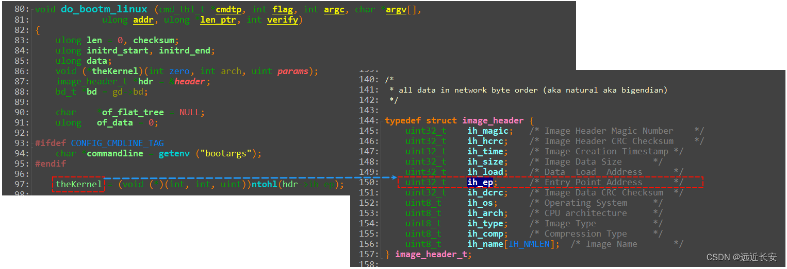
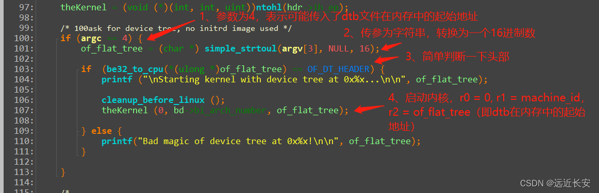
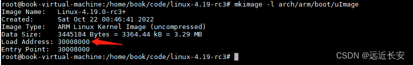

# uboot对设备树的支持

## 1 传递dtb给内核

在uboot中，**启动内核**的命令是**bootm**。

在有设备树和无设备树时，bootm命令的使用是不同的。

- bootm <uImage_addr>                                                                 //无设备树
- bootm <uImage_addr> <initrd_addr> <dtb_addr>       //有设备树

比如，**没有使用设备树时**，通过指令将内核**uImage**读到内存0x3000 7FC0后，就可以使用bootm命令启动内核。

```shell
nand read.jffs2 0x30007FC0 kernel
bootm 0x30007FC0
```

**使用设备树时**，则还需要将dtb读到**内存**，假设读到起始地址为0x3200 0000的内存区域，然后再使用bootm命令启动内核，启动内核的时候，还要将**dtb在内存中的起始地址**也当做参数写入。

```shell
nand read.jffs2 0x30007FC0 kernel
nand read.jffs2 0x32000000 device_tree
bootm 0x30007FC0 - 0x32000000
```

需要注意的是，此时中间的参数代表的是**<initrd_addr>**，**内存文件系统的地址**。

当没有使用内存文件系统时，可以将它简写为一个**减号(-)**。

uboot使用bootm命令启动，那么bootm命令要怎么把dtb_addr写入r2寄存器传给内核呢？

根据**ARM程序调用规则**（**ATPCS**），当一个函数被调用的时候，它的**第一个参数**使用**r0**寄存器来传递，**第二个参数**使用**r1**寄存器来传递，传参的数量超过一定值之后（一般来说，该值为**4**），才使用**栈**来传参。

实际上，是定义个一个函数指针**th_kernel**，指向**内核的入口地址**。

然后，执行 **th_kernel**(0, machine_id, 0x32000000); 即可（使用设备时，machine_id未使用到，可以随便设置）。

看一下代码，**bootm**命令最终会调用到**do_bootm_linux**函数(\u-boot-1.1.6\lib_arm\armlinux.c）。

在**do_bootm_linux**函数中，会定义一个函数指针**theKernel**，它指向**内核的入口地址**。



函数的简单分析如下，最终**通过theKernel调用函数启动内核**。



**dtb可以随便存放在内核的任意区域吗？**

**不可以**，需要遵循**两个原则**：

- 不要破坏uboot本身（dtb放到内存时，uboot还在运行，当然不能被破坏）；
- 不要和内核使用的内存空间重合（dtb是给内核使用的，当然也不能破坏内核）：
  - 内核本身的空间不能占用；
  - 内核要用到的内存区域也不能占用；（内核启动时一般会在它所处位置的下边放置页表, 这块空间(一般是0x4000即16K字节)不能被占用）

JZ2440内存使用情况：

```
                     ------------------------------
  0x33f80000       ->|    u-boot                  |
                     ------------------------------
                     |    u-boot所使用的内存(栈等)|
                     ------------------------------
                     |                            |
                     |                            |
                     |        空闲区域             |
                     |                            |
                     |                            |
                     |                            |
                     |                            |
                     ------------------------------
  0x30008000       ->|      zImage                |
                     ------------------------------  uImage = 64字节的头部+zImage
  0x30007FC0       ->|      uImage头部            |
                     ------------------------------
  0x30004000       ->|      内核创建的页表         |  head.S
                     ------------------------------
                     |                            |
                     |                            |
              -----> ------------------------------
              |
              |
              --- (内存基址 0x30000000)
```

其中，**内核的加载地址**可以通过**mkimage**工具来读取。



根据JZ2440内存使用情况，可以将**dtb**放到中间的**空闲区域**，或者0x30000000-0x30004000的空闲区域，只要不会影响到uboot和内核的运行即可。

另外，在内核启动之后，**dtb所在的内存区域会被保留**，不会有其他程序来使用这块内存区域，即不会有内存泄漏发生。

## 2 dtb的修改原理

### 2.1 在dtb文件中修改某个属性

先来回顾一下dtb文件中，**属性是怎么保存的**：

首先是表示**属性开始**的token **FDT_PROP**（0x00000003）；然后是**描述该属性信息的extra data**（len+nameoff）；最后是**value**，也就是**属性值**，属性值的长度就是**len**。

```c
struct {
    uint32_t len;        //以字节为单位记录了属性值的长度（长度可能为0，表示一个空值）；
    uint32_t nameoff;    //表示属性名在string block中的偏移位置；
};
```

| 0x00000003 | FDT_PROP                      |
| ---------- | ----------------------------- |
| len        | 属性的长度。                  |
| nameoff    | 属性名称在DTB文件中的偏移值。 |
| value      | 属性的内容，长度为len字节     |

那么，**如何修改这个属性的值呢**？

假设，**旧值长度**为**len**，**新值长度**为**new_len**，且**new_len > len**。

那么，需要把原来的val所占的空间**扩展**一下，扩展为**new_len**；并且，在原来的val后面的数据，都需要往后移动一下，移动的长度为**（new_len - len）**；移动之后，就可以把新的val写入了。

同时，属性值的长度也要更新为**new_len**。

另外，**头部信息**也需要**同步修改**。

```c
struct fdt_header {
	fdt32_t magic;			 /* magic word FDT_MAGIC */
	fdt32_t totalsize;		 /* total size of DT block */
	fdt32_t off_dt_struct;		 /* offset to structure */
	fdt32_t off_dt_strings;		 /* offset to strings */
	fdt32_t off_mem_rsvmap;		 /* offset to memory reserve map */
	fdt32_t version;		 /* format version */
	fdt32_t last_comp_version;	 /* last compatible version */
 
	/* version 2 fields below */
	fdt32_t boot_cpuid_phys;	 /* Which physical CPU id we're
					    booting on */
	/* version 3 fields below */
	fdt32_t size_dt_strings;	 /* size of the strings block */
	/* version 17 fields below */
	fdt32_t size_dt_struct;		 /* size of the structure block */
};
```

| 成员              | 是否更改 | 描述                                        |
| ----------------- | -------- | ------------------------------------------- |
| magic             | 否       |                                             |
| totalsize         | 是       | 总大小增加了（new_len - len）字节；         |
| off_dt_struct     | 否       |                                             |
| off_dt_strings    | 是       | 偏移值增加了（new_len - len）字节；         |
| off_mem_rsvmap    | 否       |                                             |
| version           | 否       |                                             |
| last_comp_version | 否       |                                             |
| boot_cpuid_phys   | 否       |                                             |
| size_dt_strings   | 否       |                                             |
| size_dt_struct    | 是       | struct块的size增加了（new_len - len）字节； |

总结一下，修改属性的值，老值为len，新值为new_len，且new_len > len，需要以下几步：

- 把原属性val所占空间从len字节扩展为new_len字节：
- 把老值之后的所有内容向后移动(new_len - len)字节；
- 把新值写入val所占的newlen字节空间，更新属性值的长度信息；
- 修改dtb头部信息中structure block的长度: size_dt_struct；
- 修改dtb头部信息中string block的偏移值: off_dt_strings；
- 修改dtb头部信息中的总长度: totalsize；
- 在dtb文件中增加一个新的属性

### 2.2 在dtb文件中增加一个新的属性

了解了dtb文件中属性的修改原理之后，其实其他的操作也是类似的。

比如，在某个节点中增加一个新的属性。

- 如果在string block中没有这个属性的名字，就在string block尾部添加一个新字符串：属性的名字；并且修改dtb头部信息中string block的长度：size_dt_strings；修改dtb头部信息中的总长度: totalsize；
- 找到属性所在节点, 在节点尾部扩展一块空间, 内容及长度为(12+len)：
  TAG      // 4字节, 对应0x00000003
  len      // 4字节, 表示属性的val的长度
  nameoff  // 4字节, 表示属性名的offset
  val      // len字节, 用来存放val
- 修改dtb头部信息中structure block的长度: size_dt_struct；
- 修改dtb头部信息中string block的偏移值: off_dt_strings；
- 修改dtb头部信息中的总长度: totalsize；

### 2.3 代码分析

