# 中断系统中的设备树

## 1 Linux对中断处理的框架及其代码流程

当发生中断时，CPU会跳到一个**固定的地址**去执行代码，这个固定的地址就被称为**中断向量**。

以**ARM920T**为例，它的**中断向量**默认是地址24（**0x18**）的地方。那么，就可以在这里放一条**跳转指令**。

一系列的跳转指令用来处理各种异常，**中断**也是**一种异常**。

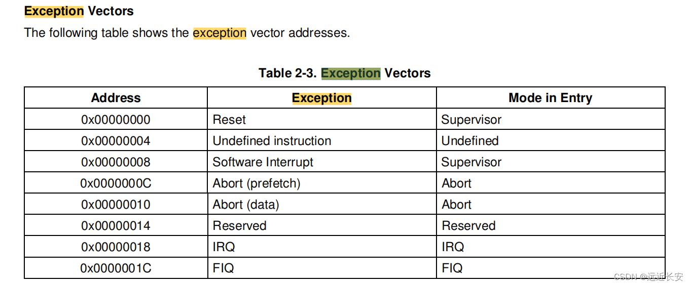

这些指令就被称为**vector**，**异常向量表**。

对于ARM9来说，vector可以放在0地址，也可以放在0xffff 0000地址（使能MMU，开启虚拟地址之后）。对于其他芯片，vector的存放地址可能不一样。但是不管怎么样，对于大部分的芯片来说，它的软件中都应该保存一个vector，用来处理各种异常。

在linux内核中，也有一个vector。打开**arch\arm\kernel\entry-armv.S**，可以找到一个**vectors**，里面存放的就是异常向量。

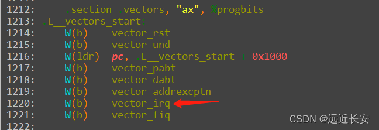

当发生中断时，应该执行这条指令，跳到 **vector_irq** 标号所示的段去执行代码。

搜索代码，是找不到 vector_irq 标号的，它是通过**vector_stub**宏来设置的。结合宏的定义，可以看出就是设置一个标号为**vector_irq**的段，省略号省略的是宏中描述的其他代码，这些代码暂不研究，它们应该会**调用后面的相关函数**。比如，当中断发生在**用户态**时，调用“.long   \_\_irq_usr”；当中断发生在**管理模式**下时，调用“.long   \_\_irq_svc”。

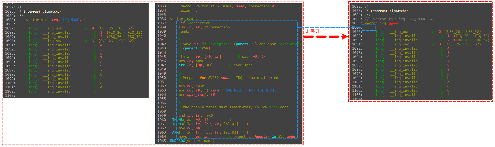

不管是**用户态**还是**管理模式**，最终，它们都会调用**同一个函数**。都是通过**irq_handler**来处理中断。

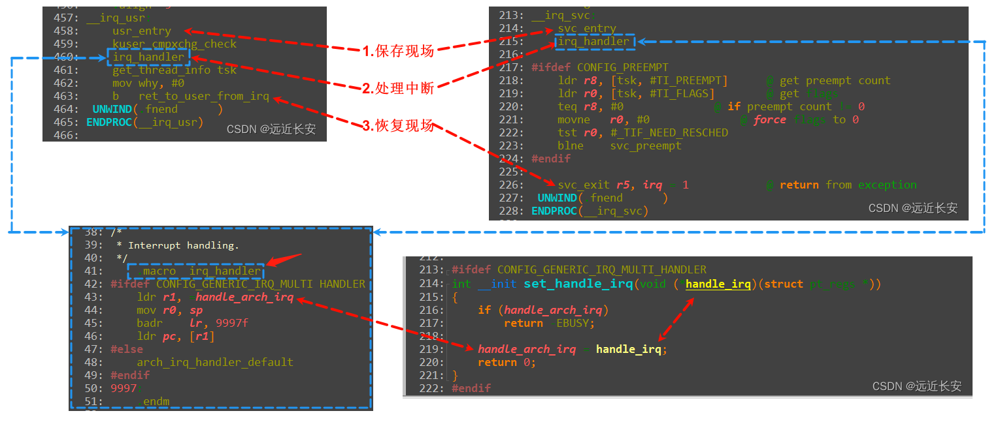

**irq_handler**是一个**宏**，**handle_arch_irq**是一个**函数指针，**最终会调用到**handle_arch_irq所指向的函数**，在这个函数中，应该**会读取中断控制器**，**判断是哪个中断发生了**，**然后调用对应的中断处理函数处理中断**。

既然**handle_arch_irq**是一个**函数指针**，那么是在哪里设置的呢？在 **kernel\irq\handle.c** 文件中发现对应的设置函数**set_handle_irq。**

**对于每款芯片，它们各自都会调用set_handle_irq函数，来设置它们自己的中断处理的入口函数。**

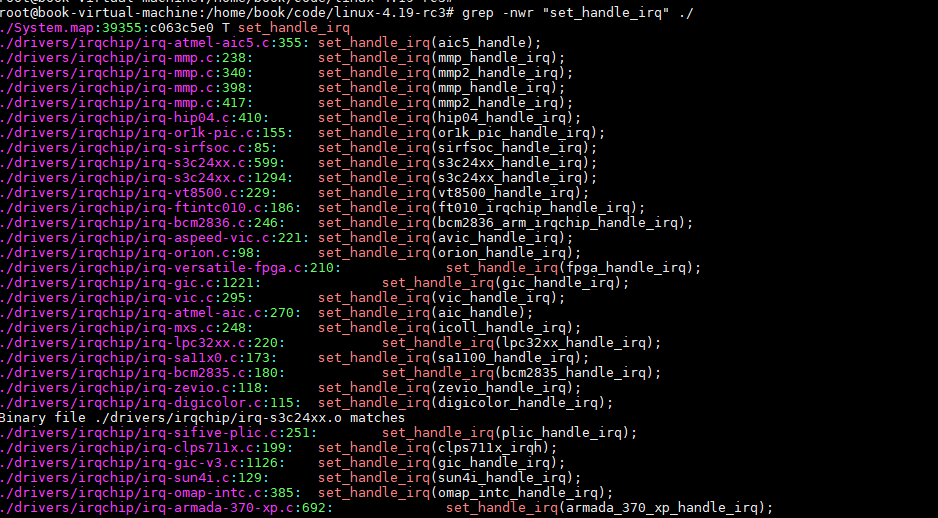

对应s3c2440芯片，则使用**s3c24xx_handle_irq**函数，作为自己的中断处理的入口函数。

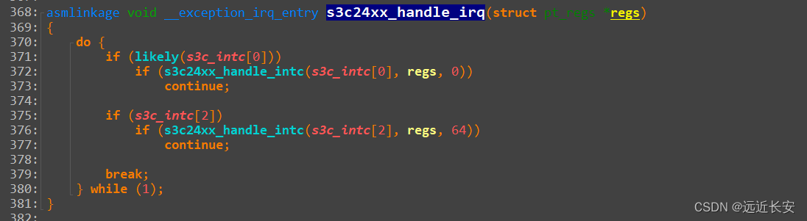

可以从这个函数开始分析，**内核对中断的处理框架**。

在分析代码之前，先说明一下。假设这是**CPU**和**中断控制器**。

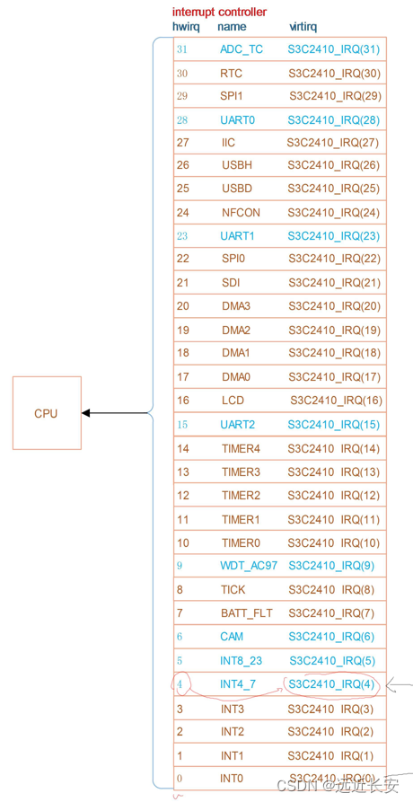

可以看到，这个中断控制器有**32**位，**每一位代表一种中断**，也就是说这个中断控制器可以向CPU发出**32**种中断，并且每一种中断的处理函数都不一样。

在Linux内核中，使用多个**struct irq_desc**成员组成的数组来管理中断控制器的中断和处理函数。

```c
struct irq_desc {
	struct irq_common_data	irq_common_data;
	struct irq_data		irq_data;
	unsigned int __percpu	*kstat_irqs;
	irq_flow_handler_t	handle_irq;
#ifdef CONFIG_IRQ_PREFLOW_FASTEOI
	irq_preflow_handler_t	preflow_handler;
#endif
	struct irqaction	*action;	/* IRQ action list */
	unsigned int		status_use_accessors;
	unsigned int		core_internal_state__do_not_mess_with_it;
	unsigned int		depth;		/* nested irq disables */
	unsigned int		wake_depth;	/* nested wake enables */
	unsigned int		irq_count;	/* For detecting broken IRQs */
	unsigned long		last_unhandled;	/* Aging timer for unhandled count */
	unsigned int		irqs_unhandled;
	atomic_t		threads_handled;
	int			threads_handled_last;
	raw_spinlock_t		lock;
	struct cpumask		*percpu_enabled;
	const struct cpumask	*percpu_affinity;
#ifdef CONFIG_SMP
	const struct cpumask	*affinity_hint;
	struct irq_affinity_notify *affinity_notify;
#ifdef CONFIG_GENERIC_PENDING_IRQ
	cpumask_var_t		pending_mask;
#endif
#endif
	unsigned long		threads_oneshot;
	atomic_t		threads_active;
	wait_queue_head_t       wait_for_threads;
#ifdef CONFIG_PM_SLEEP
	unsigned int		nr_actions;
	unsigned int		no_suspend_depth;
	unsigned int		cond_suspend_depth;
	unsigned int		force_resume_depth;
#endif
#ifdef CONFIG_PROC_FS
	struct proc_dir_entry	*dir;
#endif
#ifdef CONFIG_GENERIC_IRQ_DEBUGFS
	struct dentry		*debugfs_file;
	const char		*dev_name;
#endif
#ifdef CONFIG_SPARSE_IRQ
	struct rcu_head		rcu;
	struct kobject		kobj;
#endif
	struct mutex		request_mutex;
	int			parent_irq;
	struct module		*owner;
	const char		*name;
} ____cacheline_internodealigned_in_smp;
```

在内核中，有一个irq_desc数组，里面放的是irq_desc结构体。

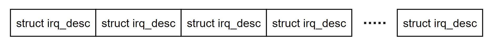

主要关注**irq_desc**结构体的**三个**成员：

- handle_irq：总的中断处理函数；
- action：是一个**链表**，指向一个或多个irqaction结构体。在**irqaction**结构体里面，有一个**handler**成员，它是一个**函数指针**，指向**我们提供的具体的中断处理函数**。
- irq_data：主要用于中断管理。这个结构体可以被看作是一个“中转站”，其中包含指向其他结构体的指针，如**irq_chip**和**irq_domain**。

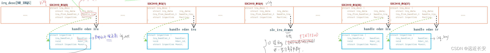

在**irq_desc**结构体中有一个函数指针**handle_irq**，在**irqaction**结构体中又有一个函数指针**handler**，它们都是处理中断的，为什么会有两个处理中断的函数呢？显然，他们的作用不会完全相同。

首先看一下**handle_irq**做什么事情：

- 调用**action**链表中的**handler**；
- 清中断；

这样做有一个好处，就是我们**只需要提供具体的中断处理函数，专注于我们自己要做的事情就可以了，而不需要我们自己去清中断**。

那么，**handle_irq**要怎么清中断呢？

清中断是**芯片相关**的操作，这就要用到**irq_data**了。

```c
struct irq_data {
	u32			mask;
	unsigned int		irq;
	unsigned long		hwirq;
	struct irq_common_data	*common;
	struct irq_chip		*chip;
	struct irq_domain	*domain;
#ifdef	CONFIG_IRQ_DOMAIN_HIERARCHY
	struct irq_data		*parent_data;
#endif
	void			*chip_data;
};
```

**irq_data**结构体中含有一个**chip**成员，它是一个指向**irq_chip**结构体的指针。

**irq_chip**结构体里面含有各种函数指针，每一个函数指针指向的函数都代表一个功能，比如**清中断**（irq_ack），关闭中断（irq_disable），使能中断（irq_enable）等等。

**irq_chip结构体**在include\linux\irq.h中定义，内有各个函数指针的详细说明。

```c
struct irq_chip {
	struct device	*parent_device;
	const char	*name;
	unsigned int	(*irq_startup)(struct irq_data *data);
	void		(*irq_shutdown)(struct irq_data *data);
	void		(*irq_enable)(struct irq_data *data);
	void		(*irq_disable)(struct irq_data *data);
 
	void		(*irq_ack)(struct irq_data *data);
	void		(*irq_mask)(struct irq_data *data);
	void		(*irq_mask_ack)(struct irq_data *data);
	void		(*irq_unmask)(struct irq_data *data);
	void		(*irq_eoi)(struct irq_data *data);
 
	int		(*irq_set_affinity)(struct irq_data *data, const struct cpumask *dest, bool force);
	int		(*irq_retrigger)(struct irq_data *data);
	int		(*irq_set_type)(struct irq_data *data, unsigned int flow_type);
	int		(*irq_set_wake)(struct irq_data *data, unsigned int on);
 
	void		(*irq_bus_lock)(struct irq_data *data);
	void		(*irq_bus_sync_unlock)(struct irq_data *data);
 
	void		(*irq_cpu_online)(struct irq_data *data);
	void		(*irq_cpu_offline)(struct irq_data *data);
 
	void		(*irq_suspend)(struct irq_data *data);
	void		(*irq_resume)(struct irq_data *data);
	void		(*irq_pm_shutdown)(struct irq_data *data);
 
	void		(*irq_calc_mask)(struct irq_data *data);
 
	void		(*irq_print_chip)(struct irq_data *data, struct seq_file *p);
	int		(*irq_request_resources)(struct irq_data *data);
	void		(*irq_release_resources)(struct irq_data *data);
 
	void		(*irq_compose_msi_msg)(struct irq_data *data, struct msi_msg *msg);
	void		(*irq_write_msi_msg)(struct irq_data *data, struct msi_msg *msg);
 
	int		(*irq_get_irqchip_state)(struct irq_data *data, enum irqchip_irq_state which, bool *state);
	int		(*irq_set_irqchip_state)(struct irq_data *data, enum irqchip_irq_state which, bool state);
 
	int		(*irq_set_vcpu_affinity)(struct irq_data *data, void *vcpu_info);
 
	void		(*ipi_send_single)(struct irq_data *data, unsigned int cpu);
	void		(*ipi_send_mask)(struct irq_data *data, const struct cpumask *dest);
 
	unsigned long	flags;
};
```

总结一下内核中如何处理中断：

- 当发生中断时，CPU跳到中断向量处执行。
- 保存现场。
- 处理中断程序。
  - 跳转到第一个处理中断的入口函数（对于s3c2440是**s3c24xx_handle_irq函数**）。
  - 在这个函数里面，CPU应该去读取中断寄存器，分辨发生的是哪个中断，获得**硬件中断号——hwirq**，然后通过**hwirq**可以在**irq_desc**数组中找到与之对应的那一项，这一项的下标叫做**虚拟中断号——virq**，hwirq和virq是不相同的，它们之间存在一定的**偏移值**。
  - 找到对应的数组项后，会调用这一数组项中的**handle_irq**，由**handle_irq**来调用对应的action成员中的**handler**函数，然后调用对应数组项中的**irq_data.chip.irq_ack**来清中断。
- 恢复现场。

### 共享中断

假设0号中断外接了网卡和摄像头，它们是一个**或**的关系，也就是不论是网卡还是摄像头发生了中断，最终都会触发0号中断。

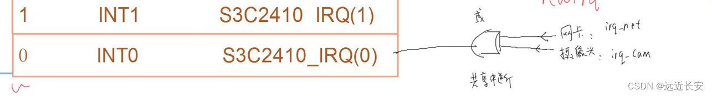

那么，**irq_desc**数组中对应项的**action链表**应该如下，第一项是**irq_net**，处理网卡的中断，下一项通过next相连，是**irq_cam**，用来处理摄像头的中断。

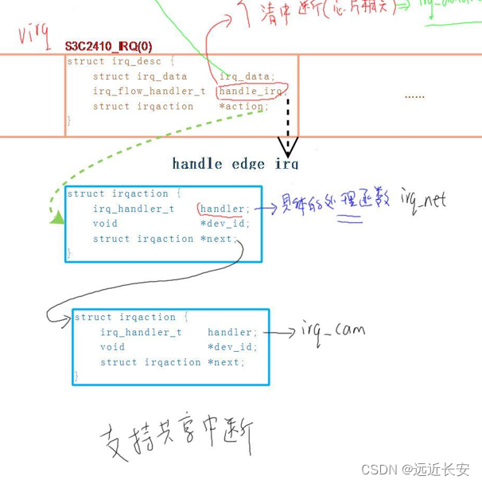

当检测到0号中断发生，**irq_net**和**irq_cam**的**handler**函数**都会被调用**，在**irq_net**的**handler**函数中判断是否是发生了网卡中断，不是的话立刻返回；同理，**irq_cam**的**handler**函数也是类似的操作。

这种action链表的形式支持**共享中断**，对于共享中断，里面的每一个处理函数都会被执行一次，因为我们没有办法在**handle_irq**里面判断是哪个硬件产生了中断，这个判断过程必须交给**硬件的中断处理函数来实现**。

以s3c2440的4号中断为例，4号中断外接了4个引脚EINT4,5,6,7，这4个引脚产生了中断，都会触发4号中断。

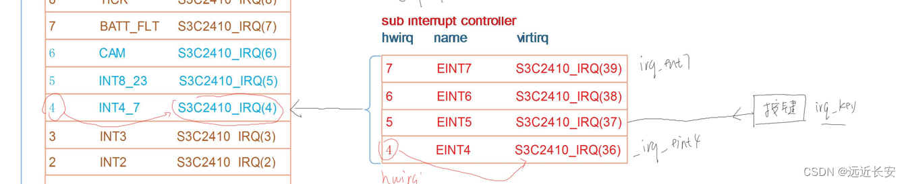

对于这种情况，当然也可以像**irq_net**和**irq_cam**那样处理，在4号中断对应的数组项中添加4个**irq_action**。

但是，有更好的方法。因为这种情况下，**有办法分辨发生的是哪个中断**（以2440为例，可以读取EINTPEND寄存器，判断发生了哪个中断），此时不需要将每个中断处理函数都调用一次。

此时就可以将handle_irq指向**s3c_irq_demux**函数，这是一个**分发函数**。

- 在分发函数中，首先会读取寄存器，进一步分析触发了哪个中断，得到对应的hwirq'；
- 根据hwirq'得到virq；
- 调用irq_desc[virq].handle_irq；

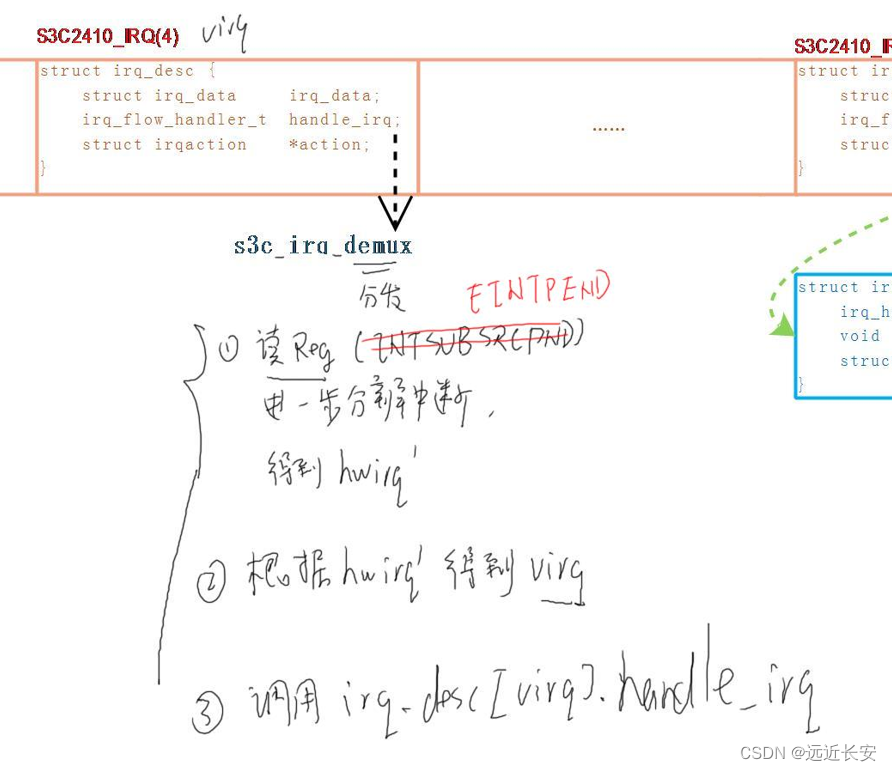

### 硬件中断号和虚拟中断号

假设有CPU，中断控制器INTC，还有下一级的中断控制器subINTC。

读INTC的到hwirq，读subINTC，得到hwirq'。

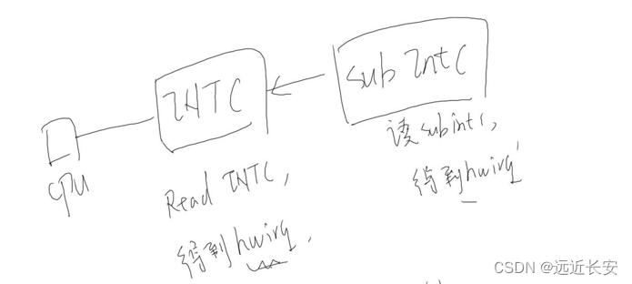

将硬件中断号，加上一个偏移值，就可以得到对应的虚拟中断号（**irq_desc数组对应项的下标**）。

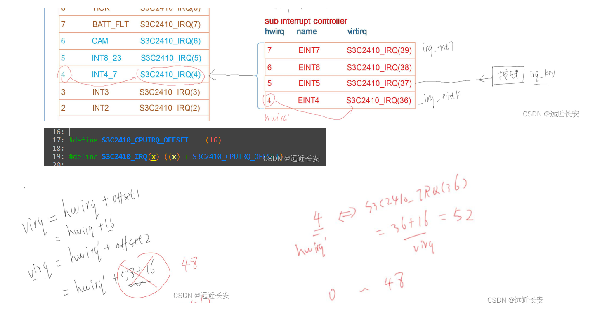

从2440处理中断的入口函数（**s3c24xx_handle_irq**）看起。

```c
s3c24xx_handle_irq
    s3c24xx_handle_intc
        pnd = readl_relaxed(intc->reg_intpnd);                  //读中断控制器，判断是哪个中断正在等待处理
        offset =  __ffs(pnd);                                   //获得hwirq
        handle_domain_irq
            __handle_domain_irq
                irq = irq_find_mapping(domain, hwirq);          //根据hwirq，获得virq
                generic_handle_irq
                    struct irq_desc *desc = irq_to_desc(irq);   //根据virq，获得中断描述数组的下标
                    generic_handle_irq_desc
                        desc->handle_irq(desc);                 //调用对应的中断处理函数
```

总结如下：

假设中断结构如下：

sub int controller ---> int controller ---> cpu

发生中断时,cpu跳到"**vector_irq**", 保存现场, 调用C函数**handle_arch_irq**。

**handle_arch_irq主要流程：**

- 读 int controller，得到hwirq
- 根据hwirq得到virq
- 调用 irq_desc[virq].handle_irq
  - 如果该中断没有子中断， irq_desc[virq].handle_irq的操作:
    - 取出irq_desc[virq].action链表中的每一个handler,，执行它
    - 使用irq_desc[virq].irq_data.chip的函数清中断
  - 如果该中断是由子中断产生， irq_desc[virq].handle_irq的操作:
    - 读 sub int controller，得到hwirq'
    - 根据hwirq'得到virq
    - 调用 irq_desc[virq].handle_irq

## 2 中断号的演变与irq_domain

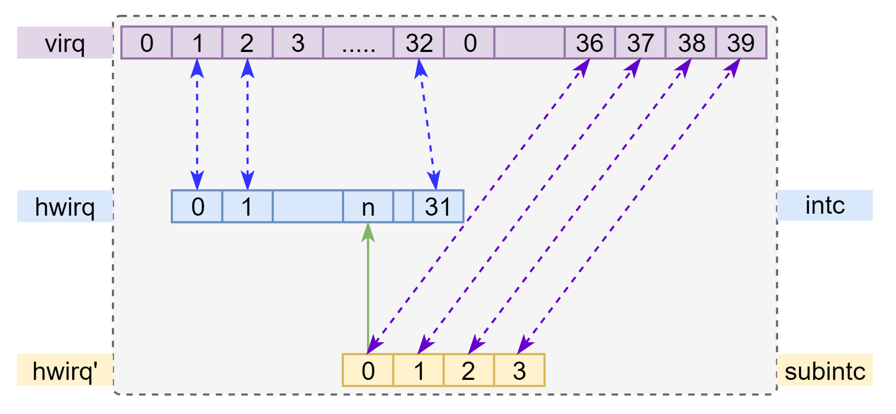

上图主要描述情况如下：

- 中断控制器intc，有32个中断，那么中断和irq_desc数组可以一一对应，每一个数组项对应一个中断。因为第0项一般不用，所以是从第1项开始，一一对应。此时虚拟中断号和硬件中断号的对应关系为：virq = hwirq + 1。
- 中断控制器subintc，它也会发出中断，并且subintc发出的中断会触发上一级的中断控制器的n号中断。也就是说，subintc的0,1,2,3号中断，都会触发上一级中断控制器的n号中断。

subintc的硬件中断号称为hwirq'，那么就可以得到hwirq'和virq的转换公式。virq = hwirq' + 36。

也就是说，**不论是intc还是sub_intc，都可以根据硬件中断号获得对应的虚拟中断号，并且这些中断号对应的数组项，并不重合**。

再增加一个外部中断控制器external intc，让系统更复杂一点。与sub_intc类似，external intc对应intc的m号中断，我们让external intc的0号中断对应数组项的第48项。那么，也可以得到一个硬件中断号和虚拟中断之间的转换公式：virq = hwirq'' + 48。

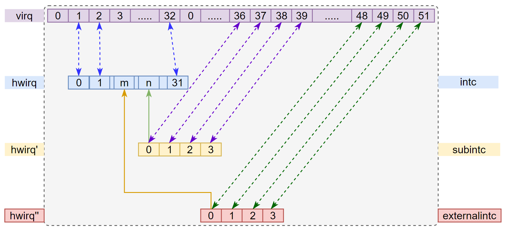
