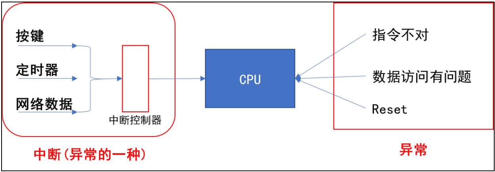

# 异常与中断的概念及处理流程

## 1 中断的引入

### 1.1 妈妈怎么知道孩子醒了


妈妈怎么知道卧室里小孩醒了？

| **方式**  | **行为**                                           | **特点**                                                     |
| --------- | -------------------------------------------------- | ------------------------------------------------------------ |
| 查询方式  | 时不时进房间看一下。                               | 简单，但是累。                                               |
| 休眠-唤醒 | 进去房间陪小孩一起睡觉，小孩醒了会吵醒她。         | 不累，但是妈妈干不了活了。                                   |
| poll方式  | 妈妈要干很多活，但是可以陪小孩睡一会，定个闹钟。   | 要浪费点时间，但是可以继续干活。妈妈要么是被小孩吵醒，要么是被闹钟吵醒。 |
| 异步通知  | 妈妈在客厅干活，小孩醒了他会自己走出房门告诉妈妈。 | 妈妈、小孩互不耽误。                                         |

后面的3 种方式，都需要“小孩来中断妈妈”：中断她的睡眠、中断她的工作。实际上，能“中断”妈妈的事情可多了：

- 发生了各种声音
- 可忽略的远处猫叫
- 快递员按门铃
- 卧室中小孩哭了

妈妈当前正在看书，被这些事件 “中断”后她会怎么做 流程如下：

- 先在书中放入书签，合上书
- 去处理 对于不同的情况，处理方法不同：
  -  对于门铃：开门取快递
  -  对于哭声：照顾小孩
-  回来继续看书

### 1.2 嵌入式系统



CPU 在运行的过程中，也会被各种“异常”打断。这些“异常”有：

- 指令未定义
- 指令、数据访问有问题
- SWI(软中断 ) 快中断
- 中断

中断也属于一种“异常”，导致中断发生的情况有很多，比如：

- 按键
- 定时器
- ADC 转换完成
- UART 发送完数据、收到数据
- 等等

这些众多的“中断源”，汇集到“中断控制器”，由“中断控制器”选择优先级最高的中断并通知 CPU 。

## 2 中断处理流程

arm对异常(中断)处理过程： 

- ①初始化
  - a) 设置中断源，让它可以产生中断
  - b) 设置中断控制器 (可以屏蔽某个中断，优先级 )
  - c) 设置 CPU总开关 (使能中断 ) 
- ②执行其他程序 正常程序
- ③产生中断 ：比如 按下按键 --->中断控制器 --->CPU
- ④CPU 每执行完一条指令都会检查有无中断 /异常产生
- ⑤CPU发现有中断 /异常产生，开始处理。

对于不同的异常，跳去不同的地址执行程序。这地址上，只是一条跳转指令，跳去执行某个函数地址 ))，这个就是异常向量。 ③④⑤都是硬件做的。

- ⑥这些函数做什么事情(软件做的)
  - a) 保存现场 (各种寄存器 )
  - b) 处理异常 (中断 ):分辨中断源 再调用不同的处理函数
  - c) 恢复现场

## 3 异常向量表

uboot 或是 L inux 内核，都有类似如下的代码：

```c
_start: b reset
    ldr pc, _undefined_instruction
    ldr pc, _software_interrupt
    ldr pc, _prefetch_abort
    ldr pc, _data _abort
    ldr pc, _not_used
    ldr pc, _irq // 发生中断时， CPU 跳到这个地址执行该指令 假设地址为 0x18**
    ldr pc, _fiq
```

这就是异常向量表，每一条指令对应一种异常。

发生复位时，CPU 就去 执行第 1 条指令： b reset 。

发生中断时，CPU 就去执行“ l dr pc, _irq ”这条指令。

这些指令存放的位置是固定的，比如对于ARM9 芯片中断向量的地址是 0x18 。

当发生中断时，CPU 就强制跳去执行 0x18 处的代码。

在向量表里，一般都是放置一条跳转指令，发生该异常时，CPU 就会执行向量表中的跳转指令，去调用更复杂的函数。

当然，向量表的位置并不总是从0 地址开始，很多芯片可以设置某个 vector base 寄存器，指定向量表在其他位置，比如设置 vector base 为 0x80000000，指定为 DDR 的某个地址。但是表中的各个异常向量的偏移地址，是固定的：复位向量偏移地址是 0 ，中断是 0x18 。
