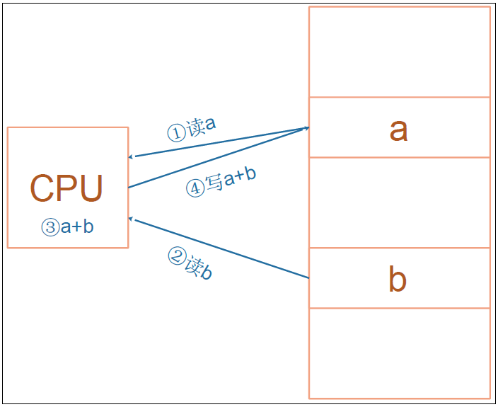
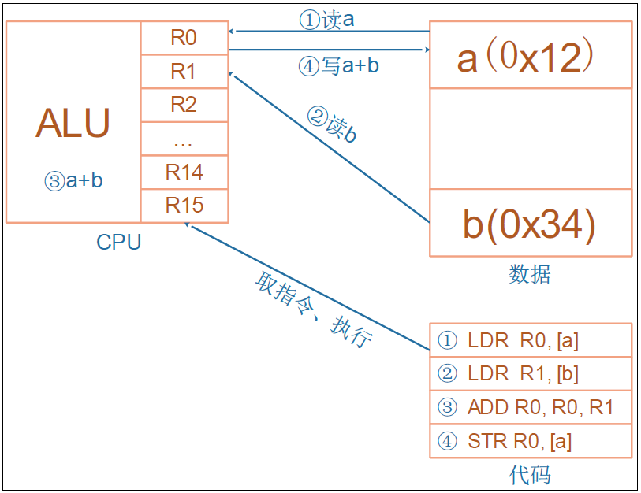
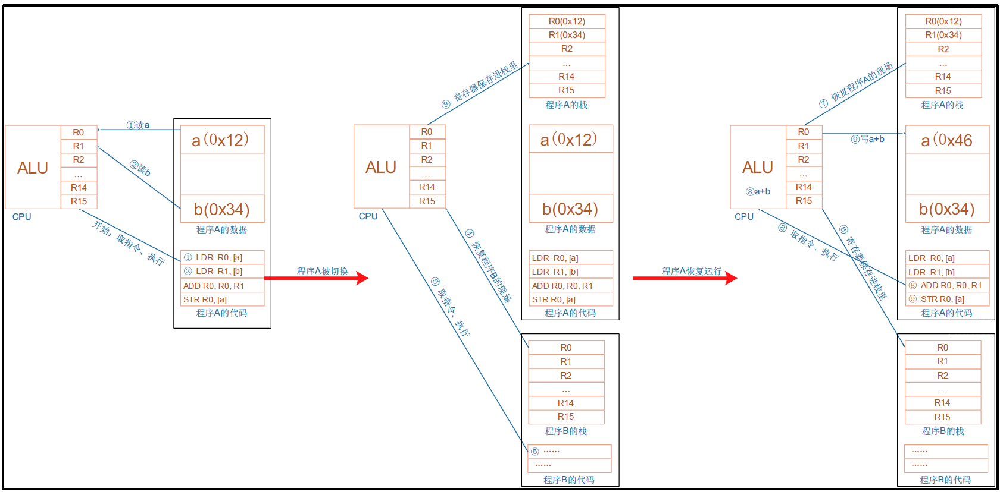
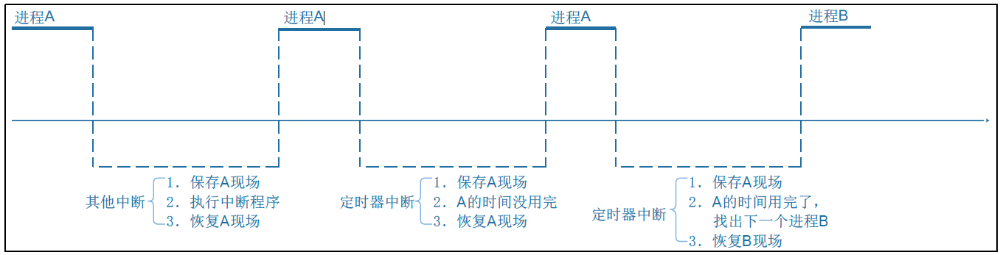

# Linux内核对中断的处理(未完成)

## 1 进程、线程、中断的核心：栈

中断中断，中断谁?

中断当前正在运行的进程、线程。

进程、线程是什么？内核如何切换进程、线程、中断？

要理解这些概念，必须理解栈的作用。

### 1.1 ARM 处理器程序运行的过程

ARM芯片属于精简指令集计算机（RISC：Reducedd Instruction SetComputing)，它所用的指令比较简单，有如下特点:

① 对内存只有读、写指令。

②对于数据的运算是在 CPU 内部实现。

③使用 RISC指令的CPU 复杂度小一点，易于设计。

比如对于 a=a+b 这样的算式，需要经过下面 4 个步骤才可以实现:

细看这几个步骤，有些疑问:

① 读a，那么 a的值读出来后保存在 CPU 里面哪里？

②读b，那么 b 的值读出来后保存在 CPU里面哪里？

③a+b 的结果又保存在哪里？

我们需要深入ARM处理器的内部。简单概括如下，我们先忽略各种CPU模式(系统模式、用户模式等等)。

CPU运行时，先去取得指令，再执行指令:

①把内存 a 的值读入 CPU 寄存器 R0

②把内存b 的值读入 CPU 寄存器 R1

③把R0、R1 累加，存入R0

④把 R0 的值写入内存 a

### 1.2 程序被中断时，怎么保存现场

从上图可知，CPU内部的寄存器很重要，如果要暂停一个程序，中断一个程序，就需要把这些寄存器的值保存下来：这就称为保存现场。

保存在哪里？内存，这块内存就称之为栈。

程序要继续执行，就先从栈中恢复那些CPU内部寄存器的值这个场景并不局限于中断，下图可以概括程序 A、B的切换过程，其他情况是类似的：

①函数调用：

a）在函数A里调用函数B，实际就是中断函数A 的执行。

b）那么需要把函数 A调用 B 之前瞬间的 CPU 寄存器的值，保存到栈里;

c）再去执行函数B;

d）函数B 返回之后，就从栈中恢复函数A对应的 CPU 寄存器值，继续执行。

②中断处理

a）进程A正在执行，这时候发生了中断。

b）CPU 强制跳到中断异常向量地址去执行,

c）这时就需要保存进程A 被中断瞬间的 CPU 寄存器值,

d）可以保存在进程A的内核态栈，也可以保存在进程A 的内核结构体中。

e）中断处理完毕，要继续运行进程A之前，恢复这些值。

③进程切换

a）在所谓的多任务操作系统中，我们以为多个程序是同时运行的。

b）如果我们能感知微秒、纳秒级的事件，可以发现操作系统时让这些程序依次执行一小段时间，进程A的时间用完了，就切换到进程B。

c）怎么切换?

d）切换过程是发生在内核态里的，跟中断的处理类似。

e）进程A 的被切换瞬间的 CPU 寄存器值保存在某个地方;

f）恢复进程B 之前保存的 CPU 寄存器值，这样就可以运行进程B了。

所以，在中断处理的过程中，伴存着进程的保存现场、恢复现场。进程的调度也是使用栈来保存、恢复现场:

### 1.3 进程和线程的概念
