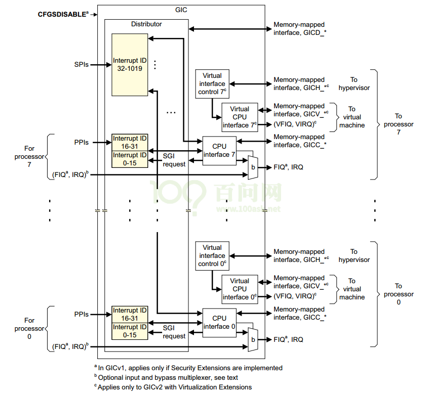
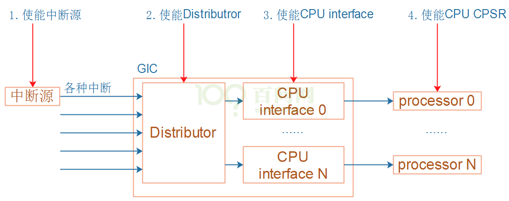
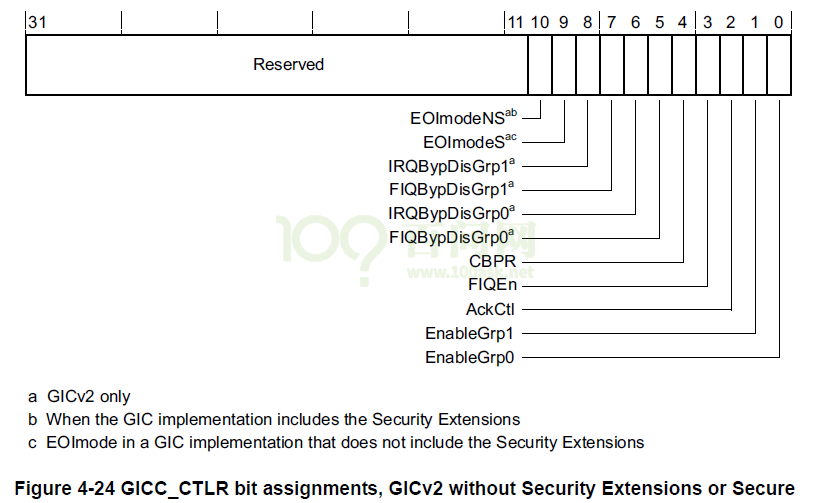

# GIC介绍与编程

参考资料：

**GIC的官方文档：GIT仓库**

```shell
doc_and_source_for_drivers\IMX6ULL\doc_pic\08_Interrupt:
doc_and_source_for_drivers\STM32MP157\doc_pic\08_Interrupt:

ARM® Generic Interrupt Controller Architecture Specification Architecture version 2.0(IHI0048B_b_gic_architecture_specification_v2).pdf
```

**源码：GIT仓库**

```shell
doc_and_source_for_drivers\IMX6ULL\source\08_Interrupt\02_gic
doc_and_source_for_drivers\STM32MP157\source\A7\08_Interrupt\02_gic
```

## 1 GIC介绍

ARM体系结构定义了通用中断控制器（GIC），该控制器包括一组用于管理单核或多核系统中的中断的硬件资源。GIC提供了内存映射寄存器，可用于管理中断源和行为，以及（在多核系统中）用于将中断路由到各个CPU核。它使软件能够屏蔽，启用和禁用来自各个中断源的中断，以（在硬件中）对各个中断源进行优先级排序和生成软件触发中断。它还提供对TrustZone安全性扩展的支持。GIC接受系统级别中断的产生，并可以发信号通知给它所连接的每个内核，从而有可能导致IRQ或FIQ异常发生。

**从软件角度来看，GIC具有两个主要功能模块，简单画图如下：**


① 分发器(Distributor)

系统中的所有中断源都连接到该单元。可以通过仲裁单元的寄存器来控制各个中断源的属性，例如优先级、状态、安全性、路由信息和使能状态。分发器把中断输出到“CPU接口单元”，后者决定将哪个中断转发给CPU核。

② CPU接口单元（CPU Interface）

CPU核通过控制器的CPU接口单元接收中断。CPU接口单元寄存器用于屏蔽，识别和控制转发到CPU核的中断的状态。系统中的每个CPU核心都有一个单独的CPU接口。

中断在软件中由一个称为中断ID的数字标识。中断ID唯一对应于一个中断源。软件可以使用中断ID来识别中断源并调用相应的处理程序来处理中断。呈现给软件的中断ID由系统设计确定，一般在SOC的数据手册有记录。

**中断可以有多种不同的类型：**

① 软件触发中断（SGI，Software Generated Interrupt）

这是由软件通过写入专用仲裁单元的寄存器即软件触发中断寄存器（ICDSGIR）显式生成的。它最常用于CPU核间通信。SGI既可以发给所有的核，也可以发送给系统中选定的一组核心。中断号0-15保留用于SGI的中断号。用于通信的确切中断号由软件决定。 

② 私有外设中断（PPI，Private Peripheral Interrupt）

这是由单个CPU核私有的外设生成的。PPI的中断号为16-31。它们标识CPU核私有的中断源，并且独立于另一个内核上的相同中断源，比如，每个核的计时器。

③ 共享外设中断（SPI，Shared Peripheral Interrupt）

这是由外设生成的，中断控制器可以将其路由到多个核。中断号为32-1020。SPI用于从整个系统可访问的各种外围设备发出中断信号。

中断可以是边沿触发的（在中断控制器检测到相关输入的上升沿时认为中断触发，并且一直保持到清除为止）或电平触发（仅在中断控制器的相关输入为高时触发）。

**中断可以处于多种不同状态：**

① 非活动状态（Inactive）–这意味着该中断未触发。

② 挂起（Pending）–这意味着中断源已被触发，但正在等待CPU核处理。待处理的中断要通过转发到CPU接口单元，然后再由CPU接口单元转发到内核。

③ 活动（Active）–描述了一个已被内核接收并正在处理的中断。

④ 活动和挂起（Active and pending）–描述了一种情况，其中CPU核正在为中断服务，而GIC又收到来自同一源的中断。

中断的优先级和可接收中断的核都在分发器(distributor)中配置。外设发给分发器的中断将标记为pending状态（或Active and Pending状态，如触发时果状态是active）。distributor确定可以传递给CPU核的优先级最高的pending中断，并将其转发给内核的CPU interface。通过CPU interface，该中断又向CPU核发出信号，此时CPU核将触发FIQ或IRQ异常。

作为响应，CPU核执行异常处理程序。异常处理程序必须从CPU interface寄存器查询中断ID，并开始为中断源提供服务。完成后，处理程序必须写入CPU interface寄存器以报告处理结束。然后CPU interface准备转发distributor发给它的下一个中断。

在处理中断时，中断的状态开始为pending，active，结束时变成inactive。中断状态保存在distributor寄存器中。

下图是GIC控制器的逻辑结构：



### 1.1.1 配置

GIC作为内存映射的外围设备，被软件访问。所有内核都可以访问公共的distributor单元，但是CPU interface是备份的，也就是说，每个CPU核都使用相同的地址来访问其专用CPU接口。一个CPU核不可能访问另一个CPU核的CPU接口。

**Distributor拥有许多寄存器，可以通过它们配置各个中断的属性。这些可配置属性是：**

- 中断优先级：Distributor使用它来确定接下来将哪个中断转发到CPU接口。
- 中断配置：这确定中断是对电平触发还是边沿触发。
- 中断目标：这确定了可以将中断发给哪些CPU核。
- 中断启用或禁用状态：只有Distributor中启用的那些中断变为挂起状态时，才有资格转发。
- 中断安全性：确定将中断分配给Secure还是Normal world软件。
- 中断状态。

Distributor还提供优先级屏蔽，可防止低于某个优先级的中断发送给CPU核。

每个CPU核上的CPU interface，专注于控制和处理发送给该CPU核的中断。

### 1.1.2 初始化

- Distributor和CPU interface在复位时均被禁用。复位后，必须初始化GIC，才能将中断传递给CPU核。
- 在Distributor中，软件必须配置优先级、目标核、安全性并启用单个中断；随后必须通过其控制寄存器使能。
- 对于每个CPU interface，软件必须对优先级和抢占设置进行编程。每个CPU接口模块本身必须通过其控制寄存器使能。
- 在CPU核可以处理中断之前，软件会通过在向量表中设置有效的中断向量并清除CPSR中的中断屏蔽位来让CPU核可以接收中断。
- 可以通过禁用Distributor单元来禁用系统中的整个中断机制；可以通过禁用单个CPU的CPU接口模块或者在CPSR中设置屏蔽位来禁止向单个CPU核的中断传递。也可以在Distributor中禁用（或启用）单个中断。
- 为了使某个中断可以触发CPU核，必须将各个中断，Distributor和CPU interface全部使能，并

将CPSR中断屏蔽位清零，如下图：



### 1.1.3 GIC中断处理

- 当CPU核接收到中断时，它会跳转到中断向量表执行。
- 顶层中断处理程序读取CPU接口模块的Interrupt Acknowledge Register，以获取中断ID。除了返回中断ID之外，读取操作还会使该中断在Distributor中标记为active状态。一旦知道了中断ID（标识中断源），顶层处理程序现在就可以分派特定于设备的处理程序来处理中断。
- 当特定于设备的处理程序完成执行时，顶级处理程序将相同的中断ID写入CPU interface模块中的End of Interrupt register中断结束寄存器，指示中断处理结束。除了把当前中断移除active状态之外，这将使最终中断状态变为inactive或pending（如果状态为inactive and pending），这将使CPU interface能够将更多待处理pending的中断转发给CPU核。这样就结束了单个中断的处理。
- 同一CPU核上可能有多个中断等待服务，但是CPU interface一次只能发出一个中断信号。顶层中断处理程序重复上述顺序，直到读取特殊的中断ID值1023，表明该内核不再有任何待处理的中断。这个特殊的中断ID被称为伪中断ID（spurious interrupt ID）。
- 伪中断ID是保留值，不能分配给系统中的任何设备。

## 2 GIC的寄存器

GIC分为两部分：Distributor和CPU interface，它们的寄存器都有相应的前缀：“GICD_”、“GICC_”。这些寄存器都是映射为内存接口(memery map)，CPU可以直接读写。

### 2.1 Distributor 寄存器描述

#### 1. **Distributor Control Register, GICD_CTLR**


| 位域 | 名         | 读写 | 描述                                                         |
| ---- | ---------- | ---- | ------------------------------------------------------------ |
| 1    | EnableGrp1 | R/W  | 用于将pending Group 1中断从Distributor转发到CPU interfaces  0：group 1中断不转发  1：根据优先级规则转发Group 1中断 |
| 0    | EnableGrp0 | R/W  | 用于将pending Group 0中断从Distributor转发到CPU interfaces  0：group 0中断不转发  1：根据优先级规则转发Group 0中断 |

#### 2. **Interrupt Controller Type Register, GICD_TYPER**

 

| 位域  | 名            | 读写 | 描述                                                         |
| ----- | ------------- | ---- | ------------------------------------------------------------ |
| 15:11 | LSPI          | R    | 如果GIC实现了安全扩展，则此字段的值是已实现的可锁定SPI的最大数量，范围为0（0b00000）到31（0b11111）。  如果此字段为0b00000，则GIC不会实现配置锁定。  如果GIC没有实现安全扩展，则保留该字段。 |
| 10    | SecurityExtn  | R    | 表示GIC是否实施安全扩展：  0未实施安全扩展；  1实施了安全扩展 |
| 7:5   | CPUNumber     | R    | 表示已实现的CPU  interfaces的数量。  已实现的CPU interfaces数量比该字段的值大1。  例如，如果此字段为0b011，则有四个CPU interfaces。 |
| 4:0   | ITLinesNumber | R    | 表示GIC支持的最大中断数。  如果ITLinesNumber = N，则最大中断数为32*(N+1)。  中断ID的范围是0到（ID的数量– 1）。  例如：0b00011最多128条中断线，中断ID 0-127。  中断的最大数量为1020（0b11111）。  无论此字段定义的中断ID的范围如何，都将中断ID  1020-1023保留用于特殊目的 |

#### 3. **Distributor Implementer Identification Register, GICD_IIDR**


| 位域  | 名          | 读写 | 描述                                                         |
| ----- | ----------- | ---- | ------------------------------------------------------------ |
| 31:24 | ProductID   | R    | 产品标识ID                                                   |
| 23:20 | 保留        |      |                                                              |
| 19:16 | Variant     | R    | 通常是产品的主要版本号                                       |
| 15:12 | Revision    | R    | 通常此字段用于区分产品的次版本号                             |
| 11:0  | Implementer | R    | 含有实现这个GIC的公司的JEP106代码；  [11:8]：JEP106 continuation code，对于ARM实现，此字段为0x4；  [7]：始终为0；  [6:0]：实现者的JEP106code，对于ARM实现，此字段为0x3B |

#### 4. **Interrupt Group Registers, GICD_IGROUPRn**

 

| 位域 | 名                 | 读写 | 描述                                                         |
| ---- | ------------------ | ---- | ------------------------------------------------------------ |
| 31:0 | Group  status bits | R/W  | 组状态位，对于每个位：  0：相应的中断为Group 0；  1：相应的中断为Group 1。 |

对于一个中断，如何设置它的Group ？首先找到对应的GICD_IGROUPRn寄存器，即n是多少？还要确定使用这个寄存器里哪一位。
对于interrtups ID m，如下计算：

```
n = m DIV 32，GICD_IGROUPRn里的n就确定了；
GICD_IGROUPRn在GIC内部的偏移地址是多少？0x080+(4*n)
使用GICD_IPRIORITYRn中哪一位来表示interrtups ID m？
bit = m mod 32。
```

#### 5. **Interrupt Set-Enable Registers, GICD_ISENABLERn**

 

| 位域 | 名               | 读写 | 描述                                                         |
| ---- | ---------------- | ---- | ------------------------------------------------------------ |
| 31:0 | Set-enable  bits | R/W  | 对于SPI和PPI类型的中断，每一位控制对应中断的转发行为：从Distributor转发到CPU interface：  读：  0：表示当前是禁止转发的；  1：表示当前是使能转发的；  写：  0：无效  1：使能转发 |

**对于一个中断，如何找到GICD_ISENABLERn并确定相应的位？**
```
对于interrtups ID m，如下计算：
n = m DIV 32，GICD_ISENABLERn里的n就确定了；
GICD_ISENABLERn在GIC内部的偏移地址是多少？0x100+(4*n)
使用GICD_ISENABLERn中哪一位来表示interrtups ID m？
bit = m mod 32。
```

#### 6. **Interrupt Clear-Enable Registers, GICD_ICENABLERn**

  

| 位域 | 名                 | 读写 | 描述                                                         |
| ---- | ------------------ | ---- | ------------------------------------------------------------ |
| 31:0 | Clear-enable  bits | R/W  | 对于SPI和PPI类型的中断，每一位控制对应中断的转发行为：从Distributor转发到CPU interface：  读：  0：表示当前是禁止转发的；  1：表示当前是使能转发的；  写：  0：无效  1：禁止转发 |

对于一个中断，如何找到GICD_ICENABLERn并确定相应的位？
```
对于interrtups ID m，如下计算：
n = m DIV 32，GICD_ICENABLERn里的n就确定了；
GICD_ICENABLERn在GIC内部的偏移地址是多少？0x180+(4*n)
使用GICD_ICENABLERn中哪一位来表示interrtups ID m？
bit = m mod 32。
```

#### 7. **Interrupt Set-Active Registers, GICD_ISACTIVERn**

 

| 位域 | 名               | 读写 | 描述                                                         |
| ---- | ---------------- | ---- | ------------------------------------------------------------ |
| 31:0 | Set-active  bits | R/W  | 读：  0：表示相应中断不是active状态；  1：表示相应中断是active状态；  写：  0：无效  1：把相应中断设置为active状态，如果中断已处于Active状态，则写入无效 |

对于一个中断，如何找到GICD_ISACTIVERn并确定相应的位？
```
对于interrtups ID m，如下计算：
n = m DIV 32，GICD_ISACTIVERn里的n就确定了；
GICD_ISACTIVERn在GIC内部的偏移地址是多少？0x300+(4*n)
使用GICD_ISACTIVERn 中哪一位来表示interrtups ID m？
bit = m mod 32。
```

#### 8. **Interrupt Clear-Active Registers, GICD_ICACTIVERn**

 


| 位域 | 名                 | 读写 | 描述                                                         |
| ---- | ------------------ | ---- | ------------------------------------------------------------ |
| 31:0 | Clear-active  bits | R/W  | 读：  0：表示相应中断不是active状态；  1：表示相应中断是active状态；  写：  0：无效  1：把相应中断设置为deactive状态，如果中断已处于dective状态，则写入无效 |

对于一个中断，如何找到GICD_ICACTIVERn并确定相应的位？
```
对于interrtups ID m，如下计算：
n = m DIV 32，GICD_ICACTIVERn里的n就确定了；
GICD_ICACTIVERn 在GIC内部的偏移地址是多少？0x380+(4*n)
使用GICD_ICACTIVERn中哪一位来表示interrtups ID m？
bit = m mod 32。
```

#### 9. **Interrupt Priority Registers, GICD_IPRIORITYRn**

  

| 位域  | 名                       | 读写 | 描述                                                         |
| ----- | ------------------------ | ---- | ------------------------------------------------------------ |
| 31:24 | Priority, byte  offset 3 | R/W  | 对于每一个中断，都有对应的8位数据用来描述：它的优先级。  每个优先级字段都对应一个优先级值，值越小，相应中断的优先级越高 |
| 23:16 | Priority,  byte offset 2 | R/W  |                                                              |
| 15:8  | Priority,  byte offset 1 | R/W  |                                                              |
| 7:0   | Priority,  byte offset 0 | R/W  |                                                              |
对于一个中断，如何设置它的优先级(Priority)，首先找到对应的GICD_IPRIORITYRn寄存器，即n是多少？还要确定使用这个寄存器里哪一个字节。

```
对于interrtups ID m，如下计算：
n = m DIV 4，GICD_IPRIORITYRn里的n就确定了；
GICD_IPRIORITYRn在GIC内部的偏移地址是多少？0x400+(4*n)
使用GICD_IPRIORITYRn中4个字节中的哪一个来表示interrtups ID m的优先级？
byte offset = m mod 4。
byte offset 0对应寄存器里的[7:0]；
byte offset 1对应寄存器里的[15:8]；
byte offset 2对应寄存器里的[23:16]；
byte offset 3对应寄存器里的[31:24]。
```

#### 10. **Interrupt Processor Targets Registers, GICD_ITARGETSRn**

 

| 位域  | 名                         | 读写 | 描述                                                         |
| ----- | -------------------------- | ---- | ------------------------------------------------------------ |
| 31:24 | CPU targets, byte offset 3 | R/W  | 对于每一个中断，都有对应的8位数据用来描述：这个中断可以发给哪些CPU。  处理器编号从0开始，8位数里每个位均指代相应的处理器。  例如，值0x3表示将中断发送到处理器0和1。  当读取GICD_ITARGETSR0～GICD_ITARGETSR7时，读取里面任意字节，返回的都是执行这个读操作的CPU的编号。 |
| 23:16 | CPU targets, byte offset 2 | R/W  |                                                              |
| 15:8  | CPU targets, byte offset 1 | R/W  |                                                              |
| 7:0   | CPU targets, byte offset 0 | R/W  |                                                              |
对于一个中断，如何设置它的目杯CPU？优先级(Priority)，首先找到对应的GICD_ITARGETSRn寄存器，即n是多少？还要确定使用这个寄存器里哪一个字节。

```
对于interrtups ID m，如下计算：
n = m DIV 4，GICD_ITARGETSRn里的n就确定了；
GICD_ITARGETSRn在GIC内部的偏移地址是多少？0x800+(4*n)
使用GICD_ITARGETSRn中4个字节中的哪一个来表示interrtups ID m的目标CPU？
byte offset = m mod 4。
byte offset 0对应寄存器里的[7:0]；
byte offset 1对应寄存器里的[15:8]；
byte offset 2对应寄存器里的[23:16]；
byte offset 3对应寄存器里的[31:24]。
```

#### 11. **Interrupt Configuration Registers, GICD_ICFGRn**

 

| 位域          | 名                    | 读写 | 描述                                                         |
| ------------- | --------------------- | ---- | ------------------------------------------------------------ |
| [2*F*+1:2*F*] | Int_config, field *F* | R/W  | 对于每一个中断，都有对应的2位数据用来描述：它的边沿触发，还是电平触发。  对于Int_config [1]，即高位[2F + 1]，含义为：  0：相应的中断是电平触发；  1：相应的中断是边沿触发。     对于Int_config [0]，即低位[2F]，是保留位。 |

对于一个中断，如何找到GICD_ICFGRn并确定相应的位域F？

```
对于interrtups ID m，如下计算：
n = m DIV 16，GICD_ICFGRn里的n就确定了；
GICD_ICACTIVERn 在GIC内部的偏移地址是多少？0xC00+(4*n)
F = m mod 16。
```

#### 12. **Identification registers: Peripheral ID2 Register, ICPIDR2**

 

| 位域   | 名      | 读写 | 描述                                                      |
| ------ | ------- | ---- | --------------------------------------------------------- |
| [31:0] | -       | R/W  | 由实现定义                                                |
| [7:4]  | ArchRev | R    | 该字段的值取决于GIC架构版本：  0x1：GICv1；  0x2：GICv2。 |
| [3:0]  | -       | R/W  | 由实现定义                                                |

### 2.2 CPU interface寄存器描述

#### 1. **CPU Interface Control Register, GICC_CTLR**

此寄存器用来控制CPU interface传给CPU的中断信号。对于不同版本的GIC，这个寄存器里各个位的含义大有不同。以GICv2为例，有如下2种格式：

 

 

以`GIC2 with Security Extensions, Non-secure copy` 为例，GICC_CTLR中各个位的定义如下：

| 位域    | 名            | 读写 | 描述                                                         |
| ------- | ------------- | ---- | ------------------------------------------------------------ |
| [31:10] | -             |      | 保留                                                         |
| [9]     | EOImodeNS     | R/W  | 控制对GICC_EOIR和GICC_DIR寄存器的非安全访问：  0：GICC_EOIR具有降低优先级和deactivate中断的功能；  对GICC_DIR的访问是未定义的。  1：GICC_EOIR仅具有降低优先级功能；  GICC_DIR寄存器具有deactivate中断功能。 |
| [8:7]   | -             |      | 保留                                                         |
| [6]     | IRQBypDisGrp1 | R/W  | 当CPU interface的IRQ信号被禁用时，该位控制是否向处理器发送bypass IRQ信号：  0：将bypass IRQ信号发送给处理器；  1：将bypass IRQ信号不发送到处理器。 |
| [5]     | FIQBypDisGrp1 | R/W  | 当CPU interface的FIQ信号被禁用时，该位控制是否向处理器发送bypass FIQ信号：  0：将bypass FIQ信号发送给处理器；  1：旁路FIQ信号不发送到处理器 |
| [4:1]   | -             |      | 保留                                                         |
| [0]     | -             | R/W  | 使能CPU interface向连接的处理器发出的组1中断的信号:  0：禁用中断信号  1：使能中断信号 |

#### 2. **Interrupt Priority Mask Register, GICC_PMR**

提供优先级过滤功能，优先级高于某值的中断，才会发送给CPU。

 

| 位域   | 名   | 读写 | 描述                                  |
| ------ | ---- | ---- | ------------------------------------- |
| [31:8] | -    |      | 保留                                  |
| [7:0]  | -    | R/W  | 优先级高于这个值的中断，才会发送给CPU |

`[7:0]`共8位，可以表示256个优先级。但是某些芯片里的GIC支持的优先级少于256个，则某些位为RAZ / WI，如下所示：

```
如果有128个级别，则寄存器中bit[0] = 0b0，即使用[7:1]来表示优先级；
如果有64个级别，则寄存器中bit[1:0] = 0b00，即使用[7:2]来表示优先级；
如果有32个级别，则寄存器中bit[2:0] = 0b000，即使用[7:3]来表示优先级；
如果有16个级别，则寄存器中bit[3:0] = 0b0000，即使用[7:4]来表示优先级；
```

注意：**imx6ull最多为32个级别**

#### 3. **Binary Point Register, GICC_BPR**

此寄存器用来把8位的优先级字段拆分为组优先级和子优先级，组优先级用来决定中断抢占。

 

| 位域   | 名            | 读写 | 描述                                                         |
| ------ | ------------- | ---- | ------------------------------------------------------------ |
| [31:3] | -             |      | 保留                                                         |
| [2:0]  | Binary  point | R/W  | 此字段的值控制如何将8bit中断优先级字段拆分为组优先级和子优先级，组优先级用来决定中断抢占。  更多信息还得看看GIC手册。 |

#### 4. **Interrupt Acknowledge Register, GICC_IAR**

CPU读此寄存器，获得当前中断的interrtup ID。

  

| 位域    | 名           | 读写 | 描述                                                         |
| ------- | ------------ | ---- | ------------------------------------------------------------ |
| [31:13] | -            |      | 保留                                                         |
| [12:10] | CPUID        | R    | 对于SGI类中断，它表示谁发出了中断。例如，值为3表示该请求是通过对CPU  interface 3上的GICD_SGIR的写操作生成的。 |
| [9:0]   | Interrupt ID | R    | 中断ID                                                       |

#### 5. **Interrupt Register, GICC_EOIR**

写此寄存器，表示某中断已经处理完毕。GICC_IAR的值表示当前在处理的中断，把GICC_IAR的值写入GICC_EOIR就表示中断处理完了。

 

| 位域    | 名       | 读写 | 描述                                           |
| ------- | -------- | ---- | ---------------------------------------------- |
| [31:13] | -        |      | 保留                                           |
| [12:10] | CPUID    | W    | 对于SGI类中断，它的值跟GICD_IAR. CPUID的相同。 |
| [9:0]   | EOIINTID | W    | 中断ID，它的值跟GICD_IAR里的中断ID相同         |

## 3 GIC编程

使用cortex A7处理器的芯片，一般都是使用GIC v2的中断控制器。
处理GIC的基地址不一样外，对GIC的操作都是一样的。
在NXP官网可以找到[IMX6ULL的SDK包](https://www.nxp.com.cn/products/processors-and-microcontrollers/arm-processors/i-mx-applications-processors/i-mx-6-processors/i-mx-6ull-single-core-processor-with-arm-cortex-a7-core:i.MX6ULL?tab=Design_Tools_Tab)。
下载后可以参考这个文件：core_ca7.h，里面含有GIC的初始化代码。

```

```