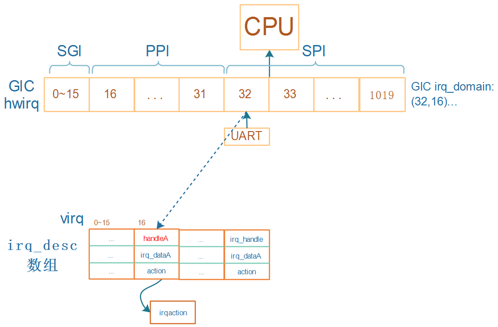

# GIC驱动程序对中断的处理流程

参考资料：

[linux kernel的中断子系统之（七）：GIC代码分析](http://www.wowotech.net/irq_subsystem/gic_driver.html)

使用逐步演进的方法才能形象地理解。

## 1 一级中断控制器处理流程

对于irq_desc，内核有两种分配方法：

- 一次分配完所有的irq_desc
- 按需分配(用到某个中断才分配它的irq_desc

现在的内核基本使用第1种方法。

- 假设GIC可以向CPU发出16\~1019号中断，这些数字被称为hwirq。0\~15用于Process之间通信，比较特殊。
- 假设要使用UART模块，它发出的中断连接到GIC的32号中断，分配的irq_desc序号为16
- 在GIC domain中会记录(32, 16)
- 那么注册中断时就是：`request_irq(16, ...)`
- 发生UART中断时
  - 程序从GIC中读取寄存器知道发生了32号中断，通过GIC irq_domain可以知道virq为16
  - 调用irq_desc[16]中的handleA函数，它的作用是调用action链表中用户注册的函数

## 2 多级中断控制器处理流程

- 假设GPIO模块下有4个引脚，都可以产生中断，都连接到GIC的33号中断
- GPIO也可以看作一个中断控制器，对于它的4个中断
- 对于GPIO模块中0~3这四个hwirq，一般都会一下子分配四个irq_desc
- 假设这4个irq_desc的序号为100~103，在GPIO domain中记录(0,100) (1,101)(2,102) (3,103)
- 对于KEY，注册中断时就是：`request_irq(102, ...)`
- 按下KEY时：
  - 程序从GIC中读取寄存器知道发生了33号中断，通过GIC irq_domain可以知道virq为16
  - 调用irq_desc[16]中的handleB函数
    - handleB读取GPIO寄存器，确定是GPIO里2号引脚发生中断
    - 通过GPIO irq_domain可以知道virq为102
    - 调用irq_desc[102]中的handleA函数，它的作用是调用action链表中用户注册的函数
