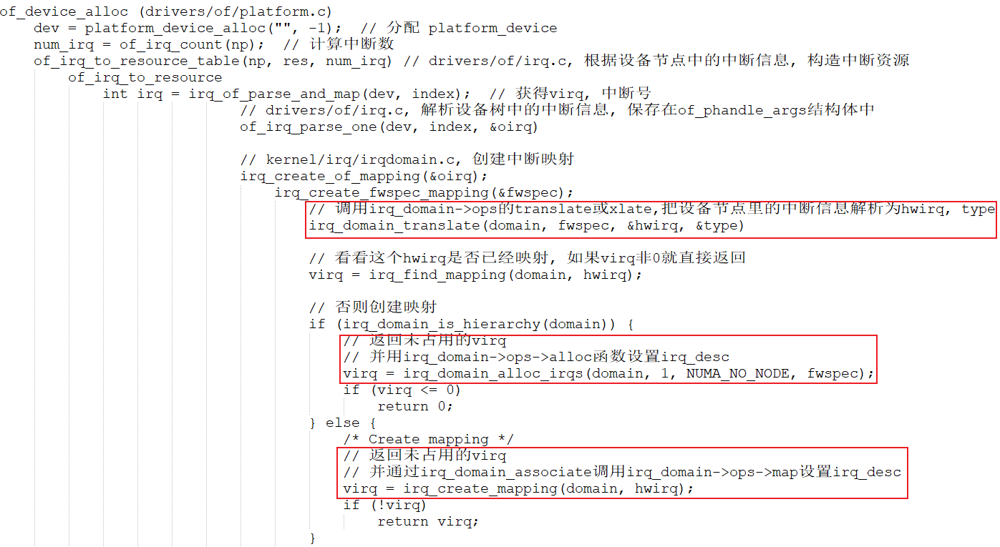

# GIC驱动程序分析

参考资料：

- [linux kernel的中断子系统之（七）：GIC代码分析](http://www.wowotech.net/irq_subsystem/gic_driver.html)

- Linux 4.9.88内核源码

  - `Linux-4.9.88\drivers\irqchip\irq-gic.c`
  - `Linux-4.9.88/arch/arm/boot/dts/imx6ull.dtsi`

- Linux 5.4内核源码
  
  - `Linux-5.4\drivers\irqchip\irq-gic.c`
  - `Linux-5.4/arch/arm/boot/dts/stm32mp151.dtsi`

## 1 GIC中的重要函数和结构体

**沿着中断的处理流程，GIC涉及这4个重要部分：**

- CPU从异常向量表中调用handle_arch_irq，这个函数指针是有GIC驱动设置的
  - GIC才知道怎么判断发生的是哪个GIC中断
- 从GIC获得hwirq后，要转换为virq：需要有GIC Domain
- 调用irq_desc[virq].handle_irq函数：这也应该由GIC驱动提供
- 处理中断时，要屏蔽中断、清除中断等：这些函数保存在irq_chip里，由GIC驱动提供

**从硬件上看，GIC的功能是什么？**

- 可以使能、屏蔽中断
- 发生中断时，可以从GIC里判断是哪个中断

**在内核里，使用gic_chip_data结构体表示GIC，gic_chip_data里有什么？**

- irq_chip：中断使能、屏蔽、清除，放在irq_chip中的各个函数里实现
  

- irq_domain
  - 申请中断时
    - 在设备树里指定hwirq、flag，可以使用irq_domain的函数来解析设备树
    - 根据hwirq可以分配virq，把(hwirq, virq)存入irq_domain中
  - 发生中断时，从GIC读出hwirq，可以通过irq_domain找到virq，从而找到处理函数

所以，GIC用gic_chip_data来表示，gic_chip_data中重要的成员是：irq_chip、irq_domain。

## 2 GIC初始化过程

```c
start_kernel (init\main.c)
    init_IRQ (arch\arm\kernel\irq.c)
    	irqchip_init (drivers\irqchip\irqchip.c)
    		of_irq_init (drivers\of\irq.c)
    			desc->irq_init_cb = match->data;

                ret = desc->irq_init_cb(desc->dev,
                            desc->interrupt_parent);

```

### 2.1 内核支持多种GIC

按照设备树的套路：

- 驱动程序注册platform_driver
- 它的of_match_table里有多个of_device_id，表示能支持多个设备
- 有多种版本的GIC，在内核为每一类GIC定义一个结构体of_device_id，并放在一个段里：

```c
// drivers\irqchip\irq-gic.c
IRQCHIP_DECLARE(gic_400, "arm,gic-400", gic_of_init);
IRQCHIP_DECLARE(arm11mp_gic, "arm,arm11mp-gic", gic_of_init);
IRQCHIP_DECLARE(arm1176jzf_dc_gic, "arm,arm1176jzf-devchip-gic", gic_of_init);
IRQCHIP_DECLARE(cortex_a15_gic, "arm,cortex-a15-gic", gic_of_init);
IRQCHIP_DECLARE(cortex_a9_gic, "arm,cortex-a9-gic", gic_of_init);
IRQCHIP_DECLARE(cortex_a7_gic, "arm,cortex-a7-gic", gic_of_init);
IRQCHIP_DECLARE(msm_8660_qgic, "qcom,msm-8660-qgic", gic_of_init);
IRQCHIP_DECLARE(msm_qgic2, "qcom,msm-qgic2", gic_of_init);
IRQCHIP_DECLARE(pl390, "arm,pl390", gic_of_init);
```

把宏`IRQCHIP_DECLARE`展开：

```c
// include\linux\irqchip.h
#define IRQCHIP_DECLARE(name, compat, fn) OF_DECLARE_2(irqchip, name, compat, fn)

#define OF_DECLARE_2(table, name, compat, fn) \
		_OF_DECLARE(table, name, compat, fn, of_init_fn_2)

#define _OF_DECLARE(table, name, compat, fn, fn_type)			\
	static const struct of_device_id __of_table_#name		\
		__used __section(__irqchip_of_table)			\
		 = { .compatible = compat,				\
		     .data = (fn == (fn_type)NULL) ? fn : fn  }
```

展开示例：

```c
IRQCHIP_DECLARE(cortex_a7_gic, "arm,cortex-a7-gic", gic_of_init);
展开后得到：
static const struct of_device_id __of_table_cortex_a7_gic		\
	__used __section(__irqchip_of_table)			\
	 = { .compatible = "arm,cortex-a7-gic",				\
		 .data = gic_of_init  }
```

### 2.2 在设备树里指定GIC

在设备树中指定GIC，内核驱动程序根据设备树来选择、初始化GIC。

`drivers\irqchip\irqchip.c`中并没有定义一个platform_driver，但是套路是一样的。


调用过程：


of_irq_init:

- 内核有一个\_\_irqchip_of_table数组，里面有多个of_device_id，表示多种GIC
- 要使用哪类GIC？在设备树里指定
- 根据设备树，找到\_\_irqchip_of_table树组中对应的项，调用它的初始化函数
  - `IRQCHIP_DECLARE(cortex_a7_gic, "arm,cortex-a7-gic", gic_of_init);` 

### 2.3 gic_of_init分析

看视频

## 3 申请GIC中断

### 3.1 在设备树里指定中断


### 3.2 内核对设备树的处理

函数调用过程如下，使用图片形式可以一目了然：



## 4 GIC中断处理流程源码分析

看视频。
