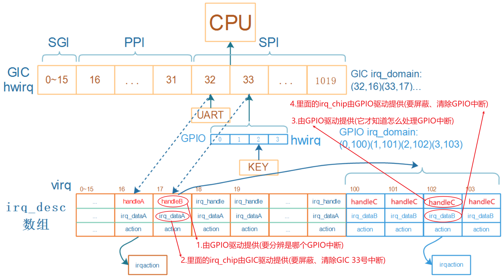

# 链式中断控制器驱动程序编写

参考资料：

- [linux kernel的中断子系统之（七）：GIC代码分析](http://www.wowotech.net/irq_subsystem/gic_driver.html)

- Linux 4.9.88内核源码

  - `Linux-4.9.88\drivers\gpio\gpio-mxc.c`
  - `Linux-4.9.88\arch\arm\boot\dts\imx6ull.dtsi`

- Linux 5.4内核源码
  
  - `Linux-5.4\drivers\pinctrl\stm32\pinctrl-stm32mp157.c`
  - `Linux-5.4\drivers\irqchip\irq-stm32-exti.c`
  - `Linux-5.4\arch\arm\boot\dts\stm32mp151.dtsi`
  
- 本节视频源码在GIT仓库里

```shell
doc_and_source_for_drivers\IMX6ULL\source\08_Interrupt\03_virtual_int_controller_legacy
doc_and_source_for_drivers\STM32MP157\source\A7\08_Interrupt\03_virtual_int_controller_legacy
```

## 1 链式中断控制器的重要函数和结构体

### 1.1 回顾处理流程

为方便描述，假设下级的链式中断控制器就是GPIO控制器。



沿着中断的处理流程，GIC之下的中断控制器涉及这4个重要部分：handleB、GPIO Domain、handleC、irq_chip

- **handleB**：处理GIC 33号中断，handleB由GPIO驱动提供

  - 屏蔽GIC 33号中断：调用irq_dataA的irq_chip的函数，irq_dataA由GIC驱动提供
  - 细分并处理某个GPIO中断：
    - 读取GPIO寄存器得到hwirq，通过**GPIO Domain**转换为virq，假设是102
    - 调用irq_desc[102].handle_irq，即handleC
  - 清除GIC 33号中断：调用irq_dataA的irq_chip的函数，由GIC驱动提供

- **handleC**：处理GPIO 2号中断，handleC由GPIO驱动提供

  - 屏蔽GPIO 2号中断：调用irq_dataB的**irq_chip**的函数，由GPIO驱动提供
  - 处理：调用actions链表中用户注册的函数
  - 清除GPIO 2号中断：调用irq_dataB的irq_chip的函数，由GPIO驱动提供

### 1.2 irq_domain的核心作用

怎么把handleB、GPIO Domain、handleC、irq_chip这4个结构体组织起来，irq_domain是核心。

我们从使用中断的流程来讲解。

- 在设备树里指定使用哪个中断

```shell
gpio_keys_100ask {
    compatible = "100ask,gpio_key";
    interrupt-parent = <&gpio5>;
    interrupts = <3 IRQ_TYPE_EDGE_BOTH>,
};
```

- 内核解析、处理设备树的中断信息

  - 根据`interrupt-parent`找到驱动程序注册的irq_domain
  - 使用irq_domain.ops中的translate或xlate函数解析设备树，得到hwirq和type 
  - 分配/找到irq_desc，得到virq
    - 把(hwirq, virq)的关系存入irq_domain
    - 把virq存入platform_device的resource中
  - 使用irq_domain.ops中的alloc或map函数进行设置
    - 可能是替换irq_desc[virq].handle_irq函数
    - 可能是替换irq_desc[virq].irq_data，里面有irq_chip
- 用户的驱动程序注册中断
  - 从platform_device的resource中得到中断号virq
  - request_irq(virq, ..., func)
- 发生中断、处理中断：处理流程见上面。

## 2 硬件模型

下图中列出了链式中断控制器、层级中断控制器，本节课程只涉及左边的链式中断控制器。

内核中有各类中断控制器的驱动程序，它们涉及的硬件过于复杂，从这些杂乱的代码中去讲清楚中断体系，比较难。

我们实现一些虚拟的中断控制器，如下图所示。

实际板子中，我们可以通过按键触发中断。

对于这些虚拟的中断控制器，我们没有真实按键，通过devmem指令写GIC的PENDING寄存器触发中断。


##  3 编程

会涉及2个驱动程序：虚拟的中断控制器驱动程序，按键驱动程序，以及对应的设备树。

### 3.1 设备树

```dtd
/{
   virtual_intc: virtual_intc_100ask {
        compatible = "100ask,virtual_intc";

        interrupt-controller;
        #interrupt-cells = <2>;

        interrupt-parent = <&intc>;
        //interrupts = <GIC_SPI 210 IRQ_TYPE_LEVEL_HIGH>;    // stm32mp157
        interrupts = <GIC_SPI 122 IRQ_TYPE_LEVEL_HIGH>;  // imx6ull

    };

    gpio_keys_100ask {
        compatible = "100ask,gpio_key";
        interrupt-parent = <&virtual_intc>;
        interrupts = <0 IRQ_TYPE_LEVEL_HIGH>,
                     <1 IRQ_TYPE_LEVEL_HIGH>,
                     <2 IRQ_TYPE_LEVEL_HIGH>,
                     <3 IRQ_TYPE_LEVEL_HIGH>;
    };
};
```

### 3.2 按键驱动程序

```c
#include <linux/module.h>
#include <linux/fs.h>
#include <linux/errno.h>
#include <linux/miscdevice.h>
#include <linux/kernel.h>
#include <linux/major.h>
#include <linux/mutex.h>
#include <linux/proc_fs.h>
#include <linux/seq_file.h>
#include <linux/stat.h>
#include <linux/init.h>
#include <linux/device.h>
#include <linux/tty.h>
#include <linux/kmod.h>
#include <linux/gfp.h>
#include <linux/gpio/consumer.h>
#include <linux/platform_device.h>
#include <linux/of_gpio.h>
#include <linux/of_irq.h>
#include <linux/interrupt.h>
#include <linux/irq.h>
#include <linux/slab.h>

struct gpio_key{
	char name[100];
	int irq;
	int cnt;
} ;

static struct gpio_key gpio_keys_100ask[100];

static irqreturn_t gpio_key_isr(int irq, void *dev_id)
{
	struct gpio_key *gpio_key = dev_id;
	

	printk("gpio_key_isr %s cnt %d\n", gpio_key->name, gpio_key->cnt++);
	
	return IRQ_HANDLED;
}

/* 1. 从platform_device获得GPIO
 * 2. gpio=>irq
 * 3. request_irq
 */
static int gpio_key_probe(struct platform_device *pdev)
{
	int err;
	int i = 0;
	int irq;
		
	printk("%s %s line %d\n", __FILE__, __FUNCTION__, __LINE__);


	while (1)
	{
		irq = platform_get_irq(pdev, i);
		if (irq <= 0)
			break;
		gpio_keys_100ask[i].irq = irq;
		sprintf(gpio_keys_100ask[i].name, "100as_virtual_key%d", i);
		
		err = devm_request_irq(&pdev->dev, gpio_keys_100ask[i].irq, gpio_key_isr, IRQF_TRIGGER_RISING | IRQF_TRIGGER_FALLING, gpio_keys_100ask[i].name, &gpio_keys_100ask[i]);
		printk("devm_request_irq %d for %s, err = %d\n", irq, gpio_keys_100ask[i].name, err);
		i++;
	}
        
    return 0;
    
}

static int gpio_key_remove(struct platform_device *pdev)
{
    return 0;
}


static const struct of_device_id ask100_keys[] = {
    { .compatible = "100ask,gpio_key" },
    { },
};

/* 1. 定义platform_driver */
static struct platform_driver gpio_keys_driver = {
    .probe      = gpio_key_probe,
    .remove     = gpio_key_remove,
    .driver     = {
        .name   = "100ask_gpio_key",
        .of_match_table = ask100_keys,
    },
};

/* 2. 在入口函数注册platform_driver */
static int __init gpio_key_init(void)
{
    int err;
    
	printk("%s %s line %d\n", __FILE__, __FUNCTION__, __LINE__);
	
    err = platform_driver_register(&gpio_keys_driver); 
	
	return err;
}

/* 3. 有入口函数就应该有出口函数：卸载驱动程序时，就会去调用这个出口函数
 *     卸载platform_driver
 */
static void __exit gpio_key_exit(void)
{
	printk("%s %s line %d\n", __FILE__, __FUNCTION__, __LINE__);

    platform_driver_unregister(&gpio_keys_driver);
}

/* 7. 其他完善：提供设备信息，自动创建设备节点                                     */

module_init(gpio_key_init);
module_exit(gpio_key_exit);

MODULE_LICENSE("GPL");
```

### 3.3 虚拟中断控制器程序

```c
#include <linux/kernel.h>
#include <linux/module.h>
#include <linux/clk.h>
#include <linux/err.h>
#include <linux/init.h>
#include <linux/interrupt.h>
#include <linux/io.h>
#include <linux/random.h>
#include <linux/irq.h>
#include <linux/irqdomain.h>
#include <linux/irqchip/chained_irq.h>
#include <linux/platform_device.h>
#include <linux/pm_runtime.h>
#include <linux/slab.h>
#include <linux/gpio/driver.h>
#include <linux/gpio.h>
#include <linux/of.h>
#include <linux/of_device.h>
#include <linux/bug.h>
#include <linux/random.h>

static struct irq_domain *virtual_intc_domain;

static int virtual_intc_get_hwirq(void)
{
	return get_random_int() & 0x3;
}

static void virtual_intc_irq_handler(struct irq_desc *desc)
{
	/* 它的功能时分辨是哪一个hwirq, 调用对应的irq_desc[].handle_irq */
	int hwirq;
	
	struct irq_chip *chip = irq_desc_get_chip(desc);

	chained_irq_enter(chip, desc);

	/* a. 分辨中断 */
	hwirq = virtual_intc_get_hwirq();

	/* b. 调用irq_desc[].handle_irq(handleC) */
	generic_handle_irq(irq_find_mapping(virtual_intc_domain, hwirq));

	chained_irq_exit(chip, desc);
}

static void virtual_intc_irq_ack(struct irq_data *data)
{
	printk("%s %s %d\n", __FILE__, __FUNCTION__, __LINE__);
}

static void virtual_intc_irq_mask(struct irq_data *data)
{
	printk("%s %s %d\n", __FILE__, __FUNCTION__, __LINE__);
}

static void virtual_intc_irq_mask_ack(struct irq_data *data)
{
	printk("%s %s %d\n", __FILE__, __FUNCTION__, __LINE__);
}

static void virtual_intc_irq_unmask(struct irq_data *data)
{
	printk("%s %s %d\n", __FILE__, __FUNCTION__, __LINE__);
}

static void virtual_intc_irq_eoi(struct irq_data *data)
{
	printk("%s %s %d\n", __FILE__, __FUNCTION__, __LINE__);
}

static struct irq_chip virtual_intc_irq_chip = {
	.name			= "100ask_virtual_intc",
	.irq_ack	   = virtual_intc_irq_ack	   ,
	.irq_mask	   = virtual_intc_irq_mask	   ,
	.irq_mask_ack  = virtual_intc_irq_mask_ack ,
	.irq_unmask    = virtual_intc_irq_unmask   ,
	.irq_eoi	   = virtual_intc_irq_eoi	   ,
};

static int virtual_intc_irq_map(struct irq_domain *h, unsigned int virq,
			  irq_hw_number_t hw)
{
	/* 1. 给virq提供处理函数
	 * 2. 提供irq_chip用来mask/unmask中断
	 */
	
	irq_set_chip_data(virq, h->host_data);
	//irq_set_chip_and_handler(virq, &virtual_intc_irq_chip, handle_edge_irq); /* handle_edge_irq就是handleC */
	irq_set_chip_and_handler(virq, &virtual_intc_irq_chip, handle_level_irq); /* handle_level_irq就是handleC */
	//irq_set_nested_thread(virq, 1);
	//irq_set_noprobe(virq);

	return 0;
}

static const struct irq_domain_ops virtual_intc_domain_ops = {
	.xlate = irq_domain_xlate_onetwocell,
	.map   = virtual_intc_irq_map,
};

static int virtual_intc_probe(struct platform_device *pdev)
{	
	struct device_node *np = pdev->dev.of_node;
	int irq_to_parent;
	int irq_base;
	
	/* 1. virutal intc 会向GIC发出n号中断 */
	/* 1.1 从设备树里获得virq_n */
	irq_to_parent = platform_get_irq(pdev, 0);
	printk("virtual_intc_probe irq_to_parent = %d\n", irq_to_parent);
	
	/* 1.2 设置它的irq_desc[].handle_irq, 它的功能时分辨是哪一个hwirq, 调用对应的irq_desc[].handle_irq */
	irq_set_chained_handler_and_data(irq_to_parent, virtual_intc_irq_handler, NULL);

	
	/* 2. 分配/设置/注册一个irq_domain */
	irq_base = irq_alloc_descs(-1, 0, 4, numa_node_id());
	printk("virtual_intc_probe irq_base = %d\n", irq_base);

	virtual_intc_domain = irq_domain_add_legacy(np, 4, irq_base, 0,
					     &virtual_intc_domain_ops, NULL);
	
	return 0;
}

static int virtual_intc_remove(struct platform_device *pdev)
{
	return 0;
}

static const struct of_device_id virtual_intc_of_match[] = {
	{ .compatible = "100ask,virtual_intc", },
	{ },
};

static struct platform_driver virtual_intc_driver = {
	.probe		= virtual_intc_probe,
	.remove		= virtual_intc_remove,
	.driver		= {
		.name	= "100ask_virtual_intc",
		.of_match_table = of_match_ptr(virtual_intc_of_match),
	}
};

/* 1. 入口函数 */
static int __init virtual_intc_init(void)
{	
	printk("%s %s %d\n", __FILE__, __FUNCTION__, __LINE__);
	/* 1.1 注册一个platform_driver */
	return platform_driver_register(&virtual_intc_driver);
}

/* 2. 出口函数 */
static void __exit virtual_intc_exit(void)
{
	printk("%s %s %d\n", __FILE__, __FUNCTION__, __LINE__);
	/* 2.1 反注册platform_driver */
	platform_driver_unregister(&virtual_intc_driver);
}

module_init(virtual_intc_init);
module_exit(virtual_intc_exit);

MODULE_LICENSE("GPL");
```
