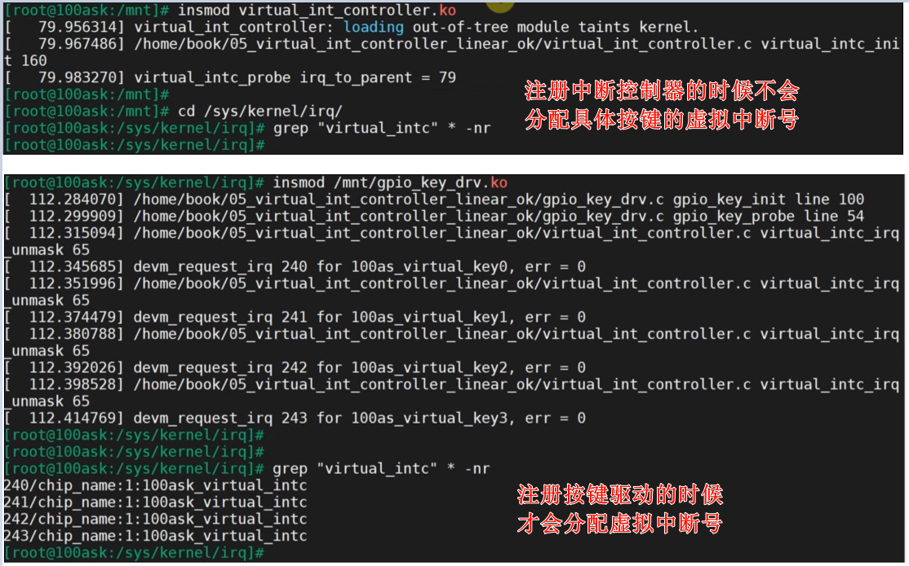

#  链式中断控制器驱动程序编写_linear方式

参考资料：

- [linux kernel的中断子系统之（七）：GIC代码分析](http://www.wowotech.net/irq_subsystem/gic_driver.html)

- Linux 4.9.88内核源码

  - `Linux-4.9.88\drivers\gpio\gpio-mxc.c`
  - `Linux-4.9.88\arch\arm\boot\dts\imx6ull.dtsi`

- Linux 5.4内核源码
  
  - `Linux-5.4\drivers\pinctrl\stm32\pinctrl-stm32mp157.c`
  - `Linux-5.4\drivers\irqchip\irq-stm32-exti.c`
  - `Linux-5.4\arch\arm\boot\dts\stm32mp151.dtsi`
  
- 本节视频源码在GIT仓库里

```shell
doc_and_source_for_drivers\
    IMX6ULL\source\08_Interrupt\
        05_virtual_int_controller_linear_ok

doc_and_source_for_drivers\
    STM32MP157\source\A7\08_Interrupt\
        05_virtual_int_controller_linear_ok
```

## 1 两种方式的对比

linear、legacy方式，都是用来编写链式中断控制器驱动程序，它们的关系如下表所示。

|              | legacy                                        | linear                |
| ------------ | --------------------------------------------- | --------------------- |
| 函数         | irq_domain_add_legacy                         | irq_domain_add_linear |
| irq_desc     | 一次性分配完                                  | 用到再分配            |
| (hwirq,virq) | domain->linear_revmap[hwirq] = irq_data->irq; | 同左边                |

## 2 编程

```c
static int virtual_intc_probe(struct platform_device *pdev)
{	
	struct device_node *np = pdev->dev.of_node;
	int irq_to_parent;
	//int irq_base;
	
	/- 1. virutal intc 会向GIC发出n号中断 */
	/- 1.1 从设备树里获得virq_n */
	irq_to_parent = platform_get_irq(pdev, 0);
	printk("virtual_intc_probe irq_to_parent = %d\n", irq_to_parent);
	
	/- 1.2 设置它的irq_desc[].handle_irq, 它的功能时分辨是哪一个hwirq, 调用对应的irq_desc[].handle_irq */
	irq_set_chained_handler_and_data(irq_to_parent, virtual_intc_irq_handler, NULL);

	
	/- 2. 分配/设置/注册一个irq_domain */
	//irq_base = irq_alloc_descs(-1, 0, 4, numa_node_id());
	//printk("virtual_intc_probe irq_base = %d\n", irq_base);

	/- Usage:
	 -  a. dts: 定义使用哪个hwirq
	 -  b. 内核解析设备树时分配irq_desc，得到virq
	 -  c. (hwirq, virq) ==>存入domain
	 */

	virtual_intc_domain = irq_domain_add_linear(np, 4, 
					     &virtual_intc_domain_ops, NULL);
	
	return 0;
}
```

## 3 上机实验


