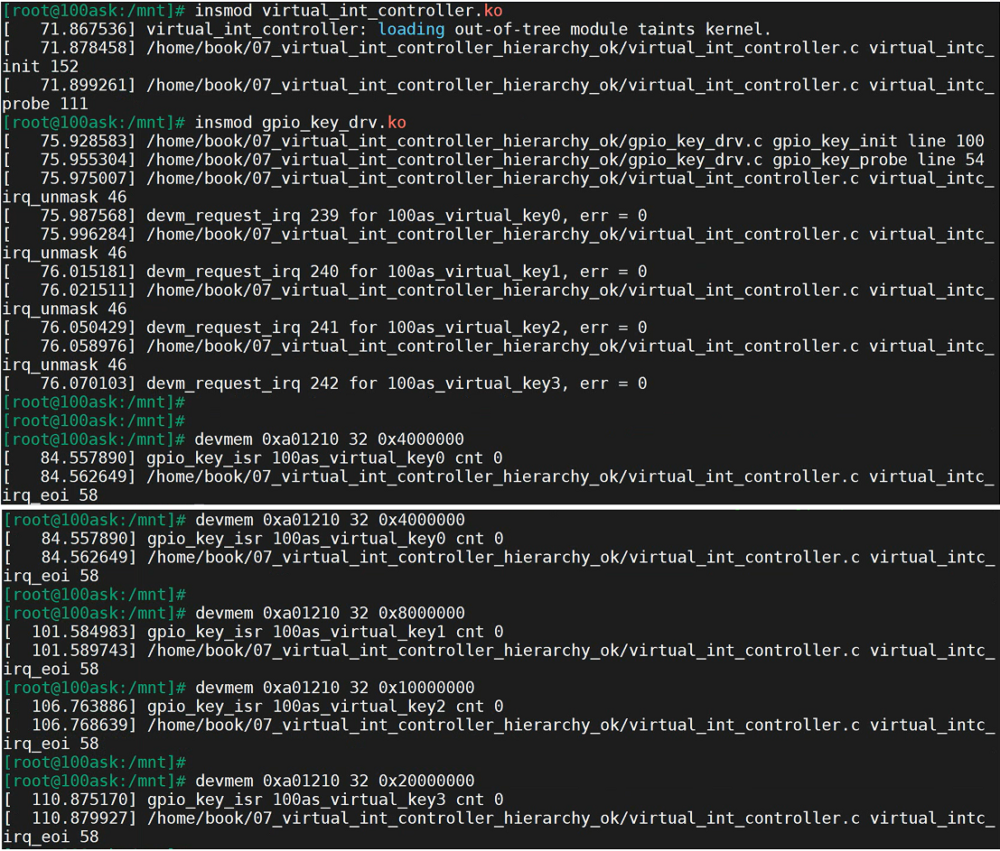

# 层级中断控制器驱动程序上机实验

参考资料：

- [linux kernel的中断子系统之（七）：GIC代码分析](http://www.wowotech.net/irq_subsystem/gic_driver.html)

- Linux 4.9.88内核源码

  - `Linux-4.9.88\drivers\gpio\gpio-mxc.c`
  - `Linux-4.9.88\arch\arm\boot\dts\imx6ull.dtsi`

- Linux 5.4内核源码
  
  - `Linux-5.4\drivers\pinctrl\stm32\pinctrl-stm32mp157.c`
  - `Linux-5.4\drivers\irqchip\irq-stm32-exti.c`
  - `Linux-5.4\arch\arm\boot\dts\stm32mp151.dtsi`
  
- 芯片手册

  - IMX6ULL: imx6ullrm.pdf
  - STM32MP157: DM00327659.pdf
  
- 本节视频源码在GIT仓库里

```shell
doc_and_source_for_drivers\
    IMX6ULL\source\08_Interrupt\
        07_virtual_int_controller_hierarchy_ok

doc_and_source_for_drivers\
    STM32MP157\source\A7\08_Interrupt\
        07_virtual_int_controller_hierarchy_ok
```

## 1 确定中断号n

参考[legacy方式代码的上机实验](/_docs/course/100ask/driver_summa/interrupt/16_legacy方式代码的上机实验.md)

## 2 怎么触发中断

参考[legacy方式代码的上机实验](/_docs/course/100ask/driver_summa/interrupt/16_legacy方式代码的上机实验.md)

| 芯片       | SPI中断号 | GIC中断号 | n,bit | GICD_ISPENDRn地址 | 命令                          |
| ---------- | --------- | --------- | ----- | ----------------- | ----------------------------- |
| IMX6LLL    | 122       | 154       | 4,26  | 0xa01210          | devmem 0xa01210 32 0x4000000  |
|            | 123       | 155       | 4,27  | 0xa01210          | devmem 0xa01210 32 0x8000000  |
|            | 124       | 156       | 4,28  | 0xa01210          | devmem 0xa01210 32 0x10000000 |
|            | 125       | 157       | 4,29  | 0xa01210          | devmem 0xa01210 32 0x20000000 |
| STM32MP157 | 210       | 242       | 7,18  | 0xa002121c        | devmem 0xa002121c 32 0x40000  |
|            | 211       | 243       | 7,19  | 0xa002121c        | devmem 0xa002121c 32 0x80000  |
|            | 212       | 244       | 7,20  | 0xa002121c        | devmem 0xa002121c 32 0x100000 |
|            | 213       | 245       | 7,21  | 0xa002121c        | devmem 0xa002121c 32 0x200000 |

## 3 观察内核打印的信息


