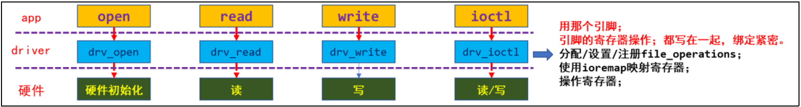
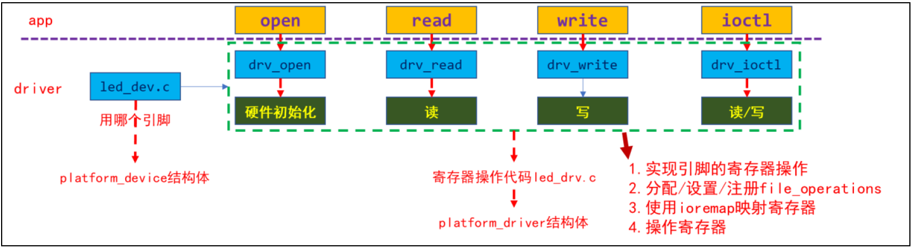
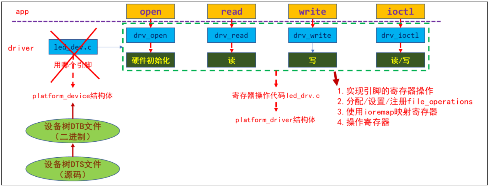
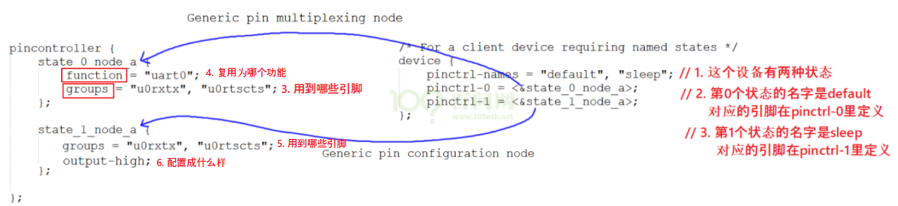
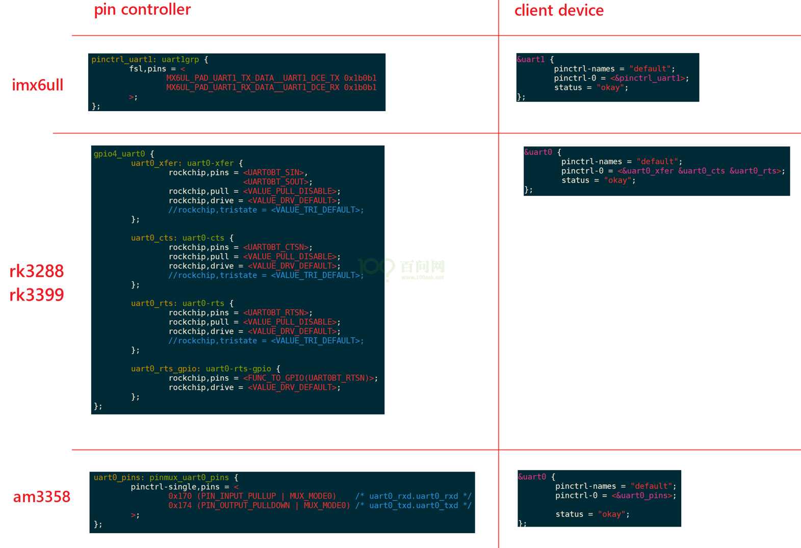
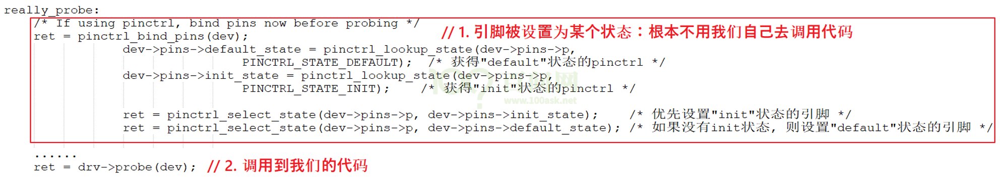

# 使用Pinctrl需要掌握的重要概念

## 1 驱动编写的三种方式

① 资源和驱动在同一个文件里



② 资源用 platform_device 指定 、驱动在 platform_driver 实现



③ 资源用设备树指定驱动在 platform_driver 实现



## 2 重要概念

从设备树开始学习Pintrl会比较容易。

主要参考文档是：内核Documentation\devicetree\bindings\pinctrl\pinctrl-bindings.txt

这会涉及2个对象：pin controller、client device。

- pin controller：提供服务：可以用它来复用引脚、配置引脚。
- client device：使用服务：声明自己要使用哪些引脚的哪些功能，怎么配置它们。

### pin controller：

在芯片手册里你找不到pin controller，它是一个软件上的概念，你可以认为它对应IOMUX(用来复用引脚)，还可以配置引脚(比如上下拉电阻等)。

> [!NOTE]
>
> pin controller和GPIO Controller不是一回事，前者控制的引脚可用于GPIO功能、I2C功能；后者只是把引脚配置为输入、输出等简单的功能。即先用pin controller把引脚配置为GPIO，再用GPIO Controler把引脚配置为输入或输出。

### client device：

“客户设备”，谁的客户？Pinctrl系统的客户，那就是使用Pinctrl系统的设备，使用引脚的设备。它在设备树里会被定义为一个节点，在节点里声明要用哪些引脚。

下面这个图就可以把几个重要概念理清楚：



上图中，左边是pin controller节点，右边是client device节点：

### pin state：

对于一个“client device”来说，比如对于一个UART设备，它有多个“状态”：default、sleep等，那对应的引脚也有这些状态。

- 在默认状态下，UART设备是工作的，那么所用的引脚就要复用为UART功能。
- 在休眠状态下，为了省电，可以把这些引脚复用为GPIO功能；或者直接把它们配置输出高电平。

上图中，pinctrl-names里定义了2种状态：default、sleep。

- 第0种状态用到的引脚在pinctrl-0中定义，它是state_0_node_a，位于pincontroller节点中。 
- 第1种状态用到的引脚在pinctrl-1中定义，它是state_1_node_a，位于pincontroller节点中。 

当这个设备处于default状态时，pinctrl子系统会自动根据上述信息把所用引脚复用为uart0功能。

当这这个设备处于sleep状态时，pinctrl子系统会自动根据上述信息把所用引脚配置为高电平。

### groups和function：

一个设备会用到一个或多个引脚，这些引脚就可以归为一组(group)；

这些引脚可以复用为某个功能：function。

当然：一个设备可以用到多组引脚，比如A1、A2两组引脚，A1组复用为F1功能，A2组复用为F2功能。

### Generic pin multiplexing node和Generic pin configuration node

在上图左边的pin controller节点中，有子节点或孙节点，它们是给client device使用的。

可以用来描述复用信息：哪组(group)引脚复用为哪个功能(function)；

可以用来描述配置信息：哪组(group)引脚配置为哪个设置功能(setting)，比如上拉、下拉等。

> [!NOTE]
>
> pin controller节点的格式，没有统一的标准！！！！每家芯片都不一样。甚至上面的group、function关键字也不一定有，但是概念是有的。

## 3 示例



## 4 代码中如何引用

这是透明的，我们的驱动基本不用管。当设备切换状态时，对应的pinctrl就会被调用。比如在platform_device和platform_driver的枚举过程中，流程如下：



当系统休眠时，也会去设置该设备sleep状态对应的引脚，不需要我们自己去调用代码。非要自己调用，也有函数：

```c
devm_pinctrl_get_select_default(struct device *dev);        // 使用"default"状态的引脚
pinctrl_get_select(struct device *dev, const char *name);   // 根据name选择某种状态的引脚
pinctrl_put(struct pinctrl *p);                             // 不再使用, 退出时调用
```
