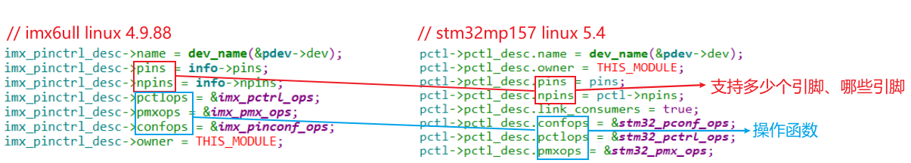
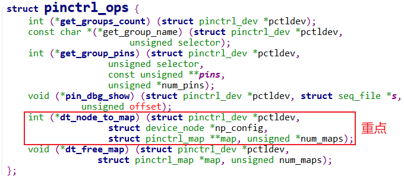

# Pinctrl子系统主要数据结构

参考资料：

- Linux 5.x内核
  - Documentation\devicetree\bindings\pinctrl\pinctrl-bindings.txt
  - arch/arm/boot/dts/stm32mp151.dtsi
  - arch/arm/boot/dts/stm32mp157-100ask-pinctrl.dtsi  
  - arch/arm/boot/dts/stm32mp15xx-100ask.dtsi
  - drivers\pinctrl\stm32\pinctrl-stm32mp157.c
  - drivers\pinctrl\stm32\pinctrl-stm32.c
- Linux 4.x内核文档
  - Documentation\pinctrl.txt
  - Documentation\devicetree\bindings\pinctrl\pinctrl-bindings.txt
  - arch/arm/boot/dts/imx6ull-14x14-evk.dts
  - arch/arm/boot/dts/100ask_imx6ull-14x14.dts
  - drivers\pinctrl\freescale\pinctrl-imx6ul.c
  - drivers\pinctrl\freescale\pinctrl-imx.c

## 1 设备树

### 1.1 理想模型


### 1.2 实际的例子

- IMX6ULL


- STM32MP157


## 2 pincontroller的数据结构

记住pinctrl的三大作用，有助于理解所涉及的数据结构：

- 引脚枚举与命名(Enumerating and naming)
- 引脚复用(Multiplexing)：比如用作GPIO、I2C或其他功能
- 引脚配置(Configuration)：比如上拉、下来、open drain、驱动强度等

### 2.1 pinctrl_desc和pinctrl_dev

#### 1. 结构体引入

pincontroller虽然是一个软件的概念，但是它背后是有硬件支持的，所以可以使用一个结构体来表示它：pinctrl_dev。

怎么构造出pinctrl_dev？我们只需要描述它：提供一个pinctrl_desc，然后调用pinctrl_register就可以：

```c
struct pinctrl_dev *pinctrl_register(struct pinctrl_desc *pctldesc,
				    struct device *dev, void *driver_data);
```

怎么使用pinctrl_desc、pinctrl_dev来描述一个pin controller？这两个结构体定义如下：


pinctrl_desc示例如下：


#### 2. 作用1：描述、获得引脚

使用结构体pinctrl_pin_desc来描述一个引脚，一个pin controller有多个引脚：


使用pinctrl_ops来操作引脚，主要功能有二：

- 来取出某组的引脚：get_groups_count、get_group_pins
- 处理设备树中pin controller中的某个节点：dt_node_to_map，把device_node转换为一系列的pinctrl_map



#### 3. 作用2：引脚复用


#### 4. 作用3：引脚配置


#### 5. 使用pinctrl_desc注册得到pinctrl_dev

调用devm_pinctrl_register或pinctrl_register，就可以根据pinctrl_desc构造出pinctrl_dev，并且把pinctrl_dev放入链表：

```c
devm_pinctrl_register
    pinctrl_register
    	struct pinctrl_dev *pctldev;
		pctldev = kzalloc(sizeof(*pctldev), GFP_KERNEL);

		pctldev->owner = pctldesc->owner;
		pctldev->desc = pctldesc;
		pctldev->driver_data = driver_data;

		/- check core ops for sanity */
		ret = pinctrl_check_ops(pctldev);

		/- If we're implementing pinmuxing, check the ops for sanity */
		ret = pinmux_check_ops(pctldev);

		/- If we're implementing pinconfig, check the ops for sanity */
		ret = pinconf_check_ops(pctldev);

		/- Register all the pins */
		ret = pinctrl_register_pins(pctldev, pctldesc->pins, pctldesc->npins);

		list_add_tail(&pctldev->node, &pinctrldev_list);
```

## 3 client的数据结构

在设备树中，使用pinctrl时格式如下：

```shell
/- For a client device requiring named states */
device {
    pinctrl-names = "active", "idle";
    pinctrl-0 = <&state_0_node_a>;
    pinctrl-1 = <&state_1_node_a &state_1_node_b>;
};
```

设备节点要么被转换为platform_device，或者其他结构体(比如i2c_client)，但是里面都会有一个device结构体，比如：


### 3.1 dev_pin_info

每个device结构体里都有一个dev_pin_info结构体，用来保存设备的pinctrl信息：


### 3.2 pinctrl

假设芯片上有多个pin controller，那么这个设备使用哪个pin controller？

这需要通过设备树来确定：

- 分析设备树，找到pin controller
- 对于每个状态，比如default、init，去分析pin controller中的设备树节点
  - 使用pin controller的pinctrl_ops.dt_node_to_map来处理设备树的pinctrl节点信息，得到一系列的pinctrl_map
  - 这些pinctrl_map放在pinctrl.dt_maps链表中
  - 每个pinctrl_map都被转换为pinctrl_setting，放在对应的pinctrl_state.settings链表中


### 3.3 pinctrl_map和pinctrl_setting

设备引用pin controller中的某个节点时，这个节点会被转换为一些列的pinctrl_map：

- 转换为多少个pinctrl_map，完全由具体的驱动决定
- 每个pinctrl_map，又被转换为一个pinctrl_setting
- 举例，设备节点里有：`pinctrl-0 = <&state_0_node_a>`
  - pinctrl-0对应一个状态，会得到一个pinctrl_state
  - state_0_node_a节点被解析为一系列的pinctrl_map
  - 这一系列的pinctrl_map被转换为一系列的pinctrl_setting
  - 这些pinctrl_setting被放入pinctrl_state的settings链表


## 4 使用pinctrl_setting

调用过程：

```c
really_probe
	pinctrl_bind_pins
		pinctrl_select_state
			/- Apply all the settings for the new state */
			list_for_each_entry(setting, &state->settings, node) {
				switch (setting->type) {
				case PIN_MAP_TYPE_MUX_GROUP:
					ret = pinmux_enable_setting(setting);
                       	ret = ops->set_mux(...);					// >>设置引脚复用
				break;
				case PIN_MAP_TYPE_CONFIGS_PIN:
				case PIN_MAP_TYPE_CONFIGS_GROUP:
					ret = pinconf_apply_setting(setting);			// >>设置引脚配置信息
                        switch (setting->type) {
						case PIN_MAP_TYPE_CONFIGS_PIN:
							ret = ops->pin_config_set(...);			// -->>单独配置某个引脚
                        break;
                        case PIN_MAP_TYPE_CONFIGS_GROUP:
							ret = ops->pin_config_group_set(...); 	// -->>配置某个组
                        break;
					break;
				default:
					ret = -EINVAL;
				break;
			}
```

## 5 补充资料


