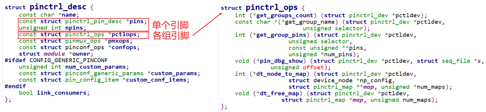

# 编写虚拟的Pinctrl驱动程序

参考资料：
* Linux 5.x内核
  * Documentation\devicetree\bindings\pinctrl\pinctrl-bindings.txt
  * arch/arm/boot/dts/stm32mp151.dtsi
  * arch/arm/boot/dts/stm32mp157-100ask-pinctrl.dtsi  
  * arch/arm/boot/dts/stm32mp15xx-100ask.dtsi
  * drivers\pinctrl\stm32\pinctrl-stm32mp157.c
  * drivers\pinctrl\stm32\pinctrl-stm32.c

* Linux 4.x内核
  * Documentation\pinctrl.txt
  * Documentation\devicetree\bindings\pinctrl\pinctrl-bindings.txt
  * arch/arm/boot/dts/imx6ull-14x14-evk.dts
  * arch/arm/boot/dts/100ask_imx6ull-14x14.dts
  * drivers\pinctrl\freescale\pinctrl-imx6ul.c
  * drivers\pinctrl\freescale\pinctrl-imx.c
  
* 本课对应的源码

  * GIT仓库中(未测试，下一课才测试)

    ```shell
    doc_and_source_for_drivers\IMX6ULL\source\06_Pinctrl\01_virtual_pinctrl
    doc_and_source_for_drivers\STM32MP157\source\A7\06_Pinctrl\01_virtual_pinctrl
    ```

## 1. 回顾Pinctrl的三大作用

记住pinctrl的三大作用，有助于理解所涉及的数据结构：

* 引脚枚举与命名(Enumerating and naming)
  * 单个引脚
  * 各组引脚
* 引脚复用(Multiplexing)：比如用作GPIO、I2C或其他功能
* 引脚配置(Configuration)：比如上拉、下拉、open drain、驱动强度等

Pinctrl驱动程序的核心是构造一个pinctrl_desc结构体：


### 1.1 作用1：描述、获得引脚

分为2部分：

* 描述、获得单个引脚的信息
* 描述、获得某组引脚的信息



### 1.2 作用2：引脚复用

用来把某组引脚(group)复用为某个功能(function)。


### 1.3 作用3：引脚配置

用来配置：某个引脚(pin)或某组引脚(group)。


## 2. 编写Pinctrl驱动程序要做什么


我们要做的事情：

* pin controller：
  * 创建设备树节点
  * 编写驱动程序
* 测试：
  * 创建client设备树节点
  * 编写驱动程序

## 3. 硬件功能

假设这个虚拟的pin controller有4个引脚：


* pin0,1,2,3都可以配置为GPIO功能
* pin0,1还可以配置为I2C功能
* pin2,3还可以配置为UART功能

## 4. 编写设备树文件

```shell
virtual_pincontroller {
	compatible = "100ask,virtual_pinctrl";
	i2cgrp: i2cgrp {
			functions = "i2c", "i2c";
			groups = "pin0", "pin1";
			configs = <0x11223344  0x55667788>;
	};
};

virtual_i2c {
	compatible = "100ask,virtual_i2c";
	pinctrl-names = "default";
	pinctrl-0 = <&i2cgrp>;
};
```

## 5. 编写Pinctrl驱动程序

### 5.1 核心：pinctrl_desc

* 分配pinctrl_desc结构体
* 设置pinctrl_desc结构体
* 注册pinctrl_desc结构体

### 5.2 辅助函数

```c
include/linux/of.h
    for_each_child_of_node
    of_get_child_count
    of_find_property
    of_property_read_u32
    of_property_read_u32_index
    of_property_read_string_index
```

代码：

```c

#include <linux/module.h>
#include <linux/err.h>
#include <linux/init.h>
#include <linux/io.h>
#include <linux/mfd/syscon.h>
#include <linux/of.h>
#include <linux/of_device.h>
#include <linux/of_address.h>
#include <linux/pinctrl/machine.h>
#include <linux/pinctrl/pinconf.h>
#include <linux/pinctrl/pinctrl.h>
#include <linux/pinctrl/pinmux.h>
#include <linux/slab.h>
#include <linux/regmap.h>

#include "core.h"


static struct pinctrl_dev *g_pinctrl_dev;

static const struct pinctrl_pin_desc pins[] = {
	{0, "pin0", NULL},
	{1, "pin1", NULL},
	{2, "pin2", NULL},
	{3, "pin3", NULL},
};

static unsigned long g_configs[4];

struct virtual_functions_desc {
	const char *func_name;
	const char **groups;
	int num_groups;
};


static const char *func0_grps[] = {"pin0", "pin1", "pin2", "pin3"};
static const char *func1_grps[] = {"pin0", "pin1"};
static const char *func2_grps[] = {"pin2", "pin3"};

static struct virtual_functions_desc g_funcs_des[] = {
	{"gpio", func0_grps, 4},
	{"i2c",  func1_grps, 2},
	{"uart", func2_grps, 2},
};


static const struct of_device_id virtual_pinctrl_of_match[] = {
	{ .compatible = "100ask,virtual_pinctrl", },
	{ },
};

static int virtual_get_groups_count(struct pinctrl_dev *pctldev)
{
	return pctldev->desc->npins;
}

static const char *virtual_get_group_name(struct pinctrl_dev *pctldev,
				       unsigned selector)
{
	return pctldev->desc->pins[selector].name;
}

static int virtual_get_group_pins(struct pinctrl_dev *pctldev, unsigned selector,
				  const unsigned **pins,
				  unsigned *npins)
{
   if (selector >= pctldev->desc->npins)
	   return -EINVAL;

   *pins = &pctldev->desc->pins[selector].number;
   *npins = 1;

   return 0;
}

static void virtual_pin_dbg_show(struct pinctrl_dev *pctldev, struct seq_file *s,
		 unsigned offset)
{
  seq_printf(s, "%s", dev_name(pctldev->dev));
}

/*
 i2cgrp {
		 functions = "i2c", "i2c";
		 groups = "pin0", "pin1";
		 configs = <0x11223344	0x55667788>;
 };

 one pin ==> two pinctrl_map (one for mux, one for config)

 */
static int virtual_dt_node_to_map(struct pinctrl_dev *pctldev,
		 struct device_node *np,
		 struct pinctrl_map **map, unsigned *num_maps)
{
	int i;
	int num_pins = 0;
	const char *pin;
	const char *function;
	unsigned int config;
	struct pinctrl_map *new_map;
	unsigned long *configs;
	
	/* 1. 确定pin个数/分配pinctrl_map */
	while (1)
	{
		if (of_property_read_string_index(np, "groups", num_pins, &pin) == 0)
			num_pins++;
		else
			break;
	}

	new_map = kmalloc(sizeof(struct pinctrl_map) * num_pins * 2, GFP_KERNEL);
	

	for (i = 0; i < num_pins; i++)
	{
		/* 2. get pin/function/config */
		of_property_read_string_index(np, "groups", i, &pin);
		of_property_read_string_index(np, "functions", i, &function);
		of_property_read_u32_index(np, "configs", i, &config);
		

		/* 3. 存入pinctrl_map   */
		configs = kmalloc(sizeof(*configs), GFP_KERNEL);

		new_map[i*2].type = PIN_MAP_TYPE_MUX_GROUP;
		new_map[i*2].data.mux.function = function;
		new_map[i*2].data.mux.group = pin;

		new_map[i*2+1].type = PIN_MAP_TYPE_CONFIGS_PIN;
 		new_map[i*2+1].data.configs.group_or_pin = pin;
 		new_map[i*2+1].data.configs.configs = configs;
		configs[0] = config;
		new_map[i*2+1].data.configs.num_configs = 1;

	}

	*map = new_map;
	*num_maps = num_pins * 2;

	return 0;
}
static void virtual_dt_free_map(struct pinctrl_dev *pctldev,
			 struct pinctrl_map *map, unsigned num_maps)
{
	while (num_maps--)
	{
		if (map->type == PIN_MAP_TYPE_CONFIGS_PIN)
			kfree(map->data.configs.configs);

		 kfree(map);
		 map++;
	}
}

static const struct pinctrl_ops virtual_pctrl_ops = {
	.get_groups_count = virtual_get_groups_count,
	.get_group_name = virtual_get_group_name,
	.get_group_pins = virtual_get_group_pins,
	.pin_dbg_show = virtual_pin_dbg_show,
	.dt_node_to_map = virtual_dt_node_to_map,
	.dt_free_map = virtual_dt_free_map,

};

static int virtual_pmx_get_funcs_count(struct pinctrl_dev *pctldev)
{
	return ARRAY_SIZE(g_funcs_des);
}

static const char *virtual_pmx_get_func_name(struct pinctrl_dev *pctldev,
					  unsigned selector)
{
	return g_funcs_des[selector].func_name;
}

static int virtual_pmx_get_groups(struct pinctrl_dev *pctldev, unsigned selector,
				 const char * const **groups,
				 unsigned * const num_groups)
{
  *groups = g_funcs_des[selector].groups;
  *num_groups = g_funcs_des[selector].num_groups;

  return 0;
}

static int virtual_pmx_set(struct pinctrl_dev *pctldev, unsigned selector,
			unsigned group)
{
	printk("set %s as %s\n", pctldev->desc->pins[group].name, g_funcs_des[selector].func_name);
	return 0;
}

static const struct pinmux_ops virtual_pmx_ops = {
	.get_functions_count = virtual_pmx_get_funcs_count,
	.get_function_name = virtual_pmx_get_func_name,
	.get_function_groups = virtual_pmx_get_groups,
	.set_mux = virtual_pmx_set,
};


static int virtual_pinconf_get(struct pinctrl_dev *pctldev,
			     unsigned pin_id, unsigned long *config)
{
	*config = g_configs[pin_id];
	return 0;
}


static int virtual_pinconf_set(struct pinctrl_dev *pctldev,
			  unsigned pin_id, unsigned long *configs,
			  unsigned num_configs)
{
	if (num_configs != 1)
		return -EINVAL;
	
	g_configs[pin_id] = *configs;
	
	printk("config %s as 0x%lx\n", pctldev->desc->pins[pin_id].name, *configs);
	
	return 0;
}

static void virtual_pinconf_dbg_show(struct pinctrl_dev *pctldev,
				 struct seq_file *s, unsigned pin_id)
{
	  seq_printf(s, "0x%lx", g_configs[pin_id]);
}

static void virtual_pinconf_group_dbg_show(struct pinctrl_dev *pctldev,
			  struct seq_file *s, unsigned pin_id)
{
   seq_printf(s, "0x%lx", g_configs[pin_id]);
}


static const struct pinconf_ops virtual_pinconf_ops = {
	.pin_config_get = virtual_pinconf_get,
	.pin_config_set = virtual_pinconf_set,
	.pin_config_dbg_show = virtual_pinconf_dbg_show,
	.pin_config_group_dbg_show = virtual_pinconf_group_dbg_show,
};


static int virtual_pinctrl_probe(struct platform_device *pdev)
{
	struct pinctrl_desc *pictrl;
	
	printk("%s %s %d\n", __FILE__, __FUNCTION__, __LINE__);

	/* a. 分配pinctrl_desc */
	pictrl = devm_kzalloc(&pdev->dev, sizeof(*pictrl), GFP_KERNEL);
	
	/* b. 设置pinctrl_desc */
	pictrl->name = dev_name(&pdev->dev);
	pictrl->owner = THIS_MODULE;
	
	/* b.1 pins and group */
	pictrl->pins = pins;
	pictrl->npins = ARRAY_SIZE(pins);

	pictrl->pctlops = &virtual_pctrl_ops;
	
	/* b.2 pin mux */
	pictrl->pmxops = &virtual_pmx_ops;
	
	/* b.3 pin config */
	pictrl->confops = &virtual_pinconf_ops;
	
	/* c. 注册pinctrl_desc */
	g_pinctrl_dev = devm_pinctrl_register(&pdev->dev, pictrl, NULL);
	
	return 0;
}
static int virtual_pinctrl_remove(struct platform_device *pdev)
{

	printk("%s %s %d\n", __FILE__, __FUNCTION__, __LINE__);
	return 0;
}


static struct platform_driver virtual_pinctrl_driver = {
	.probe		= virtual_pinctrl_probe,
	.remove		= virtual_pinctrl_remove,
	.driver		= {
		.name	= "100ask_virtual_pinctrl",
		.of_match_table = of_match_ptr(virtual_pinctrl_of_match),
	}
};


/* 1. 入口函数 */
static int __init virtual_pinctrl_init(void)
{	
	printk("%s %s %d\n", __FILE__, __FUNCTION__, __LINE__);
	/* 1.1 注册一个platform_driver */
	return platform_driver_register(&virtual_pinctrl_driver);
}


/* 2. 出口函数 */
static void __exit virtual_pinctrl_exit(void)
{
	printk("%s %s %d\n", __FILE__, __FUNCTION__, __LINE__);
	/* 2.1 反注册platform_driver */
	platform_driver_unregister(&virtual_pinctrl_driver);
}

module_init(virtual_pinctrl_init);
module_exit(virtual_pinctrl_exit);

MODULE_LICENSE("GPL");
```

## 6. 编写测试用的client驱动

编写、注册一个platform_driver即可。

代码：

```c
#include <linux/module.h>
#include <linux/err.h>
#include <linux/init.h>
#include <linux/io.h>
#include <linux/mfd/syscon.h>
#include <linux/of.h>
#include <linux/of_device.h>
#include <linux/of_address.h>
#include <linux/pinctrl/machine.h>
#include <linux/pinctrl/pinconf.h>
#include <linux/pinctrl/pinctrl.h>
#include <linux/pinctrl/pinmux.h>
#include <linux/slab.h>
#include <linux/regmap.h>

static const struct of_device_id virtual_client_of_match[] = {
	{ .compatible = "100ask,virtual_i2c", },
	{ },
};

static int virtual_client_probe(struct platform_device *pdev)
{
	printk("%s %s %d\n", __FILE__, __FUNCTION__, __LINE__);
	return 0;
}
static int virtual_client_remove(struct platform_device *pdev)
{

	printk("%s %s %d\n", __FILE__, __FUNCTION__, __LINE__);
	return 0;
}


static struct platform_driver virtual_client_driver = {
	.probe		= virtual_client_probe,
	.remove		= virtual_client_remove,
	.driver		= {
		.name	= "100ask_virtual_client",
		.of_match_table = of_match_ptr(virtual_client_of_match),
	}
};


/* 1. 入口函数 */
static int __init virtual_client_init(void)
{	
	printk("%s %s %d\n", __FILE__, __FUNCTION__, __LINE__);
	/* 1.1 注册一个platform_driver */
	return platform_driver_register(&virtual_client_driver);
}


/* 2. 出口函数 */
static void __exit virtual_client_exit(void)
{
	printk("%s %s %d\n", __FILE__, __FUNCTION__, __LINE__);
	/* 2.1 反注册platform_driver */
	platform_driver_unregister(&virtual_client_driver);
}

module_init(virtual_client_init);
module_exit(virtual_client_exit);

MODULE_LICENSE("GPL");
```

