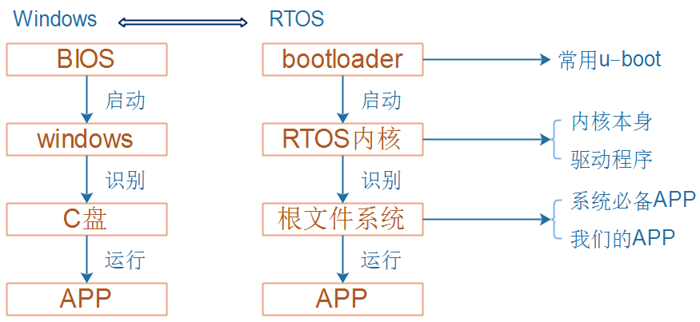
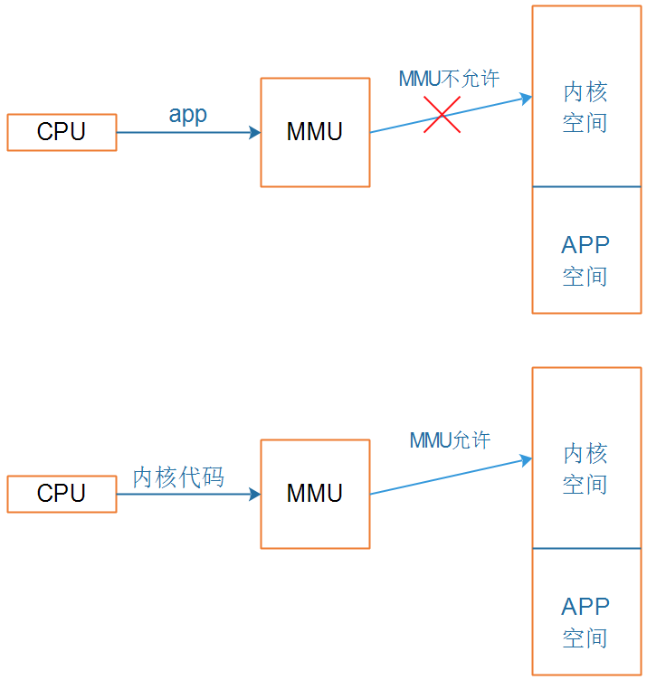
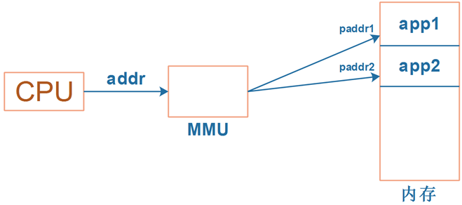
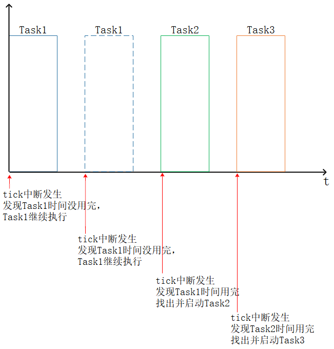

# 移植rt-smart需要做的事

## 1 嵌入式软件系统的组成

## 2 移植最小系统要做的几件事

### 2.1 一般的RTOS移植要做的事

* MMU(Memory Management Unit，内存管理单元)的设置：虚拟地址与物理地址
* 串口相关
  * 打印(只是打印调试信息)
  * 串口驱动(可发可收，APP执行printf时可以从串口打印，所以需要**驱动**)
* 完善中断子系统
  * 提供系统tick时钟
  * 为串口驱动实现基于中断的读取字符函数
* 实现存储设备驱动程序
* 在存储设备上烧录文件系统

### 2.2 rt-smart移植要做的事

rt-smart源码很漂亮，容易理解，容易修改。移植到其他芯片上去，工作量并不大。
有单片机基础即可进行！
简单地说，只需要做这些事情：

* MMU：
  * 配置1个值：指定物理地址、虚拟地址的差值
* 编写2个驱动：串口、Timer
  * 这2个驱动需要你完全写出来吗？
  * 框架都搭建好了，只需要硬件相关的代码

## 3 MMU设置

MMU有2大功能：

### 3.1 权限管理
  * 比如可以把进程A、B的地址空间完全隔离开，它们互不影响
  * 写得差的进程、有恶意的进程，不能影响到其他进程
  * 用户程序、内核地址空间完全隔离开：不允许用户直接访问硬件

示例如下：

### 3.2 地址映射

  * 使能MMU后，CPU发出的地址被称为"虚拟地址"，它不是直接发送给硬件，而是发给MMU
  * MMU根据页表
    * 进行权限判定
    * 转换为物理地址，发给外设

  运行app1时，CPU发出的addr，通过MMU映射到paddr1；
  运行app2时，CPU发出的同一个addr，通过MMU映射到paddr2；
  虽然app1、app2使用的地址相同，但是对应的内存不同，如下图：

* 在移植过程中，我们不需要关注“权限”，只需要关注“地址映射”

## 4. 串口驱动

与Linux的串口驱动相比，rt-smart的串口驱动极大简化了。
对于输出：不使用中断，直接使用查询方式输出。
对于输入：使用中断，我们只需要提供底层硬件相关的代码。
要注意：使用的是虚拟地址。

## 5 timer驱动

操作系统跟单片机程序最大的区别，就是多任务，也就是**同时**运行多个程序。
**同时**，对人类来说是这样的，多个程序好像可以同时运行，实际上它们是**轮流**运行。

### 5.1 操作系统"同时"运行多个任务

轮流运行：

### 5.2 使用GenericTimer

cortex A系列处理器内部有“通用的Timer”，代码时通用的。
rt-smart官方尚未支持GenericTimer，我们在视频中编写了它的驱动。

## 6 存储设备的驱动程序

板子上一般都有EMMC、SD/TF卡、Nor Flash、Nand Flash等存储设备。
Nor Flash、Nand Flash的驱动程序相对简单，但是这些设备比较少见了。
而EMMC、SD/TF卡的驱动程序又太复杂，足够出一个专题了。
我们聚焦在**最小系统**的移植，先把流程走通：

* rt-smart已经实现了虚拟的文件系统romfs
* 不需要我们移植Flash驱动
* 不需要我们移植根文件系统
