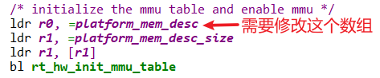
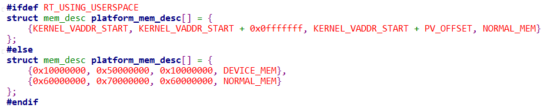

# 内核启动流程

## 1 概述

内核启动流程可以分为2步骤(非官方)：

* 启动(汇编)
  * 使用汇编代码编写，涉及非常底层的设置，比如CPU设置等等
  * 地址映射也在这里实现
  * 它最终会调用rtthread_startup函数

* rtthread_startup函数(C函数)
  * 以后的代码，基本都是使用C语言编写了
  * 主要工作是：
    * 单板级别的初始化：rt_hw_board_init
    * 定时器初始化：rt_system_timer_init
    * 调度器初始化：rt_system_scheduler_init
    * 信号初始化：rt_system_signal_init
    * 创建init线程：rt_application_init
    * 创建timer线程：rt_system_timer_thread_init
    * 创建idle线程：rt_thread_idle_init
    * 自动调度器：rt_system_scheduler_start

## 2 启动文件分析

从`rt-smart\kernel\libcpu\arm\cortex-a\vector_gcc.S`开始阅读代码，它是向量表。
板子启动后执行reset向量，即`b _reset`。
_reset在`rt-smart\kernel\libcpu\arm\cortex-a\start_gcc.S`中定义，流程如下：

```flow
st=>start: start
init_mm_setup=>operation: 映射内核程序本身所在内存的地址
enable_mmu=>operation: 使能MMU
stack_setup=>operation: 设置栈
clear_bss=>operation: 清除BSS
rt_hw_init_mmu_table=>operation: 映射所有内存的地址
switch_mmu=>operation: 切换页表
rtthread_startup=>operation: 调用rtthread的C入口函数
e=>end: end
st->init_mm_setup->enable_mmu->stack_setup->clear_bss->rt_hw_init_mmu_table->switch_mmu->rtthread_startup->e
```

## 3 rtthread_startup函数分析

rtthread_startup函数在这个文件里`rt-smart\kernel\src\components.c`，
流程如下：

```flow
st=>start: start
rtthread_startup=>operation: rtthread_startup
rt_hw_interrupt_disable=>operation: rt_hw_interrupt_disable
rt_hw_board_init=>operation: rt_hw_board_init
rt_show_version=>operation: rt_show_version
rt_system_timer_init=>operation: rt_system_timer_init
rt_system_scheduler_init=>operation: rt_system_scheduler_init
rt_system_signal_init=>operation: rt_system_signal_init
rt_application_init=>operation: rt_application_init
rt_system_timer_thread_init=>operation: rt_system_timer_thread_init
rt_thread_idle_init=>operation: rt_thread_idle_init
rt_system_scheduler_start=>operation: rt_system_scheduler_start
e=>end: end
st->rtthread_startup->rt_hw_interrupt_disable->rt_hw_board_init->rt_show_version
rt_show_version->rt_system_timer_init->rt_system_scheduler_init->rt_system_signal_init
rt_system_signal_init->rt_application_init->rt_system_timer_thread_init->rt_thread_idle_init->rt_system_scheduler_start->e
```

## 4 跟移植相关的代码

移植内核时，涉及地址映射、中断控制器、串口驱动、Timer驱动。

* 地址映射：`rt-smart\kernel\libcpu\arm\cortex-a\start_gcc.S`
* 中断控制器、串口驱动、Timer驱动：入口都是
```c
rtthread_startup
    rt_hw_board_init
    	rt_hw_interrupt_init
    	rt_components_board_init  // 调用某个段里的所有函数
    		rt_hw_uart_init        // 它被放在某个段里 
		    rt_hw_timer_init       // 它被放在某个段里
```

下面是个索引，后续课程在深入讲解。
学有余力的同学可以根据索引自行学习。

## 4.1 地址映射

### 4.1.1 映射内核程序所处内存

代码：`rt-smart\kernel\libcpu\arm\cortex-a\mmu.c`：

```c
#ifdef RT_USING_USERSPACE
void init_mm_setup(unsigned int *mtbl, unsigned int size, unsigned int pv_off) {
    unsigned int va;

    for (va = 0; va < 0x1000; va++) {
        unsigned int vaddr = (va << 20);
        if (vaddr >= KERNEL_VADDR_START && vaddr - KERNEL_VADDR_START < size) {
            mtbl[va] = ((va << 20) + pv_off) | NORMAL_MEM;
        } else if (vaddr >= (KERNEL_VADDR_START + pv_off) && vaddr - (KERNEL_VADDR_START + pv_off) < size) {
            mtbl[va] = (va << 20) | NORMAL_MEM;
        } else {
            mtbl[va] = 0;
        }
    }
}
#endif
```

### 4.1.2 映射整个内存

代码：`rt-smart\kernel\libcpu\arm\cortex-a\start_gcc.S`：



数组位于：`rt-smart\kernel\bsp\qemu-vexpress-a9\drivers\board.c`



## 4.2 中断控制器

调用过程：

```c
rtthread_startup
    rt_hw_board_init
    	rt_hw_interrupt_init
```

## 4.3 串口驱动

代码：`rt-smart\kernel\bsp\qemu-vexpress-a9\drivers\serial.c`
调用过程：
```c
rtthread_startup
    rt_hw_board_init
    	rt_components_board_init  // 调用某个段里的所有函数
    		rt_hw_uart_init       // 它被放在某个段里
```

## 4.4 Timer驱动

代码在`kernel\bsp\qemu-vexpress-a9\drivers\drv_timer.c`
调用过程：
```c
rtthread_startup
    rt_hw_board_init
    	rt_components_board_init   // 调用某个段里的所有函数
    		rt_hw_timer_init       // 它被放在某个段里
```
