# 内存映射

## 1 ARM架构内存映射简介

参考资料：`DEN0013D_cortex_a_series_PG.pdf`。

### 1.1 页表项

ARM架构支持一级页表映射，也就是说MMU根据CPU发来的虚拟地址可以找到第1个页表，从第1个页表里就可以知道这个虚拟地址对应的物理地址。一级页表里地址映射的最小单位是1M。

ARM架构还支持二级页表映射，也就是说MMU根据CPU发来的虚拟地址先找到第1个页表，从第1个页表里就可以知道第2级页表在哪里；再取出第2级页表，从第2个页表里才能确定这个虚拟地址对应的物理地址。二级页表地址映射的最小单位有4K、1K，Linux使用4K。

一级页表项里的内容，决定了它是指向一块物理内存，还是指问二级页表，如下图：

页表项就是一个32位的数据，里面保存有物理地址，还有一些控制信息。
页表项的bit1、bit0表示它是一级页表项，还是二级页表项。
对于一级页表项，里面含有1M空间的物理基地址，这也成为段映射，该物理地址也被称为**段基址**。

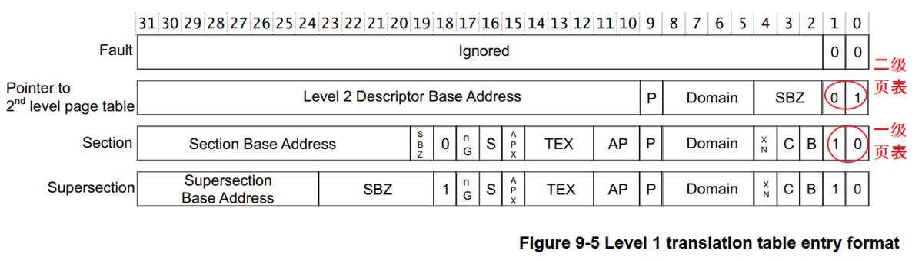

上图中的TEX、C、B可以用来控制这块空间的访问方法：是否使用Cache、Buffer等待。
下图过于复杂，我们只需要知道：

* 访问外设时不能使用Cache、Buffer
* 访问内存时使用Cache、Buffer可以提高速度
* 如果内存用作DMA传输，不要使用Cache、Buffer

如下图所示：
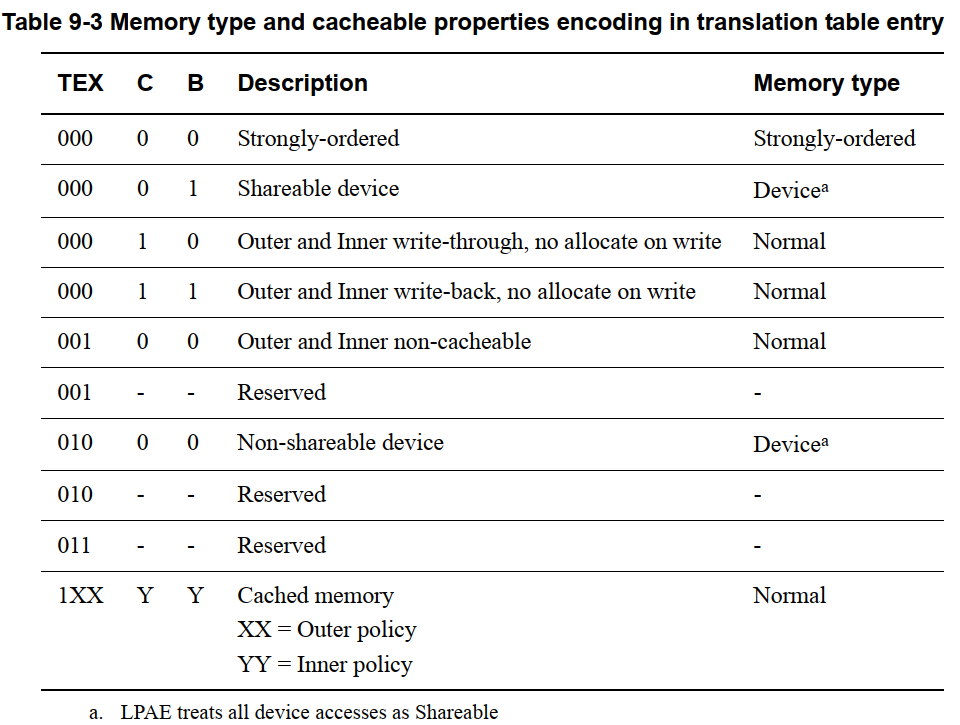

### 1.2 一级页表映射过程

使用一级页表时，先在内存里设置好各个页表项，然后把页表基地址告诉MMU，就可以启动MMU了。

以下图为例介绍地址映射过程：

* ① CPU发出虚拟地址vaddr，假设为0x12345678
* ② MMU根据vaddr[31:20]找到一级页表项
  * 虚拟地址0x12345678是虚拟地址空间里第0x123个1M
  * 所以找到页表里第0x123项，根据此项内容知道它是一个段页表项
  * 段内偏移是0x45678。

* ③ 从这个表项里取出物理基地址：Section Base Address，假设是0x81000000
* ④ 物理基地址加上段内偏移得到：0x81045678

所以CPU要访问虚拟地址0x12345678时，实际上访问的是0x81045678的物理地址。

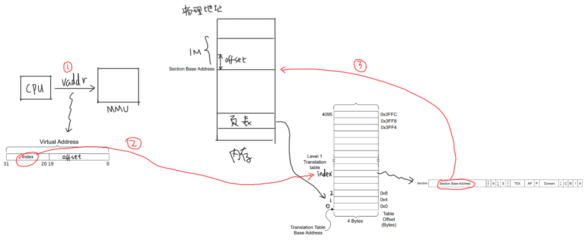

### 1.3 二级页表映射过程

先设置好一级页表、二级页表，并且把一级页表的首地址告诉MMU。

以下图为例介绍地址映射过程：

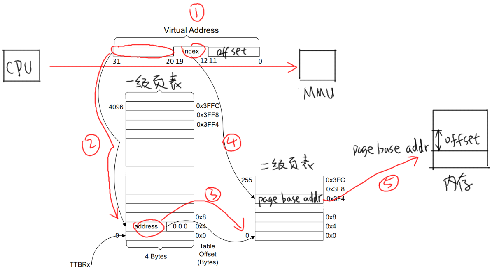

* ① CPU发出虚拟地址vaddr，假设为0x12345678
* ② MMU根据vaddr[31:20]找到一级页表项
  * 虚拟地址0x12345678是虚拟地址空间里第0x123个1M，所以找到页表里第0x123项。
  * 根据此项内容知道它是一个二级页表项。
* ③ 从这个表项里取出地址，假设是address，这表示的是二级页表项的物理地址；
* ④ vaddr[19:12]表示的是二级页表项中的索引index即0x45，在二级页表项中找到第0x45项；
* ⑤ 二级页表项格式如下：
  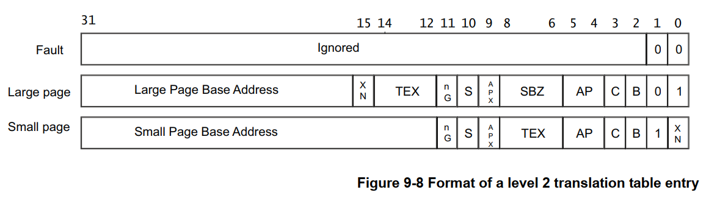
* 里面含有这4K或1K物理空间的基地址page base addr，假设是0x81889000
  * 它跟vaddr[11:0]组合得到物理地址：0x81889000 + 0x678 = 0x81889678
* 所以CPU要访问虚拟地址0x12345678时，实际上访问的是0x81889678的物理地址
  

### 1.4 cache和buffer

本小节参考：[ARM的cache和写缓冲器（write buffer）](https://blog.csdn.net/gameit/article/details/13169445)

使用MMU时，需要有cache、buffer的知识。
下图是CPU和内存之间的关系，有cache、buffer(写缓冲器)。
Cache是一块高速内存；写缓冲器相当于一个FIFO，可以把多个写操作集合起来一次写入内存。

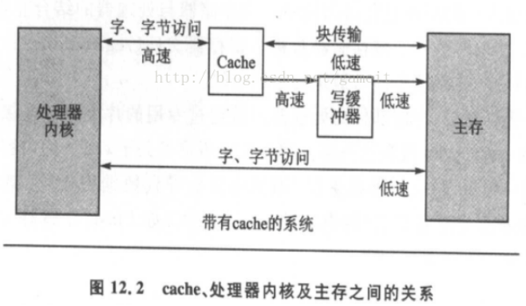

程序运行时有“局部性原理”，这又分为时间局部性、空间局部性。

* 时间局部性：
  在某个时间点访问了存储器的特定位置，很可能在一小段时间里，会反复地访问这个位置。
*  空间局部性
  访问了存储器的特定位置，很可能在不久的将来访问它附近的位置。

而CPU的速度非常快，内存的速度相对来说很慢。
CPU要读写比较慢的内存时，怎样可以加快速度？
根据“局部性原理”，可以引入cache：

* 读取内存addr处的数据时
  * 先看看cache中有没有addr的数据，如果有就直接从cache里返回数据：这被称为cache命中。
  * 如果cache中没有addr的数据，则从内存里把数据读入
    注意：它不是仅仅读入一个数据，而是读入一行数据(cache line)。
  * 而CPU很可能会再次用到这个addr的数据，或是会用到它附近的数据，这时就可以快速地从cache中获得数据。
* 写数据
  * CPU要写数据时，可以直接写内存，这很慢；也可以先把数据写入cache，这很快。
  * 但是cache中的数据终究是要写入内存的啊，这有2种写策略：
    * a. 写通(write through)：
      数据要同时写入cache和内存，所以cache和内存中的数据保持一致，但是它的效率很低。
      能改进吗？可以！
      使用“写缓冲器”：cache大哥，你把数据给我就可以了，我来慢慢写，保证帮你写完。
      有些写缓冲器有“写合并”的功能，比如CPU执行了4条写指令：写第0、1、2、3个字节，每次写1字节；写缓冲器会把这4个写操作合并成一个写操作：写word。
      对于内存来说，这没什么差别，但是对于硬件寄存器，这就有可能导致问题。
      所以对于寄存器操作，不会启动buffer功能；对于内存操作，比如LCD的显存，可以启用buffer功能。
    *  b. 写回(write back)：
      新数据只是写入cache，不会立刻写入内存，cache和内存中的数据并不一致。
      新数据写入cache时，这一行cache被标为“脏”(dirty)；当cache不够用时，才需要把脏的数据写入内存。
      使用写回功能，可以大幅提高效率。但是要注意cache和内存中的数据很可能不一致。这在很多时间要小心处理：比如CPU产生了新数据，DMA把数据从内存搬到网卡，这时候就要CPU执行命令先把新数据从cache刷到内存。反过来也是一样的，DMA从网卡得过了新数据存在内存里，CPU读数据之前先把cache中的数据丢弃。

 是否使用cache、是否使用buffer，就有4种组合(Linux内核文件arch\arm\include\asm\pgtable-2level.h)：

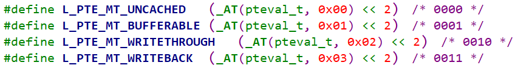

上面4种组合对应下表中的各项，一一对应(下表来自s3c2410芯片手册，高架构的cache、buffer更复杂，但是这些基础知识没变)：

| 是否启用cache | 是否启用buffer | 说明                                                         |
| ------------- | -------------- | ------------------------------------------------------------ |
| 0             | 0              | Non-cached,  non-buffered (NCNB)  读、写都直达外设硬件       |
| 0             | 1              | Non-cached buffered  (NCB)  读、写都直达外设硬件；  写操作通过buffer实现，CPU不等待写操作完成，CPU会马上执行下一条指令 |
| 1             | 0              | Cached,  write-through mode (WT)，写通  读：cache hit时从cahce读数据；cache miss时已入一行数据到cache；  写：通过buffer实现，CPU不等待写操作完成，CPU会马上执行下一条指令 |
| 1             | 1              | Cached, write-back  mode (WB)，写回  读：cache hit时从cahce读数据；cache miss时已入一行数据到cache；  写：通过buffer实现，cache hit时新数据不会到达硬件，而是在cahce中被标为“脏”；cache miss时，通过buffer写入硬件，CPU不等待写操作完成，CPU会马上执行下一条指令 |

第1种是不使用cache也不使用buffer，读写时都直达硬件，这适合寄存器的读写。

第2种是不使用cache但是使用buffer，写数据时会用buffer进行优化，可能会有“写合并”，这适合显存的操作。因为对显存很少有读操作，基本都是写操作，而写操作即使被“合并”也没有关系。

第3种是使用cache不使用buffer，就是“write through”，适用于只读设备：在读数据时用cache加速，基本不需要写。

第4种是既使用cache又使用buffer，适合一般的内存读写。

## 2 内存映射代码分析

### 2.1 总结

分析启动文件`rt-smart\kernel\libcpu\arm\cortex-a\start_gcc.S`，
可以得到下图所示的地址映射关系：

* 内存地址
  * 虚拟地址：KERNEL_VADDR_START
  * 物理地址：KERNEL_VADDR_START+PV_OFFSET
  * 大小：
    * 在`rt-smart\kernel\bsp\qemu-vexpress-a9\drivers\board.c`
    * 有数组`platform_mem_desc`
    * 里面指定了vaddr_end
* 设备空间：就是各种外设，比如UART、LCD控制器、I2C控制器、中断控制器
  * 预留出了点0xF0000000到0xFFFFFFFF共256M虚拟地址空间  
  * 驱动程序使用`rt_hw_kernel_phys_to_virt`函数，按需、动态映射

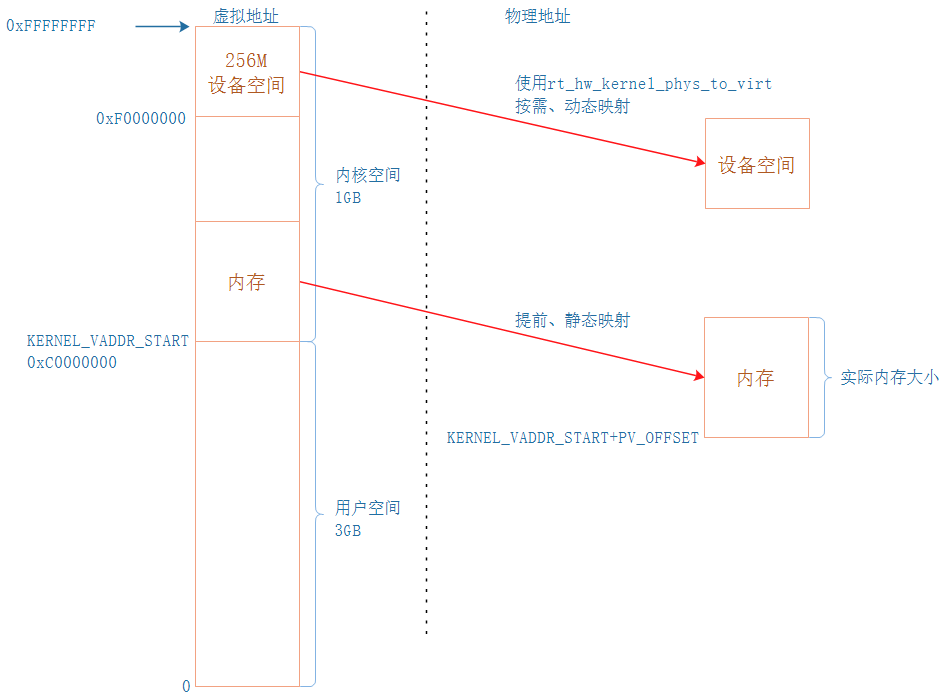

更详细的地址分配细节，可以参考这个文档：[RT-Thread Smart » 架构说明](https://www.rt-thread.org/document/site/rt-smart/architecture/architecture/)

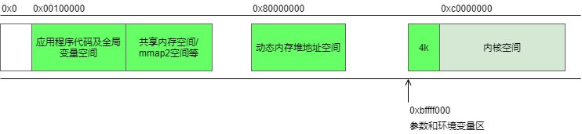

### 2.2 代码阅读

#### 2.2.1 映射内+核所在区域

为什么要单独映射内核所在区域呢？

* 在使能MMU之前，CPU发出的地址直接到达内存(被称为物理地址)
* 在使能MMU之后，CPU发出的地址(被称为虚拟地址)经过MMU转换再到达内存
* 在使能MMU前后的瞬间，CPU发出的地址都应该可以方位到同一块内存区域
  * 这块区域的映射要特殊处理
  * 让它的**虚拟地址等于物理地址**

代码：`rt-smart\kernel\libcpu\arm\cortex-a\start_gcc.S`

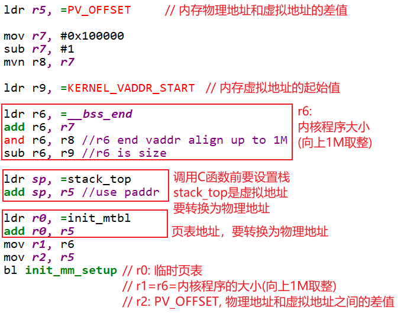

其中的`init_mm_setup`函数位于：`rt-smart\kernel\libcpu\arm\cortex-a\mmu.c`
代码如下：

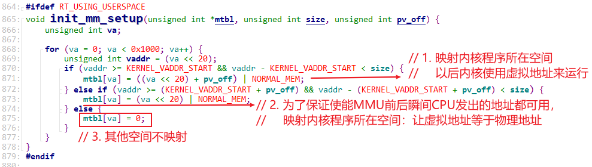

#### 2.2.2 映射整个内存

代码：`rt-smart\kernel\libcpu\arm\cortex-a\start_gcc.S`

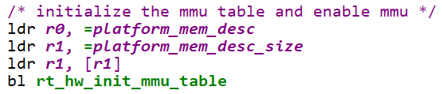

`platform_mem_desc`数组在`rt-smart\kernel\bsp\qemu-vexpress-a9\drivers\board.c`，如下：

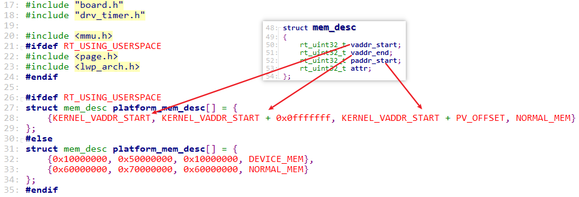

#### 2.2.3 保留设备空间

代码：`rt-smart\kernel\bsp\qemu-vexpress-a9\drivers\board.c`

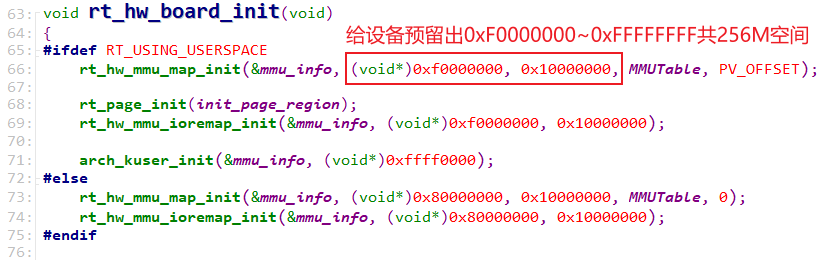

## 3 GIC介绍

GIC名为`Generic Interrupt Controller`，通用的中断控制器。
简单地说，GPIO、UART等各类模块的中断，发给GIC，再由GIC发给某个Processor。
GIC内部结构可以分为2部分：Distributor(分发器)、CPU Interface N(CPU接口)，如下图：

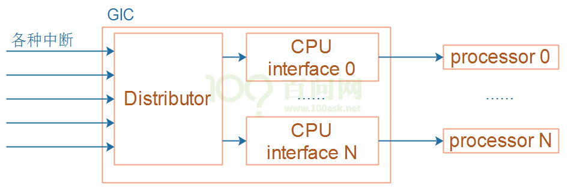

① 分发器(Distributor)
	系统中的所有中断源都连接到该单元。可以通过仲裁单元的寄存器来控制各个中断源的属性，例如优先级、状态、安全性、路由信息和使能状态。
分发器把中断输出到“CPU接口单元”，后者决定将哪个中断转发给CPU核。

② CPU接口单元（CPU Interface）
	CPU核通过控制器的CPU接口单元接收中断。CPU接口单元寄存器用于屏蔽，识别和控制转发到CPU核的中断的状态。系统中的每个CPU核心都有一个单独的CPU接口。
	中断在软件中由一个称为中断ID的数字标识。中断ID唯一对应于一个中断源。软件可以使用中断ID来识别中断源并调用相应的处理程序来处理中断。呈现给软件的中断ID由系统设计确定，一般在SOC的数据手册有记录。

如果你想深入理解GIC，可以观看[百问网](http://www.100ask.net)的视频：**单片机RTOS必备/硬件编程**。
rt-smart的代码已经支持了GIC，本节视频把重点放在**移植**上，
**只需要指定GIC的物理地址**。

## 4 STM32MP157移植

### 4.1 根据芯片手册确定PV_OFFSET

* 先确定内存的物理基地址：芯片手册`DM00327659.pdf`

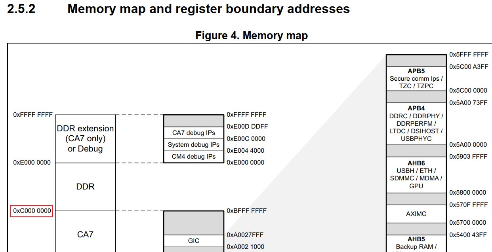

* 内存的虚拟基地址：KERNEL_VADDR_START = 0xC0000000
* 所以：PV_OFFSET = 0xC0000000 - 0xC0000000 = 0

* 最后，在menuconfig里配置PV_OFFSET

### 4.2  根据单板资源确定内存大小

修改`platform_mem_desc`数组中的vaddr_end，
`platform_mem_desc`数组在`rt-smart\kernel\bsp\stm32mp157\drivers\board.c`，如下：


100ASK_STM32MP157的DDR是512M，即0x20000000，上述代码中`0x0fffffff`改为`0x1fffffff`。

### 4.3 指定GIC地址

修改：`rt-smart\kernel\bsp\stm32mp157\drivers\realview.h`

```c
#define REALVIEW_GIC_CPU_BASE       0xA0022000  /* Generic interrupt controller CPU interface */
#define REALVIEW_GIC_DIST_BASE      0xA0021000  /* Generic interrupt controller distributor */
```

## 5 IMX6ULL移植

### 5.1 根据芯片手册确定PV_OFFSET

* 先确定内存的物理基地址：芯片手册`IMX6ULLRM.pdf`

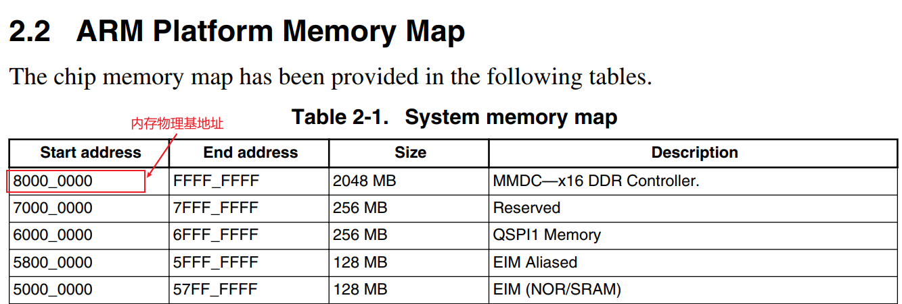

* 内存的虚拟基地址：KERNEL_VADDR_START = 0xC0000000
* 所以：PV_OFFSET = 0x80000000 - 0xC0000000 = 0xC0000000

* 最后，在menuconfig里配置PV_OFFSET

### 5.2 根据单板资源确定内存大小

修改`platform_mem_desc`数组中的vaddr_end，
`platform_mem_desc`数组在`rt-smart\kernel\bsp\imx6ull\drivers\board.c`，如下：


100ASK_IMX6ULL的DDR是512M，即0x20000000，上述代码中`0x0fffffff`改为`0x1fffffff`。

### 5.3 指定GIC物理地址

修改：`rt-smart\kernel\bsp\imx6ull\drivers\realview.h`

```c
#define REALVIEW_GIC_CPU_BASE       (0x00A00000+0x2000)  /* Generic interrupt controller CPU interface */
#define REALVIEW_GIC_DIST_BASE      (0x00A00000+0x1000)  /* Generic interrupt controller distributor */
```