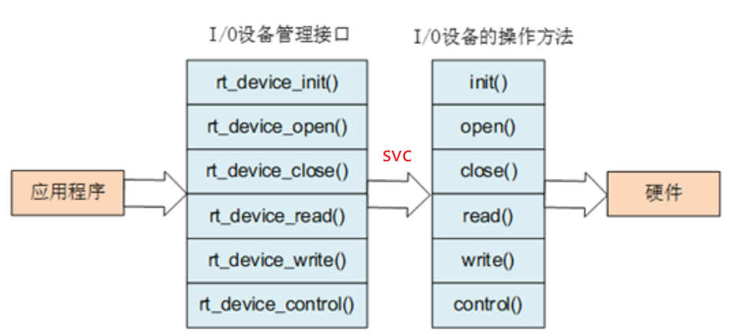
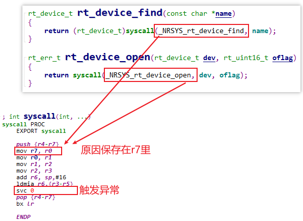
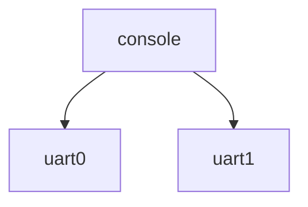
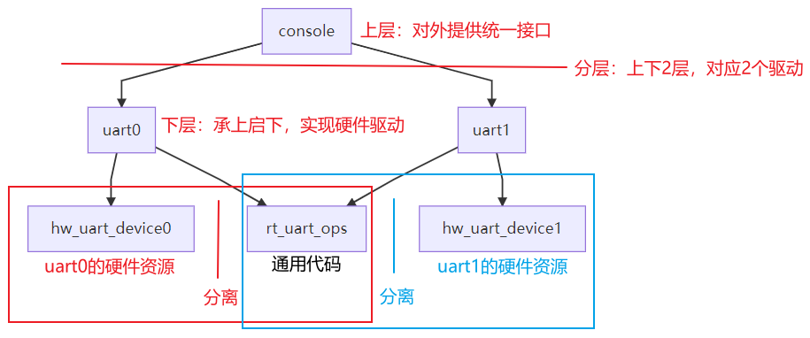
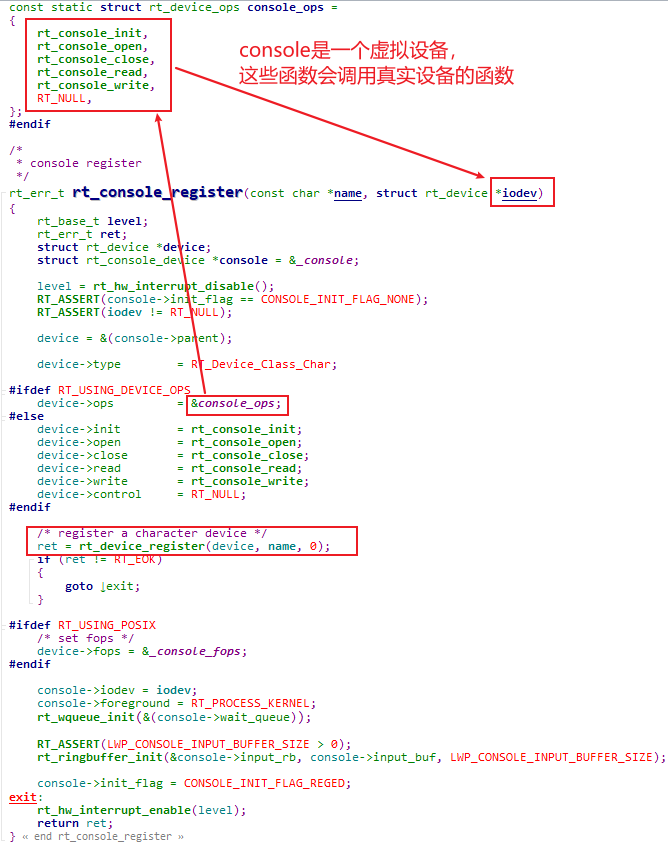
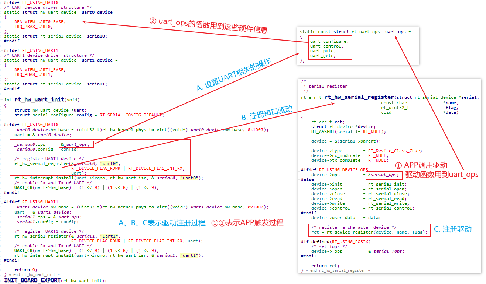
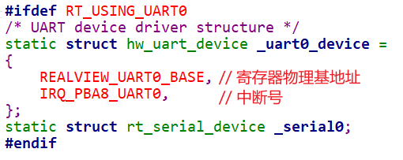
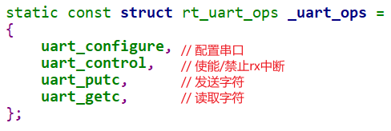

# 串口移植

## 1 rt-smart驱动程序模型

### 1.1 APP和内核隔离

rt-smart中，APP无法直接访问硬件寄存器，必须通过驱动程序来操作硬件。
而APP和内核是隔离的，APP无法直接调用内核中驱动程序的函数。
APP使用驱动的流程如下图所示：



左边的rt_device_open等函数，它最终都是调用一条汇编指令`svc 0`，这会触发异常，进入内核态：



在内核的异常处理函数里，会根据触发异常的原因，调用各类函数，比如：

```c
APP调用rt_device_init，最终导致驱动程序的init函数被调用；
APP调用rt_device_open，最终导致驱动程序的open函数被调用；
……
```

### 1.2 驱动程序的核心

编写驱动程序的核心，就是编写那些init、open函数，然后告诉内核。
为了便于管理，这些函数使用结构体`rt_device_ops`来描述，这就是驱动程序的核心。

rt_device_ops结构体定义如下：

```c
struct rt_device_ops
{
    /* common device interface */
    rt_err_t  (*init)   (rt_device_t dev);
    rt_err_t  (*open)   (rt_device_t dev, rt_uint16_t oflag);
    rt_err_t  (*close)  (rt_device_t dev);
    rt_size_t (*read)   (rt_device_t dev, rt_off_t pos, void *buffer, rt_size_t size);
    rt_size_t (*write)  (rt_device_t dev, rt_off_t pos, const void *buffer, rt_size_t size);
    rt_err_t  (*control)(rt_device_t dev, int cmd, void *args);
};
```

### 1.3 注册驱动程序

示例代码如下：

```c
const static struct rt_device_ops clcd_ops =
{
    rt_lcd_init,
    RT_NULL,
    RT_NULL,
    RT_NULL,
    RT_NULL,
    rt_lcd_control
};

struct rt_device lcd_device;

lcd_device.ops = &clcd_ops;

rt_device_register(&lcd_device, "lcd", RT_DEVICE_FLAG_RDWR);
```

所以，编写驱动程序的套路为：

* 分配一个rt_device结构体，它表示一个**设备**
* 构造一个rt_device_ops结构体，它表示**设备的操作**，填充里面的函数
* rt_device结构体.ops  = rt_device_ops结构体
* 注册rt_deivce结构体：
  ```c
  rt_err_t rt_device_register(rt_device_t dev,
                              const char *name,
                              rt_uint16_t flags);
  ```

从注册过程可以知道，以后APP就是根据name来找到驱动程序。

### 1.4 APP使用驱动程序


示例代码为：

```c
struct rt_device *device;
device = rt_device_find("lcd");
rt_device_open(device, RT_DEVICE_OFLAG_RDWR);
```

## 2 串口的使用与驱动框架

### 2.1 内核里打印

内核打印函数是PRINT_RELEASE，它的内部调用关系如下：

```c
rt_kprintf
    rt_hw_console_output
    	rt_device_write(_console_device, 0, rt_log_buf, length);
    		device_write
```

内核的打印需要用到_console_device，这对应`console`驱动程序。

### 2.2 APP收发数据

我们编写的应用程序，调用printf、scanf时，信息发给谁？从谁哪里得到输入数据？
从**控制台**，英文名为**console**。
在串口上运行程序，**控制台**就是串口。
远程登录板子后运行程序，**控制台**就是远程登录终端。

rt-smart里，console设备的选择有多种，比如uart0、aurt1，如下：



怎么选择呢？看后面的代码分析。

### 2.3 驱动程序分层、分离的概念



#### 2.3.1 分层的概念

上图中，驱动程序分离console、uart0两层。console驱动对外提供统一的结构，它会调用下层uart0的驱动程序。
uart0驱动程序实现硬件操作。
这样的好处是，console可以切换到其他设备，而不会影响APP等使用console的程序。

#### 2.3.2 分离的概念

在uart0驱动程序中，对于硬件的操作被分为左右两边：通用的代码(rt_uart_ops)、硬件资源(hw_uart_device0)。

* 通用的代码：rt_uart_ops里实现了串口的硬件操作，比如配置、发送数据等。无论是uart0还是uart1，都是同一套代码。
* 硬件资源：uart0、uart1不同的地方在于寄存器地址、中断号。这些被称为硬件资源，使用各自的hw_uart_device来定义。

这种写驱动程序的方法，被称为**分离**：操作函数、资源分离。
以后想换一个硬件，只需要修改`hw_uart_device`就可以，`rt_uart_ops`保持不变。

### 2.4 console和uart0挂钩流程

```c
rtthread_startup
    rt_hw_board_init
    	rt_components_board_init
    		rt_hw_uart_init
    			rt_hw_serial_register(..., "uart0", ...)
    				rt_device_register
    	rt_console_set_device(RT_CONSOLE_DEVICE_NAME); //RT_CONSOLE_DEVICE_NAME = "uart0"
			new_iodev = rt_device_find(name);  // name = "uart0"
			rt_console_register("console", new_iodev);   // console跟uart0挂钩
			_console_device = rt_device_find("console"); //	内核通过_console_device来打印
```

### 2.5 console驱动简析

代码：`rt-smart\kernel\components\lwp\lwp_console.c`



### 2.6 uart0驱动简析

代码：

* 单板相关：`rt-smart\kernel\bsp\qemu-vexpress-a9\drivers\serial.c`
* 通用的串口代码：`rt-smart\kernel\components\drivers\serial\serial.c`



## 3 STM32MP157移植

### 3.1 指定硬件资源



### 3.2 实现操作函数



### 3.3 使用中断接收数据

如果使用查询方式读取串口数据，低效而费电。一般都使用中断方式读取串口数据。
内核已经提供了通用的中断处理函数，发生中断时，它会使用rt_uart_ops里的getc函数去读取数据。

### 3.4 编写程序

配置内核，禁止：RT_USING_UART1、RT_USING_SMP

## 4 IMX6ULL移植

