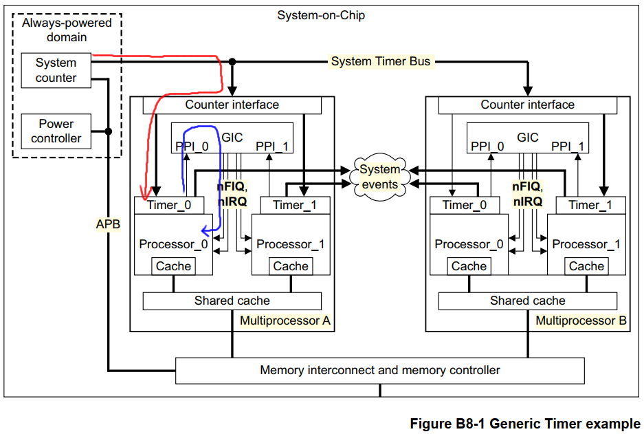
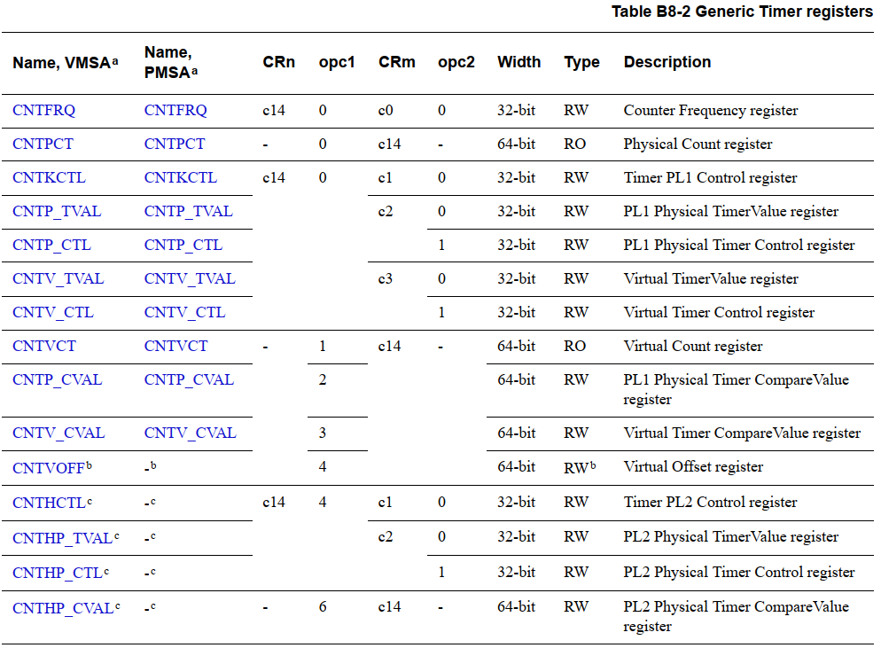
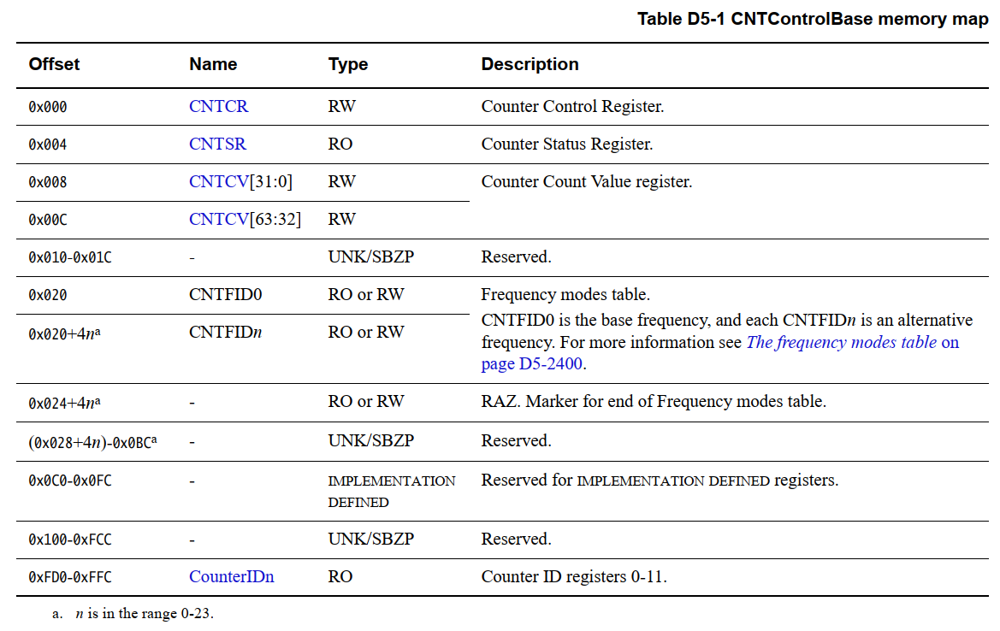
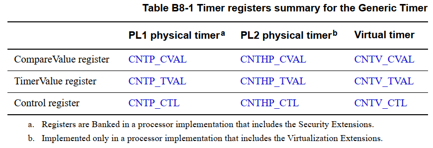
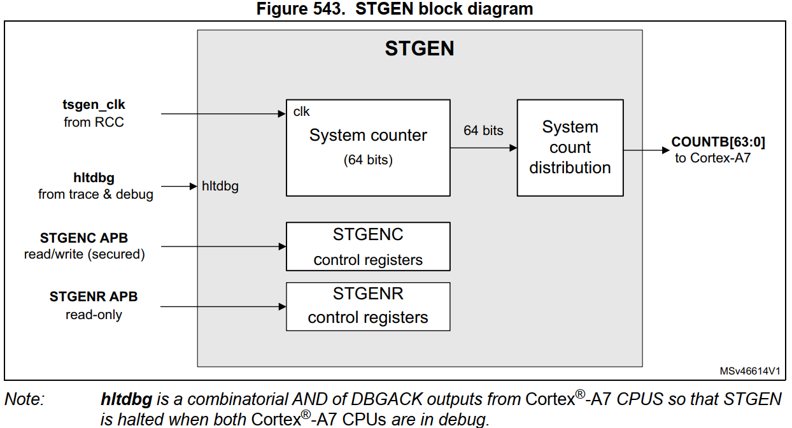
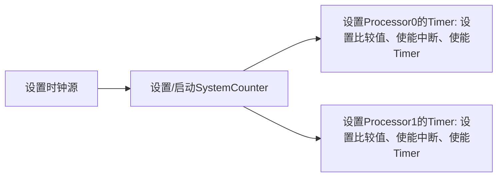

# 系统时钟

## 1 Generic Timer介绍

参考资料：

* `ARM ArchitectureReference Manual ARMv7-A and ARMv7-R edition.pdf`
  
  * 《B8: The Generic Timer》
  * 《D5: System Level Implementation of the Generic Timer》
  
* STM32MP157芯片手册`DM00327659.pdf`

  * 《46 System timer generator (STGEN)》
  
* [Linux时间子系统之（十七）：ARM generic timer驱动代码分析](http://www.wowotech.net/timer_subsystem/armgeneraltimer.html)

  

### 1.1 硬件结构
在操作系统中，需要一个系统时钟，各类芯片都有自己的定时器，它们的编程方法互不相同，这给系统移植带来麻烦。
Generic Timer是ARM推荐的一种硬件实现实现，可以实现统一的编程方法。
Generic Timer分为两部分：共享的System Counter、各个Processor专有的Timer。

* **System Counter**：给所有Processor提供统一的时间
* **Timer**：可以设置周期性的事件，给Processor提供中断信号

下图是Generic Timer的硬件框图，红线表示时钟：System counter是时钟源，进入Porcessor中的Timer。
蓝线表示中断：Porcessor中的Timer产生的中断进入GIC，作为PPI(Private Peripheral Interrupt)传给Processor。
System Counter是系统级别的(System Level)，给整个系统提供时钟，可以使用`Memeory Mapped`的寄存器来访问。

每个Processor里都有一个Timer，这些Timer可以发出周期性的中断，给Processor提供系统时钟。Timer需要使用CP15协处理器命令来访问。



#### 1.1.1 System Counter特性

| 规格             | 描述                                                         |
| ---------------- | ------------------------------------------------------------ |
| 位宽(Width)      | 至少56位，跟硬件实现。<br />读取时，可以得到64位的数值。     |
| 频率(Frequency)  | 1M～50MHz，增加值可以调整：<br />比如时钟为8MHz时，每来一个时钟计数值增加1，<br />设置为4MHz时，每来一个时钟计数值增加2，<br />降低频率时可以降低功耗，同时增加步进值以维持时钟精度 |
| 溢出(Roll-over)  | 不少于40年                                                   |
| 精度(Accuracy)   | 推荐：误差在24小时内不超过10秒                               |
| 复位值(Start-up) | 从0开始                                                      |

##### 1. 两种访问方式

SystemCounter是给所有Processor使用的，它有两种访问方式：

* CP15协处理器命令：某个Processor去访问它时可以使用CP15协处理器命令。

* MemoryMapped寄存器：

  * 既然它是给所有Processor使用的，那么应该提供更高级的访问方法(System Level)

  * 而且有些Processor并没有实现CP15，所有也应该提供MemoryMapped的方法

    

##### 2. CP15寄存器

下面这个表格列出了所有的寄存器，包括SystemCounter和Timer，不仅仅是SystemCounter。



##### 3. MemoryMapped寄存器

这些寄存器在下列手册描述得比较清楚：

* `DM00327659.pdf`的《46 System timer generator (STGEN)》
* `ARM ArchitectureReference Manual ARMv7-A and ARMv7-R edition.pdf`的Table D5-1(下图)：



在u-boot代码中可以看到这样的结构体：

```c
/* System Counter */
struct sctr_regs {
	u32 cntcr;   // control register, 启动/停止
	u32 cntsr;   // status register, 是否启动/停止, 使用哪个频率
	u32 cntcv1;  // count value lower register
	u32 cntcv2;  // count value upper register, cntcv1和cntcv2组成64位的计数值
	u32 resv1[4];
	u32 cntfid0; // base frequency register, 必须等于SystemCounter的输入频率
	u32 cntfid1; // cntfid1和cntfid2：其他频率
	u32 cntfid2;
	u32 resv2[1001];
	u32 counterid[1];
};
```

#### 1.1.2 Timer特性

每个Processor都有一个Timer，它有3个寄存器，只能使用协处理器命令方位(CP15)：

* 64位的比较寄存器(CVAL)：当SystemCounter的值等于它时，产生事件(中断)
  
  * SystemCounter总是增长的，所以Timer的64位比较寄存器也只能设置为大于SystemCounter的值
* 被称为upcounter
  
* 32位的TimerValue寄存器(TVAL)

  * 它是downconter
  * 比如设置为1000，表示再经过1000个时钟之后，就会产生事件(中断)
  * 实质是：设置64位的比较寄存器，让它等于SystemCounter+1000

* 32位的控制寄存器(CTL)

  * 使能/禁止Timer
  * 使能输出：是否能产生事件(中断)
  * 状态：是否能产生了事件(中断)

  

### 1.2 SystemCounter时钟源

SystemCounter的时钟源，跟芯片设计相关。

以STM32MP157为例：




### 1.3 使用方法



* 设置时钟源：芯片相关，一般u-boot里做好了
* 设置/启动SystemCounter
* 设置Processor的Timer：
  * 设置比较值、使能中断、使能Timer
  * 注册中断处理函数

## 2 GenericTimer主要代码编程

参考资料：

* `ARM ArchitectureReference Manual ARMv7-A and ARMv7-R edition.pdf`
  
  * 《B8: The Generic Timer》
  * 《D5: System Level Implementation of the Generic Timer》
  
* STM32MP157芯片手册`DM00327659.pdf`

  * 《46 System timer generator (STGEN)》
  
* [Linux时间子系统之（十七）：ARM generic timer驱动代码分析](http://www.wowotech.net/timer_subsystem/armgeneraltimer.html)

  

### 2.1 RTOS中定时器要做的事情
* 初始化、使能定时器
* 设置中断函数
* 中断函数要做的事情：
  * 调用内核提供的tick函数
  * 设置下一次中断
  * 清除中断

### 2.2 GenericTimer主要代码

根据下图设置3部件：时钟源、SystemCounter、Processor Timer。


#### 2.2.1 时钟源的设置

时钟源跟芯片密切相关，用来给SystemCounter提供时钟。
一般片内ROM已经设置好了，这部分比较复杂，需要阅读芯片手册了解它的时钟体系。

#### 2.2.2 SystemCounter的设置

主要是：

* 使能SystemCounter
* 为了方便程序获知频率，把时钟源的频率写入Processor Timer寄存器

#### 2.2.3 Processor Timer的设置

主要是：

* 设置下一次中断的时间
* 使能中断
* 启动Processor Timer

参考代码：Linux源码 `arch/arm/include/asm/arch_timer.h`