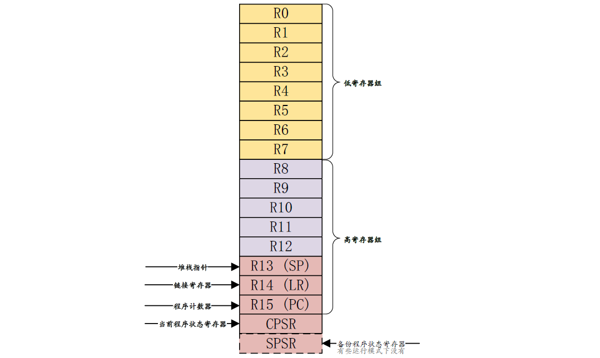

# Cortex-A7 MPCore架构

I.MX6UL 使用的是Cortex-A7架构，本章就给大家介绍一下Cortex-A7架构的一些基本知识。了解了Cortex-A7架构以后有利于我们后面的学习，因为后面有很多例程涉及到Cortex-A7架构方面的知识，比如处理器模型、Cortex-A7寄存器组等等，但是Cortex-A7架构很庞大，远不是一章就能讲完的，所以本章只是对Cortex-A7 架构做基本的讲解，主要是为我们后续的试验打基础。

本章参考了《Cortex-A7 Technical ReferenceManua.pdf》和《ARM Cortex-A(armV7)编程手册V4.0.pdf》这俩份文档，这两份文档都是 ARM官方的文档，详细的介绍了Cortex-A7架构和ARMv7-A 指令集。这两份文档我们都已经放到了开发板光盘中，路径为：开发板光盘->4、参考资料。

## 1 Cortex-A7 MPCore介绍

Cortex-A7 MPcore 处理器支持 1~4 核，通常是和 Cortex-A15 组成 big.LITTLE 架构的,Cortex-A15 作为大核负责高性能运算，比如玩游戏啥的，Cortex-A7负责普通应用，因为Cortex-A7省电。Cortex-A7本身性能也不弱，不要看它叫做Cortex-A7但是它可是比Cortex-A8 性能要强大，而且更省电。ARM 官网对于Cortex-A7的说明如下:

“在 28mm 工艺下，Cortex-A7可以运行在 1.2~1.6GHz，并且单核面积不大于 0.45mm2(含有浮点单元、NEON 和 32KB 的L1 缓存)，在典型场景下功耗小于 100mW，这使得它非常适合对功耗要求严格的移动设备，这意味着Cortex-A7在获得与Cortex-A9 相似性能的情况下，其功耗更低”。

Cortex-A7MPCore 支持在一个处理器上选配 1~4个内核，Cortex-A7MPCore 多核配置如下图所示：

Cortex-A7MPCore 的L1 可选择 8KB、16KB、32KB、64KB，L2 Cache 可以不配，也可以选择128KB、256KB、512KB、1024KB。I.MX6UL 配置了 32KB 的L1 指令Cache 和 32KB 的L1 数据 Cache，以及 128KB 的L2 Cache。Cortex-A7MPCore 使用 ARMv7-A 架构，主要特性如下:

- SIMDv2扩展整形和浮点向量操作。
- 提供了与 ARM VFPv4 体系结构兼容的高性能的单双精度浮点指令，支持全功能的IEEE754。
- 支持大物理扩展(LPAE)，最高可以访问 40 位存储地址，也就是最高可以支持 1TB 的内存。
- 支持硬件虚拟化。
- 支持 Generic Interrupt Controller(GIC)V2.0。
- 支持NEON，可以加速多媒体和信号处理算法。

## 2 Cortex-A处理器的运行模型

以前的 ARM 处理器有 7中运行模型：User、FIQ、IRQ、Supervisor(SVC)、Abort、Undef和 System，其中 User 是非特权模式，其余6 中都是特权模式。但新的Cortex-A 架构加入了Trust忆one 安全扩展，所以就新加了一种运行模式：Monitor，新的处理器架构还支持虚拟化扩展，因此又加入了另一个运行模式：Hyp，所以 Cortex-A7处理器有9种处理模式，如下表所示：

根据上表可知，除了User(USR)用户模式以外，其它 8种运行模式都是特权模式。这几个运行模式可以通过软件进行任意切换，也可以通过中断或者异常来进行切换。大多数的程序都运行在用户模式，用户模式下是不能访问系统所有资源的，有些资源是受限的，要想访问这些受限的资源就必须进行模式切换。但是用户模式是不能直接进行切换的，用户模式下需要借助异常来完成模式切换，当要切换模式的时候，应用程序可以产生异常，在异常的处理过程中完成处理器模式切换。

当中断或者异常发生以后，处理器就会进入到相应的异常模式种，每一种模式都有一组寄存器供异常处理程序使用，这样的目的是为了保证在进入异常模式以后，用户模式下的寄存器不会被破坏。

如果学过STM32 和UCOS、FreeRTOS 就会知道，STM32 只有两种运行模式，特权模式和非特权模式，但是Cortex-A 就有 9 种运行模式。

## 3 Cortex-A寄存器组

本节我们要讲的是Cortex-A的内核寄存器组，注意不是芯片的外设寄存器，本节主要参考《ARMCortex-A(armV7)编程手册V4.0.pdf》的“第3章ARMProcessor Modes And Registers”。

ARM 架构提供了16个 32 位的通用寄存器(R0~R15)供软件使用，前 15 个(R0~R14)可以用作通用的数据存储，R15是程序计数器PC，用来保存将要执行的指令。ARM还提供了一个当前程序状态寄存器 CPSR和一个备份程序状态寄存器 SPSR，SPSR 寄存器就是CPSR 寄存器的备份。这18个寄存器如下图所示:

上一小节我们讲了Cortex-A7有 9种运行模式，每一种运行模式都有一组与之对应的寄存器组。每一种模式可见的寄存器包括15 个通用寄存器(R0~R14)、一两个程序状态寄存器和一个程序计数器PC。在这些寄存器中，有些是所有模式所共用的同一个物理寄存器，有一些是各模式自己所独立拥有的，各个模式所拥有的寄存器如下表所示：

从图中浅色字体的是与 User 模式所共有的寄存器，蓝绿色背景的是各个模式所独有的寄存器。可以看出，在所有的模式中，低寄存器组(R0\~R7)是共享同一组物理寄存器的，只是一些高寄存器组在不同的模式有自己独有的寄存器，比如 FIQ 模式下 R8\~R14 是独立的物理寄存器。假如某个程序在 FIQ 模式下访问 R13 寄存器，那它实际访问的是寄存器 R13_fiq，如果程序处于 SVC 模式下访问 R13 寄存器，那它实际访问的是寄存器R13_svc。总结一下，Cortex-A 内核寄存器组成如下：

- 34个通用寄存器，包括 R15 程序计数器(PC)，这些寄存器都是 32 位的。
- 8个状态寄存器，包括 CPSR 和 SPSR。
- Hyp 模式下独有一个 ELR_Hyp 寄存器。

### 3.1 通用寄存器

