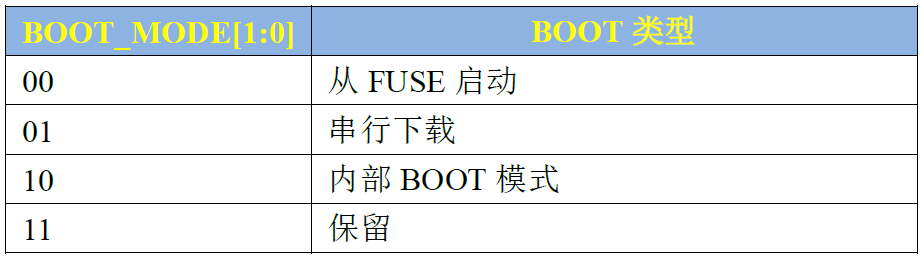
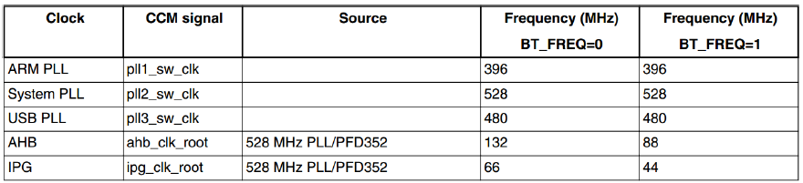

# I.MX6ULL启动方式分析

## 1 启动方式选择

BOOT的处理过程是发生在I.MX6U芯片上电以后，芯片会根据BOOT_MODE[1:0]的设置来选择BOOT方式。BOOT_MODE[1:0]的值是可以改变的，有两种方式，一种是改写eFUSE(熔丝)，一种是修改相应的GPIO高低电平。第一种修改eFUSE的方式只能修改一次，后面就不能再修改了，所以我们不使用。我们使用的是通过修改BOOT_MODE[1:0]对应的GPIO高低电平来选择启动方式，所有的开发板都使用的这种方式，I.MX6U有一个BOOT_MODE1引脚和BOOT_MODE0引脚，这两个引脚对应这BOOT_MODE[1:0]。

其中BOOT_MODE1和BOOT_MODE0在芯片内部是有100KΩ下拉电阻的，所以默认是0。BOOT_MODE1和BOOT_MODEO这两个引脚我们也接到了底板的拨码开关上，这样我们就可以通过拨码开关来控制BOOT_MODE1和BOOT_MODEO的高低电平。

而I.MX6U有四个BOOT模式，这四个BOOT模式由BOOT_MODE[1:0]来控制，也就是BOOT_MODE1和BOOT_MODE0这两IO，BOOT模式配置如下表所示：

常用的是第二和第三中方式。

### 1.1 串行下载

当BOOT_MODE1为0，BOOT_MODE0为1的时候此模式使能，串行下载的意思就是可以通过USB或者UART将代码下载到板子上的外置存储设备中,我们可以使用OTG1这个USB口向开发板上的SD/EMMC、NAND等存储设备下载代码。我们需要将BOOT_MODE1拨到“OFF”，将BOOT_MODEO拨到“ON"。这个下载是需要用到NXP提供的一个软件，一般用来最终量产的时候将代码烧写到外置存储设备中的。

### 1.2 内部BOOT模式

当BOOT_MODE1为1，BOOT_MODE0为0的时候此模式使能，在此模式下，芯片会执行内部的bootROM代码，这段bootROM代码会进行硬件初始化(一部分外设)，然后从boot设备(就是存放代码的设备、比如SD/EMMC、NAND)中将代码拷贝出来复制到指定的RAM中，一般是DDR。

## 2 BOOT ROM初始化内容

当我们设置BOOT模式为“内部BOOT模式”以后，I.MX6U内部的bootROM程序会执行，该代码首先会初始化时钟，具体设置的时钟如下图：

