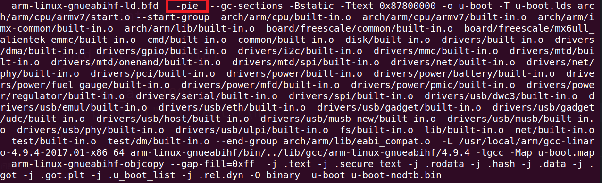

# uboot重定位原理

## 1 重定位.rel.dyn段

一个可执行bin文件，其链接地址和运行地址需要相等，也就是链接到哪个地址，在运行之前就需要拷贝到哪个地址去。当我们将程序移动后，链接地址和运行地址就不相同了，这样寻址就会出现问题，那么则需要对一部分程序进行重定位。

这里以一个程序示例来进行描述：

```c
static int rel_a = 0;

void rel_test(void)
{
    rel_a = 100;
    printf("rel_test\r\n");
}

void board_init(void)
{
    rel_test();
    ....;
}
```

编译完成生成的反汇编文件如下：

```assembly
8785dcf8 <rel_a>:
8785dcf8:	00000000 	andeq	r0, r0, r0

878042b4 <rel_test>:
878042b4:	e59f300c 	ldr	r3, [pc, #12]	; 878042c8 <rel_test+0x14>
878042b8:	e3a02064 	mov	r2, #100	; 0x64
878042bc:	e59f0008 	ldr	r0, [pc, #8]	; 878042cc <rel_test+0x18>
878042c0:	e5832000 	str	r2, [r3]
878042c4:	ea00d64c 	b	87839bfc <printf>
878042c8:	8785dcf8 			; <UNDEFINED> instruction: 0x8785dcf8
878042cc:	87842aaf 	strhi	r2, [r4, pc, lsr #21]

878042d0 <board_init>:
878042d0:	e92d41f0	push	{r4，r5，r6，r7，r8，lr}
878042d4:	e3a06007	mov r6，#7
878042d8:	ebfffff5	bl 	878042b44<rel_test>
```

board_init函数调用rel_test函数，用到了bl指令，而bl指令是位置无关指令，bl指令是相对寻址的(pc+offset)，因此uboot中函数是与绝对位置无关的。

rel_test函数对于全局变量rel_a的调用：

- 设置r3的值为pc+12地址处的值，但是由于ARM处理器的三级流水线机制，pc寄存器的值为当前地址+8，所以pc=0x878042b4+0x08=0x878042bc，r3=0x878042bc+0xc=0x878042c8的值。
- 根据代码可知0x878042c8地址处的值为0x8785dcf8，该值为rel_a变量所在的地址，所以最终设置r3=0x8785dcf8。

rel_a=100的汇编执行过程：

- 在rel_test函数的末尾处地址0x878042c8保存着变量rel_a的地址。
- rel_test函数想要访问rel_a变量，首先访问末尾地址0x878042c8来获取rel_a变量的地址，而**访问0x878042c8通过偏移来访问**。
- 通过0x878042c8来获取rel_a变量的地址，从而实现对rel_a变量进行操作。

可以看出，函数rel_test对变量rel_a的访问没有直接进行，而是使用了一个第三方偏移地址0x878042c8，专业术语叫做Label。这个第三方偏移地址就是实现重定位运行不会出错的原因。

uboot重定位后的偏移offset为0x18747000，首先拷贝反汇编代码后：

```assembly
9ffa4cf8 <rel_a>:
9ffa4cf8:	00000000 	andeq	r0, r0, r0

9ff4b2b4 <rel_test>:
9ff4b2b4:	e59f300c 	ldr	r3, [pc, #12]	; 878042c8 <rel_test+0x14>
9ff4b2b8:	e3a02064 	mov	r2, #100	; 0x64
9ff4b2bc: 	e59f0008 	ldr	r0, [pc, #8]	; 878042cc <rel_test+0x18>
9ff4b2c0: 	e5832000 	str	r2, [r3]
9ff4b2c4: 	ea00d64c 	b	87839bfc <printf>
9ff4b2c8:	8785dcf8 			; <UNDEFINED> instruction: 0x8785dcf8
9ff4b2cc:  	87842aaf 	strhi	r2, [r4, pc, lsr #21]

9ff4b2d0 <board_init>:
9ff4b2d0:	e92d41f0	push	{r4，r5，r6，r7，r8，lr}
9ff4b2d4:	e3a06007	mov r6，#7
9ff4b2d8:	ebfffff5	bl 	878042b44<rel_test>
```

代码拷贝后，Label中的值还是原来的！必须要将0x8785dcf8换为重定位后的rel_a地址。很简单，直接将Label中的值也加上一个偏移即可，0x8785dcf8+0x18747000=0x9ffa4cf8，这样就能解决拷贝代码后链接地址和运行地址不一致的问题。

可以看出，uboot对于重定位后链接地址和运行地址不一致的解决办法是使用位置无关码，在使用ld链接的时候使用选项“-pie”生成位置无关的可执行文件。



在使用“-pie”选项后会生成一个.rel.dyn段，uboot就是靠这个.rel.dyn段来解决重定位的问题的。在uboot.dis文件中的.rel.dyn段中有如下内容：

```assembly
8785dcec:	87800020 	strhi	r0, [r0, r0, lsr #32]
8785dcf0:	00000017 	andeq	r0, r0, r7, lsl r0
...
8785e2fc:	878042c8	strhi	r4, [r0, r8, asr #5]
8785e300:	00000017 	andeq	r0, r0, r7, lsl r0
```

.rel.dyn段的格式类似与上面的，两两一组，也就是两个四字节数据为一组，高4字节是Label标识0x17，低四字节就是Label的地址，首先判断Label地址标识是否正确，也就是判断高4字节是否为0x17，如果是的话，第四字节就是Label的地址。

根据前面的分析，只要将.rel.dyn段中的**(Label+offset)地址处的值**修改为**(Label的值+offset)**即可。

下面看一下uboot对.rel.dyn段的处理代码：

```assembly
	/*
	 * fix .rel.dyn relocations
	 */
	ldr	r2, =__rel_dyn_start	/* r2 <- SRC &__rel_dyn_start */
	ldr	r3, =__rel_dyn_end	/* r3 <- SRC &__rel_dyn_end */
fixloop:
	/* r0为Label，r1为Flag */
	ldmia	r2!, {r0-r1}		/* (r0,r1) <- (SRC location,fixup) */
	/* 取r1中的低8位 */
	and	r1, r1, #0xff
	/* 判断r1是否等于0x17，不等于则执行fixnext函数 */
	cmp	r1, #23			/* relative fixup? */
	bne	fixnext

	/* relative fix: increase location by offset */
	/* r0 = Label + offset */
	add	r0, r0, r4
	/* 读取拷贝代码后Label+offset地址处的值，该值也就是拷贝代码前的值 */
	ldr	r1, [r0]
	/* Label+offset地址处的值 = (Label+offset地址处的值) + offset */
	add	r1, r1, r4
	/* 将Label+offset地址处的值加上offset的值重新写入Label+offset地址 */
	str	r1, [r0]
fixnext:
	/* .rel.dyn段是否处理完成 */
	cmp	r2, r3
	blo	fixloop

relocate_done:
```

## 2 重定位向量表

很简单，就是修改CP15的 VBAR寄存器，也就是将新的向量表首地址写入到寄存器VBAR中，设置向量表偏移。