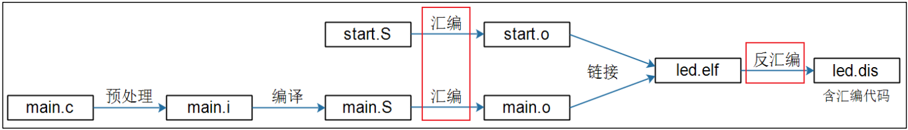
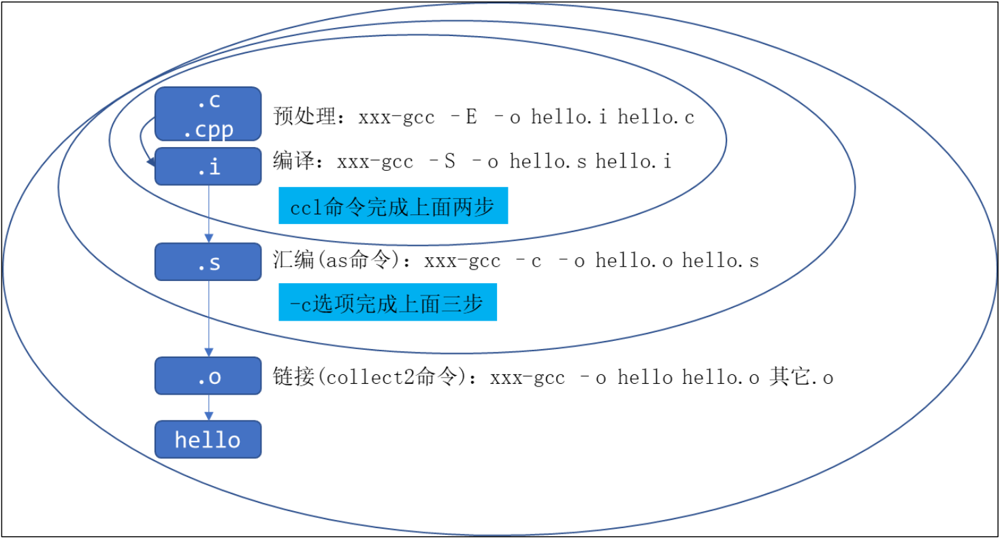

# gcc编译器的使用

源文件需要经过编译才能生成可执行文件。在 Windows 下进行开发时，只需要点几个按钮即可编译，集成开发环境(比如 Visual studio)已经将各种编译工具的使用封装好了。 Linux 下也有很优秀的集成开发工具，但是更多的时候是直接使用编译工具；即使使用集成开发工具，也需要掌握一些编译选项。PC 机上的编译工具链为 gcc、 ld、 objcopy、 objdump 等，它们编译出来的程序在 x86 平台上运行。要编译出能在 ARM 平台上运行的程序，必须使用交叉编译工具 xxx-gcc、 xxx-ld 等(不同版本的编译器的前缀不一样，比如 arm-linuxgcc)，下面分别介绍。  

## 1 gcc的编译过程

一个 C/C++文件要经过预处理(preprocessing)、编译(compilation)、汇编(assembly)和链接(linking)等 4 步才能变成可执行文件。  



通过不同的 gcc 选项可以控制这些过程：



### 1.1 预处理

C/C++源文件中，以“ #”开头的命令被称为预处理命令，如包含命令“ #include”、宏定义命令“ #define”、条件编译命令“ #if”、“ #ifdef”等。预处理就是将要包含(include)的文件插入原文件中、将宏定义展开、根据条件编译命令选择要使用的代码，最后将这些东西输出到一个“ .i”文件中等待进一步处理。  

### 1.2 编译

编译就是把 C/C++代码(比如上述的“.i”文件)“ 翻译” 成汇编代码，所用到的工具为 cc1(它的名字就是 cc1， x86 有自己的 cc1 命令， ARM 板也有自己的cc1 命令)。

### 1.3 汇编

汇编就是将上一步输出的汇编代码翻译成符合一定格式的机器代码，在Linux 系统上一般表现为 ELF 目标文件(OBJ 文件)，用到的工具为 as。 x86 有自己的 as 命令， ARM 版也有自己的 as 命令，也可能是 xxxx-as（比如 armlinux-as）。“反汇编”是指将机器代码转换为汇编代码，这在调试程序时常常用到。

### 1.4 链接

链接就是将上步生成的 OBJ 文件和系统库的 OBJ 文件、 库文件链接起来，最终生成了可以在特定平台运行的可执行文件，用到的工具为 ld 或 collect2。

## 2 gcc总体选项

① -c

预处理、编译和汇编源文件，但是不作链接，编译器根据源文件生成 OBJ 文件。缺省情况下， GCC 通过用`.o`替换源文件名的后缀`.c`， `.i`， `.s`等，产生 OBJ 文件名。可以使用-o 选项选择其他名字。 GCC 忽略-c 选项后面任何无法识别的输入文件。

② -S

编译后即停止，不进行汇编。对于每个输入的非汇编语言文件，输出结果是汇编语言文件。缺省情况下， GCC 通过用`.s`替换源文件名后缀`.c`， `.i`等等，产生汇编文件名。可以使用-o 选项选择其他名字。 GCC 忽略任何不需要汇编的输入文件。

③ -E

预处理后即停止，不进行编译。预处理后的代码送往标准输出。

④ -o file

指定输出文件为 file。无论是预处理、编译、汇编还是链接，这个选项都可以使用。如果没有使用`-o`选项，默认的输出结果是：可执行文件为`a.out`；修改输入文件的名称是`source.suffix`，则它的 OBJ 文件是`source.o`，汇编文件是 `source.s`，而预处理后的 C 源代码送往标准输出。

⑤ -v

显示制作 GCC 工具自身时的配置命令；同时显示编译器驱动程序、预处理器、编译器的版本号。

以一个程序为例，它包含三个文件，代码在 02_options 目录下。  下面列出源码：

```c
/// ---> File: main.c
#include <stdio.h>
#include "sub.h"
int main(int argc, char *argv[])
{
    int i;
    printf("Main fun!\n");
    sub_fun();
    return 0;
}

/// ---> File: sub.h
void sub_fun(void);

/// ---> File: sub.c
void sub_fun(void)
{
    printf("Sub fun!\n");
} 
```

使用上面介绍的选项进行编译，命令如下:

```shell
gcc -c -o main.o main.c
gcc -c -o sub.o sub.c
gcc -o test main.o sub.o
```

其中， main.o、 sub.o 是经过了预处理、编译、汇编后生成的 OBJ 文件，它们还没有被链接成可执行文件；最后一步将它们链接成可执行文件 test，可以直接运行以下命令:

```shell
./test
Main fun!
Sub fun!
```

现在试试其他选项，以下命令生成的 main.s 是 main.c 的汇编语言文件：

```shell
gcc -S -o main.s main.c
```

以下命令对 main.c 进行预处理，并将得到的结果打印出来。里面扩展了所有包含的文件、所有定义的宏。在编写程序时，有时候查找某个宏定义是非常繁琐的事，可以使用`-dM –E’选项来查看。命令如下：

```shell
gcc -E main.c
```

## 3 gcc警告选项(Warning Option)-Wall

这个选项基本打开了所有需要注意的警告信息，比如没有指定类型的声明、在声明之前就使用的函数、局部变量除了声明就没再使用等。

上面的 main.c 文件中定义的变量 i 没有被使用，但是使用`gcc –c –o main.o main.c`进行编译时并没有出现提示。可以加上-Wall 选项，例子如下：

```shell
gcc -Wall -c main.c

# 警告信息：
# main.c: In function `main`:
# main.c:6: warning: unused variable `i`
```

## 4 gcc调试选项(Debugging Option)-g

以操作系统的本地格式(stabs， COFF， XCOFF，或 DWARF)产生调试信息，GDB 能够使用这些调试信息。在大多数使用 stabs 格式的系统上， `-g`选项加入只有 GDB 才使用的额外调试信息。可以使用下面的选项来生成额外的信息： `-gstabs+`， `-gstabs`， `-gxcoff+`， `-gxcoff`， `-gdwarf+`或`-gdwarf`，具体用法请读者参考 GCC 手册。

## 5 gcc优化选项(Optimization Option)

① -O 或-O1

优化：对于大函数，优化编译的过程将占用稍微多的时间和相当大的内存。不使用`-O`或`-O1`选项的目的是减少编译的开销，使编译结果能够调试、语句是独立的：如果在两条语句之间用断点中止程序，可以对任何变量重新赋值，或者在函数体内把程序计数器指到其他语句，以及从源程序中精确地获取你所期待的结果。

不使用`-O`或`-O1`选项时，只有声明了 register 的变量分配使用寄存器。
使用了`-O`或`-O1`选项，编译器会试图减少目标码的大小和执行时间。如果指定了`-O`或`-O1`选项,， `-fthread-jumps`和`-fdefer-pop`选项将被打开。在有 delay slot 的机器上， `-fdelayed-branch`选项将被打开。在即使没有帧指针 (frame pointer)也支持调试的机器上， `-fomit-framepointer`选项将被打开。某些机器上还可能会打开其他选项。

② -O2

多优化一些。除了涉及空间和速度交换的优化选项，执行几乎所有的优化作。例如不进行循环展开(loop unrolling)和函数内嵌(inlining)。和`-O`或`-O1`选项比较，这个选项既增加了编译时间，也提高了生成代码的运行效果。

③ -O3

优化的更多。除了打开-O2 所做的一切，它还打开了-finline-functions选项。

④ -O0

不优化。

如果指定了多个-O 选项，不管带不带数字，生效的是最后一个选项。在一般应用中，经常使用-O2 选项。

## 6 gcc链接器选项(Linker Option)

object-file-name

如果某些文件没有特别明确的后缀(a special recognized suffix)，GCC 就认为他们是 OBJ 文件或库文件(根据文件内容,链接器能够区分 OBJ 文件和库文件)。如果 GCC 执行链接操作，这些 OBJ 文件将成为链接器的输入文件。比如上面的“ gcc -o test main.o sub.o”中， main.o、 sub.o 就是输入的文件。

-llibrary

链接名为 library 的库文件。链接器在标准搜索目录中寻找这个库文件，库文件的真正名字是`liblibrary.a`。搜索目录除了一些系统标准目录外，还包括用户以`-L`选项指定的路径。一般说来用这个方法找到的文件是库文件──即由 OBJ 文件组成的归档文件(archive file)。链接器处理归档文件的方法是：扫描归档文件，寻找某些成员，这些成员的符号目前已被引用，不过还没有被定义。但是，如果链接器找到普通的 OBJ 文件，而不是库文件，就把这个 OBJ 文件按平常方式链接进来。指定`-l`选项和指定文件名的唯一区别是， `-l’选项用`lib`和`.a`把 library 包裹起来，而且搜索一些目录。

即使不明显地使用-llibrary 选项，一些默认的库也被链接进去，可以使用
-v 选项看到这点。

-nostartfiles

不链接系统标准启动文件，而标准库文件仍然正常使用。

-nostdlib

不链接系统标准启动文件和标准库文件，只把指定的文件传递给链接器。这个选项常用于编译内核、 bootloader 等程序，它们不需要启动文件、标准库文件。

-static

在支持动态链接(dynamic linking)的系统上，阻止链接共享库。

-shared

生成一个共享 OBJ 文件，它可以和其他 OBJ 文件链接产生可执行文件。只有部分系统支持该选项。当不想以源代码发布程序时，可以使用-shared 选项生成库文件。

-Xlinker option

把选项 option 传递给链接器。可以用来传递系统特定的链接选项， GCC 无法识别这些选项。如果需要传递携带参数的选项，必须使用两次`-Xlinker`，一次传递选项，另一次传递其参数。例如，如果传递`-assert definitions`，要成`-Xlinker -assert -Xlinker definitions`，而不能写成`-Xlinker "-assert definitions"`，因为这样会把整个字符串当做一个参数传递，显然这不是链接器期待的。

-Wl,option

把选项 option 传递给链接器。如果 option 中含有逗号，就在逗号处分割成多个选项。链接器通常是通过 gcc、 arm-linux-gcc 等命令间接启动的，要向它传入参数时，参数前面加上`-Wl,’。

-u symbol

使链接器认为取消了 symbol 的符号定义，从而链接库模块以取得定义。可以使用多个 `-u`选项，各自跟上不同的符号，使得链接器调入附加的库模块。

## 7 gcc目录选项(Directory Option)

下列选项指定搜索路径，用于查找头文件，库文件，或编译器的某些成员。

-Idir

在头文件的搜索路径列表中添加 dir 目录。头文件的搜索方法为：如果以“ #include < >”包含文件，则只在标准库目录开始搜索(包括使用-Idir 选项定义的目录)；如果以“ #include “ ””包含文件，则先从用户的工作目录开始搜索，再搜索标准库目录。

-I-

任 何 在 `-I-` 前 面 用 `-I` 选 项 指 定 的 搜 索 路 径 只 适 用 于 `#include"file"`这种情况；它们不能用来搜索`#include <file>`包含的头文件。如果用`-I`选项指定的搜索路径位于`-I-`选项后面，就可以在这些路径中搜索所有的`#include`指令(一般说来-I 选项就是这么用的)。还有， `-I-`选项能够阻止当前目录(存放当前输入文件的地方)成为搜索`#include "file"`的第一选择。
`-I-`不影响使用系统标准目录，因此， `-I-`和`-nostdinc`是不同的选项。

-Ldir

在`-l`选项的搜索路径列表中添加 dir 目录。

-Bprefix

这个选项指出在何处寻找可执行文件，库文件，以及编译器自己的数据文件。编译器驱动程序需要使用某些工具，比如： `cpp`， `cc1` (或 C++的`cc1plus`)，`as`和`ld`。它把 prefix 当作欲执行的工具的前缀，这个前缀可以用来指定目录，也可以用来修改工具名字。

对于要运行的工具，编译器驱动程序首先试着加上`-B`前缀(如果存在)，如果没有找到文件，或没有指定`-B`选项，编译器接着会试验两个标准前缀`/usr/lib/gcc/`和`/usr/local/lib/gcc-lib/`。如果仍然没能够找到所需文件，编译器就在`PATH`环境变量指定的路径中寻找没加任何前缀的文件名。如果有需要，运行时(run-time)支持文件`libgcc.a`也在`-B`前缀的搜索范围之内。如果这里没有找到，就在上面提到的两个标准前缀中寻找，仅此而已。如果上述方法没有找到这个文件，就不链接它了。多数情况的多数机器上 ，`libgcc.a`并非必不可少。

可以通过环境变量 GCC_EXEC_PREFIX 获得近似的效果；如果定义了这个变量 ， 其 值 就 和 上 面 说 的 一 样 被 用 作 前 缀 。 如 果 同 时 指 定 了 `-B` 选 项 和GCC_EXEC_PREFIX 变量，编译器首先使用`-B`选项，然后才尝试环境变量值。

## 8 gcc ld/objdump/objcopy 选项
