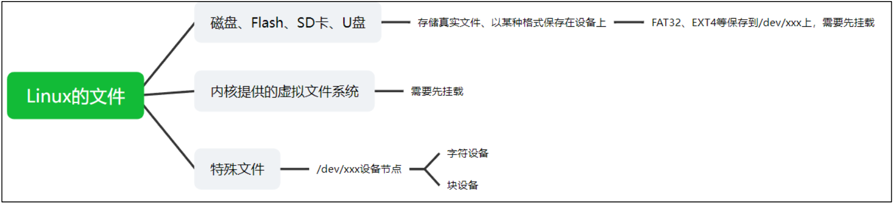
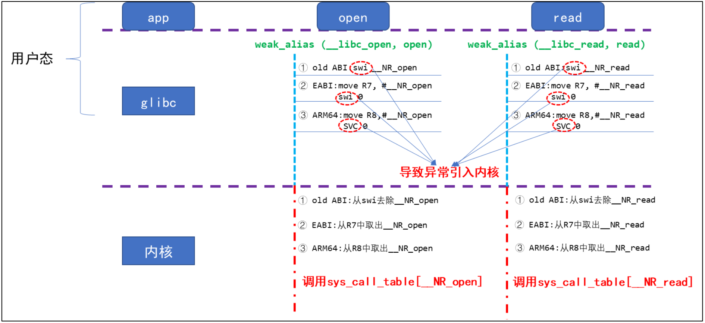
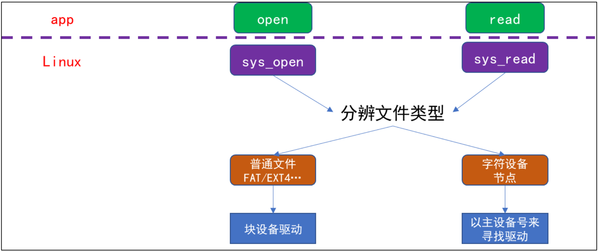
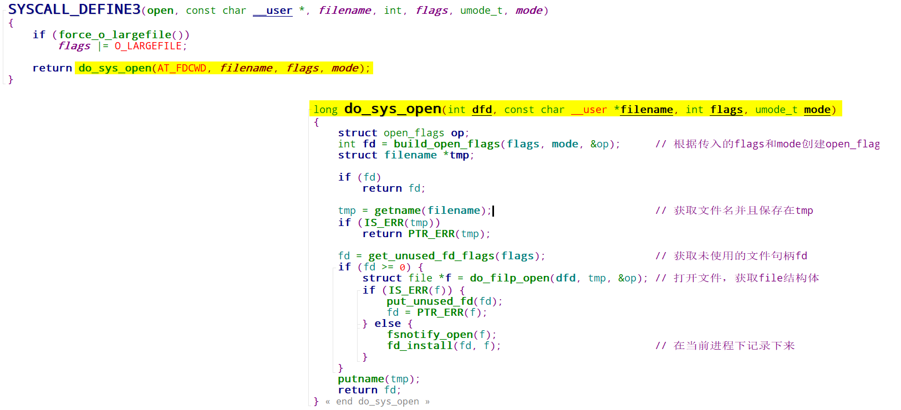
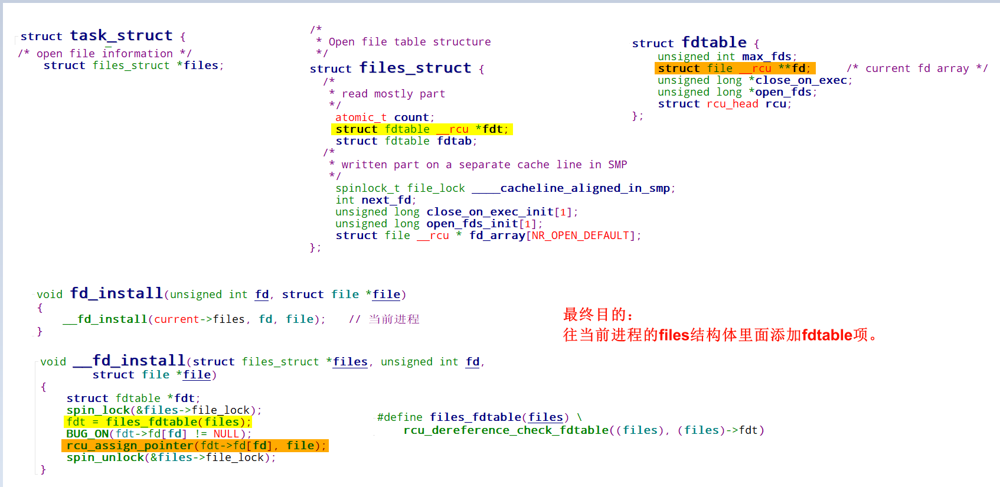
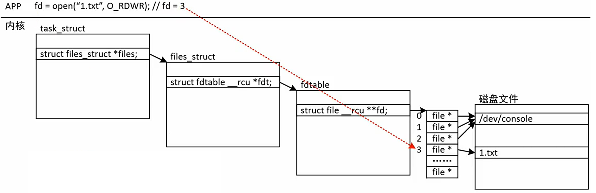
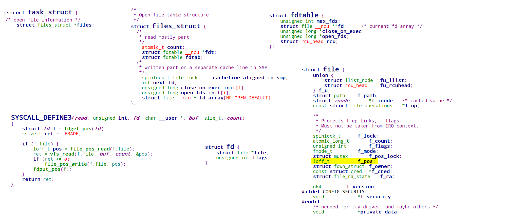

# 文件IO

## 1 文件从哪儿来？

Linux 的文件既可以是真实保存到存储介质的文件也可以是自身内核提供的虚拟文件，还可以是设备节点。

## 2 系统调用如何进入内核

- old ABI(application binary interface)：应用程序二进制接口。
- EABI(Embedded Application Binary Interface)：嵌入式应用程序二进制接口。

sys_call_table表里面的内容：

| index | function                  |
| ----- | ------------------------- |
| 0     | CALL(sys_restart_syscall) |
| 1     | CALL(sys_exit)            |
| 2     | CALL(sys_fork)            |
| 3     | CALL(sys_read)            |
| 4     | CALL(sys_write)           |
| 5     | CALL(sys_open)            |
| 6     | CALL(sys_close)           |
| 7     | CALL(sys_ni_syscall)      |
| 8     | CALL(sys_creat)           |
| 9     | CALL(sys_link)            |
| 10    | CALL(sys_unlink)          |
| 11    | CALL(sys_execve)          |
| 12    | CALL(sys_chdir)           |
| 13    | CALL(OBSULETE(sys_time))  |

## 3 内核的 sys_open、 sys_read 会做什么？  

### 3.1 sys_open代码流程

主要做了以下几个事情：

- 获取没有使用到的文件句柄。
- 打开filename文件，获取`struct file`结构体。
- 在当前进程下安装`fd`。

#### 3.1.1 fd_install代码流程

简单示意图：

### 3.2 sys_read代码流程

