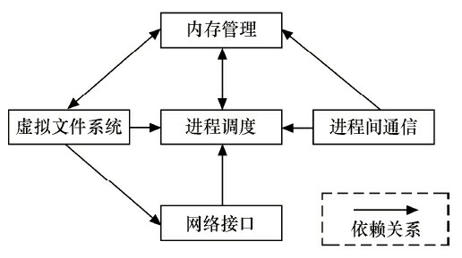
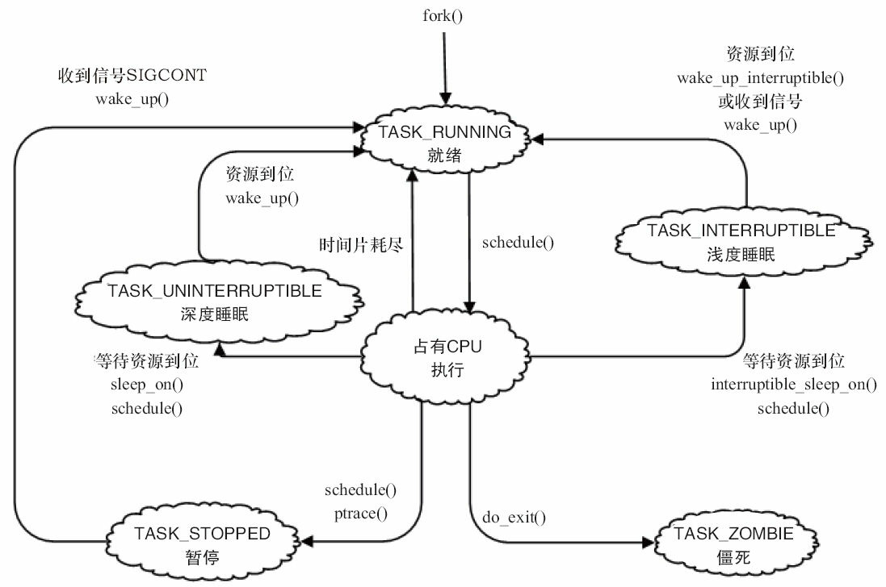
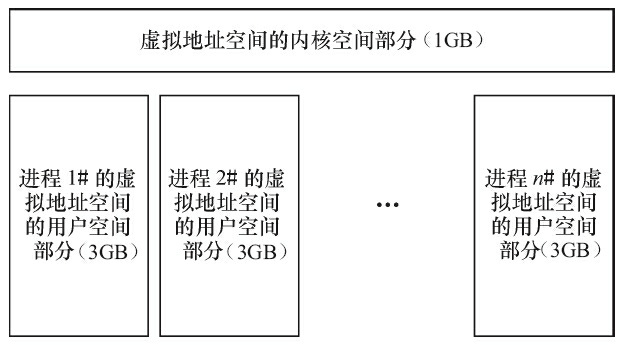
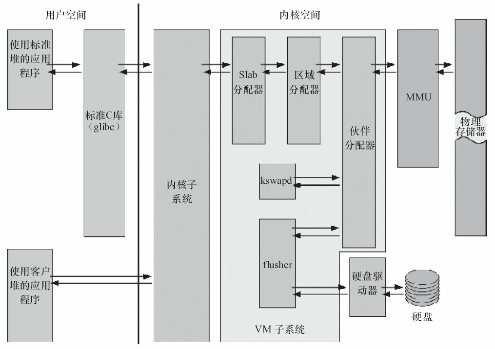
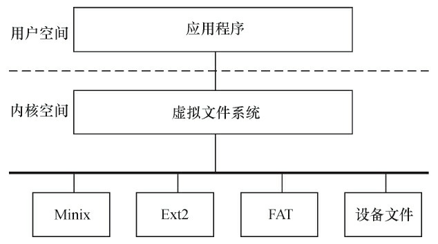
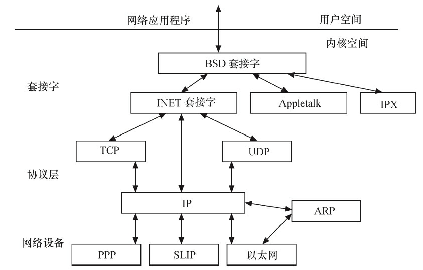
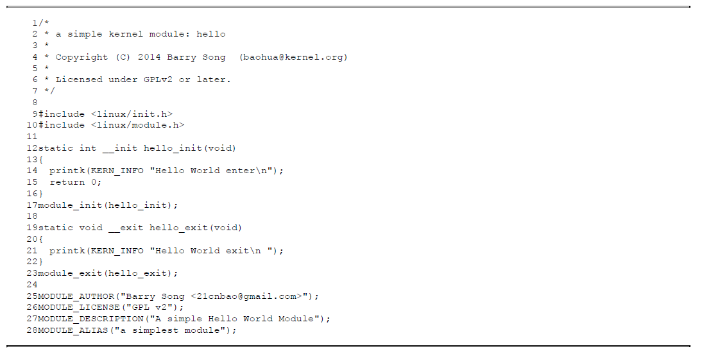
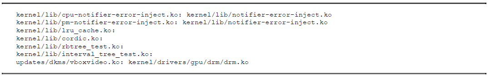

# 内核模块

## 1 内核的组成

### 1.1 内核的源代码目录结构

| **目录**      | **描述**                                                     |
| ------------- | ------------------------------------------------------------ |
| arch          | 包含和硬件体系结构相关的代码，每种平台占一个相应的目录，如i386、arm、arm64、powerpc、mips等。Linux内核目前已经支持30种左右的体系结构。在arch目录下，存放的是各个平台以及各个平台的芯片对Linux内核进程调度、内存管理、中断等的支持，以及每个具体的SoC和电路板的板级支持代码。 |
| block         | 块设备驱动程序I/O调度。                                      |
| crypto        | 常用加密和散列算法（如AES、SHA等），还有一些压缩和CRC校验算法。 |
| documentation | 内核各部分的通用解释和注释。                                 |
| drivers       | 设备驱动程序，每个不同的驱动占用一个子目录，如char、block、net、mtd、i2c等。 |
| fs            | 所支持的各种文件系统，如EXT、FAT、NTFS、JFFS2等。            |
| include       | 头文件，与系统相关的头文件放置在include/linux子目录下。      |
| init          | 内核初始化代码。著名的start_kernel（）就位于init/main.c文件中。 |
| ipc           | 进程间通信的代码。                                           |
| kernel        | 内核最核心的部分，包括进程调度、定时器等，而和平台相关的一部分代码放在arch/*/kernel目录下。 |
| lib           | 库文件代码。                                                 |
| mm            | 内存管理代码，和平台相关的一部分代码放在arch/*/mm目录下。    |
| net           | 网络相关代码，实现各种常见的网络协议。                       |
| scripts       | 用于配置内核的脚本文件。                                     |
| security      | 主要是一个SELinux的模块。                                    |
| sound         | ALSA、OSS音频设备的驱动核心代码和常用设备驱动。              |
| usr           | 实现用于打包和压缩的cpio等。                                 |
| include       | 内核API级别头文件。                                          |

内核一般要做到drivers与arch的软件架构分离，驱动中不包含板级信息，让驱动跨平台。同时内核的通用部分（如kernel、fs、ipc、net等）则与具体的硬件（arch和drivers）剥离。

### 1.2 内核的组成部分



#### 1 进程调度

进程调度控制系统中的多个进程对CPU的访问，使得多个进程能在CPU中“微观串行，宏观并行”地执行。进程调度处于系统的中心位置，内核中其他的子系统都依赖它，因为每个子系统都需要挂起或恢复进程。

Linux的进程在几个状态间进行切换。在设备驱动编程中，当请求的资源不能得到满足时，驱动一般会调度其他进程执行，并使本进程进入睡眠状态，直到它请求的资源被释放，才会被唤醒而进入就绪状态。睡眠分成可中断的睡眠和不可中断的睡眠，两者的区别在于可中断的睡眠在收到信号的时候会醒。



在Linux内核中，使用task_struct结构体来描述进程，该结构体中包含描述该进程内存资源、文件系统资源、文件资源、tty资源、信号处理等的指针。Linux的线程采用轻量级进程模型来实现，在用户空间通过pthread_create（）API创建线程的时候，本质上内核只是创建了一个新的task_struct，并将新task_struct的所有资源指针都指向创建它的那个task_struct的资源指针。

绝大多数进程（以及进程中的多个线程）是由用户空间的应用创建的，当它们存在底层资源和硬件访问的需求时，会通过系统调用进入内核空间。有时候，在内核编程中，如果需要几个并发执行的任务，可以启动内核线程，这些线程没有用户空间。启动内核线程的函数为：

```c
pid_t kernel_thread(int (*fn)(void *), void *arg, unsigned long flags);
```

#### 2 内存管理

内存管理的主要作用是控制多个进程安全地共享主内存区域。当CPU提供内存管理单元（MMU）时，Linux内存管理对于每个进程完成从虚拟内存到物理内存的转换。Linux 2.6引入了对无MMU CPU的支持。

如下图所示，一般而言，32位处理器的Linux的每个进程享有4GB的内存空间，0~3GB属于用户空间，3~4GB属于内核空间，内核空间对常规内存、I/O设备内存以及高端内存有不同的处理方式。当然，内核空间和用户空间的具体界限是可以调整的，在内核配置选项Kernel Features->Memory split下，可以设置界限为2GB或者3GB。



如下图所示，Linux内核的内存管理总体比较庞大，包含底层的Buddy算法，它用于管理每个页的占用情况，内核空间的slab以及用户空间的C库的二次管理。另外，内核也提供了页缓存的支持，用内存来缓存磁盘，per-BDI flusher线程用于刷回脏的页缓存到磁盘。Kswapd（交换进程）则是Linux中用于页面回收（包括file-backed的页和匿名页）的内核线程，它采用最近最少使用（LRU）算法进行内存回收。



#### 3 虚拟文件系统

Linux虚拟文件系统隐藏了各种硬件的具体细节，为所有设备提供了统一的接口。而且，它独立于各个具体的文件系统，是对各种文件系统的一个抽象。它为上层的应用程序提供了统一的vfs_read（）、vfs_write（）等接口，并调用具体底层文件系统或者设备驱动中实现的file_operations结构体的成员函数。



#### 4 网络接口

网络接口提供了对各种网络标准的存取和各种网络硬件的支持。如下图所示，在Linux中网络接口可分为网络协议和网络驱动程序，网络协议部分负责实现每一种可能的网络传输协议，网络设备驱动程序负责与硬件设备通信，每一种可能的硬件设备都有相应的设备驱动程序。



Linux内核支持的协议栈种类较多，如Internet、UNIX、CAN、NFC、Bluetooth、WiMAX、IrDA等，上层的应用程序统一使用套接字接口。

#### 5 进程间通信

进程间通信支持进程之间的通信，Linux支持进程间的多种通信机制，包含信号量、共享内存、消息队列、管道、UNIX域套接字等，这些机制可协助多个进程、多资源的互斥访问、进程间的同步和消息传递。在实际的Linux应用中，人们更多地趋向于使用UNIX域套接字，而不是System V IPC中的消息队列等机制。Android内核则新增了Binder进程间通信方式。

#### 6 各部分的依赖关系

Linux内核5个组成部分之间的依赖关系如下：

- 进程调度与内存管理之间的关系：这两个子系统互相依赖。在多程序环境下，程序要运行，则必须为之创建进程，而创建进程的第一件事情，就是将程序和数据装入内存。
- 进程间通信与内存管理的关系：进程间通信子系统要依赖内存管理支持共享内存通信机制，这种机制允许两个进程除了拥有自己的私有空间之外，还可以存取共同的内存区域。
- 虚拟文件系统与网络接口之间的关系：虚拟文件系统利用网络接口支持网络文件系统（NFS），也利用内存管理支持RAMDISK设备。
- 内存管理与虚拟文件系统之间的关系：内存管理利用虚拟文件系统支持交换，交换进程定期由调度程序调度，这也是内存管理依赖于进程调度的原因。当一个进程存取的内存映射被换出时，内存管理向虚拟文件系统发出请求，同时，挂起当前正在运行的进程。

除了这些依赖关系外，内核中的所有子系统还要依赖于一些共同的资源。这些资源包括所有子系统都用到的API，如分配和释放内存空间的函数、输出警告或错误消息的函数及系统提供的调试接口等。

### 1.3 Linux内核空间与用户空间

现代CPU内部往往实现了不同操作模式（级别），不同模式有不同功能，高层程序往往不能访问低级功能，而必须以某种方式切换到低级模式。

| **模式**                  | **描述**                                                     |
| ------------------------- | ------------------------------------------------------------ |
| 用户模式（usr）           | 大多数应用程序运行在用户模式下，当处理器运行在用户模式下时，某些被保护的系统资源是不能访问的。 |
| 快速中断模式（fiq）       | 用于高速数据传输或通道处理。                                 |
| 外部中断模式（irq）       | 用于通用的中断处理。                                         |
| 管理模式（svc）           | 操作系统使用的保护模式。                                     |
| 数据访问中止模式（abt）   | 当数据或指令预取中止时进入该模式，可用于虚拟存储及存储保护。 |
| 系统模式（sys）           | 运行具有特权的操作系统任务。                                 |
| 未定义指令中止模式（und） | 当未定义的指令执行时进入该模式，可用于支持硬件协处理器的软件仿真。 |

**ARM Linux的系统调用实现原理是采用swi软中断从用户（usr）模式陷入管理模式（svc）。**

x86处理器包含4个不同的特权级，称为Ring 0~Ring 3。在Ring0下，可以执行特权级指令，对任何I/O设备都有访问权等，而Ring3则被限制很多操作。

Linux系统可充分利用CPU的这一硬件特性，但它只使用了两级。在Linux系统中，内核可进行任何操作，而**应用程序则被禁止对硬件的直接访问和对内存的未授权访问**。例如，若使用x86处理器，则用户代码运行在特权级3，而系统内核代码则运行在特权级0。

内核空间和用户空间这两个名词用来区分程序执行的两种不同状态，它们使用不同的地址空间。**Linux只能通过系统调用和硬件中断完成从用户空间到内核空间的控制转移**。


## 2 内核模块简介

Linux提供了这样的机制，这种机制被称为模块(Module)模块具有这样的特点:

- 模块本身不被编译入内核映像，从而控制了内核的大小。
- 模块一旦被加载，它就和内核中的其他部分完全一样。

下面为一个最简单的Linux内核模块：



包含以下内容：

- 内核模块的加载函数。
- 内核模块的卸载函数。
- 对GPL v2许可权限的声明。
- 描述信息。

| 命令       | 功能                                                         |
| ---------- | ------------------------------------------------------------ |
| insmod     | 加载模块。                                                   |
| rmmod      | 卸载模块。                                                   |
| lsmod      | 显示已经存在的模块，实际是读取分析`/proc/modules`文件。      |
| modprobe   | 加载模块，与insmod不同的是，该命令会同时加载目标模块依赖的其他模块。 |
| modprobe-r | 卸载模块，卸载模块的时候也会卸载其依赖的其他模块。           |
| modinfo    | 获取模块的信息，包括模块作者、说明、所支持的参数以及vermagic。 |

> 内核已经加载的模块信息存在于`sys/module`目录下。
>
> 模块之间的依赖关系存在于根文件系统的`lib/modules/<kernel-version>/modules.dep`文件中，该文件是在整体编译内核的时候由depmod工具生成的。
>
> 

## 3 内核模块程序结构

### 3.1 模块加载函数

当通过`insmod`或`modprobe`命令加载内核模块时，模块的加载函数会自动被内核执行，完成本模块的相关初始化工作。

### 3.2 模块的卸载函数

当通过rmmod命令卸载某模块时，模块的卸载函数会自动被内核执行，完成与模块卸载函数相反的功能。

### 3.3 模块的许可声明

许可证（LICENSE）声明描述内核模块的许可权限，如果不声明LICENSE，模块被加载时，将收到内核被污染（Kernel Tainted）的警告。

在Linux内核模块领域，可接受的LICENSE包括“GPL”、“GPL v2”、“GPL and additional rights”、“DualBSD/GPL”、“Dual MPL/GPL”和“Proprietary”（关于模块是否可以采用非GPL许可权，如“Proprietary”，这个在学术界和法律界都有争议）。

大多数情况下，内核模块应遵循GPL兼容许可权。Linux内核模块最常见的是以MODULE_LICENSE（“GPL v2”）语句声明模块采用GPL v2。

### 3.4 模块参数（可选）

模块参数是模块被加载的时候可以传递给它的值，它本身对应模块内部的全局变量。

### 3.5 模块导出符号（可选）

内核模块可以导出的符号（symbol，对应于函数或变量），若导出，其他模块则可以使用本模块中的变量或函数。

### 3.5 模块的作者信息（可选）

## 4 模块的加载函数

内核模块的加载函数一般以`__init`声明。

```c
static int __init initial_function(void)
{
    /* 模块初始化代码 */
    
    return 0;
}
module_init(initial_function);
```

> 模块加载函数以“module_init（函数名）”的形式被指定。它返回整型值，若初始化成功，应返回0。而在初始化失败时，应该返回错误编码。在Linux内核里，错误编码是一个接近于0的负值，在<linux/errno.h>中定义，包含-ENODEV、-ENOMEM之类的符号值。总是返回相应的错误编码是种非常好的习惯，因为只有这样，用户程序才可以利用perror等方法把它们转换成有意义的错误信息字符串。

在linux内核中，可以使用`request_module(const char *fmt, ...)`函数加载内核模块。这样子可以灵活的加载其他内核模块。

在linux内核中，所有标识为`__init`的函数如果直接编译进内核，都会成为内核镜像的一部分，在链接的时候都会放在`.init.text`这个段中。

```c
#define __init __attribute__ ((__section__ (".init.text")))
```

所有的`__init`函数在区段`.initcall.init`中还保存了一份函数指针，在初始化时内核会通过这些函数指针调用这些`__init`函数，并在初始化完成后，释放`init`区段（包括.init.text、.initcall.init等）的内存。

除了函数以外，数据也可以被定义为__initdata，对于只是初始化阶段需要的数据，内核在初始化完后，也可以释放它们占用的内存。

```c
static int hello_data __initdata = 1;
```

## 5 模块的卸载函数

内核模块的加载函数一般以`__exit`声明。

```c
static void __exit cleanup_function(void)
{
    /* 模块卸载代码 */
}
module_exit(cleanup_function);
```

> 模块卸载函数在模块卸载的时候执行，而不返回任何值，且必须以“module_exit（函数名）”的形式来指定。通常来说，模块卸载函数要完成与模块加载函数相反的功能。

我们用`__exit`来修饰模块卸载函数，可以告诉内核如果相关的模块被直接编译进内核（即built-in），则`cleanup_function`函数会被省略，直接不链进最后的镜像。既然模块被内置了，就不可能卸载它了，卸载函数也就没有存在的必要了。除了函数以外，只是退出阶段采用的数据也可以用`__exitdata`来形容。

## 6 模块参数

```c
static char *book_name = "dissecting Linux Device Driver";
module_param(book_name, charp, S_IRUGO);
static int book_num = 4000;
module_param(book_num, int, S_IRUGO);
```

> 我们可以用“module_param（参数名，参数类型，参数读/写权限）”为模块定义一个参数，上面代码定义了1个整型参数和1个字符指针参数。

在装载内核模块时，用户可以向模块传递参数，形式为`insmode(或modprobe) 模块名 参数名=参数值`，如果不传递，参数将使用模块内定义的缺省值

如果模块被内置，就无法insmod了，但是bootloader可以通过在bootargs里设置`模块名 参数名=参数值`的形式给该内置的模块传递参数。

参数类型可以是byte、short、ushort、int、uint、long、ulong、charp（字符指针）、bool或invbool（布尔的反），在模块被编译时会将module_param中声明的类型与变量定义的类型进行比较，判断是否一致。

除此之外，模块也可以拥有参数数组，形式为“module_param_array（数组名，数组类型，数组长，参数读/写权限）”。

模块被加载后，在/sys/module/目录下将出现以此模块名命名的目录。当“参数读/写权限”为0时，表示此参数不存在sysfs文件系统下对应的文件节点，如果此模块存在“参数读/写权限”不为0的命令行参数，在此模块的目录下还将出现parameters目录，其中包含一系列以参数名命名的文件节点，这些文件的权限值就是传入module_param（）的“参数读/写权限”，而文件的内容为参数的值。

运行insmod或modprobe命令时，应使用逗号分隔输入的数组元素。

## 7 导出符号

Linux的`/proc/kallsyms`文件对应着内核符号表，它记录了符号以及符号所在的内存地址。

```c
EXPORT_SYMBOL(符号名);
EXPORT_SYMBOL_GPL(符号名);
```

## 8 模块的声明与描述

- MODULE_AUTHOR：模块作者。
- MODULE_DESCRIPTION：模块描述。
- MODULE_VERSION：模块版本。
- MODULE_DEVICE_TABLE：设备表。
- MODULE_ALIAS：模块别名。

> [!NOTE]
>
> 对于USB、PCI等设备驱动，通常会建立一个MODULE_DEVICE_TABLE，以表明该驱动模块支持的设备。

## 9 模块的使用计数

Linux 2.4内核中，模块自身通过MOD_INC_USE_COUNT、MOD_DEC_USE_COUNT宏来管理自己被使用的计数。

Linux 2.6以后的内核提供了模块计数管理接口try_module_get（&module）和module_put（&module），从而取代Linux 2.4内核中的模块使用计数管理宏。模块的使用计数一般不必由模块自身管理，而且模块计数管理还考虑了SMP与PREEMPT机制的影响。

```c
// 用于增加模块使用计数；若返回为0，表示调用失败，希望使用的模块没有被加载或正在被卸载中。
int try_module_get(struct module *module);
// 该函数用于减少模块使用计数。
void module_put(struct module *module);
```

try_module_get（）和module_put（）的引入、使用与Linux 2.6以后的内核下的设备模型密切相关。Linux 2.6以后的内核为不同类型的设备定义了struct module*owner域，用来指向管理此设备的模块。当开始使用某个设备时，内核使用try_module_get（dev->owner）去增加管理此设备的owner模块的使用计数；当不再使用此设备时，内核使用module_put（dev->owner）减少对管理此设备的管理模块的使用计数。这样，当设备在使用时，管理此设备的模块将不能被卸载。只有当设备不再被使用时，模块才允许被卸载。

在Linux 2.6以后的内核下，对于设备驱动而言，很少需要亲自调用try_module_get（）与module_put（），因为此时开发人员所写的驱动通常为支持某具体设备的管理模块，对此设备owner模块的计数管理由内核里更底层的代码（如总线驱动或是此类设备共用的核心模块）来实现，从而简化了设备驱动开发。

## 10 模块的编译

```makefile
KVERS = $(shell uname -r)
# Kernel modules
obj-m += hello.o
# Specify flags for the module compilation.
#EXTRA_CFLAGS=-g -O0
build: kernel_modules
kernel_modules:
	make -C /lib/modules/$(KVERS)/build M=$(CURDIR) modules
clean:
	make -C /lib/modules/$(KVERS)/build M=$(CURDIR) clean
```

该Makefile文件应该与源代码hello.c位于同一目录，开启其中的EXTRA_CFLAGS=-g-O0，可以得到包含调试信息的hello.ko模块。运行make命令得到的模块可直接在PC上运行。如果一个模块包括多个.c文件（如file1.c、file2.c），则应该以如下方式编写Makefile：

```makefile
MODULE_NAME = modulename
obj-m := $(MODULE_NAME).o
$(MODULE_NAME)-objs := file1.o file2.o
```

## 11 使用模块“绕开”GPL

Linux内核有两种导出符号的方法给模块使用，一种方法是EXPORT_SYMBOL（），另外一种是EXPORT_SYMBOL_GPL（）。这一点和模块A导出符号给模块B用是一致的。

内核用EXPORT_SYMBOL_GPL（）导出的符号是不可以被非GPL模块引用的。

由于相当多的内核符号都是以EXPORT_SYMBOL_GPL（）导出的，所以历史上曾经有一些公司把内核的EXPORT_SYMBOL_GPL（）直接改为EXPORT_SYMBOL（），然后将修改后的内核以GPL形式发布。这样修改内核之后，模块不再使用内核的EXPORT_SYMBOL_GPL（）符号，因此模块不再需要GPL。对此Linus的回复是：“I think both them said that anybody who were to change a xyz_GPL to the non-GPLone in order to use it with a non-GPL module would almost immediately fall under the“willful infringement”thing，and that it would make it MUCH easier to get triple damages and/or injunctions，since they clearly knew aboutit”。因此，这种做法可能构成“蓄意侵权（willful infringement）”。另外一种做法是写一个wrapper内核模块（这个模块遵循GPL），把EXPORT_SYMBOL_GPL（）导出的符号封装一次后再以EXPORT_SYMBOL（）形式导出，而其他的模块不直接调用内核而是调用wrapper函数。


一般认为，保守的做法是Linux内核不能使用非GPL许可权。
