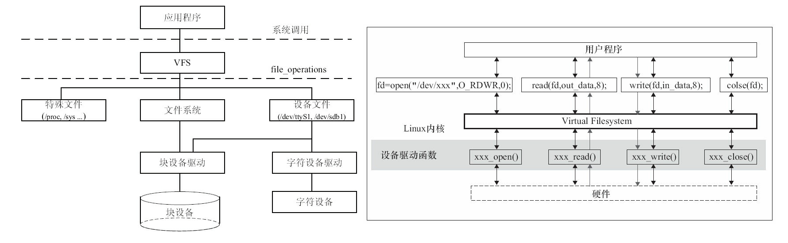

# 文件系统与设备文件

## 1 文件操作

### 1.1 文件操作系统调用

Linux的文件操作系统调用（在Windows编程领域，习惯称操作系统提供的接口为API）涉及创建、打开、读写和关闭文件。

具体的函数及其定义可以通过man手册进行查看：

- man 1 +命令：这里的1表示为查询的是Linux命令。
- man 2 xxx：这里的2表示为查询的是linux api。
- man 3 xxx：这里的3表示为查询的是c库函数。

## 2 文件系统

### 2.1 目录结构

| **目录** | **描述**                                                     |
| -------- | ------------------------------------------------------------ |
| /bin     | 包含基本命令，如ls、cp、mkdir等，这个目录中的文件都是可执行的。 |
| /sbin    | 包含系统命令，如modprobe、hwclock、ifconfig等，大多是涉及系统管理的命令，这个目录中的文件都是可执行的。 |
| /dev     | 设备文件存储目录，应用程序通过对这些文件的读写和控制以访问实际的设备。 |
| /etc     | 系统配置文件的所在地，一些服务器的配置文件也在这里，如用户账号及密码配置文件。busybox的启动脚本也存放在该目录。 |
| /lib     | 系统库文件存放目录等。                                       |
| /mnt     | /mnt这个目录一般是用于存放挂载储存设备的挂载目录，比如含有cdrom等目录。可以参看/etc/fstab的定义。有时我们可以让系统开机自动挂载文件系统，并把挂载点放在这里。 |
| /opt     | opt是“可选”的意思，有些软件包会被安装在这里。                |
| /proc    | 操作系统运行时，进程及内核信息（比如CPU、硬盘分区、内存信息等）存放在这里。/proc目录为伪文件系统proc的挂载目录，proc并不是真正的文件系统，它存在于内存之中。 |
| /tmp     | 用户运行程序的时候，有时会产生临时文件，/tmp用来存放临时文件。 |
| /usr     | 这个是系统存放程序的目录，比如用户命令、用户库等。           |
| /var     | 表示的是变化的意思，这个目录的内容经常变动，如/var的/var/log目录被用来存放系统日志 |
| /sys     | Linux 2.6以后的内核所支持的sysfs文件系统被映射在此目录上。Linux设备驱动模型中的总线、驱动和设备都可以在sysfs文件系统中找到对应的节点。当内核检测到在系统中出现了新设备后，内核会在sysfs文件系统中为该新设备生成一项新的记录。 |

### 2.2 文件系统与设备驱动

应用程序和VFS之间的接口是系统调用，而VFS与文件系统以及设备文件之间的接口是file_operations结构体成员函数，这个结构体包含对文件进行打开、关闭、读写、控制的一系列成员函数。

由于字符设备的上层没有类似于磁盘的ext2等文件系统，所以字符设备的file_operations成员函数就直接由设备驱动提供了，在稍后的第6章，将会看到file_operations正是字符设备驱动的核心。块设备有两种访问方法，一种方法是不通过文件系统直接访问裸设备，在Linux内核实现了统一的def_blk_fops这一file_operations，它的源代码位于fs/block_dev.c，所以当我们运行类似于“dd if=/dev/sdb1of=sdb1.img”的命令把整个/dev/sdb1裸分区复制到sdb1.img的时候，内核走的是def_blk_fops这个file_operations；另外一种方法是通过文件系统来访问块设备，file_operations的实现则位于文件系统内，文件系统会把针对文件的读写转换为针对块设备原始扇区的读写。ext2、fat、Btrfs等文件系统中会实现针对VFS的file_operations成员函数，设备驱动层将看不到file_operations的存在。

