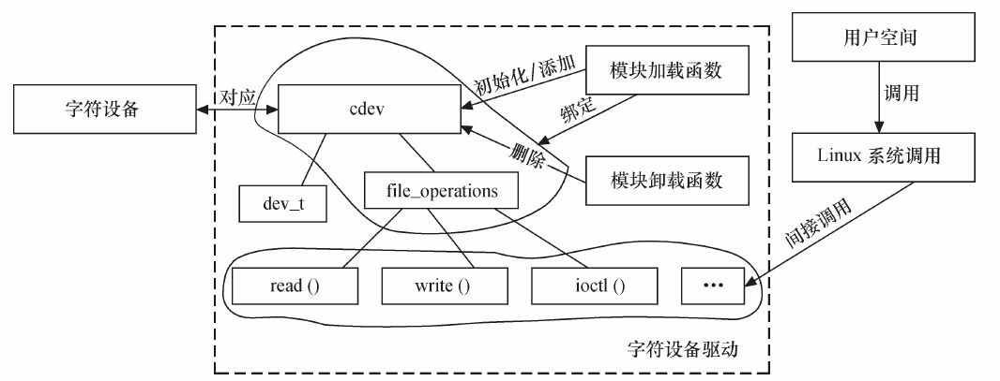

# 字符设备驱动

## 1 字符设备驱动结构

### 1.1 cdev结构体

在Linux内核中，使用cdev结构体描述一个字符设备。

```c
struct cdev {
    struct kobject kobj;            /* 内嵌的kobject对象 */
    struct module *owner;           /* 所属模块*/
    struct file_operations *ops;    /* 文件操作结构体*/
    struct list_head list;
    dev_t dev;                      /* 设备号*/
    unsigned int count;
};
```

cdev结构体的dev_t成员定义了设备号，为32位，其中12位为主设备号，20位为次设备号。

```c
MAJOR(dev_t dev)            // 获取主设备号
MINOR(dev_t dev)            // 获取次设备号
MKDEV(int major, int minor) // 生成设备号
```

cdev结构体的另一个重要成员`file_operations`定义了字符设备驱动提供给虚拟文件系统的接口函数。

Linux内核提供了一组函数以用于操作cdev结构体：

使用cdev_init函数初始化cdev的成员，并建立cdev和file_operations之间的连接。

```c
void cdev_init(struct cdev *cdev, struct file_operations *fops);
```

| **参数** | **描述**                 |
| -------- | ------------------------ |
| cdev     | 定义的cdev结构体变量     |
| fops     | 字符设备文件操作函数集合 |
| **返回** | 无                       |

使用cdev_alloc函数动态申请一个cdev内存。

```c
struct cdev *cdev_alloc(void)
```

| **参数** | 无                     |
| -------- | ---------------------- |
| **返回** | ——                     |
| cdev     | 分配成功，返回cdev句柄 |
| NULL     | 分配失败               |

使用cdev_add函数向Linux系统添加字符设备(cdev结构体变量)，首先使用`cdev_init`函数完成对cdev结构体变量的初始化，然后使用`cdev_add`函数向Linux系统添加这个字符设备。

```c
int cdev_add(struct cdev *p, dev_t dev, unsigned count)
```

| **参数** | **描述**                              |
| -------- | ------------------------------------- |
| p        | 指向要添加的字符设备(cdev 结构体变量) |
| dev      | 设备所使用的设备号                    |
| count    | 要添加的设备数量                      |
| **返回** | ——                                    |
| 0        | 添加设备成功                          |
| 负值     | 添加设备失败                          |

使用cdev_del函数向Linux系统卸载字符设备(cdev结构体变量)。

```c
void cdev_del(struct cdev *p)
```

| **参数** | **描述**                              |
| -------- | ------------------------------------- |
| p        | 指向要添加的字符设备(cdev 结构体变量) |
| **返回** | 无                                    |

### 1.2 分配和释放设备号

在调用cdev_add()函数向系统注册字符设备之前，应首先调用register_chrdev_region()或alloc_chrdev_region()函数向系统申请设备号。

```c
int register_chrdev_region(dev_t from, unsigned count, const char *name);
```

| **参数** | **描述**           |
| -------- | ------------------ |
| from     | 要申请的起始设备号 |
| count    | 申请设备号的数量   |
| name     | 设备名称           |
| **返回** | ——                 |
| 0        | 成功               |
| 负值     | 失败               |

```c
int alloc_chrdev_region(dev_t *dev, unsigned baseminor, unsigned count, const char *name);
```

| **参数**  | **描述**                                              |
| --------- | ----------------------------------------------------- |
| dev       | 指向 dev_t 类型变量的指针，该变量用于存储分配的设备号 |
| baseminor | 想要开始分配的次设备号的基数                          |
| count     | 申请设备号的数量                                      |
| name      | 设备名称                                              |
| **返回**  | ——                                                    |
| 0         | 成功                                                  |
| 负值      | 失败                                                  |

register_chrdev_region()函数用于已知起始设备的设备号的情况，而alloc_chrdev_region()用于设备号未知，向系统动态申请未被占用的设备号的情况，函数调用成功之后，会把得到的设备号放入第一个参数dev中。alloc_chrdev_region()相比于register_chrdev_region()的优点在于它会自动避开设备号重复的冲突。

相应地，在调用cdev_del()函数从系统注销字符设备之后，unregister_chrdev_region()应该被调用以释放原先申请的设备号，这个函数的原型为。

```c
void unregister_chrdev_region(dev_t from, unsigned count);
```

| **参数** | **描述**           |
| -------- | ------------------ |
| from     | 要卸载的起始设备号 |
| count    | 卸载设备号的数量   |
| **返回** | 无                 |

### 1.3 file_operations结构体

file_operations结构体中的成员函数是字符设备驱动程序设计的主体内容，这些函数实际会在应用程序进行Linux的open()、write()、read()、close()等系统调用时最终被内核调用。file_operations结构体目前已经比较庞大，结构体定义如下：

```c
struct file_operations {
	struct module *owner;
	loff_t (*llseek) (struct file *, loff_t, int);
	ssize_t (*read) (struct file *, char __user *, size_t, loff_t *);
	ssize_t (*write) (struct file *, const char __user *, size_t, loff_t *);
	ssize_t (*read_iter) (struct kiocb *, struct iov_iter *);
	ssize_t (*write_iter) (struct kiocb *, struct iov_iter *);
	int (*iterate) (struct file *, struct dir_context *);
	unsigned int (*poll) (struct file *, struct poll_table_struct *);
	long (*unlocked_ioctl) (struct file *, unsigned int, unsigned long);
	long (*compat_ioctl) (struct file *, unsigned int, unsigned long);
	int (*mmap) (struct file *, struct vm_area_struct *);
	int (*mremap)(struct file *, struct vm_area_struct *);
	int (*open) (struct inode *, struct file *);
	int (*flush) (struct file *, fl_owner_t id);
	int (*release) (struct inode *, struct file *);
	int (*fsync) (struct file *, loff_t, loff_t, int datasync);
	int (*aio_fsync) (struct kiocb *, int datasync);
	int (*fasync) (int, struct file *, int);
	int (*lock) (struct file *, int, struct file_lock *);
	ssize_t (*sendpage) (struct file *, struct page *, int, size_t, loff_t *, int);
	unsigned long (*get_unmapped_area)(struct file *, unsigned long, unsigned long, unsigned long, unsigned long);
	int (*check_flags)(int);
	int (*flock) (struct file *, int, struct file_lock *);
	ssize_t (*splice_write)(struct pipe_inode_info *, struct file *, loff_t *, size_t, unsigned int);
	ssize_t (*splice_read)(struct file *, loff_t *, struct pipe_inode_info *, size_t, unsigned int);
	int (*setlease)(struct file *, long, struct file_lock **, void **);
	long (*fallocate)(struct file *file, int mode, loff_t offset,
			  loff_t len);
	void (*show_fdinfo)(struct seq_file *m, struct file *f);
#ifndef CONFIG_MMU
	unsigned (*mmap_capabilities)(struct file *);
#endif
};
```

主要成员介绍：

| **函数**           | **描述**                                                     |
| ------------------ | ------------------------------------------------------------ |
| llseek             | 用来修改一个文件的当前读写位置，并将新位置返回，在出错时，这个函数返回一个负值。 |
| read               | 用来从设备中读取数据，成功时函数返回读取的字节数，出错时返回一个负值。它与用户空间应用程序中的ssize_t read(int fd，void \*buf，size_t count)和size_t fread(void \*ptr，size_t size，size_t nmemb，FILE \*stream)对应。 |
| write              | 向设备发送数据，成功时该函数返回写入的字节数。如果此函数未被实现，当用户进行write()系统调用时，将得到-EINVAL返回值。它与用户空间应用程序中的ssize_t write(int fd，constvoid \*buf，size_t count)和size_t fwrite(const void \*ptr，size_t size，size_t nmemb，FILE \*stream)对应 |
| unlocked_ioctl     | 提供设备相关控制命令的实现(既不是读操作，也不是写操作)，当调用成功时，返回给调用程序一个非负值。它与用户空间应用程序调用的int fcntl(int fd，int cmd，.../\*arg\*/)和intioctl(int d，int request，...)对应。 |
| mmap               | 将设备内存映射到进程的虚拟地址空间中，如果设备驱动未实现此函数，用户进行mmap()系统调用时将获得-ENODEV返回值。这个函数对于帧缓冲等设备特别有意义，帧缓冲被映射到用户空间后，应用程序可以直接访问它而无须在内核和应用间进行内存复制。它与用户空间应用程序中的void \*mmap(void \*addr，size_t length，int prot，int flags，int fd，off_t offset)函数对应。 |
| poll               | 一般用于询问设备是否可被非阻塞地立即读写。当询问的条件未触发时，用户空间进行select()和poll()系统调用将引起进程的阻塞。 |
| aio_read/aio_write | 分别对与文件描述符对应的设备进行异步读、写操作。设备实现这两个函数后，用户空间可以对该设备文件描述符执行SYS_io_setup、SYS_io_submit、SYS_io_getevents、SYS_io_destroy等系统调用进行读写。 |

### 1.4 Linux字符设备驱动的组成

#### 1 字符设备驱动模块加载与卸载函数

在字符设备驱动模块加载函数中应该实现设备号的申请和cdev的注册，而在卸载函数中应实现设备号的释放和cdev的注销。

Linux内核的编码习惯是为设备定义一个设备相关的结构体，该结构体包含设备所涉及的cdev、私有数据及锁等信息。常见的设备结构体、模块加载和卸载函数形式如下面所示：

```c
/* 设备结构体 */
struct xxx_dev_t {
    struct cdev cdev;
    ...
} xxx_dev;
/* 设备驱动模块加载函数 */
static int _ _init xxx_init(void)
{
    ...
    cdev_init(&xxx_dev.cdev, &xxx_fops); /* 初始化cdev */
    xxx_dev.cdev.owner = THIS_MODULE;
    /* 获取字符设备号*/
    if (xxx_major) {
    register_chrdev_region(xxx_dev_no, 1, DEV_NAME);
    } else {
    alloc_chrdev_region(&xxx_dev_no, 0, 1, DEV_NAME);
    }

    ret = cdev_add(&xxx_dev.cdev, xxx_dev_no, 1); /* 注册设备*/
    ...
}
/* 设备驱动模块卸载函数*/
static void _ _exit xxx_exit(void)
{
    unregister_chrdev_region(xxx_dev_no, 1); /* 释放占用的设备号*/
    cdev_del(&xxx_dev.cdev); /* 注销设备*/
    ...
}
```

#### 2 字符设备驱动的file_operations结构体中的成员函数

```c
/* 读设备 */
ssize_t xxx_read(struct file *filp, char __user *buf, size_t count,
loff_t*f_pos)
{
    ...
    copy_to_user(buf, ..., ...);
    ...
}
/* 写设备 */
ssize_t xxx_write(struct file *filp, const char __user *buf, size_t count,
loff_t *f_pos)
{
    ...
    copy_from_user(..., buf, ...);
    ...
}
/* ioctl函数 */
long xxx_ioctl(struct file *filp, unsigned int cmd,
unsigned long arg)
{
    ...
    switch (cmd) 
    {
    case XXX_CMD1:
        ...
        break;
    case XXX_CMD2:
        ...
        break;
    default:
        /* 不能支持的命令 */
        return - ENOTTY;
    }
    return 0;
}
```

设备驱动的read读函数中，filp是文件结构体指针，buf是用户空间内存的地址，该地址在内核空间不宜直接读写，count是要读的字节数，f_pos是读的位置相对于文件开头的偏移。

设备驱动的write写函数中，filp是文件结构体指针，buf是用户空间内存的地址，该地址在内核空间不宜直接读写，count是要写的字节数，f_pos是写的位置相对于文件开头的偏移。

由于用户空间不能直接访问内核空间的内存，因此借助了函数copy_from_user()完成用户空间缓冲区到内核空间的复制，以及copy_to_user()完成内核空间到用户空间缓冲区的复制。

```c
unsigned long copy_from_user(void *to, const void _ _user *from, unsigned long count);
unsigned long copy_to_user(void _ _user *to, const void *from, unsigned long count);
```

上述函数均返回不能被复制的字节数，因此，如果完全复制成功，返回值为0。如果复制失败，则返回负值。

如果要复制的内存是简单类型，如char、int、long等，则可以使用简单的put_user()和get_user()。

```c
int val; 						/* 内核空间整型变量
...
get_user(val, (int *) arg); 	/* 用户->内核，arg是用户空间的地址 */
...
put_user(val, (int *) arg); 	/* 内核->用户，arg是用户空间的地址 */
```

读和写函数中的_user是一个宏，表明其后的指针指向用户空间，实际上更多地充当了代码自注释的功能。

```c
# define __user		__attribute__((noderef, address_space(1)))
```

内核空间虽然可以访问用户空间的缓冲区，但是在访问之前，一般需要先检查其合法性，通过access_ok(type，addr，size)进行判断，以确定传入的缓冲区的确属于用户空间。

```c
static ssize_t read_port(struct file *file, char __user *buf,
                         size_t count, loff_t *ppos)
{
    unsigned long i = *ppos;
    char __user *tmp = buf;
    if (!access_ok(VERIFY_WRITE, buf, count))
        return -EFAULT;
    while (count-- > 0 && i < 65536) {
        if (__put_user(inb(i), tmp) < 0)
            return -EFAULT;
        i++;
        tmp++;
    }
    *ppos = i;
    return tmp-buf;
}
```

上述代码中引用的\_\_put_user()与前文讲解的put_user()的区别在于前者不进行类似access_ok()的检查，而后者会进行这一检查。在本例中，不使用put_user()而使用\_\_put_user()的原因是在\_\_put_user()调用之前，已经手动检查了用户空间缓冲区(buf指向的大小为count的内存)的合法性。get_user()和\_\_get_user()的区别也相似。

> [!NOTE]
>
> 在内核空间与用户空间的界面处，内核检查用户空间缓冲区的合法性显得尤其必要，Linux内核的许多安全漏洞都是因为遗忘了这一检查造成的，非法侵入者可以伪造一片内核空间的缓冲区地址传入系统调用的接口，让内核对这个evil指针指向的内核空间填充数据。

其实copy_from_user()、copy_to_user()内部也进行了这样的检查。

```c
static inline unsigned long __must_check copy_from_user(void *to, const void __user
                                                        *from, unsigned long n)
{
    if (access_ok(VERIFY_READ, from, n))
        n = __copy_from_user(to, from, n);
    else /* security hole - plug it */
        memset(to, 0, n);
    return n;
}
static inline unsigned long __must_check copy_to_user(void __user *to, const void
                                                      *from, unsigned long n)
{
    if (access_ok(VERIFY_WRITE, to, n))
        n = __copy_to_user(to, from, n);
    return n;
}
```

I/O控制函数的cmd参数为事先定义的I/O控制命令，而arg为对应于该命令的参数。例如对于串行设备，如果SET_BAUDRATE是一道设置波特率的命令，那后面的arg就应该是波特率值。

字符设备驱动的结构、字符设备驱动与字符设备以及字符设备驱动与用户空间访问该设备的程序之间的关系图如下：



