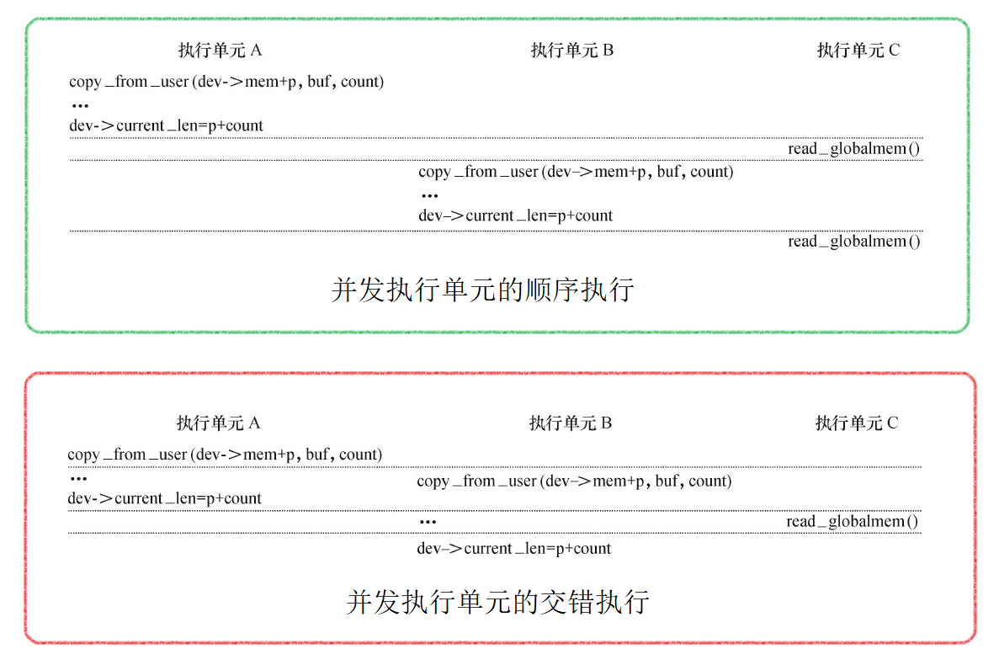
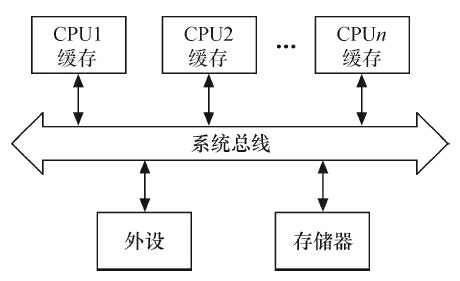
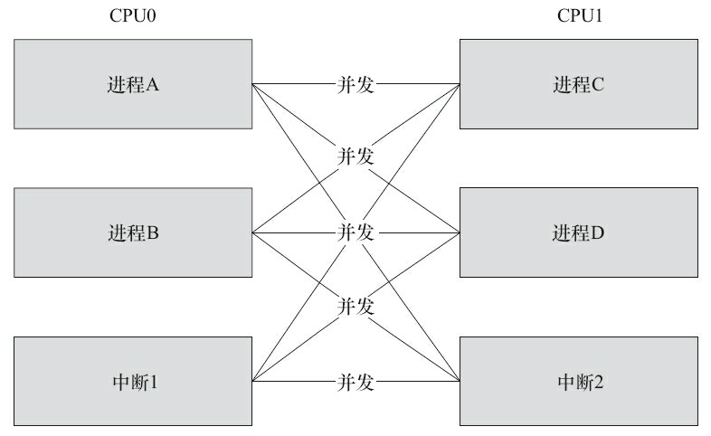
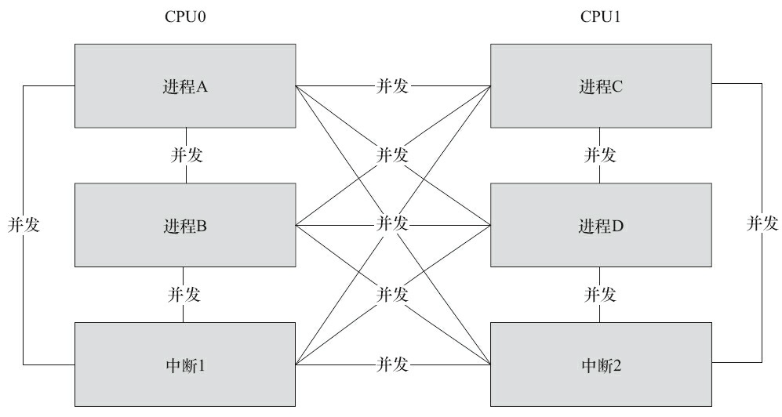
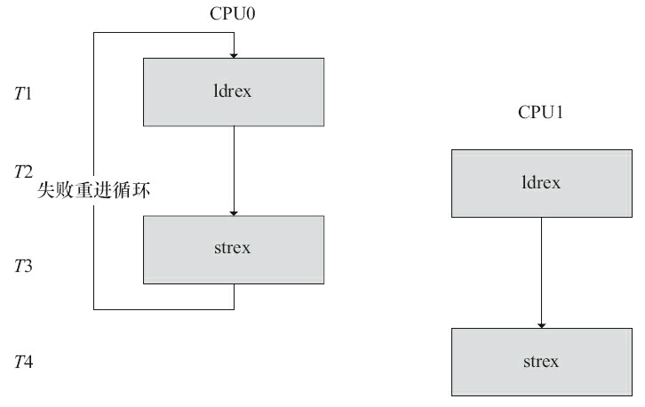
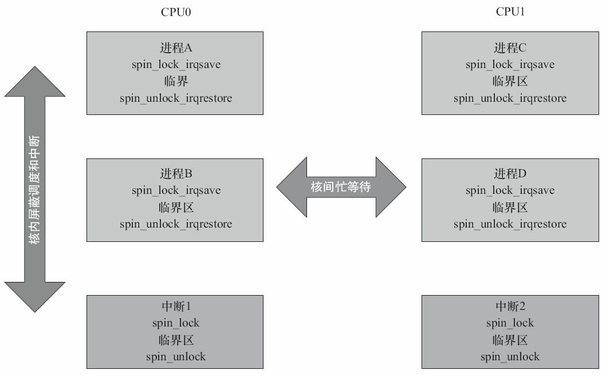
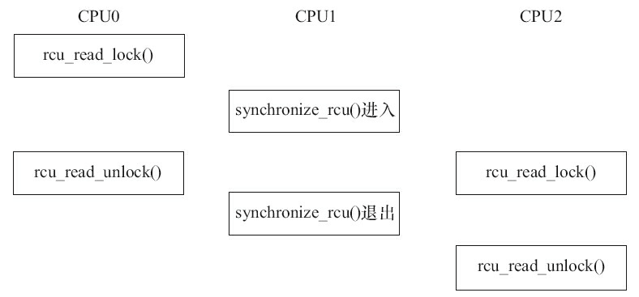
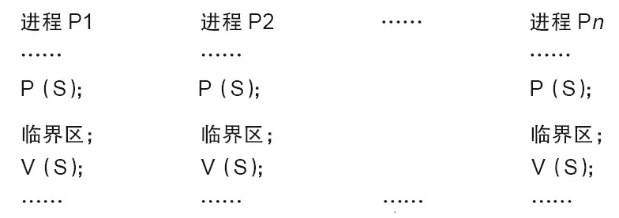

# 设备驱动中的并发控制

## 1 并发与竞态

并发(Concurrency)指的是多个执行单元同时、并行被执行，而并发的执行单元对共享资源(硬件资源和软件上的全局变量、静态变量等)的访问则很容易导致竞态(Race Conditions)。例如，对于globalmem设备，假设一个执行单元A对其写入3000个字符“a”，而另一个执行单元B对其写入4000个“b”，第三个执行单元C读取globalmem的所有字符。如果执行单元A、B的写操作绿色框图那样顺序发生，执行单元C的读操作当然不会有什么问题。但是，如果执行单元A、B按红色框图那样被执行，而执行单元C又“不合时宜”地读，则会读出3000个“b”。



比上面更复杂、更混乱的并发大量存在于设备驱动中，只要并发的多个执行单元存在对共享资源的访问，竞态就可能发生。在Linux内核中，主要的竞态发生于如下几种情况。

### 1.1 对称多处理器(SMP)的多个CPU

SMP是一种紧耦合、共享存储的系统模型，其体系结构如下图所示，它的特点是多个CPU使用共同的系统总线，因此可访问共同的外设和储存器。



在SMP的情况下，两个核(CPU0和CPU1)的竞态可能发生于CPU0的进程与CPU1的进程之间、CPU0的进程与CPU1的中断之间以及CPU0的中断与CPU1的中断之间，下图中任何一条线连接的两个实体都有核间并发可能性。



### 1.2 单CPU内进程与抢占它的进程

Linux 2.6以后的内核支持内核抢占调度，一个进程在内核执行的时候可能耗完了自己的时间片(timeslice)，也可能被另一个高优先级进程打断，进程与抢占它的进程访问共享资源的情况类似于SMP的多个CPU。

### 1.3 中断(硬中断、软中断、Tasklet、底半部)与进程之间

中断可以打断正在执行的进程，如果中断服务程序访问进程正在访问的资源，则竞态也会发生。

此外，中断也有可能被新的更高优先级的中断打断，因此，多个中断之间本身也可能引起并发而导致竞态。但是Linux 2.6.35之后，就取消了中断的嵌套。老版本的内核可以在申请中断时，设置标记IRQF_DISABLED以避免中断嵌套，由于新内核直接就默认不嵌套中断，这个标记反而变得无用了。

上述并发的发生除了SMP是真正的并行以外，其他的都是单核上的“宏观并行，微观串行”，但其引发的实质问题和SMP相似。下图再现了SMP情况下总的竞争状态可能性，既包含某一个核内的，也包括两个核间的竞态。



解决竞态问题的途径是保证对共享资源的互斥访问，所谓互斥访问是指一个执行单元在访问共享资源的时候，其他的执行单元被禁止访问。

访问共享资源的代码区域称为临界区(Critical Sections)，临界区需要被以某种互斥机制加以保护。中断屏蔽、原子操作、自旋锁、信号量、互斥体等是Linux设备驱动中可采用的互斥途径。

## 2 编译乱序和执行乱序

理解Linux内核的锁机制，还需要理解编译器和处理器的特点。比如下面一段代码，写端申请一个新的struct foo结构体并初始化其中的a、b、c，之后把结构体地址赋值给全局gp指针：

```c
struct foo {
    int a;
    int b;
    int c;
};
struct foo *gp = NULL;
/* . . . */
p = kmalloc(sizeof(*p), GFP_KERNEL);
p->a = 1;
p->b = 2;
p->c = 3;
gp = p;
```

而读端如果简单做如下处理，则程序的运行可能是不符合预期的：

```c
p = gp;
if (p != NULL) {
    do_something_with(p->a, p->b, p->c);
}
```

有两种可能的原因会造成程序出错，一种可能性是编译乱序，另外一种可能性是执行乱序。

### 2.1 编译乱序

C语言顺序的“p->a=1；p->b=2；p->c=3；gp=p；”的编译结果的指令顺序可能是gp的赋值指令发生在a、b、c的赋值之前。现代的高性能编译器在目标码优化上都具备对指令进行乱序优化的能力。编译器可以对访存的指令进行乱序，减少逻辑上不必要的访存，以及尽量提高Cache命中率和CPU的Load/Store单元的工作效率。因此在打开编译器优化以后，看到生成的汇编码并没有严格按照代码的逻辑顺序，这是正常的。

解决编译乱序问题，需要通过barrier()编译屏障进行。我们可以在代码中**设置barrier()屏障**，这个屏障可以阻挡编译器的优化。对于编译器来说，设置编译屏障可以保证屏障前的语句和屏障后的语句不乱“串门”。

```c
#define barrier() __asm__ __volatile__("": : :"memory")
```

关于解决编译乱序的问题，C语言volatile关键字的作用较弱，它更多的只是避免内存访问行为的合并，对C编译器而言，volatile是暗示除了当前的执行线索以外，其他的执行线索也可能改变某内存，所以它的含义是“易变的”。换句话说，就是如果线程A读取var这个内存中的变量两次而没有修改var，编译器可能觉得读一次就行了，第2次直接取第1次的结果。但是如果加了volatile关键字来形容var，则就是告诉编译器线程B、线程C或者其他执行实体可能把var改掉了，因此编译器就不会再把线程A代码的第2次内存读取优化掉了。另外，volatile也不具备保护临界资源的作用。总之，Linux内核明显不太喜欢volatile。

### 2.2 执行乱序

编译乱序是编译器的行为，而执行乱序则是处理器运行时的行为。执行乱序是指即便编译的二进制指令的顺序按照“p->a=1；p->b=2；p->c=3；gp=p；”排放，在处理器上执行时，后发射的指令还是可能先执行完，这是处理器的“乱序执行(Out-of-Order Execution)”策略。高级的CPU可以根据自己缓存的组织特性，将访存指令重新排序执行。连续地址的访问可能会先执行，因为这样缓存命中率高。有的还允许访存的非阻塞，即如果前面一条访存指令因为缓存不命中，造成长延时的存储访问时，后面的访存指令可以先执行，以便从缓存中取数。因此，即使是从汇编上看顺序正确的指令，其执行的顺序也是不可预知的。

举个例子，ARM v6/v7的处理器会对以下指令顺序进行优化。

```c
LDR r0， [r1]; // 将从由 r1 指定的内存地址加载数据到 r0 寄存器中。
STR r2， [r3]; // 将把 r2 寄存器中的数据存储到由 r3 指定的内存地址中。
```

假设第一条LDR指令导致缓存未命中，这样缓存就会填充行，并需要较多的时钟周期才能完成。老的ARM处理器，比如ARM926EJ-S会等待这个动作完成，再执行下一条STR指令。而ARM v6/v7处理器会识别出下一条指令(STR)且不需要等待第一条指令(LDR)完成(并不依赖于r0的值)，即会先执行STR指令，而不是等待LDR指令完成。

对于大多数体系结构而言，尽管每个CPU都是乱序执行，但是这一乱序对于单核的程序执行是不可见的，因为单个CPU在碰到依赖点(后面的指令依赖于前面指令的执行结果)的时候会等待，所以程序员可能感觉不到这个乱序过程。但是这个依赖点等待的过程，在SMP处理器里面对于其他核是不可见的。比如若在CPU0上执行：

```c
while (f == 0);
print x;
```

CPU1上执行：

```c
x = 42;
f = 1;
```

我们不能武断地认为CPU0上打印的x一定等于42，因为CPU1上即便“f=1”编译在“x=42”后面，执行时仍然可能先于“x=42”完成，所以这个时候CPU0上打印的x不一定就是42。

处理器为了解决多核间一个核的内存行为对另外一个核可见的问题，引入了一些内存屏障的指令。譬如，ARM处理器的屏障指令包括：

| **屏障指令**        | **描述**                                                     |
| ------------------- | ------------------------------------------------------------ |
| DMB(数据内存屏障) | 在DMB之后的显式内存访问执行前，保证所有在DMB指令之前的内存访问完成。 |
| DSB(数据同步屏障) | 等待所有在DSB指令之前的指令完成(位于此指令前的所有显式内存访问均完成，位于此指令前的所有缓存、跳转预测和TLB维护操作全部完成)。 |
| ISB(指令同步屏障) | Flush流水线，使得所有ISB之后执行的指令都是从缓存或内存中获得的。 |

Linux内核的自旋锁、互斥体等互斥逻辑，需要用到上述指令：在请求获得锁时，调用屏障指令；在解锁时，也需要调用屏障指令。

```assembly
LOCKED EQU 1
UNLOCKED EQU 0
lock_mutex
    ; 互斥量是否锁定?
    LDREX r1, [r0]          ; 检查是否锁定
    CMP r1, #LOCKED         ; 和"locked"比较
    WFEEQ                   ; 互斥量已经锁定，进入休眠
    BEQ lock_mutex          ; 被唤醒，重新检查互斥量是否锁定
    ; 尝试锁定互斥量
    MOV r1, #LOCKED
    STREX r2, r1, [r0]      ; 尝试锁定
    CMP r2, #0x0            ; 检查STR指令是否完成
    BNE lock_mutex          ; 如果失败，重试
    DMB                     ; 进入被保护的资源前需要隔离，保证互斥量已经被更新
    BX lr

unlock_mutex
    DMB                     ; 保证资源的访问已经结束
    MOV r1, #UNLOCKED       ; 向锁定域写"unlocked"
    STR r1, [r0]

    DSB                     ; 保证在CPU唤醒前完成互斥量状态更新
    SEV                     ; 像其他CPU发送事件，唤醒任何等待事件的CPU

    BX lr
```

前面提到每个CPU都是乱序执行，但是单个CPU在碰到依赖点的时候会等待，所以执行乱序对单核不一定可见。但是，当程序在访问外设的寄存器时，这些寄存器的访问顺序在CPU的逻辑上构不成依赖关系，但是从外设的逻辑角度来讲，可能需要固定的寄存器读写顺序，这个时候，也需要使用CPU的内存屏障指令。

在Linux内核中，定义了读写屏障mb()、读屏障rmb()、写屏障wmb()、以及作用于寄存器读写的\_\_iormb()、\_\_iowmb()这样的屏障API。读写寄存器的readl_relaxed()和readl()、writel_relaxed()和writel()API的区别就体现在有无屏障方面。

```c
#define readb(c)        ({ u8 __v = readb_relaxed(c); __iormb(); __v; })
#define readw(c)        ({ u16 __v = readw_relaxed(c); __iormb(); __v; })
#define readl(c)        ({ u32 __v = readl_relaxed(c); __iormb(); __v; })
#define writeb(v,c)     ({ __iowmb(); writeb_relaxed(v,c); })
#define writew(v,c)     ({ __iowmb(); writew_relaxed(v,c); })
#define writel(v,c)     ({ __iowmb(); writel_relaxed(v,c); })
```

比如我们通过writel_relaxed()写完DMA的开始地址、结束地址、大小之后，我们一定要调用writel()来启动DMA。

```c
writel_relaxed(DMA_SRC_REG, src_addr);
writel_relaxed(DMA_DST_REG, dst_addr);
writel_relaxed(DMA_SIZE_REG, size);
writel(DMA_ENABLE, 1);
```

## 3 中断屏蔽

在单CPU范围内避免竞态的一种简单而有效的方法是在进入临界区之前屏蔽系统的中断，但是在驱动编程中不值得推荐，驱动通常需要考虑跨平台特点而不假定自己在单核上运行。CPU一般都具备屏蔽中断和打开中断的功能，这项功能可以保证正在执行的内核执行路径不被中断处理程序所抢占，防止某些竞态条件的发生。具体而言，中断屏蔽将使得中断与进程之间的并发不再发生，而且，由于Linux内核的进程调度等操作都依赖中断来实现，内核抢占进程之间的并发也得以避免了。

```c
local_irq_disable()     /* 屏蔽中断 */
. . .
critical section        /* 临界区 */
. . .
local_irq_enable()      /* 开中断 */
```

其底层的实现原理是让CPU本身不响应中断，比如，对于ARM处理器而言，其底层的实现是屏蔽ARM CPSR的I位：

```c
static inline void arch_local_irq_disable(void)
{
    asm volatile(
        " cpsid i @ arch_local_irq_disable"
        :
        :
        : "memory", "cc");
}
```

由于Linux的异步I/O、进程调度等很多重要操作都依赖于中断，中断对于内核的运行非常重要，在屏蔽中断期间所有的中断都无法得到处理，因此长时间屏蔽中断是很危险的，这有可能造成数据丢失乃至系统崩溃等后果。这就要求在屏蔽了中断之后，当前的内核执行路径应当尽快地执行完临界区的代码。

local_irq_disable()和local_irq_enable()都只能禁止和使能本CPU内的中断，因此，并不能解决SMP多CPU引发的竞态。因此，单独使用中断屏蔽通常不是一种值得推荐的避免竞态的方法(换句话说，驱动中使用local_irq_disable/enable()通常意味着一个bug)，它适合与下文将要介绍的自旋锁联合使用。

与local_irq_disable()不同的是，local_irq_save(flags)除了进行禁止中断的操作以外，还保存目前CPU的中断位信息，local_irq_restore(flags)进行的是与local_irq_save(flags)相反的操作。对于ARM处理器而言，其实就是保存和恢复CPSR。

如果只是想禁止中断的底半部，应使用local_bh_disable()，使能被local_bh_disable()禁止的底半部应该调用local_bh_enable()。

## 4 原子操作

原子操作可以保证对一个整型数据的修改是排他性的。Linux内核提供了一系列函数来实现内核中的原子操作，这些函数又分为两类，分别针对位和整型变量进行原子操作。位和整型变量的原子操作都依赖于底层CPU的原子操作，因此所有这些函数都与CPU架构密切相关。对于ARM处理器而言，底层使用LDREX和STREX指令，比如atomic_inc()底层的实现会调用到atomic_add()，其代码如下：

```c
static inline void atomic_add(int i, atomic_t *v)
{
    unsigned long tmp;
    int result;
    prefetchw(&v->counter);
    __asm__ __volatile__("@ atomic_add\n"
    "1: ldrex %0, [%3]\n"
    " add %0, %0, %4\n"
    " strex %1, %0, [%3]\n"
    " teq %1, #0\n"
    " bne 1b"
    : "=&r" (result), "=&r" (tmp), "+Qo" (v->counter)
    : "r" (&v->counter), "Ir" (i)
    : "cc");
}
```

ldrex指令跟strex配对使用，可以让总线监控ldrex到strex之间有无其他的实体存取该地址，如果有并发的访问，执行strex指令时，第一个寄存器的值被设置为1(Non-Exclusive Access)并且存储的行为也不成功；如果没有并发的存取，strex在第一个寄存器里设置0(Exclusive Access)并且存储的行为也是成功的。本例中，如果两个并发实体同时调用ldrex+strex，如下图所示，在T3时间点上，CPU0的strex会执行失败，在T4时间点上CPU1的strex会执行成功。所以CPU0和CPU1之间只有CPU1执行成功了，执行strex失败的CPU0的“teq%1，#0”判断语句不会成立，于是失败的CPU0通过“bne 1b”再次进入ldrex。ldrex和strex的这一过程不仅适用于多核之间的并发，也适用于同一个核内部并发的情况。



### 4.1 整形原子操作

1.设置原子变量的值

```c
void atomic_set(atomic_t *v, int i); /* 设置原子变量的值为i */
atomic_t v = ATOMIC_INIT(0); /* 定义原子变量v并初始化为0 */
```

2.获取原子变量的值

```c
atomic_read(atomic_t *v); /* 返回原子变量的值*/
```

3.原子变量加/减

```c
void atomic_add(int i, atomic_t *v); /* 原子变量增加i */
void atomic_sub(int i, atomic_t *v); /* 原子变量减少i */
```

4.原子变量自增/自减

```c
void atomic_inc(atomic_t *v); /* 原子变量增加1 */
void atomic_dec(atomic_t *v); /* 原子变量减少1 */
```

5.操作并测试

```c
int atomic_inc_and_test(atomic_t *v);
int atomic_dec_and_test(atomic_t *v);
int atomic_sub_and_test(int i, atomic_t *v);
```

上述操作对原子变量执行自增、自减和减操作后(注意没有加)，测试其是否为0，为0返回true，否
则返回false。

6.操作并返回

```c
int atomic_add_return(int i, atomic_t *v);
int atomic_sub_return(int i, atomic_t *v);
int atomic_inc_return(atomic_t *v);
int atomic_dec_return(atomic_t *v);
```

上述操作对原子变量进行加/减和自增/自减操作，并返回新的值。

### 4.2 位原子操作

1.设置位

```c
void set_bit(nr, void *addr);
```

上述操作设置addr地址的第nr位，所谓设置位即是将位写为1。

2.清除位

```c
void clear_bit(nr, void *addr);
```

上述操作清除addr地址的第nr位，所谓清除位即是将位写为0。

3.改变位

```c
void change_bit(nr, void *addr);
```

上述操作对addr地址的第nr位进行反置。

4.测试位

```c
test_bit(nr, void *addr);
```

上述操作返回addr地址的第nr位。

5.测试并操作位

```c
int test_and_set_bit(nr, void *addr);
int test_and_clear_bit(nr, void *addr);
int test_and_change_bit(nr, void *addr);
```

上述test_and_xxx_bit(nr，void \*addr)操作等同于执行test_bit(nr，void \*addr)后再执行xxx_bit(nr，void \*addr)。

## 5 自旋锁

### 5.1 自旋锁的使用

自旋锁(Spin Lock)是一种典型的对临界资源进行互斥访问的手段，其名称来源于它的工作方式。为了获得一个自旋锁，在某CPU上运行的代码需先执行一个原子操作，该操作测试并设置(Test-And-Set)某个内存变量。由于它是原子操作，所以在该操作完成之前其他执行单元不可能访问这个内存变量。如果测试结果表明锁已经空闲，则程序获得这个自旋锁并继续执行；如果测试结果表明锁仍被占用，程序将在一个小的循环内重复这个“测试并设置”操作，即进行所谓的“自旋”，通俗地说就是“在原地打转”。理解自旋锁最简单的方法是把它作为一个变量看待，该变量把一个临界区标记为“我当前在运行，请稍等一会”或者标记为“我当前不在运行，可以被使用”。如果A执行单元首先进入例程，它将持有自旋锁；当B执行单元试图进入同一个例程时，将获知自旋锁已被持有，需等到A执行单元释放后才能进入。

1.定义自旋锁

```c
spinlock_t lock;
```

2.初始化自旋锁

```c
spin_lock_init(lock)
```

该宏用于动态初始化自旋锁lock。

3.获得自旋锁

```c
spin_lock(lock)
```

该宏用于获得自旋锁lock，如果能够立即获得锁，它就马上返回，否则，它将在那里自旋，直到该自
旋锁的保持者释放。

```c
spin_trylock(lock)
```

该宏尝试获得自旋锁lock，如果能立即获得锁，它获得锁并返回true，否则立即返回false，实际上不再“在原地打转”。

4.释放自旋锁

```c
spin_unlock(lock)
```

该宏释放自旋锁lock，它与spin_trylock或spin_lock配对使用。

自旋锁主要针对SMP或单CPU但内核可抢占的情况，对于单CPU和内核不支持抢占的系统，自旋锁退化为空操作。在单CPU和内核可抢占的系统中，自旋锁持有期间中内核的抢占将被禁止。由于内核可抢占的单CPU系统的行为实际上很类似于SMP系统，因此，在这样的单CPU系统中使用自旋锁仍十分必要。另外，在多核SMP的情况下，任何一个核拿到了自旋锁，该核上的抢占调度也暂时禁止了，但是没有禁止另外一个核的抢占调度。

尽管用了自旋锁可以保证临界区不受别的CPU和本CPU内的抢占进程打扰，但是得到锁的代码路径在执行临界区的时候，还可能受到中断和底半部(BH，稍后的章节会介绍)的影响。为了防止这种影响，就需要用到自旋锁的衍生。spin_lock()/spin_unlock()是自旋锁机制的基础，它们和关中断local_irq_disable()/开中断local_irq_enable()、关底半部local_bh_disable()/开底半部local_bh_enable()、关中断并保存状态字local_irq_save()/开中断并恢复状态字local_irq_restore()结合就形成了整套自旋锁机制，关系如下：

```c
spin_lock_irq() = spin_lock() + local_irq_disable()
spin_unlock_irq() = spin_unlock() + local_irq_enable()
spin_lock_irqsave() = spin_lock() + local_irq_save()
spin_unlock_irqrestore() = spin_unlock() + local_irq_restore()
spin_lock_bh() = spin_lock() + local_bh_disable()
spin_unlock_bh() = spin_unlock() + local_bh_enable()
```

spin_lock_irq()、spin_lock_irqsave()、spin_lock_bh()类似函数会为自旋锁的使用系好“安全带”以避免突如其来的中断驶入对系统造成的伤害。

在多核编程的时候，如果进程和中断可能访问同一片临界资源，我们一般需要在进程上下文中调用spin_lock_irqsave()/spin_unlock_irqrestore()，在中断上下文中调用spin_lock()/spin_unlock()，如下图所示。这样，在CPU0上，无论是进程上下文，还是中断上下文获得了自旋锁，此后，如果CPU1无论是进程上下文，还是中断上下文，想获得同一自旋锁，都必须忙等待，这避免一切核间并发的可能性。同时，由于每个核的进程上下文持有锁的时候用的是spin_lock_irqsave()，所以该核上的中断是不可能进入的，这避免了核内并发的可能性。



>[!NOTE]
>
>驱动工程师应谨慎使用自旋锁，而且在使用中还要特别注意如下几个问题：
>
>- 自旋锁实际上是忙等锁，当锁不可用时，CPU一直循环执行“测试并设置”该锁直到可用而取得该锁，CPU在等待自旋锁时不做任何有用的工作，仅仅是等待。因此，只有在占用锁的时间极短的情况下，使用自旋锁才是合理的。当临界区很大，或有共享设备的时候，需要较长时间占用锁，使用自旋锁会降低系统的性能。
>- 自旋锁可能导致系统死锁。引发这个问题最常见的情况是递归使用一个自旋锁，即如果一个已经拥有某个自旋锁的CPU想第二次获得这个自旋锁，则该CPU将死锁。
>- 在自旋锁锁定期间不能调用可能引起进程调度的函数。如果进程获得自旋锁之后再阻塞，如调用copy_from_user()、copy_to_user()、kmalloc()和msleep()等函数，则可能导致内核的崩溃。
>- 在单核情况下编程的时候，也应该认为自己的CPU是多核的，驱动特别强调跨平台的概念。比如，在单CPU的情况下，若中断和进程可能访问同一临界区，进程里调用spin_lock_irqsave()是安全的，在中断里其实不调用spin_lock()也没有问题，因为spin_lock_irqsave()可以保证这个CPU的中断服务程序不可能执行。但是，若CPU变成多核，spin_lock_irqsave()不能屏蔽另外一个核的中断，所以另外一个核就可能造成并发问题。因此，无论如何，我们在中断服务程序里也应该调用spin_lock()。

### 5.2 读写自旋锁

自旋锁不关心锁定的临界区究竟在进行什么操作，不管是读还是写，它都一视同仁。即便多个执行单元同时读取临界资源也会被锁住。实际上，对共享资源并发访问时，多个执行单元同时读取它是不会有问题的，自旋锁的衍生锁读写自旋锁(rwlock)可允许读的并发。读写自旋锁是一种比自旋锁粒度更小的锁机制，它保留了“自旋”的概念，但是在写操作方面，只能最多有1个写进程，在读操作方面，同时可以有多个读执行单元。当然，读和写也不能同时进行。

1.定义和初始化读写自旋锁

```c
rwlock_t my_rwlock;
rwlock_init(&my_rwlock); /* 动态初始化 */
```

2.读锁定

```c
void read_lock(rwlock_t *lock);
void read_lock_irqsave(rwlock_t *lock, unsigned long flags);
void read_lock_irq(rwlock_t *lock);
void read_lock_bh(rwlock_t *lock);
```

3.读解锁

```c
void read_unlock(rwlock_t *lock);
void read_unlock_irqrestore(rwlock_t *lock, unsigned long flags);
void read_unlock_irq(rwlock_t *lock);
void read_unlock_bh(rwlock_t *lock);
```

在对共享资源进行读取之前，应该先调用读锁定函数，完成之后应调用读解锁函数。

read_lock_irqsave()、read_lock_irq()和read_lock_bh()也分别是read_lock()分别与local_irq_save()、local_irq_disable()和local_bh_disable()的组合，读解锁函数read_unlock_irqrestore()、read_unlock_irq()、read_unlock_bh()的情况与此类似。

4.写锁定

```c
void write_lock(rwlock_t *lock);
void write_lock_irqsave(rwlock_t *lock, unsigned long flags);
void write_lock_irq(rwlock_t *lock);
void write_lock_bh(rwlock_t *lock);
int write_trylock(rwlock_t *lock);
```

5.写解锁

```c
void write_unlock(rwlock_t *lock);
void write_unlock_irqrestore(rwlock_t *lock, unsigned long flags);
void write_unlock_irq(rwlock_t *lock);
void write_unlock_bh(rwlock_t *lock);
```

write_lock_irqsave()、write_lock_irq()、write_lock_bh()分别是write_lock()与local_irq_save()、local_irq_disable()和local_bh_disable()的组合，写解锁函数write_unlock_irqrestore()、write_unlock_irq()、write_unlock_bh()的情况与此类似。在对共享资源进行写之前，应该先调用写锁定函数，完成之后应调用写解锁函数。和spin_trylock()一样，write_trylock()也只是尝试获取读写自旋锁，不管成功失败，都会立即返回。

### 5.3 顺序锁

顺序锁(seqlock)是对读写锁的一种优化，若使用顺序锁，读执行单元不会被写执行单元阻塞，也就是说，读执行单元在写执行单元对被顺序锁保护的共享资源进行写操作时仍然可以继续读，而不必等待写执行单元完成写操作，写执行单元也不需要等待所有读执行单元完成读操作才去进行写操作。但是，写执行单元与写执行单元之间仍然是互斥的，即如果有写执行单元在进行写操作，其他写执行单元必须自旋在那里，直到写执行单元释放了顺序锁。

对于顺序锁而言，尽管读写之间不互相排斥，但是如果读执行单元在读操作期间，写执行单元已经发生了写操作，那么，读执行单元必须重新读取数据，以便确保得到的数据是完整的。所以，在这种情况下，读端可能反复读多次同样的区域才能读到有效的数据。在Linux内核中，写执行单元涉及的顺序锁操作如下。

1.获得顺序锁

```c
void write_seqlock(seqlock_t *sl);
int write_tryseqlock(seqlock_t *sl);
write_seqlock_irqsave(lock, flags)
write_seqlock_irq(lock)
write_seqlock_bh(lock)
```

其中，

```c
write_seqlock_irqsave() = loal_irq_save() + write_seqlock()
write_seqlock_irq() = local_irq_disable() + write_seqlock()
write_seqlock_bh() = local_bh_disable() + write_seqlock()
```

2.释放顺序锁

```c
void write_sequnlock(seqlock_t *sl);
write_sequnlock_irqrestore(lock, flags)
write_sequnlock_irq(lock)
write_sequnlock_bh(lock)
```

其中，

```c
write_sequnlock_irqrestore() = write_sequnlock() + local_irq_restore()
write_sequnlock_irq() = write_sequnlock() + local_irq_enable()
write_sequnlock_bh() = write_sequnlock() + local_bh_enable()
```

写执行单元使用顺序锁的模式如下：

```c
write_seqlock(&seqlock_a);
.../* 写操作代码块 */
write_sequnlock(&seqlock_a);
```

因此，对写执行单元而言，它的使用与自旋锁相同。

读执行单元涉及的顺序锁操作如下。

1.读开始

```c
unsigned read_seqbegin(const seqlock_t *sl);
read_seqbegin_irqsave(lock, flags)
```

读执行单元在对被顺序锁s1保护的共享资源进行访问前需要调用该函数，该函数返回顺序锁s1的当前顺序号。其中，

```c
read_seqbegin_irqsave() = local_irq_save() + read_seqbegin()
```

2.重读

```c
int read_seqretry(const seqlock_t *sl, unsigned iv);
read_seqretry_irqrestore(lock, iv, flags)
```

读执行单元在访问完被顺序锁s1保护的共享资源后需要调用该函数来检查，在读访问期间是否有写操作。如果有写操作，读执行单元就需要重新进行读操作。其中，

```c
read_seqretry_irqrestore() = read_seqretry() + local_irq_restore()
```

读执行单元使用顺序锁的模式如下：

```c
do {
    seqnum = read_seqbegin(&seqlock_a);
    /* 读操作代码块 */
    ...
} while (read_seqretry(&seqlock_a, seqnum));
```

### 5.4 读-复制-更新

RCU(Read-Copy-Update，读-复制-更新)，它是基于其原理命名的。RCU并不是新的锁机制，早在20世纪80年代就有了这种机制，而在Linux中是在开发内核2.5.43时引入该技术的，并正式包含在2.6内核中。

不同于自旋锁，使用RCU的读端没有锁、内存屏障、原子指令类的开销，几乎可以认为是直接读(只是简单地标明读开始和读结束)，而RCU的写执行单元在访问它的共享资源前首先复制一个副本，然后对副本进行修改，最后使用一个回调机制在适当的时机把指向原来数据的指针重新指向新的被修改的数据，这个时机就是所有引用该数据的CPU都退出对共享数据读操作的时候。等待适当时机的这一时期称为宽限期(Grace Period)。

假设进程A要修改链表中某个节点N的成员a、b。自旋锁的思路是排他性地访问这个链表，等所有其他持有自旋锁的进程或者中断把自旋锁释放后，进程A再拿到自旋锁访问链表并找到N节点，之后修改它的a、b两个成员，完成后解锁。而RCU的思路则不同，它直接制造一个新的节点M，把N的内容复制给M，之后在M上修改a、b，并用M来代替N原本在链表的位置。之后进程A等待在链表前期已经存在的所有读端结束后(即宽限期，通过下文说的synchronize_rcu()API完成)，再释放原来的N。用代码来描述这个逻辑就是：

```c
struct foo {
    struct list_head list;
    int a;
    int b;
    int c;
};

LIST_HEAD(head);

/* . . . */
p = search(head, key);
if (p == NULL) {
/* Take appropriate action, unlock, and return. */
}q
= kmalloc(sizeof(*p), GFP_KERNEL);
*q = *p;
q->b = 2;
q->c = 3;
list_replace_rcu(&p->list, &q->list);
synchronize_rcu();
kfree(p);
```

RCU可以看作读写锁的高性能版本，相比读写锁，RCU的优点在于既允许多个读执行单元同时访问被保护的数据，又允许多个读执行单元和多个写执行单元同时访问被保护的数据。但是，RCU不能替代读写锁，因为如果写比较多时，对读执行单元的性能提高不能弥补写执行单元同步导致的损失。因为使用RCU时，写执行单元之间的同步开销会比较大，它需要延迟数据结构的释放，复制被修改的数据结构，它也必须使用某种锁机制来同步并发的其他写执行单元的修改操作。

Linux中提供的RCU操作包括如下4种。

1.读锁定

```c
rcu_read_lock()
rcu_read_lock_bh()
```

2.读解锁

```c
rcu_read_unlock()
rcu_read_unlock_bh()
使用RCU进行读的模式如下：
rcu_read_lock()
.../* 读临界区*/
rcu_read_unlock()
```

3.同步RCU

```c
synchronize_rcu()
```

该函数由RCU写执行单元调用，它将阻塞写执行单元，直到当前CPU上所有的已经存在(Ongoing)的读执行单元完成读临界区，写执行单元才可以继续下一步操作。synchronize_rcu()并不需要等待后续(Subsequent)读临界区的完成，如下图所示。



探测所有的rcu_read_lock()被rcu_read_unlock()结束的过程很类似Java语言垃圾回收的工作。

4.挂接回调

```c
void call_rcu(struct rcu_head *head,
              void (*func)(struct rcu_head *rcu));
```

函数call_rcu()也由RCU写执行单元调用，与synchronize_rcu()不同的是，它不会使写执行单元阻塞，因而可以在中断上下文或软中断中使用。该函数把函数func挂接到RCU回调函数链上，然后立即返回。挂接的回调函数会在一个宽限期结束(即所有已经存在的RCU读临界区完成)后被执行。

### 未完成，暂时没理解这些内容

## 6 信号量

信号量(Semaphore)是操作系统中最典型的用于同步和互斥的手段，信号量的值可以是0、1或者n。信号量与操作系统中的经典概念PV操作对应。

| P(S)                                                       | V(S)                                                       |
| ------------------------------------------------------------ | ------------------------------------------------------------ |
| ①将信号量S的值减1，即S=S-1；<br/>②如果S≥0，则该进程继续执行；否则该进程置为等待状态，排入等待队列。 | ①将信号量S的值加1，即S=S+1；<br/>②如果S>0，唤醒队列中等待信号量的进程。 |

Linux中与信号量相关的操作主要有下面几种。

1.定义信号量

下列代码定义名称为sem的信号量：

```c
struct semaphore sem;
```

2.初始化信号量

```c
void sema_init(struct semaphore *sem, int val);
```

该函数初始化信号量，并设置信号量sem的值为val。

3.获得信号量

```c
void down(struct semaphore * sem);
```

该函数用于获得信号量sem，它会导致睡眠，因此不能在中断上下文中使用。

```c
int down_interruptible(struct semaphore * sem);
```

该函数功能与down类似，不同之处为，因为down()进入睡眠状态的进程不能被信号打断，但因为down_interruptible()进入睡眠状态的进程能被信号打断，信号也会导致该函数返回，这时候函数的返回值非0。

```c
int down_trylock(struct semaphore * sem);
```

该函数尝试获得信号量sem，如果能够立刻获得，它就获得该信号量并返回0，否则，返回非0值。它不会导致调用者睡眠，可以在中断上下文中使用。

在使用down_interruptible()获取信号量时，对返回值一般会进行检查，如果非0，通常立即返回-ERESTARTSYS，如：

```c
if (down_interruptible(&sem))
    return -ERESTARTSYS;
```

4.释放信号量

```c
void up(struct semaphore * sem);
```

该函数释放信号量sem，唤醒等待者。

作为一种可能的互斥手段，信号量可以保护临界区，它的使用方式和自旋锁类似。与自旋锁相同，只有得到信号量的进程才能执行临界区代码。但是，与自旋锁不同的是，当获取不到信号量时，进程不会原地打转而是进入休眠等待状态。用作互斥时，信号量一般这样被使用：



由于新的Linux内核倾向于直接使用mutex作为互斥手段，信号量用作互斥不再被推荐使用。

信号量也可以用于同步，一个进程A执行down()等待信号量，另外一个进程B执行up()释放信号量，这样进程A就同步地等待了进程B。其过程类似：


此外，对于关心具体数值的生产者/消费者问题，使用信号量则较为合适。因为生产者/消费者问题也是一种同步问题。

> [!NOTE]
>
> 自旋锁和信号量是两种不同的进程同步机制，它们在实现方式、适用场景和性能方面存在一些区别：
>
> -  实现方式：自旋锁是一种基于忙等待的同步机制，当进程无法获取自旋锁时，它会不断循环等待，直到获取到锁为止。而信号量则是一种睡眠等待的同步机制，当进程无法获取信号量时，它会进入睡眠状态，等待其他进程释放锁。
> -  适用场景：自旋锁适用于临界区较小的情况，因为自旋锁会占用处理器资源，如果临界区较大，会导致处理器资源浪费。信号量适用于临界区较大的情况，因为信号量允许阻塞，可以让进程在等待过程中释放处理器资源。
> -  性能：自旋锁的性能相对较高，因为自旋锁不会引起进程切换，减少了进程上下文切换的开销。信号量的性能相对较低，因为进程在等待过程中需要进入睡眠状态，并由操作系统进行进程切换。

## 7 互斥体

尽管信号量已经可以实现互斥的功能，但是“正宗”的mutex在Linux内核中还是真实地存在着。

下面代码定义了名为my_mutex的互斥体并初始化它：

```c
struct mutex my_mutex;
mutex_init(&my_mutex);
```

下面的两个函数用于获取互斥体：

```c
void mutex_lock(struct mutex *lock);
int mutex_lock_interruptible(struct mutex *lock);
int mutex_trylock(struct mutex *lock);
```

mutex_lock()与mutex_lock_interruptible()的区别和down()与down_trylock()的区别完全一致，前者引起的睡眠不能被信号打断，而后者可以。mutex_trylock()用于尝试获得mutex，获取不到mutex时不会引起进程睡眠。

下列函数用于释放互斥体：

```c
void mutex_unlock(struct mutex *lock);
```

mutex的使用方法和信号量用于互斥的场合完全一样：

```c
struct mutex my_mutex; /* 定义mutex */
mutex_init(&my_mutex); /* 初始化mutex */
mutex_lock(&my_mutex); /* 获取mutex */
... /* 临界资源*/
mutex_unlock(&my_mutex); /* 释放mutex */
```

自旋锁和互斥体都是解决互斥问题的基本手段，面对特定的情况，应该如何取舍这两种手段呢？选择的依据是临界区的性质和系统的特点。

从严格意义上说，互斥体和自旋锁属于不同层次的互斥手段，前者的实现依赖于后者。在互斥体本身的实现上，为了保证互斥体结构存取的原子性，需要自旋锁来互斥。所以自旋锁属于更底层的手段。互斥体是进程级的，用于多个进程之间对资源的互斥，虽然也是在内核中，但是该内核执行路径是以进程的身份，代表进程来争夺资源的。如果竞争失败，会发生进程上下文切换，当前进程进入睡眠状态，CPU将运行其他进程。鉴于进程上下文切换的开销也很大，因此，只有当进程占用资源时间较长时，用互斥体才是较好的选择。

当所要保护的临界区访问时间比较短时，用自旋锁是非常方便的，因为它可节省上下文切换的时间。但是CPU得不到自旋锁会在那里空转直到其他执行单元解锁为止，所以要求锁不能在临界区里长时间停留，否则会降低系统的效率。

> [!NOTE]
>
> 可以总结出自旋锁和互斥体选用的3项原则：
>
> - 当锁不能被获取到时，使用互斥体的开销是进程上下文切换时间，使用自旋锁的开销是等待获取自旋锁(由临界区执行时间决定)。若临界区比较小，宜使用自旋锁，若临界区很大，应使用互斥体。
> - 互斥体所保护的临界区可包含可能引起阻塞的代码，而自旋锁则绝对要避免用来保护包含这样代码的临界区。因为阻塞意味着要进行进程的切换，如果进程被切换出去后，另一个进程企图获取本自旋锁，死锁就会发生。
> - 互斥体存在于进程上下文，因此，如果被保护的共享资源需要在中断或软中断情况下使用，则在互斥体和自旋锁之间只能选择自旋锁。当然，如果一定要使用互斥体，则只能通过mutex_trylock()方式进行，不能获取就立即返回以避免阻塞。

## 8 完成量

Linux提供了完成量(Completion，关于这个名词，至今没有好的翻译，笔者将其译为“完成量”)，它用于一个执行单元等待另一个执行单元执行完某事。

Linux中与完成量相关的操作主要有以下4种。

1.定义完成量

下列代码定义名为my_completion的完成量：

```c
struct completion my_completion;
```

2.初始化完成量

下列代码初始化或者重新初始化my_completion这个完成量的值为0(即没有完成的状态)：

```c
init_completion(&my_completion);
reinit_completion(&my_completion);
```

3.等待完成量

下列函数用于等待一个完成量被唤醒：

```c
void wait_for_completion(struct completion *c);
```

4.唤醒完成量

下面两个函数用于唤醒完成量：

```c
void complete(struct completion *c);
void complete_all(struct completion *c);
```

前者只唤醒一个等待的执行单元，后者释放所有等待同一完成量的执行单元。

完成量用于同步的流程一般如下：


