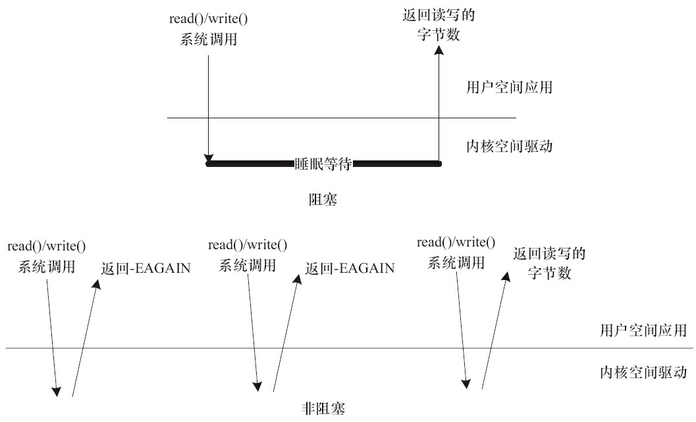
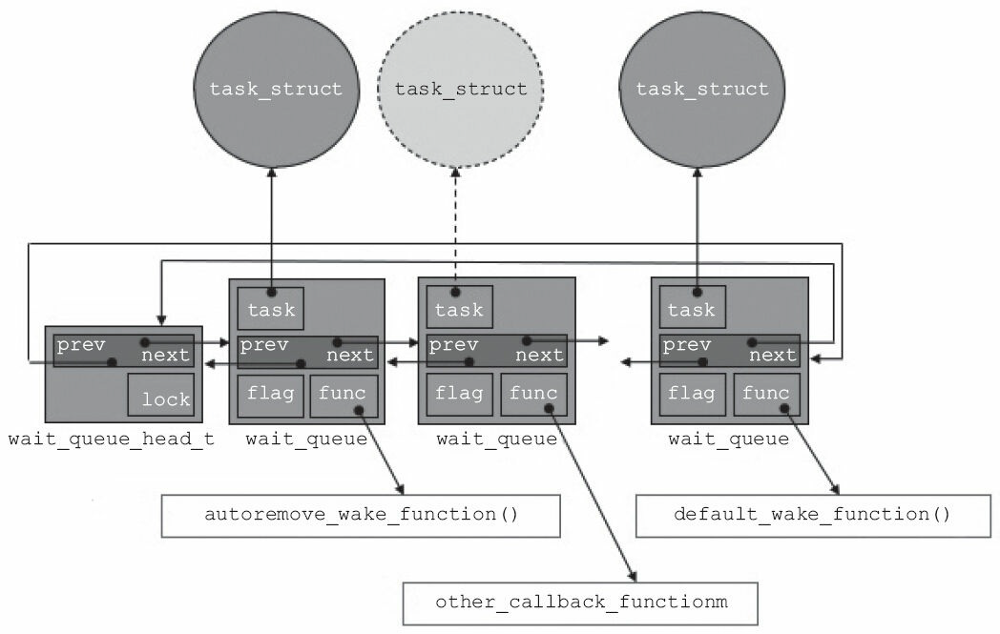
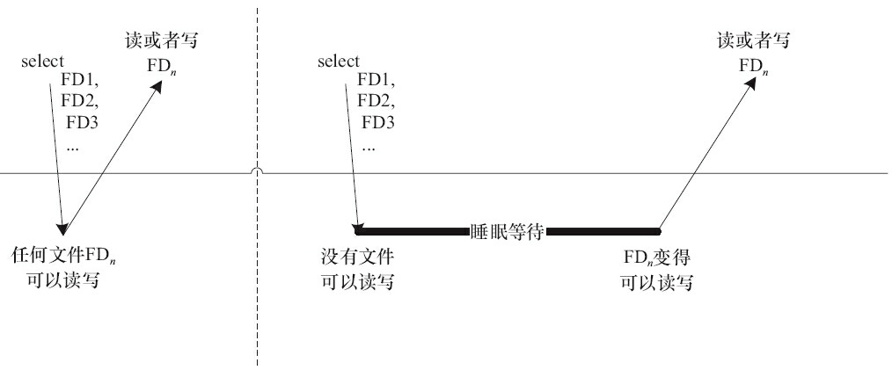

# 设备驱动中的阻塞和非阻塞IO

## 1 阻塞与非阻塞IO

阻塞操作是指在执行设备操作时，若不能获得资源，则挂起进程直到满足可操作的条件后再进行操作。被挂起的进程进入睡眠状态，被从调度器的运行队列移走，直到等待的条件被满足。而非阻塞操作的进程在不能进行设备操作时，并不挂起，它要么放弃，要么不停地查询，直至可以进行操作为止。

驱动程序通常需要提供这样的能力：当应用程序进行read()、write()等系统调用时，若设备的资源不能获取，而用户又希望以阻塞的方式访问设备，驱动程序应在设备驱动的xxx_read()、xxx_write()等操作中将进程阻塞直到资源可以获取，此后，应用程序的read()、write()等调用才返回，整个过程仍然进行了正确的设备访问，用户并没有感知到；若用户以非阻塞的方式访问设备文件，则当设备资源不可获取时，设备驱动的xxx_read()、xxx_write()等操作应立即返回，read()、write()等系统调用也随即被返回，应用程序收到-EAGAIN返回值。

如图8.1所示，在阻塞访问时，不能获取资源的进程将进入休眠，它将CPU资源“礼让”给其他进程。因为阻塞的进程会进入休眠状态，所以必须确保有一个地方能够唤醒休眠的进程，否则，进程就真的“寿终正寝”了。唤醒进程的地方最大可能发生在中断里面，因为在硬件资源获得的同时往往伴随着一个中断。而非阻塞的进程则不断尝试，直到可以进行I/O。



```c
//===== 阻塞地读串口一个字符 =====//
char buf;
fd = open("/dev/ttyS1", O_RDWR);
...
res = read(fd,&buf,1); /* 当串口上有输入时才返回 */
if(res==1)
    printf("%c\n", buf);

//===== 非阻塞地读串口一个字符 =====//
char buf;
fd = open("/dev/ttyS1", O_RDWR| O_NONBLOCK);
...
while(read(fd,&buf,1)!=1)
    continue; /* 串口上无输入也返回，因此要循环尝试读取串口 */
printf("%c\n", buf);
```

除了在打开文件时可以指定阻塞还是非阻塞方式以外，在文件打开后，也可以通过ioctl()和fcntl()改变读写的方式，如从阻塞变更为非阻塞或者从非阻塞变更为阻塞。例如，调用fcntl(fd，F_SETFL，O_NONBLOCK)可以设置fd对应的I/O为非阻塞。

### 1.1 等待队列

在Linux驱动程序中，可以使用等待队列(Wait Queue)来实现阻塞进程的唤醒。等待队列很早就作为一个基本的功能单位出现在Linux内核里了，它以队列为基础数据结构，与进程调度机制紧密结合，可以用来同步对系统资源的访问，在前面所讲述的信号量在内核中也依赖等待队列来实现。

Linux内核提供了如下关于等待队列的操作。

1.定义“等待队列头部”

```c
wait_queue_head_t my_queue;
```

wait_queue_head_t是__wait_queue_head结构体的一个typedef。

2.初始化“等待队列头部”

```c
init_waitqueue_head(&my_queue);
```

而下面的DECLARE_WAIT_QUEUE_HEAD()宏可以作为定义并初始化等待队列头部的“快捷方式”。

```c
DECLARE_WAIT_QUEUE_HEAD (name)
```

3.定义等待队列元素

```c
DECLARE_WAITQUEUE(name, tsk)
```

该宏用于定义并初始化一个名为name的等待队列元素。

4.添加/移除等待队列

```c
void add_wait_queue(wait_queue_head_t *q, wait_queue_t *wait);
void remove_wait_queue(wait_queue_head_t *q, wait_queue_t *wait);
```

add_wait_queue()用于将等待队列元素wait添加到等待队列头部q指向的双向链表中，而remove_wait_queue()用于将等待队列元素wait从由q头部指向的链表中移除。

5.等待事件

```c
wait_event(queue, condition)
wait_event_interruptible(queue, condition)
wait_event_timeout(queue, condition, timeout)
wait_event_interruptible_timeout(queue, condition, timeout)
```

等待第1个参数queue作为等待队列头部的队列被唤醒，而且第2个参数condition必须满足，否则继续阻塞。wait_event()和wait_event_interruptible()的区别在于后者可以被信号打断，而前者不能。加上_timeout后的宏意味着阻塞等待的超时时间，以jiffy为单位，在第3个参数的timeout到达时，不论condition是否满足，均返回。

6.唤醒队列

```c
void wake_up(wait_queue_head_t *queue);
void wake_up_interruptible(wait_queue_head_t *queue);
```

上述操作会唤醒以queue作为等待队列头部的队列中所有的进程。

wake_up()应该与wait_event()或wait_event_timeout()成对使用，而wake_up_interruptible()则应与wait_event_interruptible()或wait_event_interruptible_timeout()成对使用。wake_up()可唤醒处于TASK_INTERRUPTIBLE和TASK_UNINTERRUPTIBLE的进程，而wake_up_interruptible()只能唤醒处于TASK_INTERRUPTIBLE的进程。

7.在等待队列上睡眠

```c
sleep_on(wait_queue_head_t *q );
interruptible_sleep_on(wait_queue_head_t *q );
```

sleep_on()函数的作用就是将目前进程的状态置成TASK_UNINTERRUPTIBLE，并定义一个等待队列元素，之后把它挂到等待队列头部q指向的双向链表，直到资源可获得，q队列指向链接的进程被唤醒。

interruptible_sleep_on()与sleep_on()函数类似，其作用是将目前进程的状态置成TASK_INTERRUPTIBLE，并定义一个等待队列元素，之后把它附属到q指向的队列，直到资源可获得(q指引的等待队列被唤醒)或者进程收到信号。

sleep_on()函数应该与wake_up()成对使用，interruptible_sleep_on()应该与wake_up_interruptible()成对使用。

下面代码演示了一个在设备驱动中使用等待队列的模版，在进行写I/O操作的时候，判断设备是否可写，如果不可写且为阻塞I/O，则进程睡眠并挂起到等待队列。

```c
static ssize_t xxx_write(struct file *file, const char *buffer, size_t count,
                         loff_t *ppos)
{
    ...
    DECLARE_WAITQUEUE(wait, current); /* 定义等待队列元素 */
    add_wait_queue(&xxx_wait, &wait); /* 添加元素到等待队列 */

    /* 等待设备缓冲区可写 */
    do {
        avail = device_writable(...);
        if (avail < 0) {
            if (file->f_flags &O_NONBLOCK) { /* 非阻塞 */
                ret = -EAGAIN;
                goto out;
            }
            __set_current_state(TASK_INTERRUPTIBLE); /* 改变进程状态 */
            schedule(); /* 调度其他进程执行 */
            if (signal_pending(current)) { /* 如果是因为信号唤醒 */
                ret = -ERESTARTSYS;
                goto out;
            }
        }
    } while (avail < 0);

    /* 写设备缓冲区 */
    device_write(...)
        out:
    remove_wait_queue(&xxx_wait, &wait); /* 将元素移出xxx_wait指引的队列 */
    set_current_state(TASK_RUNNING); /* 设置进程状态为TASK_RUNNING */
    return ret;
}
```

几个要点如下：

- 如果是非阻塞访问(O_NONBLOCK被设置)，设备忙时，直接返回“-EAGAIN”。
- 对于阻塞访问，会调用__set_current_state(TASK_INTERRUPTIBLE)进行进程状态切换并显示通过“schedule()”调度其他进程执行。
- 醒来的时候要注意，由于调度出去的时候，进程状态是TASK_INTERRUPTIBLE，即浅度睡眠，所以唤醒它的有可能是信号，因此，我们首先通过signal_pending(current)了解是不是信号唤醒的，如果是，立即返回“-ERESTARTSYS”。

DECLARE_WAITQUEUE、add_wait_queue这两个动作加起来完成的效果如图8.2所示。在wait_queue_head_t指向的链表上，新定义的wait_queue元素被插入，而这个新插入的元素绑定了一个task_struct(当前做xxx_write的current，这也是DECLARE_WAITQUEUE使用“current”作为参数的原因)。



## 2 轮询操作

### 2.1 轮询的概念与作用

在用户程序中，select()和poll()也是与设备阻塞与非阻塞访问息息相关的论题。使用非阻塞I/O的应用程序通常会使用select()和poll()系统调用查询是否可对设备进行无阻塞的访问。select()和poll()系统调用最终会使设备驱动中的poll()函数被执行，在Linux2.5.45内核中还引入了epoll()，即扩展的poll()。

select()和poll()系统调用的本质一样，前者在BSD UNIX中引入，后者在System V中引入。

### 2.2 应用程序中的轮询编程

应用程序中最广泛用到的是BSD UNIX中引入的select()系统调用，其原型为：

```c
int select(int numfds, fd_set *readfds, fd_set *writefds, fd_set *exceptfds,
           struct timeval *timeout);
```

其中readfds、writefds、exceptfds分别是被select()监视的读、写和异常处理的文件描述符集合，numfds的值是需要检查的号码最高的fd加1。readfds文件集中的任何一个文件变得可读，select()返回；同理，writefds文件集中的任何一个文件变得可写，select也返回。

如下图所示，第一次对n个文件进行select()的时候，若任何一个文件满足要求，select()就直接返回；第2次再进行select()的时候，没有文件满足读写要求，select()的进程阻塞且睡眠。由于调用select()的时候，每个驱动的poll()接口都会被调用到，实际上执行select()的进程被挂到了每个驱动的等待队列上，可以被任何一个驱动唤醒。如果FDn变得可读写，select()返回。



timeout参数是一个指向struct timeval类型的指针，它可以使select()在等待timeout时间后若仍然没有文件描述符准备好则超时返回。

struct timeval数据结构的定义如下：

```c
struct timeval {
    int tv_sec; /* 秒 */
    int tv_usec; /* 微秒 */
};
```

下列操作用来设置、清除、判断文件描述符集合：

| **操作**                     | **描述**                                 |
| ---------------------------- | ---------------------------------------- |
| FD_ZERO(fd_set *set)         | 清除一个文件描述符集合。                 |
| FD_SET(int fd,fd_set *set)   | 将一个文件描述符加入文件描述符集合中。   |
| FD_CLR(int fd,fd_set *set)   | 将一个文件描述符从文件描述符集合中清除。 |
| FD_ISSET(int fd,fd_set *set) | 判断文件描述符是否被置位。               |

poll()的功能和实现原理与select()相似，其函数原型为：

```c
int poll(struct pollfd *fds, nfds_t nfds, int timeout);
```

当多路复用的文件数量庞大、I/O流量频繁的时候，一般不太适合使用select()和poll()，此种情况下，select()和poll()的性能表现较差，我们宜使用epoll。epoll的最大好处是不会随着fd的数目增长而降低效率，select()则会随着fd的数量增大性能下降明显。

与epoll相关的用户空间编程接口包括：

```c
int epoll_create(int size);
```

创建一个epoll的句柄，size用来告诉内核要监听多少个fd。需要注意的是，当创建好epoll句柄后，它本身也会占用一个fd值，所以在使用完epoll后，必须调用close()关闭。

```c
int epoll_ctl(int epfd, int op, int fd, struct epoll_event *event);
```

告诉内核要监听什么类型的事件。第1个参数是epoll_create()的返回值，第2个参数表示动作，包含：

- EPOLL_CTL_ADD：注册新的fd到epfd中。
- EPOLL_CTL_MOD：修改已经注册的fd的监听事件。
- EPOLL_CTL_DEL：从epfd中删除一个fd。

第3个参数是需要监听的fd，第4个参数是告诉内核需要监听的事件类型，struct epoll_event结构如下：

```c
struct epoll_event {
    __uint32_t events; /* Epoll events */
    epoll_data_t data; /* User data variable */
};
```

events可以是以下几个宏的“或”：

- EPOLLIN：表示对应的文件描述符可以读。
- EPOLLOUT：表示对应的文件描述符可以写。
- EPOLLPRI：表示对应的文件描述符有紧急的数据可读(这里应该表示的是有socket带外数据到来)。
- EPOLLERR：表示对应的文件描述符发生错误。
- EPOLLHUP：表示对应的文件描述符被挂断。
- EPOLLET：将epoll设为边缘触发(Edge Triggered)模式，这是相对于水平触发(Level Triggered)来说的。LT(Level Triggered)是缺省的工作方式，在LT情况下，内核告诉用户一个fd是否就绪了，之后用户可以对这个就绪的fd进行I/O操作。但是如果用户不进行任何操作，该事件并不会丢失，而ET(Edge-Triggered)是高速工作方式，在这种模式下，当fd从未就绪变为就绪时，内核通过epoll告诉用户，然后它会假设用户知道fd已经就绪，并且不会再为那个fd发送更多的就绪通知。
- EPOLLONESHOT：意味着一次性监听，当监听完这次事件之后，如果还需要继续监听这个fd的话，需要再次把这个fd加入到epoll队列里。

```c
int epoll_wait(int epfd, struct epoll_event * events, int maxevents, int timeout);
```

等待事件的产生，其中events参数是输出参数，用来从内核得到事件的集合，maxevents告诉内核本次最多收多少事件，maxevents的值不能大于创建epoll_create()时的size，参数timeout是超时时间(以毫秒为单位，0意味着立即返回，-1意味着永久等待)。该函数的返回值是需要处理的事件数目，如返回0，则表示已超时。

一般来说，当涉及的fd数量较少的时候，使用select是合适的；如果涉及的fd很多，如在大规模并发的服务器中侦听许多socket的时候，则不太适合选用select，而适合选用epoll。

### 2.3 设备驱动中的轮询编程

设备驱动中poll()函数的原型是：

```c
unsigned int(*poll)(struct file * filp, struct poll_table* wait);
```

第1个参数为file结构体指针，第2个参数为轮询表指针。这个函数应该进行两项工作。

- 对可能引起设备文件状态变化的等待队列调用poll_wait()函数，将对应的等待队列头部添加到poll_table中。
- 返回表示是否能对设备进行无阻塞读、写访问的掩码。

用于向poll_table注册等待队列的关键poll_wait()函数的原型如下：

```c
void poll_wait(struct file *filp, wait_queue_heat_t *queue, poll_table * wait);
```

poll_wait()函数的名称非常容易让人产生误会，以为它和wait_event()等一样，会阻塞地等待某事件的发生，其实这个函数并不会引起阻塞。poll_wait()函数所做的工作是把当前进程添加到wait参数指定的等待列表(poll_table)中，实际作用是让唤醒参数queue对应的等待队列可以唤醒因select()而睡眠的进程。

驱动程序poll()函数应该返回设备资源的可获取状态，即POLLIN、POLLOUT、POLLPRI、POLLERR、POLLNVAL等宏的位“或”结果。每个宏的含义都表明设备的一种状态，如POLLIN(定义为0x0001)意味着设备可以无阻塞地读，POLLOUT(定义为0x0004)意味着设备可以无阻塞地写。

通过以上分析，可得出设备驱动中poll()函数的典型模板，如代码清单8.8所示。

```c
static unsigned int xxx_poll(struct file *filp, poll_table *wait)
{
    unsigned int mask = 0;
    struct xxx_dev *dev = filp->private_data; /* 获得设备结构体指针*/

    ...
    poll_wait(filp, &dev->r_wait, wait); /* 加入读等待队列 */
    poll_wait(filp, &dev->w_wait, wait); /* 加入写等待队列 */

    if (...) /* 可读 */
        mask |= POLLIN | POLLRDNORM; /* 标示数据可获得(对用户可读)*/

    if (...) /* 可写 */
        mask |= POLLOUT | POLLWRNORM; /* 标示数据可写入*/
    ...
    return mask;
}
```
