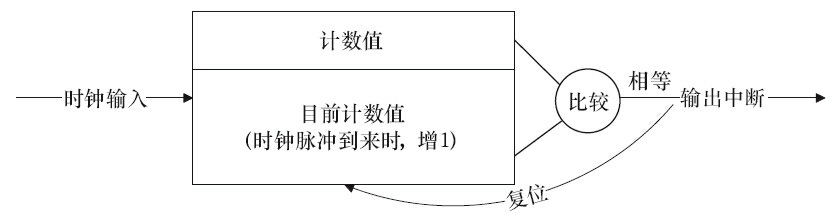
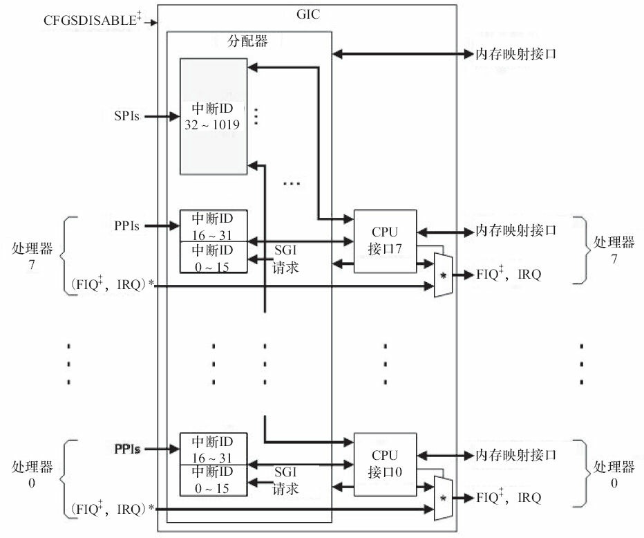
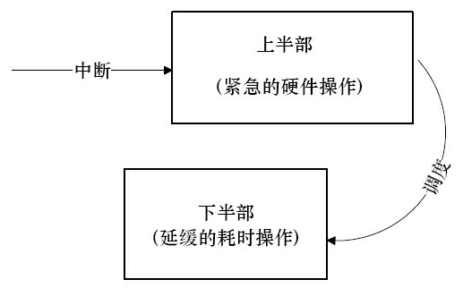

# 中断与时钟

## 1 中断与定时器

所谓中断是指CPU在执行程序的过程中，出现了某些突发事件急待处理，CPU必须暂停当前程序的执行，转去处理突发事件，处理完毕后又返回原程序被中断的位置继续执行。

根据中断的来源，中断可分为内部中断和外部中断，内部中断的中断源来自CPU内部(软件中断指令、溢出、除法错误等，例如，操作系统从用户态切换到内核态需借助CPU内部的软件中断)，外部中断的中断源来自CPU外部，由外设提出请求。

根据中断是否可以屏蔽，中断可分为可屏蔽中断与不可屏蔽中断(NMI)，可屏蔽中断可以通过设置中断控制器寄存器等方法被屏蔽，屏蔽后，该中断不再得到响应，而不可屏蔽中断不能被屏蔽。

根据中断入口跳转方法的不同，中断可分为向量中断和非向量中断。采用向量中断的CPU通常为不同的中断分配不同的中断号，当检测到某中断号的中断到来后，就自动跳转到与该中断号对应的地址执行。不同中断号的中断有不同的入口地址。非向量中断的多个中断共享一个入口地址，进入该入口地址后，再通过软件判断中断标志来识别具体是哪个中断。也就是说，向量中断由硬件提供中断服务程序入口地址，非向量中断由软件提供中断服务程序入口地址。

一个典型的非向量中断服务程序如下面代码所示，它先判断中断源，然后调用不同中断源的中断服务程序。

```c
irq_handler()
{
    ...
    int int_src = read_int_status(); /* 读硬件的中断相关寄存器 */
    switch (int_src) { /* 判断中断源 */
    case DEV_A:
        dev_a_handler();
        break;
    case DEV_B:
        dev_b_handler();
        break;
    ...
    default:
        break;
    }
    ...
}
```

嵌入式系统以及x86PC中大多包含可编程中断控制器(PIC)，许多MCU内部就集成了PIC。如在80386中，PIC是两片i8259A芯片的级联。通过读写PIC的寄存器，程序员可以屏蔽/使能某中断及获得中断状态，前者一般通过中断MASK寄存器完成，后者一般通过中断PEND寄存器完成。

定时器在硬件上也依赖中断来实现，下图所示为典型的嵌入式微处理器内可编程间隔定时器(PIT)的工作原理，它接收一个时钟输入，当时钟脉冲到来时，将目前计数值增1并与预先设置的计数值(计数目标)比较，若相等，证明计数周期满，并产生定时器中断且复位目前计数值。



在ARM多核处理器里最常用的中断控制器是GIC(Generic Interrupt Controller)，如下图所示，它支持3种类型的中断。



| **类型**                            | **描述**                                                     |
| ----------------------------------- | ------------------------------------------------------------ |
| SGI(Software Generated Interrupt) | 软件产生的中断，可以用于多核的核间通信，一个CPU可以通过写GIC的寄存器给另外一个CPU产生中断。多核调度用的IPI_WAKEUP、IPI_TIMER、IPI_RESCHEDULE、IPI_CALL_FUNC、IPI_CALL_FUNC_SINGLE、IPI_CPU_STOP、IPI_IRQ_WORK、IPI_COMPLETION都是由SGI产生的。 |
| PPI(Private Peripheral Interrupt) | 某个CPU私有外设的中断，这类外设的中断只能发给绑定的那个CPU。 |
| SPI(Shared Peripheral Interrupt)  | 共享外设的中断，这类外设的中断可以路由到任何一个CPU。        |

对于SPI类型的中断，内核可以通过如下API设定中断触发的CPU核：

```c
extern int irq_set_affinity (unsigned int irq, const struct cpumask *m);
```

在ARM Linux默认情况下，中断都是在CPU0上产生的，比如，我们可以通过如下代码把中断irq设定到CPU i上去：

```c
irq_set_affinity(irq, cpumask_of(i));
```

## 2 Linux中断处理程序架构

设备的中断会打断内核进程中的正常调度和运行，系统对更高吞吐率的追求势必要求中断服务程序尽量短小精悍。但是，这个良好的愿望往往与现实并不吻合。在大多数真实的系统中，当中断到来时，要完成的工作往往并不会是短小的，它可能要进行较大量的耗时处理。

下图描述了Linux内核的中断处理机制。为了在中断执行时间尽量短和中断处理需完成的工作尽量大之间找到一个平衡点，Linux将中断处理程序分解为两个半部：顶半部(Top Half)和底半部(BottomHalf)。



顶半部用于完成尽量少的比较紧急的功能，它往往只是简单地读取寄存器中的中断状态，并在清除中断标志后就进行“登记中断”的工作。“登记中断”意味着将底半部处理程序挂到该设备的底半部执行队列中去。这样，顶半部执行的速度就会很快，从而可以服务更多的中断请求。

现在，中断处理工作的重心就落在了底半部的头上，需用它来完成中断事件的绝大多数任务。底半部几乎做了中断处理程序所有的事情，而且可以被新的中断打断，这也是底半部和顶半部的最大不同，因为顶半部往往被设计成不可中断。底半部相对来说并不是非常紧急的，而且相对比较耗时，不在硬件中断服务程序中执行。

尽管顶半部、底半部的结合能够改善系统的响应能力，但是，僵化地认为Linux设备驱动中的中断处理一定要分两个半部则是不对的。如果中断要处理的工作本身很少，则完全可以直接在顶半部全部完成。

其他操作系统中对中断的处理也采用了类似于Linux的方法，真正的硬件中断服务程序都应该尽量短。因此，许多操作系统都提供了中断上下文和非中断上下文相结合的机制，将中断的耗时工作保留到非中断上下文去执行。例如，在VxWorks中，网络设备包接收中断到来后，中断服务程序会通过netJobAdd()函数将耗时的包接收和上传工作交给tNetTask任务去执行。

在Linux中，查看/proc/interrupts文件可以获得系统中中断的统计信息，并能统计出每一个中断号上的中断在每个CPU上发生的次数，具体如下图所示。


## 3 Linux中断编程

### 3.1 申请和释放中断

在Linux设备驱动中，使用中断的设备需要申请和释放对应的中断，并分别使用内核提供的request_irq()和free_irq()函数。

①申请irq

```c
int request_irq(unsigned int irq, irq_handler_t handler, unsigned long flags,
                const char *name, void *dev);
```

| **参数** | **描述**                                                     |
| -------- | ------------------------------------------------------------ |
| irq      | 要申请的硬件中断号。                                         |
| handle   | 向系统登记的中断处理函数(顶半部)，是一个回调函数，中断发生时，系统调用这个函数，dev参数将被传递给它。 |
| flags    | 中断处理的属性，可以指定中断的触发方式以及处理方式。在触发方式方面，可以是IRQF_TRIGGER_RISING、IRQF_TRIGGER_FALLING、IRQF_TRIGGER_HIGH、IRQF_TRIGGER_LOW等。在处理方式方面，若设置了IRQF_SHARED，则表示多个设备共享中断。 |
| name     | 设备申请的irq名称。                                          |
| dev      | 要传递给中断服务程序的私有数据，一般设置为这个设备的设备结构体或者NULL。 |
| **返回** | ——                                                           |
| 0        | 申请成功                                                     |
| -EINVAL  | 申请失败                                                     |

```c
int devm_request_irq(struct device *dev, unsigned int irq, irq_handler_t handler,
                    unsigned long irqflags, const char *devname, void *dev_id);
```

此函数与request_irq()的区别是devm_开头的API申请的是内核“managed”的资源，一般不需要在出错处理和remove()接口里再显式的释放。有点类似Java的垃圾回收机制。

顶半部handler的类型irq_handler_t定义为：

```c
typedef irqreturn_t (*irq_handler_t)(int, void *);
typedef int irqreturn_t;
```

②释放irq

```c
void free_irq(unsigned int irq,void *dev_id);
```

参数定义与request_irq()相同。

### 3.2 使能和屏蔽中断

```c
void disable_irq(int irq);
void disable_irq_nosync(int irq);
void enable_irq(int irq);
```

disable_irq_nosync()与disable_irq()的区别在于前者立即返回，而后者等待目前的中断处理完成。由于disable_irq()会等待指定的中断被处理完，因此如果在n号中断的顶半部调用disable_irq(n)，会引起系统的死锁，这种情况下，只能调用disable_irq_nosync(n)。

> [!NOTE]
>
> 死锁的原因是什么？
>
> 在顶半部处理程序中调用`disable_irq()`函数，确实可能导致死锁。这是因为顶半部处理程序通常会立即返回，而底半部处理程序稍后由一个后台线程去执行。然而，由于`disable_irq()`函数关闭了中断n，底半部处理程序在开始执行之前不会收到中断n的信号。这样，底半部处理程序可能永远不会开始执行，导致系统死锁。
>
> 为了避免这种情况，通常在底半部处理程序中禁用中断，而不是在顶半部处理程序中。这样可以确保即使底半部处理程序被阻塞或延迟，也不会影响其他中断的处理。
>
> 当然，死锁的产生不仅仅与`disable_irq()`函数的调用位置有关，还与其他因素如资源竞争、推进顺序和资源分配等有关。因此，在实际编程中，需要根据具体的应用场景和需求来选择合适的中断处理策略和同步机制，以避免死锁的发生。

下列两个函数(或宏，具体实现依赖于CPU的体系结构)将屏蔽本CPU内的所有中断：

```c
#define local_irq_save(flags) ...
void local_irq_disable(void);
```

前者会将目前的中断状态保留在flags中(注意flags为unsigned long类型，被直接传递，而不是通过指针)，后者直接禁止中断而不保存状态。

与上述两个禁止中断对应的恢复中断的函数(或宏)是：

```c
#define local_irq_restore(flags) ...
void local_irq_enable(void);
```

以上各以local_开头的方法的作用范围是本CPU内。

### 3.3 底半部机制

Linux实现底半部的机制主要有tasklet、工作队列、软中断和线程化irq。

#### 3.3.1 tasklet

tasklet的使用较简单，它的执行上下文是软中断，执行时机通常是顶半部返回的时候。我们只需要定义tasklet及其处理函数，并将两者关联则可，例如：

```c
void my_tasklet_func(unsigned long); /*定义一个处理函数*/
DECLARE_TASKLET(my_tasklet, my_tasklet_func, data);
/*定义一个tasklet结构my_tasklet，与my_tasklet_func(data)函数相关联*/
```

代码DECLARE_TASKLET(my_tasklet，my_tasklet_func，data)实现了定义名称为my_tasklet的tasklet，并将其与my_tasklet_func()这个函数绑定，而传入这个函数的参数为data。

在需要调度tasklet的时候引用一个tasklet_schedule()函数就能使系统在适当的时候进行调度运行：

```c
tasklet_schedule(&my_tasklet);
```

使用tasklet作为底半部处理中断的设备驱动程序模板如下面代码所示(仅包含与中断相关的部分)。

```c
/* 定义tasklet和底半部函数并将它们关联 */
void xxx_do_tasklet(unsigned long);
DECLARE_TASKLET(xxx_tasklet, xxx_do_tasklet, 0);

/* 中断处理底半部 */
void xxx_do_tasklet(unsigned long)
{
    ...
}

/* 中断处理顶半部 */
irqreturn_t xxx_interrupt(int irq, void *dev_id)
{
    ...
    tasklet_schedule(&xxx_tasklet);
    ...
}

/* 设备驱动模块加载函数 */
int __init xxx_init(void)
{
    ...
    /* 申请中断 */
    result = request_irq(xxx_irq, xxx_interrupt,
    0, "xxx", NULL);
    ...
    return IRQ_HANDLED;
}

/* 设备驱动模块卸载函数 */
void __exit xxx_exit(void)
{
    ...
    /* 释放中断 */
    free_irq(xxx_irq, xxx_interrupt);
    ...
}
```

上述程序在模块加载函数中申请中断，并在模块卸载函数中释放它。对应于xxx_irq的中断处理程序被设置为xxx_interrupt()函数，在这个函数中，第15行的tasklet_schedule(&xxx_tasklet)调度被定义的tasklet函数xxx_do_tasklet()在适当的时候执行。

#### 3.3.2 工作队列

工作队列的使用方法和tasklet非常相似，但是工作队列的执行上下文是内核线程，因此可以调度和睡眠。下面的代码用于定义一个工作队列和一个底半部执行函数：

```c
struct work_struct my_wq;                   /* 定义一个工作队列 */
void my_wq_func(struct work_struct *work);  /* 定义一个处理函数 */
INIT_WORK(&my_wq, my_wq_func);
```

通过INIT_WORK()可以初始化这个工作队列并将工作队列与处理函数绑定。

与tasklet_schedule()对应的用于调度工作队列执行的函数为schedule_work()，如：

```c
schedule_work(&my_wq); /* 调度工作队列执行 */
```

使用工作队列处理中断底半部的设备驱动程序模板如下面所示(仅包含与中断相关的部分)。

```c
/* 定义工作队列和关联函数 */
struct work_struct xxx_wq;
void xxx_do_work(struct work_struct *work);

/* 中断处理底半部 */
void xxx_do_work(struct work_struct *work)
{
    ...
}

/*中断处理顶半部*/
irqreturn_t xxx_interrupt(int irq, void *dev_id)
{
    ...
    schedule_work(&xxx_wq);
    ...
    return IRQ_HANDLED;
}

/* 设备驱动模块加载函数 */
int xxx_init(void)
{
    ...
    /* 申请中断 */
    result = request_irq(xxx_irq, xxx_interrupt,
    0, "xxx", NULL);
    ...
    /* 初始化工作队列 */
    INIT_WORK(&xxx_wq, xxx_do_work);
    ...
}

/* 设备驱动模块卸载函数 */
void xxx_exit(void)
{
    ...
    /* 释放中断 */
    free_irq(xxx_irq, xxx_interrupt);
    ...
}
```

上述程序在设计驱动模块加载函数中增加了初始化工作队列的代码。

工作队列早期的实现是在每个CPU核上创建一个worker内核线程，所有在这个核上调度的工作都在该worker线程中执行，其并发性显然差强人意。在Linux 2.6.36以后，转而实现了“Concurrency-managedworkqueues”，简称cmwq，cmwq会自动维护工作队列的线程池以提高并发性，同时保持了API的向后兼容。

#### 3.3.3 软中断

