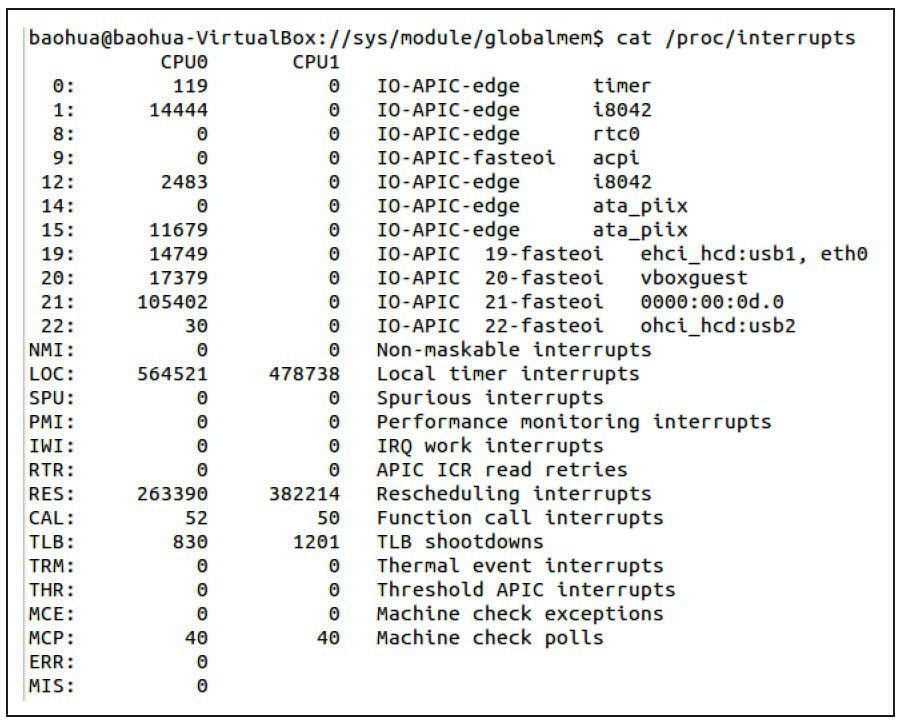

# 中断与时钟

## 1 中断与定时器

所谓中断是指CPU在执行程序的过程中，出现了某些突发事件急待处理，CPU必须暂停当前程序的执行，转去处理突发事件，处理完毕后又返回原程序被中断的位置继续执行。

根据中断的来源，中断可分为内部中断和外部中断，内部中断的中断源来自CPU内部(软件中断指令、溢出、除法错误等，例如，操作系统从用户态切换到内核态需借助CPU内部的软件中断)，外部中断的中断源来自CPU外部，由外设提出请求。

根据中断是否可以屏蔽，中断可分为可屏蔽中断与不可屏蔽中断(NMI)，可屏蔽中断可以通过设置中断控制器寄存器等方法被屏蔽，屏蔽后，该中断不再得到响应，而不可屏蔽中断不能被屏蔽。

根据中断入口跳转方法的不同，中断可分为向量中断和非向量中断。采用向量中断的CPU通常为不同的中断分配不同的中断号，当检测到某中断号的中断到来后，就自动跳转到与该中断号对应的地址执行。不同中断号的中断有不同的入口地址。非向量中断的多个中断共享一个入口地址，进入该入口地址后，再通过软件判断中断标志来识别具体是哪个中断。也就是说，向量中断由硬件提供中断服务程序入口地址，非向量中断由软件提供中断服务程序入口地址。

一个典型的非向量中断服务程序如下面代码所示，它先判断中断源，然后调用不同中断源的中断服务程序。

```c
irq_handler()
{
    ...
    int int_src = read_int_status(); /* 读硬件的中断相关寄存器 */
    switch (int_src) { /* 判断中断源 */
    case DEV_A:
        dev_a_handler();
        break;
    case DEV_B:
        dev_b_handler();
        break;
    ...
    default:
        break;
    }
    ...
}
```

嵌入式系统以及x86PC中大多包含可编程中断控制器(PIC)，许多MCU内部就集成了PIC。如在80386中，PIC是两片i8259A芯片的级联。通过读写PIC的寄存器，程序员可以屏蔽/使能某中断及获得中断状态，前者一般通过中断MASK寄存器完成，后者一般通过中断PEND寄存器完成。

定时器在硬件上也依赖中断来实现，下图所示为典型的嵌入式微处理器内可编程间隔定时器(PIT)的工作原理，它接收一个时钟输入，当时钟脉冲到来时，将目前计数值增1并与预先设置的计数值(计数目标)比较，若相等，证明计数周期满，并产生定时器中断且复位目前计数值。


在ARM多核处理器里最常用的中断控制器是GIC(Generic Interrupt Controller)，如下图所示，它支持3种类型的中断。


| **类型**                            | **描述**                                                     |
| ----------------------------------- | ------------------------------------------------------------ |
| SGI(Software Generated Interrupt) | 软件产生的中断，可以用于多核的核间通信，一个CPU可以通过写GIC的寄存器给另外一个CPU产生中断。多核调度用的IPI_WAKEUP、IPI_TIMER、IPI_RESCHEDULE、IPI_CALL_FUNC、IPI_CALL_FUNC_SINGLE、IPI_CPU_STOP、IPI_IRQ_WORK、IPI_COMPLETION都是由SGI产生的。 |
| PPI(Private Peripheral Interrupt) | 某个CPU私有外设的中断，这类外设的中断只能发给绑定的那个CPU。 |
| SPI(Shared Peripheral Interrupt)  | 共享外设的中断，这类外设的中断可以路由到任何一个CPU。        |

对于SPI类型的中断，内核可以通过如下API设定中断触发的CPU核：

```c
extern int irq_set_affinity (unsigned int irq, const struct cpumask *m);
```

在ARM Linux默认情况下，中断都是在CPU0上产生的，比如，我们可以通过如下代码把中断irq设定到CPU i上去：

```c
irq_set_affinity(irq, cpumask_of(i));
```

## 2 Linux中断处理程序架构

设备的中断会打断内核进程中的正常调度和运行，系统对更高吞吐率的追求势必要求中断服务程序尽量短小精悍。但是，这个良好的愿望往往与现实并不吻合。在大多数真实的系统中，当中断到来时，要完成的工作往往并不会是短小的，它可能要进行较大量的耗时处理。

下图描述了Linux内核的中断处理机制。为了在中断执行时间尽量短和中断处理需完成的工作尽量大之间找到一个平衡点，Linux将中断处理程序分解为两个半部：顶半部(Top Half)和底半部(BottomHalf)。


顶半部用于完成尽量少的比较紧急的功能，它往往只是简单地读取寄存器中的中断状态，并在清除中断标志后就进行“登记中断”的工作。“登记中断”意味着将底半部处理程序挂到该设备的底半部执行队列中去。这样，顶半部执行的速度就会很快，从而可以服务更多的中断请求。

现在，中断处理工作的重心就落在了底半部的头上，需用它来完成中断事件的绝大多数任务。底半部几乎做了中断处理程序所有的事情，而且可以被新的中断打断，这也是底半部和顶半部的最大不同，因为顶半部往往被设计成不可中断。底半部相对来说并不是非常紧急的，而且相对比较耗时，不在硬件中断服务程序中执行。

尽管顶半部、底半部的结合能够改善系统的响应能力，但是，僵化地认为Linux设备驱动中的中断处理一定要分两个半部则是不对的。如果中断要处理的工作本身很少，则完全可以直接在顶半部全部完成。

其他操作系统中对中断的处理也采用了类似于Linux的方法，真正的硬件中断服务程序都应该尽量短。因此，许多操作系统都提供了中断上下文和非中断上下文相结合的机制，将中断的耗时工作保留到非中断上下文去执行。例如，在VxWorks中，网络设备包接收中断到来后，中断服务程序会通过netJobAdd()函数将耗时的包接收和上传工作交给tNetTask任务去执行。

在Linux中，查看/proc/interrupts文件可以获得系统中中断的统计信息，并能统计出每一个中断号上的中断在每个CPU上发生的次数，具体如下图所示。



## 3 Linux中断编程

### 3.1 申请和释放中断

在Linux设备驱动中，使用中断的设备需要申请和释放对应的中断，并分别使用内核提供的request_irq()和free_irq()函数。

①申请irq

```c
int request_irq(unsigned int irq, irq_handler_t handler, unsigned long flags,
                const char *name, void *dev);
```

| **参数** | **描述**                                                     |
| -------- | ------------------------------------------------------------ |
| irq      | 要申请的硬件中断号。                                         |
| handle   | 向系统登记的中断处理函数(顶半部)，是一个回调函数，中断发生时，系统调用这个函数，dev参数将被传递给它。 |
| flags    | 中断处理的属性，可以指定中断的触发方式以及处理方式。在触发方式方面，可以是IRQF_TRIGGER_RISING、IRQF_TRIGGER_FALLING、IRQF_TRIGGER_HIGH、IRQF_TRIGGER_LOW等。在处理方式方面，若设置了IRQF_SHARED，则表示多个设备共享中断。 |
| name     | 设备申请的irq名称。                                          |
| dev      | 要传递给中断服务程序的私有数据，一般设置为这个设备的设备结构体或者NULL。 |
| **返回** | ——                                                           |
| 0        | 申请成功                                                     |
| -EINVAL  | 申请失败                                                     |

```c
int devm_request_irq(struct device *dev, unsigned int irq, irq_handler_t handler,
                    unsigned long irqflags, const char *devname, void *dev_id);
```

此函数与request_irq()的区别是devm_开头的API申请的是内核“managed”的资源，一般不需要在出错处理和remove()接口里再显式的释放。有点类似Java的垃圾回收机制。

顶半部handler的类型irq_handler_t定义为：

```c
typedef irqreturn_t (*irq_handler_t)(int, void *);
typedef int irqreturn_t;
```

②释放irq

```c
void free_irq(unsigned int irq,void *dev_id);
```

参数定义与request_irq()相同。

### 3.2 使能和屏蔽中断

```c
void disable_irq(int irq);
void disable_irq_nosync(int irq);
void enable_irq(int irq);
```

disable_irq_nosync()与disable_irq()的区别在于前者立即返回，而后者等待目前的中断处理完成。由于disable_irq()会等待指定的中断被处理完，因此如果在n号中断的顶半部调用disable_irq(n)，会引起系统的死锁，这种情况下，只能调用disable_irq_nosync(n)。

> [!NOTE]
>
> 死锁的原因是什么？
>
> 在顶半部处理程序中调用`disable_irq()`函数，确实可能导致死锁。这是因为顶半部处理程序通常会立即返回，而底半部处理程序稍后由一个后台线程去执行。然而，由于`disable_irq()`函数关闭了中断n，底半部处理程序在开始执行之前不会收到中断n的信号。这样，底半部处理程序可能永远不会开始执行，导致系统死锁。
>
> 为了避免这种情况，通常在底半部处理程序中禁用中断，而不是在顶半部处理程序中。这样可以确保即使底半部处理程序被阻塞或延迟，也不会影响其他中断的处理。
>
> 当然，死锁的产生不仅仅与`disable_irq()`函数的调用位置有关，还与其他因素如资源竞争、推进顺序和资源分配等有关。因此，在实际编程中，需要根据具体的应用场景和需求来选择合适的中断处理策略和同步机制，以避免死锁的发生。

下列两个函数(或宏，具体实现依赖于CPU的体系结构)将屏蔽本CPU内的所有中断：

```c
#define local_irq_save(flags) ...
void local_irq_disable(void);
```

前者会将目前的中断状态保留在flags中(注意flags为unsigned long类型，被直接传递，而不是通过指针)，后者直接禁止中断而不保存状态。

与上述两个禁止中断对应的恢复中断的函数(或宏)是：

```c
#define local_irq_restore(flags) ...
void local_irq_enable(void);
```

以上各以local_开头的方法的作用范围是本CPU内。

### 3.3 底半部机制

Linux实现底半部的机制主要有tasklet、工作队列、软中断和线程化irq。

#### 3.3.1 tasklet

tasklet的使用较简单，它的执行上下文是软中断，执行时机通常是顶半部返回的时候。我们只需要定义tasklet及其处理函数，并将两者关联则可，例如：

```c
void my_tasklet_func(unsigned long); /*定义一个处理函数*/
DECLARE_TASKLET(my_tasklet, my_tasklet_func, data);
/*定义一个tasklet结构my_tasklet，与my_tasklet_func(data)函数相关联*/
```

代码DECLARE_TASKLET(my_tasklet，my_tasklet_func，data)实现了定义名称为my_tasklet的tasklet，并将其与my_tasklet_func()这个函数绑定，而传入这个函数的参数为data。

在需要调度tasklet的时候引用一个tasklet_schedule()函数就能使系统在适当的时候进行调度运行：

```c
tasklet_schedule(&my_tasklet);
```

使用tasklet作为底半部处理中断的设备驱动程序模板如下面代码所示(仅包含与中断相关的部分)。

```c
/* 定义tasklet和底半部函数并将它们关联 */
void xxx_do_tasklet(unsigned long);
DECLARE_TASKLET(xxx_tasklet, xxx_do_tasklet, 0);

/* 中断处理底半部 */
void xxx_do_tasklet(unsigned long)
{
    ...
}

/* 中断处理顶半部 */
irqreturn_t xxx_interrupt(int irq, void *dev_id)
{
    ...
    tasklet_schedule(&xxx_tasklet);
    ...
}

/* 设备驱动模块加载函数 */
int __init xxx_init(void)
{
    ...
    /* 申请中断 */
    result = request_irq(xxx_irq, xxx_interrupt,
    0, "xxx", NULL);
    ...
    return IRQ_HANDLED;
}

/* 设备驱动模块卸载函数 */
void __exit xxx_exit(void)
{
    ...
    /* 释放中断 */
    free_irq(xxx_irq, xxx_interrupt);
    ...
}
```

上述程序在模块加载函数中申请中断，并在模块卸载函数中释放它。对应于xxx_irq的中断处理程序被设置为xxx_interrupt()函数，在这个函数中，第15行的tasklet_schedule(&xxx_tasklet)调度被定义的tasklet函数xxx_do_tasklet()在适当的时候执行。

#### 3.3.2 工作队列

工作队列的使用方法和tasklet非常相似，但是工作队列的执行上下文是内核线程，因此可以调度和睡眠。下面的代码用于定义一个工作队列和一个底半部执行函数：

```c
struct work_struct my_wq;                   /* 定义一个工作队列 */
void my_wq_func(struct work_struct *work);  /* 定义一个处理函数 */
INIT_WORK(&my_wq, my_wq_func);
```

通过INIT_WORK()可以初始化这个工作队列并将工作队列与处理函数绑定。

与tasklet_schedule()对应的用于调度工作队列执行的函数为schedule_work()，如：

```c
schedule_work(&my_wq); /* 调度工作队列执行 */
```

使用工作队列处理中断底半部的设备驱动程序模板如下面所示(仅包含与中断相关的部分)。

```c
/* 定义工作队列和关联函数 */
struct work_struct xxx_wq;
void xxx_do_work(struct work_struct *work);

/* 中断处理底半部 */
void xxx_do_work(struct work_struct *work)
{
    ...
}

/*中断处理顶半部*/
irqreturn_t xxx_interrupt(int irq, void *dev_id)
{
    ...
    schedule_work(&xxx_wq);
    ...
    return IRQ_HANDLED;
}

/* 设备驱动模块加载函数 */
int xxx_init(void)
{
    ...
    /* 申请中断 */
    result = request_irq(xxx_irq, xxx_interrupt,
    0, "xxx", NULL);
    ...
    /* 初始化工作队列 */
    INIT_WORK(&xxx_wq, xxx_do_work);
    ...
}

/* 设备驱动模块卸载函数 */
void xxx_exit(void)
{
    ...
    /* 释放中断 */
    free_irq(xxx_irq, xxx_interrupt);
    ...
}
```

上述程序在设计驱动模块加载函数中增加了初始化工作队列的代码。

工作队列早期的实现是在每个CPU核上创建一个worker内核线程，所有在这个核上调度的工作都在该worker线程中执行，其并发性显然差强人意。在Linux 2.6.36以后，转而实现了“Concurrency-managedworkqueues”，简称cmwq，cmwq会自动维护工作队列的线程池以提高并发性，同时保持了API的向后兼容。

#### 3.3.3 软中断

软中断(Softirq)也是一种传统的底半部处理机制，它的执行时机通常是顶半部返回的时候，tasklet是基于软中断实现的，因此也运行于软中断上下文。

在Linux内核中，用softirq_action结构体表征一个软中断，这个结构体包含软中断处理函数指针和传递给该函数的参数。使用open_softirq()函数可以注册软中断对应的处理函数，而raise_softirq()函数可以触发一个软中断。

软中断和tasklet运行于软中断上下文，仍然属于原子上下文的一种，而工作队列则运行于进程上下文。因此，在软中断和tasklet处理函数中不允许睡眠，而在工作队列处理函数中允许睡眠。

local_bh_disable()和local_bh_enable()是内核中用于禁止和使能软中断及tasklet底半部机制的函数。

内核中采用softirq的地方包括HI_SOFTIRQ、TIMER_SOFTIRQ、NET_TX_SOFTIRQ、NET_RX_SOFTIRQ、SCSI_SOFTIRQ、TASKLET_SOFTIRQ等，一般来说，驱动的编写者不会也不宜直接使用softirq。

异步通知所基于的信号也类似于中断，现在，总结一下硬中断、软中断和信号的区别：硬中断是外部设备对CPU的中断，软中断是中断底半部的一种处理机制，而信号则是由内核(或其他进程)对某个进程的中断。在涉及系统调用的场合，人们也常说通过软中断(例如ARM为swi)陷入内核，此时软中断的概念是指由软件指令引发的中断，和我们这个地方说的softirq是两个完全不同的概念，一个是software，一个是soft。

需要特别说明的是，软中断以及基于软中断的tasklet如果在某段时间内大量出现的话，内核会把后续软中断放入ksoftirqd内核线程中执行。总的来说，中断优先级高于软中断，软中断又高于任何一个线程。软中断适度线程化，可以缓解高负载情况下系统的响应。

#### 3.3.4 threaded_irq

在内核中，除了可以通过request_irq()、devm_request_irq()申请中断以外，还可以通过request_threaded_irq()和devm_request_threaded_irq()申请。这两个函数的原型为：

```c
int request_threaded_irq(unsigned int irq, irq_handler_t handler,
                         irq_handler_t thread_fn,
                         unsigned long flags, const char *name, void *dev);
int devm_request_threaded_irq(struct device *dev, unsigned int irq,
                              irq_handler_t handler, irq_handler_t thread_fn,
                              unsigned long irqflags, const char *devname,
                              void *dev_id);
```

由此可见，它们比request_irq()、devm_request_irq()多了一个参数thread_fn。用这两个API申请中断的时候，内核会为相应的中断号分配一个对应的内核线程。注意这个线程只针对这个中断号，如果其他中断也通过request_threaded_irq()申请，自然会得到新的内核线程。

参数handler对应的函数执行于中断上下文，thread_fn参数对应的函数则执行于内核线程。如果handler结束的时候，返回值是IRQ_WAKE_THREAD，内核会调度对应线程执行thread_fn对应的函数。

request_threaded_irq()和devm_request_threaded_irq()支持在irqflags中设置IRQF_ONESHOT标记，这样内核会自动帮助我们在中断上下文中屏蔽对应的中断号，而在内核调度thread_fn执行后，重新使能该中断号。对于我们无法在上半部清除中断的情况，IRQF_ONESHOT特别有用，避免了中断服务程序一退出，中断就洪泛的情况。

> [!NOTE]
>
> 当使用 `IRQF_ONESHOT` 标志位时，中断处理程序会执行两次：一次是上半部处理函数(primary handler)，另一次是下半部处理函数(bottom half)。只有当这两个处理函数都执行完毕后，中断才会继续被接受和处理。这样可以确保在中断处理过程中，不会被其他的中断打断，保证数据的完整性和一致性。
>
> 在实际使用中，如果需要在中断处理过程中关闭中断，或者需要保证中断处理函数的完整执行，可以考虑使用 `IRQF_ONESHOT` 标志位。但是，需要注意的是，使用这个标志位可能会对系统的性能产生一定的影响，因为它会阻止中断的连续处理。因此，在使用时需要根据具体的需求和场景进行权衡和选择。

handler参数可以设置为NULL，这种情况下，内核会用默认的irq_default_primary_handler()代替handler，并会使用IRQF_ONESHOT标记。irq_default_primary_handler()定义为：

```c
/*
 * Default primary interrupt handler for threaded interrupts. Is
 * assigned as primary handler when request_threaded_irq is called
 * with handler == NULL. Useful for oneshot interrupts.
*/
static irqreturn_t irq_default_primary_handler(int irq, void *dev_id)
{
    return IRQ_WAKE_THREAD;
}
```

## 4 中断共享

多个设备共享一根硬件中断线的情况在实际的硬件系统中广泛存在，Linux支持这种中断共享。下面是中断共享的使用方法。

- 共享中断的多个设备在申请中断时，都应该使用IRQF_SHARED标志，而且一个设备以IRQF_SHARED申请某中断成功的前提是该中断未被申请，或该中断虽然被申请了，但是之前申请该中断的所有设备也都以IRQF_SHARED标志申请该中断。
- 尽管内核模块可访问的全局地址都可以作为request_irq(…，void*dev_id)的最后一个参数dev_id，但是设备结构体指针显然是可传入的最佳参数。
- 在中断到来时，会遍历执行共享此中断的所有中断处理程序，直到某一个函数返回IRQ_HANDLED。在中断处理程序顶半部中，应根据硬件寄存器中的信息比照传入的dev_id参数迅速地判断是否为本设备的中断，若不是，应迅速返回IRQ_NONE，如下图所示。


下面代码给出了使用共享中断的设备驱动程序的模板(仅包含与共享中断机制相关的部分)。

```c
/* 中断处理顶半部 */
irqreturn_t xxx_interrupt(int irq, void *dev_id)
{
    ...
    int status = read_int_status();     /* 获知中断源 */
    if(!is_myint(dev_id,status))        /* 判断是否为本设备中断 */
        return IRQ_NONE;                /* 不是本设备中断，立即返回 */

    /* 是本设备中断，进行处理 */
    ...
    return IRQ_HANDLED;                 /* 返回IRQ_HANDLED表明中断已被处理 */
}

/* 设备驱动模块加载函数 */
int xxx_init(void)
{
    ...
    /* 申请共享中断 */
    result = request_irq(sh_irq, xxx_interrupt, IRQF_SHARED, "xxx", xxx_dev);
    ...
}

/* 设备驱动模块卸载函数 */
void xxx_exit(void)
{
    ...
    /* 释放中断 */
    free_irq(xxx_irq, xxx_interrupt);
    ...
}
```

## 5 内核定时器

### 5.1 内核定时器编程

软件意义上的定时器最终依赖硬件定时器来实现，内核在时钟中断发生后检测各定时器是否到期，到期后的定时器处理函数将作为软中断在底半部执行。实质上，时钟中断处理程序会唤起TIMER_SOFTIRQ软中断，运行当前处理器上到期的所有定时器。

在Linux设备驱动编程中，可以利用Linux内核中提供的一组函数和数据结构来完成定时触发工作或者完成某周期性的事务。这组函数和数据结构使得驱动工程师在多数情况下不用关心具体的软件定时器究竟对应着怎样的内核和硬件行为。

Linux内核所提供的用于操作定时器的数据结构和函数如下。

#### 5.1.1 timer_list

在Linux内核中，timer_list结构体的一个实例对应一个定时器，如下代码所示。

```c
struct timer_list {
    /*
     * All fields that change during normal runtime grouped to the
     * same cacheline
    */
    struct list_head entry;
    unsigned long expires;
    struct tvec_base *base;

    void (*function)(unsigned long);
    unsigned long data;

    int slack;

#ifdef CONFIG_TIMER_STATS
    int start_pid;
    void *start_site;
    char start_comm[16];
#endif
#ifdef CONFIG_LOCKDEP
    struct lockdep_map lockdep_map;
#endif
};
```

当定时器期满后，其中function()成员将被执行，而data成员则是传入其中的参数，expires则是定时器到期的时间(jiffies)。

如下代码定义一个定时器：

```c
struct timer_list my_timer;
```

#### 5.1.2 初始化定时器

init_timer是一个宏，它的原型等价于：

```c
void init_timer(struct timer_list * timer);
```

上述init_timer()函数初始化timer_list的entry的next为NULL，并给base指针赋值。

TIMER_INITIALIZER(\_function，\_expires，\_data)宏用于赋值定时器结构体的function、expires、data和base成员，这个宏等价于：

```c
#define TIMER_INITIALIZER(_function, _expires, _data) { \
                         .entry = { .prev = TIMER_ENTRY_STATIC }, \
                         .function = (_function), \
                         .expires = (_expires), \
                         .data = (_data), \
                         .base = &boot_tvec_bases, \
}
```

DEFINE_TIMER(\_name，\_function，\_expires，\_data)宏是定义并初始化定时器成员的“快捷方式”，这个宏定义为：

```c
#define DEFINE_TIMER(_name, _function, _expires, _data) \
                    struct timer_list _name = \
                    TIMER_INITIALIZER(_function, _expires, _data)
```

此外，setup_timer()也可用于初始化定时器并赋值其成员，其源代码为：

```c
#define __setup_timer(_timer, _fn, _data, _flags) \
                    do { \
                        __init_timer((_timer), (_flags)); \
                        (_timer)->function = (_fn); \
                        (_timer)->data = (_data); \
                    } while (0)
```

#### 5.1.3 增加定时器

```c
void add_timer(struct timer_list * timer);
```

上述函数用于注册内核定时器，将定时器加入到内核动态定时器链表中。

#### 5.1.4 删除定时器

```c
int del_timer(struct timer_list * timer);
```

上述函数用于删除定时器。

del_timer_sync()是del_timer()的同步版，在删除一个定时器时需等待其被处理完，因此该函数的调用不能发生在中断上下文中。

#### 5.1.5 修改定时器的expire

```c
int mod_timer(struct timer_list *timer, unsigned long expires);
```

上述函数用于修改定时器的到期时间，在新的被传入的expires到来后才会执行定时器函数。

下面代码给出了一个完整的内核定时器使用模板，在大多数情况下，设备驱动都如这个模板那样使用定时器。

```c
/* xxx设备结构体 */
struct xxx_dev {
    struct cdev cdev;
    ...
    timer_list xxx_timer; /* 设备要使用的定时器 */
};

/* xxx驱动中的某函数 */
xxx_func1(…)
{
    struct xxx_dev *dev = filp->private_data;
    ...
    /* 初始化定时器 */
    init_timer(&dev->xxx_timer);
    dev->xxx_timer.function = &xxx_do_timer;
    dev->xxx_timer.data = (unsigned long)dev;
    /* 设备结构体指针作为定时器处理函数参数 */
    dev->xxx_timer.expires = jiffies + delay;
    /* 添加(注册)定时器 */
    add_timer(&dev->xxx_timer);
    ...
}

/* xxx驱动中的某函数 */
xxx_func2(…)
{
    ...
    /* 删除定时器 */
    del_timer (&dev->xxx_timer);
    ...
}

/* 定时器处理函数 */
static void xxx_do_timer(unsigned long arg)
{
    struct xxx_device *dev = (struct xxx_device *)(arg);
    ...
    /* 调度定时器再执行 */
    dev->xxx_timer.expires = jiffies + delay;
    add_timer(&dev->xxx_timer);
    ...
}
```

从代码清单第18、39行可以看出，定时器的到期时间往往是在目前jiffies的基础上添加一个时延，若为Hz，则表示延迟1s。

在定时器处理函数中，在完成相应的工作后，往往会延后expires并将定时器再次添加到内核定时器链表中，以便定时器能再次被触发。

此外，Linux内核支持tickless和NO_HZ模式后，内核也包含对hrtimer(高精度定时器)的支持，它可以支持到微秒级别的精度。内核也定义了hrtimer结构体，hrtimer_set_expires()、hrtimer_start_expires()、hrtimer_forward_now()、hrtimer_restart()等类似的API来完成hrtimer的设置、时间推移以及到期回调。我们可以从sound/soc/fsl/imx-pcm-fiq.c中提取出一个使用范例，如下面代码所示：

```c
static enum hrtimer_restart snd_hrtimer_callback(struct hrtimer *hrt)
{
    ...

    hrtimer_forward_now(hrt, ns_to_ktime(iprtd->poll_time_ns));

    return HRTIMER_RESTART;
}

static int snd_imx_pcm_trigger(struct snd_pcm_substream *substream, int cmd)
{
    struct snd_pcm_runtime *runtime = substream->runtime;
    struct imx_pcm_runtime_data *iprtd = runtime->private_data;

    switch (cmd) {
    case SNDRV_PCM_TRIGGER_START:
    case SNDRV_PCM_TRIGGER_RESUME:
    case SNDRV_PCM_TRIGGER_PAUSE_RELEASE:
    ...
    hrtimer_start(&iprtd->hrt, ns_to_ktime(iprtd->poll_time_ns),
    HRTIMER_MODE_REL);
    ...
    }
}

static int snd_imx_open(struct snd_pcm_substream *substream)
{
    ...
    hrtimer_init(&iprtd->hrt, CLOCK_MONOTONIC, HRTIMER_MODE_REL);
    iprtd->hrt.function = snd_hrtimer_callback;

    ...
    return 0;
}
static int snd_imx_close(struct snd_pcm_substream *substream)
{
    ...
    hrtimer_cancel(&iprtd->hrt);
    ...
}
```

在声卡打开的时候通过hrtimer_init()初始化了hrtimer，并指定回调函数为snd_hrtimer_callback()；在启动播放(第15~21行SNDRV_PCM_TRIGGER_START)等时刻通过hrtimer_start()启动了hrtimer；iprtd->poll_time_ns纳秒后，时间到snd_hrtimer_callback()函数在中断上下文被执行，它紧接着又通过hrtimer_forward_now()把hrtimer的时间前移了iprtd->poll_time_ns纳秒，这样周而复始；直到声卡被关闭，第37行又调用了hrtimer_cancel()取消在open时初始化的hrtimer。

### 5.2 内核中延迟的工作delayed_work

对于周期性的任务，除了定时器以外，在Linux内核中还可以利用一套封装得很好的快捷机制，其本质是利用工作队列和定时器实现，这套快捷机制就是delayed_work，delayed_work结构体的定义如下面代码所示。

```c
struct delayed_work {
    struct work_struct work;
    struct timer_list timer;

    /* target workqueue and CPU ->timer uses to queue ->work */
    struct workqueue_struct *wq;
    int cpu;
};
```

我们可以通过如下函数调度一个delayed_work在指定的延时后执行：

```c
int schedule_delayed_work(struct delayed_work *work, unsigned long delay);
```

当指定的delay到来时，delayed_work结构体中的work成员work_func_t类型成员func()会被执行。work_func_t类型定义为：

```c
typedef void (*work_func_t)(struct work_struct *work);
```

其中，delay参数的单位是jiffies，因此一种常见的用法如下：

```c
schedule_delayed_work(&work, msecs_to_jiffies(poll_interval));
```

msecs_to_jiffies()用于将毫秒转化为jiffies。

如果要周期性地执行任务，通常会在delayed_work的工作函数中再次调用schedule_delayed_work()，周而复始。

如下函数用来取消delayed_work：

```c
int cancel_delayed_work(struct delayed_work *work);
int cancel_delayed_work_sync(struct delayed_work *work);
```

## 6 内核延时

### 6.1 短延时

Linux内核中提供了下列3个函数以分别进行纳秒、微秒和毫秒延迟：

```c
void ndelay(unsigned long nsecs);
void udelay(unsigned long usecs);
void mdelay(unsigned long msecs);
```

上述延迟的实现原理本质上是忙等待，它根据CPU频率进行一定次数的循环。有时候，人们在软件中进行下面的延迟：

```c
void delay(unsigned int time)
{
    while(time--);
}
```

ndelay()、udelay()和mdelay()函数的实现方式原理与此类似。内核在启动时，会运行一个延迟循环校准(Delay Loop Calibration)，计算出lpj(Loops Per Jiffy)，内核启动时会打印如下类似信息：

```
Calibrating delay loop... 530.84 BogoMIPS (lpj=1327104)
```

如果我们直接在bootloader传递给内核的bootargs中设置lpj=1327104，则可以省掉这个校准的过程，节省约百毫秒级的开机时间。

毫秒时延(以及更大的秒时延)已经比较大了，在内核中，最好不要直接使用mdelay()函数，这将耗费CPU资源，对于毫秒级以上的时延，内核提供了下述函数：

```c
void msleep(unsigned int millisecs);
unsigned long msleep_interruptible(unsigned int millisecs);
void ssleep(unsigned int seconds);
```

上述函数将使得调用它的进程睡眠参数指定的时间为millisecs，msleep()、ssleep()不能被打断，而msleep_interruptible()则可以被打断。

受系统Hz以及进程调度的影响，msleep()类似函数的精度是有限的。

### 6.2 长延时

在内核中进行延迟的一个很直观的方法是比较当前的jiffies和目标jiffies(设置为当前jiffies加上时间间隔的jiffies)，直到未来的jiffies达到目标jiffies。代码清单10.15给出了使用忙等待先延迟100个jiffies再延迟2s的实例。

```c
/* 延迟100个jiffies */
unsigned long delay = jiffies + 100;
while(time_before(jiffies, delay));

/* 再延迟2s */
unsigned long delay = jiffies + 2*Hz;
while(time_before(jiffies, delay));
```

与time_before()对应的还有一个time_after()，它们在内核中定义为(实际上只是将传入的未来时间jiffies和被调用时的jiffies进行一个简单的比较)：

```c
#define time_after(a,b) \
        (typecheck(unsigned long, a) && \
        typecheck(unsigned long, b) && \ 
        ((long)(b) - (long)(a) < 0))
#define time_before(a,b) time_after(b,a)
```

为了防止在time_before()和time_after()的比较过程中编译器对jiffies的优化，内核将其定义为volatile变量，这将保证每次都会重新读取这个变量。因此volatile更多的作用还是避免这种读合并。

### 6.3 睡着延时

睡着延迟无疑是比忙等待更好的方式，睡着延迟是在等待的时间到来之前进程处于睡眠状态，CPU资源被其他进程使用。schedule_timeout()可以使当前任务休眠至指定的jiffies之后再重新被调度执行，msleep()和msleep_interruptible()在本质上都是依靠包含了schedule_timeout()的schedule_timeout_uninterruptible()和schedule_timeout_interruptible()来实现的，如下面代码所示。

```c
void msleep(unsigned int msecs)
{
    unsigned long timeout = msecs_to_jiffies(msecs) + 1;

    while (timeout)
    timeout = schedule_timeout_uninterruptible(timeout);
}

unsigned long msleep_interruptible(unsigned int msecs)
{
    unsigned long timeout = msecs_to_jiffies(msecs) + 1;

    while (timeout && !signal_pending(current))
    timeout = schedule_timeout_interruptible(timeout);
    return jiffies_to_msecs(timeout);
}
```

实际上，schedule_timeout()的实现原理是向系统添加一个定时器，在定时器处理函数中唤醒与参数对应的进程。

上面代码中第6行和第14行分别调用schedule_timeout_uninterruptible()和schedule_timeout_interruptible()，这两个函数的区别在于前者在调用schedule_timeout()之前置进程状态为TASK_INTERRUPTIBLE，后者置进程状态为TASK_UNINTERRUPTIBLE，如下面代码所示：

```c
signed long __sched schedule_timeout_interruptible(signed long timeout)
{
    __set_current_state(TASK_INTERRUPTIBLE);
    return schedule_timeout(timeout);
}

signed long __sched schedule_timeout_uninterruptible(signed long timeout)
{
    __set_current_state(TASK_UNINTERRUPTIBLE);
    return schedule_timeout(timeout);
}
```

另外，下面两个函数可以将当前进程添加到等待队列中，从而在等待队列上睡眠。当超时发生时，进程将被唤醒(后者可以在超时前被打断)：

```c
sleep_on_timeout(wait_queue_head_t *q, unsigned long timeout);
interruptible_sleep_on_timeout(wait_queue_head_t*q, unsigned long timeout);
```
