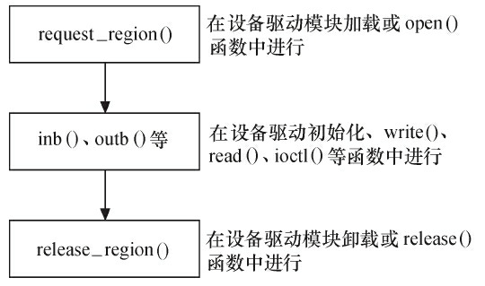

# 内存与IO访问

## 1 CPU与内存、I/O

### 1.1 内存空间与I/O空间

在X86处理器中存在着I/O空间的概念，I/O空间是相对于内存空间而言的，它通过特定的指令in、out来访问。端口号标识了外设的寄存器地址。Intel语法中的in、out指令格式如下：

```c
IN 累加器, {端口号|DX}
OUT {端口号|DX}, 累加器
```

目前，大多数嵌入式微控制器（如ARM、PowerPC等）中并不提供I/O空间，而仅存在内存空间。内存空间可以直接通过地址、指针来访问，程序及在程序运行中使用的变量和其他数据都存在于内存空间中。

内存地址可以直接由C语言指针操作，例如在186处理器中执行如下代码：

```c
unsigned char *p = (unsigned char *)0xF000FF00;
*p=11;
```

以上程序的意义是在绝对地址0xF0000+0xFF00（186处理器使用16位段地址和16位偏移地址）中写入11。

而在ARM、PowerPC等未采用段地址的处理器中，p指向的内存空间就是0xF000FF00，而*p=11就是在该地址写入11。

再如，186处理器启动后会在绝对地址0xFFFF0（对应的C语言指针是0xF000FFF0，0xF000为段地址，0xFFF0为段内偏移）中执行，请看下面的代码：

```c
typedef void (*lpFunction) ( ); /* 定义一个无参数、无返回类型的函数指针类型 */
lpFunction lpReset = (lpFunction)0xF000FFF0; /* 定义一个函数指针，指向 */
/* CPU启动后所执行的第一条指令的位置 */
lpReset(); /* 调用函数 */
```

在以上程序中，没有定义任何一个函数实体，但是程序却执行了这样的函数调用：lpReset（），它实际上起到了“软重启”的作用，跳转到CPU启动后第一条要执行的指令的位置。因此，可以通过函数指针调用一个没有函数体的“函数”，这本质上只是换一个地址开始执行。

即便是在X86处理器中，虽然提供了I/O空间，如果由我们自己设计电路板，外设仍然可以只挂接在内存空间中。此时，CPU可以像访问一个内存单元那样访问外设I/O端口，而不需要设立专门的I/O指令。因此，内存空间是必需的，而I/O空间是可选的。下图给出了内存空间和I/O空间的对比。


### 1.2 内存管理单元

高性能处理器一般会提供一个内存管理单元（MMU），该单元辅助操作系统进行内存管理，提供虚拟地址和物理地址的映射、内存访问权限保护和Cache缓存控制等硬件支持。操作系统内核借助MMU可以让用户感觉到程序好像可以使用非常大的内存空间，从而使得编程人员在写程序时不用考虑计算机中物理内存的实际容量。

为了理解基本的MMU操作原理，需先明晰几个概念。

- TLB（Translation Lookaside Buffer）：即转换旁路缓存，TLB是MMU的核心部件，它缓存少量的虚拟地址与物理地址的转换关系，是转换表的Cache，因此也经常被称为“快表”。
- TTW（Translation Table walk）：即转换表漫游，当TLB中没有缓冲对应的地址转换关系时，需要通过对内存中转换表（大多数处理器的转换表为多级页表，如下图所示）的访问来获得虚拟地址和物理地址的对应关系。TTW成功后，结果应写入TLB中。


下图给出了一个典型的ARM处理器访问内存的过程，其他处理器也执行类似过程。当ARM要访问存储器时，MMU先查找TLB中的虚拟地址表。如果ARM的结构支持分开的数据TLB（DTLB）和指令TLB（ITLB），则除了取指令使用ITLB外，其他的都使用DTLB。ARM处理器的MMU如下图所示。


若TLB中没有虚拟地址的入口，则转换表遍历硬件并从存放于主存储器内的转换表中获取地址转换信息和访问权限（即执行TTW），同时将这些信息放入TLB，它或者被放在一个没有使用的入口或者替换一个已经存在的入口。之后，在TLB条目中控制信息的控制下，当访问权限允许时，对真实物理地址的访问将在Cache或者在内存中发生，如下图所示。


ARM内TLB条目中的控制信息用于控制对对应地址的访问权限以及Cache的操作。

- C（高速缓存）和B（缓冲）位被用来控制对应地址的高速缓存和写缓冲，并决定是否进行高速缓存。
- 访问权限和域位用来控制读写访问是否被允许。如果不允许，MMU则向ARM处理器发送一个存储器异常，否则访问将被允许进行。

上述描述的MMU机制针对的虽然是ARM处理器，但PowerPC、MIPS等其他处理器也均有类似的操作。

MMU具有虚拟地址和物理地址转换、内存访问权限保护等功能，这将使得Linux操作系统能单独为系统的每个用户进程分配独立的内存空间并保证用户空间不能访问内核空间的地址，为操作系统的虚拟内存管理模块提供硬件基础。

在Linux 2.6.11之前，Linux内核硬件无关层使用了三级页表PGD、PMD和PTE；从Linux 2.6.11开始，为了配合64位CPU的体系结构，硬件无关层则使用了4级页表目录管理的方式，即PGD、PUD、PMD和PTE。注意这仅仅是一种软件意义上的抽象，实际硬件的页表级数可能少于4。下面代码给出了一个典型的从虚拟地址得到PTE的页表查询（Page Table Walk）过程，它取自arch/arm/lib/uaccess_with_memcpy.c。

```c
static int
pin_page_for_write(const void __user *_addr, pte_t **ptep, spinlock_t **ptlp)
{
    unsigned long addr = (unsigned long)_addr;
    pgd_t *pgd;
    pmd_t *pmd;
    pte_t *pte;
    pud_t *pud;
    spinlock_t *ptl;

    pgd = pgd_offset(current->mm, addr);
    if (unlikely(pgd_none(*pgd) || pgd_bad(*pgd)))
        return 0;

    pud = pud_offset(pgd, addr);
    if (unlikely(pud_none(*pud) || pud_bad(*pud)))
        return 0;

    pmd = pmd_offset(pud, addr);
    if (unlikely(pmd_none(*pmd)))
        return 0;

    /*
     * A pmd can be bad if it refers to a HugeTLB or THP page.
     *
     * Both THP and HugeTLB pages have the same pmd layout
     * and should not be manipulated by the pte functions.
     *
     * Lock the page table for the destination and check
     * to see that it's still huge and whether or not we will
     * need to fault on write, or if we have a splitting THP.
    */
    if (unlikely(pmd_thp_or_huge(*pmd))) {
        ptl = &current->mm->page_table_lock;
        spin_lock(ptl);
        if (unlikely(!pmd_thp_or_huge(*pmd)
                     || pmd_hugewillfault(*pmd)
                     || pmd_trans_splitting(*pmd))) {
            spin_unlock(ptl);
            return 0;
        }

        *ptep = NULL;
        *ptlp = ptl;
        return 1;
    }

    if (unlikely(pmd_bad(*pmd)))
        return 0;

    pte = pte_offset_map_lock(current->mm, pmd, addr, &ptl);
    if (unlikely(!pte_present(*pte) || !pte_young(*pte) ||
                 !pte_write(*pte) || !pte_dirty(*pte))) {
        pte_unmap_unlock(pte, ptl);
        return 0;
    }

    *ptep = pte;
    *ptlp = ptl;

    return 1;
}
```

第1行的类型为struct，mm_struct的参数mm用于描述Linux进程所占有的内存资源。上述代码中的pgd_offset、pud_offset、pmd_offset分别用于得到一级页表、二级页表和三级页表的入口，最后通过pte_offset_map_lock得到目标页表项pte。而且第33行还通过pmd_thp_or_huge（）判断是否有巨页的情况，如果是巨页，就直接访问pmd。

但是，MMU并不是对所有的处理器都是必需的，例如常用的SAMSUNG基于ARM7TDMI系列的S3C44B0X不附带MMU，新版的Linux 2.6支持不带MMU的处理器。在嵌入式系统中，仍存在大量无MMU的处理器，Linux 2.6为了更广泛地应用于嵌入式系统，融合了mClinux，以支持这些无MMU系统，如Dragonball、ColdFire、Hitachi H8/300、Blackfin等。

## 2 Linux内存管理

对于包含MMU的处理器而言，Linux系统提供了复杂的存储管理系统，使得进程所能访问的内存达到4GB。

在Linux系统中，进程的4GB内存空间被分为两个部分——用户空间与内核空间。用户空间的地址一般分布为0~3GB（即PAGE_OFFSET，在0x86中它等于0xC0000000），这样，剩下的3~4GB为内核空间，如下图所示。用户进程通常只能访问用户空间的虚拟地址，不能访问内核空间的虚拟地址。用户进程只有通过系统调用（代表用户进程在内核态执行）等方式才可以访问到内核空间。


每个进程的用户空间都是完全独立、互不相干的，用户进程各自有不同的页表。而内核空间是由内核负责映射，它并不会跟着进程改变，是固定的。内核空间的虚拟地址到物理地址映射是被所有进程共享的，内核的虚拟空间独立于其他程序。

Linux中1GB的内核地址空间又被划分为物理内存映射区、虚拟内存分配区、高端页面映射区、专用页面映射区和系统保留映射区这几个区域，如下图所示。


对于x86系统而言，一般情况下，物理内存映射区最大长度为896MB，系统的物理内存被顺序映射在内核空间的这个区域中。当系统物理内存大于896MB时，超过物理内存映射区的那部分内存称为高端内存（而未超过物理内存映射区的内存通常被称为常规内存），内核在存取高端内存时必须将它们映射到高端页面映射区。

Linux保留内核空间最顶部FIXADDR_TOP~4GB的区域作为保留区。

紧接着最顶端的保留区以下的一段区域为专用页面映射区（FIXADDR_START~FIXADDR_TOP），它的总尺寸和每一页的用途由fixed_address枚举结构在编译时预定义，用__fix_to_virt（index）可获取专用区内预定义页面的逻辑地址。其开始地址和结束地址宏定义如下：

```c
#define FIXADDR_START (FIXADDR_TOP - __FIXADDR_SIZE)
#define FIXADDR_TOP ((unsigned long)__FIXADDR_TOP)
#define __FIXADDR_TOP 0xfffff000
```

接下来，如果系统配置了高端内存，则位于专用页面映射区之下的就是一段高端内存映射区，其起始地址为PKMAP_BASE，相关宏定义如下：

```c
#define FIXADDR_BOOT_START (FIXADDR_TOP - __FIXADDR_BOOT_SIZE)
#define LAST_PKMAP PTRS_PER_PTE
#define PTRS_PER_PTE 512
#define PMD_MASK (~(PMD_SIZE-1))
# define PMD_SIZE (1UL << PMD_SHIFT)
#define PMD_SHIFT 21

#define PKMAP_BASE ( (FIXADDR_BOOT_START - PAGE_SIZE*(LAST_PKMAP + 1)) & PMD_MASK )
```

在物理区和高端映射区之间为虚拟内存分配器区（VMALLOC_START~VMALLOC_END），用于vmalloc（）函数，它的前部与物理内存映射区有一个隔离带，后部与高端映射区也有一个隔离带，vmalloc区域定义如下：

```c
#define VMALLOC_OFFSET (8*1024*1024)
#define VMALLOC_START (((unsigned long) high_memory +
vmalloc_earlyreserve + 2*VMALLOC_OFFSET-1) & ~(VMALLOC_OFFSET-1))
#ifdef CONFIG_HIGHMEM /* 支持高端内存 */
#define VMALLOC_END (PKMAP_BASE-2*PAGE_SIZE)
#else /* 不支持高端内存 */
#define VMALLOC_END (FIXADDR_START-2*PAGE_SIZE)
#endif
```

当系统物理内存超过4GB时，必须使用CPU的扩展分页（PAE）模式所提供的64位页目录项才能存取到4GB以上的物理内存，这需要CPU的支持。加入了PAE功能的Intel Pentium Pro及以后的CPU允许内存最大可配置到64GB，它们具备36位物理地址空间寻址能力。

由此可见，对于32位的x86而言，在3~4GB之间的内核空间中，从低地址到高地址依次为：物理内存映射区->隔离带->vmalloc虚拟内存分配器区->隔离带->高端内存映射区->专用页面映射区->保留区。

直接进行映射的896MB物理内存其实又分为两个区域，在低于16MB的区域，ISA设备可以做DMA，所以该区域为DMA区域（内核为了保证ISA驱动在申请DMA缓冲区的时候，通过GFP_DMA标记可以确保申请到16MB以内的内存，所以必须把这个区域列为一个单独的区域管理）；16MB~896MB之间的为常规区域。高于896MB的就称为高端内存区域了。

32位ARM Linux的内核空间地址映射与x86不太一样，内核文档Documentation/arm/memory.txt给出了ARM Linux的内存映射情况。0xffff0000~0xffff0fff是“CPU vector page”，即向量表的地址。0xffc00000~0xffefffff是DMA内存映射区域，dma_alloc_xxx族函数把DMA缓冲区映射在这一段，VMALLOC_START~VMALLOC_END-1是vmalloc和ioremap区域（在vmalloc区域的大小可以配置，通过“vmalloc=”这个启动参数可以指定），PAGE_OFFSET~high_memory-1是DMA和正常区域的映射区域，MODULES_VADDR~MODULES_END-1是内核模块区域，PKMAP_BASE~PAGE_OFFSET-1是高端内存映射区。假设我们把PAGE_OFFSET定义为3GB，实际上Linux内核模块位于3GB-16MB~3GB-2MB，高端内存映射区则通常位于3GB-2MB~3GB。

下图给出了32位ARM系统Linux内核地址空间中的内核模块区域、高端内存映射区、vmalloc、向量表区域等。我们假定编译内核的时候选择的是VMSPLIT_3G（3G/1G user/kernel split）。如果用户选择的是VMSPLIT_2G（2G/2G user/kernel split），则下图中的内核模块开始于2GB-16MB，DMA和常规内存区域映射区也开始于2GB。


下图给出了几种DMA、常规、高端内存区域可能的分布，在第一种情况下，有硬件的DMA引擎不能访问全部地址，且内存较大而无法全部在内核空间虚拟地址映射下，存放有3个区域；第二种情况下，没有硬件的DMA引擎不能访问全部地址，且内存较大而无法全部在内核空间虚拟地址映射下，则常规区域实际退化为0；第三种情况下，有硬件的DMA引擎不能访问全部地址，且内存较小可以全部在内核空间虚拟地址映射下，则高端内存区域实际退化为0；第四种情况下，没有硬件的DMA引擎不能访问全部地址，且内存较小可以全部在内核空间虚拟地址映射下，则常规和高端内存区域实际退化为0。


如下图所示，DMA、常规、高端内存这3个区域都采用buddy算法进行管理，把空闲的页面以2的n次方为单位进行管理，因此Linux最底层的内存申请都是以2n为单位的。Buddy算法最主要的优点是避免了外部碎片，任何时候区域里的空闲内存都能以2的n次方进行拆分或合并。


/proc/buddyinfo会显示每个区域里面2n的空闲页面情况，比如：


上述结果显示高端内存区域为0，DMA区域里1页空闲的内存还有8个，连续2页空闲的有5个，连续4页空闲的有2个，以此类推；常规区域里面1页空闲的还有2002个，连续2页空闲的有1252个，以此类推。

对于内核物理内存映射区的虚拟内存（即从DMA和常规区域映射过来的），使用virt_to_phys（）可以实现内核虚拟地址转化为物理地址。与之对应的函数为phys_to_virt（），它将物理地址转化为内核虚拟地址。

> [!NOTE]
>
> 上述virt_to_phys（）和phys_to_virt（）方法仅适用于DMA和常规区域，高端内存的虚拟地址与物理地址之间不存在如此简单的换算关系。

## 3 内存存取

### 3.1 用户空间内存动态申请

在用户空间中动态申请内存的函数为malloc（），这个函数在各种操作系统上的使用都是一致的，malloc（）申请的内存的释放函数为free（）。对于Linux而言，C库的malloc（）函数一般通过brk（）和mmap（）两个系统调用从内核申请内存。

由于用户空间C库的malloc算法实际上具备一个二次管理能力，所以并不是每次申请和释放内存都一定伴随着对内核的系统调用。比如，下面代码的应用程序可以从内核拿到内存后，立即调用free（），由于free（）之前调用了mallopt（M_TRIM_THRESHOLD，－1）和mallopt（M_MMAP_MAX，0），这个free（）并不会把内存还给内核，而只是还给了C库的分配算法（内存仍然属于这个进程），因此之后所有的动态内存申请和释放都在用户态下进行。

```c
#include <malloc.h>
#include <sys/mman.h>

#define SOMESIZE (100*1024*1024) // 100MB

int main(int argc, char *argv[])
{
    unsigned char *buffer;
    int i;

    if (mlockall(MCL_CURRENT | MCL_FUTURE))
        mallopt(M_TRIM_THRESHOLD, -1);
    mallopt(M_MMAP_MAX, 0);

    buffer = malloc(SOMESIZE);
    if (!buffer)
        exit(-1);

    /*
     * Touch each page in this piece of memory to get it
     * mapped into RAM
    */
    for (i = 0; i < SOMESIZE; i += page_size)
        buffer[i] = 0;
    free(buffer);
    /* <do your RT-thing> */

    return 0;
}
```

另外，Linux内核总是采用按需调页（Demand Paging），因此当malloc（）返回的时候，虽然是成功返回，但是内核并没有真正给这个进程内存，这个时候如果去读申请的内存，内容全部是0，这个页面的映射是只读的。只有当写到某个页面的时候，内核才在页错误后，真正把这个页面给这个进程。

### 3.2 内核空间内存动态申请

在Linux内核空间中申请内存涉及的函数主要包括kmalloc（）、__get_free_pages（）和vmalloc（）等。kmalloc（）和__get_free_pages（）（及其类似函数）申请的内存位于DMA和常规区域的映射区，而且在物理上也是连续的，它们与真实的物理地址只有一个固定的偏移，因此存在较简单的转换关系。而vmalloc（）在虚拟内存空间给出一块连续的内存区，实质上，这片连续的虚拟内存在物理内存中并不一定连续，而vmalloc（）申请的虚拟内存和物理内存之间也没有简单的换算关系。

#### 3.2.1 kmalloc

```c
void *kmalloc(size_t size, int flags);
```

| **参数** | **描述**                              |
| -------- | ------------------------------------- |
| size     | 要分配的块的大小。                    |
| flags    | 分配标志，用于控制kmalloc（）的行为。 |
| **返回** | 无                                    |

分配标志主要有以下几个：

| **标志**      | **描述**                                                     |
| ------------- | ------------------------------------------------------------ |
| GFP_KERNEL    | 在内核空间的进程中申请内存。kmalloc（）的底层依赖于__get_free_pages（）来实现，分配标志的前缀GFP正好是这个底层函数的缩写。使用GFP_KERNEL标志申请内存时，若暂时不能满足，则进程会睡眠等待页，即会引起阻塞，因此不能在中断上下文或持有自旋锁的时候使用GFP_KERNE申请内存。 |
| GFP_ATOMIC    | 由于在中断处理函数、tasklet和内核定时器等非进程上下文中不能阻塞，所以此时驱动应当使用GFP_ATOMIC标志来申请内存。当使用GFP_ATOMIC标志申请内存时，若不存在空闲页，则不等待，直接返回。 |
| GFP_USER      | 用来为用户空间页分配内存，可能阻塞。                         |
| GFP_HIGHUSER  | 类似GFP_USER，但是它从高端内存分配。                         |
| GFP_DMA       | 从DMA区域分配内存。                                          |
| GFP_NOIO      | 不允许任何I/O初始化。                                        |
| GFP_NOFS      | 不允许进行任何文件系统调用。                                 |
| __GFP_HIGHMEM | 指示分配的内存可以位于高端内存。                             |
| __GFP_COLD    | 请求一个较长时间不访问的页。                                 |
| __GFP_NOWARN  | 当一个分配无法满足时，阻止内核发出警告。                     |
| __GFP_HIGH    | 高优先级请求，允许获得被内核保留给紧急状况使用的最后的内存页。 |
| __GFP_REPEAT  | 分配失败，则尽力重复尝试。                                   |
| __GFP_NOFAIL  | 标志只许申请成功，不推荐。                                   |
| __GFP_NORETRY | 若申请不到，则立即放弃。                                     |

使用kmalloc（）申请的内存应使用kfree（）释放，这个函数的用法和用户空间的free（）类似。

#### 3.2.2 __get_free_pages

__get_free_pages（）系列函数/宏本质上是Linux内核最底层用于获取空闲内存的方法，因为底层的buddy算法以2^n页为单位管理空闲内存，所以最底层的内存申请总是以2n页为单位的。

\_\_get_free_pages（）系列函数/宏包括get_zeroed_page（）、\_\_get_free_page（）和\_\_get_free_pages（）。

```c
get_zeroed_page(unsigned int flags);
```

该函数返回一个指向新页的指针并且将该页清零。

```c
__get_free_page(unsigned int flags);
```

该宏返回一个指向新页的指针但是该页不清零，它实际上为：

```c
#define __get_free_page(gfp_mask) \
		__get_free_pages((gfp_mask),0)
```

就是调用了下面的\_\_get_free_pages（）申请1页。

```c
__get_free_pages(unsigned int flags, unsigned int order);
```

该函数可分配多个页并返回分配内存的首地址，分配的页数为2order，分配的页也不清零。order允许的最大值是10（即1024页）或者11（即2048页），这取决于具体的硬件平台。

_\_\get_free_pages（）和get_zeroed_page（）在实现中调用了alloc_pages（）函数，alloc_pages（）既可以在内核空间分配，也可以在用户空间分配，其原型为：

```c
struct page * alloc_pages(int gfp_mask, unsigned long order);
```

参数含义与\_\_get_free_pages（）类似，但它返回分配的第一个页的描述符而非首地址。

使用\_\_get_free_pages（）系列函数/宏申请的内存应使用下列函数释放：

```c
void free_page(unsigned long addr);
void free_pages(unsigned long addr, unsigned long order);
```

\_\_get_free_pages等函数在使用时，其申请标志的值与kmalloc（）完全一样，各标志的含义也与kmalloc（）完全一致，最常用的是GFP_KERNEL和GFP_ATOMIC。

#### 3.2.3 vmalloc

vmalloc（）一般只为存在于软件中（没有对应的硬件意义）的较大的顺序缓冲区分配内存，vmalloc（）远大于__get_free_pages（）的开销，为了完成vmalloc（），新的页表项需要被建立。因此，只是调用vmalloc（）来分配少量的内存（如1页以内的内存）是不妥的。

vmalloc（）申请的内存应使用vfree（）释放，vmalloc（）和vfree（）的函数原型如下：

```c
void *vmalloc(unsigned long size);
void vfree(void * addr);
```

vmalloc（）不能用在原子上下文中，因为它的内部实现使用了标志为GFP_KERNEL的kmalloc（）。

使用vmalloc（）函数的一个例子函数是create_module（）系统调用，它利用vmalloc（）函数来获取被创建模块需要的内存空间。

vmalloc（）在申请内存时，会进行内存的映射，改变页表项，不像kmalloc（）实际用的是开机过程中就映射好的DMA和常规区域的页表项。因此vmalloc（）的虚拟地址和物理地址不是一个简单的线性映射。

#### 3.2.4 slab与内存池

一方面，完全使用页为单元申请和释放内存容易导致浪费（如果要申请少量字节，也需要用1页）；另一方面，在操作系统的运作过程中，经常会涉及大量对象的重复生成、使用和释放内存问题。在Linux系统中所用到的对象，比较典型的例子是inode、task_struct等。如果我们能够用合适的方法使得对象在前后两次被使用时分配在同一块内存或同一类内存空间且保留了基本的数据结构，就可以大大提高效率。slab算法就是针对上述特点设计的。实际上kmalloc（）就是使用slab机制实现的。

slab是建立在buddy算法之上的，它从buddy算法拿到2n页面后再次进行二次管理，这一点和用户空间的C库很像。slab申请的内存以及基于slab的kmalloc（）申请的内存，与物理内存之间也是一个简单的线性偏移。

① 创建slab缓存

```c
struct kmem_cache *kmem_cache_create(const char *name, size_t size,
                                     size_t align, unsigned long flags,
                                     void (*ctor)(void*, struct kmem_cache *, unsigned long),
                                     void (*dtor)(void*, struct kmem_cache *, unsigned long));
```

kmem_cache_create（）用于创建一个slab缓存，它是一个可以保留任意数目且全部同样大小的后备缓存。参数size是要分配的每个数据结构的大小，参数flags是控制如何进行分配的位掩码，包括SLAB_HWCACHE_ALIGN（每个数据对象被对齐到一个缓存行）、SLAB_CACHE_DMA（要求数据对象在DMA区域中分配）等。

② 分配slab缓存

```c
void *kmem_cache_alloc(struct kmem_cache *cachep, gfp_t flags);
```

上述函数在kmem_cache_create（）创建的slab后备缓存中分配一块并返回首地址指针。

③ 释放slab缓存

```c
void kmem_cache_free(struct kmem_cache *cachep, void *objp);
```

上述函数释放由kmem_cache_alloc（）分配的缓存。

④ 收回slab缓存

```c
int kmem_cache_destroy(struct kmem_cache *cachep);
```

下面代码展示了slab缓存的使用范例：

```c
/* 创建slab缓存 */
static kmem_cache_t *xxx_cachep;
xxx_cachep = kmem_cache_create("xxx", sizeof(struct xxx),
                               0, SLAB_HWCACHE_ALIGN|SLAB_PANIC, NULL, NULL);
/* 分配slab缓存 */
struct xxx *ctx;
ctx = kmem_cache_alloc(xxx_cachep, GFP_KERNEL);
.../* 使用slab缓存 */
/* 释放slab缓存 */
kmem_cache_free(xxx_cachep, ctx);
kmem_cache_destroy(xxx_cachep);
```

在系统中通过/proc/slabinfo节点可以获知当前slab的分配和使用情况，运行cat/proc/slabinfo：


> [!NOTE]
>
> slab不是要代替\_\_get_free_pages（），其在最底层仍然依赖于\_\_get_free_pages（），slab在底层每次申请1页或多页，之后再分隔这些页为更小的单元进行管理，从而节省了内存，也提高了slab缓冲对象的访问效率。

除了slab以外，在Linux内核中还包含对内存池的支持，内存池技术也是一种非常经典的用于分配大量小对象的后备缓存技术。

在Linux内核中，与内存池相关的操作包括如下几种。

① 创建内存池

```c
mempool_t *mempool_create(int min_nr, mempool_alloc_t *alloc_fn,
                          mempool_free_t *free_fn, void *pool_data);
```

mempool_create（）函数用于创建一个内存池，min_nr参数是需要预分配对象的数目，alloc_fn和free_fn是指向内存池机制提供的标准对象分配和回收函数的指针，其原型如下：

```c
typedef void *(mempool_alloc_t)(int gfp_mask, void *pool_data);
typedef void (mempool_free_t)(void *element, void *pool_data);
```

pool_data是分配和回收函数用到的指针，gfp_mask是分配标记。只有当__GFP_WAIT标记被指定时，分配函数才会休眠。

② 分配和回收对象

```c
void *mempool_alloc(mempool_t *pool, int gfp_mask);
void mempool_free(void *element, mempool_t *pool);
```

mempool_alloc（）用来分配对象，如果内存池分配器无法提供内存，那么就可以用预分配的池。

③ 回收内存池

```c
void mempool_destroy(mempool_t *pool);
```

由mempool_create（）函数创建的内存池需由mempool_destroy（）来回收。

## 4 设备I/O端口和I/O内存的访问

### 4.1 Linux I/O端口和I/O内存访问接口

#### 4.1.1 I/O端口

在Linux设备驱动中，应使用Linux内核提供的函数来访问定位于I/O空间的端口，这些函数包括如下几种。

① 读写字节端口（8位宽）。

```
unsigned inb(unsigned port);
void outb(unsigned char byte, unsigned port);
```

② 读写字端口（16位宽）。

```
unsigned inw(unsigned port);
void outw(unsigned short word, unsigned port);
```

③ 读写长字端口（32位宽）。

```
unsigned inl(unsigned port);
void outl(unsigned longword, unsigned port);
```

④ 读写一串字节。

```
void insb(unsigned port, void *addr, unsigned long count);
void outsb(unsigned port, void *addr, unsigned long count);
```

⑤ 读写一串字。

```
void insw(unsigned port, void *addr, unsigned long count);
void outsw(unsigned port, void *addr, unsigned long count);
```

⑥ 读写一串长字。

```
void insl(unsigned port, void *addr, unsigned long count);
void outsl(unsigned port, void *addr, unsigned long count);
```

上述各函数中I/O端口号port的类型高度依赖于具体的硬件平台，因此，这里只是写出了unsigned。

#### 4.1.2 I/O内存

在内核中访问I/O内存（通常是芯片内部的各个I2C、SPI、USB等控制器的寄存器或者外部内存总线上的设备）之前，需首先使用ioremap（）函数将设备所处的物理地址映射到虚拟地址上。ioremap（）的原型如下：

```c
void *ioremap(unsigned long offset, unsigned long size);
```

ioremap（）与vmalloc（）类似，也需要建立新的页表，但是它并不进行vmalloc（）中所执行的内存分配行为。ioremap（）返回一个特殊的虚拟地址，该地址可用来存取特定的物理地址范围，这个虚拟地址位于vmalloc映射区域。通过ioremap（）获得的虚拟地址应该被iounmap（）函数释放，其原型如下：

```c
void iounmap(void * addr);
```

ioremap（）有个变体是devm_ioremap（），类似于其他以devm_开头的函数，通过devm_ioremap（）进行的映射通常不需要在驱动退出和出错处理的时候进行iounmap（）。devm_ioremap（）的原型为：

```c
void __iomem *devm_ioremap(struct device *dev, resource_size_t offset,
                           unsigned long size);
```

在设备的物理地址（一般都是寄存器）被映射到虚拟地址之后，尽管可以直接通过指针访问这些地址，但是Linux内核推荐用一组标准的API来完成设备内存映射的虚拟地址的读写。

读寄存器用readb_relaxed（）、readw_relaxed（）、readl_relaxed（）、readb（）、readw（）、readl（）这一组API，以分别读8bit、16bit、32bit的寄存器，没有_relaxed后缀的版本与有_relaxed后缀的版本的区别是没有_relaxed后缀的版本包含一个内存屏障，如：

```c
#define readb(c) ({ u8 __v = readb_relaxed(c); __iormb(); __v; })
#define readw(c) ({ u16__v = readw_relaxed(c); __iormb(); __v; })
#define readl(c) ({ u32 __v = readl_relaxed(c); __iormb(); __v; })
```

写寄存器用writeb_relaxed（）、writew_relaxed（）、writel_relaxed（）、writeb（）、writew（）、writel（）这一组API，以分别写8bit、16bit、32bit的寄存器，没有_relaxed后缀的版本与有_relaxed后缀的版本的区别是前者包含一个内存屏障，如：

```c
#define writeb(v,c) ({ __iowmb(); writeb_relaxed(v,c); })
#define writew(v,c) ({ __iowmb(); writew_relaxed(v,c); })
#define writel(v,c) ({ __iowmb(); writel_relaxed(v,c); })
```

### 4.2 申请与释放设备的I/O端口和I/O内存

#### 4.2.1 I/O端口申请

Linux内核提供了一组函数以申请和释放I/O端口，表明该驱动要访问这片区域。

```c
struct resource *request_region(unsigned long first, unsigned long n, const char *name);
```

这个函数向内核申请n个端口，这些端口从first开始，name参数为设备的名称。如果分配成功，则返回值不是NULL，如果返回NULL，则意味着申请端口失败。

当用request_region（）申请的I/O端口使用完成后，应当使用release_region（）函数将它们归还给系统，这个函数的原型如下：

```c
void release_region(unsigned long start, unsigned long n);
```

#### 4.2.2 I/O内存申请

同样，Linux内核也提供了一组函数以申请和释放I/O内存的范围。此处的“申请”表明该驱动要访问这片区域，它不会做任何内存映射的动作，更多的是类似于“reservation”的概念。

```c
struct resource *request_mem_region(unsigned long start, unsigned long len, char *name);
```

这个函数向内核申请n个内存地址，这些地址从first开始，name参数为设备的名称。如果分配成功，则返回值不是NULL，如果返回NULL，则意味着申请I/O内存失败。

当用request_mem_region（）申请的I/O内存使用完成后，应当使用release_mem_region（）函数将它们归还给系统，这个函数的原型如下：

```c
void release_mem_region(unsigned long start, unsigned long len);
```

request_region（）和request_mem_region（）也分别有变体，其为devm_request_region（）和devm_request_mem_region（）。

### 4.3 设备I/O端口和I/O内存访问流程

I/O端口访问的一种途径是直接使用I/O端口操作函数：在设备打开或驱动模块被加载时申请I/O端口区域，之后使用inb（）、outb（）等进行端口访问，最后，在设备关闭或驱动被卸载时释放I/O端口范围。整个流程如下图所示。



I/O内存的访问步骤如下图所示，首先是调用request_mem_region（）申请资源，接着将寄存器地址通过ioremap（）映射到内核空间虚拟地址，之后就可以通过Linux设备访问编程接口访问这些设备的寄存器了。访问完成后，应对ioremap（）申请的虚拟地址进行释放，并释放release_mem_region（）申请的I/O内存资源。


有时候，驱动在访问寄存器或I/O端口前，会省去request_mem_region（）、request_region（）这样的调用。

### 4.4 将设备地址映射到用户空间

#### 4.4.1 内存映射与VMA

