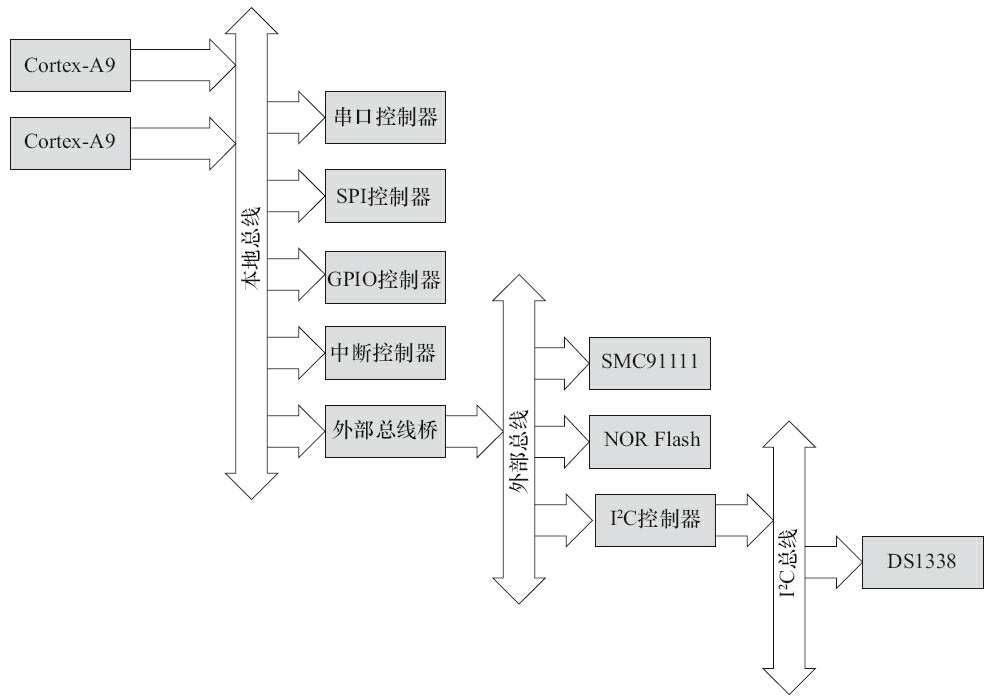

# ARMLinux设备树

## 1 设备树介绍

设备树是一种描述硬件的数据结构，它起源于OpenFirmware（OF）。在Linux 2.6中，ARM架构的板极硬件细节过多地被硬编码在arch/arm/plat-xxx和arch/arm/mach-xxx中，采用设备树后，许多硬件的细节可以直接通过它传递给Linux，而不再需要在内核中进行大量的冗余编码。

设备树由一系列被命名的节点（Node）和属性（Property）组成，而节点本身可包含子节点。所谓属性，其实就是成对出现的名称和值。在设备树中，可描述的信息包括（原先这些信息大多被硬编码在内核中）：

- CPU的数量和类别。
- 内存基地址和大小。
- 总线和桥。
- 外设连接。
- 中断控制器和中断使用情况。
- GPIO控制器和GPIO使用情况。
- 时钟控制器和时钟使用情况。

它基本上就是画一棵电路板上CPU、总线、设备组成的树，Bootloader会将这棵树传递给内核，然后内核可以识别这棵树，并根据它展开出Linux内核中的platform_device、i2c_client、spi_device等设备，而这些设备用到的内存、IRQ等资源，也被传递给了内核，内核会将这些资源绑定给展开的相应的设备。

## 2 设备树的组成和结构

整个设备树牵涉面比较广，即增加了新的用于描述设备硬件信息的文本格式，又增加了编译这个文本的工具，同时Bootloader也需要支持将编译后的设备树传递给Linux内核。

### 2.1 DTS、DTC和DTB等

#### 1 DTS

文件.dts是一种ASCII文本格式的设备树描述，此文本格式非常人性化，适合人类的阅读习惯。基本上，在ARM Linux中，一个.dts文件对应一个ARM的设备，一般放置在内核的arch/arm/boot/dts/目录中。值得注意的是，在arch/powerpc/boot/dts、arch/powerpc/boot/dts、arch/c6x/boot/dts、arch/openrisc/boot/dts等目录中，也存在大量的.dts文件，这证明DTS绝对不是ARM的专利。

由于一个SoC可能对应多个设备（一个SoC可以对应多个产品和电路板），这些.dts文件势必须包含许多共同的部分，Linux内核为了简化，把SoC公用的部分或者多个设备共同的部分一般提炼为.dtsi，类似于C语言的头文件。其他的设备对应的.dts就包括这个.dtsi。譬如，对于VEXPRESS而言，vexpress-v2m.dtsi就被vexpress-v2p-ca9.dts所引用，vexpress-v2p-ca9.dts有如下一行代码：

```dtd
/include/ "vexpress-v2m.dtsi"
```

当然，和C语言的头文件类似，.dtsi也可以包括其他的.dtsi，譬如几乎所有的ARM SoC的.dtsi都引用了skeleton.dtsi。

文件.dts（或者其包括的.dtsi）的基本元素即为前文所述的节点和属性，下面给出了一个设备树结构的模版。

```dtd
/ {
    node1 {
    a-string-property = "A string";
    a-string-list-property = "first string", "second string";
    a-byte-data-property = [0x01 0x23 0x34 0x56];
    child-node1 {
        first-child-property;
        second-child-property = <1>;
        a-string-property = "Hello, world";
    };
    child-node2 {
    };
    };
    node2 {
        an-empty-property;
        a-cell-property = <1 2 3 4>; /* each number (cell) is a uint32 */
        child-node1 {
        };
    };
};
```

上述.dts文件并没有什么真实的用途，但它基本表征了一个设备树源文件的结构：

1个root节点"/"；root节点下面含一系列子节点，本例中为node1和node2；节点node1下又含有一系列子节点，本例中为child-node1和child-node2；各节点都有一系列属性。这些属性可能为空，如an-emptyproperty；可能为字符串，如a-string-property；可能为字符串数组，如a-string-list-property；可能为Cells（由u32整数组成），如second-child-property；可能为二进制数，如a-byte-data-property。

下面以一个最简单的设备为例来看如何写一个.dts文件。如下图所示，假设此设备的配置如下：



1个双核ARM Cortex-A932位处理器；ARM本地总线上的内存映射区域分布有两个串口（分别位于0x101F1000和0x101F2000）、GPIO控制器（位于0x101F3000）、SPI控制器（位于0x10170000）、中断控制器（位于0x10140000）和一个外部总线桥；外部总线桥上又连接了SMC SMC91111以太网（位于0x10100000）、I2C控制器（位于0x10160000）、64MB NOR Flash（位于0x30000000）；外部总线桥上连接的I2C控制器所对应的I2C总线上又连接了Maxim DS1338实时钟（I2C地址为0x58）。

对于上图所示硬件结构图，如果用“.dts”描述，则其对应的“.dts”文件代码如下。

```dtd
/ {
    compatible = "acme,coyotes-revenge";
    #address-cells = <1>;
    #size-cells = <1>;
    interrupt-parent = <&intc>;

    cpus {
        #address-cells = <1>;
        #size-cells = <0>;
        cpu@0 {
            compatible = "arm,cortex-a9";
            reg = <0>;
        };
        cpu@1 {
            compatible = "arm,cortex-a9";
            reg = <1>;
        };
    };

    serial@101f0000 {
        compatible = "arm,pl011";
        reg = <0x101f0000 0x1000 >;
        interrupts = < 1 0 >;
    };

    serial@101f2000 {
        compatible = "arm,pl011";
        reg = <0x101f2000 0x1000 >;
        interrupts = < 2 0 >;
    };

    gpio@101f3000 {
        compatible = "arm,pl061";
        reg = <0x101f3000 0x1000
               0x101f4000 0x0010>;
        interrupts = < 3 0 >;
    };

    intc: interrupt-controller@10140000 {
        compatible = "arm,pl190";
        reg = <0x10140000 0x1000 >;
        interrupt-controller;
        #interrupt-cells = <2>;
    };

    spi@10115000 {
        compatible = "arm,pl022";
        reg = <0x10115000 0x1000 >;
        interrupts = < 4 0 >;
    };

    external-bus {
        #address-cells = <2>
        #size-cells = <1>;
        ranges = <0 0 0x10100000 0x10000 // Chipselect 1, Ethernet
                  1 0 0x10160000 0x10000 // Chipselect 2, i2c controller
                  2 0 0x30000000 0x1000000>; // Chipselect 3, NOR Flash

        ethernet@0,0 {
            compatible = "smc,smc91c111";
            reg = <0 0 0x1000>;
            interrupts = < 5 2 >;
        };

        i2c@1,0 {
            compatible = "acme,a1234-i2c-bus";
            #address-cells = <1>;
            #size-cells = <0>;
            reg = <1 0 0x1000>;
            interrupts = < 6 2 >;
            rtc@58 {
                compatible = "maxim,ds1338";
                reg = <58>;
                interrupts = < 7 3 >;
            };
        };

        flash@2,0 {
            compatible = "samsung,k8f1315ebm", "cfi-flash";
            reg = <2 0 0x4000000>;
        };
    };
};
```

在上述.dts文件中，可以看出external-bus是根节点的子节点，而I2C又是external-bus的子节点，RTC又进一步是I2C的子节点。每一级节点都有一些属性信息，本章后续部分会进行详细解释。

#### 2 DTC

DTC是将.dts编译为.dtb的工具。DTC的源代码位于内核的scripts/dtc目录中，在Linux内核使能了设备树的情况下，编译内核的时候主机工具DTC会被编译出来，对应于scripts/dtc/Makefile中`hostprogs-y：=dtc`这一hostprogs的编译目标。

当然，DTC也可以在Ubuntu中单独安装，命令如下：

```shell
sudo apt-get install device-tree-compiler
```

在Linux内核的arch/arm/boot/dts/Makefile中，描述了当某种SoC被选中后，哪些.dtb文件会被编译出来，如与VEXPRESS对应的.dtb包括：

```makefile
dtb-$(CONfiG_ARCH_VEXPRESS) += vexpress-v2p-ca5s.dtb \
    vexpress-v2p-ca9.dtb \
    vexpress-v2p-ca15-tc1.dtb \
    vexpress-v2p-ca15_a7.dtb \
    xenvm-4.2.dtb
```

在Linux下，我们可以单独编译设备树文件。当我们在Linux内核下运行make dtbs时，若我们之前选择了ARCH_VEXPRESS，上述.dtb都会由对应的.dts编译出来，因为arch/arm/Makefile中含有一个.dtbs编译目标项目。

DTC除了可以编译.dts文件以外，其实也可以“反汇编”.dtb文件为.dts文件，其指令格式为：

```shell
./scripts/dtc/dtc -I dtb -O dts -o xxx.dts arch/arm/boot/dts/xxx.dtb
```

#### 3 DTB

文件.dtb是.dts被DTC编译后的二进制格式的设备树描述，可由Linux内核解析，当然U-Boot这样的bootloader也是可以识别.dtb的。

通常在我们为电路板制作NAND、SD启动映像时，会为.dtb文件单独留下一个很小的区域以存放之，之后bootloader在引导内核的过程中，会先读取该.dtb到内存。

Linux内核也支持一种变通的模式，可以不把.dtb文件单独存放，而是直接和zImage绑定在一起做成一个映像文件，类似cat zImage xxx.dtb>zImage_with_dtb的效果。当然内核编译时候要使能CONFIG_ARM_APPENDED_DTB这个选项，以支持“Use appended device tree blob to zImage”（见Linux内核中的菜单）。

#### 4 绑定(Binding)文档

对于设备树中的节点和属性具体是如何来描述设备的硬件细节的，一般需要文档来进行讲解，文档的后缀名一般为.txt。在这个.txt文件中，需要描述对应节点的兼容性、必需的属性和可选的属性。

这些文档位于内核的Documentation/devicetree/bindings目录下，其下又分为很多子目录。譬如，Documentation/devicetree/bindings/i2c/i2c-xiic.txt描述了Xilinx的I2C控制器，其内容如下：

```dtd
Xilinx IIC controller:

Required properties:
- compatible : Must be "xlnx,xps-iic-2.00.a"
- reg : IIC register location and length
- interrupts : IIC controller unterrupt
- #address-cells = <1>
- #size-cells = <0>

Optional properties:
- Child nodes conforming to i2c bus binding

Example:
axi_iic_0: i2c@40800000 {
    compatible = "xlnx,xps-iic-2.00.a";
    interrupts = < 1 2 >;
    reg = < 0x40800000 0x10000 >;
    #size-cells = <0>;
    #address-cells = <1>;
};
```

基本可以看出，设备树绑定文档的主要内容包括：

- 关于该模块最基本的描述。
- 必需属性（Required Properties）的描述。
- 可选属性（Optional Properties）的描述。
- 一个实例。

Linux内核下的scripts/checkpatch.pl会运行一个检查，如果有人在设备树中新添加了compatible字符串，而没有添加相应的文档进行解释，checkpatch程序会报出警告：UNDOCUMENTED_DT_STRINGDT compatible string xxx appears un-documented，因此程序员要养成及时写DT Binding文档的习惯。

#### Bootloader

Uboot设备从v1.1.3开始支持设备树，其对ARM的支持则是和ARM内核支持设备树同期完成。

为了使能设备树，需要在编译Uboot的时候在config文件中加入：

```c
#define CONfiG_OF_LIBFDT
```

在Uboot中，可以从NAND、SD或者TFTP等任意介质中将.dtb读入内存，假设.dtb放入的内存地址为0x71000000，之后可在Uboot中运行fdt addr命令设置.dtb的地址，如：

```shell
UBoot> fdt addr 0x71000000
```

fdt的其他命令就变得可以使用，如fdt resize、fdt print等。

对于ARM来讲，可以通过bootz kernel_addr initrd_address dtb_address的命令来启动内核，即dtb_address作为bootz或者bootm的最后一个参数，第一个参数为内核映像的地址，第二个参数为initrd的地址，若不存在initrd，可以用“-”符号代替。

### 2.2 根节点兼容性

上述.dts文件中，第2行根节点"/"的兼容属性compatible="acme，coyotes-revenge"；定义了整个系统（设备级别）的名称，它的组织形式为：`<manufacturer>, <model>`。

Linux内核通过根节点"/"的兼容属性即可判断它启动的是什么设备。在真实项目中，这个顶层设备的兼容属性一般包括两个或者两个以上的兼容性字符串，首个兼容性字符串是板子级别的名字，后面一个兼容性是芯片级别（或者芯片系列级别）的名字。

```dtd
compatible = "arm,vexpress,v2p-ca9", "arm,vexpress";        // 板子arch/arm/boot/dts/vexpress-v2p-ca9.dts
compatible = "arm,vexpress,v2p-ca5s", "arm,vexpress";       // 板子arch/arm/boot/dts/vexpress-v2p-ca5s.dts
compatible = "arm,vexpress,v2p-ca15_a7", "arm,vexpress";    // 板子arch/arm/boot/dts/vexpress-v2p-ca15_a7.dts
```

可以看出，上述各个电路板的共性是兼容于arm，vexpress，而特性是分别兼容于arm，vexpress，v2pca9、arm，vexpress，v2p-ca5s和arm，vexpress，v2p-ca15_a7。

```dtd
compatible = "insignal,origen", "samsung,exynos4210", "samsung,exynos4";        // arch/arm/boot/dts/exynos4210-origen.dts
compatible = "samsung,universal_c210", "samsung,exynos4210", "samsung,exynos4"; // arch/arm/boot/dts/exynos4210-universal_c210.dts
```

第一个字符串是板子名字（很特定），第2个字符串是芯片名字（比较特定），第3个字段是芯片系列的名字（比较通用）。由此可见两者的区别只在于第1个字符串（特定的板子名字）不一样，后面芯片名和芯片系列的名字都一样。

在Linux 2.6内核中，ARM Linux针对不同的电路板会建立由MACHINE_START和MACHINE_END包围起来的针对这个设备的一系列回调函数。如下：

```c
MACHINE_START(VEXPRESS, "ARM-Versatile Express")
    .atag_offset = 0x100,
    .smp = smp_ops(vexpress_smp_ops),
    .map_io = v2m_map_io,
    .init_early = v2m_init_early,
    .init_irq = v2m_init_irq,
    .timer = &v2m_timer,
    .handle_irq = gic_handle_irq,
    .init_machine = v2m_init,
    .restart = vexpress_restart,
MACHINE_END
```

这些不同的设备会有不同的MACHINEID，Uboot在启动Linux内核时会将MACHINE ID存放在r1寄存器，Linux启动时会匹配Bootloader传递的MACHINEID和MACHINE_START声明的MACHINEID，然后执行相应设备的一系列初始化函数。

ARM Linux 3.x在引入设备树之后，MACHINE_START变更为DT_MACHINE_START，其中含有一个.dt_compat成员，用于表明相关的设备与.dts中根节点的兼容属性兼容关系。如果Bootloader传递给内核的设备树中根节点的兼容属性出现在某设备的.dt_compat表中，相关的设备就与对应的兼容匹配，从而引发这一设备的一系列初始化函数被执行。一个典型的DT_MACHINE如下：

```c
static const char * const v2m_dt_match[] __initconst = {
    "arm,vexpress",
    "xen,xenvm",
    NULL,
};
DT_MACHINE_START(VEXPRESS_DT, "ARM-Versatile Express")
    .dt_compat = v2m_dt_match,
    .smp = smp_ops(vexpress_smp_ops),
    .map_io = v2m_dt_map_io,
    .init_early = v2m_dt_init_early,
    .init_irq = v2m_dt_init_irq,
    .timer = &v2m_dt_timer,
    .init_machine = v2m_dt_init,
    .handle_irq = gic_handle_irq,
    .restart = vexpress_restart,
MACHINE_END
```

Linux倡导针对多个SoC、多个电路板的通用DT设备，即一个DT设备的.dt_compat包含多个电路板.dts文件的根节点兼容属性字符串。之后，如果这多个电路板的初始化序列不一样，可以通过intof_machine_is_compatible（const char*compat）API判断具体的电路板是什么。在Linux内核中，常常使用如下API来判断根节点的兼容性：

```c
int of_machine_is_compatible(const char *compat);
```

此API判断目前运行的板子或者SoC的兼容性，它匹配的是设备树根节点下的兼容属性。例如drivers/cpufreq/exynos-cpufreq.c中就有判断运行的CPU类型是exynos4210、exynos4212、exynos4412还是exynos5250的代码，进而分别处理，代码如下：

```c
static int exynos_cpufreq_probe(struct platform_device *pdev)
{
    int ret = -EINVAL;

    exynos_info = kzalloc(sizeof(*exynos_info), GFP_KERNEL);
    if (!exynos_info)
        return -ENOMEM;

    exynos_info->dev = &pdev->dev;

    if (of_machine_is_compatible("samsung,exynos4210")) {
        exynos_info->type = EXYNOS_SOC_4210;
        ret = exynos4210_cpufreq_init(exynos_info);
    } else if (of_machine_is_compatible("samsung,exynos4212")) {
        exynos_info->type = EXYNOS_SOC_4212;
        ret = exynos4x12_cpufreq_init(exynos_info);
    } else if (of_machine_is_compatible("samsung,exynos4412")) {
        exynos_info->type = EXYNOS_SOC_4412;
        ret = exynos4x12_cpufreq_init(exynos_info);
    } else if (of_machine_is_compatible("samsung,exynos5250")) {
        exynos_info->type = EXYNOS_SOC_5250;
        ret = exynos5250_cpufreq_init(exynos_info);
    } else {
        pr_err("%s: Unknown SoC type\n", __func__);
        return -ENODEV;
    }
    ...
}
```

如果一个兼容包含多个字符串，譬如对于前面介绍的根节点兼容compatible="samsung，universal_c210"，"samsung，exynos4210"，"samsung，exynos4"的情况，如下3个表达式都是成立的。

```c
of_machine_is_compatible("samsung,universal_c210")
of_machine_is_compatible("samsung,exynos4210")
of_machine_is_compatible("samsung,exynos4")
```

### 2.3 设备节点兼容性

在.dts文件的每个设备节点中，都有一个兼容属性，兼容属性用于驱动和设备的绑定。兼容属性是一个字符串的列表，列表中的第一个字符串表征了节点代表的确切设备，形式为`<manufacturer>, <model>`，其后的字符串表征可兼容的其他设备。可以说前面的是特指，后面的则涵盖更广的范围。如在vexpress-v2m.dtsi中的Flash节点如下：

```dtd
flash@0,00000000 {
compatible = "arm,vexpress-flash", "cfi-flash";
reg = <0 0x00000000 0x04000000>,
      <1 0x00000000 0x04000000>;
      bank-width = <4>;
};
```

兼容属性的第2个字符串"cfi-flash"明显比第1个字符串"arm，vexpress-flash"涵盖的范围更广。

再如，Freescale MPC8349SoC含一个串口设备，它实现了国家半导体（National Sem-iconductor）的NS16550寄存器接口。则MPC8349串口设备的兼容属性为compatible="fsl，mpc8349-uart"，"ns16550"。其中，fsl，mpc8349-uart指代了确切的设备，ns16550代表该设备与NS16550UART保持了寄存器兼容。因此，设备节点的兼容性和根节点的兼容性是类似的，都是“从具体到抽象”。

使用设备树后，驱动需要与.dts中描述的设备节点进行匹配，从而使驱动的probe（）函数执行。对于platform_driver而言，需要添加一个OF匹配表，如前文的.dts文件的"acme，a1234-i2c-bus"兼容I2C控制器节点的OF匹配表，具体代码如下所示。

```c
static const struct of_device_id a1234_i2c_of_match[] = {
    {.compatible = "acme,a1234-i2c-bus",},
    {},
};
MODULE_DEVICE_TABLE(of, a1234_i2c_of_match);

static struct platform_driver i2c_a1234_driver = {
    .driver = {
        .name = "a1234-i2c-bus",
        .owner = THIS_MODULE,
        .of_match_table = a1234_i2c_of_match,
    },
    .probe = i2c_a1234_probe,
    .remove = i2c_a1234_remove,
};
module_platform_driver(i2c_a1234_driver);
```

