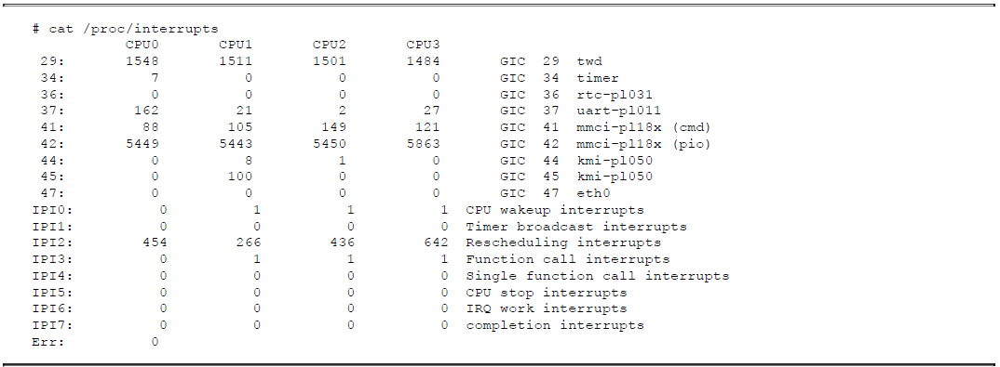
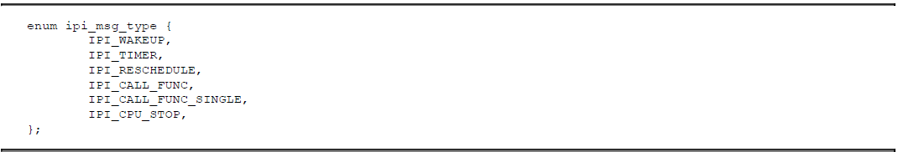
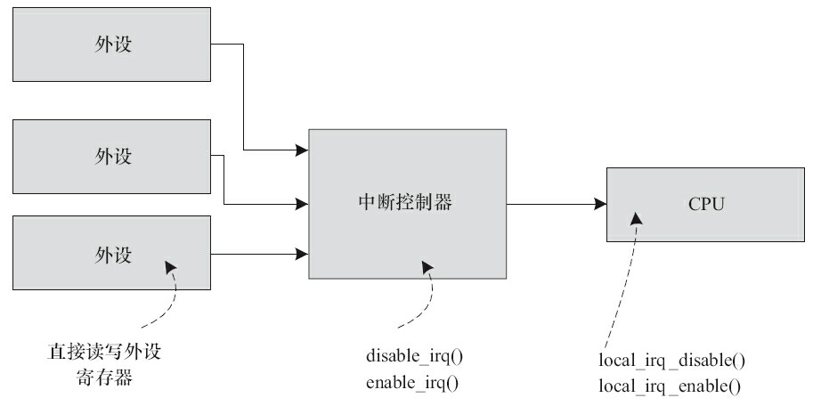
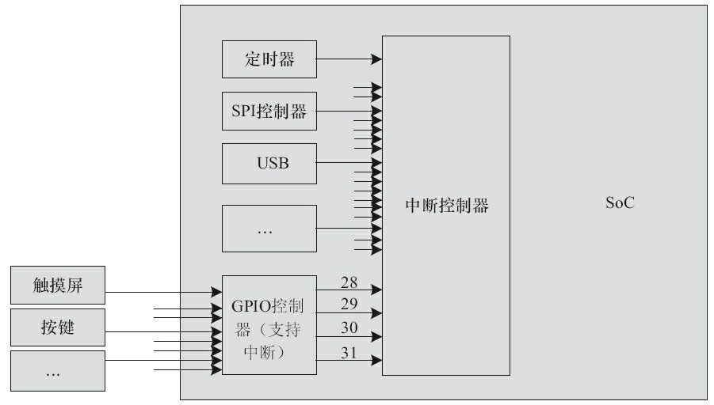
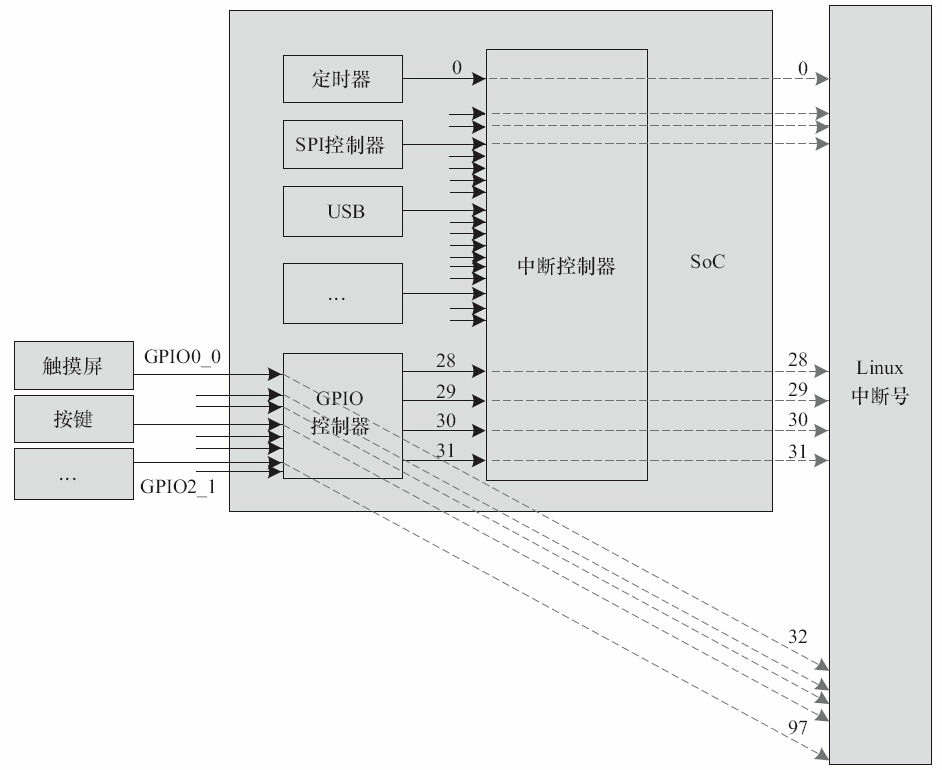
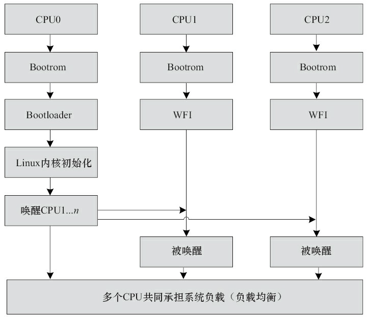
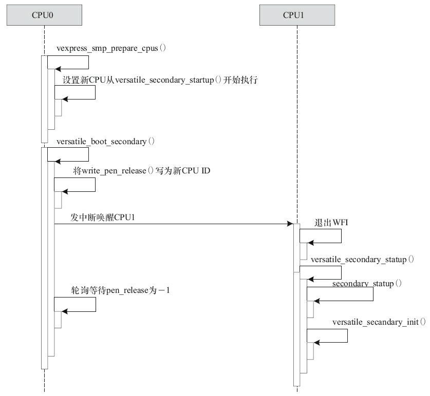
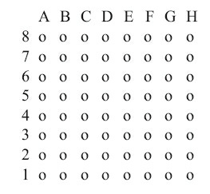
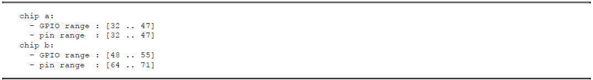
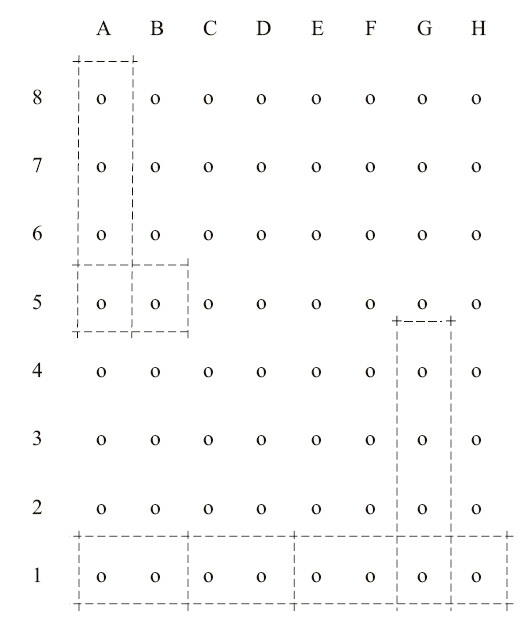

# 芯片级移植及底层驱动

## 1 ARM Linux底层驱动的组成和现状

为了让Linux在一个全新的ARM SoC上运行，需要提供大量的底层支撑，如定时器节拍、中断控制器、SMP启动、CPU热插拔以及底层的GPIO、时钟、pinctrl和DMA硬件的封装等。定时器节拍、中断控制器、SMP启动和CPU热插拔这几部分相对来说没有像早期GPIO、时钟、pinctrl和DMA的实现那么杂乱，基本上有个固定的套路。定时器节拍为Linux基于时间片的调度机制以及内核和用户空间的定时器提供支撑，中断控制器的驱动则使得Linux内核的工程师可以直接调用local_irq_disable()、disable_irq()等通用的中断API，而SMP启动支持则用于让SoC内部的多个CPU核都投入运行，CPU热插拔则运行运行时挂载或拔除CPU。这些工作，在Linux 3.0之后的内核中，Linux社区对比逐步进行了良好的层次划分和架构设计。

在GPIO、时钟、pinctrl和DMA驱动方面，在Linux 2.6时代，内核已或多或少有GPIO、时钟等底层驱动的架构，但是核心层的代码太薄弱，各SoC在这些基础设施实现方面存在巨大差异，而且每个SoC仍然需要实现大量的代码。pinctrl和DMA则最为混乱，几乎各家公司都定义了自己独特的实现和API。

社区必须改变这种局面，于是Linux社区在2011年后进行了如下工作，这些工作在目前的Linux内核中基本准备就绪：

- STEricsson公司的工程师Linus Walleij提供了新的pinctrl驱动架构，内核中新增加一个drivers/pinctrl目录，支撑SoC上的引脚复用，各个SoC的实现代码统一放入该目录。
- TI公司的工程师Mike Turquette提供了通过时钟框架，让具体SoC实现clk_ops()成员函数，并通过clk_register()、clk_register_clkdev()注册时钟源以及源与设备的对应关系，具体的时钟驱动都统一迁移到drivers/clk目录中。
- 建议各SoC统一采用dmaengine架构实现DMA驱动，该架构提供了通用的DMA通道API，如dmaengine_prep_slave_single()、dmaengine_submit()等，要求SoC实现dma_device的成员函数，实现代码统一放入drivers/dma目录中。
- 在GPIO方面，drivers/gpio下的gpiolib已能与新的pinctrl完美共存，实现引脚的GPIO和其他功能之间的复用，具体的SoC只需实现通用的gpio_chip结构体的成员函数。

经过以上工作，基本上就把芯片底层基础架构方面的驱动架构统一了，实现方法也统一了。另外，目前GPIO、时钟、pinmux等都能良好地进行设备树的映射处理，譬如我们可以方便地在.dts中定义一个设备要的时钟、pinmux引脚以及GPIO。

除了上述基础设施以外，在将Linux移植入新的SoC过程中，工程师常常强烈依赖于早期的printk功能，内核则提供了相关的DEBUG_LL和EARLY_PRINTK支持，只需要SoC提供商实现少量的回调函数或宏。

## 2 内核节拍驱动

Linux 2.6的早期(Linux2.6.21之前)内核是基于节拍设计的，一般SoC公司在将Linux移植到自己芯片上的时候，会从芯片内部找一个定时器，并将该定时器配置为赫兹的频率，在每个时钟节拍到来时，调用ARM Linux内核核心层的timer_tick()函数，从而引发系统里的一系列行为。如Linux 2.6.17中arch/arm/mach-s3c2410/time.c的做法类似于下面代码所示。

```c
/*
 * IRQ handler for the timer
 */
static irqreturn_t
s3c2410_timer_interrupt(int irq, void *dev_id, struct pt_regs *regs)
{
    write_seqlock(&xtime_lock);
    timer_tick(regs);
    write_sequnlock(&xtime_lock);
    return IRQ_HANDLED;
}

static struct irqaction s3c2410_timer_irq = {
    .name = "S3C2410 Timer Tick",
    .flags = SA_INTERRUPT | SA_TIMER,
    .handler = s3c2410_timer_interrupt,
};
static void __init s3c2410_timer_init (void)
{
    s3c2410_timer_setup();
    setup_irq(IRQ_TIMER4, &s3c2410_timer_irq);
}
```

上述代码将硬件的TIMER4定时器配置为周期触发中断，每个中断到来就会自动调用内核函数timer_tick()。

当前Linux多采用无节拍方案，并支持高精度定时器，内核的配置一般会使能NO_HZ(即无节拍，或者说动态节拍)和HIGH_RES_TIMERS。要强调的是无节拍并不是说系统中没有时钟节拍，而是说这个节拍不再像以前那样周期性地产生。无节拍意味着，根据系统的运行情况，以事件驱动的方式动态决定下一个节拍在何时发生。如果画一个时间轴，周期节拍的系统节拍中断发生的时序如下图所示：


而NO_HZ的Linux的运行节拍如下图所示，看起来则是：两次定时器中断发生的时间间隔可长可短：


在当前的Linux系统中，SoC底层的定时器被实现为一个clock_event_device和clocksource形式的驱动。在clock_event_device结构体中，实现其set_mode()和set_next_event()成员函数；在clocksource结构体中，主要实现read()成员函数。而在定时器中断服务程序中，不再调用timer_tick()，而是调用clock_event_device的event_handler()成员函数。一个典型SoC的底层节拍定时器驱动形如下面代码所示。

```c
static irqreturn_t xxx_timer_interrupt(int irq, void *dev_id)
{
    struct clock_event_device *ce = dev_id;
    …
    ce->event_handler(ce);

    return IRQ_HANDLED;
}

/* read 64-bit timer counter */
static cycle_t xxx_timer_read(struct clocksource *cs)
{
    u64 cycles;

    /* read the 64-bit timer counter */
    cycles = readl_relaxed(xxx_timer_base + LATCHED_HI);
    cycles=(cycles<<32)|readl_relaxed(xxx_timer_base + LATCHED_LO);

    return cycles;
}

static int xxx_timer_set_next_event(unsigned long delta,
                                    struct clock_event_device *ce)
{
    unsigned long now, next;
    now = readl_relaxed(xxx_timer_base + LATCHED_LO);
    next = now + delta;
    writel_relaxed(next, xxx_timer_base + SIRFSOC_TIMER_MATCH_0);
    ...
}

static void xxx_timer_set_mode(enum clock_event_mode mode,
                               struct clock_event_device *ce)
{
    switch (mode) {
    case CLOCK_EVT_MODE_PERIODIC:
    …
    case CLOCK_EVT_MODE_ONESHOT:
    …
    case CLOCK_EVT_MODE_SHUTDOWN:
    …
    case CLOCK_EVT_MODE_UNUSED:
    case CLOCK_EVT_MODE_RESUME:
    break;
    }
}
static struct clock_event_device xxx_clockevent = {
    .name = "xxx_clockevent",
    .rating = 200,
    .features = CLOCK_EVT_FEAT_ONESHOT,
    .set_mode = xxx_timer_set_mode,
    .set_next_event = xxx_timer_set_next_event,
};

static struct clocksource xxx_clocksource = {
    .name = "xxx_clocksource",
    .rating = 200,
    .mask = CLOCKSOURCE_MASK(64),
    .flags = CLOCK_SOURCE_IS_CONTINUOUS,
    .read = xxx_timer_read,
    .suspend = xxx_clocksource_suspend,
    .resume = xxx_clocksource_resume,
};

static struct irqaction xxx_timer_irq = {
    .name = "xxx_tick",
    .flags = IRQF_TIMER,
    .irq = 0,
    .handler = xxx_timer_interrupt,
    .dev_id = &xxx_clockevent,
};

static void __init xxx_clockevent_init(void)
{
    clockevents_calc_mult_shift(&xxx_clockevent, CLOCK_TICK_RATE, 60);

    xxx_clockevent.max_delta_ns =
    clockevent_delta2ns(-2, &xxx_clockevent);
    xxx_clockevent.min_delta_ns =
    clockevent_delta2ns(2, &xxx_clockevent);

    xxx_clockevent.cpumask = cpumask_of(0);
    clockevents_register_device(&xxx_clockevent);
}

/* initialize the kernel jiffy timer source */
static void __init xxx_timer_init(void)
{
    …
    BUG_ON(clocksource_register_hz(&xxx_clocksource, CLOCK_TICK_RATE));
    BUG_ON(setup_irq(xxx_timer_irq.irq, &xxx_timer_irq));
    xxx_clockevent_init();
}
struct sys_timer xxx_timer = {
    .init = xxx_timer_init,
};
```

在上述代码中，特别关注如下的函数：

**1.clock_event_device的set_next_event成员函数xxx_timer_set_next_event()**

该函数的delta参数是Linux内核传递给底层定时器的一个差值，它的含义是下一次节拍中断产生的硬件定时器中计数器的值相对于当前计数器的差值。我们在该函数中将硬件定时器设置为在“当前计数器计数值+delta”的时刻产生下一次节拍中断。xxx_clockevent_init()函数中设置了可接受的最小和最大delta值对应的纳秒数，即xxx_clockevent.min_delta_ns和xxx_clockevent.max_delta_ns。

**2.clocksource的read成员函数xxx_timer_read()**

该函数可读取出从开机到当前时刻定时器计数器已经走过的值，无论有没有设置当计数器达到某值时产生中断，硬件的计数总是在进行的(我们要理解，计数总是在进行，而计数到某值后要产生中断则需要软件设置)。因此，该函数给Linux系统提供了一个底层的准确的参考时间。

**3.定时器的中断服务程序xxx_timer_interrupt()**

在该中断服务程序中，直接调用clock_event_device的event_handler()成员函数，event_handler()成员函数的具体工作也是Linux内核根据Linux内核配置和运行情况自行设置的。

**4.clock_event_device的set_mode成员函数xxx_timer_set_mode()**

用于设置定时器的模式以及恢复、关闭等功能，目前一般采用ONESHOT模式，即一次一次产生中断。当然新版的Linux也可以使用老的周期性模式，如果内核在编译的时候未选择NO_HZ，该底层的定时器驱动依然可以为内核的运行提供支持。

这些函数的结合使得ARM Linux内核底层所需要的时钟得以运行。下面举一个典型的场景，假定定时器的晶振时钟频率为1MHz(即计数器每加1等于1μs)，应用程序通过nanosleep()API睡眠100μs，内核会据此换算出下一次定时器中断的delta值为100，并间接调用xxx_timer_set_next_event()去设置硬件让其在100μs后产生中断。100μs后，中断产生，xxx_timer_interrupt()被调用，event_handler()会间接唤醒睡眠的进程并导致nanosleep()函数返回，从而让用户进程继续。

这里要特别强调的是，对于多核处理器来说，一般的做法是给每个核分配一个独立的定时器，各个核根据自身的运行情况动态地设置自己时钟中断发生的时刻。看一下我们所运行的ARM vexpress的中断(GIC 29twd)即知：



而比较低效率的方法则是只给CPU0提供定时器，由CPU0将定时器中断通过IPI(Inter Processor Interrupt，处理器间中断)广播到其他核。对于ARM来讲，1号IPIIPI_TIMER就是来负责这个广播的，从arch/arm/kernel/smp.c可以看出：



## 3 中断控制器驱动

在Linux内核中，各个设备驱动可以简单地调用request_irq()、enable_irq()、disable_irq()、local_irq_disable()、local_irq_enable()等通用API来完成中断申请、使能、禁止等功能。在将Linux移植到新的SoC时，芯片供应商需要提供该部分API的底层支持。

local_irq_disable()、local_irq_enable()的实现与具体中断控制器无关，对于ARM v6以上的体系结构而言，是直接调用CPSID/CPSIE指令进行，而对于ARM v6以前的体系结构，则是通过MRS、MSR指令来读取和设置ARM的CPSR寄存器。由此可见，local_irq_disable()、local_irq_enable()针对的并不是外部的中断控制器，而是直接让CPU本身不响应中断请求。相关的实现位于arch/arm/include/asm/irqflags.h中，如下代码所示。

```c
#if __LINUX_ARM_ARCH__ >= 6

static inline unsigned long arch_local_irq_save(void)
{
    unsigned long flags;

    asm volatile(
        " mrs %0, cpsr @ arch_local_irq_save\n"
        " cpsid i"
        : "=r" (flags) : : "memory", "cc");
    return flags;
}

static inline void arch_local_irq_enable(void)
{
    asm volatile(
        " cpsie i @ arch_local_irq_enable"
        :
        :
        : "memory", "cc");
}

static inline void arch_local_irq_disable(void)
{
    asm volatile(
        " cpsid i @ arch_local_irq_disable"
        :
        :
        : "memory", "cc");
}
#else

/*
 * Save the current interrupt enable state & disable IRQs
 */
static inline unsigned long arch_local_irq_save(void)
{
    unsigned long flags, temp;

    asm volatile(
        " mrs %0, cpsr @ arch_local_irq_save\n"
        " orr %1, %0, #128\n"
        " msr cpsr_c, %1"
        : "=r" (flags), "=r" (temp)
        :
        : "memory", "cc");
    return flags;
}

/*
 * Enable IRQs
 */
static inline void arch_local_irq_enable(void)
{
    unsigned long temp;
    asm volatile(
        " mrs %0, cpsr @ arch_local_irq_enable\n"
        " bic %0, %0, #128\n"
        " msr cpsr_c, %0"
        : "=r" (temp)
        :
        : "memory", "cc");
}

/*
 * Disable IRQs
 */
static inline void arch_local_irq_disable(void)
{
    unsigned long temp;
    asm volatile(
        " mrs %0, cpsr @ arch_local_irq_disable\n"
        " orr %0, %0, #128\n"
        " msr cpsr_c, %0"
        : "=r" (temp)
        :
        : "memory", "cc");
}
 #endif
```

与local_irq_disable()和local_irq_enable()不同，disable_irq()、enable_irq()针对的则是中断控制器，因此它们适用的对象是某个中断。disable_irq()的字面意思是暂时屏蔽掉某中断(其实在内核的实现层面上做了延后屏蔽)，直到enable_irq()后再执行ISR。实际上，屏蔽中断可以发生在外设、中断控制器、CPU三个位置，如下图所示。对于外设端，是从源头上就不产生中断信号给中断控制器，由于它高度依赖于外设于本身，所以Linux不提供标准的API而是由外设的驱动直接读写自身的寄存器。



在内核中，通过irq_chip结构体来描述中断控制器。该结构体内部封装了中断mask、unmask、ack等成员函数，其定义于include/linux/irq.h中，如下代码所示。

```c
struct irq_chip {
    const char *name;
    unsigned int (*irq_startup)(struct irq_data *data);
    void (*irq_shutdown)(struct irq_data *data);
    void (*irq_enable)(struct irq_data *data);
    void (*irq_disable)(struct irq_data *data);

    void (*irq_ack)(struct irq_data *data);
    void (*irq_mask)(struct irq_data *data);
    void (*irq_mask_ack)(struct irq_data *data);
    void (*irq_unmask)(struct irq_data *data);
    void (*irq_eoi)(struct irq_data *data);

    int (*irq_set_affinity)(struct irq_data *data, const struct
                            cpumask *dest, bool force);
    int (*irq_retrigger)(struct irq_data *data);
    int (*irq_set_type)(struct irq_data *data, unsigned int
                        flow_type);
    int (*irq_set_wake)(struct irq_data *data, unsigned int on);
};
```

各个芯片公司会将芯片内部的中断控制器实现为irq_chip驱动的形式。受限于中断控制器硬件的能力，这些成员函数并不一定需要全部实现，有时候只需要实现其中的部分函数即可。譬如drivers/pinctrl/sirf/pinctrl-sirf.c驱动中的下面代码部分：

```c
static struct irq_chip sirfsoc_irq_chip = {
    .name = "sirf-gpio-irq",
    .irq_ack = sirfsoc_gpio_irq_ack,
    .irq_mask = sirfsoc_gpio_irq_mask,
    .irq_unmask = sirfsoc_gpio_irq_unmask,
    .irq_set_type = sirfsoc_gpio_irq_type,
};
```

我们只实现了其中的ack、mask、unmask和set_type成员函数，ack函数用于清中断，mask、unmask用于中断屏蔽和取消中断屏蔽、set_type则用于配置中断的触发方式，如高电平、低电平、上升沿、下降沿等。至于到enable_irq()的时候，虽然没有实现irq_enable()成员函数，但是内核会间接调用irq_unmask()成员函数，这点从kernel/irq/chip.c中可以看出：

```c
void irq_enable(struct irq_desc *desc)
{
    irq_state_clr_disabled(desc);
    if (desc->irq_data.chip->irq_enable)
        desc->irq_data.chip->irq_enable(&desc->irq_data);
    else
        desc->irq_data.chip->irq_unmask(&desc->irq_data);
    irq_state_clr_masked(desc);
}
```

在芯片内部，中断控制器可能不止1个，多个中断控制器之间还很可能是级联的。举个例子，假设芯片内部有一个中断控制器，支持32个中断源，其中有4个来源于GPIO控制器外围的4组GPIO，每组GPIO上又有32个中断(许多芯片的GPIO控制器也同时是一个中断控制器)，其关系如下图所示。



那么，一般来讲，在实际操作中，gpio0_0\~gpio0_31这些引脚本身在第1级会使用中断号28，而这些引脚本身的中断号在实现与GPIO控制器对应的irq_chip驱动时，我们又会把它映射到Linux系统的32\~63号中断。同理，gpio1_0\~gpio1_31这些引脚本身在第1级会使用中断号29，而这些引脚本身的中断号在实现与GPIO控制器对应的irq_chip驱动时，我们又会把它映射到Linux系统的64\~95号中断，以此类推。对于中断号的使用者而言，无须看到这种2级映射关系。如果某设备想申请与gpio1_0这个引脚对应的中断，它只需要申请64号中断即可。这个关系图看起来如下图所示。



> [!NOTE]
>
> 上面两个图中所涉及到的中断号数值，Linux使用IRQ Domain来描述一个中断控制器所管理的中断源。换句话说，每个中断控制器都有自己的Domain。我们可以将IRQ Domain看作是IRQ控制器的软件抽象。

在添加IRQ Domain的时候，内核中存在的映射方法有：irq_domain_add_legacy()、irq_domain_add_linear()、irq_domain_add_tree()等。irq_domain_add_legacy()实际上是一种过时的方法，它一般是由IRQ控制器驱动直接指定中断源硬件意义上的偏移(一般称为hwirq)和Linux逻辑上的中断号的映射关系。类似上面图中的指定映射可以被这种方法弄出来。irq_domain_add_linear()则在中断源和irq_desc之间建立线性映射，内核针对这个IRQDomain维护了一个hwirq和Linux逻辑IRQ之间关系的一个表，这个时候我们其实也完全不关心逻辑中断号了；irq_domain_add_tree()则更加灵活，逻辑中断号和hwirq之间的映射关系是用一棵radix树来描述的，我们需要通过查找的方法来寻找hwirq和Linux逻辑IRQ之间的关系，一般适合某中断控制器支持非常多中断源的情况。

实际上，在当前的内核中，中断号更多的是一个逻辑概念，具体数值是多少不是很关键。人们更多的是关心在设备树中设置正确的interrupt_parrent和相对该interrupt_parent的偏移。

以drivers/pinctrl/sirf/pinctrl-sirf.c的irq_chip部分为例，在sirfsoc_gpio_probe()函数中，每组GPIO的中断都通过gpiochip_set_chained_irqchip()级联到上一级中断控制器的中断。

```c
static int sirfsoc_gpio_probe(struct device_node *np)
{
    ...
    for (i = 0; i < SIRFSOC_GPIO_NO_OF_BANKS; i++) {
        bank = &sgpio->sgpio_bank[i];
        spin_lock_init(&bank->lock);
        bank->parent_irq = platform_get_irq(pdev, i);
        if (bank->parent_irq < 0) {
            err = bank->parent_irq;
            goto out_banks;
        }

        gpiochip_set_chained_irqchip(&sgpio->chip.gc,
                                     &sirfsoc_irq_chip,
                                     bank->parent_irq,
                                     sirfsoc_gpio_handle_irq);
    }

    ...
}
```

对于SIRFSOC_GPIO_NO_OF_BANKS这么多组GPIO进行循环，上述代码中第15行的bank->parent_irq是与这一组GPIO对应的“上级”中断号，sirfsoc_gpio_handle_irq()则是与bank->parent_irq对应的“上级”中断服务程序。而sirfsoc_gpio_handle_irq()这个“上级”函数最终还是要调用GPIO这一级别的中断服务程序。

在sirfsoc_gpio_handle_irq()函数的入口处调用chained_irq_enter()暗示自身进入链式IRQ处理，在函数体内判决具体的GPIO中断，并通过generic_handle_irq()调用最终的外设驱动中的中断服务程序，最后调用chained_irq_exit()暗示自身退出链式IRQ处理，如下代码所示：

```c
static void sirfsoc_gpio_handle_irq(unsigned int irq, struct irq_desc *desc)
{
    ...
    chained_irq_enter(chip, desc);

    while (status) {
        ctrl = readl(sgpio->chip.regs + SIRFSOC_GPIO_CTRL(bank->id, idx));

        /*
         * Here we must check whether the corresponding GPIO’s interrupt
         * has been enabled, otherwise just skip it
         */
        if ((status & 0x1) && (ctrl & SIRFSOC_GPIO_CTL_INTR_EN_MASK)) {
            generic_handle_irq(irq_find_mapping(gc->irqdomain, idx +
            bank->id * SIRFSOC_GPIO_BANK_SIZE));
        }

        idx++;
        status = status >> 1;
    }

    chained_irq_exit(chip, desc);
}
```

下面用一个实例来呈现这个过程，假设GPIO0_0\~31对应上级中断号28，而外设A使用了GPIO0_5(即第0组GPIO的第5个)，并假定外设A的中断号为37，即32+5，中断服务程序为deva_isr()。那么，当GPIO0_5中断发生的时候，内核的调用顺序是：sirfsoc_gpio_handle_irq()->generic_handle_irq()->deva_isr()。如果硬件的中断系统有更深的层次，这种软件上的中断服务程序级联实际上可以有更深的级别。

在上述实例中，GPIO0_0\~31的interrupt_parrent实际是上级中断控制器，而外设A的interrupt_parrent就是GPIO0，这些都会在设备树中进行呈现。

很多中断控制器的寄存器定义呈现出简单的规律，如有一个mask寄存器，其中每1位可屏蔽1个中断等，在这种情况下，我们无须实现1个完整的irq_chip驱动，而可以使用内核提供的通用irq_chip驱动架构irq_chip_generic，这样只需要实现极少量的代码，如drivers/irqchip/irq-sirfsoc.c中，用于注册CSRSiRFprimaII内部中断控制器的代码，如下：

```c
static __init void
sirfsoc_alloc_gc(void __iomem *base, unsigned int irq_start, unsigned int num)
{
    struct irq_chip_generic *gc;
    struct irq_chip_type *ct;
    int ret;
    unsigned int clr = IRQ_NOREQUEST | IRQ_NOPROBE | IRQ_NOAUTOEN;
    unsigned int set = IRQ_LEVEL;

    ret = irq_alloc_domain_generic_chips(sirfsoc_irqdomain,num, 1, "irq_sirfsoc",
    handle_level_irq, clr, set, IRQ_GC_INIT_MASK_CACHE);

    gc = irq_get_domain_generic_chip(sirfsoc_irqdomain, irq_start);
    gc->reg_base = base;
    ct = gc->chip_types;
    ct->chip.irq_mask = irq_gc_mask_clr_bit;
    ct->chip.irq_unmask = irq_gc_mask_set_bit;
    ct->regs.mask = SIRFSOC_INT_RISC_MASK0;
}
```

irq_chip驱动的入口声明方法形如：

```c
IRQCHIP_DECLARE(sirfsoc_intc, "sirf,prima2-intc", sirfsoc_irq_init);
```

sirf，prima2-intc是设备树中中断控制器的compatible字段，sirfsoc_irq_init是匹配这个compatible字段后运行的初始化函数。

特别值得一提的是，目前多数主流ARM芯片内部的一级中断控制器都使用了ARM公司的GIC，我们几乎不需要实现任何代码，只需要在设备树中添加相关的节点。

如在arch/arm/boot/dts/exynos5250.dtsi中即含有：

```dtd
gic:interrupt-controller@10481000 {
    compatible = "arm,cortex-a9-gic";
    #interrupt-cells = <3>;
    interrupt-controller;
    reg = <0x10481000 0x1000>, <0x10482000 0x2000>;
};
```

打开drivers/irqchip/irq-gic.c，发现GIC驱动的入口声明如下：

```c
IRQCHIP_DECLARE(gic_400, "arm,gic-400", gic_of_init);
IRQCHIP_DECLARE(cortex_a15_gic, "arm,cortex-a15-gic", gic_of_init);
IRQCHIP_DECLARE(cortex_a9_gic, "arm,cortex-a9-gic", gic_of_init);
IRQCHIP_DECLARE(cortex_a7_gic, "arm,cortex-a7-gic", gic_of_init);
IRQCHIP_DECLARE(msm_8660_qgic, "qcom,msm-8660-qgic", gic_of_init);
IRQCHIP_DECLARE(msm_qgic2, "qcom,msm-qgic2", gic_of_init);
```

这说明drivers/irqchip/irq-gic.c这个驱动可以兼容arm，gic-400、arm，cortex-a15-gic、arm，cortex-a7-gic等，但是初始化函数都是统一的gic_of_init。

## 4 SMP多核启动以及CPU热插拔驱动

在Linux系统中，对于多核的ARM芯片而言，在Bootrom代码中，每个CPU都会识别自身ID，如果ID是0，则引导Bootloader和Linux内核执行，如果ID不是0，则Bootrom一般在上电时将自身置于WFI或者WFE状态，并等待CPU0给其发CPU核间中断或事件(一般通过SEV指令)以唤醒它。一个典型的多核Linux启动过程如下图所示。



被CPU0唤醒的CPUn可以在运行过程中进行热插拔，譬如运行如下命令即可卸载CPU1，并且将CPU1上的任务全部迁移到其他CPU中：

```shell
# echo 0 > /sys/devices/system/cpu/cpu1/online
```

同理，运行如下命令可以再次启动CPU1：

```shell
# echo 1 > /sys/devices/system/cpu/cpu1/online
```

之后CPU1会主动参与系统中各个CPU之间要运行任务的负载均衡工作。

CPU0唤醒其他CPU的动作在内核中被封装为一个smp_operations的结构体，对于ARM而言，它定义于arch/arm/include/asm/smp.h中。该结构体的成员函数如下代码所示。

```c
struct smp_operations {
#ifdef CONFIG_SMP
    /*
    * Setup the set of possible CPUs (via set_cpu_possible)
    */
    void (*smp_init_cpus)(void);
    /*
    * Initialize cpu_possible map, and enable coherency
    */
    void (*smp_prepare_cpus)(unsigned int max_cpus);

    /*
    * Perform platform specific initialisation of the specified CPU.
    */
    void (*smp_secondary_init)(unsigned int cpu);
    /*
    * Boot a secondary CPU, and assign it the specified idle task.
    * This also gives us the initial stack to use for this CPU.
    */
    int (*smp_boot_secondary)(unsigned int cpu, struct task_struct *idle);
#ifdef CONFIG_HOTPLUG_CPU
    int (*cpu_kill)(unsigned int cpu);
    void (*cpu_die)(unsigned int cpu);
    int (*cpu_disable)(unsigned int cpu);
#endif
#endif
};
```

我们从arch/arm/mach-vexpress/v2m.c中看到VEXPRESS电路板用到的smp_ops()为vexpress_smp_ops：

```c
DT_MACHINE_START(VEXPRESS_DT, "ARM-Versatile Express")
    .dt_compat = v2m_dt_match,
    .smp = smp_ops(vexpress_smp_ops),
    .map_io = v2m_dt_map_io,
    …
MACHINE_END
```

通过arch/arm/mach-vexpress/platsmp.c的实现代码可以看出，smp_operations的成员函数smp_init_cpus()，即vexpress_smp_init_cpus()调用的ct_ca9x4_init_cpu_map()会探测SoC内CPU核的个数，并通过set_cpu_possible()设置这些CPU可见。

而smp_operations的成员函数smp_prepare_cpus()，即vexpress_smp_prepare_cpus()则会通过v2m_flags_set(virt_to_phys(versatile_secondary_startup))设置其他CPU的启动地址为versatile_secondary_startup，如下代码所示。

```c
static void __init vexpress_smp_prepare_cpus(unsigned int max_cpus)
{
    ...

    /*
    * Write the address of secondary startup into the
    * system-wide flags register. The boot monitor waits
    * until it receives a soft interrupt, and then the
    * secondary CPU branches to this address.
    */
    v2m_flags_set(virt_to_phys(versatile_secondary_startup));
}
```

> [!NOTE]
>
> 这部分的具体实现方法是与SoC相关的，由芯片的设计以及芯片内部的Bootrom决定。

对于VEXPRESS来讲，设置方法如下：

```c
void __init v2m_flags_set(u32 data)
{
    writel(~0, v2m_sysreg_base + V2M_SYS_FLAGSCLR);
    writel(data, v2m_sysreg_base + V2M_SYS_FLAGSSET);
}
```

即填充v2m_sysreg_base+V2M_SYS_FLAGSCLR标记清除寄存器为0xFFFFFFFF，将CPU1...n初始启动执行的指令地址填入v2m_sysreg_base+V2M_SYS_FLAGSSET寄存器。这两个地址由芯片实现时内部的Bootrom程序设定的。填入CPU1...n的起始地址都通过virt_to_phys()转化为物理地址，因为此时CPU1...n的MMU尚未开启。

比较关键的是smp_operations的成员函数smp_boot_secondary()，对于本例而言为versatile_boot_secondary()，它完成CPU的最终唤醒工作，如下面代码所示。

```c
static void write_pen_release(int val)
{
    pen_release = val;
    smp_wmb();
    sync_cache_w(&pen_release);
}

int versatile_boot_secondary(unsigned int cpu, struct task_struct *idle)
{
    unsigned long timeout;
    ...
    /*
    * This is really belt and braces; we hold unintended secondary
    * CPUs in the holding pen until we’re ready for them. However,
    * since we haven’t sent them a soft interrupt, they shouldn’t
    * be there.
    */
    write_pen_release(cpu_logical_map(cpu));

    /*
    * Send the secondary CPU a soft interrupt, thereby causing
    * the boot monitor to read the system wide flags register,
    * and branch to the address found there.
    */
    arch_send_wakeup_ipi_mask(cpumask_of(cpu));

    timeout = jiffies + (1 * HZ);
    while (time_before(jiffies, timeout)) {
        smp_rmb();
        if (pen_release == -1)
            break;

        udelay(10);
    }
    ...
    return pen_release != -1 -ENOSYS : 0;
}
```

上述代码第18行调用的write_pen_release()会将pen_release变量设置为要唤醒的CPU核的CPU号cpu_logical_map(cpu)，而后通过arch_send_wakeup_ipi_mask()给要唤醒的CPU发IPI中断，这个时候，被唤醒的CPU会退出WFI状态并从前面smp_operations中的smp_prepare_cpus()成员函数，即vexpress_smp_prepare_cpus()里通过v2m_flags_set()设置的起始地址versatile_secondary_startup开始执行，如果顺利的话，该CPU会将原先为正数的pen_release写为-1，以便CPU0从等待pen_release成为-1的循环(见第28~34行)中跳出。

versatile_secondary_startup实现于arch/arm/plat-versatile/headsmp.S中，是一段汇编，详细代码如下：

```assembly
ENTRY(versatile_secondary_startup)
        mrc p15, 0, r0, c0, c0, 5
        and r0, r0, #15
        adr r4, 1f
        ldmia r4, {r5, r6}
        sub r4, r4, r5
        add r6, r6, r4
pen:    ldr r7, [r6]
        cmp r7, r0
        bne pen

        /*
        * we’ve been released from the holding pen: secondary_stack
        * should now contain the SVC stack for this core
        */
        b secondary_startup

        .align
1:      .long .
        .long pen_release
ENDPROC(versatile_secondary_startup)
```

上述代码第8~10行的循环是等待pen_release变量成为CPU0设置的cpu_logical_map(cpu)，一般直接就成立了。第16行则调用内核通用的secondary_startup()函数，经过一系列的初始化(如MMU等)，最终新的被唤醒的CPU将调用smp_operations的smp_secondary_init()成员函数，对于本例为versatile_secondary_init()，如下面代码所示。

```c
void versatile_secondary_init(unsigned int cpu)
{
    /*
    * let the primary processor know we’re out of the
    * pen, then head off into the C entry point
    */
    write_pen_release(-1);

    /*
    * Synchronise with the boot thread.
    */
    spin_lock(&boot_lock);
    spin_unlock(&boot_lock);
}
```

上述代码第7行会将pen_release写为-1，于是CPU0还在执行的versatile_boot_secondary()函数中的如下循环就退出了：

```C
while (time_before(jiffies, timeout)) {
    smp_rmb();
    if (pen_release == -1)
        break;
    udelay(10);
}
```

这样CPU0就知道目标CPU已经被正确地唤醒，此后CPU0和新唤醒的其他CPU各自运行。整个系统在运行过程中会进行实时进程和正常进程的动态负载均衡。

下图总结性地描述了前文提到的vexpress_smp_prepare_cpus()、versatile_boot_secondary()、write_pen_release()、versatile_secondary_startup()、versatile_secondary_init()这些函数的执行顺序。



CPU热插拔的实现也是与芯片相关的，对于VEXPRESS而言，实现了smp_operations的cpu_die()成员函数，即vexpress_cpu_die()。它会在进行CPUn的拔除操作时将CPUn投入低功耗的WFI状态，相关代码位于arch/arm/mach-vexpress/hotplug.c中，如下代码所示：

```c
void __ref vexpress_cpu_die(unsigned int cpu)
{
    int spurious = 0;

    /*
    * we’re ready for shutdown now, so do it
    */
    cpu_enter_lowpower();
    platform_do_lowpower(cpu, &spurious);

    /*
    * bring this CPU back into the world of cache
    * coherency, and then restore interrupts
    */
    cpu_leave_lowpower();

    if (spurious)
        pr_warn("CPU%u: %u spurious wakeup calls\n", cpu, spurious);
}
static inline void platform_do_lowpower(unsigned int cpu, int *spurious)
{
    /*
    * there is no power-control hardware on this platform, so all
    * we can do is put the core into WFI; this is safe as the calling
    * code will have already disabled interrupts
    */
    for (;;) {
        wfi();

        if (pen_release == cpu_logical_map(cpu)) {
            /*
            * OK, proper wakeup, we're done
            */
            break;
        }

        /*
        * Getting here, means that we have come out of WFI without
        * having been woken up - this shouldn’t happen
        *
        * Just note it happening - when we’re woken, we can report
        * its occurrence.
        */
        (*spurious)++;
    }
}
```

CPUn睡眠于wfi()，之后再次在线的时候，又会因为CPU0给它发出的IPI而从wfi()函数返回继续执行，醒来时CPUn也判断“pen_release==cpu_logical_map(cpu)”是否成立，以确定该次醒来确实是由CPU0唤醒的一次正常醒来。

## 5 DEBUG_LL和EARLY_PRINTK的设置

## 6 GPIO驱动

在drivers/gpio下实现了通用的基于gpiolib的GPIO驱动，其中定义了一个通用的用于描述底层GPIO控制器的gpio_chip结构体，并要求具体的SoC实现gpio_chip结构体的成员函数，最后通过gpiochip_add()注册gpio_chip。GPIO驱动可以存在于drivers/gpio目录中，但是在GPIO兼有多种功能且需要复杂配置的情况下，GPIO的驱动部分往往直接移到drivers/pinctrl目录下并连同pinmux一起实现，而不存在于drivers/gpio目录中。

gpio_chip结构体封装了底层硬件的GPIO enable()/disable()等操作，它的定义如下代码所示：

```c
struct gpio_chip {
    const char *label;
    struct device *dev;
    struct module *owner;

    int (*request)(struct gpio_chip *chip,
    unsigned offset);
    void (*free)(struct gpio_chip *chip,
    unsigned offset);

    int (*direction_input)(struct gpio_chip *chip,
    unsigned offset);
    int (*get)(struct gpio_chip *chip,
    unsigned offset);
    int (*direction_output)(struct gpio_chip *chip,
    unsigned offset, int value);
    int (*set_debounce)(struct gpio_chip *chip,
    unsigned offset, unsigned debounce);

    void (*set)(struct gpio_chip *chip,
    unsigned offset, int value);

    int (*to_irq)(struct gpio_chip *chip,
    unsigned offset);

    void (*dbg_show)(struct seq_file *s,
    struct gpio_chip *chip);
    int base;
    u16 ngpio;
    const char *const *names;
    unsigned can_sleep:1;
    unsigned exported:1;

#if defined(CONFIG_OF_GPIO)
    /*
     * If CONFIG_OF is enabled, then all GPIO controllers described in the
     * device tree automatically may have an OF translation
     */
    struct device_node *of_node;
    int of_gpio_n_cells;
    int (*of_xlate)(struct gpio_chip *gc,
    const struct of_phandle_args *gpiospec, u32 *flags);
#endif
};
```

通过这层封装，每个具体的要用到GPIO的设备驱动都使用通用的GPIO API来操作GPIO，这些API主要用于GPIO的申请、释放和设置：

```c
int gpio_request(unsigned gpio, const char *label);
void gpio_free(unsigned gpio);
int gpio_direction_input(unsigned gpio);
int gpio_direction_output(unsigned gpio, int value);
int gpio_set_debounce(unsigned gpio, unsigned debounce);
int gpio_get_value_cansleep(unsigned gpio);
void gpio_set_value_cansleep(unsigned gpio, int value);
int gpio_request_one(unsigned gpio, unsigned long flags, const char *label);
int gpio_request_array(const struct gpio *array, size_t num);
void gpio_free_array(const struct gpio *array, size_t num);
int devm_gpio_request(struct device *dev, unsigned gpio, const char *label);
int devm_gpio_request_one(struct device *dev, unsigned gpio,
                          unsigned long flags, const char *label);
void devm_gpio_free(struct device *dev, unsigned int gpio);
```

> [!NOTE]
>
> 内核中针对内存、IRQ、时钟、GPIO、pinctrl、Regulator都有以devm_开头的API，使用这部分API的时候，内核会有类似于Java的资源自动回收机制，因此在代码中进行出错处理时，无须释放相关的资源。

对于GPIO而言，特别值得一提的是，内核会创建/sys节点/sys/class/gpio/gpioN/，通过它我们可以echo值从而改变GPIO的方向、设置并获取GPIO的值。

在拥有设备树支持的情况下，我们可以通过设备树来描述某GPIO控制器提供的GPIO引脚被具体设备使用的情况。在GPIO控制器对应的节点中，需定义#gpio-cells和gpio-controller属性，具体的设备节点则通过xxx-gpios属性来引用GPIO控制器节点及GPIO引脚。

如VEXPRESS电路板DT文件arch/arm/boot/dts/vexpress-v2m.dtsi中有如下GPIO控制器节点：

```dtd
v2m_sysreg: sysreg@00000 {
    compatible = "arm,vexpress-sysreg";
    reg = <0x00000 0x1000>;
    gpio-controller;
    #gpio-cells = <2>;
};
```

VEXPRESS电路板上的MMC控制器会使用该节点GPIO控制器提供的GPIO引脚，则具体的mmci@05000设备节点会通过-gpios属性引用GPIO：

```dtd
mmci@05000 {
    compatible = "arm,pl180", "arm,primecell";
    reg = <0x05000 0x1000>;
    interrupts = <9 10>;
    cd-gpios = <&v2m_sysreg 0 0>;
    wp-gpios = <&v2m_sysreg 1 0>;
    ...
};
```

其中的cd-gpios用于SD/MMC卡的探测，而wp-gpios用于写保护，MMC主机控制器驱动会通过如下方法获取这两个GPIO，详见于drivers/mmc/host/mmci.c：

```c
static void mmci_dt_populate_generic_pdata(struct device_node *np,
struct mmci_platform_data *pdata)
{
    ...
    pdata->gpio_wp = of_get_named_gpio(np, "wp-gpios", 0);
    pdata->gpio_cd = of_get_named_gpio(np, "cd-gpios", 0);
    ...
}
```

## 7 pinctrl驱动

许多SoC内部都包含pin控制器，通过pin控制器的寄存器，我们可以配置一个或者一组引脚的功能和特性。在软件上，Linux内核的pinctrl驱动可以操作pin控制器为我们完成如下工作：

- 枚举并且命名pin控制器可控制的所有引脚；
- 提供引脚复用的能力；
- 提供配置引脚的能力，如驱动能力、上拉下拉、开漏(Open Drain)等。

### 7.1 pinctrl和引脚

在特定SoC的pinctrl驱动中，我们需要定义引脚。假设有一个PGA封装的芯片的引脚排布如下图所示。



在pinctrl驱动初始化的时候，需要向pinctrl子系统注册一个pinctrl_desc描述符，该描述符的pins成员中包含所有引脚的列表。可以通过下面代码的方法来注册这个pin控制器并命名它的所有引脚。

```c
#include <linux/pinctrl/pinctrl.h>

const struct pinctrl_pin_desc foo_pins[] = {
    PINCTRL_PIN(0, "A8"),
    PINCTRL_PIN(1, "B8"),
    PINCTRL_PIN(2, "C8"),
    ...
    PINCTRL_PIN(61, "F1"),
    PINCTRL_PIN(62, "G1"),
    PINCTRL_PIN(63, "H1"),
};

static struct pinctrl_desc foo_desc = {
    .name = "foo",
    .pins = foo_pins,
    .npins = ARRAY_SIZE(foo_pins),
    .maxpin = 63,
    .owner = THIS_MODULE,
};

int __init foo_probe(void)
{
    struct pinctrl_dev *pctl;

    pctl = pinctrl_register(&foo_desc, <PARENT>, NULL);
    if (IS_ERR(pctl))
    pr_err("could not register foo pin driver\n");
}
```

### 7.2 引脚组(Pin Group)

在pinctrl子系统中，支持将一组引脚绑定为同一功能。假设{0，8，16，24}这一组引脚承担SPI的功能，而{24，25}这一组引脚承担I2C接口功能。在驱动的代码中，需要体现这个分组关系，并且为这些分组实现pinctrl_ops的成员函数get_groups_count()、get_group_name()和get_group_pins()，将pinctrl_ops填充到前文pinctrl_desc的实例foo_desc中，如下面代码所示。

```c
#include <linux/pinctrl/pinctrl.h>

struct foo_group {
    const char *name;
    const unsigned int *pins;
    const unsigned num_pins;
};

static const unsigned int spi0_pins[] = { 0, 8, 16, 24 };
static const unsigned int i2c0_pins[] = { 24, 25 };

static const struct foo_group foo_groups[] = {
    {
        .name = "spi0_grp",
        .pins = spi0_pins,
        .num_pins = ARRAY_SIZE(spi0_pins),
    },
    {
        .name = "i2c0_grp",
        .pins = i2c0_pins,
        .num_pins = ARRAY_SIZE(i2c0_pins),
    },
};


static int foo_get_groups_count(struct pinctrl_dev *pctldev)
{
    return ARRAY_SIZE(foo_groups);
}

static const char *foo_get_group_name(struct pinctrl_dev *pctldev,
                                      unsigned selector)
{
    return foo_groups[selector].name;
}

static int foo_get_group_pins(struct pinctrl_dev *pctldev, unsigned selector,
                              unsigned ** const pins,
                              unsigned * const num_pins)
{
    *pins = (unsigned *) foo_groups[selector].pins;
    *num_pins = foo_groups[selector].num_pins;
    return 0;
}

static struct pinctrl_ops foo_pctrl_ops = {
    .get_groups_count = foo_get_groups_count,
    .get_group_name = foo_get_group_name,
    .get_group_pins = foo_get_group_pins,
};


static struct pinctrl_desc foo_desc = {
    ...
    .pctlops = &foo_pctrl_ops,
};
```

get_groups_count()成员函数用于告知pinctrl子系统该SoC中合法的被选引脚组有多少个，而get_group_name()则提供引脚组的名字，get_group_pins()提供引脚组的引脚表。在设备驱动调用pinctrl通用API使能某一组引脚的对应功能时，pinctrl子系统的核心层会调用上述回调函数。

### 7.3 引脚配置

设备驱动有时候需要配置引脚，譬如可能把引脚设置为高阻或者三态(达到类似断连引脚的效果)，或通过某阻值将引脚上拉/下拉以确保默认状态下引脚的电平状态。在驱动中可以自定义相应板级引脚配置API的细节，譬如某设备驱动可能通过如下代码将某引脚上拉：

```c
#include <linux/pinctrl/consumer.h>
ret = pin_config_set("foo-dev", "FOO_GPIO_PIN", PLATFORM_X_PULL_UP);
```

其中的PLATFORM_X_PULL_UP由特定的pinctrl驱动定义。在特定的pinctrl驱动中，需要实现完成这些配置所需要的回调函数(pinctrl_desc的confops成员函数)，如下代码所示。

```c
#include <linux/pinctrl/pinctrl.h>
#include <linux/pinctrl/pinconf.h>
#include "platform_x_pindefs.h"

static int foo_pin_config_get(struct pinctrl_dev *pctldev,
                              unsigned offset,
                              unsigned long *config)
{
    struct my_conftype conf;

    ... Find setting for pin @ offset ...

    *config = (unsigned long) conf;
}

static int foo_pin_config_set(struct pinctrl_dev *pctldev,
                              unsigned offset,
                              unsigned long config)
{
    struct my_conftype *conf = (struct my_conftype *) config;

    switch (conf) {
        case PLATFORM_X_PULL_UP:
        {
            ...
        }
    }
}

static int foo_pin_config_group_get (struct pinctrl_dev *pctldev,
                                     unsigned selector,
                                     unsigned long *config)
{
    ...
}

static int foo_pin_config_group_set (struct pinctrl_dev *pctldev,
                                     unsigned selector,
                                     unsigned long config)
{
    ...
}

static struct pinconf_ops foo_pconf_ops = {
    .pin_config_get = foo_pin_config_get,
    .pin_config_set = foo_pin_config_set,
    .pin_config_group_get = foo_pin_config_group_get,
    .pin_config_group_set = foo_pin_config_group_set,
};

/* Pin config operations are handled by some pin controller */
static struct pinctrl_desc foo_desc = {
    ...
    .confops = &foo_pconf_ops,
};
```

其中的pin_config_group_get()、pin_config_group_set()针对的是可同时配置一个引脚组的状态情况，而pin_config_get()、pin_config_set()针对的则是单个引脚的配置。

### 7.4 与GPIO子系统的交互

pinctrl驱动所覆盖的引脚可同时作为GPIO用，内核的GPIO子系统和pinctrl子系统本来是并行工作的，但是有时候需要交叉映射，在这种情况下，需要在pinctrl驱动中告知pinctrl子系统核心层GPIO与底层pinctrl驱动所管理的引脚之间的映射关系。假设pinctrl驱动中定义的引脚32\~47与gpio_chip实例chip_a的GPIO对应，引脚64\~71与gpio_chip实例chip_b的GPIO对应，即映射关系为：



则在特定pinctrl驱动中可以通过如下代码注册两个GPIO范围，如下代码所示。

```c
struct gpio_chip chip_a;
struct gpio_chip chip_b;

static struct pinctrl_gpio_range gpio_range_a = {
    .name = "chip a",
    .id = 0,
    .base = 32,
    .pin_base = 32,
    .npins = 16,
    .gc = &chip_a;
};

static struct pinctrl_gpio_range gpio_range_b = {
    .name = "chip b",
    .id = 0,
    .base = 48,
    .pin_base = 64,
    .npins = 8,
    .gc = &chip_b;
};

{
    struct pinctrl_dev *pctl;
    ...
    pinctrl_add_gpio_range(pctl, &gpio_range_a);
    pinctrl_add_gpio_range(pctl, &gpio_range_b);
}
```

在基于内核gpiolib的GPIO驱动中，若设备驱动需进行GPIO申请gpio_request()和释放gpio_free()，GPIO驱动则会调用pinctrl子系统中的pinctrl_request_gpio()和pinctrl_free_gpio()通用API，pinctrl子系统会查找申请的GPIO和引脚的映射关系，并确认引脚是否被其他复用功能所占用。与pinctrl子系统通用层pinctrl_request_gpio()和pinctrl_free_gpio()API对应，在底层的具体pinctrl驱动中，需要实现pinmux_ops结构体的gpio_request_enable()和gpio_disable_free()成员函数。

除了gpio_request_enable()和gpio_disable_free()成员函数外，pinmux_ops结构体主要还用来封装pinmux功能使能/禁止的回调函数，下面可以看到它的更多细节。

### 7.5 引脚复用(pinmux)

在pinctrl驱动中可处理引脚复用，它定义了功能(FUNCTIONS)，驱动可以设置某功能的使能或者禁止。各个功能联合起来组成一个一维数组，譬如{spi0，i2c0，mmc0}就描述了3个不同的功能。

一个特定的功能总是要求由一些引脚组来完成，引脚组的数量可以为1个或者多个。假设对前文所描述的PGA封装的SoC而言，引脚分组如下图所示。



假设I2C功能由{A5，B5}引脚组成，而在定义引脚描述的pinctrl_pin_desc结构体实例foo_pins的时候，将它们的序号定义为了{24，25}；而SPI功能则可以由{A8，A7，A6，A5}和{G4，G3，G2，G1}，即{0，8，16，24}和{38，46，54，62}两个引脚组完成(注意在整个系统中，引脚组的名字不会重叠)。

据此，由功能和引脚组的组合就可以决定一组引脚在系统里的作用，因此在设置某组引脚的作用时，pinctrl的核心层会将功能的序号以及引脚组的序号传递给底层pinctrl驱动中相关的回调函数。

在整个系统中，驱动或板级代码调用pinmux相关的API获取引脚后，会形成一个pinctrl、使用引脚的设备、功能、引脚组的映射关系，假设在某电路板上，将让spi0设备使用pinctrl0的fspi0功能以及gspi0引脚组，让i2c0设备使用pinctrl0的fi2c0功能和gi2c0引脚组，我们将得到如下的映射关系：

```c
{
    {"map-spi0", spi0, pinctrl0, fspi0, gspi0},
    {"map-i2c0", i2c0, pinctrl0, fi2c0, gi2c0}
}
```

pinctrl子系统的核心会保证每个引脚的排他性，因此一个引脚如果已经被某设备用掉了，而其他的设备又申请该引脚以行使其他的功能或GPIO，则pinctrl核心层会让该次申请失败。

在特定pinctrl驱动中pinmux相关的代码主要处理如何使能/禁止某一{功能，引脚组}的组合，譬如，当spi0设备申请pinctrl0的fspi0功能和gspi0引脚组以便将gspi0引脚组配置为SPI接口时，相关的回调函数被组织进一个pinmux_ops结构体中，而该结构体的实例最终成为前文pinctrl_desc的pmxops成员，如下代码所示。

```c
#include <linux/pinctrl/pinctrl.h>
#include <linux/pinctrl/pinmux.h>

struct foo_group {
    const char *name;
    const unsigned int *pins;
    const unsigned num_pins;
};

static const unsigned spi0_0_pins[] = { 0, 8, 16, 24 };
static const unsigned spi0_1_pins[] = { 38, 46, 54, 62 };
static const unsigned i2c0_pins[] = { 24, 25 };
static const unsigned mmc0_1_pins[] = { 56, 57 };
static const unsigned mmc0_2_pins[] = { 58, 59 };
static const unsigned mmc0_3_pins[] = { 60, 61, 62, 63 };

static const struct foo_group foo_groups[] = {
    {
        .name = "spi0_0_grp",
        .pins = spi0_0_pins,
        .num_pins = ARRAY_SIZE(spi0_0_pins),
    },
    {
        .name = "spi0_1_grp",
        .pins = spi0_1_pins,
        .num_pins = ARRAY_SIZE(spi0_1_pins),
    },
    {
        .name = "i2c0_grp",
        .pins = i2c0_pins,
        .num_pins = ARRAY_SIZE(i2c0_pins),
    },
    {
        .name = "mmc0_1_grp",
        .pins = mmc0_1_pins,
        .num_pins = ARRAY_SIZE(mmc0_1_pins),
    },
    {
        .name = "mmc0_2_grp",
        .pins = mmc0_2_pins,
        .num_pins = ARRAY_SIZE(mmc0_2_pins),
    },
    {
        .name = "mmc0_3_grp",
        .pins = mmc0_3_pins,
        .num_pins = ARRAY_SIZE(mmc0_3_pins),
    },
};


static int foo_get_groups_count(struct pinctrl_dev *pctldev)
{
    return ARRAY_SIZE(foo_groups);
}

static const char *foo_get_group_name(struct pinctrl_dev *pctldev,
                                      unsigned selector)
{
    return foo_groups[selector].name;
}

static int foo_get_group_pins(struct pinctrl_dev *pctldev, unsigned selector,
                              unsigned ** const pins,
                              unsigned * const num_pins)
{
    *pins = (unsigned *) foo_groups[selector].pins;
    *num_pins = foo_groups[selector].num_pins;
    return 0;
}

static struct pinctrl_ops foo_pctrl_ops = {
    .get_groups_count = foo_get_groups_count,
    .get_group_name = foo_get_group_name,
    .get_group_pins = foo_get_group_pins,
};

struct foo_pmx_func {
    const char *name;
    const char * const *groups;
    const unsigned num_groups;
};

static const char * const spi0_groups[] = { "spi0_0_grp", "spi0_1_grp" };
static const char * const i2c0_groups[] = { "i2c0_grp" };
static const char * const mmc0_groups[] = { "mmc0_1_grp", "mmc0_2_grp", "mmc0_3_grp" };

static const struct foo_pmx_func foo_functions[] = {
    {
        .name = "spi0",
        .groups = spi0_groups,
        .num_groups = ARRAY_SIZE(spi0_groups),
    },
    {
        .name = "i2c0",
        .groups = i2c0_groups,
        .num_groups = ARRAY_SIZE(i2c0_groups),
    },
    {
        .name = "mmc0",
        .groups = mmc0_groups,
        .num_groups = ARRAY_SIZE(mmc0_groups),
    },
};

int foo_get_functions_count(struct pinctrl_dev *pctldev)
{
    return ARRAY_SIZE(foo_functions);
}

const char *foo_get_fname(struct pinctrl_dev *pctldev, unsigned selector)
{
    return foo_functions[selector].name;
}

static int foo_get_groups(struct pinctrl_dev *pctldev, unsigned selector,
                          const char * const **groups,
                          unsigned * const num_groups)
{
    *groups = foo_functions[selector].groups;
    *num_groups = foo_functions[selector].num_groups;
    return 0;
}

int foo_enable(struct pinctrl_dev *pctldev, unsigned selector,
               unsigned group)
{
    u8 regbit = (1 << selector + group);

    writeb((readb(MUX)|regbit), MUX)
    return 0;
}

void foo_disable(struct pinctrl_dev *pctldev, unsigned selector,
                 unsigned group)
{
    u8 regbit = (1 << selector + group);

    writeb((readb(MUX) & ~(regbit)), MUX)
    return 0;
}

struct pinmux_ops foo_pmxops = {
    .get_functions_count = foo_get_functions_count,
    .get_function_name = foo_get_fname,
    .get_function_groups = foo_get_groups,
    .enable = foo_enable,
    .disable = foo_disable,
};

/* Pinmux operations are handled by some pin controller */
static struct pinctrl_desc foo_desc = {
    ...
    .pctlops = &foo_pctrl_ops,
    .pmxops = &foo_pmxops,
};
```

具体的pinctrl、使用引脚的设备、功能、引脚组的映射关系，可以在板文件中通过定义pinctrl_map结构体的实例来展开，如：

```c
static struct pinctrl_map __initdata mapping[] = {
    PIN_MAP_MUX_GROUP("foo-i2c.o", PINCTRL_STATE_DEFAULT, "pinctrl-foo", NULL, "i2c0"),
};
```

又由于1个功能可由两个不同的引脚组实现，所以对于同1个功能可能形成有两个可选引脚组的pinctrl_map：

```c
static struct pinctrl_map __initdata mapping[] = {
    PIN_MAP_MUX_GROUP("foo-spi.0", "spi0-pos-A", "pinctrl-foo", "spi0_0_grp", "spi0"),
    PIN_MAP_MUX_GROUP("foo-spi.0", "spi0-pos-B", "pinctrl-foo", "spi0_1_grp", "spi0"),
};
```

其中调用的PIN_MAP_MUX_GROUP是一个快捷宏，用于赋值pinctrl_map的各个成员：

```c
#define PIN_MAP_MUX_GROUP(dev, state, pinctrl, grp, func) \
{                                       \
    .dev_name = dev,                    \
    .name = state,                      \
    .type = PIN_MAP_TYPE_MUX_GROUP,     \
    .ctrl_dev_name = pinctrl,           \
    .data.mux = {                       \
        .group = grp,                   \
        .function = func,               \
    },                                  \
}
```

当然，这种映射关系最好是在设备树中通过节点的属性进行，具体的节点属性的定义方法依赖于具体的pinctrl驱动，最终在pinctrl驱动中通过pinctrl_ops结构体的.dt_node_to_map()成员函数读出属性并建立映射表。

在运行时，我们可以通过类似的API去查找并设置位置A的引脚组以行驶SPI接口的功能：

```c
p = devm_pinctrl_get(dev);
s = pinctrl_lookup_state(p, "spi0-pos-A ");
ret = pinctrl_select_state(p, s)
```

或者可以更加简单地使用：

```c
p = devm_pinctrl_get_select(dev, "spi0-pos-A");
```

若想在运行时切换位置A和B的引脚组以行使SPI的接口功能，代码结构如下所示。

```c
foo_probe()
{
    /* Setup */
    p = devm_pinctrl_get(&device);
    if (IS_ERR(p))
        ...

    s1 = pinctrl_lookup_state(foo->p, " spi0-pos-A");
    if (IS_ERR(s1))
        ...

    s2 = pinctrl_lookup_state(foo->p, " spi0-pos-B");
    if (IS_ERR(s2))
        ...
}

foo_switch()
{
    /* Enable on position A */
    ret = pinctrl_select_state(s1);
    if (ret < 0)
        ...

    ...

    /* Enable on position B */
    ret = pinctrl_select_state(s2);
    if (ret < 0)
        ...

    ...
}
```

对于"default"状态下的引脚配置，驱动一般不需要完成devm_pinctrl_get_select(dev，"default")的调用。譬如对于arch/arm/boot/dts/prima2-evb.dts中的如下引脚组：

```dtd
peri-iobg {
    uart@b0060000 {
        pinctrl-names = "default";
        pinctrl-0 = <&uart1_pins_a>;
    };
    spi@b00d0000 {
        pinctrl-names = "default";
        pinctrl-0 = <&spi0_pins_a>;
    };
    spi@b0170000 {
        pinctrl-names = "default";
        pinctrl-0 = <&spi1_pins_a>;
    };
};
```

由于pinctrl-names都是"default"的，所以pinctrl核实际会自动做类似devm_pinctrl_get_select(dev，"default")的操作。

## 8 时钟驱动

## 9 dmaengine驱动
