# 内核模块

## 1 内核模块的文件格式

以内核模块存在的驱动程序，比如demodev.ko，其在文件的数据组织形式上是ELF(Executable and Linkable Format)格式，更具体的，内核模块是一种普通的可重定向目标文件。

ELF是linux系统下非常重要的一种文件格式，常见的可执行程序都是以ELF的形式存在。ELF格式的结构图大致如下：

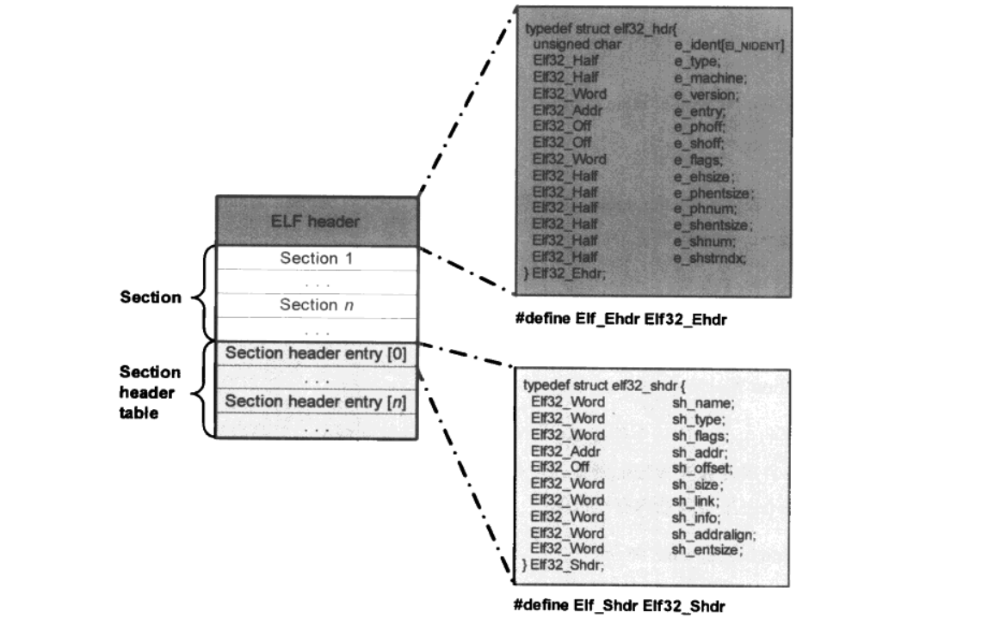

- ELF header：大小为52字节，位于文件头部。

  - e_type：表明文件类型，对于驱动模块，这个值是1，也就是说驱动模块是一个可定位的ELF文件。
  - e_shoff：表明Section header table部分在文件中的偏移量。
  - e_shentsize：表明Section header table部分中每一个entry的大小(byte)。
  - e_shnum：表明Section header table中有多少个entry。因此，Section header table的大小为e_shentsize * e_shnum。
  - e_shstrndx：与Section header entry中的sh_name一起用来指定对应section的name。

- Section：ELF文件的主体，位于文件视图的中间部分的一块连续区域。但是当模块被内核加载的时候，会根据各自的属性被重新分配到新的内存区域(有点section也可能只起辅助作用，因此在运行的时候是不占实际的内存空间的)。

- Section header table：该部分位于文件视图的末尾，由若干个Section header entry组成。

  - sh_addr：这个值用来表示该entry所对应的section在内存中的实际地址。在静态的文件视图中，这个值为0，当模块被内核加载时，加载器会用该section在内存中的实际地址来改写sh_addr，如果section不占内存空间，该值为0。
  - sh_offset：表明section在文件视图中的偏移量。
  - sh_size：表明对应的section在文件视图中的大小(byte)，类型为SHT_NOBITS的section除外，这种section在文件视图中不占空间。
  - sh_entsize：主要用于由固定数量entry组成的表构成的section。如符号表，此情况下用来表示entry的大小。

## 2 EXPORT_SYMBOL的内核实现

如果没有独立存在的内核模块，作为单一的Linux内核映像，导出符号(EXPORT_SYMBOL)就失去了意义，对于静态编译链接而成的Linux内核映像来说，所有的符号引用都在静态链接阶段完成。然而，内核模块不可避免的要使用到内核提供的基础设施(以调用内核函数的形式发生)，作为独立编译链接的内核模块，必须要解决这种静态编译无法完成符号引用的问题(在内核模块所在的ELF文件中，这种引用被称为`未解决的引用`)，**处理`未解决的引用`问题的本质是在模块加载期间找到当前`未解决的引用`符号在内存中的实际地址**。

内核和内核模块通过`符号表`的形式向外部导出符号的相关信息。

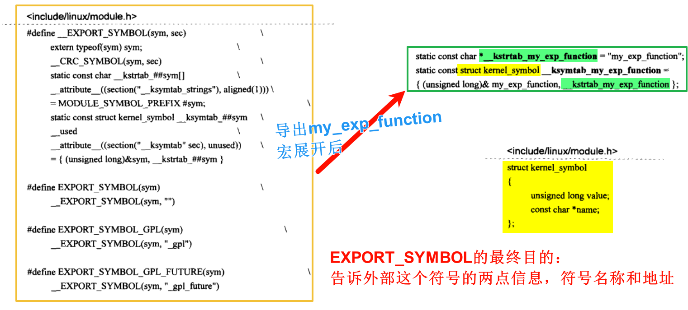

可见，由EXPORT_SYMBOL导出的符号，与一般变量没什么区别，只不过，这些符号被放在了特定的section中。上图中的`__kstrtab_my_exp_function`会被放在一个名为`__ksymtab_strings`的section中，`__ksymtab_my_exp_function`会放置在一个名为`__ksymtab`的section中(对于EXPORT_SYMBOL_GPL和EXPORT_SYMBOL_GPL_FUTRUE而言，struct kerner_symbol实例所在的section名称分别问`__ksymtab_gpl`和`__ksymtab_gpl_future`)。

对这些section的使用要经过一个中间环节，即链接脚本与链接器部分。链接脚本告诉链接器把所有目标文件中名为`__ksymtab`的section放置在最终内核(或者内核模块)映像文件的名为`__ksymtab`的section中(对于EXPORT_SYMBOL_GPL和EXPORT_SYMBOL_GPL_FUTRUE同理)。

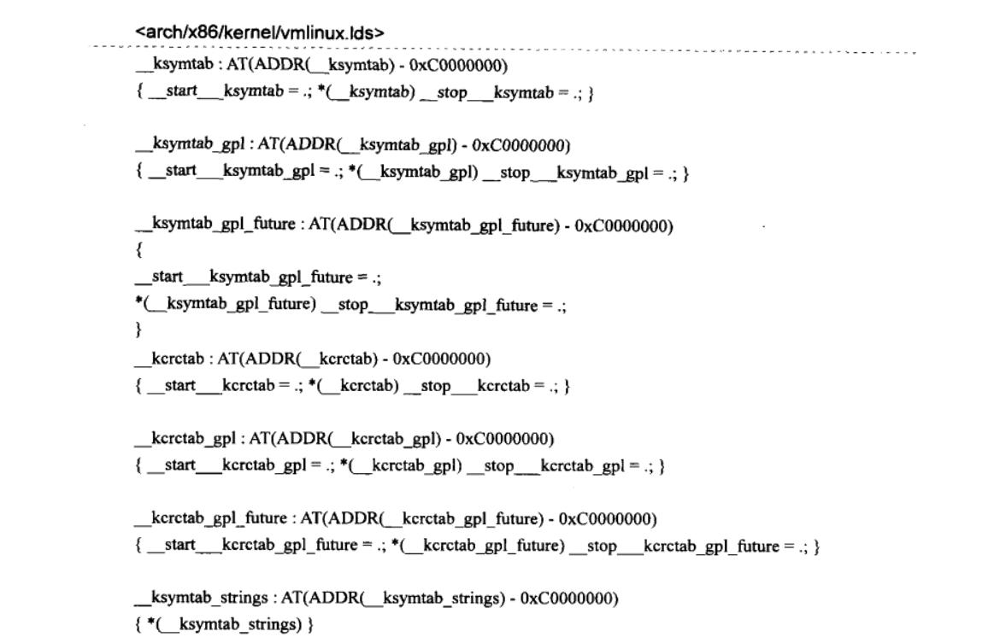

这里之所以要把所有向外界的符号放在一个特殊的section里面，是为了在加载其他模块时用来处理那些`未解决的引用`。注意这里由链接脚本定义的几个变量`__start___ksymtab`、`__stop___ksymtab`、`__start___ksymtab_gpl`、`__stop___ksymtab_gpl`、`__start___ksymtab_gpl_future`、`__stop___ksymtab_gpl_future`，它们会在对内核或者是某一内核模块的导出符号表进行查找时用到。内核源码中为使用这些连接器产生的变量做了如下声明：

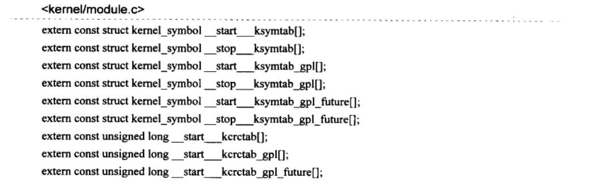

如此，内核代码便可以直接使用这些变量而不会引起编译错误。内核模块的加载器在处理模块`未解决的引用`的符号的时候，会使用到这里定义的这些变量。

## 3 模块的加载过程

在用户空间，用`insmod`这样的命令向内核空间安装一个内核模块。当调用`insmod demodev.ko`来安装demodev.ko这样的内核模块的时候，`insmod`首先会利用文件系统的接口将其数据读取到用户空间的一段内存，然后通过系统调用`sys_init_module`让内核去处理模块加载的整个过程。

为了更清楚的解释魔魁啊加载时的行为，这里把`sys_init_module`函数分为两个部分：

- 第一个部分是调用`load_module`函数，完成模块加载的最核心任务。
- 第二个部分是模块在被成功加载到系统之后的后续处理。

### 3.1 sys_init_module(第一部分)

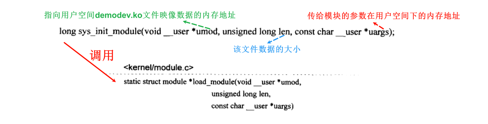

### 3.2 struct module

`load_module`函数的返回值是一个`struct module`类型的指针，该类型是内核用来管理系统中加载的模块时使用的一个非常重要的一个结构体。一个`struct module`对象代表着现实中一个内核模块在Linux系统中的抽象，定义如下：

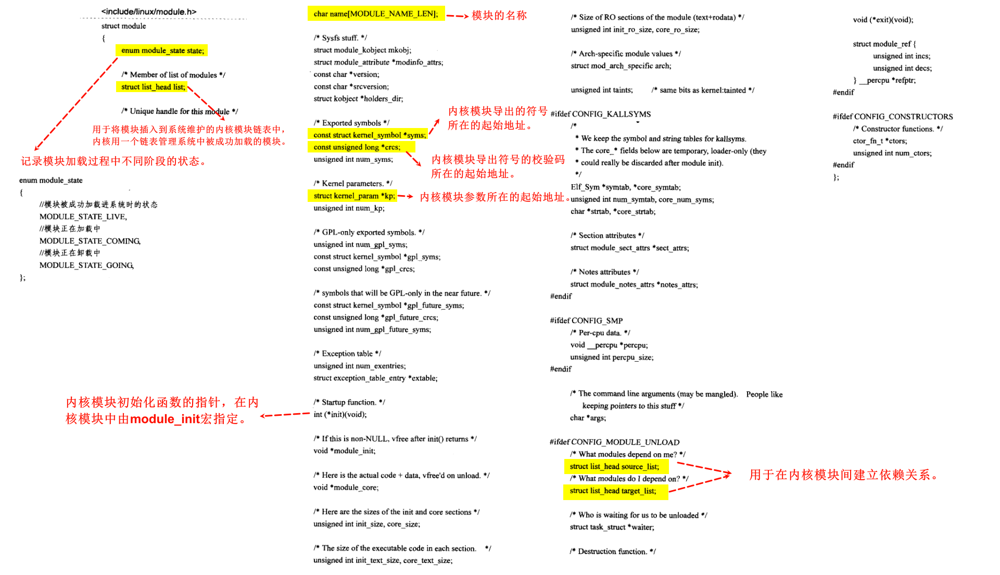

### 3.3 load_module

在这个函数内，我们除了可以了解到内核模块加载的幕后机制之外，还能了解到**内核模块如何调用内核代码导出的函数**，**被加载的模块如何向系统中的其他模块导出自己的符号**，以及**模块如何接收外部的参数**等。

#### 3.3.1 模块ELF静态的内存视图

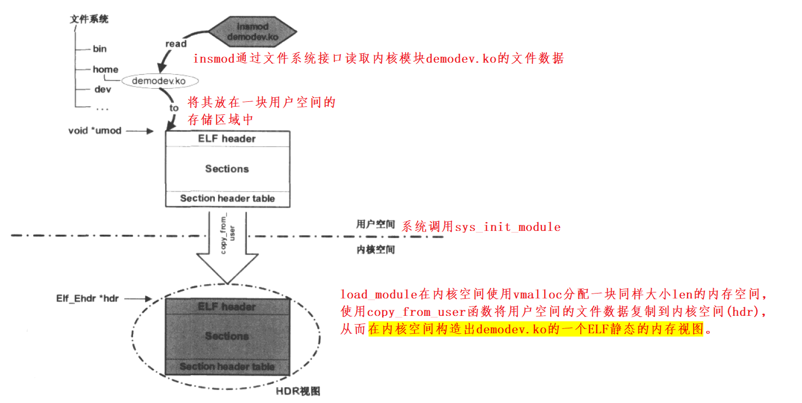

#### 3.3.2 字符串表(String Table)

字符串表是ELF文件中的一个section，用来保存ELF文件中的各个section的名称或符号名。

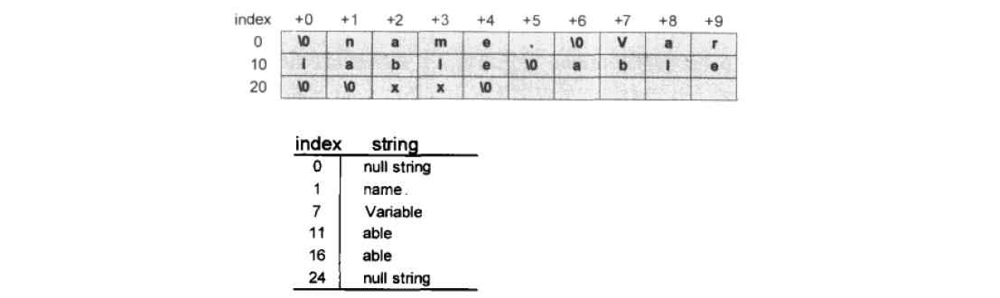

字符串表中各个字符串的构成和C语言的字符串完全一样，都以`\0`作为一个字符串的结束标志，由index指向的字符串是从字符串表的index字符开始，直到遇到一个`\0`标记，如果index处恰好是`\0`，那么index指向的字符串为null。

在驱动程序所在的ELF文件中，一般有两个这样的字符串表section：

- 保存各section名称的字符串。
- 保存符号表中每个符号名称的字符串。

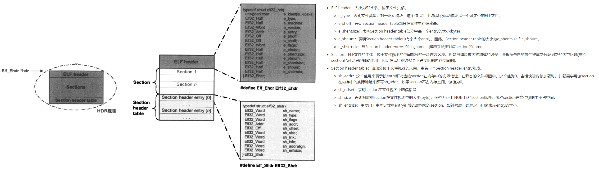

section名称字符串表的基地址：`char *secstrings = (char *)hdr + entry[hdr->e_shstrndx].sh_offset`。

符号名称字符串表的基地址：先遍历所有的entry，找到一个`entry[i].sh_type = SHT_SYMTAB`的entry(表明这个entry所在的section是一个符号表)，`entry[i].sh_link`是符号表字符串表section在`section header table`的索引值。也就是说：符号字符串表所在section的基地址为`char *strtab = (char *)hdr + entry[entry[i].sh_link].sh_offset`。

想要获取某一section的名称(假设该section在section header table的索引值为i，那么直接用secstrings + entry[i].sh_name)即可。

#### 3.3.3 HDR视图的第一次改写

在获取了section名称字符串表的基地址`secstrings`和符号名称字符串表的基地址`strtab`后，函数开始第一次遍历Section header table中的所有entry，将每个entry中的sh_addr改写为`entry[i].sh_addr = (size_t)hdr + entry[i].offset`。这样entry[i].sh_addr将指向该entry所对应的section在HDR视图中的实际存储地址。

在遍历过程中，如果发现CONFIG_MODULE_NOLODAD宏没有定义，表明系统不支持动态卸载一个模块，这样，对于名称为`.exit`的section，将来没有必要把它加载到内存总，内核代码于是清楚对应entry中sh_flags里面的`SHF_ALLOC`标志位。

相对于刚复制到内核空间的HDR视图，HDR视图的第一次改写，只是在自身基础上修改了Section header table中的某些字段，其他方面没有任何变化，在后面的HDR第二次改写中，HDR视图中的绝大部分段会被搬移到一个新的内存空间中，那就是它们在内核中的最终内存位置。

#### 3.3.4 find_sec函数

内核使用这个函数来运行某一section在Section header table中的索引值。

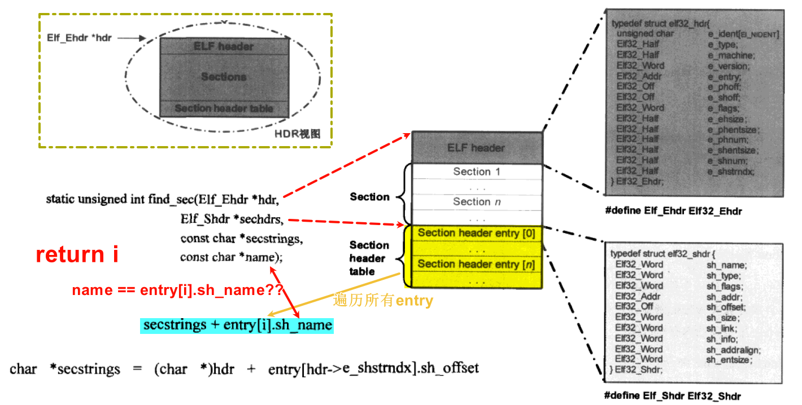

遍历Section header table内的每一个entry(忽略没有SHF_ALLOC标志的section)，对于每一个entry，先找到其对应的section name(secstring + entry[i].sh_name)，然后和参数name进行比较，如果相等，就找到对应的section，并且返回该section在section header table中的索引值。

在进行HDR视图的第一次改写之后，内核调用`find_sec`函数，分别查找以下名称的section：

- .gnu.linkonce.this_module：
- .__versions：
- .modinfo：

查找到的索引值分别保存在`modindex`、`versindex`和`infoindex`中。

#### 3.3.5 struct module类型变量mod初始化

前面提到这个类型是一个表示模块非常重要的结构体，`load_module`函数中定义有一个struct module类型的变量mod，该变量的初始化是通过模块ELF中的`.gnu.linkonce.this_module`的section完成的。

ELF文件中出现这个section是模块的编译工具链完成的，与设备驱动程序无关。

编译后的模块所在目录，会存在一个`.mod.c`为后缀的文件。

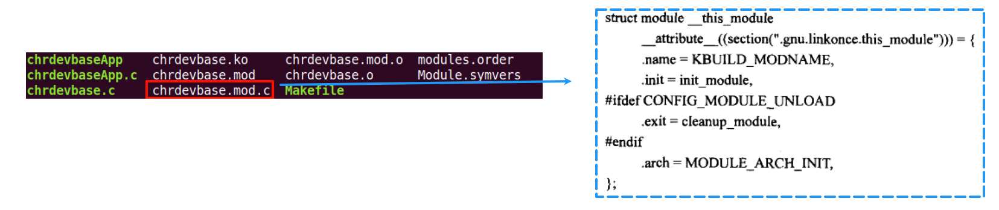

其中，`__attribute((section(".gnu.linkonce.this_module")))`部分很清楚的展示了内核模块ELF文件中`.gnu.linkonce.this_module`section出现的根源。

> [!NOTE]
>
> .init = init_module和.exit = cleanup_module和我们驱动程序中的模块初始化和退出函数并不一致。主要原因就是`module_init`和`module_exit`宏引起的。它们利用了gcc提供的别名技术(\_\_attribute\_\_(alias))。
>
> 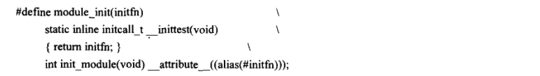
>
> 该宏定义的核心是最后一句，它将`init_module`函数的别名设定为`initfn`。而`initfn`就是我们在设备驱动程序中定义的模块初始化函数。

总之，模块的构造工具链为我们安插了一个`.gnu.linkonce.this_module`的section，并初始化了其中的一些成员，在模块的加载过程中，load_module函数将利用这个section中的数据来初始化mod变量。

模块被加载到内存中之后，内核通过`find_sec`函数查找到`.gnu.linkonce.this_module`section在Section header table中对应的索引值`modindex`，于是就可以通过下面代码来得到`.gnu.linkonce.this_module`section在内存中的实际地址。

```c
mod = (void *)sechdrs[modindex].sh_addr // sechdrs为Section header
```

在第一次改写HDR视图的基础上，mod指针指向了实际struct module所在的内存地址。在HDR视图第二次被改写后，mod指针将会重新指向`.gnu.linkonce.this_module`section在内存中的最终地址。

#### 3.3.6 HDR视图的第二次改写

在这次改写中，HDR视图中的绝大多数section会被搬移到新的内存空间中，之后会根据这些section新的内存地址再次改写HDR视图。使其中Section header table中各个entry的sh_addr指向新的也就是最终的内存地址。

在为那些需要移动的section分配新的内存空间地址之前，内核需要决定处HDR视图中哪些section需要移动，如果移动该移动到什么位置。内核代码中的`layout_sections`函数用来完成这些事情。

`layout_sections`函数中，内核会遍历HDR视图中的每一个section，对于每个标记有`SHF_ALLOC`的section，将其划分为两大类：`CORE`和`INIT`。

为了完成这个分类，`layout_sections`函数首先为标记了`SHF_ALLOC`的section定义了四种类型：`code`,`read-only data`,`read-write data`和`small data`。任何一个标记了`SHF_ALLOC`的section必定属于这四类中的一类。之后，对应的每一个分类，函数都会遍历Section header table中的所有项，将section name不是以`.init`开头的section划归为CORE section，并且修改HDR视图中Section header table中对应entry的sh_entsize。用于记录当前section在CORE section中的偏移量。对于INIT section的分类和CORE section基本一样。

```c
mod->core_size = 0;
mod->init_size = 0;
entry[0]  ---> entry[n] 遍历
    if (section name 开头 != ".init")
        section 划分为 CORE section
        entry[i].sh_entsize = mod->core_size;
		mod->core_size += entry[i].sh_size;
	else // 开头 = ".init"
        section 划分为 INIT section
        entry[i].sh_entsize = mod->init_size;
        mod->init_size += entry[i].sh_size;
```

对于CORE section中的code section，内核用struct moudle结构体中的core_text_size来记录。

对于INITsection中的code section，内核用struct moudle结构体中的init_text_size来记录。

在启用了`CONFIG_KALLSYMS`选项的Linux源码树的基础上编译内核模块，会导致内核模块中也会保留模块中的所有符号，这些符号都放在ELF符号表section中。由于内核模块的ELF文件中，符号表所在的section没有`SHF_ALLOC`标志，所以上面的`layout_sections`函数不会把符号表section进行划分。所以这时候需要一个单独的函数`layout_symtab`来把符号表搬移到CORE section内存区(如果没有`CONFIG_KALLSYMS`宏，该函数为空函数)。

对内核模块ELF文件section进行划分后，内核调用vmalloc相关函数为CORE section和INIT section分配对应的内存空间，基地址分别记录在`mod->module_core`和`mod->module_init`中，然后对section数据进行搬移。搬移完成后需要修改HDR视图中的section header table中对应entry的sh_addr，来指向新的地址。

> [!NOTE]
>
> 由于此时`.gnu.linkonce.this_module`section是一个带有`SHF_ALLOC`标志的可写数据section，也会被搬移到CORE section内存空间中，所以也要对应修改mod 变量指向新的内存地址。
>
> ```c
> mod = (void *)entry[modindex].sh_addr;
> ```

这里之所以要对HDR视图中的某些section进行这样的搬移，是因为在模块加载过程结束后，系统会释放掉HDR视图所在的内存区域，不仅如此，在模块初始化完成后，INIT section所在的内存区域也会被释放掉。由此可见，当一个模块被成功加载进系统，初始化工作完成后，最终留下来的只有**CORE section**中的内容。

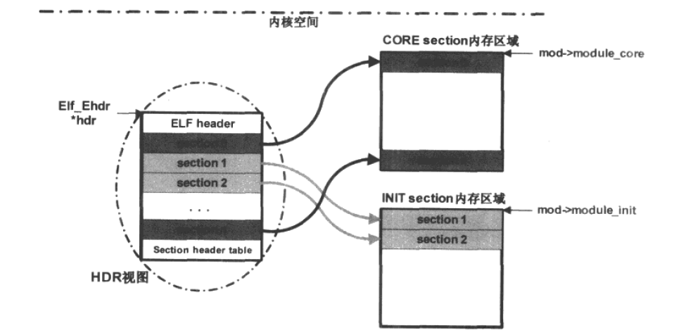

#### 3.3.7 模块导出的符号

由前面内容可知，内核模块会把导出符号分别放在`__ksymtab`、`__ksymtab_gpl`和`__ksymtab_gpl_future`section中。

如果一个内核模块向外界导出了自己的符号，那么将由内核的编译工具链负责生成这些导出符号的section，而这些section都带有`SHF_ALLOC`标志，所以在模块加载过程中会被搬移到CORE section中，如果模块没有导出任何符号，将不会产生这些section。

内核需要对模块导出的符号进行管理，以便在处理其他模块中那些`为解决的引用`符号时能找到这些符号，内核对模块导出的符号的管理使用了struct module结构体中如下的成员变量：

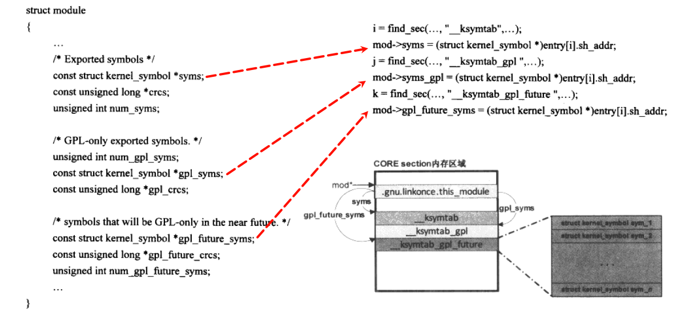

#### 3.3.8 find_symbol函数

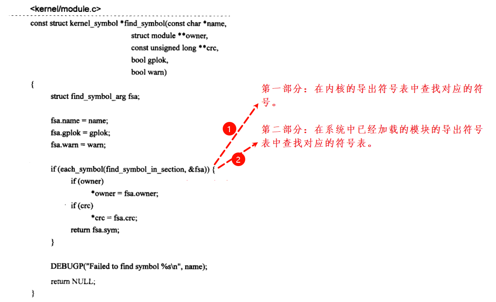

第一部分大致流程如下：

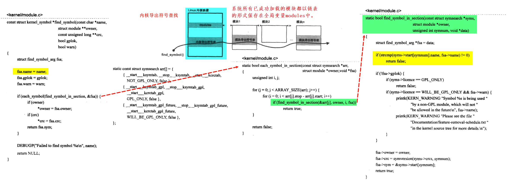

首先会调用`each_symbol_in_section`函数，主要在`arr[]`(struct symsearch类型的导出符号表)中的每一个`kernel_symbol`都去调用`find_symbol_in_section`函数去匹配符号(根据name)。

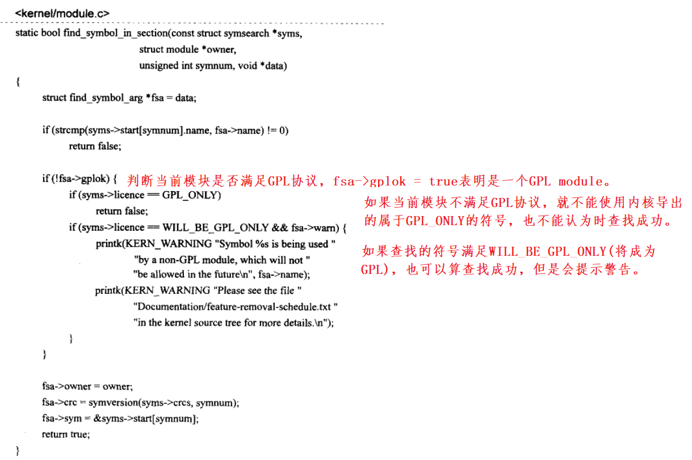

第二部分，要想实现第二部分，啮合需要在加载一个内核模块的时候完成下面两件事：

①模块成功加载后，需要将表示该模块的strut module类型变量mod加入到变量`modules`中，该变量为一个全局的链表变量。用来记录系统中所有已加载的模块。

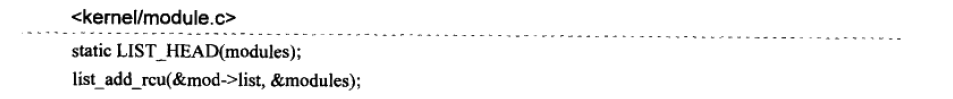

②模块导出的符号信息记录在mod的相关成员变量中。该过程见3.3.7。

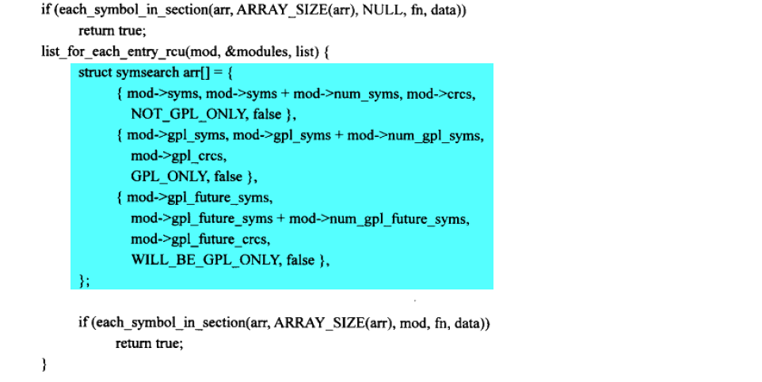

相对于find_symbol的第一部分(在内核导出的符号表中查找某一符号)，第二部分唯一的区别在于构造arr数组。函数在全局链表modules中遍历所有已经加载的内核模块，对其中的每一模块都构造一个新的arr数组，然后跟第一部分一样的流程去查找特定的符号。

#### 3.3.9 对“未解决的引用”符号的处理

所谓的“为解决的引用”符号，就是模块的编译工具链对模块进行连接生成最终的.ko文件时，对于模块中调用的一些函数，比如printk函数，链接工具无发在该模块的所有目标文件中找到这个函数的具体指令码(因为这个函数实在Linux的内核源码中实现的，指令码存在于编译内核生成的目标文件中，模块的链接工具肯定不会也不应该去查找内核的目标文件)，所以就会将这个符号标记为“未解决的引用”，对他的处理将一直延续到内核模块被加载的时候(处理的核心时**在内核或者时其他内核模块导出的符号中去找到这个“未解决的引用”符号，继而找到该符号所在的内存地址，从而实现正确的函数调用**)。

Linux内核中，使用`simplify_symbols`的函数来实现这个功能。


#### 3.3.10 重定位


#### 3.3.11 模块参数

内核模块在用insmod命令加载的时候，可以通过以下的命令向模块传递一些参数：

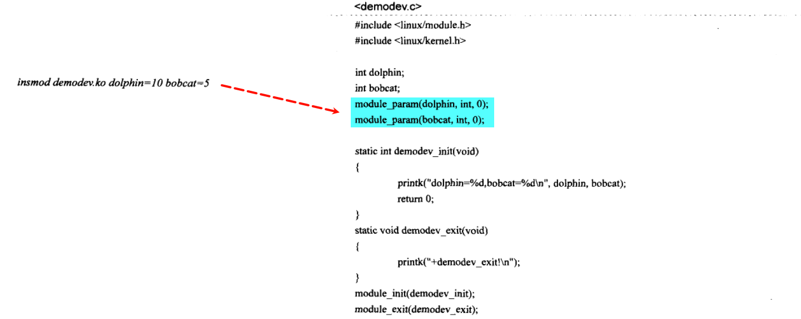

内核模块加载器对模块参数的构造(初始化)过程发生在对模块初始化函数`demodev_init`的调用之前，所以在`demodev_init`的调用时，已经得到了从命令行传递过来的实际参数。

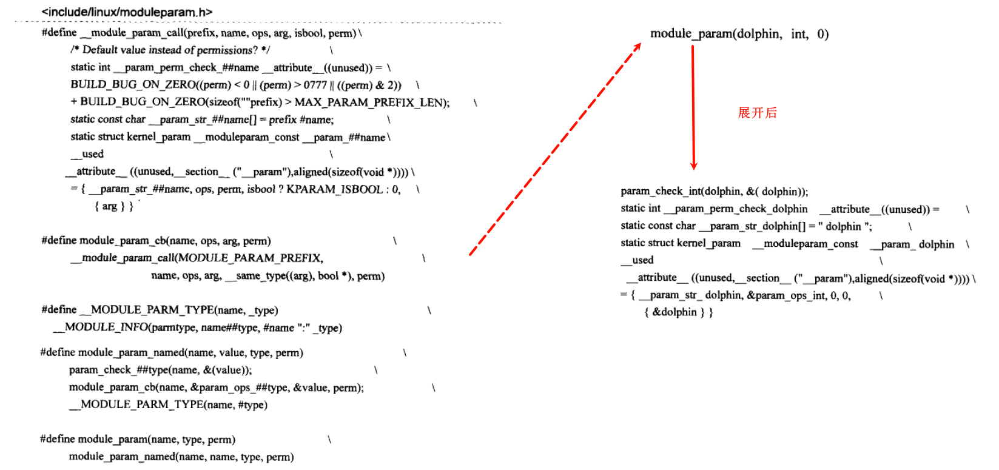

# 未完成