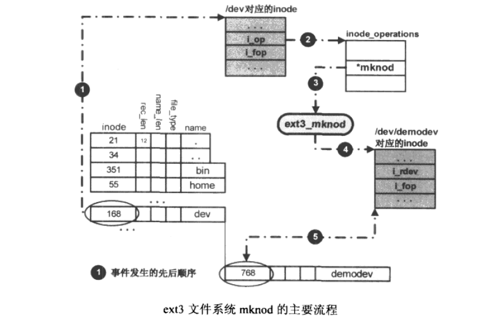
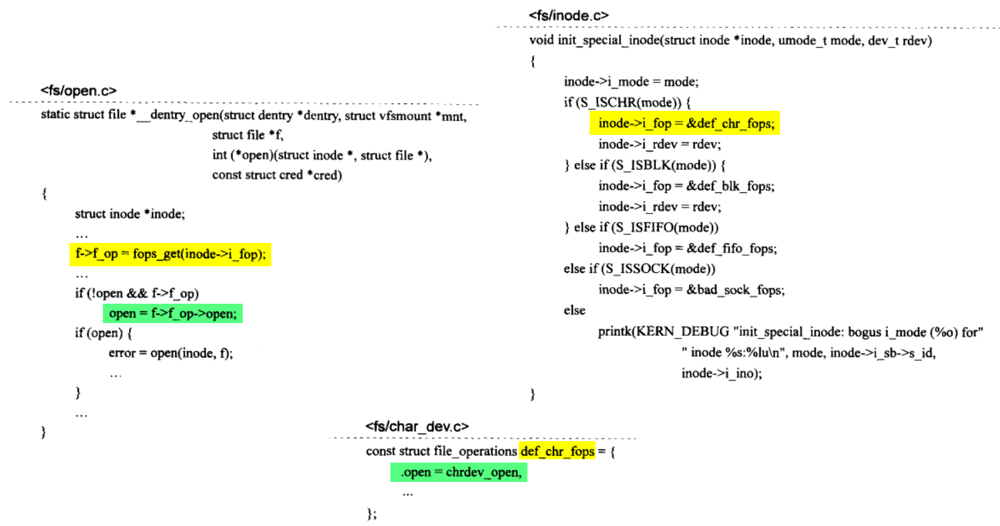

# 字符设备驱动程序


## 1 应用程序和设备驱动程序互动实例

## 2 struct file_operations


该结构体中唯一的非函数指针成员owner，表示当前struct file_operations对象所属的内核模块，几乎所有的设备驱动程序都会使用THIS_MODULE宏给owner赋值，该宏的定义为：


__this_module是内核模块的编译工具链为当前模块产生的struct module类型对象，所以THIS_MODULE实际是当前内核模块对象的指针，file_operations中的owner成员可以避免当file_operation中的函数正在被调用时，其所属的模块被从系统中卸载掉。如果一个设备驱动不是以模块的形式存在，而是被编译进内核，那么THIS_MODULE将被赋值为空指针，没有任何作用。

## 3 字符设备的内核抽象


- kobj：内嵌的内核对象。
- owner：字符设备所在的内核模块对象指针。
- ops：字符设备驱动程序中一个极关键的数据结构，起着应用程序和驱动程序交互的纽带作用。
- list：用来将系统中的字符设备形成链表。
- dev：字符设备的设备号，由主设备号和次设备号组成。
- count：隶属于同一主设备号的次设备号的个数，表示由当前设备驱动程序控制的实际同类设备的数量。

### 3.1 字符设备的产生

1. 静态定义的方式：`static struct cdev chr_dev;`。

2. 动态分配的方式：`static struct cdev *pchar_dev = cdev_alloc();`。


> [!NOTE]
>
> 内核引入struct cdev数据结构作为字符设备的抽象，仅仅是为了满足系统对字符设备驱动程序框架结构设计的需要，现实中一个具体的字符硬件设备的数据结构抽象要复杂的多，在这种情况下，struct cdev常常作为一种内嵌的成员变量出现在实际设备的数据结构中(类似与c++的继承)。如：
>
> ```c
> struct my_keypad_dev {
>  // 硬件相关的成员变量
>  int a;
>  int b;
>  ....;
> 
>  // 内嵌的struct cdev结构体
>  struct cdev cdev;
> };
> ```
>
> 在这种情况下，将只能使用`static struct my_keypad_dev *pmy_keypad_dev  = kzalloc(sizeof(struct my_keypad_dev), GFP_KERNEL);`来进行动态分配。

### 3.2 字符设备初始化


## 4 设备号的构成与分配

### 4.1 设备号构成

Linux系统中一个设备号由主设备号个次设备号组成，Linux内核用主设备号来定位对应的设备驱动程序，而次设备号由驱动程序使用，用来标识它所管理的若干同类设备。Linux用`dev_t`类型变量来表示一个设备号，该类型为32位无符号整数。


在Linux版本2.6.39中，dev_t的低20位用于表示次设备号，高12位用于表示主设备号。


### 4.2 设备号的分配与管理

在内核源码中，涉及到设备号分配与管理的函数主要有以下两个：

#### 4.2.1 register_chrdev_region函数


- from：设备号。
- count：连续设备编号的个数。代表当前驱动程序所管理的同类设备的个数。
- name：设备或者驱动程序的名称。

`register_chrdev_region`函数的核心是调用`__register_chrdev_region`函数。

对于字符设备的管理，**chrdevs数组**是用内核用于设备号分配和管理的核心元素，定义如下：


这里以一个具体的例子演示设备号的管理过程：


在chrdevs数组处于初始化情形下，有一个驱动程序要使用的设备号是257，次设备号是0，1，2，3（意味着该驱动程序将管理四个同类型的设备），由于257 % CHRDEV_MAJOR_HASH_SIZE = 2，所以会在chrdevs[2]生成节点。当出现另一个设备驱动程序使用主设备号2，次设备号为0时，由于257 % CHRDEV_MAJOR_HASH_SIZE = 2，所以任然在chrdevs[2]生成节点，虽然chrdevs[2]中已经有"demodev"设备在使用，但是因为这次注册的是MKDEV(2, 0)，与设备"demodev"的设备号MKDEV(257, 0)并不冲突，所以会插入chrdevs[2]链表中进行管理，同一哈希表将按照major的大小**递增排序**。

> [!NOTE]
>
> 1. 当出现一个设备驱动，注册的主设备号也为257，那么只要其次设备号所在范围[baseminor, baseminor + minorct]不与设备"demodev"的次设备号范围发生重叠，系统仍然会生成一个struct char_device_struct节点并加入到哈希链表进行管理(chrdevs[2])。
> 2. 当出现一个设备驱动，注册的主设备号也为257，并且次设备号所在范围与"demodev"的次设备号范围发生重叠，则意味有设备号冲突，这将导致register_chrdev_region函数调用失败。
> 3. 对于主设备号相同的若干struct char_device_struct对象，当系统将其加入到链表的时候，会根据其baseminor成员的大小进行**递增排序**。


#### 4.2.2 alloc_chrdev_region函数

该函数由系统协助分配设备号，分配的主设备号范围为[1, 254]之间。其定义如下：


该函数的核心也是调用`__register_chrdev_region`但是传入的第一个参数(主设备号)为0，这样就会执行下面的代码：


主要实现原理为：在for循环中，从chrdevs数组的最后一项(254项)依次向前扫描。如果发现数组中的某项，比如第i项，对应的数值为NULL，那么就把该项对应的索引值i作为分配的主设备号返回给应用程序，同时生成一个char_dev_struct节点，将其加入到chrdevs[i]对应的哈希链表中进行管理。如果从数组中的254项到第1项，这其中所有的项对应的值都不是NULL，那么函数就会执行失败返回非0值。表示动态设备号分配失败。如果分配成功，分配的设备号就会保存在char_device_struct对象cd中，然后返回给alloc_chrdev_region函数，通过`*dev = MKDEV(cd->major, cd->baseminor);`将新分配的设备号返回给函数调用者。

### 4.3 设备号的释放

不管是`register_chrdev_region`函数还是`alloc_chrdev_region`函数注册或者分配的设备号，都是使用`unregister_chrdev_region`函数进行释放。


该函数主要是在chrdevs数组中查找from和count所对应的struct char_device_struct对象节点，找到后将其从链表中删除并且释放该节点所占用的内存。

## 5 字符设备的注册


字符设备的注册使用`cdev_add`来实现。其中参数p为要加入系统的字符设备对象的指针。dev为该设备的设备号，count表示从次设备号开始连续的设备数。

`cdev_add`的核心通过`kobj_map`函数来实现，通过操作全局变量`cdev_map`(Linux系统启动器件由`chrdev_init`为其进行初始化)来把设备(*p)加入到其中的哈希链表中。

```c
int kobj_map(struct kobj_map *domain, dev_t dev, unsigned long range,
             struct module *module, kobj_probe_t *probe,
             int (*lock)(dev_t, void *), void *data)
```

`kobj_map`函数中的哈希表的实现原理和上述字符设备的分配几乎完全一样。通过要加入系统的设备的主设备号major(major = MAJOR(dev))来获取probes数组的索引值i(i = major % 255)，然后把一个类型为struct probe的节点对象加入到probes[i]所管理的链表中。下图为两个主设备号major % 255 = 2 的字符设备通过调用`cdev_add`函数后的示意图：


其中，struct probe图中矩形框中`深色部分`为特别需要关注的。记录了当前正在加入系统的字符设备对象的有关信息。其中dev为设备的设备号，range是从次设备号开始连续的设备数量，data是void *变量，指向当前正要加入系统的设备对象指针p。

简单来说，设备驱动程序通过调用`cdev_add`函数把它管理的字符设备对象的指针(struct cdev *)嵌入到一个类型为struct probe的节点之中，然后再将这个节点放入到全局变量`cdev_map`的probes数组中哈希链表进行管理。

对系统而言，当设备驱动程序成功调用了`cdev_add`函数后，就意味着一个字符设备已经加入了系统，在需要的时候，系统就可以找到它。对于用户态的程序来说，`cdev_add`调用之后，就可以通过文件系统的接口呼叫到驱动程序了。

与`cdev_add`对应的函数为`cdev_del`，用于移除struct probe类型的节点，然后释放节点使用的内存空间。


## 6 设备文件节点的生成(静态创建)

在Linux系统下，设备文件是种特殊的我文件类型，其存在的主要意义时沟通用户空间程序和内核空间程序。用户空间的应用程序要想使用到驱动程序提供的服务，需要经过设备文件来完成。当然，如果驱动程序只是为内核中的其他模块提供服务，那么可以不用生成对应的设备文件。

按照通用的规则，Linux系统的所有设备文件都位于`/dev`目录下。


Linux系统下，`mknod`命令最终是调用`mknod`函数来实现的，调用时的重要参数有两个：

- 设备文件名("/dev/demodev")：主要在用户空间使用(比如调用open函数的时候)。
- 设备号(makedev(30, 0))：由用户空间`mknod`命令构造出的设备号。

在用户空间由设备文件名表示文件，在内核空间使用inode来表示相应的文件。对于`mknod`命令，最终会通过系统调用`sys_mknod`函数进入内核空间。


`sys_mknod`系统调用将通过`/dev`目录上挂载的文件系统接口来为"/dev/demodev"生成一个新的inode，设备号将会记录在这个新的inode上。



文件系统和驱动程序是如何建立联系的：

- `sys_mknod`函数首先在根文件系统ext3的根目录`/`下寻找dev目录对应的inode。图中对应的inode编号为168，ext3文件的实现会通过某种映射机制，通过inode编号最终得到该inode在内存中的实际地址(图中①表示)。
- 通过dev的inode结构体中的i_op成员指针所指向的`ext3_dir_inode_operations`(这是个struct inode_operations类型的指针)，来调用该对象的`mknod`方法，也就是调用**ext3_mknod**函数。

**ext3_mknod**函数的主要作用是生成一个新的inode(用来在内核空间表示demodev设备文件节点，demodev设备节点文件与新生成的inode之间的关系由上图⑤表示)，在`ext3_mknod`函数中会调用一个和设备驱动程序关系密切的**init_special_inode**函数，定义如下：


该函数最主要的功能就是为新生成的inode初始化其中的`i_fop`和`i_rdev`成员：

- i_fop：根据具体的类型初始化为字符设备还是其他设备类型。(主要定义了一个**open**操作)
- i_rdev：表示inode节点对应的设备号。

## 7 字符设备文件的打开操作

对于前面的`/dev/demodev`设备，假设驱动程序中实现的struct file_operations如下：


两者差异还是很大的，用户程序调用open函数返回的文件描述符(用fd表示)，这是一个int型的变量，会被用户程序后续的read、write和ioctl等函数所使用。同时可以看到，在驱动程序中demodev_read、demodev_write和demodev_ioctl等函数其第一个参数都是`struct file *filp`。显然内核**需要在打开设备文件的时为fd和filp建议某种联系**，其次就是为**filp与驱动程序中的fops建立关联**。

用户空间程序调用open函数，将发起一个系统调用，通过sys_open函数进入内核空间。


`do_sys_open`函数首先通过`get_unused_fd_flags`为本次的open操作分配一个未使用过的文件描述符。


`do_sys_open`函数随后调用`do_filp_open`函数，该函数首先会查找"/dev/demodev"设备文件对应的inode。在成功查找到inode后，会调用`get_empty_filp`函数为每个打开的文件分配一个新的struct file类型的内存空间。内核用struct file对象来描述进程打开的每一个文件视图，即使是打开的同一文件，内核也会为之生成一个新的struct file对象，用来表示当前操作的文件相关信息。


struct file结构体中最重要的内容为f_op、f_count、f_flags、private_data：

- f_op：该成员变量指针类型为struct file_operations，正好字符设备struct cdev里面也存在此数据类型，后面将展示这两者之间是如何建立联系的。
- f_count：用于对struct file对象的使用计数，当close一个文件的时候，只有这个值为0的时候才是真正的关闭文件。
- f_flags：用于记录文件被open的时候的打开模式，该成员将会影响read/write等函数的行为模式。
- private_data：常用来记录设备驱动自身定义的数据，因为struct file结构体(filp)会在file_operations对象的其他成员函数之间传递，可以通过struct file结构体中的private_data成员来实现共享数据。

每一个进程为文件操作维护了一个文件描述符表(current->files->fdt)，对设备文件的打开，会得到一个文件描述符fd，然后该描述符fd作为进程维护的文件描述符表(指向struct file *类型的数组)的索引值，将之前新分配的struct file空间地址赋值给它。


在`do_sys_open`函数的后半部分会调用`__dentry_open`函数将"/dev/demodev"对应节点的inode中的i_fop赋值给f_op。然后调用i_fop中的open函数：



根据前面设备节点生成章节，最终得出`__dentry_open`函数最终会调用到**chrdev_open**函数(非常重要)。


该函数首先通过`kobj_lookup`函数在cdev_map中根据inode->i_rdev来查找设备号对应的设备`new`。成功查找到设备后，通过`filp->f_op = new->ops`这行代码来将字符设备对象中的ops指针(字符设备驱动程序实现的ops)赋值给struct file结构体(filp)的f_op成员。接下来会检测驱动程序中是否实现open函数，实现则运行。

打开一个字符设备的流程大致如下：


图中，当应用程序打开一个设备文件时，将通过系统调用 sys_open 进入内核空间。在内核空间将主要由 do_sys_open 函数负责发起整个设备文件打开操作，它首先要获得该设备文件所对应的 inode，然后调用其中的i_fop函数，对字符设备节点的 inode 而言，i_fop 函数就是 chrdev_open(图中标号1的线段)，后者通过node 中的i_rdev 成员在 cdev_map 中查找该设备文件所对应的设备对象 cdev (图中标号 2段)，在成找到了该设备对象之后，将 inode 的i_cdev 成员指向该字符设备对象(图中标号3 的线段)，这样下次再对该设备文件节点进行打开操作时，就可以直接通过 cdev 成员得到设备节点所对应的字符设备对象，而无须再通过 cdev_map 进行查找。内核在每次打开一个设备文件时，都会产生一个整型的文件描述符 fd 和一个新的struct file 对象 filp 来跟踪对该文件的这一次操作在打开设备文件时，内核会将 flp 和 fd 关联起来，同时会将 cdev 中的 ops 赋值给 filp->f_op (图中标号 4 的线段)。最后，sys_open 系统用将设备件述符 fd 返到用户空间，如此在用户空间对后续的文件操作 read、write 和 ioct 等函数的调用，将会通过该fd 获得文件所对应的 filp，根据 filp 中的 f_op 就可以调用到该文件所对应的设备驱动上实现的函数。

## 8 字符设备的文件关闭操作

### 8.1 filp_close函数

close函数的系统调用函数为sys_close，核心代码如下：


在根据fd得到filp后会调用`filp_close`函数：

1. 判断file_count(filp)，如果针对同一设备文件close的次数多于open的次数就会出现此情况，此时函数直接返回为0。
2. 判断驱动是否实现flush函数，如果定义了，将会在release之前调用，调用flush函数的目的主要是为了确保在关闭文件前缓存在系统的数据能被真正的写回硬件，字符设备很少会出现这种情况，块设备驱动中会容易使用到。
3. 最终会调用`fput`函数。

### 8.2 fput函数


