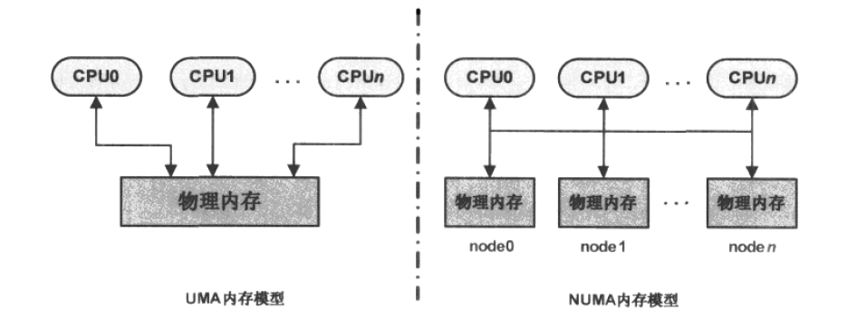

# 内存管理

## 1 物理内存的管理

Linux系统在对物理内存的定义方面，引入了内存节点(node)、内存区域(zone)、内存页(page)的概念。对物理内存的管理总体上分为两部分：最底层实现的页面级内存管理，然后时基于页面级管理之上的slab内存管理。

### 1.1 内存节点 node

内存节点的引入，是因为Linux系统最大程度的兼容性，将UMA系统和NUMA系统统一起来。UMA是只有一个内存节点的系统。

- UMA(一致内存访问，Uniform Memory Access)内存模型：该模型的内存空间在物理上也许是不连续的(比如空洞的存在)，但所有的内存空间对系统中的处理器而言具有相同的访问特性，即系统中所有的处理器对这些内存具有相同的访问速度。
- NUMA(非一致内存访问，Non-Uniform Memory Access)内存模型：使用这种模型的总是多处理器系统，系统中的各个处理器都有本地内存，处理器与处理器之间通过总线连接起来以支持对其他处理器本地内存的访问，与UMA模型不同的是，处理器访问本地内存的速度要快于对其他处理器本地内存的访问。

Linux源码中以struct pglist_data数据结构来表示单个内存节点。对于NUMA模型，多个内存节点通过链表串联起来。UMA模型因为只有一个内存节点，所以不存在这样的链表。

### 1.2 内存区域 zone

### 1.3 内存页 page

# 未完成